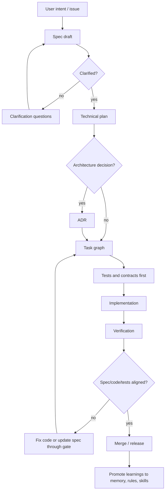
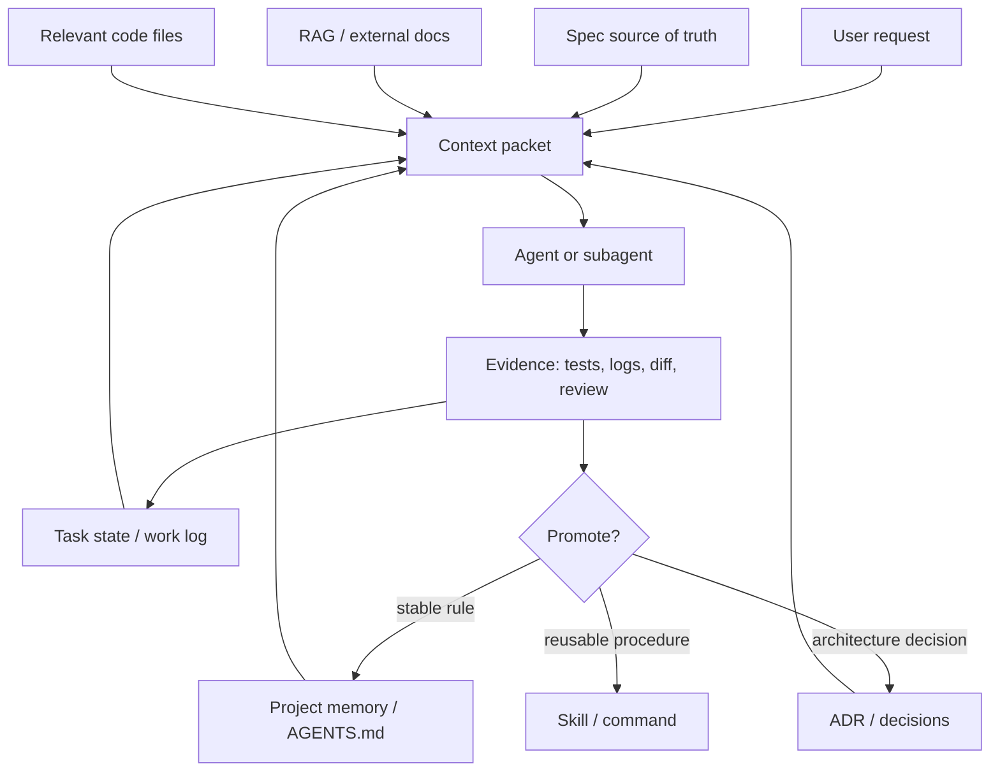
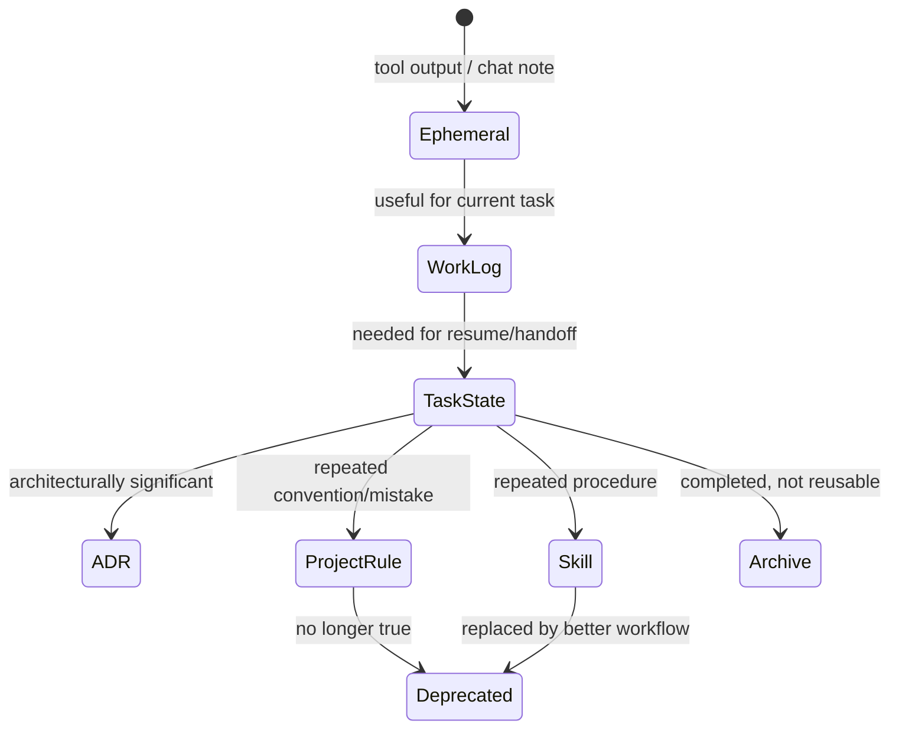
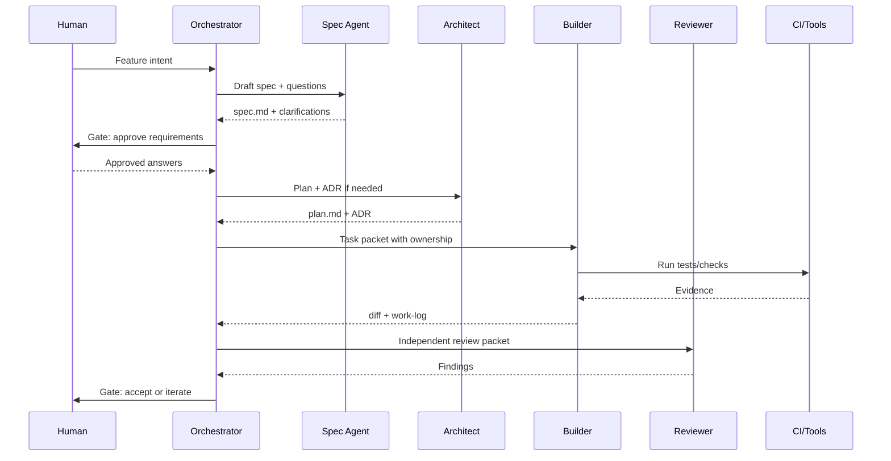

# Агентская разработка в подходе SDD

Дата исследования: 2026-05-17  
Область: общий подход к Specification-Driven Development для AI coding agents; адаптация под Qwen CLI предполагается отдельным следующим шагом.

## 1. Краткий вывод

Корректная агентская разработка в SDD строится не вокруг "умного промпта", а вокруг **системы артефактов, контекстных контрактов и проверочных циклов**. Спецификация становится первичным источником истины, агент получает только релевантный контекст под текущий шаг, реализация идет малыми проверяемыми задачами, а независимая верификация сравнивает код, тесты и спецификацию.

Минимально жизнеспособная модель:

```text
specification -> plan -> tasks -> tests/contracts -> implementation -> verification -> spec/memory update
```

Лучшие практики сходятся к нескольким принципам:

- SDD должен производить версионируемые Markdown-артефакты и контракты, а не оставаться историей чата.
- Агентам нужно давать **context packet**, а не "весь репозиторий".
- Project memory, skills, agents, commands, ADR и work logs должны быть разными слоями, а не одним большим файлом.
- Subagents полезны для изоляции контекста, но финальная оценка должна быть независимой.
- Human gates нужны на спецификации, архитектурных решениях, опасных действиях и приемке.
- Security, privacy, observability и NFR должны попадать в спецификацию до реализации, иначе агент оптимизирует в основном функциональную корректность.

## 2. Что такое SDD в агентской разработке

**Specification-Driven Development** в контексте AI coding agents - это процесс, в котором спецификации, acceptance criteria, архитектурные решения, контракты, задачи и тесты являются рабочими входами для агента и проверяемыми артефактами проекта.

В отличие от ad-hoc agent prompting:

| Подход | Главный вход | Риск | Контроль |
|---|---|---|---|
| Ad-hoc prompting | Текущий запрос в чате | Агент додумывает требования | Ручная проверка результата |
| Vibe coding | Интерактивное уточнение на лету | Drift и скрытые архитектурные решения | Частичная проверка после кода |
| SDD | Версионируемая спецификация и контракты | Неполная или устаревшая spec | Traceability, gates, tests, ADR |

GitHub Spec Kit формулирует SDD как workflow `Spec -> Plan -> Tasks -> Implement`, где каждый этап производит Markdown-артефакт, который питает следующий этап структурированным контекстом: https://github.github.io/spec-kit/ и https://github.com/github/spec-kit.

## 3. Целевая архитектура процесса



### 3.1 Основные фазы

| Фаза | Цель | Основной артефакт | Gate |
|---|---|---|---|
| Intake | Зафиксировать бизнес-цель, пользователя, scope/non-scope | `request.md` или issue | Product/owner approval |
| Specify | Описать поведение без реализации | `spec.md`, `requirements.md` | Нет `[NEEDS CLARIFICATION]` для critical paths |
| Clarify | Закрыть неоднозначности | `clarifications.md` или секция в spec | Human answer required |
| Plan | Выбрать технический путь | `plan.md`, `research.md`, `data-model.md` | Tech review |
| Decide | Зафиксировать значимые trade-offs | `docs/adr/*.md` | ADR accepted |
| Task | Разбить на проверяемые шаги | `tasks.md` | Dependencies and ownership clear |
| Verify-first | Сформировать тесты/контракты | `test-plan.md`, `contracts/`, tests | Expected failing tests or explicit exception |
| Implement | Изменить код малыми партиями | diff | Relevant checks pass |
| Evaluate | Независимо проверить соответствие spec | review report | Findings resolved or accepted |
| Learn | Обновить правила и память | `AGENTS.md`, skills, ADR, docs | Maintainer review |

## 4. Рекомендуемая структура репозитория

Это общий переносимый baseline. Для конкретных инструментов часть файлов будет дублироваться или импортироваться в tool-specific paths.

```text
repo/
  AGENTS.md                         # Cross-tool инструкции для coding agents
  CONVENTIONS.md                    # Стиль, соглашения, локальные команды

  docs/
    sdd/
      constitution.md               # Непереговорные инженерные принципы
      workflow.md                   # Как команда ведет SDD
      context-management.md         # Политика контекста и памяти
      gates.md                      # Definition of Ready/Done/Gates

    specs/
      0001-feature-name/
        spec.md                     # What/why/scope/user stories
        requirements.md             # EARS/Gherkin/acceptance criteria
        plan.md                     # Technical approach
        research.md                 # Alternatives and constraints
        data-model.md               # Entities, invariants, migrations
        test-plan.md                # Unit/integration/e2e/property/contract
        tasks.md                    # Task graph and ownership
        quickstart.md               # Manual verification scenarios
        task-state.md               # Current execution state
        work-log.md                 # Compact evidence log
        handoff.md                  # Contract for next agent
        contracts/
          openapi.yaml
          events.asyncapi.yaml

    adr/
      0001-record-architecture-decisions.md

  .agent/
    skills/                         # Portable skill source of truth, if adopted
      sdd-spec-review/SKILL.md
      sdd-plan/SKILL.md
      sdd-test-gap/SKILL.md
    agents/
      planner.md
      implementer.md
      reviewer.md
      security-reviewer.md
    commands/
      sdd-specify.md
      sdd-plan.md
      sdd-implement.md
      sdd-review.md

  .qwen/                            # Future Qwen adaptation
    commands/
    skills/
    agents/

  .claude/                          # Optional Claude adaptation
    skills/
    agents/

  .cursor/
    rules/
```

## 5. Контекстная архитектура

Контекст в агентской SDD надо проектировать как входные данные production-системы: ограниченные, версионируемые, проверяемые и воспроизводимые. Anthropic описывает context engineering как управление всем набором токенов, который попадает в inference, включая инструкции, tools, MCP, внешние данные и историю: https://www.anthropic.com/engineering/effective-context-engineering-for-ai-agents.

### 5.1 Слои контекста



| Слой | Что хранит | Где хранить | Когда грузить |
|---|---|---|---|
| Source of truth | Требования, acceptance criteria, scope | `docs/specs/**/spec.md` | Всегда для текущей feature |
| Decision memory | Почему выбрали архитектурный путь | `docs/adr/*.md` | Когда затронут boundary/stack/data |
| Project memory | Команды, conventions, ограничения | `AGENTS.md`, `CONVENTIONS.md` | В начале сессии |
| Procedure memory | Повторяемые workflow | `SKILL.md`, commands | По требованию или auto trigger |
| Runtime state | Что сделано сейчас | `task-state.md`, `work-log.md` | Для handoff/resume |
| Retrieval context | Большие docs/API/policies | RAG/vector/file search | Just-in-time |
| Evidence | Проверки, результаты, diff | logs, CI, review report | На gate/evaluator |

OpenAI Agents SDK явно различает local runtime context и LLM-visible context: локальный объект доступен tools/hooks, но не отправляется модели; LLM видит только то, что попало в instructions/input/tools/retrieval/history: https://openai.github.io/openai-agents-python/context/.

### 5.2 Context Packet

Перед каждым существенным запуском агент должен получать небольшой структурированный пакет:

```md
# Context Packet

## Goal
Implement requirement REQ-3.2: ...

## Current phase
Implementation / verification / review

## Source of truth
- Spec: docs/specs/0001-feature/spec.md#req-3-2
- Plan: docs/specs/0001-feature/plan.md
- ADR: docs/adr/0007-auth-boundary.md

## Acceptance criteria
- AC-1 ...
- AC-2 ...

## Constraints
- Do not change public API except endpoints listed in plan.
- Preserve backward compatibility for existing clients.

## Relevant files
- src/...
- tests/...

## Current state
- Done: ...
- Not done: ...
- Blockers: ...

## Verification commands
- npm test -- ...
- npm run typecheck

## Output required
- Changed files
- Tests run
- Spec compliance notes
- Residual risks
```

### 5.3 Context budget

Практическая эвристика:

| Budget | Содержимое |
|---|---|
| 20-30% | Spec, acceptance criteria, current task state |
| 20-30% | Релевантные файлы кода |
| 10-20% | ADR, project rules, conventions |
| 10-20% | Retrieved docs/API/policies |
| 10-15% | Recent tool outputs and evidence |
| Reserve | Output budget и место для новых tool results |

Не стоит заполнять окно "до отказа". Исследование Lost in the Middle показывает, что качество использования длинного контекста может снижаться в зависимости от позиции и объема информации: https://arxiv.org/abs/2307.03172. Практический вывод: лучше маленький high-signal packet, чем огромный dump.

### 5.4 Compaction protocol

Compaction должна сохранять не "краткую историю", а инварианты разработки:

- требования и acceptance criteria;
- архитектурные решения и причины;
- выполненные/невыполненные задачи;
- измененные файлы;
- проверенные факты;
- команды и результаты проверок;
- unresolved bugs/blockers;
- что следующему агенту нельзя менять.

Протокол:

1. Перед compaction записать `task-state.md` и `work-log.md`.
2. Сжать разговор в structured summary.
3. Новый агент сверяет summary с файлами, spec и git state.
4. Если summary противоречит artifacts, source-of-truth files побеждают.

Claude Code docs описывают memory scopes (`CLAUDE.md`, локальная и project memory), imports и on-demand loading: https://code.claude.com/docs/en/memory. OpenAI Agents SDK sessions описывает persistence и compaction как runtime concern: https://openai.github.io/openai-agents-python/sessions/.

## 6. Управление памятью

### 6.1 Promotion model



Правило: **не повышать память после первого случая**. Повышать стоит, когда факт стабилен, повторяется или влияет на будущие решения.

### 6.2 Что куда писать

| Ситуация | Куда писать |
|---|---|
| Агент второй раз ошибся в той же команде | `AGENTS.md` или tool-specific memory |
| Появилась новая архитектурная граница | ADR |
| Процедуру копируют в чат третий раз | Skill/command |
| Нужно продолжить задачу завтра | `task-state.md` + `handoff.md` |
| Большая внешняя документация | RAG, docs index, MCP |
| Команда личная и локальная | local ignored file |
| Правило устарело | удалить или пометить deprecated |

## 7. Артефакты спецификации

### 7.1 `spec.md`

```md
# Feature: ...

## Problem
...

## Users
- ...

## Goals
- ...

## Non-goals
- ...

## User stories
- As a ..., I want ..., so that ...

## Requirements
- REQ-1: ...
- REQ-2: ...

## Acceptance criteria
- AC-1: ...
- AC-2: ...

## Edge cases
- ...

## NFR
- Security:
- Privacy:
- Performance:
- Availability:
- Observability:

## Open questions
- [NEEDS CLARIFICATION] ...
```

### 7.2 EARS для требований

EARS помогает сделать natural-language requirements менее двусмысленными. Оригинальная работа описывает структурные правила для снижения ambiguity, complexity и vagueness: https://research.manchester.ac.uk/en/publications/easy-approach-to-requirements-syntax-ears.

Примеры:

```text
Ubiquitous:
The system shall persist every accepted payment event.

Event-driven:
When the payment provider sends a duplicate webhook, the system shall return 200 and not create a second payment.

State-driven:
While the order is in CANCELED state, the system shall reject capture attempts.

Optional feature:
Where fraud screening is enabled, the system shall hold high-risk payments for manual review.

Unwanted behavior:
If the payment provider signature is invalid, the system shall reject the webhook with 401.
```

### 7.3 Gherkin/BDD для acceptance criteria

Cucumber описывает Gherkin as executable specification, где `Given` задает начальное состояние, `When` действие, `Then` ожидаемый результат: https://cucumber.io/docs/gherkin/reference.

```gherkin
Feature: Duplicate payment webhook handling

  Scenario: Provider retries an already processed webhook
    Given an order with id "O-100" has a captured payment "P-777"
    When the payment provider sends webhook "P-777" again
    Then the system responds with status 200
    And the order still has exactly one captured payment
```

BDD в SDD - это мост между продуктовым языком и automated acceptance tests. Не каждый тест обязан быть Gherkin, но каждый critical behavior должен иметь acceptance example.

### 7.4 ADR

ADR фиксирует одно значимое решение, его контекст и последствия. Общая практика ADR описана, например, в adr.github.io: https://adr.github.io/ и AWS guidance: https://docs.aws.amazon.com/prescriptive-guidance/latest/architectural-decision-records/adr-process.html.

```md
# ADR-0007: Use transactional outbox for payment events

## Status
Accepted

## Context
REQ-4 requires exactly-once business effect for payment event publication.

## Decision
Use transactional outbox in the application database.

## Alternatives
- Direct publish to broker
- CDC from payments table

## Consequences
- Requires outbox relay and monitoring
- Keeps DB write and event intent atomic

## Links
- Spec: docs/specs/0001-payments/spec.md#req-4
- Plan: docs/specs/0001-payments/plan.md
```

## 8. Multi-agent модель

Anthropic рекомендует простые composable patterns, добавляя агентскую сложность только когда она дает измеримую пользу: https://www.anthropic.com/engineering/building-effective-agents. Для SDD это означает: не запускать много агентов ради формы; делегировать только bounded work с ясным входом и выходом.

### 8.1 Роли агентов

| Агент | Ответственность | Может писать? | Выход |
|---|---|---:|---|
| Orchestrator | Держит фазу, gates, ownership | Нет или ограниченно | Plan, delegation map |
| Spec writer | Формирует spec и open questions | Да, docs only | `spec.md`, `requirements.md` |
| Researcher | Проверяет технологии/библиотеки | Docs only | `research.md` |
| Architect | Делает plan/ADR | Docs only | `plan.md`, ADR |
| Task slicer | Дробит работу | Docs only | `tasks.md` |
| Builder | Реализует bounded task | Да, code/tests | diff + work log |
| Test engineer | Пишет/расширяет tests | Да, tests | tests + expected coverage |
| Reviewer | Ищет дефекты и spec mismatch | Нет | findings |
| Security reviewer | Threat model, secrets, authz | Нет | security findings |
| Docs writer | Обновляет docs/quickstart | Docs only | docs diff |

### 8.2 Orchestrator-workers



OpenAI Agents SDK supports two useful orchestration patterns: manager calls specialists as tools, or handoffs where a specialist takes over the turn. Its docs also note input filtering for handoffs and guardrail placement: https://openai.github.io/openai-agents-python/multi_agent/ and https://openai.github.io/openai-agents-python/handoffs/.

### 8.3 Handoff contract

```md
# Handoff

## Next agent role
Reviewer / Builder / Test engineer

## Goal
...

## Source of truth
- ...

## Done
- ...

## Not done
- ...

## Modified files
- ...

## Commands run
- `...` -> passed/failed

## Blockers
- ...

## Do not change
- ...

## Required output
- ...
```

Handoff должен быть контрактом, а не пересказом "я почти закончил".

## 9. Skills, agents, commands, rules

Современные coding-agent инструменты сходятся к паттерну:

- **Project memory/rules**: постоянные инструкции проекта.
- **Skills**: повторяемые процедуры и доменная экспертиза, подгружаемая по необходимости.
- **Subagents/agents**: отдельные контекстные окна и роли.
- **Slash commands**: явные entrypoints для workflow.
- **Hooks/MCP/tools**: автоматизация и внешние системы.

Claude Code docs формулируют различие: skills - reusable content/workflows, subagents - isolated workers with separate context: https://code.claude.com/docs/en/features-overview. Skills живут в `SKILL.md`, могут иметь supporting files, scripts/templates и грузятся только при использовании: https://code.claude.com/docs/en/skills. Subagents имеют собственный context window, tool access и permissions: https://code.claude.com/docs/en/sub-agents.

Qwen Code docs описывают `/` commands, `@` file injection, `!` shell commands, built-in skills и project/user custom commands under `.qwen/commands/`: https://qwenlm.github.io/qwen-code-docs/en/users/features/commands/. Для будущей адаптации под Qwen это особенно важно: SDD entrypoints можно сделать как `.qwen/commands/sdd/*.md`.

Cursor rules хранятся в `.cursor/rules/*.mdc`, могут быть always/auto/manual/agent-requested и являются persistent prompt-level context: https://docs.cursor.com/context/rules-for-ai.

AGENTS.md дает cross-tool predictable place для проектных инструкций: https://github.com/agentsmd/agents.md.

### 9.1 Когда использовать что

| Нужно | Использовать |
|---|---|
| Агент должен знать команды тестов и архитектурные запреты | `AGENTS.md` / project memory |
| Команда повторяет один и тот же prompt | Slash command |
| Процедура имеет checklist, examples, scripts | Skill |
| Задача читает много файлов или логов | Subagent |
| Нужен независимый review | Read-only reviewer subagent |
| Нужно получать live data из системы | MCP/tool |
| Правило касается только `src/payments/**` | Scoped rule / nested memory |
| Решение имеет последствия для архитектуры | ADR |

### 9.2 Пример `AGENTS.md`

```md
# Project Agent Instructions

## Source of truth
- Requirements live in `docs/specs/`.
- Do not implement behavior that is not covered by a spec or an explicit user request.
- If code, tests, and spec disagree, stop and report the mismatch.

## Workflow
1. Explore existing code before planning changes.
2. Identify affected spec, tests, contracts, and public interfaces.
3. Make minimal scoped changes.
4. Run relevant verification commands.
5. Report changed files, commands run, and residual risks.

## Constraints
- Do not introduce new dependencies without an ADR or explicit approval.
- Do not change public API contracts without updating `contracts/` and tests.
- Do not edit migrations retroactively unless explicitly requested.
```

### 9.3 Пример skill: `sdd-spec-review`

```md
---
name: sdd-spec-review
description: Review a proposed change against specs, tests, contracts, and architecture. Use before implementation or during PR review.
---

# SDD Spec Review

## Inputs
- User request or issue
- Relevant `docs/specs/**`
- Current diff, if any

## Procedure
1. Identify the relevant spec and requirement IDs.
2. Compare requested behavior with existing acceptance criteria.
3. List ambiguities as `[NEEDS CLARIFICATION]`.
4. Identify tests/contracts that must exist or be updated.
5. Do not edit files unless explicitly asked.

## Output
- Relevant requirements
- Missing/ambiguous requirements
- Required tests/contracts
- Risks and suggested next gate
```

### 9.4 Пример subagent: `reviewer`

```md
---
name: sdd-reviewer
description: Independently reviews implementation against SDD artifacts, tests, security constraints, and regressions.
tools:
  - read
  - search
  - shell-readonly
---

You are an independent SDD reviewer.

Report findings first, ordered by severity.
For every finding, include:
- requirement or acceptance criterion violated;
- file and line if available;
- why the current behavior is wrong;
- what test or check would catch it.

Do not modify files.
```

### 9.5 Пример Qwen command, будущая адаптация

Файл: `.qwen/commands/sdd/plan.md` -> команда `/sdd:plan`.

```md
---
description: Build an SDD implementation plan from the current spec and repository context.
---

Create an implementation plan for:

{{args}}

Required steps:
1. Locate the relevant spec under `docs/specs/`.
2. Identify requirements, acceptance criteria, contracts, ADR links.
3. Inspect current code before proposing changes.
4. Produce a task graph with ownership boundaries.
5. List required tests and verification commands.
6. Do not edit code.
```

Qwen custom commands use Markdown with optional YAML frontmatter, `{{args}}` injection, project commands under `.qwen/commands/`, and namespace mapping via subdirectories: https://qwenlm.github.io/qwen-code-docs/en/users/features/commands/.

## 10. Тестирование и верификация

### 10.1 Traceability matrix

```md
| Req | Acceptance criteria | Tests | Code | Status |
|---|---|---|---|---|
| REQ-1 | AC-1, AC-2 | tests/... | src/... | pass |
| REQ-2 | AC-3 | missing | src/... | gap |
```

### 10.2 Verification gates

| Gate | Проверяет | Пример |
|---|---|---|
| Spec lint | Нет critical ambiguity | no `[NEEDS CLARIFICATION]` |
| Contract check | API/schema совместимы | OpenAPI diff |
| Test-first check | Critical AC покрыты | acceptance/contract tests |
| Type/static check | Базовая корректность | typecheck, lint |
| Behavior check | Tests pass | unit/integration/e2e |
| Security check | Authz, secrets, injection | SAST, manual review |
| Observability check | Logs/metrics/tracing | test or checklist |
| Drift check | Spec/code/tests aligned | traceability matrix |

TDD связывает SDD с внутренним циклом реализации: failing test -> minimal implementation -> refactor. GDS описывает Red-Green-Refactor как core loop TDD: https://gds-way.digital.cabinet-office.gov.uk/standards/test-driven-development.html.

Практическое правило для агентов:

```text
Requirement -> acceptance/contract test -> implementation -> regression test -> spec compliance review
```

## 11. Управление безопасностью и governance

OpenAI Agents SDK guardrails docs подчеркивают, что input/output/tool guardrails срабатывают в разных точках workflow; для проверок вокруг каждого tool call нужны tool guardrails: https://openai.github.io/openai-agents-python/guardrails/.

В SDD это переводится в несколько правил:

- Security requirements должны быть в `spec.md`, а не только в review checklist.
- Опасные операции требуют human approval.
- Agents должны иметь минимальные permissions.
- Reviewer/security-reviewer должен быть read-only по умолчанию.
- External docs/RAG chunks должны иметь source, version/date и provenance.
- Community skills и scripts надо рассматривать как supply-chain surface.
- Secrets никогда не пишутся в memory, logs, specs или handoff.

### 11.1 Constitutional layer

`docs/sdd/constitution.md` должен содержать принципы, которые agent не может переопределить обычной задачей:

```md
# SDD Constitution

- Security and privacy requirements are part of the specification.
- No public contract change without contract update and approval.
- No new dependency without rationale and owner.
- No implementation begins while critical requirements contain `[NEEDS CLARIFICATION]`.
- Tests and evidence must be reported with every completed implementation task.
- If instructions conflict, project source-of-truth artifacts win over chat history.
```

Исследования по Constitutional Spec-Driven Development также предлагают встраивать security principles в specification layer, а не проверять только постфактум: https://arxiv.org/abs/2602.02584.

## 12. Анти-паттерны

| Анти-паттерн | Почему опасен | Замена |
|---|---|---|
| "Прочитай весь репозиторий" | Шум, context rot, стоимость | Context packet + targeted search |
| Один огромный `AGENTS.md` | Важное теряется | Layered memory + skills |
| Append-only memory | Устаревшие факты становятся правилами | Promotion/decay/review |
| Self-review builder'ом | Агент пропускает свои дефекты | Independent evaluator |
| Spec после кода | Документирует уже принятое поведение | Spec gate before implementation |
| ADR на все подряд | Шум в decision log | ADR только для significant decisions |
| Gherkin для всех unit tests | Тяжелая поддержка | Gherkin только для acceptance examples |
| RAG для текущего task state | Возвращает stale chunks | State files and work logs |
| Параллельные агенты без ownership | Конфликты и дубли | Task graph with write scopes |
| Skills без provenance | Supply-chain risk | Review, pin, version, minimal tools |
| Скрытая vendor memory как истина | Команда не видит правила | Version-controlled artifacts |

## 13. Рекомендуемый rollout

### Phase 0: Baseline

- Создать `AGENTS.md`.
- Создать `docs/sdd/constitution.md`.
- Создать `docs/specs/` и шаблон feature spec.
- Договориться о Definition of Ready/Done.

### Phase 1: SDD workflow

- Ввести `spec.md`, `plan.md`, `tasks.md`, `test-plan.md`.
- Ввести traceability matrix.
- Ввести ADR для significant decisions.
- Требовать spec gate перед реализацией.

### Phase 2: Agent procedures

- Добавить skills:
  - `sdd-spec-review`
  - `sdd-plan`
  - `sdd-task-slice`
  - `sdd-test-gap`
  - `sdd-review`
- Добавить commands:
  - `/sdd:specify`
  - `/sdd:clarify`
  - `/sdd:plan`
  - `/sdd:tasks`
  - `/sdd:implement`
  - `/sdd:review`

### Phase 3: Multi-agent

- Добавить read-only reviewer.
- Добавить security reviewer.
- Добавить test engineer.
- Ввести handoff contract и ownership boundaries.

### Phase 4: Context platform

- Ввести context packet compiler.
- Добавить RAG для больших docs.
- Автоматизировать spec drift checks.
- Добавить memory review/decay.
- Подключить CI gates.

## 14. Checklists

### 14.1 Spec Definition of Ready

- Цель и non-goals описаны.
- Пользователи/акторы определены.
- Critical requirements не содержат `[NEEDS CLARIFICATION]`.
- Acceptance criteria проверяемы.
- Edge cases описаны.
- NFR включают security/privacy/performance/observability.
- Scope изменения понятен.

### 14.2 Plan Definition of Ready

- Затронутые modules/files перечислены.
- Public contracts перечислены.
- Data migrations описаны.
- ADR создан для significant decision.
- Test strategy указана.
- Rollback/compatibility рассмотрены.
- Риски и trade-offs записаны.

### 14.3 Task Definition of Done

- Task ссылается на requirement IDs.
- Изменения ограничены ownership scope.
- Тесты добавлены/обновлены.
- Проверки запущены и результаты записаны.
- `work-log.md` обновлен.
- Handoff готов, если task не завершена.

### 14.4 PR/merge Definition of Done

- Traceability matrix не имеет gaps для critical requirements.
- Tests/contracts pass или исключения явно приняты.
- Spec, code и tests не расходятся.
- ADR обновлен, если решение изменилось.
- Security/privacy checks выполнены.
- Reviewer findings resolved/accepted.

## 15. Особенности будущей адаптации под Qwen CLI

По текущим Qwen Code docs полезные элементы для SDD:

- `QWEN.md` как tool-specific project memory.
- `.qwen/commands/**/*.md` для `/sdd:*` entrypoints.
- `.qwen/skills/<name>/SKILL.md` для повторяемых procedures.
- `.qwen/agents/*.md` для planner/reviewer/tester roles.
- `/context` для контроля context usage.
- `/summary` и `/compress` для управляемого summarization/compaction.
- `/review` как встроенный review workflow.
- `/btw` для side questions без загрязнения main conversation.
- `@file`/`@directory` для targeted context injection.

Принцип адаптации: сначала сделать переносимую SDD-структуру (`AGENTS.md`, `docs/specs`, skills source), затем сгенерировать Qwen-specific wrappers.

## 16. Источники

### SDD и спецификации

- GitHub Spec Kit docs: https://github.github.io/spec-kit/
- GitHub Spec Kit repository: https://github.com/github/spec-kit
- Kiro specs docs: https://kiro.dev/docs/specs/
- EARS paper listing, University of Manchester: https://research.manchester.ac.uk/en/publications/easy-approach-to-requirements-syntax-ears
- Cucumber Gherkin reference: https://cucumber.io/docs/gherkin/reference
- Cucumber BDD docs: https://cucumber.io/docs
- GDS TDD guide: https://gds-way.digital.cabinet-office.gov.uk/standards/test-driven-development.html
- ADR overview: https://adr.github.io/
- AWS ADR process: https://docs.aws.amazon.com/prescriptive-guidance/latest/architectural-decision-records/adr-process.html
- Constitutional Spec-Driven Development: https://arxiv.org/abs/2602.02584

### Agents, context, memory

- Anthropic, Effective context engineering for AI agents: https://www.anthropic.com/engineering/effective-context-engineering-for-ai-agents
- Anthropic, Building effective agents: https://www.anthropic.com/engineering/building-effective-agents
- Anthropic, Multi-agent research system: https://www.anthropic.com/engineering/multi-agent-research-system
- HumanLayer, 12 Factor Agents: https://www.humanlayer.dev/blog/12-factor-agents
- Lost in the Middle: https://arxiv.org/abs/2307.03172
- OpenAI Agents SDK, context management: https://openai.github.io/openai-agents-python/context/
- OpenAI Agents SDK, orchestration: https://openai.github.io/openai-agents-python/multi_agent/
- OpenAI Agents SDK, handoffs: https://openai.github.io/openai-agents-python/handoffs/
- OpenAI Agents SDK, sessions: https://openai.github.io/openai-agents-python/sessions/
- OpenAI Agents SDK, guardrails: https://openai.github.io/openai-agents-python/guardrails/

### Tooling: memory, skills, agents, commands

- AGENTS.md standard repository: https://github.com/agentsmd/agents.md
- Claude Code memory: https://code.claude.com/docs/en/memory
- Claude Code skills: https://code.claude.com/docs/en/skills
- Claude Code subagents: https://code.claude.com/docs/en/sub-agents
- Claude Code features overview: https://code.claude.com/docs/en/features-overview
- Qwen Code commands: https://qwenlm.github.io/qwen-code-docs/en/users/features/commands/
- Qwen Code repository: https://github.com/QwenLM/qwen-code
- Cursor rules: https://docs.cursor.com/context/rules-for-ai
- Aider conventions: https://aider.chat/docs/usage/conventions.html
