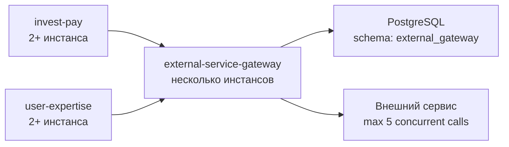
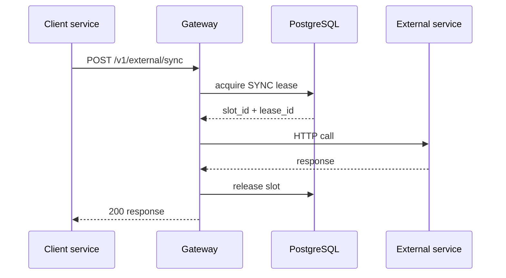
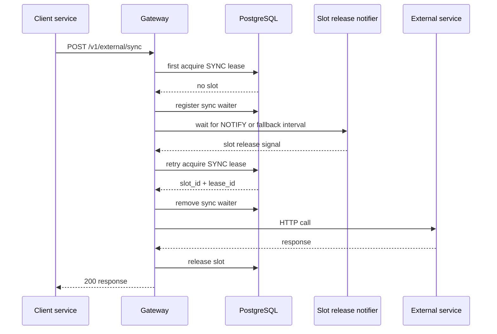
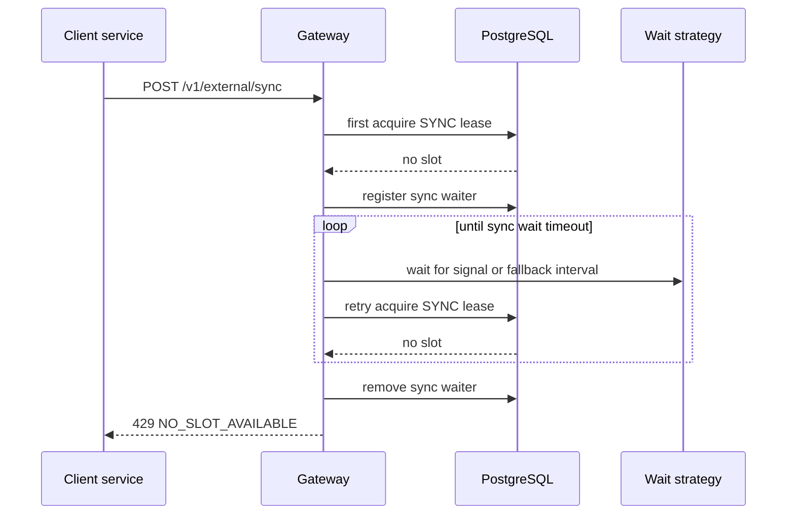
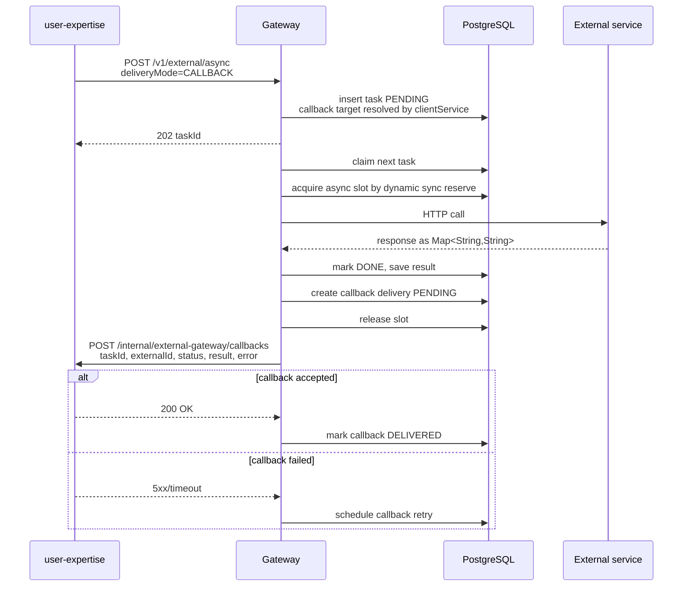
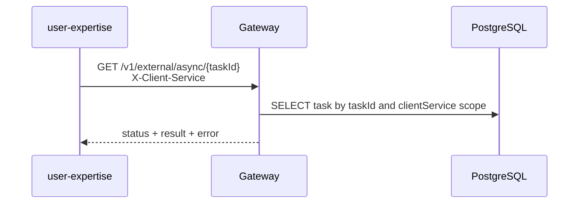

# External Service Gateway

## Назначение

`external-service-gateway` - внутренний Spring Boot сервис, который централизует вызовы во внешний сервис с ограничением:

```text
не более 5 одновременно выполняющихся HTTP-вызовов во всем кластере
```

Сервис нужен, потому что несколько независимых приложений, например `invest-pay` и `user-expertise`, должны ходить в один и тот же внешний сервис, но не имеют общей доменной схемы данных. Общая таблица-лимитер внутри схемы одного из доменных сервисов создала бы нежелательную связанность. Поэтому лимитирование, очередь, приоритизация, ретраи и аудит должны принадлежать отдельному техническому сервису.

## Цели

- Гарантировать глобальный лимит `5 in-flight` вызовов во внешний сервис.
- Дать синхронным запросам приоритет над асинхронными.
- Поддержать асинхронную постановку задач с доставкой результата в сервис-клиент через callback.
- Оставить чтение результата по HTTP как fallback/recovery-механизм.
- Переживать рестарты gateway-инстансов без потери async-задач.
- Централизовать retry, backoff, observability и аудит вызовов.
- Не требовать общей БД-схемы между `invest-pay`, `user-expertise` и другими доменными сервисами.

## Не цели

- Gateway не содержит бизнес-логику `invest-pay` или `user-expertise`.
- Gateway не преобразует доменные модели сервисов в их внутренние представления.
- Gateway не заменяет внешний сервис и не кэширует результат по умолчанию.
- Gateway не гарантирует мгновенное вытеснение уже начатого async-вызова. Приоритет действует до старта вызова.

## Топология



Важное условие: все инстансы `external-service-gateway`, независимо от зоны/плеча развертывания, должны использовать общий координатор лимитов. В варианте v1 таким координатором является одна PostgreSQL-схема gateway-сервиса.

Если два плеча полностью изолированы и не имеют общего PostgreSQL/координатора, глобальный лимит `5` технически нельзя гарантировать. В таком случае нужно либо:

- выделить квоты по плечам, например `3 + 2`;
- либо использовать общий центральный gateway/координатор;
- либо договориться с внешним сервисом о раздельных лимитах на каждое плечо.

## Основные компоненты

```text
REST API
  /v1/external/sync  - синхронный вызов, caller ждет ответ
  /v1/external/async - постановка async-задачи и чтение результата как fallback

Callback Client
  доставляет результат async-задачи в сервис-клиент

Slot Manager
  управляет 5 глобальными lease-слотами

Request Queue
  хранит async-задачи, статусы, retry/backoff, результат

Dispatcher
  выбирает задачи из очереди с учетом приоритета и доступных слотов

Upstream Client
  выполняет HTTP-вызов во внешний сервис

Reaper
  восстанавливает зависшие lease и IN_PROGRESS задачи

Metrics/Audit
  публикует технические метрики и историю вызовов
```

## Модель приоритета

У внешнего сервиса есть жесткий лимит `5` одновременно работающих запросов. После старта HTTP-вызова gateway не может безопасно "отобрать" слот у async-запроса и передать его sync-запросу. Поэтому приоритет должен применяться до старта нового вызова.

Рекомендуемая политика v1: **скользящий sync reserve**.

```text
totalSlots = 5
targetFreeSyncSlots = 1
sync может использовать до 5 слотов
async может стартовать только если после старта async останется минимум 1 свободный слот под следующий sync
если есть ожидающие sync-запросы, async не стартует новые вызовы
```

Практически лимит async вычисляется динамически:

```text
syncBusy = count(slots where kind = SYNC)
asyncBusy = count(slots where kind = ASYNC)
asyncAllowed = max(0, totalSlots - syncBusy - targetFreeSyncSlots)

async может стартовать, если:
  asyncBusy < asyncAllowed
  и нет живых sync waiters
```

Примеры:

```text
syncBusy=0 -> asyncAllowed=4, 1 слот свободен под sync
syncBusy=1 -> asyncAllowed=3, 1 слот снова остается свободен под следующий sync
syncBusy=2 -> asyncAllowed=2
syncBusy=3 -> asyncAllowed=1
syncBusy=4 -> asyncAllowed=0
syncBusy=5 -> asyncAllowed=0
```

Это дает три свойства:

- у sync всегда есть попытка быстро занять свободный слот, если система не заполнена уже начатыми вызовами;
- чем больше активных sync-вызовов, тем меньше новых async-вызовов может стартовать;
- если все слоты уже заняты, async не заберет следующий освободившийся слот раньше ожидающего sync.

Допустимая деградация: если в момент прихода sync-запроса уже выполняются 5 вызовов, sync ждет освобождения слота до своего timeout. Gateway не прерывает уже начатые async-вызовы.

Если async ранее успел занять больше слотов, чем разрешает новый `asyncAllowed` после прихода sync-нагрузки, gateway не отменяет эти async-вызовы. Он просто перестает стартовать новые async-вызовы, пока скользящий sync reserve не восстановится.

Приоритет async-задач хранится строковым значением в API и числовым весом во внутренней очереди:

```text
HIGH -> priority_weight = 100
LOW  -> priority_weight = 10
```

Dispatcher выбирает задачи по `priority_weight DESC, available_at ASC, id ASC`. Это исключает зависимость от лексикографической сортировки строковых значений `HIGH` и `LOW`.

## Sync flow

Sync сначала делает немедленную попытку получить слот. `ext_sync_waiters` создается только если первая попытка не дала слот и запрос действительно переходит в ожидание.

Позитивный сценарий без ожидания:



Позитивный сценарий после ожидания в режиме `listen_notify`:



Негативный сценарий, слот не освободился до timeout:



Sync-запрос не попадает в persistent queue. Он участвует в общей политике лимитов через Slot Manager и короткоживущую запись в `ext_sync_waiters`, которая не будит sync сама по себе, но не дает async dispatcher стартовать новые async-вызовы, пока sync уже ждет.

## Async flow

Основной способ доставки результата async-задачи - HTTP callback из gateway в сервис-клиент. Polling через `GET /v1/external/async/{taskId}` остается fallback для ручного восстановления, диагностики и случаев, когда callback временно не доставлен.



Fallback-чтение результата:



Для `GET`, `DELETE` и ручного retry текущая реализация временно принимает `X-Client-Service` как scope доступа. Если заголовок не передан, lookup не ограничивается сервисом-клиентом; это dev-ограничение должно быть закрыто внедрением service-to-service identity.

Для `POST /v1/external/sync` и `POST /v1/external/async` поле `clientService` пока берется из тела запроса. В production оно должно сверяться с service-to-service identity вызывающего сервиса.

Если для async-задачи выбран `deliveryMode=POLLING`, gateway не создает доставку callback, не требует callback endpoint для сервиса-клиента и возвращает результат только через `GET /v1/external/async/{taskId}` или `GET /v1/external/async/by-external-id/{externalId}`. В таком случае `callbackDeliveryStatus` равен `NOT_REQUIRED`. Значение по умолчанию для `deliveryMode` в v1 - `CALLBACK`, поэтому сервисы без callback endpoint должны явно передавать `POLLING`.

## Async callback contract

Каждый сервис-клиент, который выбирает `deliveryMode=CALLBACK`, должен реализовать внутренний endpoint:

```http
POST /internal/external-gateway/callbacks
```

Обязательные заголовки callback:

- `X-Callback-Attempt` - номер попытки доставки, начиная с `1`.

Опциональные заголовки callback в текущей реализации:

- `X-Request-Id` - correlation id доставки, сейчас равен `eventId` попытки.

Подпись callback (`X-Gateway-Signature`) пока не реализована.

Gateway не принимает произвольный `callbackUrl` из запроса. Callback endpoint выбирается по `clientService` из allow-list конфигурации:

```yaml
external-gateway:
  clients:
    user-expertise:
      callback-url: http://user-expertise/internal/external-gateway/callbacks
    invest-pay:
      callback-url: http://invest-pay/internal/external-gateway/callbacks
```

Причина: произвольный `callbackUrl` в payload создает SSRF-риск и усложняет контроль сетевых маршрутов.

Тело callback:

```json
{
  "eventId": "9eab8bb2-b8e4-4c6e-a1d9-e0d4b7b0d77a",
  "taskId": 12345,
  "externalId": "4c48a4dc-3226-4e63-8597-4ee793fc3c3c",
  "clientService": "user-expertise",
  "status": "DONE",
  "result": {
    "decision": "APPROVED",
    "score": "82",
    "reasonCode": "OK"
  },
  "error": null,
  "finishedAt": "2026-05-21T20:30:00Z"
}
```

Для статуса `DONE` поле `result` содержит `Map<String, String>`, а `error` равно `null`. Gateway нормализует ответ внешнего сервиса в эту структуру перед сохранением результата и отправкой callback. Для финальных неуспешных статусов `FAILED`, `DEAD` и `CANCELLED` поле `result` равно `null`, а детали причины передаются в структурированном поле `error`. Fallback GET возвращает такую же модель `error`; строковое поле `lastError` может использоваться только как диагностическое краткое описание.

Callback должен быть идемпотентным:

- `eventId` уникален для конкретной попытки доставки события;
- `taskId + status` можно использовать как бизнес-ключ обработки;
- сервис-клиент должен корректно принять повторный callback для уже обработанной задачи.

Если callback не доставлен, gateway делает retry с backoff. Даже после неуспешной доставки callback результат остается доступен через `GET /v1/external/async/{taskId}` или `GET /v1/external/async/by-external-id/{externalId}`.

Рекомендуемые статусы доставки callback:

```text
NOT_REQUIRED
PENDING
DELIVERING
DELIVERED
RETRY
DEAD
```

## PostgreSQL как координатор

Gateway владеет своей схемой, например:

```text
external_gateway.ext_slots
external_gateway.ext_request_queue
external_gateway.ext_sync_waiters
external_gateway.ext_callback_delivery
```

Концептуально:

- `ext_slots` содержит 5 физических строк-слотов;
- `ext_request_queue` содержит async-задачи;
- `ext_sync_waiters` содержит короткоживущие записи ожидающих sync-запросов;
- `ext_callback_delivery` хранит состояние доставки callback, попытки и последнюю ошибку.

Слот должен удерживаться не через долгую DB-транзакцию, а через lease-запись:

```text
slot_id
lease_id
owner
kind: SYNC | ASYNC
acquired_at
expires_at
task_id
```

Захват слота:

1. Короткая транзакция.
2. `SELECT ... FOR UPDATE SKIP LOCKED`.
3. Запись `lease_id`, `owner`, `kind`, `expires_at`.
4. Commit.
5. HTTP-вызов выполняется вне транзакции.
6. Release выполняется отдельной короткой транзакцией по `slot_id + lease_id`.

Release и heartbeat всегда должны проверять `lease_id`, чтобы старый поток не освободил или не продлил уже переиспользованный слот.

## Почему не держать DB lock во время HTTP

Row lock живет только внутри транзакции. Если держать `SELECT FOR UPDATE` во время HTTP-вызова, транзакция будет открыта все время внешнего запроса.

Это нежелательно:

- удерживается соединение из пула;
- удерживается row lock;
- длинная транзакция мешает vacuum;
- сетевое зависание внешнего сервиса превращается в долгую DB-транзакцию;
- rollback/commit отпустит lock, но тогда lock не подходит как долговременное состояние "слот занят".

Поэтому lock используется только для атомарного изменения lease-записи.

## LISTEN/NOTIFY

Для ускорения ожидания sync-слота в PostgreSQL mode используется отдельный канал
`external_gateway_slot_released`. После успешного release lease или cleanup истекших
lease gateway отправляет `NOTIFY external_gateway_slot_released`. Listener активен
только при `external-gateway.repository.type=postgres` и
`external-gateway.slots.sync-acquire-wait-mode=listen_notify`.

Уведомление означает только потенциальное освобождение слота: после пробуждения
sync-поток снова выполняет `acquireSyncSlot` в PostgreSQL, и только БД остается
источником истины. Если уведомление потеряно или listener переподключается, ожидание
продолжается через fallback `external-gateway.slots.sync-acquire-poll-interval`.

Для async queue канал `external_gateway_queue` в текущей реализации не используется: async dispatcher работает через scheduler polling и `FOR UPDATE SKIP LOCKED`.

Свойства PostgreSQL `NOTIFY`, важные для sync-режима:

- уведомление получают активные соединения, которые сделали `LISTEN`;
- уведомление не хранится, если listener отключен;
- `NOTIFY` не является очередью сообщений;
- источник истины - таблица `ext_slots`;
- fallback ожидание через `sync-acquire-poll-interval` остается страховкой от потери уведомления.

## Retry и ошибки

Для async:

- transient ошибки переводят задачу обратно в `PENDING` с `available_at = now() + backoff`;
- после `max_attempts` задача становится `DEAD`;
- неретраибельная финальная ошибка переводит задачу в `FAILED`;
- `CANCELLED` используется для задачи, отмененной до старта upstream-вызова;
- результат успешной задачи и структурированная ошибка неуспешной задачи доступны через async API.
- callback доставляется после финального статуса `DONE`, `FAILED`, `DEAD` или `CANCELLED`, если для задачи выбран `deliveryMode=CALLBACK`.
- для `deliveryMode=CALLBACK` запись `ext_callback_delivery` создается атомарно с переводом async-задачи в финальный статус, чтобы callback не потерялся при рестарте gateway.
- ошибки доставки callback не меняют результат upstream-задачи; они меняют только статус доставки callback.
- `retryable` в финальном ответе или callback означает возможность ручного retry со стороны клиента; автоматические retry upstream уже завершены до отправки финального callback.

Для sync:

- если нет слота до истечения `syncWaitTimeout`, gateway возвращает `429 Too Many Requests`;
- если gateway или координатор лимитов временно недоступен, gateway возвращает `503 Service Unavailable`;
- если внешний сервис недоступен, gateway возвращает `502/503`;
- если внешний сервис ответил `429`, это сигнал, что защита gateway не сработала или есть другие клиенты внешнего сервиса вне gateway.

## Таймауты и lease

Базовое правило:

```text
upstream HTTP timeout < slot lease TTL
```

Например:

```text
connect timeout: 2s
read timeout: 10s
sync wait timeout: 1500ms
slot lease TTL: 30s
heartbeat interval: 5s
stuck task TTL: 60s
```

Если внешний вызов может длиться дольше, нужно либо увеличить TTL, либо включить heartbeat на время вызова.

## Идемпотентность

Каждый запрос должен иметь клиентский идентификатор:

```text
externalId / idempotencyKey
```

Для async этот идентификатор обязателен и уникален в рамках client service. Повторная постановка с тем же ключом должна вернуть существующий `taskId`.

Для sync идемпотентность зависит от семантики внешнего сервиса. Если внешний вызов изменяет состояние, `Idempotency-Key` обязателен.

## Наблюдаемость

Минимальные метрики:

```text
external_gateway_slots_busy{kind}
external_gateway_slots_free
external_gateway_queue_pending{priority}
external_gateway_queue_in_progress
external_gateway_callback_pending{client_service}
external_gateway_callback_dead{client_service}
external_gateway_calls_total{kind,status,client_service}
external_gateway_call_duration_seconds{kind,client_service}
external_gateway_sync_rejected_total{reason}
external_gateway_async_dead_total
```

Минимальные логи:

- `requestId`;
- `externalId`;
- `clientService`;
- `taskId` для async;
- `leaseId`;
- `callbackEventId` для доставки callback;
- upstream status;
- duration.

## Безопасность

Gateway должен принимать вызовы только от доверенных внутренних сервисов.

Минимальный набор:

- mTLS или service-to-service auth;
- allow-list client service names;
- аудит caller identity;
- ограничение размера payload;
- запрет произвольных upstream URL в запросе.

## OpenAPI

Контракты лежат отдельно:

- `../openapi/external-gateway-sync.yaml`
- `../openapi/external-gateway-async.yaml`
- `../openapi/external-gateway-callback.yaml`

Sync и async разделены, потому что у них разные SLA, статусы, ошибки и модель ожидания результата.

Callback вынесен в отдельный OpenAPI-файл, потому что этот контракт реализуют сервисы-клиенты (`user-expertise`, `invest-pay`), а вызывает его gateway.

## Критерии готовности v1

- Все вызовы внешнего сервиса идут только через gateway.
- При любом количестве gateway-инстансов одновременно выполняется не больше 5 upstream-вызовов.
- Async стартует по динамическому лимиту `asyncAllowed = max(0, 5 - syncBusy - 1)`.
- При наличии ожидающего sync-запроса async dispatcher не стартует новые задачи.
- Async-задачи не теряются при рестарте gateway.
- Повторная async-постановка с тем же `externalId` возвращает существующую задачу.
- Async callback доставляет успешный `result` как `Map<String, String>`, а для неуспешных финальных статусов передает `result: null` и ошибку.
- Повторный callback не ломает состояние сервиса-клиента.
- Есть метрики занятых слотов, очереди, ошибок и duration.
- Есть integration test на кластерную конкуренцию.
