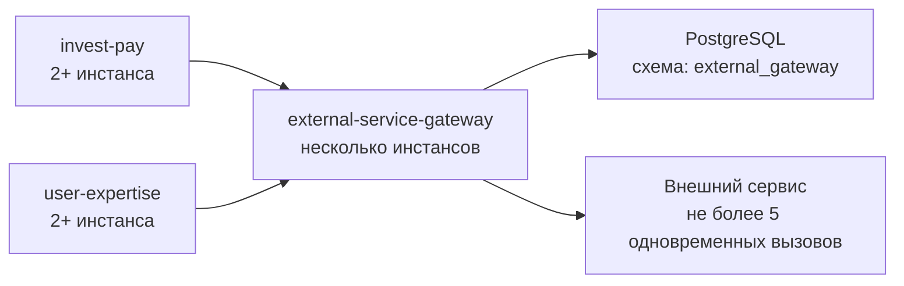
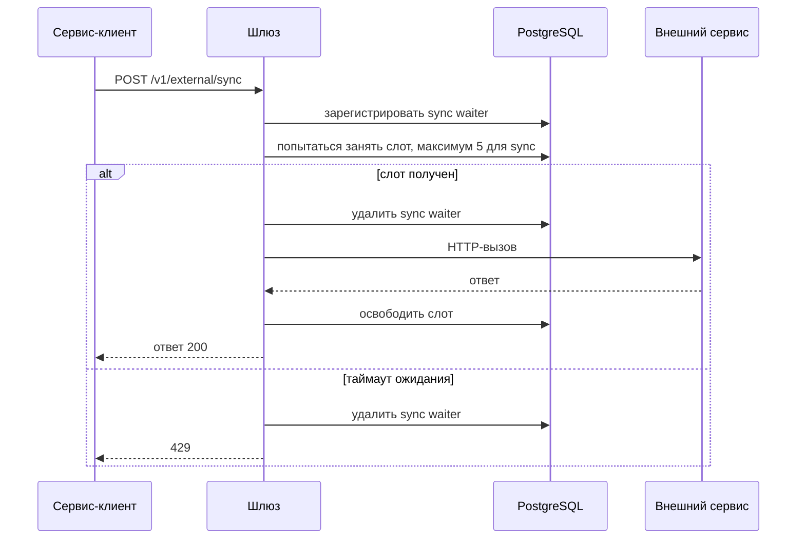
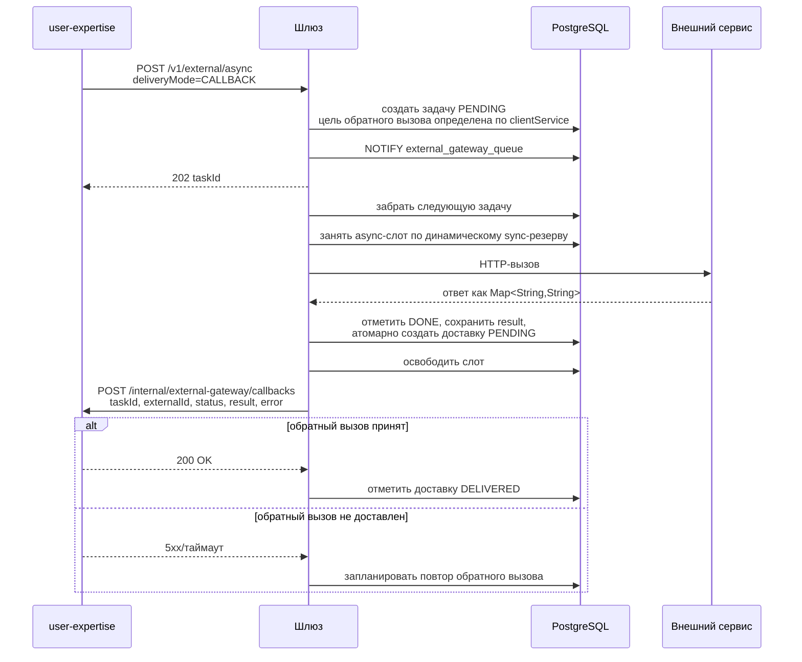
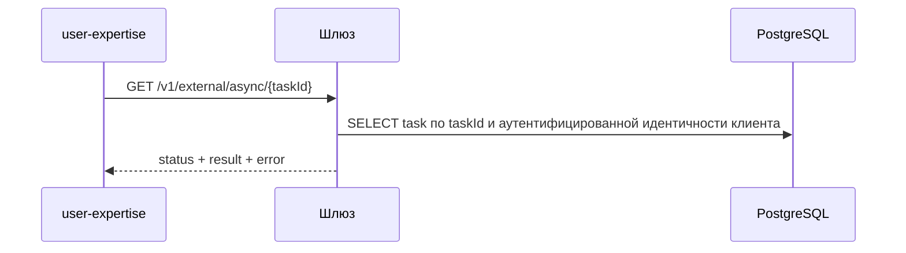

# Шлюз внешнего сервиса

## Назначение

`external-service-gateway` - внутренний сервис Spring Boot, который централизует вызовы во внешний сервис с ограничением:

```text
не более 5 одновременно выполняющихся HTTP-вызовов во всем кластере
```

Сервис нужен, потому что несколько независимых приложений, например `invest-pay` и `user-expertise`, должны ходить в один и тот же внешний сервис, но не имеют общей доменной схемы данных. Общая таблица-лимитер внутри схемы одного из доменных сервисов создала бы нежелательную связанность. Поэтому лимитирование, очередь, приоритизация, повторы и аудит должны принадлежать отдельному техническому сервису.

## Цели

- Гарантировать глобальный лимит `5` одновременно выполняющихся вызовов во внешний сервис.
- Дать синхронным запросам приоритет над асинхронными.
- Поддержать асинхронную постановку задач с доставкой результата в сервис-клиент через обратный вызов.
- Оставить чтение результата по HTTP как резервный механизм чтения и восстановления.
- Переживать рестарты инстансов шлюза без потери асинхронных задач.
- Централизовать повторы, задержки между повторами, наблюдаемость и аудит вызовов.
- Не требовать общей БД-схемы между `invest-pay`, `user-expertise` и другими доменными сервисами.

## Не цели

- Шлюз не содержит бизнес-логику `invest-pay` или `user-expertise`.
- Шлюз не преобразует доменные модели сервисов в их внутренние представления.
- Шлюз не заменяет внешний сервис и не кэширует результат по умолчанию.
- Шлюз не гарантирует мгновенное вытеснение уже начатого асинхронного вызова. Приоритет действует до старта вызова.

## Топология



Важное условие: все инстансы `external-service-gateway`, независимо от зоны/плеча развертывания, должны использовать общий координатор лимитов. В варианте v1 таким координатором является одна PostgreSQL-схема шлюза.

Если два плеча полностью изолированы и не имеют общего PostgreSQL/координатора, глобальный лимит `5` технически нельзя гарантировать. В таком случае нужно либо:

- выделить квоты по плечам, например `3 + 2`;
- либо использовать общий центральный шлюз/координатор;
- либо договориться с внешним сервисом о раздельных лимитах на каждое плечо.

## Основные компоненты

```text
REST API
  /v1/external/sync  - синхронный вызов, вызывающий сервис ждет ответ
  /v1/external/async - постановка асинхронной задачи и резервное чтение результата

Клиент обратного вызова
  доставляет результат асинхронной задачи в сервис-клиент

Управление слотами
  управляет 5 глобальными lease-слотами

Очередь запросов
  хранит асинхронные задачи, статусы, повторы, задержки между повторами и результат

Диспетчер
  выбирает задачи из очереди с учетом приоритета и доступных слотов

Клиент внешнего сервиса
  выполняет HTTP-вызов во внешний сервис

Восстановитель
  восстанавливает зависшие lease и IN_PROGRESS задачи

Метрики/аудит
  публикует технические метрики и историю вызовов
```

## Модель приоритета

У внешнего сервиса есть жесткий лимит `5` одновременно работающих запросов. После старта HTTP-вызова шлюз не может безопасно "отобрать" слот у асинхронного запроса и передать его синхронному запросу. Поэтому приоритет должен применяться до старта нового вызова.

Рекомендуемая политика v1: **скользящий резерв для синхронных запросов**.

```text
totalSlots = 5
targetFreeSyncSlots = 1
sync может использовать до 5 слотов
async может стартовать только если после старта async останется минимум 1 свободный слот под следующий sync
если есть ожидающие sync-запросы, async не стартует новые вызовы
```

Практически лимит для async вычисляется динамически:

```text
syncBusy = count(slots where kind = SYNC)
asyncBusy = count(slots where kind = ASYNC)
asyncAllowed = max(0, totalSlots - syncBusy - targetFreeSyncSlots)

async может стартовать, если:
  asyncBusy < asyncAllowed
  и нет живых sync waiters
```

Примеры:

```text
syncBusy=0 -> asyncAllowed=4, 1 слот свободен под sync
syncBusy=1 -> asyncAllowed=3, 1 слот снова остается свободен под следующий sync
syncBusy=2 -> asyncAllowed=2
syncBusy=3 -> asyncAllowed=1
syncBusy=4 -> asyncAllowed=0
syncBusy=5 -> asyncAllowed=0
```

Это дает три свойства:

- у sync всегда есть попытка быстро занять свободный слот, если система не заполнена уже начатыми вызовами;
- чем больше активных sync-вызовов, тем меньше новых async-вызовов может стартовать;
- если все слоты уже заняты, async не заберет следующий освободившийся слот раньше ожидающего sync.

Допустимая деградация: если в момент прихода sync-запроса уже выполняются 5 вызовов, sync ждет освобождения слота до своего таймаута. Шлюз не прерывает уже начатые async-вызовы.

Если async ранее успел занять больше слотов, чем разрешает новый `asyncAllowed` после прихода sync-нагрузки, шлюз не отменяет эти async-вызовы. Он просто перестает стартовать новые async-вызовы, пока скользящий резерв для синхронных запросов не восстановится.

Приоритет async-задач хранится строковым значением в API и числовым весом во внутренней очереди:

```text
HIGH -> priority_weight = 100
LOW  -> priority_weight = 10
```

Диспетчер выбирает задачи по `priority_weight DESC, available_at ASC, id ASC`. Это исключает зависимость от лексикографической сортировки строковых значений `HIGH` и `LOW`.

## Синхронный сценарий



Синхронный запрос не обязан попадать в постоянную очередь. Он участвует в общей политике лимитов через управление слотами и короткоживущую запись в `ext_sync_waiters`. Для аудита можно писать легковесную запись в `ext_call_audit`.

## Асинхронный сценарий

Основной способ доставки результата асинхронной задачи - HTTP-обратный вызов из шлюза в сервис-клиент. Опрос через `GET /v1/external/async/{taskId}` остается резервным способом для ручного восстановления, диагностики и случаев, когда обратный вызов временно не доставлен.



Резервное чтение результата:



Для `GET`, `DELETE` и ручного повтора шлюз не принимает `clientService` из параметров запроса. Сервис-клиент определяется из межсервисной идентичности, а выборка задачи ограничивается парой `taskId` и `clientService`.

Для `POST /v1/external/sync` и `POST /v1/external/async` поле `clientService` в теле запроса должно совпадать с межсервисной идентичностью вызывающего сервиса. Шлюз не использует это поле как самостоятельный источник доверия: несовпадение считается ошибкой авторизации или валидации. Это сохраняет явный контракт для области идемпотентности и списка разрешенных обратных вызовов, но не позволяет сервису подставить чужое имя.

Если для async-задачи выбран `deliveryMode=POLLING`, шлюз не создает доставку обратного вызова, не требует эндпоинт обратного вызова для сервиса-клиента и возвращает результат только через `GET /v1/external/async/{taskId}` или `GET /v1/external/async/by-external-id/{externalId}`. В таком случае `callbackDeliveryStatus` равен `NOT_REQUIRED`. Значение по умолчанию для `deliveryMode` в v1 - `CALLBACK`, поэтому сервисы без эндпоинта обратного вызова должны явно передавать `POLLING`.

## Контракт обратного вызова async-задачи

Каждый сервис-клиент, который выбирает `deliveryMode=CALLBACK`, должен реализовать внутренний эндпоинт:

```http
POST /internal/external-gateway/callbacks
```

Обязательные заголовки обратного вызова:

- `X-Callback-Attempt` - номер попытки доставки, начиная с `1`.

Опциональные заголовки обратного вызова:

- `X-Request-Id` - идентификатор корреляции доставки;
- `X-Gateway-Signature` - подпись тела обратного вызова, если выбрана аутентификация на основе HMAC.

Шлюз не принимает произвольный `callbackUrl` из запроса. Эндпоинт обратного вызова выбирается по `clientService` из списка разрешений конфигурации:

```yaml
external-gateway:
  clients:
    user-expertise:
      callback-url: http://user-expertise/internal/external-gateway/callbacks
    invest-pay:
      callback-url: http://invest-pay/internal/external-gateway/callbacks
```

Причина: произвольный `callbackUrl` в полезной нагрузке создает SSRF-риск и усложняет контроль сетевых маршрутов.

Тело обратного вызова:

```json
{
  "eventId": "9eab8bb2-b8e4-4c6e-a1d9-e0d4b7b0d77a",
  "taskId": 12345,
  "externalId": "4c48a4dc-3226-4e63-8597-4ee793fc3c3c",
  "clientService": "user-expertise",
  "status": "DONE",
  "result": {
    "decision": "APPROVED",
    "score": "82",
    "reasonCode": "OK"
  },
  "error": null,
  "finishedAt": "2026-05-21T20:30:00Z"
}
```

Для статуса `DONE` поле `result` содержит `Map<String, String>`, а `error` равно `null`. Шлюз нормализует ответ внешнего сервиса в эту структуру перед сохранением результата и отправкой обратного вызова. Для финальных неуспешных статусов `FAILED`, `DEAD` и `CANCELLED` поле `result` равно `null`, а детали причины передаются в структурированном поле `error`. Резервный GET возвращает такую же модель `error`; строковое поле `lastError` может использоваться только как диагностическое краткое описание.

Обратный вызов должен быть идемпотентным:

- `eventId` уникален для конкретной попытки доставки события;
- `taskId + status` можно использовать как бизнес-ключ обработки;
- сервис-клиент должен корректно принять повторный обратный вызов для уже обработанной задачи.

Если обратный вызов не доставлен, шлюз выполняет повтор с задержкой. Даже после неуспешной доставки обратного вызова результат остается доступен через `GET /v1/external/async/{taskId}` или `GET /v1/external/async/by-external-id/{externalId}`.

Рекомендуемые статусы доставки обратного вызова:

```text
NOT_REQUIRED
PENDING
DELIVERING
DELIVERED
RETRY
DEAD
```

## PostgreSQL как координатор

Шлюз владеет своей схемой, например:

```text
external_gateway.ext_slots
external_gateway.ext_request_queue
external_gateway.ext_sync_waiters
external_gateway.ext_call_audit
external_gateway.ext_callback_delivery
```

Концептуально:

- `ext_slots` содержит 5 физических строк-слотов;
- `ext_request_queue` содержит асинхронные задачи;
- `ext_sync_waiters` содержит короткоживущие записи ожидающих sync-запросов;
- `ext_call_audit` опционально хранит историю sync/async вызовов.
- `ext_callback_delivery` хранит состояние доставки обратного вызова, попытки и последнюю ошибку.

Слот должен удерживаться не через долгую DB-транзакцию, а через lease-запись:

```text
slot_id
lease_id
owner
kind: SYNC | ASYNC
acquired_at
expires_at
task_id
```

Захват слота:

1. Короткая транзакция.
2. `SELECT ... FOR UPDATE SKIP LOCKED`.
3. Запись `lease_id`, `owner`, `kind`, `expires_at`.
4. Фиксация транзакции.
5. HTTP-вызов выполняется вне транзакции.
6. Освобождение выполняется отдельной короткой транзакцией по `slot_id + lease_id`.

Освобождение и продление аренды всегда должны проверять `lease_id`, чтобы старый поток не освободил или не продлил уже переиспользованный слот.

## Почему не держать блокировку БД во время HTTP

Блокировка строки живет только внутри транзакции. Если держать `SELECT FOR UPDATE` во время HTTP-вызова, транзакция будет открыта все время внешнего запроса.

Это нежелательно:

- удерживается соединение из пула;
- удерживается блокировка строки;
- длинная транзакция мешает vacuum;
- сетевое зависание внешнего сервиса превращается в долгую транзакцию БД;
- откат или фиксация отпустит блокировку, но тогда блокировка не подходит как долговременное состояние "слот занят".

Поэтому блокировка используется только для атомарного изменения lease-записи.

## LISTEN/NOTIFY

`external_gateway_queue` - это имя канала PostgreSQL, а не таблица. DDL для канала не нужен.

```sql
LISTEN external_gateway_queue;
NOTIFY external_gateway_queue, 'task_added';
```

Свойства:

- уведомление получают все активные соединения, которые сделали `LISTEN`;
- уведомление не хранится, если подписчик отключен;
- `NOTIFY` не является очередью сообщений;
- источник истины - таблица `ext_request_queue`;
- опрос остается страховкой от потери уведомления.

## Повторы и ошибки

Для асинхронного режима:

- временные ошибки переводят задачу обратно в `PENDING` с `available_at = now() + backoff` как моментом следующей попытки;
- после `max_attempts` задача становится `DEAD`;
- неретраибельная финальная ошибка переводит задачу в `FAILED`;
- `CANCELLED` используется для задачи, отмененной до старта вызова внешнего сервиса;
- результат успешной задачи и структурированная ошибка неуспешной задачи доступны через async API.
- обратный вызов доставляется после финального статуса `DONE`, `FAILED`, `DEAD` или `CANCELLED`, если для задачи выбран `deliveryMode=CALLBACK`.
- для `deliveryMode=CALLBACK` запись `ext_callback_delivery` создается атомарно с переводом async-задачи в финальный статус, чтобы обратный вызов не потерялся при рестарте шлюза.
- ошибки доставки обратного вызова не меняют результат задачи внешнего сервиса; они меняют только статус доставки обратного вызова.
- `retryable` в финальном ответе или обратном вызове означает возможность ручного повтора со стороны клиента; автоматические повторы вызова внешнего сервиса уже завершены до отправки финального обратного вызова.

Для синхронного режима:

- если нет слота до истечения `syncWaitTimeout`, шлюз возвращает `429 Too Many Requests`;
- если шлюз или координатор лимитов временно недоступен, шлюз возвращает `503 Service Unavailable`;
- если внешний сервис недоступен, шлюз возвращает `502/503`;
- если внешний сервис ответил `429`, это сигнал, что защита шлюза не сработала или есть другие клиенты внешнего сервиса вне шлюза.

## Таймауты и аренда слота

Базовое правило:

```text
таймаут HTTP-вызова внешнего сервиса < TTL аренды слота
```

Например:

```text
таймаут соединения: 2s
таймаут чтения: 10s
таймаут ожидания sync: 1500ms
TTL аренды слота: 30s
интервал продления аренды: 5s
TTL зависшей задачи: 60s
```

Если внешний вызов может длиться дольше, нужно либо увеличить TTL, либо включить продление аренды на время вызова.

## Идемпотентность

Каждый запрос должен иметь клиентский идентификатор:

```text
externalId / idempotencyKey
```

Для async этот идентификатор обязателен и уникален в рамках сервиса-клиента. Повторная постановка с тем же ключом должна вернуть существующий `taskId`.

Для sync идемпотентность зависит от семантики внешнего сервиса. Если внешний вызов изменяет состояние, `Idempotency-Key` обязателен.

## Наблюдаемость

Минимальные метрики:

```text
external_gateway_slots_busy{kind}
external_gateway_slots_free
external_gateway_queue_pending{priority}
external_gateway_queue_in_progress
external_gateway_callback_pending{client_service}
external_gateway_callback_dead{client_service}
external_gateway_calls_total{kind,status,client_service}
external_gateway_call_duration_seconds{kind,client_service}
external_gateway_sync_rejected_total{reason}
external_gateway_async_dead_total
```

Минимальные логи:

- `requestId`;
- `externalId`;
- `clientService`;
- `taskId` для async;
- `leaseId`;
- `callbackEventId` для доставки обратного вызова;
- статус внешнего сервиса;
- длительность.

## Безопасность

Шлюз должен принимать вызовы только от доверенных внутренних сервисов.

Минимальный набор:

- mTLS или межсервисная аутентификация;
- список разрешенных имен сервисов-клиентов;
- аудит идентичности вызывающего сервиса;
- ограничение размера полезной нагрузки;
- запрет произвольных URL внешнего сервиса в запросе.

## OpenAPI

Контракты лежат отдельно:

- `../openapi/external-gateway-sync.yaml`
- `../openapi/external-gateway-async.yaml`
- `../openapi/external-gateway-callback.yaml`

Синхронный и асинхронный API разделены, потому что у них разные SLA, статусы, ошибки и модель ожидания результата.

Обратный вызов вынесен в отдельный OpenAPI-файл, потому что этот контракт реализуют сервисы-клиенты (`user-expertise`, `invest-pay`), а вызывает его шлюз.

## Критерии готовности v1

- Все вызовы внешнего сервиса идут только через шлюз.
- При любом количестве инстансов шлюза одновременно выполняется не больше 5 вызовов внешнего сервиса.
- Асинхронные задачи стартуют по динамическому лимиту `asyncAllowed = max(0, 5 - syncBusy - 1)`.
- При наличии ожидающего sync-запроса async-диспетчер не стартует новые задачи.
- Асинхронные задачи не теряются при рестарте шлюза.
- Повторная async-постановка с тем же `externalId` возвращает существующую задачу.
- Async-обратный вызов доставляет успешный `result` как `Map<String, String>`, а для неуспешных финальных статусов передает `result: null` и ошибку.
- Повторный обратный вызов не ломает состояние сервиса-клиента.
- Есть метрики занятых слотов, очереди, ошибок и длительности.
- Есть интеграционный тест на кластерную конкуренцию.
