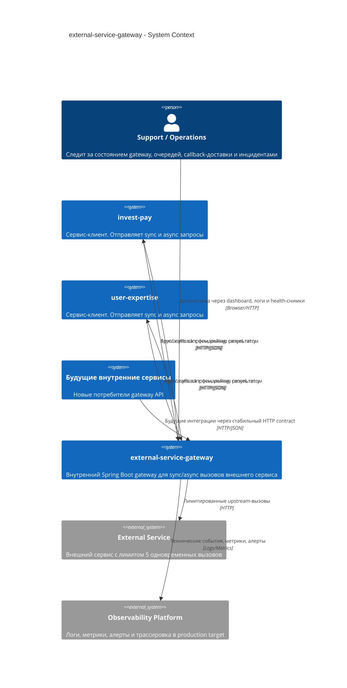
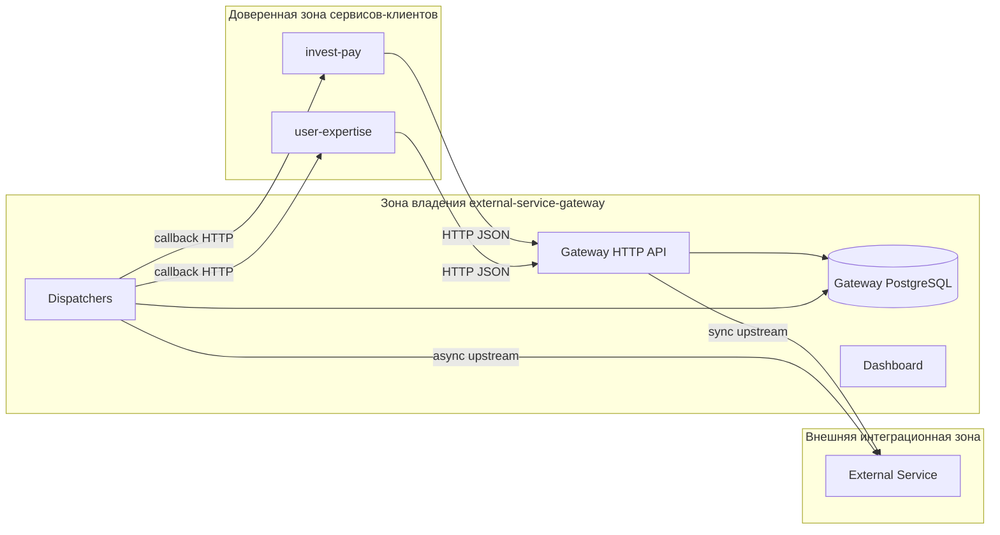

# C4 Level 1. System Context

`external-service-gateway` является внутренним фасадом к внешнему сервису с жестким лимитом `5 concurrent calls`. Он отделяет доменные сервисы от политики лимитирования, очередей, retry, callback-доставки и деталей интеграции с upstream.

## Диаграмма контекста



## Участники

| Участник | Роль | Контракт |
| --- | --- | --- |
| `invest-pay` | Сервис-клиент | Вызывает sync/async API, принимает callback для своих задач. |
| `user-expertise` | Сервис-клиент | Вызывает sync/async API, принимает callback для своих задач. |
| `external-service-gateway` | Владелец интеграционной политики | Применяет лимит слотов, хранит async state, выполняет retry и callback. |
| `External Service` | Внешняя зависимость | Принимает не более 5 параллельных вызовов. |
| `Support / Operations` | Эксплуатация | Смотрит dashboard, очереди, ошибки и backlog. |
| `Observability Platform` | Production target | Получает метрики, логи и алерты. В текущем коде полноценный набор еще не внедрен. |

## Доверенные границы



В текущей реализации `clientService` передается в теле submit/sync запроса, а fallback-операции используют необязательный `X-Client-Service`. В production target эта модель должна быть заменена на service identity из mTLS, JWT или service mesh с проверкой соответствия caller identity и `clientService`.

## Ответственность gateway

- Нормализовать входной REST/OpenAPI contract для всех клиентов.
- Сохранять единую политику лимитирования внешнего сервиса.
- Давать sync-клиентам приоритет над стартом новых async-задач.
- Хранить async state и результат до получения клиентом через callback или polling.
- Доставлять callback с retry/backoff и фиксировать статус доставки отдельно от статуса upstream-задачи.
- Давать support-команде диагностический dashboard и health-снимки.

## Не ответственность gateway

- Gateway не владеет бизнес-решениями, которые принимает внешний сервис.
- Gateway не должен становиться общей БД между сервисами-клиентами.
- Gateway не должен принимать произвольный `callbackUrl` из payload, чтобы не открывать SSRF-вектор.
- Gateway не должен компенсировать отсутствие идемпотентности на стороне callback endpoint. Клиентский callback endpoint обязан быть идемпотентным.

## Критические инварианты

```text
totalSlots = 5
targetFreeSyncSlots = 1
asyncAllowed = max(0, totalSlots - syncBusy - targetFreeSyncSlots)

async start is allowed only when:
  liveSyncWaiters == 0
  asyncBusy < asyncAllowed
```

Эти правила означают, что уже начатый async-вызов не прерывается, но новые async-вызовы не стартуют, если sync-нагрузка уже ждет слот или необходимо сохранить резерв под sync.
