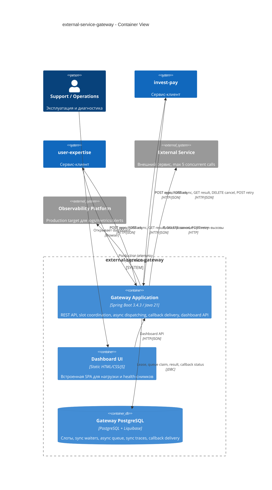

# C4 Level 2. Container View

Container view показывает runtime-границы. Модули `dashboard-backend` и `dashboard-ui` подключены к основному Spring Boot приложению как Maven-зависимости, поэтому в runtime это один процесс `test-qwen-cli-app`, а не отдельные сервисы.

## Диаграмма контейнеров

## Runtime-режимы

| Режим | Конфигурация | Назначение | Ограничение |
| --- | --- | --- | --- |
| `memory` | `external-gateway.repository.type=memory` | Быстрый локальный запуск без БД. | Не дает глобальный лимит между несколькими JVM. Не подходит для production-кластера. |
| `postgres` | `external-gateway.repository.type=postgres` | Целевой режим для общей координации слотов и устойчивой async-очереди. | Требует доступный PostgreSQL, миграции Liquibase и общую схему для всех gateway replicas. |

## Контейнеры

### Gateway Application

Выполняет:

- REST endpoints `/v1/external/sync` и `/v1/external/async`;
- dashboard endpoints `/dashboard/api/*`;
- `ExternalAsyncDispatcherScheduler`;
- `CallbackDeliveryDispatcherScheduler`;
- `SlotLeaseReaperScheduler`;
- upstream adapter;
- callback client.

Threading-модель:

- sync-запрос выполняется в servlet request thread;
- async dispatch использует scheduled tick и fixed thread pool размера `external-gateway.async.dispatch-batch-size`;
- callback delivery использует scheduled tick и fixed thread pool размера `external-gateway.callback.delivery-batch-size`;
- slot lease операции выполняются короткими транзакциями, отдельными от длительного upstream-вызова.

### Gateway PostgreSQL

В `postgres`-режиме является единственным production source of truth для:

- `ext_slots` - глобальный пул lease-слотов;
- `ext_sync_waiters` - короткоживущие sync waiters;
- `ext_request_queue` - async-очередь, polling state и sync traces;
- `ext_callback_delivery` - очередь callback-доставки.

Клиентские сервисы не получают прямой доступ к этой схеме.

### Dashboard UI

Dashboard не является контрактом доменных сервисов. Это operational tooling для:

- генерации тестовой нагрузки;
- управления симуляцией upstream/callback;
- просмотра health snapshot;
- диагностики очередей, слотов и backlog.

В production доступ к dashboard должен быть закрыт внутренней авторизацией или сетевой политикой.

## Сетевые контракты

| Направление | Протокол | Endpoint |
| --- | --- | --- |
| Клиент -> Gateway sync | HTTP/JSON | `POST /v1/external/sync` |
| Клиент -> Gateway async submit | HTTP/JSON | `POST /v1/external/async` |
| Клиент -> Gateway polling | HTTP/JSON | `GET /v1/external/async/{taskId}` |
| Клиент -> Gateway lookup by externalId | HTTP/JSON | `GET /v1/external/async/by-external-id/{externalId}` |
| Клиент -> Gateway cancel | HTTP/JSON | `DELETE /v1/external/async/{taskId}` |
| Клиент -> Gateway manual retry | HTTP/JSON | `POST /v1/external/async/{taskId}/retry` |
| Gateway -> Клиент callback | HTTP/JSON | `POST /internal/external-gateway/callbacks` |
| Gateway -> External Service | HTTP | Текущая реализация использует simulated adapter; production target требует реальный HTTP client. |

## Контейнерные риски

- Если несколько gateway replicas используют разные PostgreSQL instances, лимит `5` перестает быть глобальным.
- Если приложение запущено в `memory`-режиме в нескольких replicas, каждая replica получит собственный локальный лимит.
- Если dashboard публично доступен, он может стать несанкционированной точкой запуска нагрузки.
- Если callback URL берется не из allow-list, появляется SSRF-риск. Текущая реализация использует allow-list через `external-gateway.clients.<clientService>.callback-url`.
