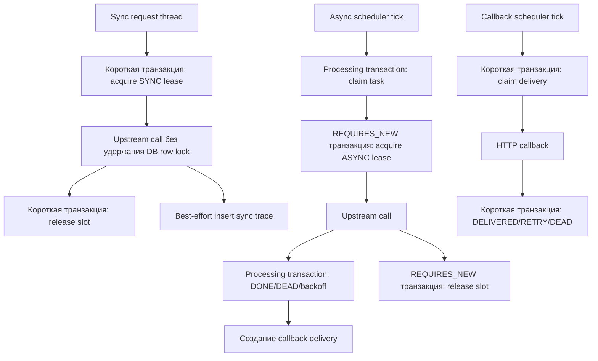

# C4 Level 3. Component View

Component view раскрывает основное Spring Boot приложение. Имена компонентов соответствуют пакетам и классам текущей реализации.

## Диаграмма компонентов

```mermaid
C4Component
    title external-service-gateway - Component View

    System(client, "Client Service", "invest-pay / user-expertise")
    System_Ext(externalService, "External Service", "Внешний сервис")
    ContainerDb(pg, "Gateway PostgreSQL", "PostgreSQL", "Слоты, очереди, sync traces и callback delivery")

    Container_Boundary(app, "Gateway Application") {
        Component(syncController, "ExternalSyncController", "Spring MVC", "HTTP contract для sync-вызова")
        Component(asyncController, "ExternalAsyncController", "Spring MVC", "HTTP contract для async submit, polling, cancel, retry")
        Component(exceptionHandler, "ExternalGatewayExceptionHandler", "Spring MVC Advice", "Единый JSON error contract и Retry-After для 429")

        Component(syncService, "ExternalSyncServiceImpl", "Service", "Получает SYNC lease, вызывает upstream, пишет sync trace")
        Component(asyncService, "ExternalAsyncServiceImpl", "Service", "Submit, idempotency result, read, cancel, manual retry")
        Component(slotManager, "SlotManagerImpl", "Service", "Lease API для SYNC/ASYNC, heartbeat, reaper")
        Component(waitStrategy, "SyncSlotWaitStrategy", "Strategy", "Polling или PostgreSQL LISTEN/NOTIFY с fallback")

        Component(asyncScheduler, "ExternalAsyncDispatcherScheduler", "Scheduler", "Периодически запускает async dispatch batch")
        Component(asyncDispatcher, "ExternalAsyncDispatcherImpl", "Worker", "Claim PENDING task, получает ASYNC lease, вызывает upstream")
        Component(callbackPlanner, "CallbackDeliveryPlannerImpl", "Service", "Создает callback delivery после финального async-статуса")
        Component(callbackScheduler, "CallbackDeliveryDispatcherScheduler", "Scheduler", "Периодически запускает callback delivery batch и recovery")
        Component(callbackDispatcher, "CallbackDeliveryDispatcherImpl", "Worker", "Claim callback delivery, HTTP send, retry/dead")

        Component(slotRepo, "SlotRepository", "Repository", "ext_slots и ext_sync_waiters")
        Component(taskRepo, "AsyncTaskRepository", "Repository", "ext_request_queue")
        Component(callbackRepo, "CallbackDeliveryRepository", "Repository", "ext_callback_delivery")
        Component(upstreamClient, "ExternalUpstreamClient", "Adapter", "Текущий simulated upstream; production target - HTTP adapter")
        Component(callbackClient, "CallbackClient", "Adapter", "HTTP или simulated callback client")
        Component(dashboard, "DashboardController + services", "Operational API", "Нагрузка, снимки состояния, health")
    }

    Rel(client, syncController, "POST /v1/external/sync", "HTTP/JSON")
    Rel(client, asyncController, "POST/GET/DELETE/POST retry", "HTTP/JSON")

    Rel(syncController, syncService, "sync(request, headers)")
    Rel(asyncController, asyncService, "submit/read/cancel/retry")
    Rel(syncController, exceptionHandler, "Ошибки")
    Rel(asyncController, exceptionHandler, "Ошибки")

    Rel(syncService, slotManager, "acquireSyncSlot, release")
    Rel(syncService, upstreamClient, "call")
    Rel(syncService, taskRepo, "recordSyncTrace")

    Rel(asyncService, taskRepo, "submit/find/cancel/retry")
    Rel(asyncScheduler, asyncDispatcher, "dispatchBatch")
    Rel(asyncDispatcher, taskRepo, "claim/complete/fail/return")
    Rel(asyncDispatcher, slotManager, "tryAcquireAsyncSlot, release")
    Rel(asyncDispatcher, upstreamClient, "call")
    Rel(asyncDispatcher, callbackPlanner, "planForFinalTask")

    Rel(callbackPlanner, callbackRepo, "createPending/createDead")
    Rel(callbackPlanner, taskRepo, "update callbackDeliveryStatus")
    Rel(callbackScheduler, callbackDispatcher, "dispatchBatch/recoverTimedOutDeliveries")
    Rel(callbackDispatcher, callbackRepo, "claim/markDelivered/markRetryOrDead")
    Rel(callbackDispatcher, callbackClient, "send")
    Rel(callbackDispatcher, taskRepo, "update callbackDeliveryStatus")

    Rel(slotManager, slotRepo, "lease operations")
    Rel(slotManager, waitStrategy, "waitBeforeRetry")
    Rel(slotRepo, pg, "JDBC")
    Rel(taskRepo, pg, "JDBC")
    Rel(callbackRepo, pg, "JDBC")
    Rel(upstreamClient, externalService, "HTTP in production target")
    Rel(callbackClient, client, "POST callback")
    Rel(dashboard, syncService, "direct service call for generated sync load")
    Rel(dashboard, asyncService, "direct service call for generated async load")
    Rel(dashboard, slotRepo, "health stats")
    Rel(dashboard, taskRepo, "health stats")
    Rel(dashboard, callbackRepo, "health stats")
```

## Ответственность компонентов

| Компонент | Ответственность | Production-замечание |
| --- | --- | --- |
| `ExternalSyncController` | Принимает sync request, `X-Request-Id`, `Idempotency-Key`. | `Idempotency-Key` сейчас передается upstream adapter'у, но gateway не хранит sync-результат по этому ключу. |
| `ExternalSyncServiceImpl` | Получает SYNC lease, вызывает upstream, освобождает слот в `finally`, пишет sync trace. | Ошибка записи sync trace логируется и не меняет клиентский ответ. |
| `ExternalAsyncController` | Принимает async submit/read/cancel/retry. | `X-Client-Service` временно используется как scope для fallback-операций. |
| `ExternalAsyncServiceImpl` | Делегирует submit и state changes в repository. | Idempotency задается парой `clientService + externalId` для async-режимов. |
| `SlotManagerImpl` | Единая точка управления lease-слотами. | Не должен иметь локальное состояние, влияющее на global limit в production. |
| `PostgresSlotRepository` | Захват SYNC/ASYNC слотов, sync waiters, release, heartbeat, reaper. | Для ASYNC перед захватом проверяет live sync waiters и sync reserve. |
| `ExternalAsyncDispatcherImpl` | Claim PENDING task, ASYNC lease, upstream call, DONE/DEAD/backoff, callback planning. | В PostgreSQL claim и upstream-вызов выполняются в processing transaction, а lease фиксируется отдельной короткой транзакцией. |
| `CallbackDeliveryPlannerImpl` | Создает delivery для финальной callback-задачи или DEAD при отсутствии allow-list URL. | Callback URL берется только из конфигурации клиентов. |
| `CallbackDeliveryDispatcherImpl` | Claim delivery, отправка callback, retry/dead, recovery зависших доставок. | Endpoint клиента должен быть идемпотентным. |
| `DashboardController` | Operational API и нагрузочный инструмент. | Требует ограничения доступа в production. |

## Транзакционные границы

## Ошибки и HTTP contract

| Сценарий | HTTP статус | Код ошибки | Retryable |
| --- | --- | --- | --- |
| Validation error | `400` | `VALIDATION_ERROR` | `false` |
| Некорректный JSON | `400` | `INVALID_REQUEST` | `false` |
| Sync slot не получен | `429` | `NO_SLOT_AVAILABLE` | `true` |
| Async idempotency conflict | `409` | `IDEMPOTENCY_CONFLICT` | `false` |
| Async task not found | `404` | зависит от exception | `false` |
| Upstream timeout | `504` | `UPSTREAM_TIMEOUT` | `true` |
| Simulated upstream failure | `503` | `UPSTREAM_SIMULATED_FAILURE` | `true` |

Для `429` gateway выставляет `Retry-After: 1`.
