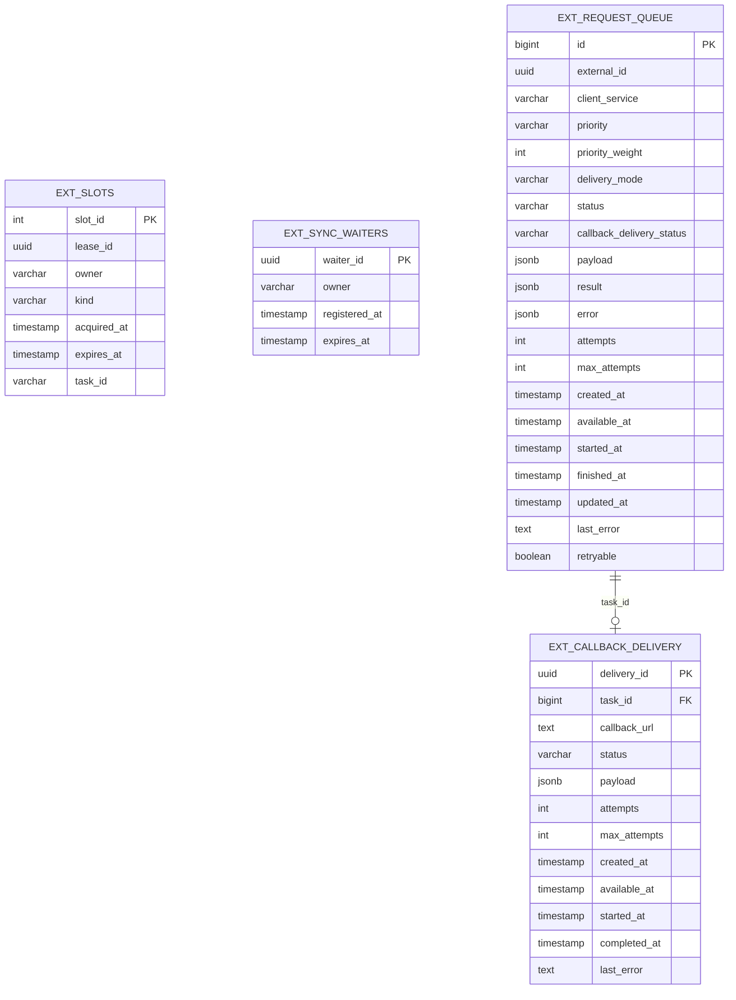
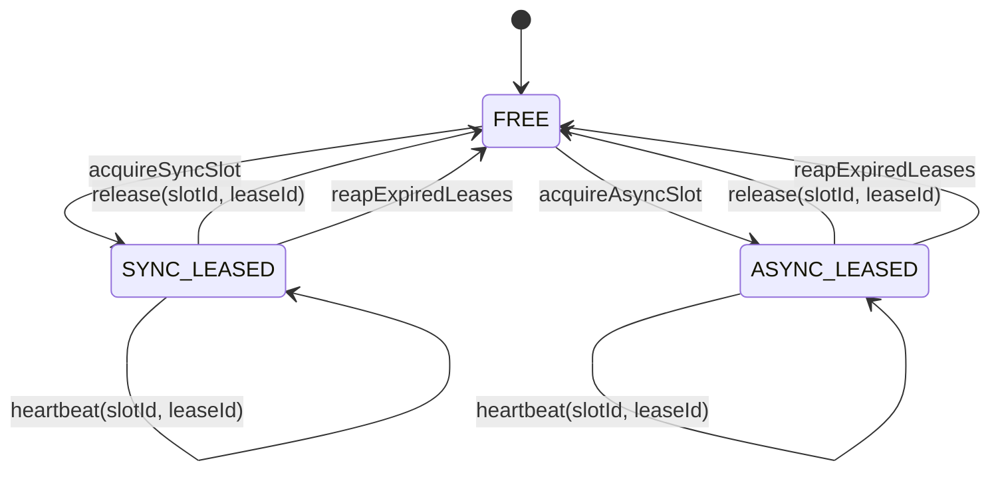
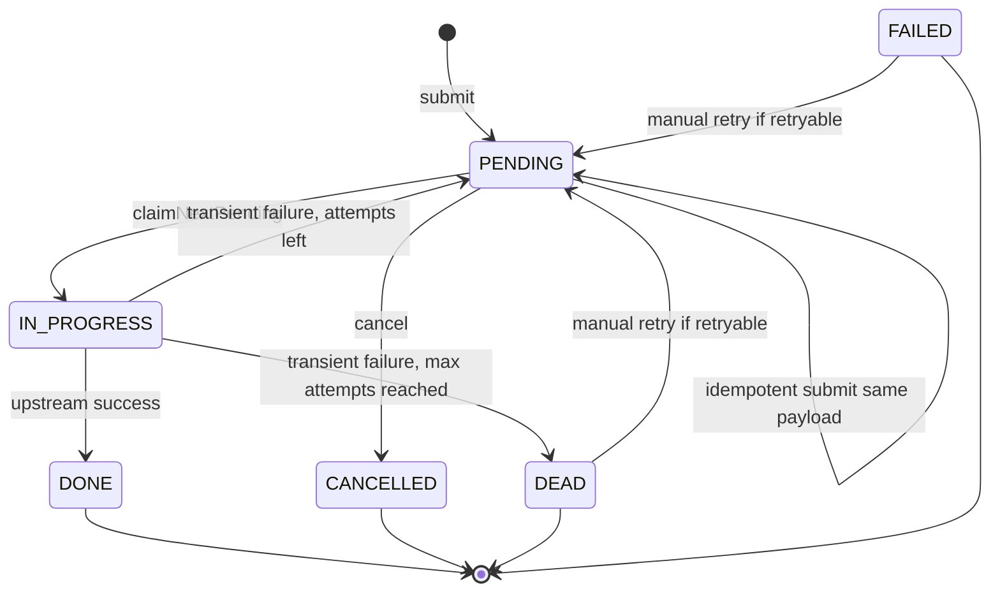
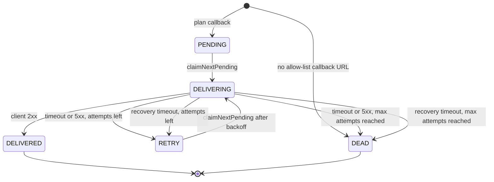

# Data And State View

PostgreSQL schema `external_gateway` является production source of truth для lease-слотов, async-очереди, sync trace и callback-доставки. Memory repository mode полезен для локальной проверки, но не должен использоваться для production-кластера.

## ER-диаграмма



## Таблицы

### `ext_slots`

Хранит фиксированный пул слотов `1..5`. Слот свободен, если `lease_id IS NULL`. Занятый слот содержит `lease_id`, `owner`, `kind`, `acquired_at`, `expires_at` и, для async, `task_id`.

Ключевые правила:

- `kind` может быть `SYNC`, `ASYNC` или `NULL`;
- release и heartbeat допускаются только при совпадении `slot_id + lease_id`;
- истекший lease может быть переиспользован следующим acquire или очищен reaper-ом;
- `task_id` заполняется для `ASYNC`, чтобы dashboard мог связать слот с задачей.

### `ext_sync_waiters`

Хранит короткоживущие записи sync-запросов, которые ждут слот. Наличие live waiter блокирует старт новых async-задач. Запись удаляется в `finally` после завершения ожидания.

### `ext_request_queue`

Используется для двух типов записей:

- async-задачи с `delivery_mode IN ('CALLBACK', 'POLLING')`;
- sync trace с `delivery_mode='SYNC'`.

Async idempotency реализована частичным уникальным индексом:

```text
UNIQUE (client_service, external_id)
WHERE delivery_mode IN ('CALLBACK', 'POLLING')
```

Это позволяет сохранять несколько sync trace с тем же `external_id`, но не позволяет создать две async-задачи для одной пары `clientService + externalId`.

### `ext_callback_delivery`

Отдельная очередь доставки callback. Для одной async-задачи допускается не более одной записи callback delivery. Callback delivery имеет собственный статус и attempts, потому что доставка результата клиенту является отдельной надежностной задачей и не должна менять upstream-статус.

## State machine: слот



## State machine: async task



В PostgreSQL-режиме `IN_PROGRESS` при штатной обработке находится внутри processing transaction. Если JVM падает до финального обновления, row-lock и изменения задачи откатываются, а committed ASYNC lease освобождается по TTL или reaper-ом.

## State machine: callback delivery



## Индексы и порядок обработки

| Объект | Индекс / порядок | Назначение |
| --- | --- | --- |
| `ext_slots` | `idx_ext_slots_busy_kind_expires` | Быстрый подсчет занятых слотов и cleanup. |
| `ext_sync_waiters` | `idx_ext_sync_waiters_expires_at` | Быстрое удаление истекших waiters. |
| `ext_request_queue` | `idx_ext_request_queue_claim` | Claim async задач по `priority_weight DESC, available_at ASC, id ASC`. |
| `ext_request_queue` | `idx_ext_request_queue_external_id` | Lookup по `externalId`. |
| `ext_callback_delivery` | `idx_ext_callback_delivery_claim` | Claim callback delivery по `available_at ASC, created_at ASC, delivery_id ASC`. |

## Data retention

В текущей реализации retention/archival policy явно не задана. Для production требуется определить:

- срок хранения sync trace;
- срок хранения финальных async-задач;
- срок хранения `DELIVERED` callback delivery;
- отдельный retention для `DEAD`, `FAILED`, `CANCELLED`;
- правила удаления с учетом поддержки расследований и аудита.

Без retention `ext_request_queue` и `ext_callback_delivery` будут расти бесконечно.
