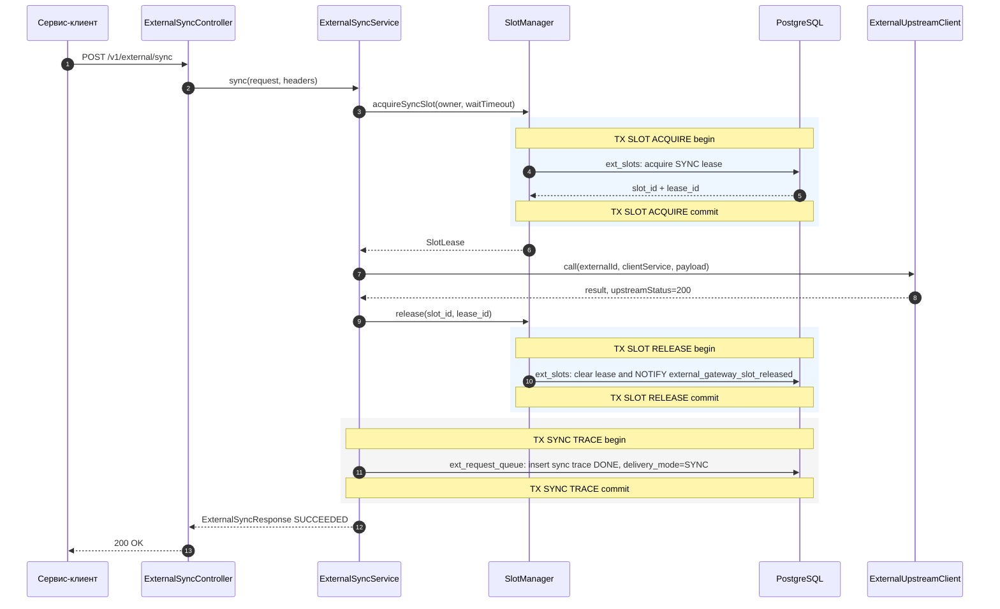
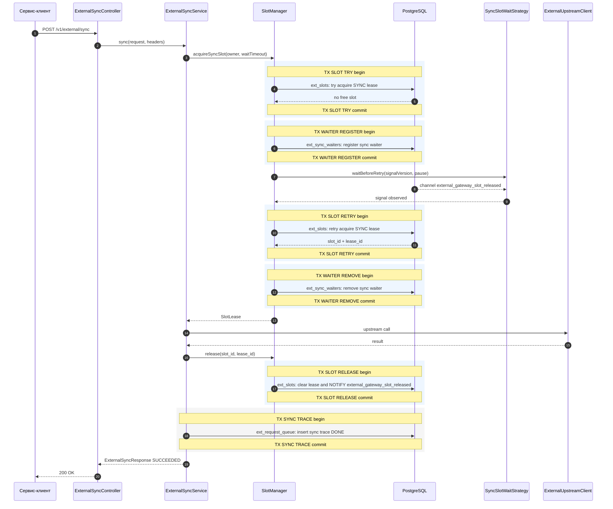
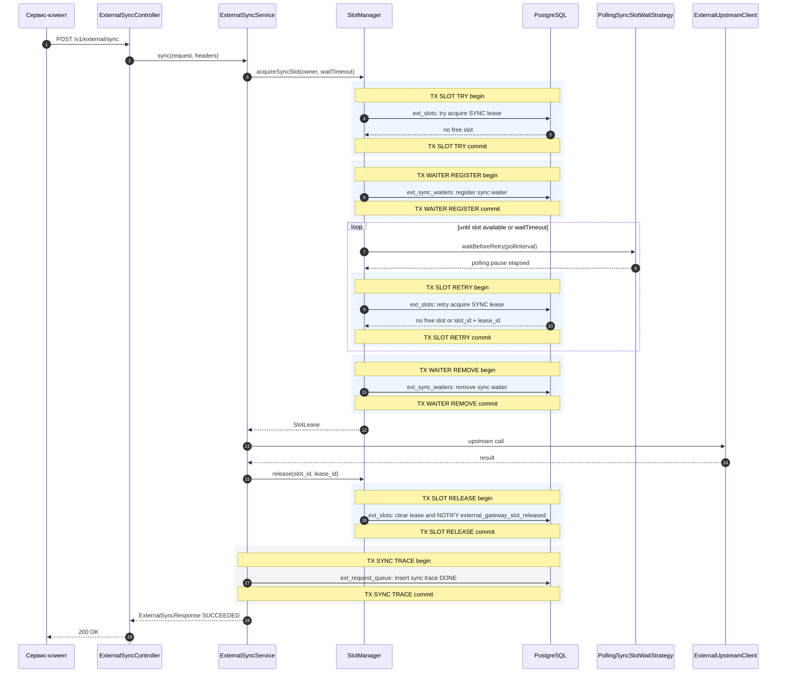
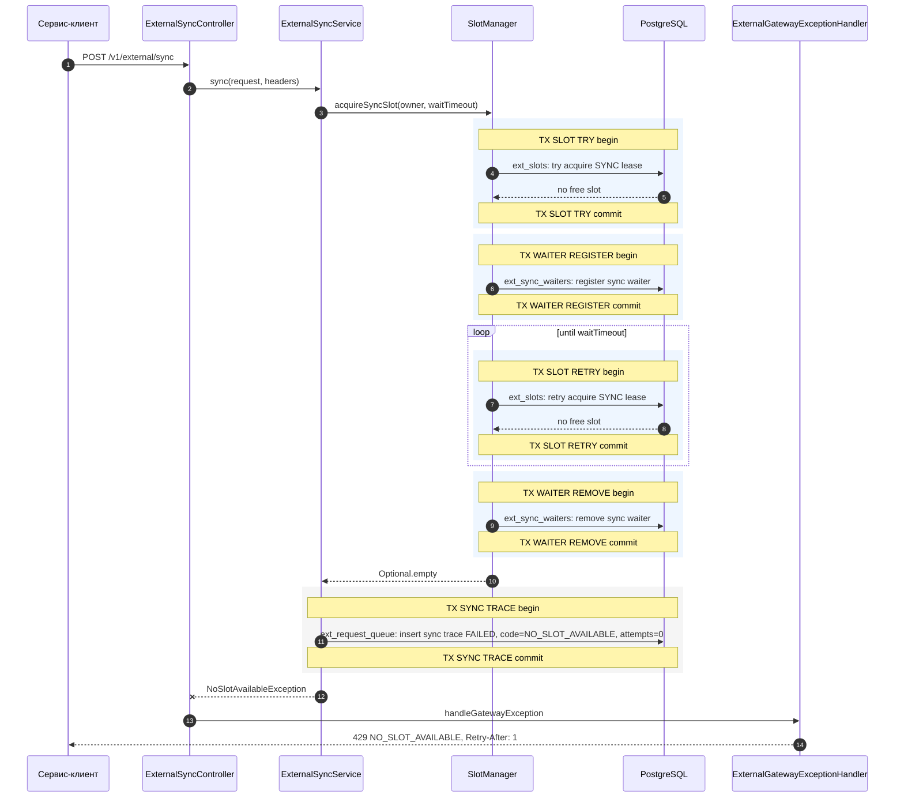
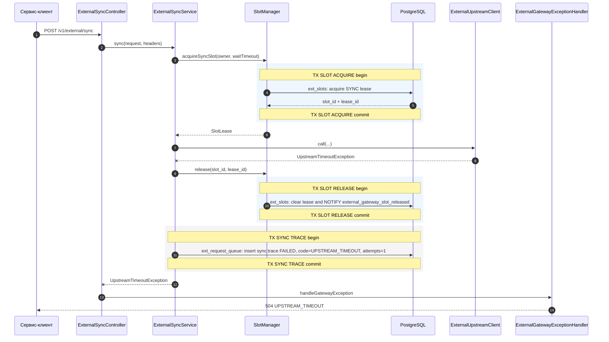
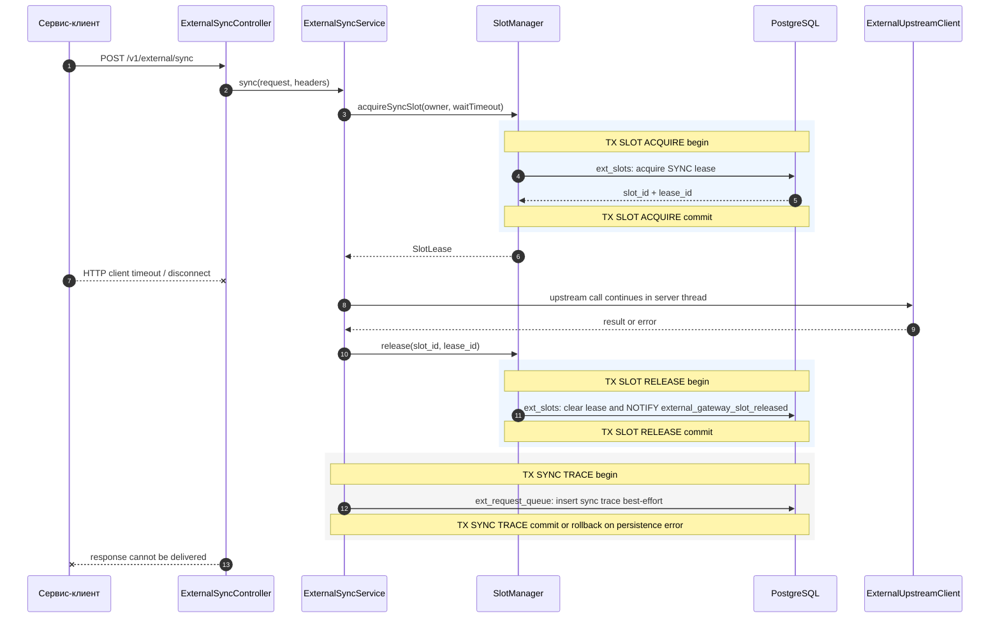
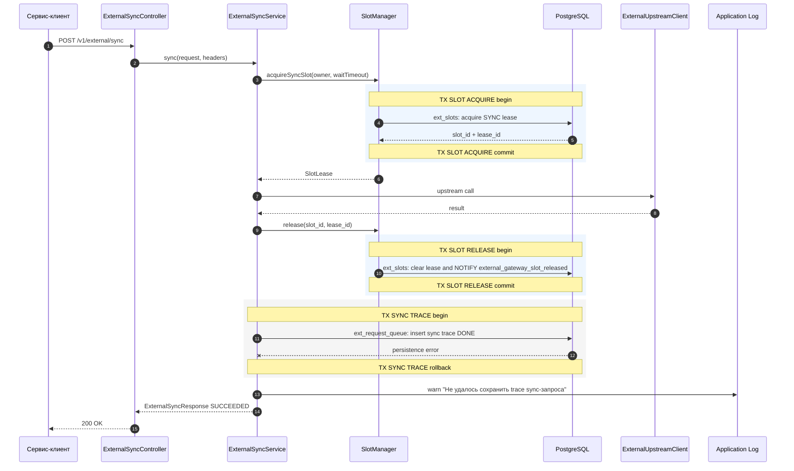

# Sequence View. Sync Scenarios

Sync API выполняет upstream-вызов в рамках исходного HTTP-запроса клиента. Все сценарии ниже разделены намеренно: каждая диаграмма показывает один путь и одну причину завершения.

В стрелках к `PostgreSQL` имя таблицы указано перед двоеточием, например `ext_slots: acquire SYNC lease`.
Границы транзакций показаны подсвеченными `rect`-блоками и заметками `TX ... begin/commit`.

## S-SYNC-01. Успешный sync с немедленным слотом

Особенности:

- слот освобождается в `finally`;
- sync trace является диагностической записью, а не источником ответа клиенту;
- `Idempotency-Key` передается upstream adapter'у, но gateway не хранит sync result по ключу.

## S-SYNC-02. Альтернативный успешный sync через LISTEN/NOTIFY

Этот путь относится к режиму `external-gateway.slots.sync-acquire-wait-mode=listen_notify`. PostgreSQL `NOTIFY` используется только как сигнал проснуться и повторно проверить `ext_slots`; источником истины остается таблица слотов.

## S-SYNC-03. Альтернативный успешный sync через polling

Этот путь относится к режиму `external-gateway.slots.sync-acquire-wait-mode=polling`. Gateway не ждет PostgreSQL notification и повторяет попытку после `external-gateway.slots.sync-acquire-poll-interval`.

## S-SYNC-04. Sync slot не получен до wait timeout

Этот сценарий считается retryable. Клиент может повторить sync-вызов после `Retry-After`, но из-за отсутствия сохраненной sync-idempotency повтор может привести к новому upstream-вызову, если предыдущий вызов успел стартовать в другом сценарии.

## S-SYNC-05. Upstream timeout

Timeout upstream не оставляет слот занятым. Ответ retryable, но безопасность повторного sync-вызова зависит от идемпотентности upstream.

## S-SYNC-06. Client timeout или disconnect после захвата слота

Production-вывод:

- gateway должен гарантировать release слота независимо от состояния клиентского соединения;
- клиентский retry может создать повторный upstream-вызов, потому что sync result не хранится по `Idempotency-Key`;
- для критичных операций нужно либо внедрить sync idempotency storage, либо переводить их в async contract.

## S-SYNC-07. Ошибка записи sync trace после успешного upstream

Trace write является best-effort наблюдаемостью. Потеря trace не должна превращать успешный upstream-вызов в клиентскую ошибку.
