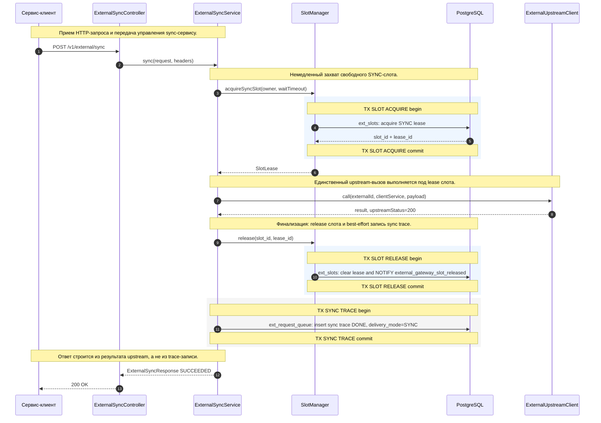
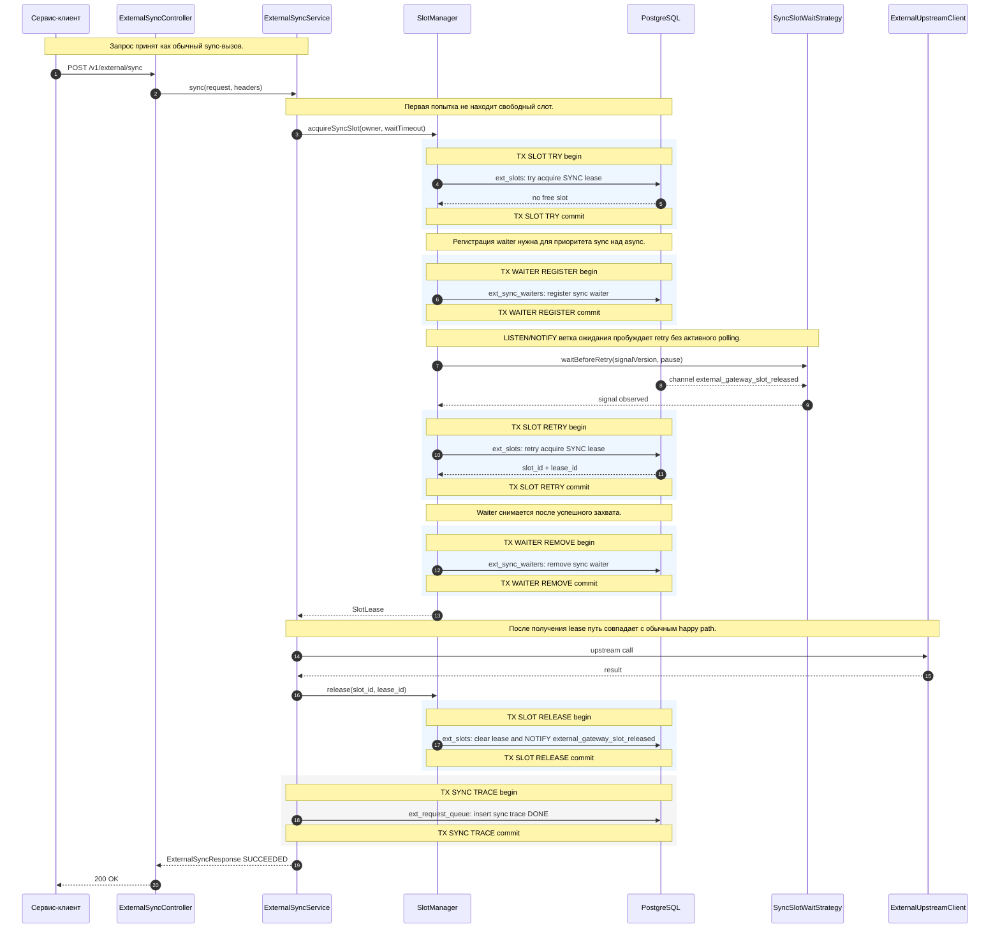
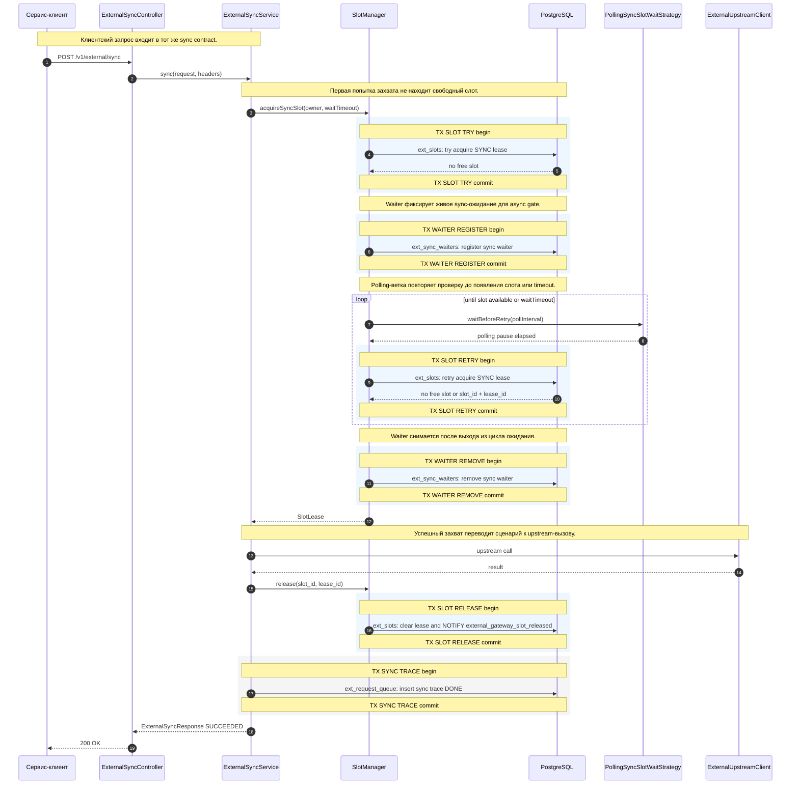
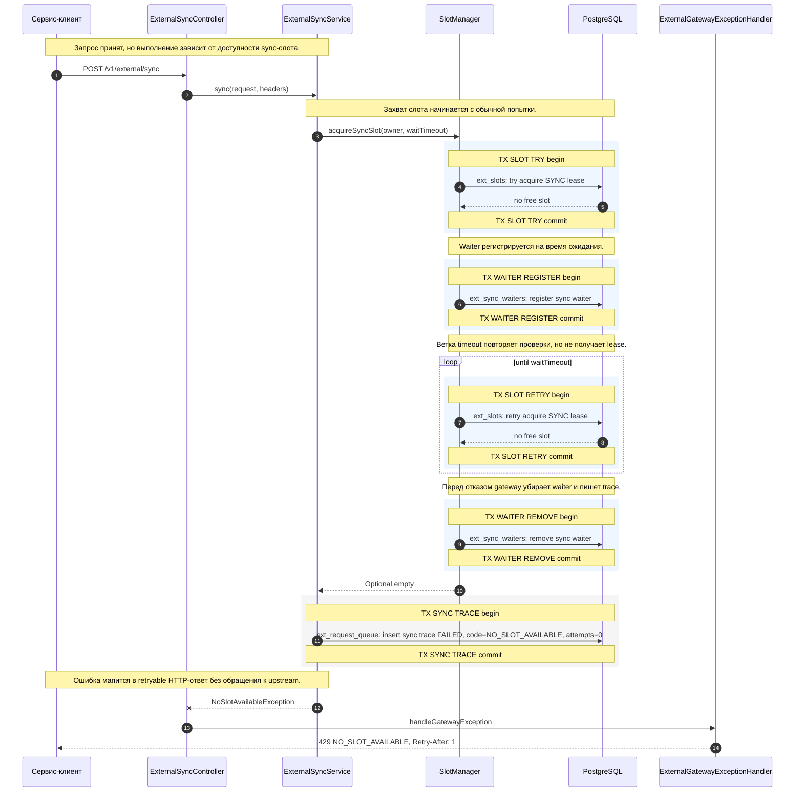
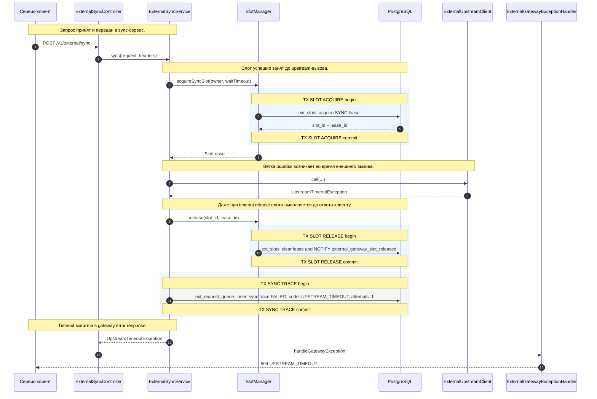
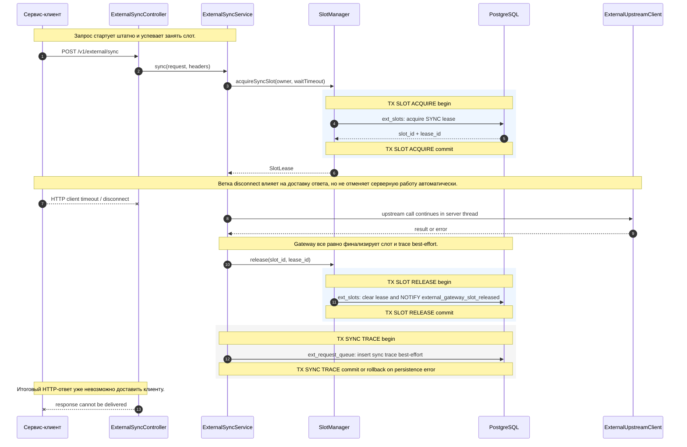
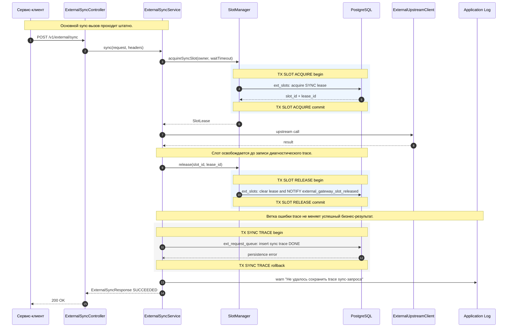

# Sequence View. Sync Scenarios

Sync API выполняет upstream-вызов в рамках исходного HTTP-запроса клиента. Все сценарии ниже разделены намеренно: каждая диаграмма показывает один путь и одну причину завершения.

В стрелках к `PostgreSQL` имя таблицы указано перед двоеточием, например `ext_slots: acquire SYNC lease`.
Границы транзакций показаны подсвеченными `rect`-блоками и заметками `TX ... begin/commit`.

## S-SYNC-01. Успешный sync с немедленным слотом

Диаграмма описывает базовый happy path: слот доступен сразу, upstream отвечает успешно, gateway освобождает слот и возвращает клиенту `200 OK`.

| Шаг | Лейбл на диаграмме | Что делает шаг |
| --- | --- | --- |
| 1 | `POST /v1/external/sync` | Клиент отправляет синхронный запрос с payload, `externalId`, `clientService` и HTTP-заголовками трассировки. |
| 2 | `sync(request, headers)` | Controller валидирует HTTP-контракт и передает доменный request в `ExternalSyncService`. |
| 3 | `acquireSyncSlot(owner, waitTimeout)` | Sync-сервис просит `SlotManager` получить SYNC lease для владельца `clientService:externalId`. |
| 4 | `ext_slots: acquire SYNC lease` | Репозиторий атомарно занимает свободный слот и записывает `lease_id`, owner и время lease. |
| 5 | `slot_id + lease_id` | PostgreSQL возвращает идентификаторы, по которым можно безопасно освободить только свой lease. |
| 6 | `SlotLease` | `SlotManager` возвращает сервису объект lease для дальнейшего upstream-вызова и release. |
| 7 | `call(externalId, clientService, payload)` | Gateway вызывает внешний сервис, передавая payload и клиентский контекст. |
| 8 | `result, upstreamStatus=200` | Upstream возвращает успешный результат и HTTP-статус, которые попадут в sync response. |
| 9 | `release(slot_id, lease_id)` | Sync-сервис в `finally` инициирует освобождение слота по паре `slot_id + lease_id`. |
| 10 | `ext_slots: clear lease and NOTIFY external_gateway_slot_released` | PostgreSQL очищает lease и отправляет notification ожидающим sync-запросам. |
| 11 | `ext_request_queue: insert sync trace DONE, delivery_mode=SYNC` | Gateway пишет диагностический trace успешного sync-вызова в общую таблицу request queue. |
| 12 | `ExternalSyncResponse SUCCEEDED` | Сервис формирует успешный доменный ответ с результатом upstream и длительностью вызова. |
| 13 | `200 OK` | Controller возвращает клиенту HTTP 200 с телом sync response. |

Особенности:

- слот освобождается в `finally`;
- sync trace является диагностической записью, а не источником ответа клиенту;
- `Idempotency-Key` передается upstream adapter'у, но gateway не хранит sync result по ключу.

## S-SYNC-02. Альтернативный успешный sync через LISTEN/NOTIFY

Диаграмма описывает успешный sync, когда свободного слота сначала нет, но gateway просыпается по PostgreSQL `NOTIFY` и получает слот до истечения wait timeout.

| Шаг | Лейбл на диаграмме | Что делает шаг |
| --- | --- | --- |
| 1 | `POST /v1/external/sync` | Клиент начинает sync-вызов. |
| 2 | `sync(request, headers)` | Controller передает запрос в sync-сервис. |
| 3 | `acquireSyncSlot(owner, waitTimeout)` | Sync-сервис запускает алгоритм захвата слота с ожиданием до `waitTimeout`. |
| 4 | `ext_slots: try acquire SYNC lease` | База проверяет свободные слоты в первой короткой транзакции. |
| 5 | `no free slot` | Свободного слота нет, поэтому upstream еще не вызывается. |
| 6 | `ext_sync_waiters: register sync waiter` | Gateway регистрирует ожидающий sync-запрос, чтобы async-dispatcher учитывал живой waiter. |
| 7 | `waitBeforeRetry(signalVersion, pause)` | Wait strategy блокирует поток до notification или до очередного крайнего срока ожидания. |
| 8 | `channel external_gateway_slot_released` | PostgreSQL сообщает, что какой-то слот освобожден. |
| 9 | `signal observed` | Wait strategy подтверждает пробуждение и разрешает повторную попытку. |
| 10 | `ext_slots: retry acquire SYNC lease` | `SlotManager` повторно проверяет таблицу слотов, потому что notification не является источником истины. |
| 11 | `slot_id + lease_id` | Повторная попытка успешно получает lease. |
| 12 | `ext_sync_waiters: remove sync waiter` | Waiter удаляется, чтобы не блокировать async-запуски после завершения ожидания. |
| 13 | `SlotLease` | Lease передается sync-сервису. |
| 14 | `upstream call` | Gateway выполняет внешний вызов под занятым слотом. |
| 15 | `result` | Upstream возвращает успешный результат. |
| 16 | `release(slot_id, lease_id)` | Sync-сервис освобождает слот. |
| 17 | `ext_slots: clear lease and NOTIFY external_gateway_slot_released` | База очищает lease и будит другие waiters. |
| 18 | `ext_request_queue: insert sync trace DONE` | Gateway сохраняет диагностический trace успешного sync-вызова. |
| 19 | `ExternalSyncResponse SUCCEEDED` | Sync-сервис возвращает доменный success response. |
| 20 | `200 OK` | Controller отдает клиенту успешный HTTP-ответ. |

Особенности:

- этот путь относится к режиму `external-gateway.slots.sync-acquire-wait-mode=listen_notify`;
- PostgreSQL `NOTIFY` используется только как сигнал проснуться и повторно проверить `ext_slots`;
- источником истины остается таблица слотов.

## S-SYNC-03. Альтернативный успешный sync через polling

Диаграмма описывает успешный sync в режиме polling: gateway не ждет PostgreSQL notification, а периодически повторяет попытку захвата слота.

| Шаг | Лейбл на диаграмме | Что делает шаг |
| --- | --- | --- |
| 1 | `POST /v1/external/sync` | Клиент отправляет sync-запрос. |
| 2 | `sync(request, headers)` | Controller передает управление sync-сервису. |
| 3 | `acquireSyncSlot(owner, waitTimeout)` | Сервис запускает захват слота с ограниченным временем ожидания. |
| 4 | `ext_slots: try acquire SYNC lease` | Первая транзакция пытается занять свободный SYNC-слот. |
| 5 | `no free slot` | Слота нет, поэтому gateway переходит к ожиданию. |
| 6 | `ext_sync_waiters: register sync waiter` | Gateway сохраняет waiter, чтобы async не вытеснял ожидающие sync-запросы. |
| 7 | `waitBeforeRetry(pollInterval)` | Polling strategy делает паузу на configured interval или меньше, если timeout ближе. |
| 8 | `polling pause elapsed` | Пауза завершилась, можно снова проверять `ext_slots`. |
| 9 | `ext_slots: retry acquire SYNC lease` | Gateway повторяет атомарный захват слота. |
| 10 | `no free slot or slot_id + lease_id` | Цикл либо продолжается без слота, либо получает lease и выходит к обработке. |
| 11 | `ext_sync_waiters: remove sync waiter` | Waiter удаляется после завершения ожидания. |
| 12 | `SlotLease` | Успешный lease возвращается sync-сервису. |
| 13 | `upstream call` | Gateway выполняет внешний вызов. |
| 14 | `result` | Upstream возвращает результат. |
| 15 | `release(slot_id, lease_id)` | Сервис освобождает занятый слот. |
| 16 | `ext_slots: clear lease and NOTIFY external_gateway_slot_released` | База очищает lease и отправляет notification для других ожидающих запросов. |
| 17 | `ext_request_queue: insert sync trace DONE` | Gateway сохраняет успешный trace. |
| 18 | `ExternalSyncResponse SUCCEEDED` | Sync-сервис возвращает success response. |
| 19 | `200 OK` | Controller отправляет клиенту HTTP 200. |

Особенности:

- этот путь относится к режиму `external-gateway.slots.sync-acquire-wait-mode=polling`;
- gateway не ждет PostgreSQL notification;
- повторная попытка выполняется после `external-gateway.slots.sync-acquire-poll-interval`.

## S-SYNC-04. Sync slot не получен до wait timeout

Диаграмма описывает отказ без upstream-вызова: gateway не получил слот за отведенное время и возвращает клиенту retryable `429`.

| Шаг | Лейбл на диаграмме | Что делает шаг |
| --- | --- | --- |
| 1 | `POST /v1/external/sync` | Клиент отправляет sync-запрос. |
| 2 | `sync(request, headers)` | Controller вызывает sync-сервис. |
| 3 | `acquireSyncSlot(owner, waitTimeout)` | Сервис пытается получить слот до истечения configured timeout. |
| 4 | `ext_slots: try acquire SYNC lease` | Первая проверка таблицы слотов не находит свободный lease. |
| 5 | `no free slot` | Gateway понимает, что upstream нельзя вызывать сейчас. |
| 6 | `ext_sync_waiters: register sync waiter` | Waiter фиксируется для честной очередности между sync и async. |
| 7 | `ext_slots: retry acquire SYNC lease` | Gateway повторяет проверку доступности слота в цикле ожидания. |
| 8 | `no free slot` | Очередная попытка также не получает lease; цикл продолжается до timeout. |
| 9 | `ext_sync_waiters: remove sync waiter` | Waiter удаляется, чтобы не оставлять ложный sync backlog. |
| 10 | `Optional.empty` | `SlotManager` сообщает, что слот получить не удалось. |
| 11 | `ext_request_queue: insert sync trace FAILED, code=NO_SLOT_AVAILABLE, attempts=0` | Gateway пишет диагностическую запись отказа без upstream-попытки. |
| 12 | `NoSlotAvailableException` | Sync-сервис выбрасывает доменную ошибку отсутствия слота. |
| 13 | `handleGatewayException` | Exception handler преобразует ошибку в HTTP-контракт. |
| 14 | `429 NO_SLOT_AVAILABLE, Retry-After: 1` | Клиент получает retryable ответ с подсказкой, когда повторить запрос. |

Особенности:

- сценарий считается retryable;
- клиент может повторить sync-вызов после `Retry-After`;
- из-за отсутствия сохраненной sync-idempotency повтор может привести к новому upstream-вызову, если предыдущий вызов успел стартовать в другом сценарии.

## S-SYNC-05. Upstream timeout

Диаграмма описывает ошибку после успешного захвата слота: upstream не ответил вовремя, слот освобождается, клиент получает `504`.

| Шаг | Лейбл на диаграмме | Что делает шаг |
| --- | --- | --- |
| 1 | `POST /v1/external/sync` | Клиент отправляет sync-запрос. |
| 2 | `sync(request, headers)` | Controller передает запрос сервису. |
| 3 | `acquireSyncSlot(owner, waitTimeout)` | Сервис получает слот перед upstream-вызовом. |
| 4 | `ext_slots: acquire SYNC lease` | PostgreSQL занимает слот для sync-владельца. |
| 5 | `slot_id + lease_id` | База возвращает lease-идентификаторы. |
| 6 | `SlotLease` | `SlotManager` возвращает lease сервису. |
| 7 | `call(...)` | Gateway вызывает внешний сервис. |
| 8 | `UpstreamTimeoutException` | Upstream call завершается timeout-исключением. |
| 9 | `release(slot_id, lease_id)` | Sync-сервис освобождает слот в `finally`. |
| 10 | `ext_slots: clear lease and NOTIFY external_gateway_slot_released` | База очищает lease и будит ожидателей. |
| 11 | `ext_request_queue: insert sync trace FAILED, code=UPSTREAM_TIMEOUT, attempts=1` | Gateway пишет trace failed-вызова с одной upstream-попыткой. |
| 12 | `UpstreamTimeoutException` | Ошибка пробрасывается из sync-сервиса в controller. |
| 13 | `handleGatewayException` | Exception handler строит HTTP-ошибку gateway. |
| 14 | `504 UPSTREAM_TIMEOUT` | Клиент получает timeout-ответ. |

Особенности:

- timeout upstream не оставляет слот занятым;
- ответ retryable;
- безопасность повторного sync-вызова зависит от идемпотентности upstream.

## S-SYNC-06. Client timeout или disconnect после захвата слота

Диаграмма описывает ситуацию, когда клиентское соединение закрывается после захвата слота, а серверный поток продолжает upstream-вызов и освобождает ресурс.

| Шаг | Лейбл на диаграмме | Что делает шаг |
| --- | --- | --- |
| 1 | `POST /v1/external/sync` | Клиент отправляет sync-запрос. |
| 2 | `sync(request, headers)` | Controller вызывает sync-сервис. |
| 3 | `acquireSyncSlot(owner, waitTimeout)` | Сервис запрашивает lease слота. |
| 4 | `ext_slots: acquire SYNC lease` | PostgreSQL занимает свободный SYNC-слот. |
| 5 | `slot_id + lease_id` | База возвращает lease-идентификаторы. |
| 6 | `SlotLease` | Lease передается sync-сервису. |
| 7 | `HTTP client timeout / disconnect` | Клиент перестает ждать ответ или закрывает соединение. |
| 8 | `upstream call continues in server thread` | Серверный поток продолжает выполнение, если приложение явно не отменило работу. |
| 9 | `result or error` | Upstream возвращает результат или ошибку, но клиент уже недоступен. |
| 10 | `release(slot_id, lease_id)` | Gateway освобождает слот независимо от состояния клиентского соединения. |
| 11 | `ext_slots: clear lease and NOTIFY external_gateway_slot_released` | База очищает lease и сообщает ожидателям. |
| 12 | `ext_request_queue: insert sync trace best-effort` | Gateway пытается сохранить диагностический итог; ошибка записи не меняет уже произошедший upstream-вызов. |
| 13 | `response cannot be delivered` | HTTP-ответ не доставляется, потому что клиентское соединение закрыто. |

Особенности:

- gateway должен гарантировать release слота независимо от состояния клиентского соединения;
- клиентский retry может создать повторный upstream-вызов, потому что sync result не хранится по `Idempotency-Key`;
- для критичных операций нужно либо внедрить sync idempotency storage, либо переводить их в async contract.

## S-SYNC-07. Ошибка записи sync trace после успешного upstream

Диаграмма описывает best-effort характер sync trace: upstream-вызов уже успешен, поэтому ошибка записи trace логируется, но клиент получает `200 OK`.

| Шаг | Лейбл на диаграмме | Что делает шаг |
| --- | --- | --- |
| 1 | `POST /v1/external/sync` | Клиент отправляет sync-запрос. |
| 2 | `sync(request, headers)` | Controller передает запрос в sync-сервис. |
| 3 | `acquireSyncSlot(owner, waitTimeout)` | Сервис получает слот. |
| 4 | `ext_slots: acquire SYNC lease` | PostgreSQL занимает SYNC-слот. |
| 5 | `slot_id + lease_id` | База возвращает lease-идентификаторы. |
| 6 | `SlotLease` | Lease передается сервису. |
| 7 | `upstream call` | Gateway выполняет внешний вызов. |
| 8 | `result` | Upstream успешно возвращает результат. |
| 9 | `release(slot_id, lease_id)` | Сервис освобождает слот. |
| 10 | `ext_slots: clear lease and NOTIFY external_gateway_slot_released` | База очищает lease и будит waiters. |
| 11 | `ext_request_queue: insert sync trace DONE` | Gateway пытается записать успешный trace. |
| 12 | `persistence error` | Хранилище trace возвращает ошибку, транзакция trace откатывается. |
| 13 | `warn "Не удалось сохранить trace sync-запроса"` | Ошибка фиксируется в application log как потеря наблюдаемости. |
| 14 | `ExternalSyncResponse SUCCEEDED` | Sync-сервис сохраняет успешный клиентский результат. |
| 15 | `200 OK` | Controller возвращает клиенту HTTP 200. |

Особенности:

- trace write является best-effort наблюдаемостью;
- потеря trace не должна превращать успешный upstream-вызов в клиентскую ошибку;
- для расследований нужен application log, потому что строка trace может отсутствовать.
