# Sequence View. Async Scenarios

Async contract разделяет прием запроса, выполнение upstream и получение результата. Это позволяет быстро вернуть `202 Accepted`, сохранить задачу в durable storage и доставить результат callback-ом или через polling.

В стрелках к `PostgreSQL` имя таблицы указано перед двоеточием, например `ext_request_queue: claim next PENDING task`.
Границы транзакций показаны подсвеченными `rect`-блоками и заметками `TX ... begin/commit`.

## S-ASYNC-01. Submit новой async-задачи

Диаграмма описывает прием новой async-задачи: gateway сохраняет `PENDING`-строку и сразу возвращает клиенту ссылку на статус.

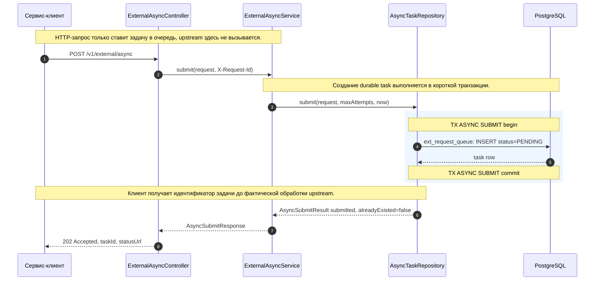

| Шаг | Лейбл на диаграмме | Что делает шаг |
| --- | --- | --- |
| 1 | `POST /v1/external/async` | Клиент отправляет async-запрос с payload, `externalId`, `clientService`, режимом доставки и приоритетом. |
| 2 | `submit(request, X-Request-Id)` | Controller передает запрос в `ExternalAsyncService`, сохраняя request id для ошибок. |
| 3 | `submit(request, maxAttempts, now)` | Сервис вызывает репозиторий с лимитом upstream-попыток и текущим временем gateway. |
| 4 | `ext_request_queue: INSERT status=PENDING` | PostgreSQL создает новую durable-задачу в статусе `PENDING`. |
| 5 | `task row` | База возвращает созданную строку с `taskId` и служебными полями. |
| 6 | `AsyncSubmitResult submitted, alreadyExisted=false` | Репозиторий сообщает, что создана новая задача, а не найден дубль. |
| 7 | `AsyncSubmitResponse` | Сервис формирует ответ submit contract. |
| 8 | `202 Accepted, taskId, statusUrl` | Клиент получает `202 Accepted`, внутренний id задачи и URL для polling. |

Особенности:

- async-задача еще не выполнялась;
- ее обработает dispatcher на следующем scheduled tick или раньше, если воркер уже крутит цикл до idle;
- submit не удерживает слот внешнего сервиса.

## S-ASYNC-02. Idempotent submit той же задачи

Диаграмма описывает повторный submit с тем же `clientService + externalId` и теми же параметрами: gateway возвращает существующую задачу без создания дубля.

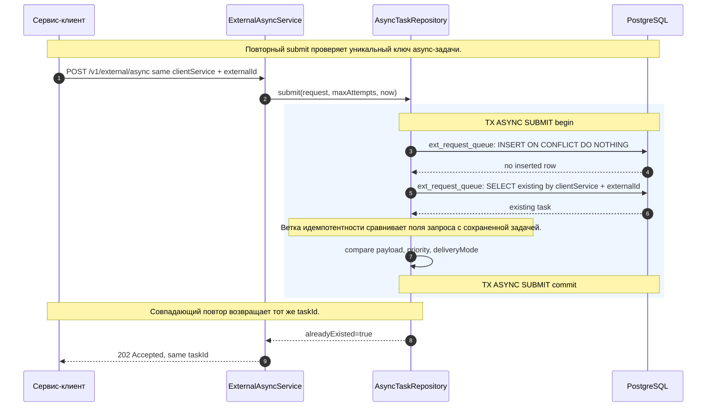

| Шаг | Лейбл на диаграмме | Что делает шаг |
| --- | --- | --- |
| 1 | `POST /v1/external/async same clientService + externalId` | Клиент повторяет submit для той же бизнес-операции. |
| 2 | `submit(request, maxAttempts, now)` | Сервис повторно вызывает submit в репозитории. |
| 3 | `ext_request_queue: INSERT ON CONFLICT DO NOTHING` | База пытается вставить строку, но уникальный ключ уже занят. |
| 4 | `no inserted row` | Репозиторий понимает, что нужно читать существующую задачу. |
| 5 | `ext_request_queue: SELECT existing by clientService + externalId` | Gateway ищет задачу по async-idempotency key. |
| 6 | `existing task` | База возвращает ранее созданную строку. |
| 7 | `compare payload, priority, deliveryMode` | Репозиторий проверяет, что повторный запрос семантически совпадает с исходным. |
| 8 | `alreadyExisted=true` | Submit result помечает ответ как идемпотентный повтор. |
| 9 | `202 Accepted, same taskId` | Клиент получает тот же `taskId`, без создания новой upstream-работы. |

Особенности:

- идемпотентность async не использует `Idempotency-Key`;
- ключом является пара `clientService + externalId`;
- совпадать должны не только ключи, но и `payload`, `priority`, `deliveryMode`.

## S-ASYNC-03. Idempotency conflict

Диаграмма описывает конфликт идемпотентности: ключ тот же, но сохраненная задача отличается от нового запроса.

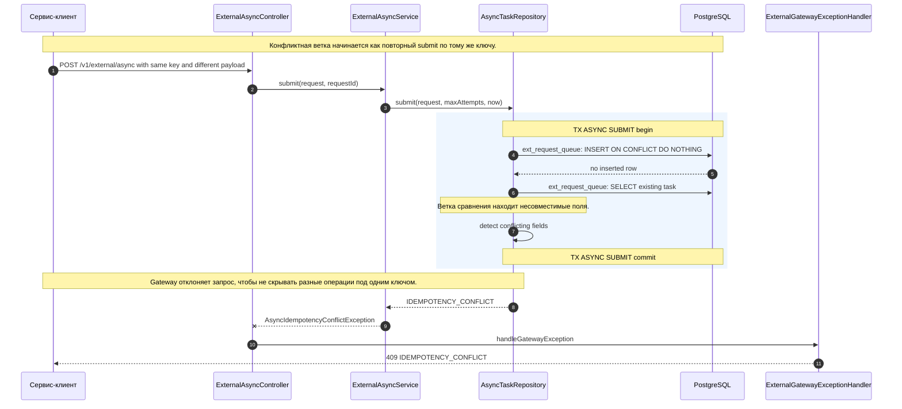

| Шаг | Лейбл на диаграмме | Что делает шаг |
| --- | --- | --- |
| 1 | `POST /v1/external/async with same key and different payload` | Клиент отправляет запрос с уже занятым `clientService + externalId`, но с другими данными. |
| 2 | `submit(request, requestId)` | Controller передает request id для корректного error response. |
| 3 | `submit(request, maxAttempts, now)` | Сервис запускает стандартный submit. |
| 4 | `ext_request_queue: INSERT ON CONFLICT DO NOTHING` | База не вставляет дубль из-за уникального ключа. |
| 5 | `no inserted row` | Репозиторий переходит к чтению существующей задачи. |
| 6 | `ext_request_queue: SELECT existing task` | Gateway получает сохраненную задачу для сравнения. |
| 7 | `detect conflicting fields` | Репозиторий определяет, какие поля отличаются от исходного submit. |
| 8 | `IDEMPOTENCY_CONFLICT` | Репозиторий возвращает результат конфликта вместо задачи. |
| 9 | `AsyncIdempotencyConflictException` | Сервис преобразует конфликт в доменное исключение. |
| 10 | `handleGatewayException` | Exception handler строит HTTP-ответ. |
| 11 | `409 IDEMPOTENCY_CONFLICT` | Клиент получает конфликт идемпотентности. |

Особенности:

- конфликт возможен при различии `payload`, `priority` или `deliveryMode`;
- upstream не вызывается;
- существующая задача не изменяется.

## S-ASYNC-04. Dispatch success с callback mode

Диаграмма описывает успешную обработку async-задачи в режиме callback: dispatcher забирает задачу, выполняет upstream, фиксирует `DONE` и создает pending callback-доставку.

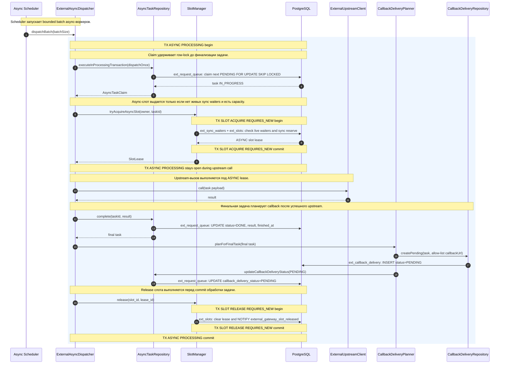

| Шаг | Лейбл на диаграмме | Что делает шаг |
| --- | --- | --- |
| 1 | `dispatchBatch(batchSize)` | Scheduler просит dispatcher запустить ограниченное число async-итераций. |
| 2 | `executeInProcessingTransaction(dispatchOnce)` | Dispatcher выполняет одну обработку в транзакции репозитория. |
| 3 | `ext_request_queue: claim next PENDING FOR UPDATE SKIP LOCKED` | PostgreSQL выбирает доступную `PENDING`-задачу и блокирует строку от других воркеров. |
| 4 | `task IN_PROGRESS` | Задача переводится в обработку, счетчик попыток уже учитывает запуск. |
| 5 | `AsyncTaskClaim` | Репозиторий возвращает задачу вместе с payload для upstream. |
| 6 | `tryAcquireAsyncSlot(owner, taskId)` | Dispatcher пытается получить ASYNC lease без ожидания. |
| 7 | `ext_sync_waiters + ext_slots: check live waiters and sync reserve` | База проверяет живые sync waiters и свободную capacity, чтобы async не вытеснил sync. |
| 8 | `ASYNC slot lease` | PostgreSQL выделяет async-слот. |
| 9 | `SlotLease` | Lease возвращается dispatcher-у. |
| 10 | `call(task payload)` | Gateway вызывает внешний сервис с payload задачи. |
| 11 | `result` | Upstream возвращает успешный результат. |
| 12 | `complete(taskId, result)` | Dispatcher фиксирует успешное завершение задачи. |
| 13 | `ext_request_queue: UPDATE status=DONE, result, finished_at` | Репозиторий сохраняет `DONE`, результат и время завершения. |
| 14 | `final task` | Обновленная финальная задача возвращается для планирования доставки. |
| 15 | `planForFinalTask(final task)` | Planner решает, нужна ли callback-доставка для финального статуса. |
| 16 | `createPending(task, allow-list callbackUrl)` | Planner берет allow-listed callback URL клиента и создает доставку. |
| 17 | `ext_callback_delivery: INSERT status=PENDING` | База сохраняет pending callback delivery. |
| 18 | `updateCallbackDeliveryStatus(PENDING)` | Planner синхронизирует агрегированный статус доставки в задаче. |
| 19 | `ext_request_queue: UPDATE callback_delivery_status=PENDING` | Строка задачи получает статус callback-доставки `PENDING`. |
| 20 | `release(slot_id, lease_id)` | Dispatcher освобождает async-слот. |
| 21 | `ext_slots: clear lease and NOTIFY external_gateway_slot_released` | База очищает lease и будит ожидающие sync-запросы. |

Особенности:

- на этом сценарий upstream-задачи завершен;
- доставка callback выполняется отдельным dispatcher-ом и описана в [07-sequence-callback.md](07-sequence-callback.md);
- `CallbackDeliveryPlanner` использует allow-list URL из конфигурации клиента, а не произвольный URL из тела запроса.

## S-ASYNC-05. Dispatch success с polling mode

Диаграмма описывает успешную async-обработку без callback: результат сохраняется в задаче, а клиент забирает его через polling endpoint.

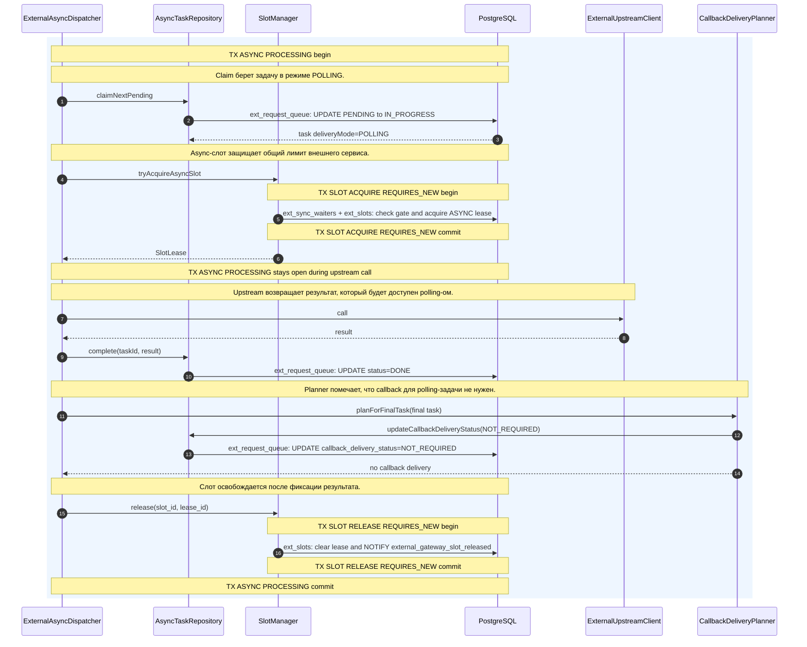

| Шаг | Лейбл на диаграмме | Что делает шаг |
| --- | --- | --- |
| 1 | `claimNextPending` | Dispatcher берет следующую доступную задачу. |
| 2 | `ext_request_queue: UPDATE PENDING to IN_PROGRESS` | Репозиторий переводит задачу в обработку. |
| 3 | `task deliveryMode=POLLING` | Задача возвращается с режимом доставки через polling. |
| 4 | `tryAcquireAsyncSlot` | Dispatcher пытается получить async-слот без ожидания. |
| 5 | `ext_sync_waiters + ext_slots: check gate and acquire ASYNC lease` | PostgreSQL проверяет sync waiters и свободные слоты, затем выдает lease. |
| 6 | `SlotLease` | Lease передается dispatcher-у. |
| 7 | `call` | Gateway выполняет upstream-вызов. |
| 8 | `result` | Upstream возвращает результат. |
| 9 | `complete(taskId, result)` | Dispatcher завершает задачу успешно. |
| 10 | `ext_request_queue: UPDATE status=DONE` | Результат сохраняется в строке задачи. |
| 11 | `planForFinalTask(final task)` | Planner проверяет финальную задачу. |
| 12 | `updateCallbackDeliveryStatus(NOT_REQUIRED)` | Planner фиксирует, что callback-доставка не требуется. |
| 13 | `ext_request_queue: UPDATE callback_delivery_status=NOT_REQUIRED` | Строка задачи получает агрегированный статус `NOT_REQUIRED`. |
| 14 | `no callback delivery` | Planner не создает запись в `ext_callback_delivery`. |
| 15 | `release(slot_id, lease_id)` | Dispatcher освобождает async-слот. |
| 16 | `ext_slots: clear lease and NOTIFY external_gateway_slot_released` | База очищает lease и отправляет notification. |

Особенности:

- клиент получает результат через polling endpoint;
- callback delivery для такой задачи не создается;
- результат хранится в `ext_request_queue` до политики очистки данных.

## S-ASYNC-06. Async slot недоступен после claim

Диаграмма описывает защитную ветку: dispatcher уже забрал задачу, но async-слот не выдан, поэтому claim откатывается в `PENDING` без upstream-попытки.

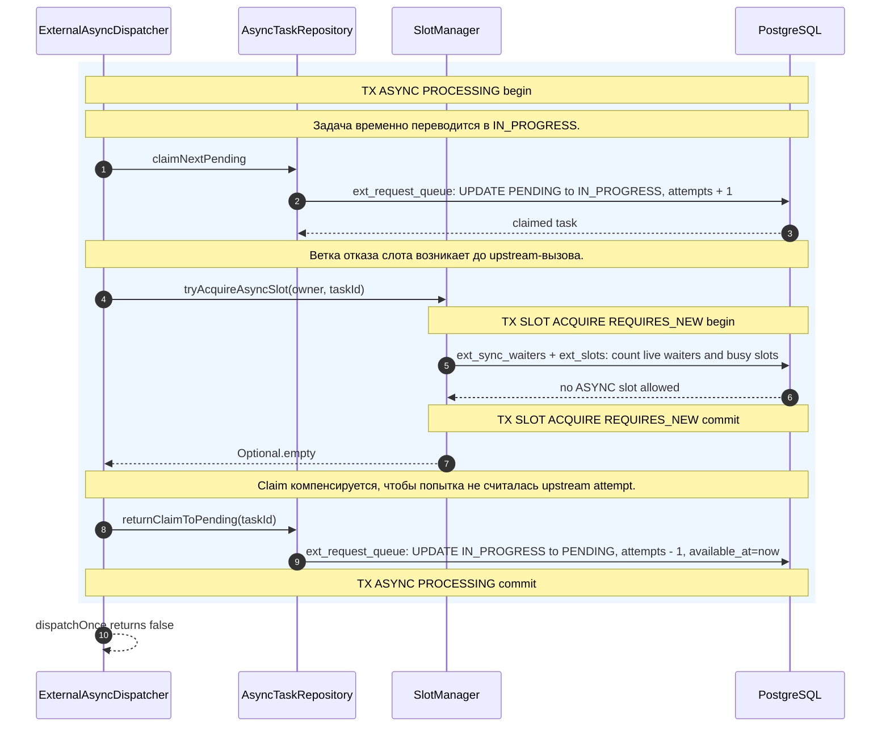

| Шаг | Лейбл на диаграмме | Что делает шаг |
| --- | --- | --- |
| 1 | `claimNextPending` | Dispatcher берет доступную задачу из очереди. |
| 2 | `ext_request_queue: UPDATE PENDING to IN_PROGRESS, attempts + 1` | Репозиторий переводит строку в обработку и временно увеличивает attempts. |
| 3 | `claimed task` | Задача возвращается dispatcher-у. |
| 4 | `tryAcquireAsyncSlot(owner, taskId)` | Dispatcher пытается занять слот внешнего сервиса. |
| 5 | `ext_sync_waiters + ext_slots: count live waiters and busy slots` | База видит, что async сейчас нельзя запускать: есть sync waiters или нет capacity. |
| 6 | `no ASYNC slot allowed` | Слот не выдан. |
| 7 | `Optional.empty` | `SlotManager` возвращает пустой результат. |
| 8 | `returnClaimToPending(taskId)` | Dispatcher возвращает задачу в очередь. |
| 9 | `ext_request_queue: UPDATE IN_PROGRESS to PENDING, attempts - 1, available_at=now` | Репозиторий компенсирует attempts и делает задачу сразу доступной для следующего запуска. |
| 10 | `dispatchOnce returns false` | Dispatcher завершает итерацию без обработанной upstream-задачи. |

Особенности:

- это не считается upstream-попыткой;
- задача возвращается в очередь без backoff;
- `attempts` компенсируется, потому что внешний сервис не вызывался.

## S-ASYNC-07. Transient upstream failure, попытки остались

Диаграмма описывает временную upstream-ошибку: задача возвращается в `PENDING` с backoff, а callback не создается, потому что статус еще не финальный.

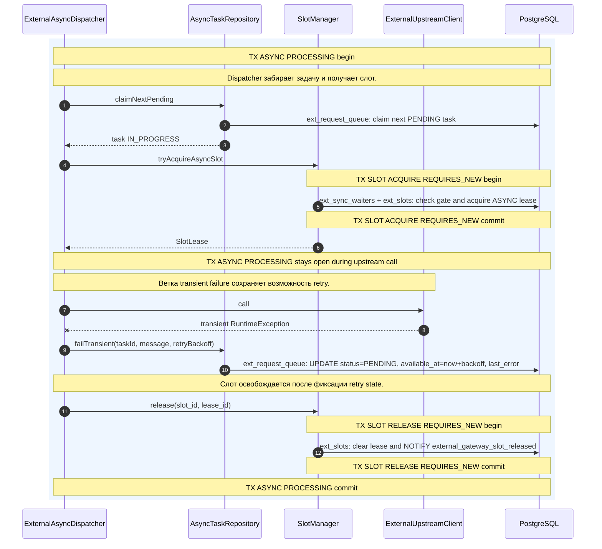

| Шаг | Лейбл на диаграмме | Что делает шаг |
| --- | --- | --- |
| 1 | `claimNextPending` | Dispatcher берет задачу из очереди. |
| 2 | `ext_request_queue: claim next PENDING task` | PostgreSQL переводит доступную задачу в `IN_PROGRESS`. |
| 3 | `task IN_PROGRESS` | Dispatcher получает задачу для выполнения. |
| 4 | `tryAcquireAsyncSlot` | Dispatcher занимает async-слот. |
| 5 | `ext_sync_waiters + ext_slots: check gate and acquire ASYNC lease` | База проверяет gate и выдает lease. |
| 6 | `SlotLease` | Lease возвращается dispatcher-у. |
| 7 | `call` | Gateway вызывает upstream. |
| 8 | `transient RuntimeException` | Upstream adapter возвращает временную runtime-ошибку. |
| 9 | `failTransient(taskId, message, retryBackoff)` | Dispatcher просит репозиторий рассчитать retry outcome. |
| 10 | `ext_request_queue: UPDATE status=PENDING, available_at=now+backoff, last_error` | Задача возвращается в очередь с задержкой и диагностикой последней ошибки. |
| 11 | `release(slot_id, lease_id)` | Dispatcher освобождает слот. |
| 12 | `ext_slots: clear lease and NOTIFY external_gateway_slot_released` | База очищает lease и будит waiters. |

Особенности:

- callback delivery не создается, потому что задача еще не в финальном статусе;
- retry произойдет после `available_at`;
- слот не остается занятым между попытками.

## S-ASYNC-08. Transient upstream failure, попытки исчерпаны

Диаграмма описывает финальную transient-ошибку: последняя попытка исчерпана, задача переводится в `DEAD`, после чего планируется callback, если он нужен по режиму доставки.

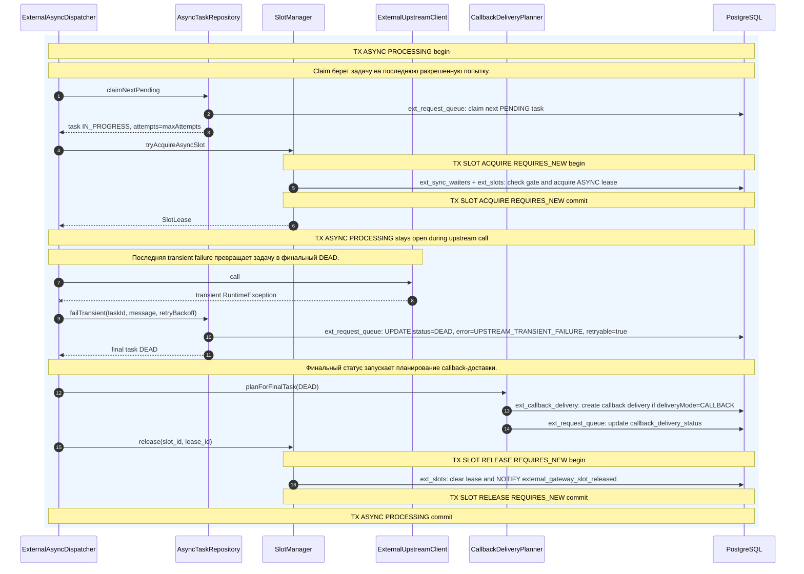

| Шаг | Лейбл на диаграмме | Что делает шаг |
| --- | --- | --- |
| 1 | `claimNextPending` | Dispatcher берет очередную задачу. |
| 2 | `ext_request_queue: claim next PENDING task` | Репозиторий переводит задачу в `IN_PROGRESS`. |
| 3 | `task IN_PROGRESS, attempts=maxAttempts` | Dispatcher получает задачу на последней разрешенной попытке. |
| 4 | `tryAcquireAsyncSlot` | Dispatcher занимает async-слот. |
| 5 | `ext_sync_waiters + ext_slots: check gate and acquire ASYNC lease` | База проверяет gate и выдает lease. |
| 6 | `SlotLease` | Lease возвращается dispatcher-у. |
| 7 | `call` | Gateway вызывает upstream. |
| 8 | `transient RuntimeException` | Upstream снова завершается временной ошибкой. |
| 9 | `failTransient(taskId, message, retryBackoff)` | Репозиторий рассчитывает, что попытки исчерпаны. |
| 10 | `ext_request_queue: UPDATE status=DEAD, error=UPSTREAM_TRANSIENT_FAILURE, retryable=true` | Задача становится финальной `DEAD`, но помечается как допускающая manual retry. |
| 11 | `final task DEAD` | Финальная задача возвращается dispatcher-у. |
| 12 | `planForFinalTask(DEAD)` | Planner обрабатывает финальный статус. |
| 13 | `ext_callback_delivery: create callback delivery if deliveryMode=CALLBACK` | Если задача в callback mode, создается доставка результата или ошибки клиенту. |
| 14 | `ext_request_queue: update callback_delivery_status` | В задаче синхронизируется агрегированный статус callback-доставки. |
| 15 | `release(slot_id, lease_id)` | Dispatcher освобождает слот. |
| 16 | `ext_slots: clear lease and NOTIFY external_gateway_slot_released` | База очищает lease и будит waiters. |

Особенности:

- `DEAD` задача может быть возвращена вручную через retry endpoint, если `retryable=true`;
- callback создается только для `deliveryMode=CALLBACK`;
- polling-клиенты видят финальный результат через status endpoint.

## S-ASYNC-09. Polling успешного результата

Диаграмма описывает чтение результата async-задачи: клиент запрашивает `taskId`, gateway читает строку и возвращает сохраненный `DONE` result.

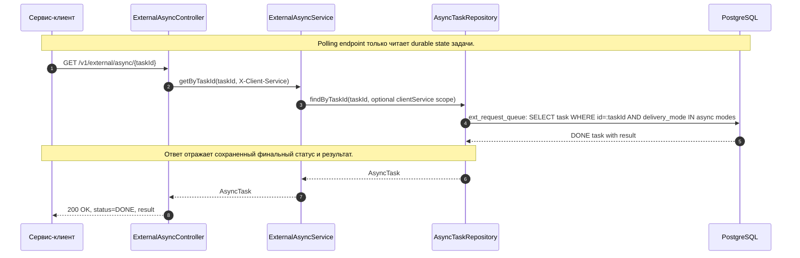

| Шаг | Лейбл на диаграмме | Что делает шаг |
| --- | --- | --- |
| 1 | `GET /v1/external/async/{taskId}` | Клиент запрашивает состояние async-задачи. |
| 2 | `getByTaskId(taskId, X-Client-Service)` | Controller передает id задачи и optional client scope. |
| 3 | `findByTaskId(taskId, optional clientService scope)` | Сервис вызывает репозиторий с фильтром по клиенту, если он задан. |
| 4 | `ext_request_queue: SELECT task WHERE id=:taskId AND delivery_mode IN async modes` | База читает только async-задачу, не sync trace. |
| 5 | `DONE task with result` | PostgreSQL возвращает финальную задачу с результатом upstream. |
| 6 | `AsyncTask` | Репозиторий возвращает доменную модель задачи. |
| 7 | `AsyncTask` | Сервис передает задачу controller-у. |
| 8 | `200 OK, status=DONE, result` | Клиент получает финальный статус и сохраненный результат. |

Особенности:

- если `X-Client-Service` передан, lookup ограничен этим сервисом;
- если `X-Client-Service` не передан, текущая реализация не ограничивает lookup по клиенту;
- это временное ограничение до внедрения service identity.

## S-ASYNC-10. Cancel pending-задачи

Диаграмма описывает успешную отмену задачи до начала upstream-вызова: `PENDING` переводится в `CANCELLED`.

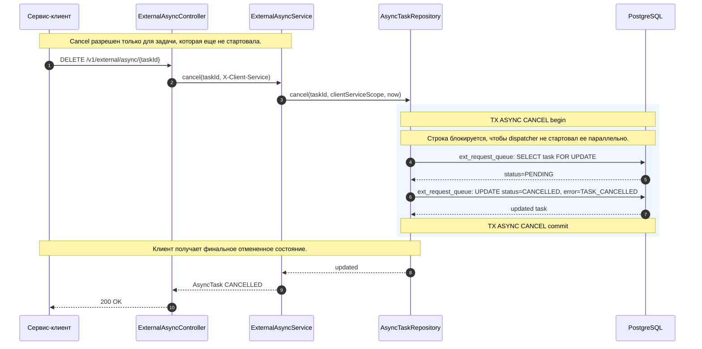

| Шаг | Лейбл на диаграмме | Что делает шаг |
| --- | --- | --- |
| 1 | `DELETE /v1/external/async/{taskId}` | Клиент просит отменить async-задачу. |
| 2 | `cancel(taskId, X-Client-Service)` | Controller передает id и optional client scope. |
| 3 | `cancel(taskId, clientServiceScope, now)` | Сервис вызывает репозиторий отмены. |
| 4 | `ext_request_queue: SELECT task FOR UPDATE` | База блокирует строку задачи для проверки статуса. |
| 5 | `status=PENDING` | Задача еще не взята dispatcher-ом и может быть отменена. |
| 6 | `ext_request_queue: UPDATE status=CANCELLED, error=TASK_CANCELLED` | Репозиторий переводит задачу в финальный отмененный статус. |
| 7 | `updated task` | База возвращает обновленную строку. |
| 8 | `updated` | Репозиторий возвращает успешный update result. |
| 9 | `AsyncTask CANCELLED` | Сервис возвращает доменную задачу в финальном статусе. |
| 10 | `200 OK` | Controller возвращает клиенту успешную отмену. |

Особенности:

- повторная отмена уже `CANCELLED` задачи идемпотентна;
- upstream не вызывается;
- callback-доставка для отмененной задачи не запускается в этом сценарии.

## S-ASYNC-11. Cancel conflict для выполняемой задачи

Диаграмма описывает отказ отмены, когда задача уже выполняется или завершена: gateway не пытается прервать upstream-вызов и возвращает `409`.

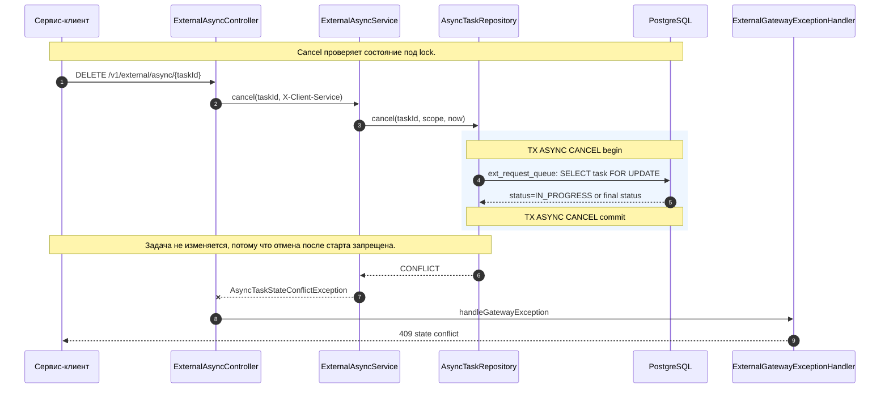

| Шаг | Лейбл на диаграмме | Что делает шаг |
| --- | --- | --- |
| 1 | `DELETE /v1/external/async/{taskId}` | Клиент отправляет команду cancel. |
| 2 | `cancel(taskId, X-Client-Service)` | Controller передает id задачи и client scope. |
| 3 | `cancel(taskId, scope, now)` | Сервис вызывает репозиторий. |
| 4 | `ext_request_queue: SELECT task FOR UPDATE` | База блокирует строку для проверки состояния. |
| 5 | `status=IN_PROGRESS or final status` | Задача уже выполняется или завершена, отмена недопустима. |
| 6 | `CONFLICT` | Репозиторий возвращает конфликт состояния. |
| 7 | `AsyncTaskStateConflictException` | Сервис преобразует conflict result в доменное исключение. |
| 8 | `handleGatewayException` | Exception handler строит HTTP-ответ. |
| 9 | `409 state conflict` | Клиент получает конфликт состояния задачи. |

Особенности:

- задача не отменяется после старта upstream-вызова;
- текущая реализация не делает distributed cancellation внешнего запроса;
- клиент должен использовать polling, чтобы увидеть финальное состояние.

## S-ASYNC-12. Manual retry для retryable DEAD/FAILED

Диаграмма описывает ручной повтор финальной retryable-задачи: gateway возвращает ту же задачу в `PENDING`, не создавая новый `externalId`.

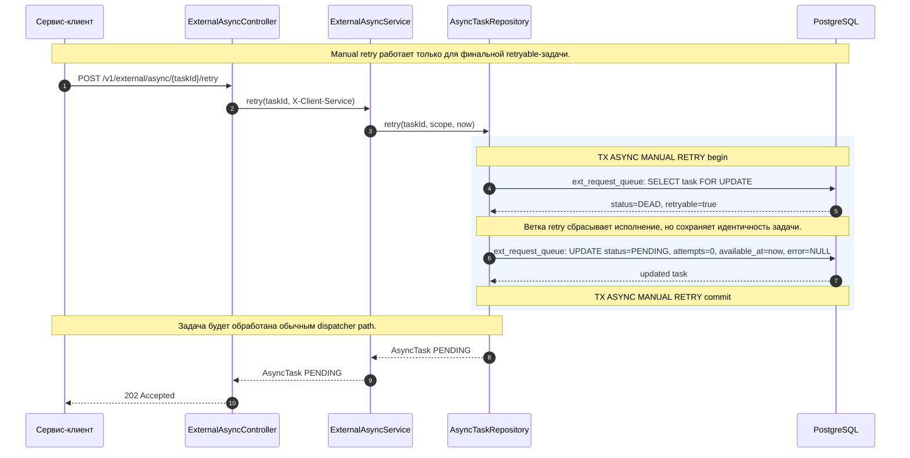

| Шаг | Лейбл на диаграмме | Что делает шаг |
| --- | --- | --- |
| 1 | `POST /v1/external/async/{taskId}/retry` | Клиент или оператор инициирует ручной retry финальной задачи. |
| 2 | `retry(taskId, X-Client-Service)` | Controller передает id задачи и client scope. |
| 3 | `retry(taskId, scope, now)` | Сервис вызывает репозиторий manual retry. |
| 4 | `ext_request_queue: SELECT task FOR UPDATE` | База блокирует строку задачи. |
| 5 | `status=DEAD, retryable=true` | Репозиторий подтверждает, что задача финальная и допускает повтор. |
| 6 | `ext_request_queue: UPDATE status=PENDING, attempts=0, available_at=now, error=NULL` | Задача возвращается в очередь, счетчик попыток и ошибка сбрасываются. |
| 7 | `updated task` | PostgreSQL возвращает обновленную строку. |
| 8 | `AsyncTask PENDING` | Репозиторий возвращает задачу в статусе `PENDING`. |
| 9 | `AsyncTask PENDING` | Сервис передает updated task controller-у. |
| 10 | `202 Accepted` | Клиент получает подтверждение, что задача снова принята в обработку. |

Особенности:

- manual retry не меняет `externalId` и не создает новую задачу;
- следующая обработка пойдет через обычный dispatcher path;
- новый callback будет планироваться только после нового финального статуса.
