# Sequence View. Async Scenarios

Async contract разделяет прием запроса, выполнение upstream и получение результата. Это позволяет быстро вернуть `202 Accepted`, сохранить задачу в durable storage и доставить результат callback-ом или через polling.

В стрелках к `PostgreSQL` имя таблицы указано перед двоеточием, например `ext_request_queue: claim next PENDING task`.
Границы транзакций показаны подсвеченными `rect`-блоками и заметками `TX ... begin/commit`.

## S-ASYNC-01. Submit новой async-задачи

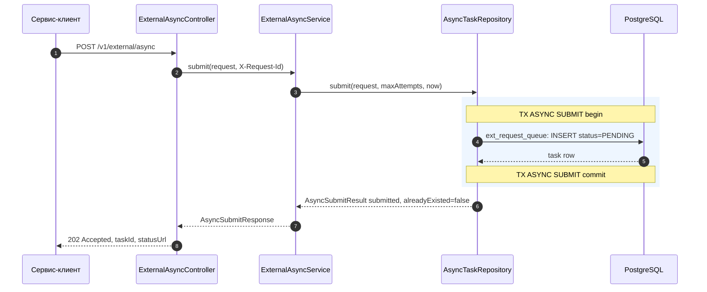

Async-задача еще не выполнялась. Ее обработает dispatcher на следующем scheduled tick или раньше, если воркер уже крутит цикл до idle.

## S-ASYNC-02. Idempotent submit той же задачи

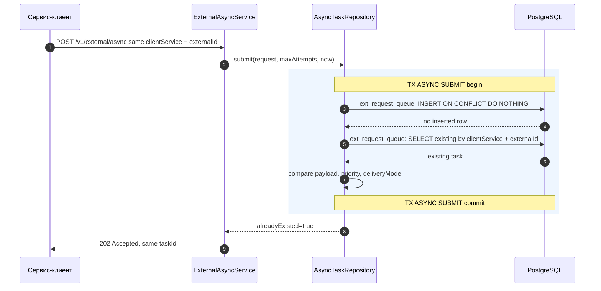

Идемпотентность async не использует `Idempotency-Key`. Ключом является пара `clientService + externalId`.

## S-ASYNC-03. Idempotency conflict

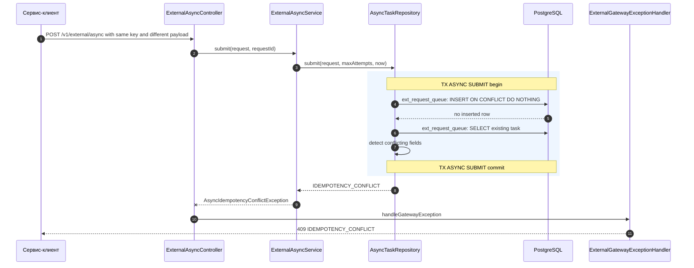

Конфликт возможен при различии `payload`, `priority` или `deliveryMode`.

## S-ASYNC-04. Dispatch success с callback mode

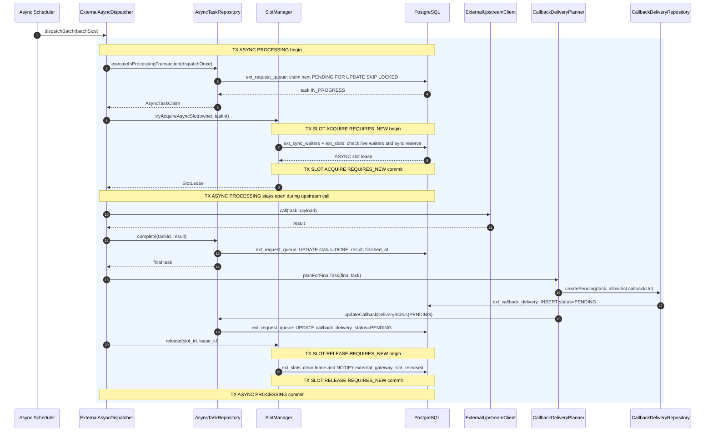

На этом сценарий upstream-задачи завершен. Доставка callback выполняется отдельным dispatcher-ом и описана в [07-sequence-callback.md](07-sequence-callback.md).

## S-ASYNC-05. Dispatch success с polling mode

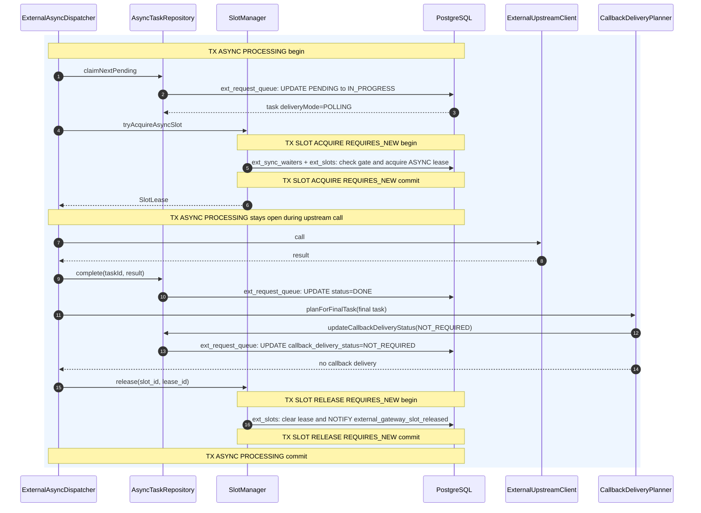

Клиент получает результат через polling endpoint.

## S-ASYNC-06. Async slot недоступен после claim

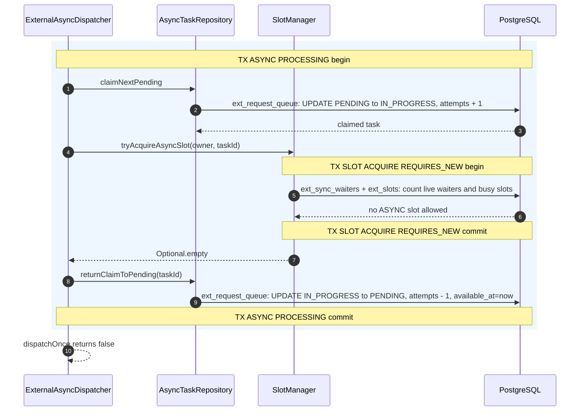

Это не считается upstream-попыткой. Задача возвращается в очередь без backoff, а `attempts` компенсируется.

## S-ASYNC-07. Transient upstream failure, попытки остались

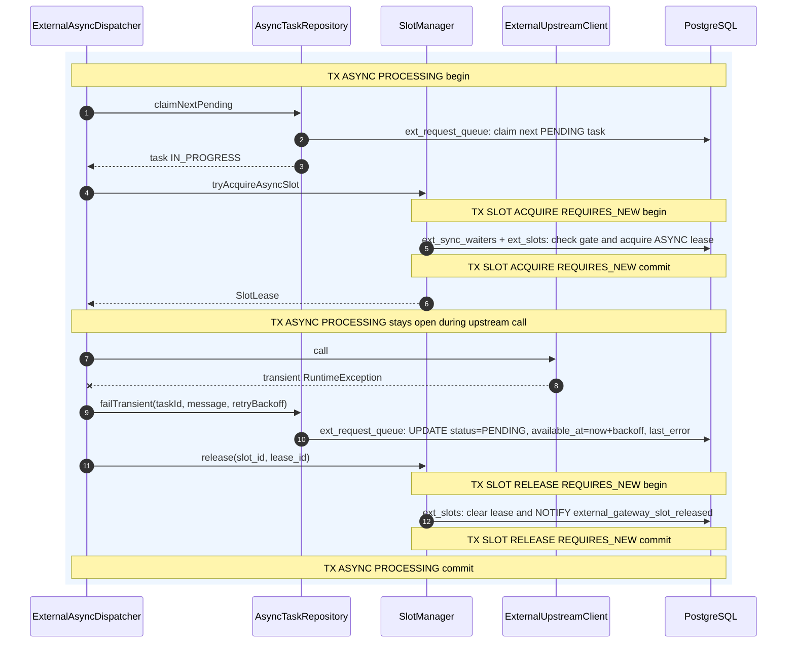

Callback delivery не создается, потому что задача еще не в финальном статусе.

## S-ASYNC-08. Transient upstream failure, попытки исчерпаны

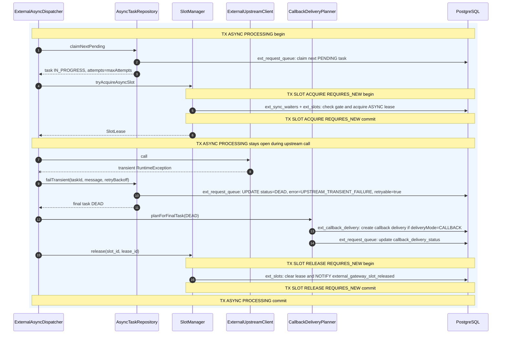

`DEAD` задача может быть возвращена вручную через retry endpoint, если `retryable=true`.

## S-ASYNC-09. Polling успешного результата

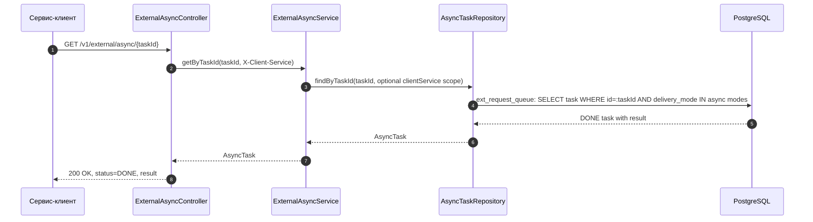

Если `X-Client-Service` передан, lookup ограничен этим сервисом. Если не передан, текущая реализация не ограничивает lookup по клиенту. Это временное ограничение до внедрения service identity.

## S-ASYNC-10. Cancel pending-задачи

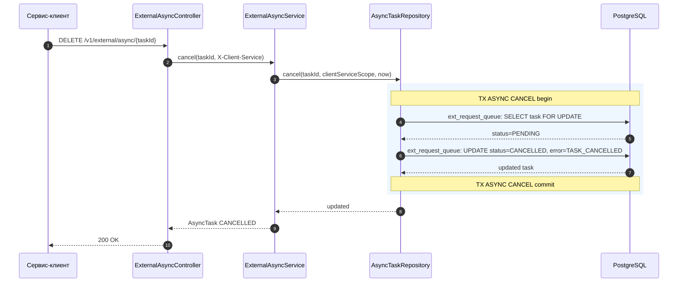

Повторная отмена уже `CANCELLED` задачи идемпотентна.

## S-ASYNC-11. Cancel conflict для выполняемой задачи

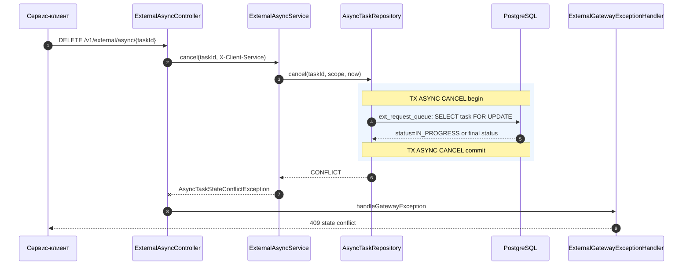

Задача не отменяется после старта upstream-вызова.

## S-ASYNC-12. Manual retry для retryable DEAD/FAILED

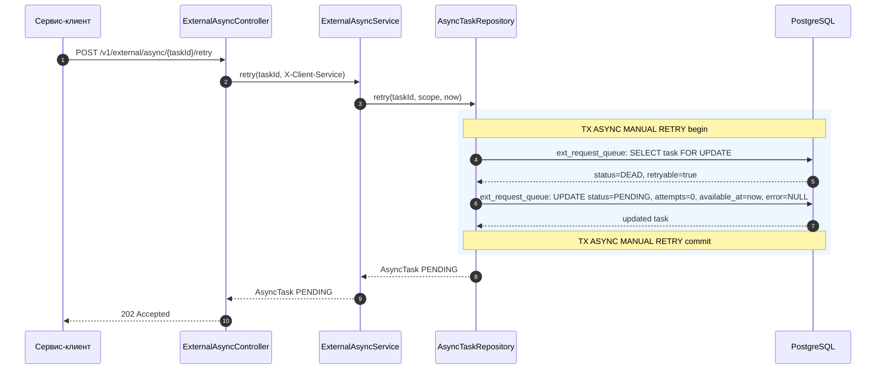

Manual retry не меняет `externalId` и не создает новую задачу. Следующая обработка пойдет через обычный dispatcher path.
