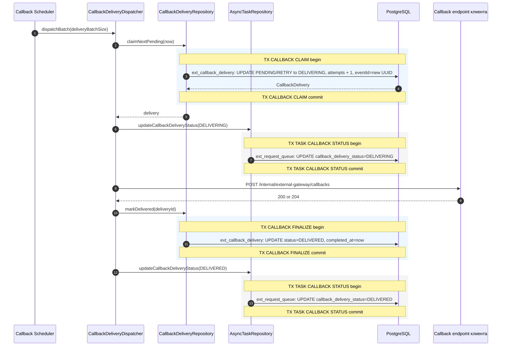
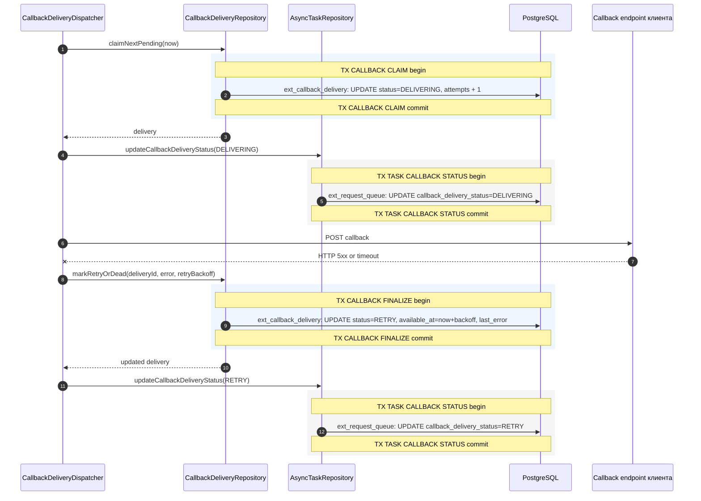
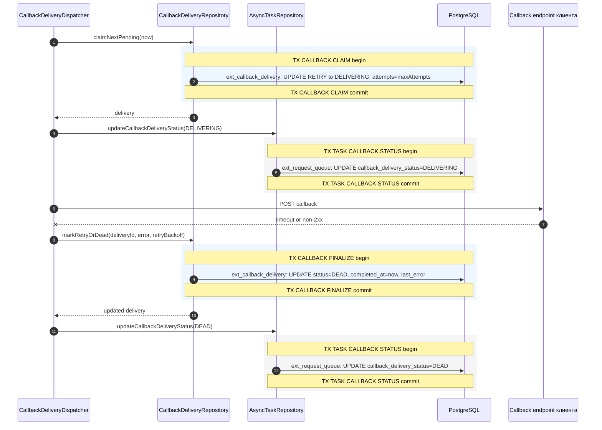
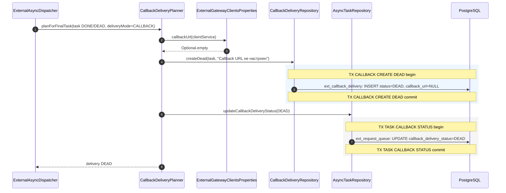
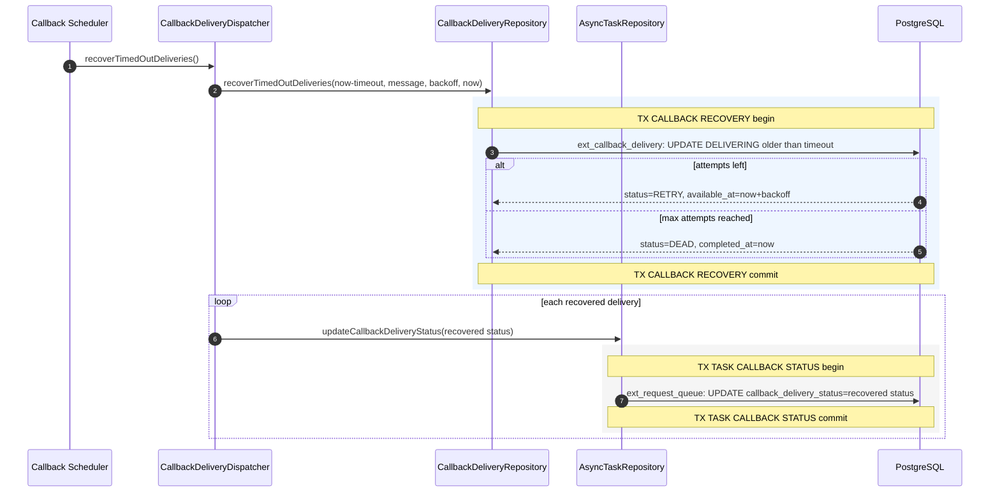
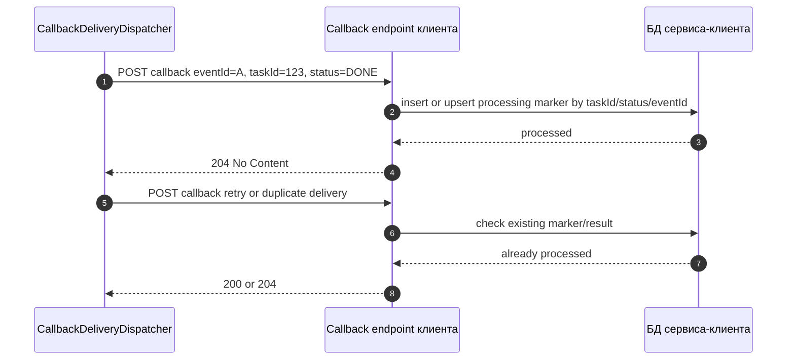

# Sequence View. Callback Scenarios

Callback-доставка отделена от upstream-обработки. Это позволяет завершить async-задачу в `DONE`, `DEAD`, `FAILED` или `CANCELLED`, а затем независимо добиваться доставки результата клиенту.

В стрелках к `PostgreSQL` имя таблицы указано перед двоеточием, например `ext_callback_delivery: UPDATE status=DELIVERED`.
Границы транзакций показаны подсвеченными `rect`-блоками и заметками `TX ... begin/commit`.

## S-CALLBACK-01. Успешная callback-доставка

Callback endpoint клиента должен быть идемпотентным по `taskId`, `status` и `eventId`.

## S-CALLBACK-02. Callback endpoint вернул 5xx или timeout, попытки остались

Ошибки callback-доставки не переводят async-задачу из `DONE` или `DEAD` в другой upstream-статус.

## S-CALLBACK-03. Callback attempts исчерпаны

После `DEAD` результат остается доступен через polling API. Для production нужен operational process: алерт, ручное расследование и возможность безопасного повторного уведомления, если такая операция будет добавлена.

## S-CALLBACK-04. Callback URL отсутствует в allow-list

Gateway не использует произвольный `callbackUrl` из request body. Это защищает от SSRF, но требует заранее настроить `external-gateway.clients.<clientService>.callback-url`.

## S-CALLBACK-05. Recovery зависшей DELIVERING-доставки

Recovery нужен на случай падения JVM или зависания HTTP client после claim доставки.

## S-CALLBACK-06. Клиент получил duplicate callback

Это требование к сервисам-клиентам. Gateway выполняет at-least-once callback delivery, а не exactly-once доставку.
