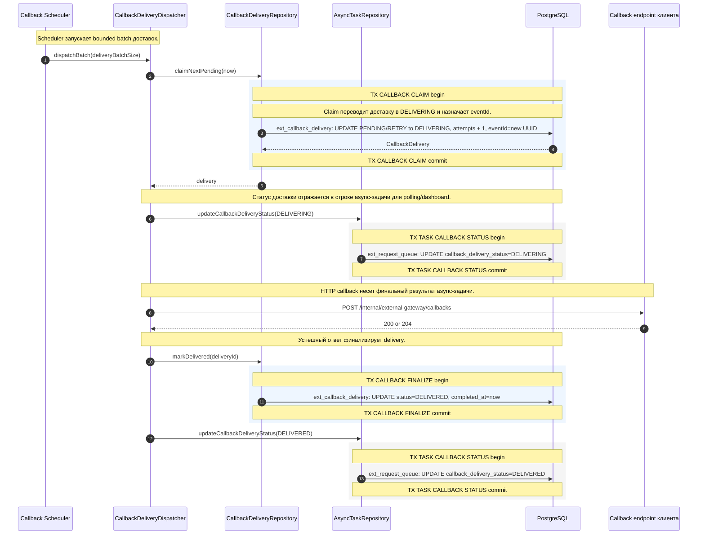
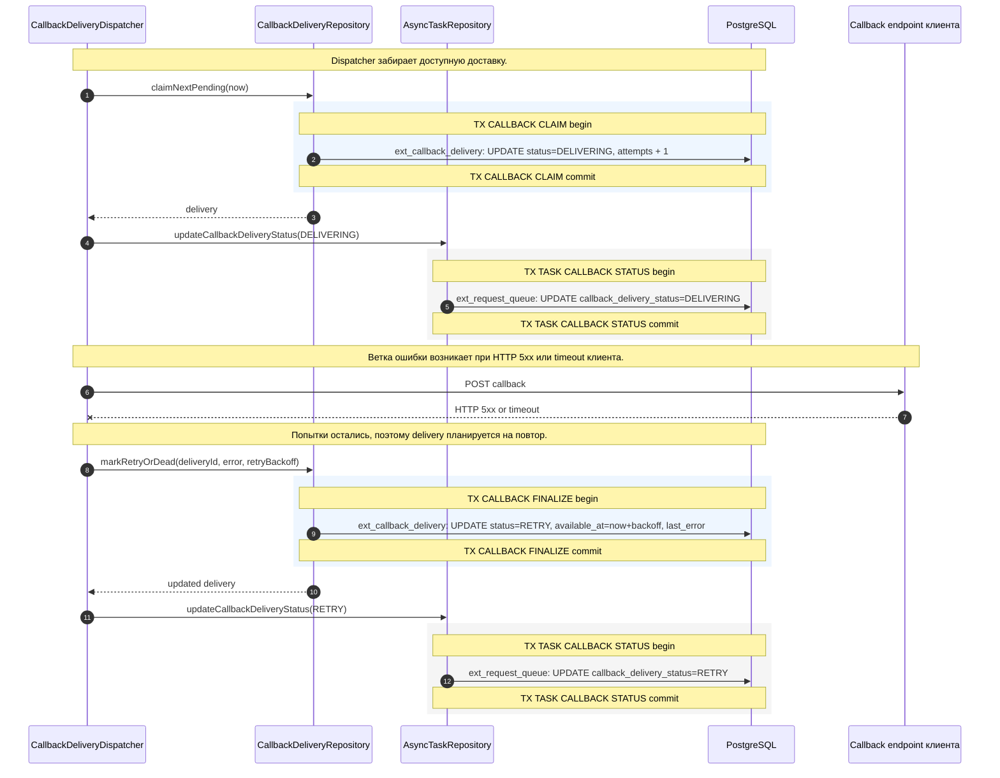
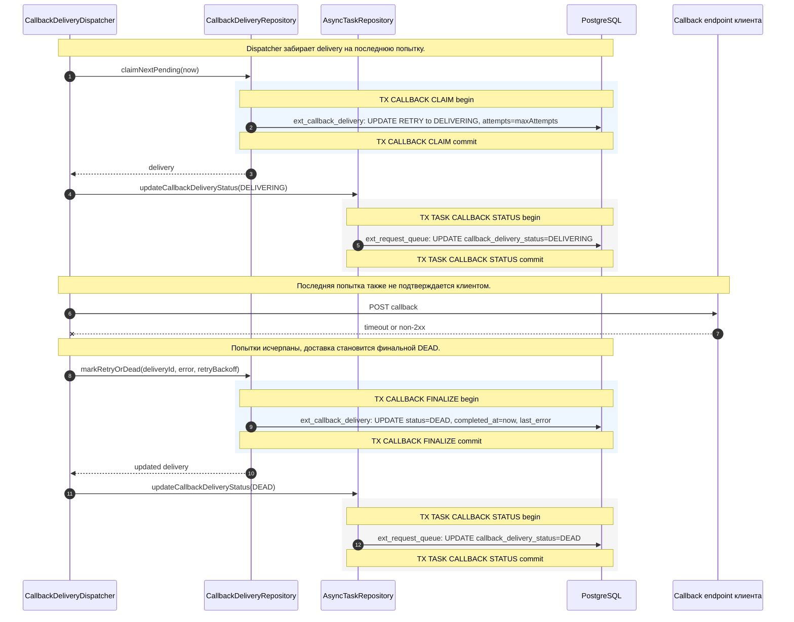
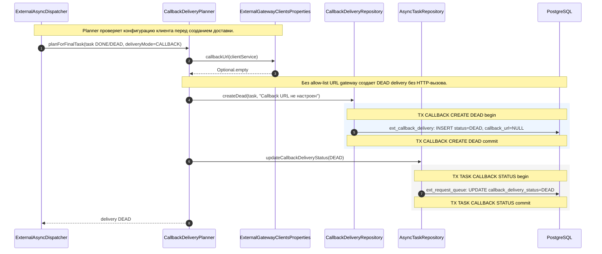
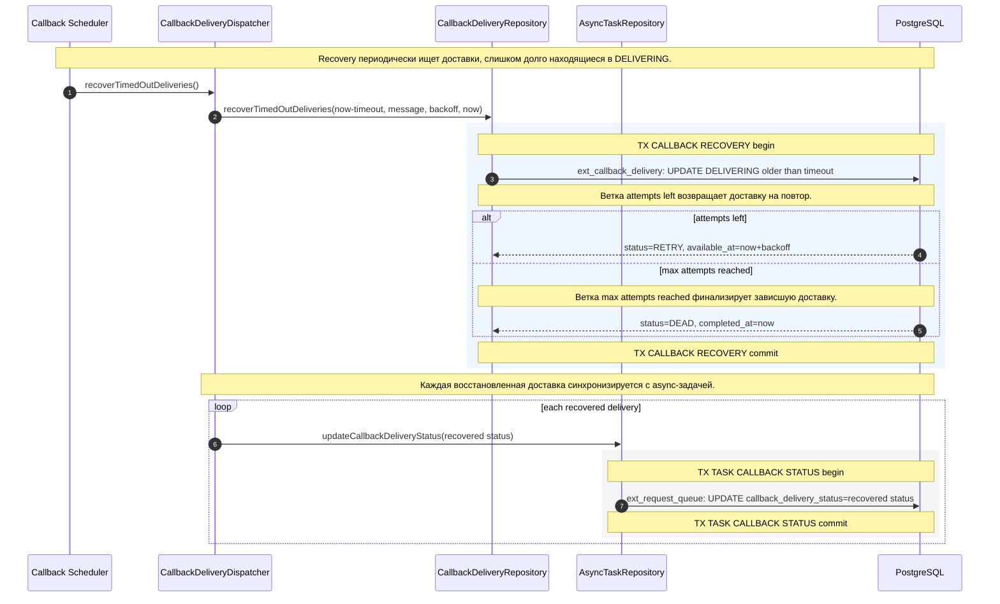
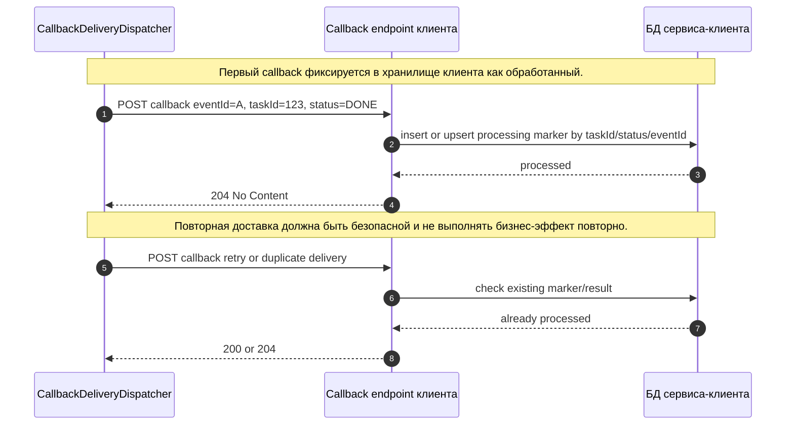

# Sequence View. Callback Scenarios

Callback-доставка отделена от upstream-обработки. Это позволяет завершить async-задачу в `DONE`, `DEAD`, `FAILED` или `CANCELLED`, а затем независимо добиваться доставки результата клиенту.

В стрелках к `PostgreSQL` имя таблицы указано перед двоеточием, например `ext_callback_delivery: UPDATE status=DELIVERED`.
Границы транзакций показаны подсвеченными `rect`-блоками и заметками `TX ... begin/commit`.

## S-CALLBACK-01. Успешная callback-доставка

Диаграмма описывает happy path callback-доставки: dispatcher забирает pending delivery, отправляет HTTP callback, фиксирует `DELIVERED` и синхронизирует статус в async-задаче.

| Шаг | Лейбл на диаграмме | Что делает шаг |
| --- | --- | --- |
| 1 | `dispatchBatch(deliveryBatchSize)` | Scheduler запускает ограниченное число попыток callback-доставки. |
| 2 | `claimNextPending(now)` | Dispatcher просит репозиторий забрать ближайшую доступную доставку. |
| 3 | `ext_callback_delivery: UPDATE PENDING/RETRY to DELIVERING, attempts + 1, eventId=new UUID` | База атомарно переводит доставку в `DELIVERING`, увеличивает попытку и назначает новый event id. |
| 4 | `CallbackDelivery` | PostgreSQL возвращает доставку с payload, URL, attempt и eventId. |
| 5 | `delivery` | Репозиторий передает delivery dispatcher-у. |
| 6 | `updateCallbackDeliveryStatus(DELIVERING)` | Dispatcher синхронизирует агрегированный статус в async-задаче. |
| 7 | `ext_request_queue: UPDATE callback_delivery_status=DELIVERING` | Строка задачи показывает, что callback сейчас отправляется. |
| 8 | `POST /internal/external-gateway/callbacks` | Gateway отправляет callback на allow-listed endpoint клиента. |
| 9 | `200 or 204` | Клиент подтверждает успешную обработку callback. |
| 10 | `markDelivered(deliveryId)` | Dispatcher финализирует доставку как успешную. |
| 11 | `ext_callback_delivery: UPDATE status=DELIVERED, completed_at=now` | База сохраняет финальный статус доставки и время завершения. |
| 12 | `updateCallbackDeliveryStatus(DELIVERED)` | Dispatcher обновляет агрегированный статус в задаче. |
| 13 | `ext_request_queue: UPDATE callback_delivery_status=DELIVERED` | Async-задача отражает успешную доставку результата клиенту. |

Особенности:

- callback endpoint клиента должен быть идемпотентным по `taskId`, `status` и `eventId`;
- gateway выполняет at-least-once доставку;
- успешным считается HTTP 2xx-ответ клиента.

## S-CALLBACK-02. Callback endpoint вернул 5xx или timeout, попытки остались

Диаграмма описывает retryable ошибку доставки: endpoint клиента не подтвердил callback, delivery возвращается в `RETRY` с backoff, а upstream-статус async-задачи не меняется.

| Шаг | Лейбл на диаграмме | Что делает шаг |
| --- | --- | --- |
| 1 | `claimNextPending(now)` | Dispatcher забирает доставку, доступную для отправки. |
| 2 | `ext_callback_delivery: UPDATE status=DELIVERING, attempts + 1` | Репозиторий переводит доставку в `DELIVERING` и увеличивает счетчик попыток. |
| 3 | `delivery` | Delivery возвращается dispatcher-у. |
| 4 | `updateCallbackDeliveryStatus(DELIVERING)` | Dispatcher обновляет агрегированный статус задачи. |
| 5 | `ext_request_queue: UPDATE callback_delivery_status=DELIVERING` | Строка async-задачи отражает активную доставку. |
| 6 | `POST callback` | Gateway отправляет callback клиенту. |
| 7 | `HTTP 5xx or timeout` | Клиентский endpoint возвращает ошибку или не отвечает вовремя. |
| 8 | `markRetryOrDead(deliveryId, error, retryBackoff)` | Dispatcher просит репозиторий выбрать `RETRY` или `DEAD` по лимиту попыток. |
| 9 | `ext_callback_delivery: UPDATE status=RETRY, available_at=now+backoff, last_error` | Так как попытки остались, доставка планируется на повтор с backoff. |
| 10 | `updated delivery` | Репозиторий возвращает обновленную delivery. |
| 11 | `updateCallbackDeliveryStatus(RETRY)` | Dispatcher синхронизирует статус retry в async-задаче. |
| 12 | `ext_request_queue: UPDATE callback_delivery_status=RETRY` | Задача показывает, что результат будет доставляться повторно. |

Особенности:

- ошибки callback-доставки не переводят async-задачу из `DONE` или `DEAD` в другой upstream-статус;
- retry касается только записи `ext_callback_delivery`;
- следующая попытка станет доступна после `available_at`.

## S-CALLBACK-03. Callback attempts исчерпаны

Диаграмма описывает финальный отказ callback-доставки: очередная ошибка происходит на последней попытке, delivery переходит в `DEAD`.

| Шаг | Лейбл на диаграмме | Что делает шаг |
| --- | --- | --- |
| 1 | `claimNextPending(now)` | Dispatcher забирает доставку, доступную для последней попытки. |
| 2 | `ext_callback_delivery: UPDATE RETRY to DELIVERING, attempts=maxAttempts` | База переводит delivery в `DELIVERING` с достигнутым лимитом попыток. |
| 3 | `delivery` | Delivery возвращается dispatcher-у. |
| 4 | `updateCallbackDeliveryStatus(DELIVERING)` | Dispatcher отмечает задачу как находящуюся в доставке. |
| 5 | `ext_request_queue: UPDATE callback_delivery_status=DELIVERING` | Статус доставки отражается в строке задачи. |
| 6 | `POST callback` | Gateway отправляет последнюю попытку callback. |
| 7 | `timeout or non-2xx` | Клиент не подтверждает доставку. |
| 8 | `markRetryOrDead(deliveryId, error, retryBackoff)` | Dispatcher финализирует ошибку доставки. |
| 9 | `ext_callback_delivery: UPDATE status=DEAD, completed_at=now, last_error` | Доставка переводится в финальный `DEAD` с причиной ошибки. |
| 10 | `updated delivery` | Репозиторий возвращает обновленную delivery. |
| 11 | `updateCallbackDeliveryStatus(DEAD)` | Dispatcher синхронизирует финальный статус доставки в задаче. |
| 12 | `ext_request_queue: UPDATE callback_delivery_status=DEAD` | Async-задача показывает, что callback-доставка окончательно не выполнена. |

Особенности:

- после `DEAD` результат остается доступен через polling API;
- для production нужен operational process: алерт, ручное расследование и возможность безопасного повторного уведомления, если такая операция будет добавлена;
- `DEAD` callback не меняет upstream-статус задачи.

## S-CALLBACK-04. Callback URL отсутствует в allow-list

Диаграмма описывает отказ на этапе планирования: финальная async-задача требует callback, но для `clientService` не настроен allow-listed URL.

| Шаг | Лейбл на диаграмме | Что делает шаг |
| --- | --- | --- |
| 1 | `planForFinalTask(task DONE/DEAD, deliveryMode=CALLBACK)` | Dispatcher просит planner создать доставку для финальной callback-задачи. |
| 2 | `callbackUrl(clientService)` | Planner ищет allow-listed callback URL для сервиса-клиента. |
| 3 | `Optional.empty` | Конфигурация не содержит URL для этого `clientService`. |
| 4 | `createDead(task, "Callback URL не настроен")` | Planner создает delivery в финальном отказе без HTTP-попытки. |
| 5 | `ext_callback_delivery: INSERT status=DEAD, callback_url=NULL` | База сохраняет dead-доставку с диагностикой отсутствующей настройки. |
| 6 | `updateCallbackDeliveryStatus(DEAD)` | Planner синхронизирует статус доставки в async-задаче. |
| 7 | `ext_request_queue: UPDATE callback_delivery_status=DEAD` | Задача показывает, что callback доставить невозможно. |
| 8 | `delivery DEAD` | Planner возвращает dispatcher-у созданную `DEAD` delivery. |

Особенности:

- gateway не использует произвольный `callbackUrl` из request body;
- это защищает от SSRF;
- для callback mode нужно заранее настроить `external-gateway.clients.<clientService>.callback-url`.

## S-CALLBACK-05. Recovery зависшей DELIVERING-доставки

Диаграмма описывает recovery после сбоя процесса или зависания HTTP client: старые `DELIVERING` доставки возвращаются в `RETRY` или финализируются как `DEAD`.

| Шаг | Лейбл на диаграмме | Что делает шаг |
| --- | --- | --- |
| 1 | `recoverTimedOutDeliveries()` | Scheduler запускает recovery зависших доставок. |
| 2 | `recoverTimedOutDeliveries(now-timeout, message, backoff, now)` | Dispatcher передает репозиторию границу timeout, диагностическое сообщение и backoff. |
| 3 | `ext_callback_delivery: UPDATE DELIVERING older than timeout` | База выбирает старые `DELIVERING` доставки и пересчитывает их статус. |
| 4 | `status=RETRY, available_at=now+backoff` | Если попытки остались, delivery возвращается на повтор с задержкой. |
| 5 | `status=DEAD, completed_at=now` | Если лимит исчерпан, delivery становится финальной `DEAD`. |
| 6 | `updateCallbackDeliveryStatus(recovered status)` | Dispatcher обновляет агрегированный статус задачи для каждой восстановленной доставки. |
| 7 | `ext_request_queue: UPDATE callback_delivery_status=recovered status` | Строка async-задачи получает восстановленный статус `RETRY` или `DEAD`. |

Особенности:

- recovery нужен на случай падения JVM или зависания HTTP client после claim доставки;
- операция не отправляет HTTP callback сама по себе, а только возвращает delivery в корректное состояние;
- восстановленные `RETRY` доставки будут отправлены обычным dispatcher path.

## S-CALLBACK-06. Клиент получил duplicate callback

Диаграмма описывает требуемое поведение сервиса-клиента при повторной доставке: клиент должен идемпотентно распознать уже обработанный callback и снова вернуть успешный 2xx.

| Шаг | Лейбл на диаграмме | Что делает шаг |
| --- | --- | --- |
| 1 | `POST callback eventId=A, taskId=123, status=DONE` | Gateway отправляет клиенту callback с event id, task id и финальным статусом. |
| 2 | `insert or upsert processing marker by taskId/status/eventId` | Клиент создает идемпотентный маркер обработки в своей БД. |
| 3 | `processed` | Клиентская БД подтверждает, что callback обработан. |
| 4 | `204 No Content` | Клиент возвращает успешный ответ gateway. |
| 5 | `POST callback retry or duplicate delivery` | Gateway может повторно отправить тот же или эквивалентный callback из-за at-least-once семантики. |
| 6 | `check existing marker/result` | Клиент проверяет, что бизнес-эффект уже применен. |
| 7 | `already processed` | Клиентская БД подтверждает наличие маркера или результата. |
| 8 | `200 or 204` | Клиент повторно возвращает 2xx без повторного выполнения бизнес-операции. |

Особенности:

- это требование к сервисам-клиентам;
- gateway выполняет at-least-once callback delivery, а не exactly-once доставку;
- клиентская идемпотентность должна защищать бизнес-эффекты от дублей.
