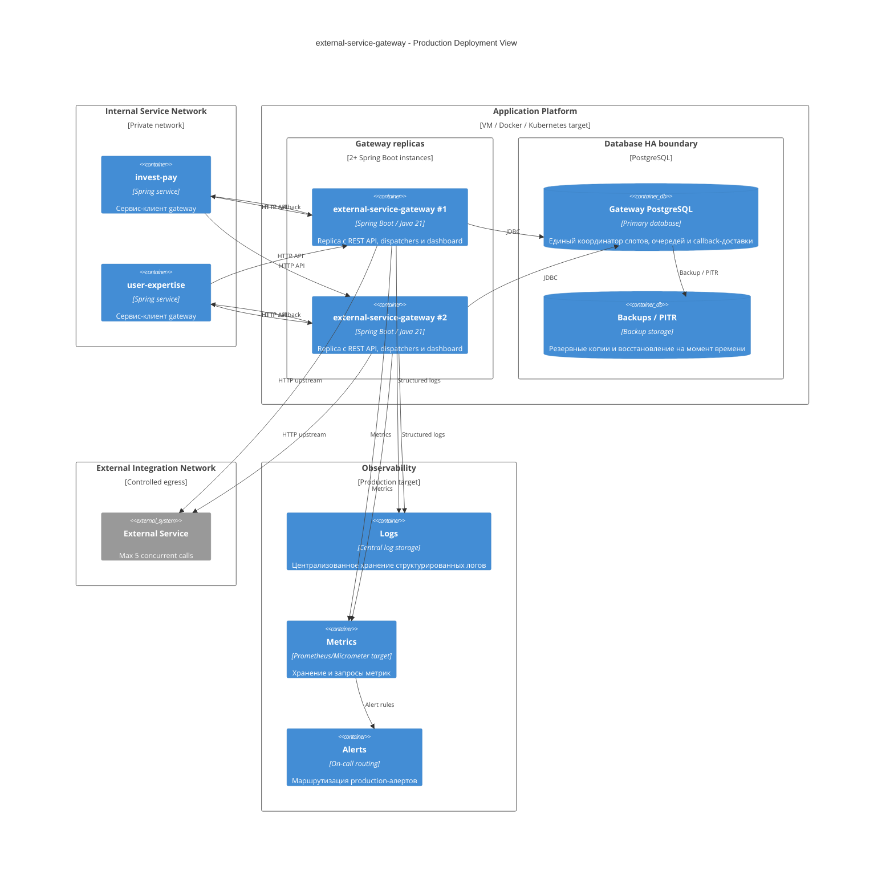

# Deployment And Operations View

Production-развертывание должно сохранять глобальный лимит внешнего сервиса при горизонтальном масштабировании gateway. Ключевое требование: все экземпляры gateway работают с одним логическим PostgreSQL-координатором.

## C4 Deployment



## Production profile

Минимальные production-настройки должны включать:

```properties
external-gateway.repository.type=postgres
external-gateway.postgres.jdbc-url=jdbc:postgresql://...
external-gateway.postgres.username=...
external-gateway.postgres.password=...
external-gateway.postgres.schema=external_gateway
external-gateway.postgres.liquibase-enabled=true
external-gateway.slots.total=5
external-gateway.slots.target-free-sync-slots=1
external-gateway.slots.sync-acquire-wait-mode=listen_notify
external-gateway.async.dispatcher-enabled=true
external-gateway.callback.delivery-enabled=true
```

Секреты должны поступать из secret storage, а не из Git.

## Health и readiness

Readiness endpoint для production target должен проверять:

- доступность PostgreSQL;
- примененность Liquibase migrations;
- возможность выполнить легкий read из gateway schema;
- корректность `external-gateway.slots.total` относительно строк `ext_slots`;
- наличие callback URL для всех `clientService`, которым разрешен `deliveryMode=CALLBACK`;
- возможность резолва upstream endpoint;
- если включен dashboard, ограничение доступа к нему.

Liveness должен быть дешевым и не зависеть от upstream.

## Observability

Минимальный набор метрик:

| Метрика | Тип | Назначение |
| --- | --- | --- |
| `gateway_slots_busy{kind}` | gauge | Занятые sync/async слоты. |
| `gateway_sync_waiters_live` | gauge | Живые sync waiters. |
| `gateway_sync_requests_total{status,code}` | counter | Sync volume и ошибки. |
| `gateway_sync_duration_seconds` | histogram | Latency sync API. |
| `gateway_async_tasks_total{status}` | gauge/counter | Очередь и финальные статусы. |
| `gateway_async_dispatch_total{result}` | counter | Успехи, retry, no slot, dead. |
| `gateway_async_task_age_seconds` | gauge | Возраст старейшей активной async-задачи. |
| `gateway_callback_delivery_total{status}` | counter | Callback delivery outcomes. |
| `gateway_callback_backlog` | gauge | PENDING + RETRY + DELIVERING callback. |
| `gateway_callback_age_seconds` | gauge | Возраст старейшей недоставленной callback-записи. |
| `gateway_upstream_duration_seconds` | histogram | Время upstream-вызова. |
| `gateway_upstream_errors_total{code}` | counter | Ошибки внешнего сервиса. |

Логи должны включать:

- `requestId`;
- `externalId`;
- `clientService`;
- `taskId` для async;
- `deliveryId` для callback;
- `slotId` и `leaseId` для диагностики lease;
- normalized error code.

## Alert rules

Production alerts:

- `gateway_slots_busy{kind="SYNC"} + gateway_slots_busy{kind="ASYNC"} > 5` - критичный инвариант нарушен.
- `gateway_sync_waiters_live > 0` дольше допустимого окна - sync starvation или upstream saturation.
- Старейшая `PENDING` async-задача старше SLA.
- Callback backlog растет или старейшая callback delivery старше SLA.
- Есть `DEAD` callback delivery.
- Есть рост `NO_SLOT_AVAILABLE` выше нормального baseline.
- Upstream timeout/error rate выше порога.
- Liquibase migration failed на старте.

## Rollout

Рекомендуемый порядок:

1. Применить migrations к PostgreSQL.
2. Запустить один gateway instance в `postgres` mode с выключенной внешней нагрузкой.
3. Проверить health snapshot и наличие 5 свободных слотов.
4. Включить canary traffic для одного клиента.
5. Проверить sync success, async submit, polling, callback.
6. Включить второй instance и проверить, что общий busy slots не превышает 5.
7. Включить полный traffic.
8. Следить за `NO_SLOT_AVAILABLE`, async backlog и callback backlog.

## Failure handling

| Отказ | Ожидаемое поведение | Recovery |
| --- | --- | --- |
| JVM падает во время sync upstream | Lease освобождается по TTL/reaper, клиент получает timeout/connection error. | Клиент retry, support проверяет sync trace и logs. |
| JVM падает во время async upstream | Row-lock откатывается, committed ASYNC lease истекает по TTL. | Dispatcher подберет задачу повторно после восстановления и освобождения lease. |
| JVM падает во время callback delivery | Delivery остается `DELIVERING`. | Callback scheduler recovery переведет в `RETRY` или `DEAD`. |
| PostgreSQL недоступен | Gateway не может корректно соблюдать global limit и durable queue. | Readiness false, traffic должен быть снят. |
| External Service медленный | Sync получает 504 или 429 из-за занятых слотов, async уходит в retry/backoff. | Alert, circuit breaker в production HTTP client, координация с владельцем upstream. |
| Callback endpoint клиента недоступен | Async task остается финальной, callback delivery уходит в `RETRY`/`DEAD`. | Клиент чинит endpoint, support использует polling и будущую manual redelivery. |

## Security

Production target должен включать:

- service-to-service authentication;
- проверку, что caller identity соответствует `clientService`;
- mTLS или service mesh для внутренних вызовов;
- controlled egress к внешнему сервису;
- allow-list callback URL без поддержки произвольного URL из payload;
- ограничение доступа к dashboard;
- аудит ручных операций retry/cancel;
- секреты только через secret storage;
- запрет прямого доступа клиентских сервисов к gateway schema.

## Capacity

Исходная нагрузка в проектных документах малая: около 1500 запросов в день и пики 10-20 в минуту. При таких объемах PostgreSQL queue является достаточной v1-моделью. При росте нужно пересмотреть:

- количество слотов только после согласования с внешним сервисом;
- размер connection pool;
- dispatcher batch size;
- retry backoff;
- retention policy;
- замену queue layer на специализированный broker или workflow engine без изменения публичного HTTP contract.
