# C4 Architecture View

Документ фиксирует C4-представление текущего `external-service-gateway` в PostgreSQL-варианте: контекст, контейнеры, ключевые компоненты и динамические сценарии. Sequence-диаграммы показывают главных участников процесса; внутренние Java-классы намеренно не раскрываются.

## Level 1. System Context

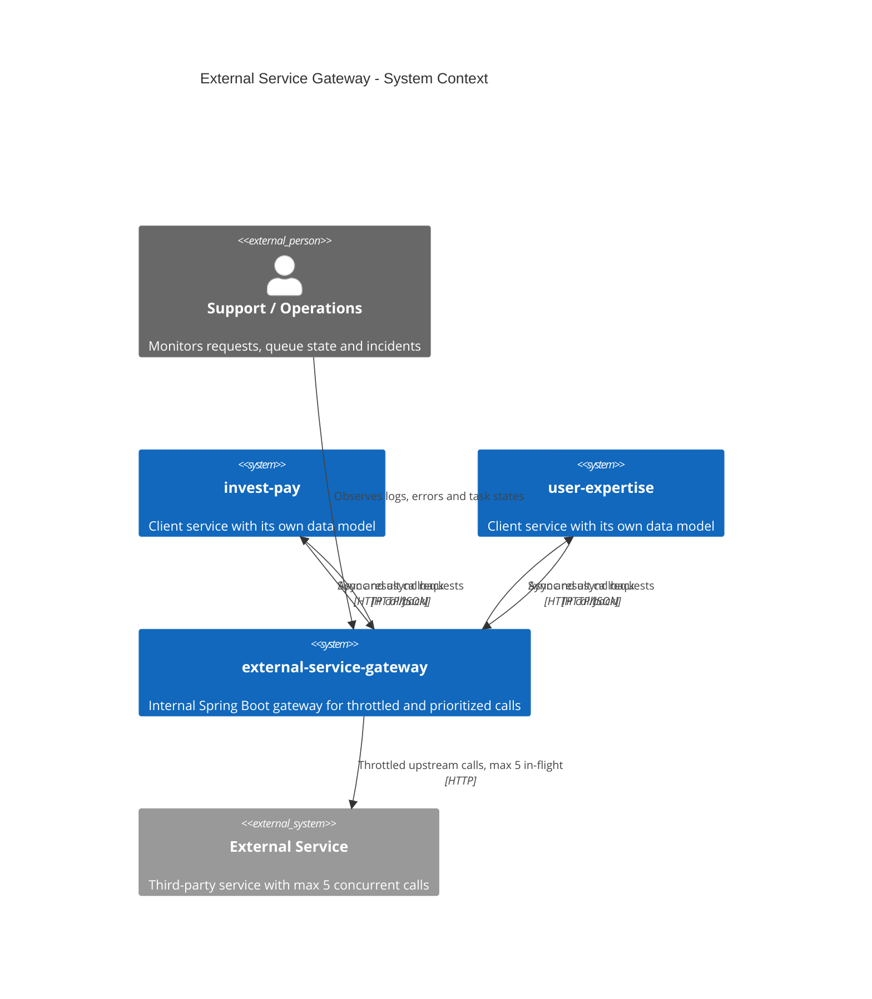

`invest-pay` и `user-expertise` не обращаются к таблицам gateway напрямую. Интеграция идет только через HTTP API gateway и callback-контракт.

## Level 2. Container View

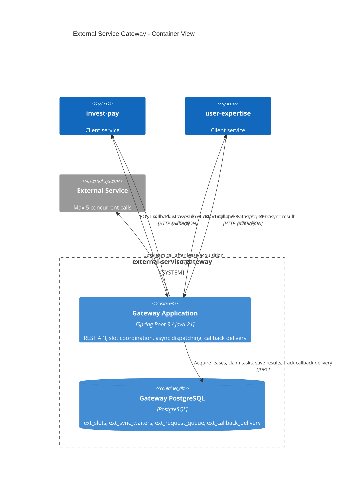

Глобальный лимит обеспечивается общей PostgreSQL-схемой, а не локальным состоянием инстанса приложения.

## Level 3. Gateway Component View

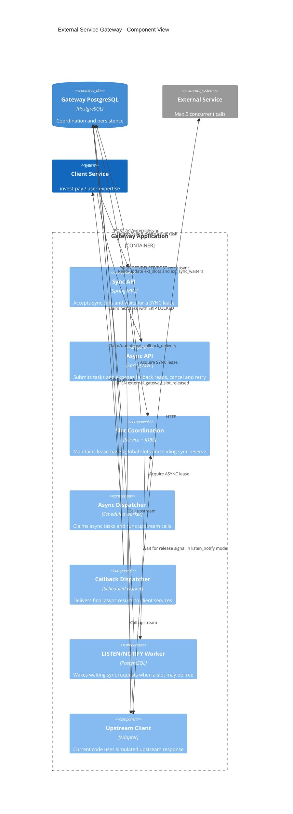

Основной инвариант:

```text
totalSlots = 5
targetFreeSyncSlots = 1
asyncAllowed = max(0, totalSlots - syncBusy - targetFreeSyncSlots)
async стартует только если asyncBusy < asyncAllowed и нет живых sync waiters
```

## Dynamic View. Sync Success

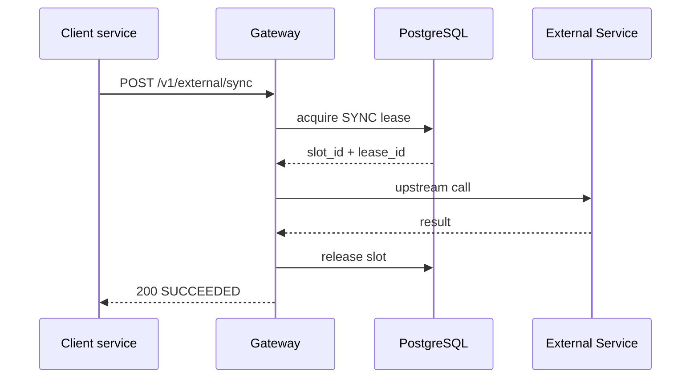

## Dynamic View. Sync No Slot

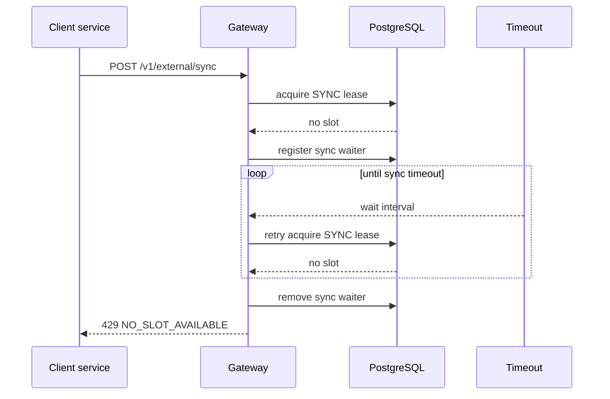

## Dynamic View. Sync LISTEN/NOTIFY Fallback

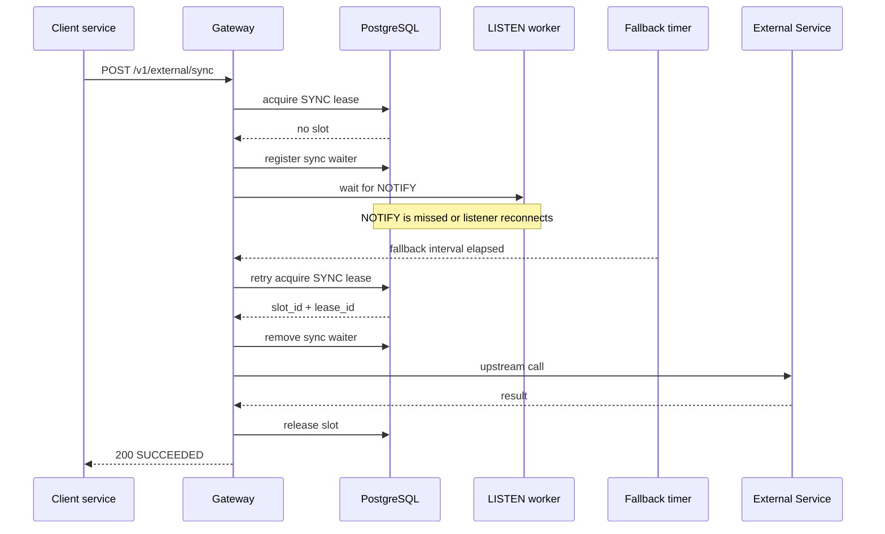

## Dynamic View. Sync Upstream Failure

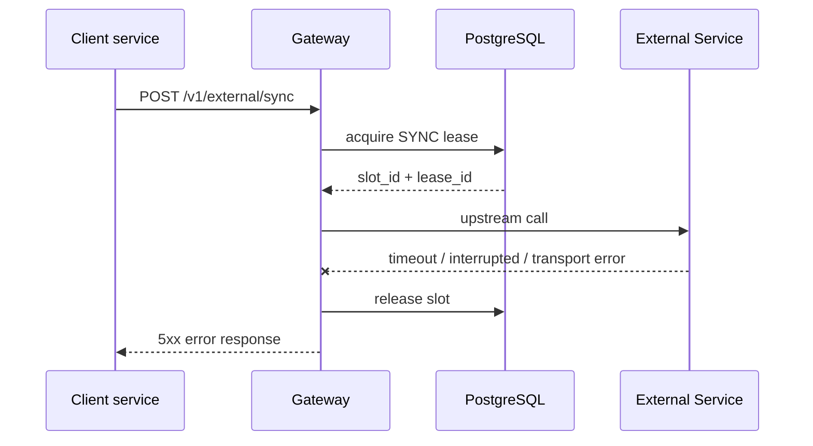

## Dynamic View. Async Success With Callback

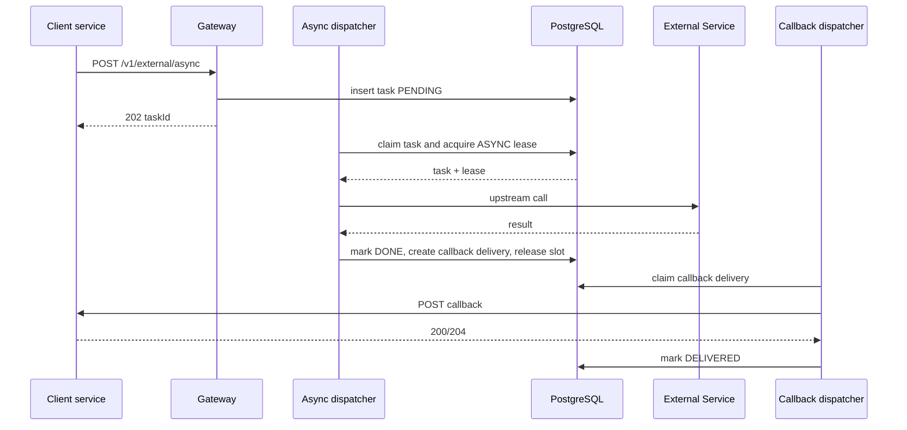

## Dynamic View. Async Slot Unavailable

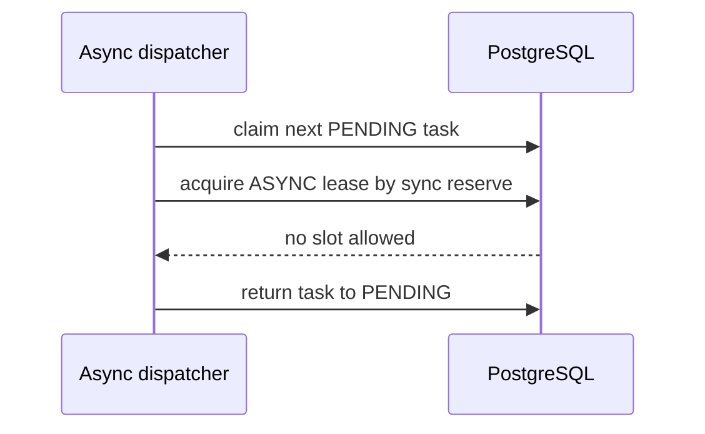

## Dynamic View. Async Upstream Failure

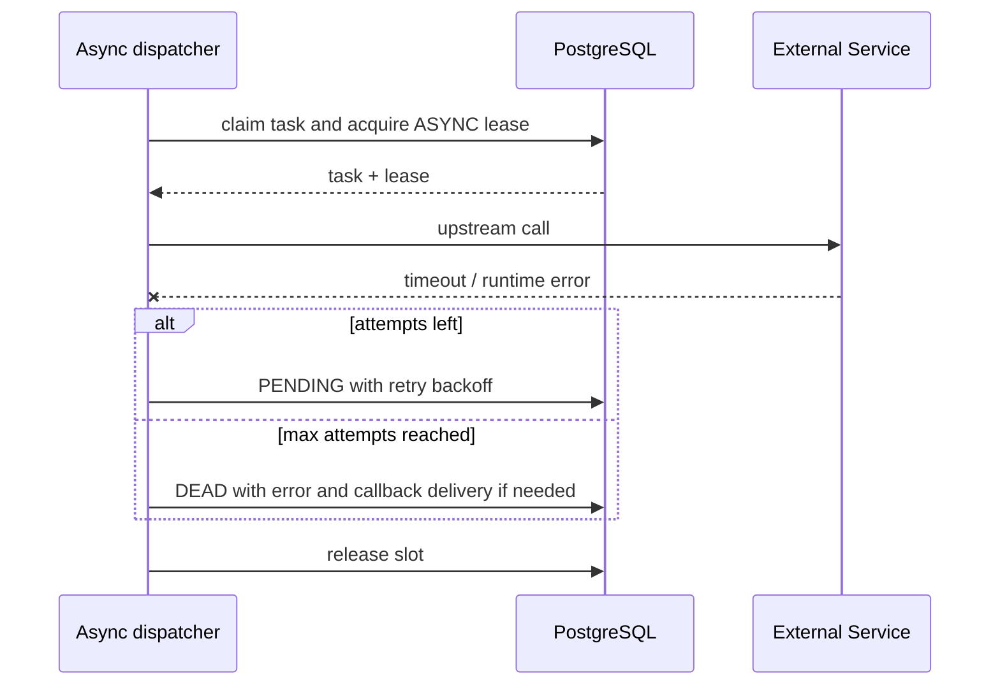

## Dynamic View. Callback Failure

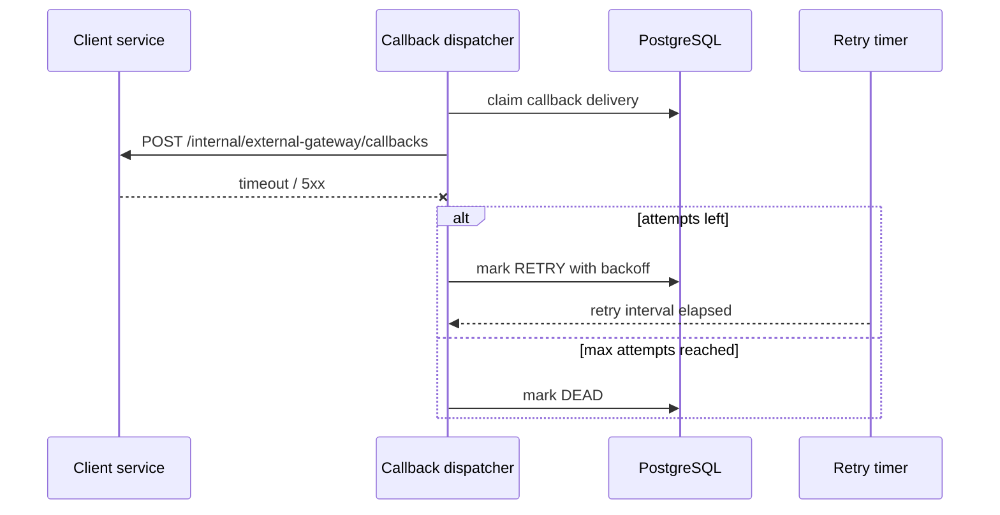

## Dynamic View. Async Fallback Read

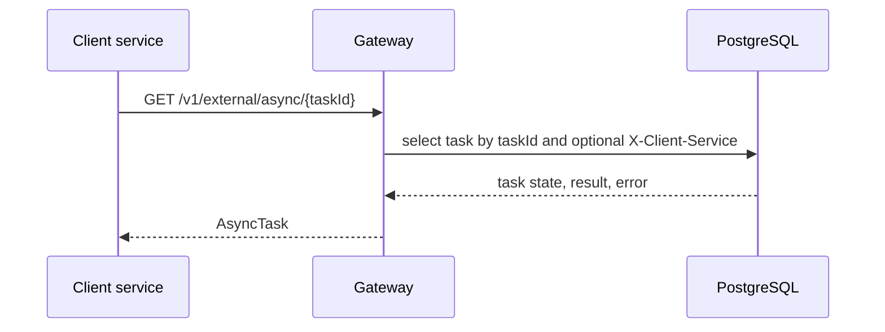

## Deployment Notes

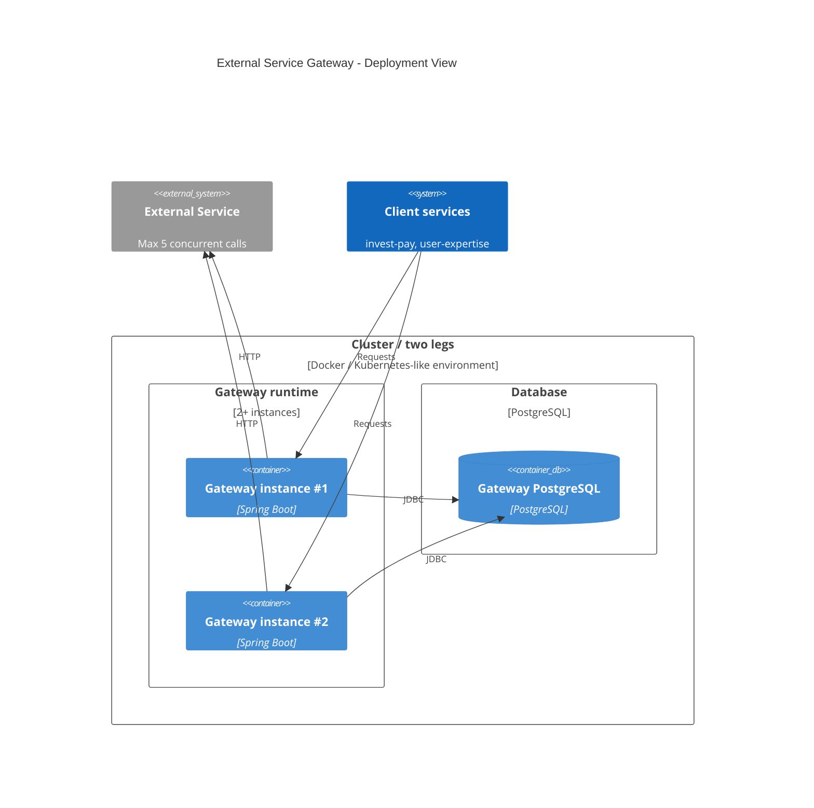

Все gateway-инстансы должны использовать один PostgreSQL-координатор. Если PostgreSQL разделен по плечам, лимит `5` превращается в сумму локальных лимитов и перестает быть глобальным.
