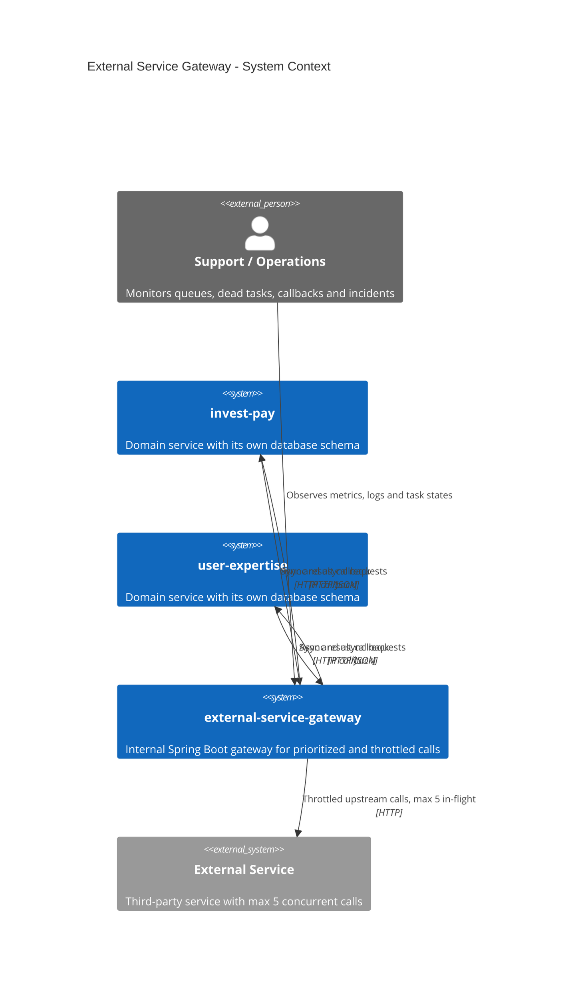
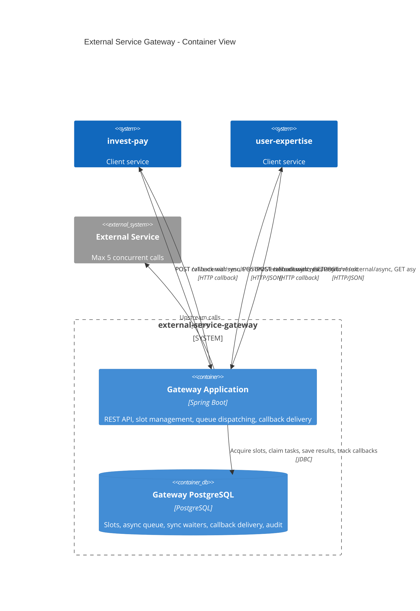
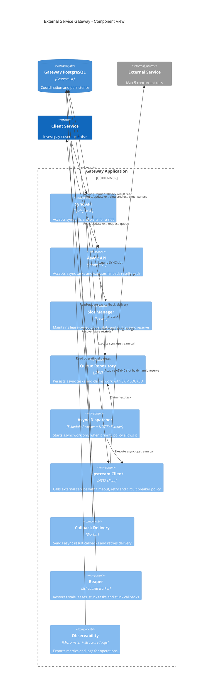
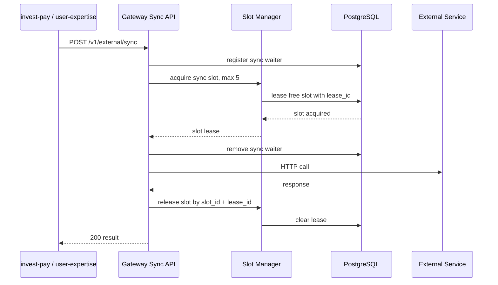
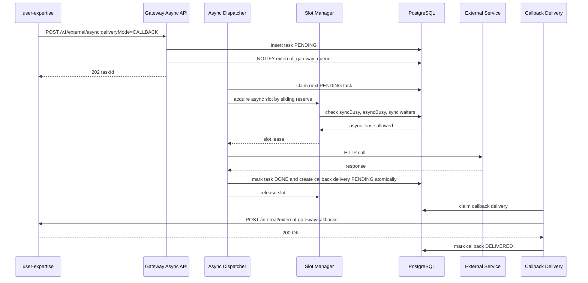
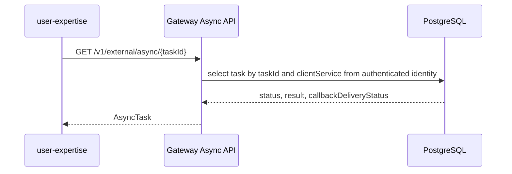
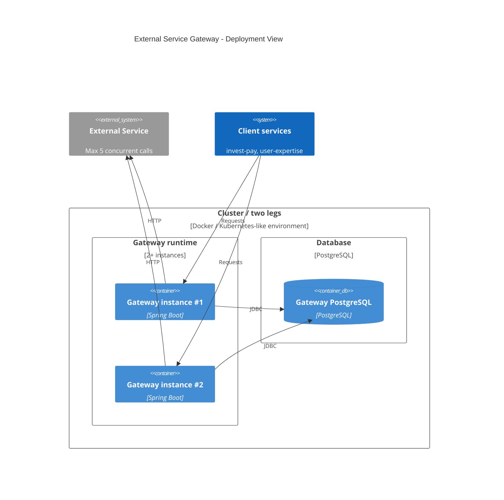

# C4 Architecture View

Документ фиксирует C4-представление `external-service-gateway`: от контекста системы до внутренних компонентов gateway. Диаграммы отражают текущие архитектурные решения:

- отдельный gateway-сервис между доменными сервисами и внешним сервисом;
- общий лимит `5 concurrent calls`;
- скользящий sync reserve;
- async callback в сервис-клиент;
- PostgreSQL как координатор слотов, очереди и callback delivery.

## Level 1. System Context



Ключевой смысл контекста: `invest-pay` и `user-expertise` не делят общую схему БД. Они интегрируются только через API gateway. Все прямые вызовы внешнего сервиса должны быть удалены или запрещены сетевой политикой.

## Level 2. Container View



`Gateway Application` может быть запущен в нескольких инстансах. Глобальный лимит обеспечивается не локальным пулом потоков, а общей PostgreSQL-схемой gateway.

Если два датацентра/плеча не имеют общего координатора, глобальный лимит `5` невозможен без отдельного соглашения о квотах, например `3 + 2`.

## Level 3. Gateway Component View



Главный инвариант Slot Manager:

```text
totalSlots = 5
targetFreeSyncSlots = 1
asyncAllowed = max(0, totalSlots - syncBusy - targetFreeSyncSlots)
```

Async может стартовать только если:

```text
asyncBusy < asyncAllowed
и нет живых sync waiters
```

## Dynamic View. Sync Request



Если слот не получен до `syncWaitTimeout`, gateway удаляет sync waiter и возвращает `429`. Код `503` используется для недоступности gateway или координатора лимитов, а не как обычный ответ на исчерпание sync SLA.

## Dynamic View. Async Request With Callback



Перевод async-задачи в финальный статус и создание записи callback delivery должны быть атомарными: одна транзакция в PostgreSQL или transactional outbox. Иначе рестарт gateway между этими действиями может оставить финальную задачу без доставки callback.

Если callback не доставлен, `Callback Delivery` переводит доставку в retry с backoff. Результат задачи остается доступен через gateway fallback API.

## Dynamic View. Async Fallback Result Read



Fallback чтение не требует общей БД между сервисами. `user-expertise` обращается к gateway по API, а gateway читает собственную схему.

## Deployment Notes



Все gateway-инстансы должны использовать один логический координатор слотов. Если PostgreSQL раздельный по плечам, лимит `5` превращается в сумму локальных лимитов и перестает быть глобальным.
