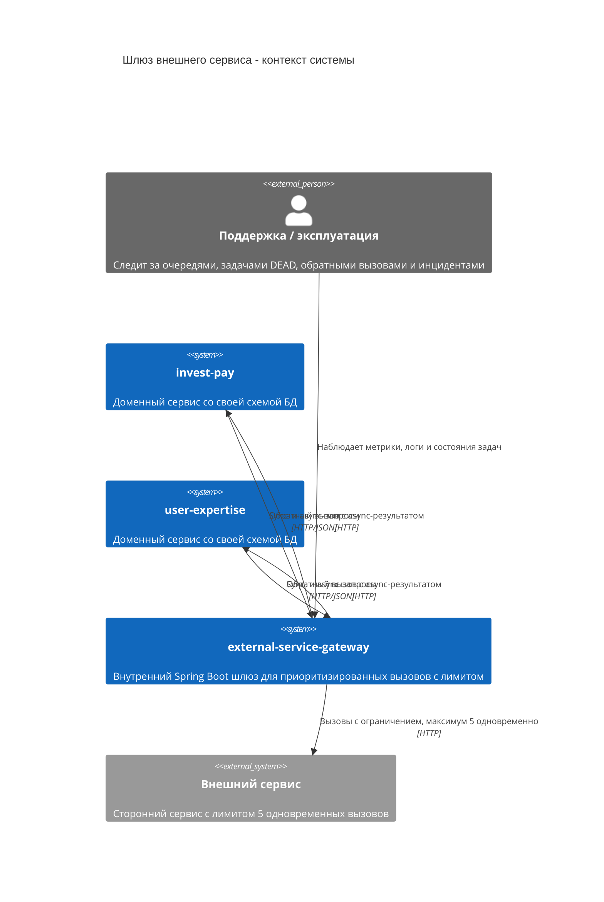
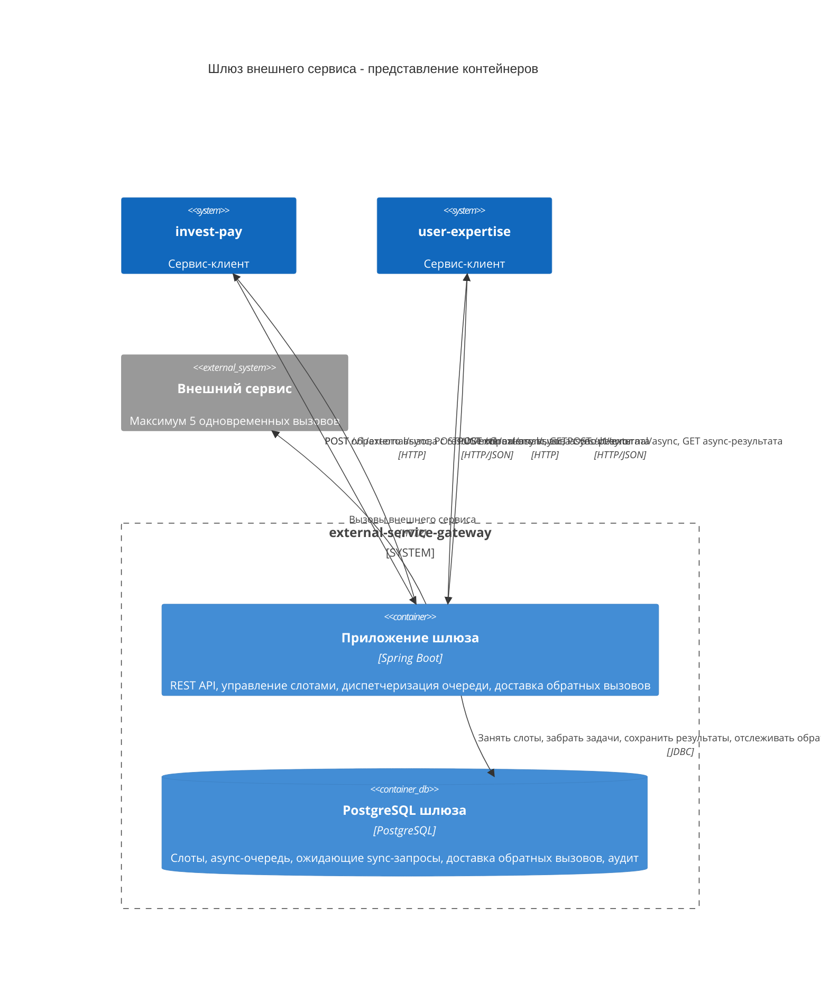
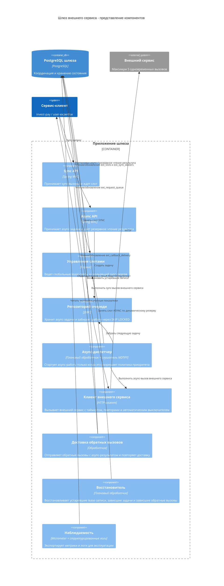
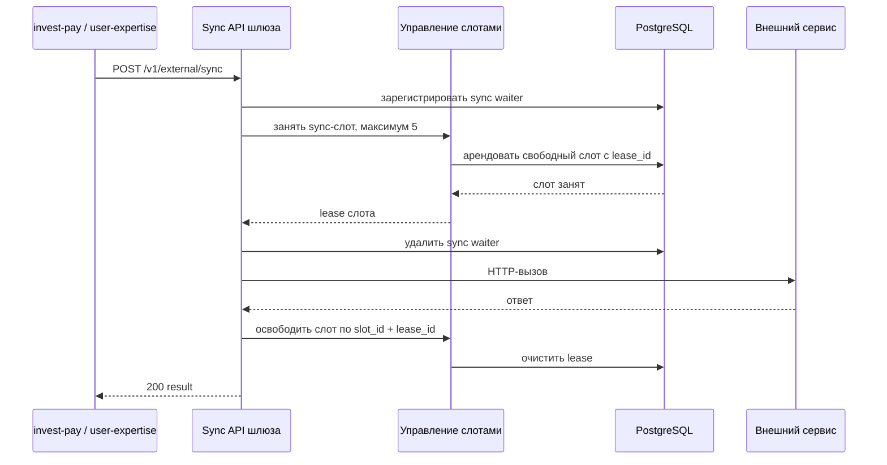
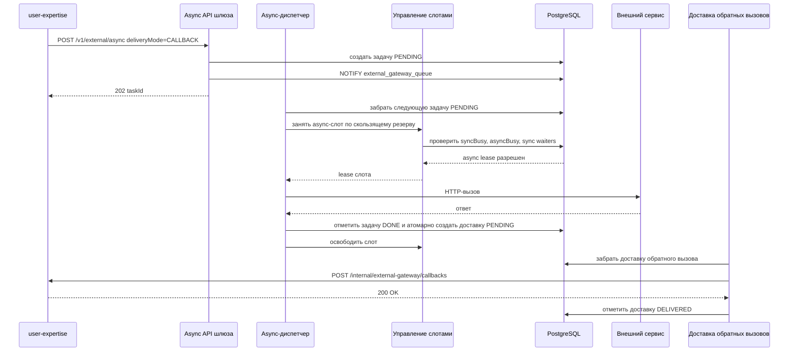
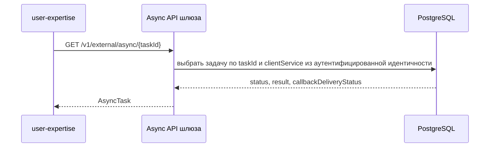
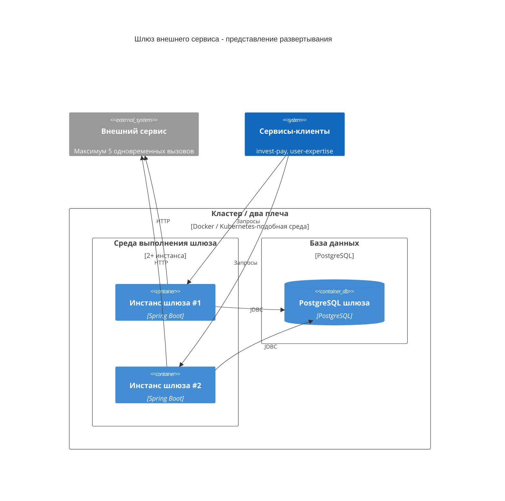

# Архитектурное представление C4

Документ фиксирует C4-представление `external-service-gateway`: от контекста системы до внутренних компонентов шлюза. Диаграммы отражают текущие архитектурные решения:

- отдельный сервис-шлюз между доменными сервисами и внешним сервисом;
- общий лимит `5` одновременных вызовов;
- скользящий sync-резерв;
- async-обратный вызов в сервис-клиент;
- PostgreSQL как координатор слотов, очереди и доставки обратных вызовов.

## Уровень 1. Контекст системы



Ключевой смысл контекста: `invest-pay` и `user-expertise` не делят общую схему БД. Они интегрируются только через API шлюза. Все прямые вызовы внешнего сервиса должны быть удалены или запрещены сетевой политикой.

## Уровень 2. Представление контейнеров



`Приложение шлюза` может быть запущено в нескольких инстансах. Глобальный лимит обеспечивается не локальным пулом потоков, а общей PostgreSQL-схемой шлюза.

Если два датацентра/плеча не имеют общего координатора, глобальный лимит `5` невозможен без отдельного соглашения о квотах, например `3 + 2`.

## Уровень 3. Представление компонентов шлюза



Главный инвариант управления слотами:

```text
totalSlots = 5
targetFreeSyncSlots = 1
asyncAllowed = max(0, totalSlots - syncBusy - targetFreeSyncSlots)
```

Async может стартовать только если:

```text
asyncBusy < asyncAllowed
и нет живых sync waiters
```

## Динамическое представление. Sync-запрос



Если слот не получен до `syncWaitTimeout`, шлюз удаляет sync waiter и возвращает `429`. Код `503` используется для недоступности шлюза или координатора лимитов, а не как обычный ответ на исчерпание sync SLA.

## Динамическое представление. Async-запрос с обратным вызовом



Перевод async-задачи в финальный статус и создание записи доставки обратного вызова должны быть атомарными: одна транзакция в PostgreSQL или транзакционный outbox. Иначе рестарт шлюза между этими действиями может оставить финальную задачу без доставки обратного вызова.

Если обратный вызов не доставлен, `Доставка обратных вызовов` переводит доставку в повтор с задержкой. Результат задачи остается доступен через резервный API шлюза.

## Динамическое представление. Резервное чтение async-результата



Резервное чтение не требует общей БД между сервисами. `user-expertise` обращается к шлюзу по API, а шлюз читает собственную схему.

## Заметки по развертыванию



Все инстансы шлюза должны использовать один логический координатор слотов. Если PostgreSQL раздельный по плечам, лимит `5` превращается в сумму локальных лимитов и перестает быть глобальным.
