# External Service Gateway

## Назначение

`external-service-gateway` - внутренний Spring Boot сервис для централизованных вызовов во внешний сервис с жестким ограничением:

```text
не более 5 одновременно выполняющихся HTTP-вызовов во всем кластере
```

Документ описывает основной вариант эксплуатации через PostgreSQL. Все инстансы gateway используют одну PostgreSQL-схему как координатор слотов, очередь async-задач и хранилище callback-доставок.

Сервис нужен, потому что несколько независимых приложений, например `invest-pay` и `user-expertise`, должны ходить в один внешний сервис, но не должны делить общую доменную схему БД. Лимитирование, очередь, приоритеты, retry/backoff и техническое состояние вызовов принадлежат gateway.

Сравнение с похожими open-source решениями и библиотеками зафиксировано в [open-source-solutions-research.md](open-source-solutions-research.md).

## Цели

- Гарантировать глобальный лимит `5 in-flight` upstream-вызовов.
- Дать sync-запросам приоритет над async-задачами до старта upstream-вызова.
- Поддержать async-постановку задач с результатом через callback или fallback GET.
- Сохранять async-задачи, результаты и callback-доставки в PostgreSQL.
- Централизовать retry/backoff для async-задач и callback-доставок.
- Не требовать общей БД-схемы между `invest-pay`, `user-expertise` и другими сервисами-клиентами.

## Не цели

- Gateway не содержит бизнес-логику доменных сервисов.
- Gateway не преобразует внутренние доменные модели сервисов-клиентов.
- Gateway не кэширует результат внешнего сервиса по умолчанию.
- Gateway не вытесняет уже начатый async-вызов: приоритет sync действует только перед стартом нового upstream-вызова.

## Топология

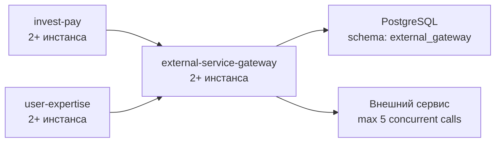

Все инстансы `external-service-gateway` должны использовать один логический PostgreSQL-координатор. Если разные плечи развертывания не имеют общей PostgreSQL-схемы gateway, глобальный лимит `5` технически не гарантируется. В таком случае нужны отдельные квоты по плечам, общий центральный gateway или согласованные лимиты со стороны внешнего сервиса.

## Основные компоненты

```text
REST API
  /v1/external/sync  - синхронный вызов внешнего сервиса
  /v1/external/async - постановка async-задачи, чтение результата, cancel, retry

PostgreSQL
  ext_slots             - lease-слоты глобального лимита
  ext_sync_waiters      - короткоживущие записи ожидающих sync-запросов
  ext_request_queue     - async-задачи, статусы, payload/result/error, retry
  ext_callback_delivery - callback-доставки, попытки, backoff, last_error

Async dispatcher
  выбирает задачу из PostgreSQL, получает async-слот и выполняет upstream-вызов

Callback dispatcher
  доставляет финальный результат async-задачи в сервис-клиент

Upstream client
  выполняет вызов внешнего сервиса; в текущем коде используется симулированный adapter
```

## Модель приоритета

У внешнего сервиса есть общий лимит `5` одновременно выполняющихся запросов. После старта HTTP-вызова gateway не может безопасно забрать слот у async-задачи. Поэтому приоритет sync реализуется политикой допуска к старту.

```text
totalSlots = 5
targetFreeSyncSlots = 1
sync может использовать до 5 слотов
async стартует только если после старта останется минимум 1 свободный слот под следующий sync
если есть живые sync waiters, async не стартует новый upstream-вызов
```

Практически лимит async вычисляется так:

```text
syncBusy = count(slots where kind = SYNC)
asyncBusy = count(slots where kind = ASYNC)
asyncAllowed = max(0, totalSlots - syncBusy - targetFreeSyncSlots)

async может стартовать, если:
  asyncBusy < asyncAllowed
  и нет живых sync waiters
```

Примеры для `totalSlots=5` и `targetFreeSyncSlots=1`:

```text
syncBusy=0 -> asyncAllowed=4
syncBusy=1 -> asyncAllowed=3
syncBusy=2 -> asyncAllowed=2
syncBusy=3 -> asyncAllowed=1
syncBusy=4 -> asyncAllowed=0
syncBusy=5 -> asyncAllowed=0
```

Приоритет async-задач хранится в API строкой, а в очереди - числовым весом:

```text
HIGH -> priority_weight = 100
LOW  -> priority_weight = 10
```

Dispatcher выбирает задачи по `priority_weight DESC, available_at ASC, id ASC`.

## Sync Flow

Sync-запрос не попадает в persistent queue. Gateway сначала делает немедленную попытку получить `SYNC` lease. Запись в `ext_sync_waiters` создается только если первая попытка не дала слот и запрос действительно переходит в ожидание.

Позитивный сценарий без ожидания:

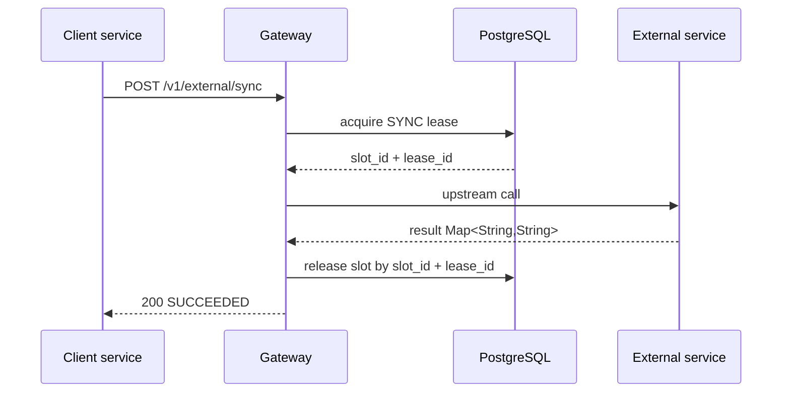

Позитивный сценарий после ожидания в режиме `listen_notify`:

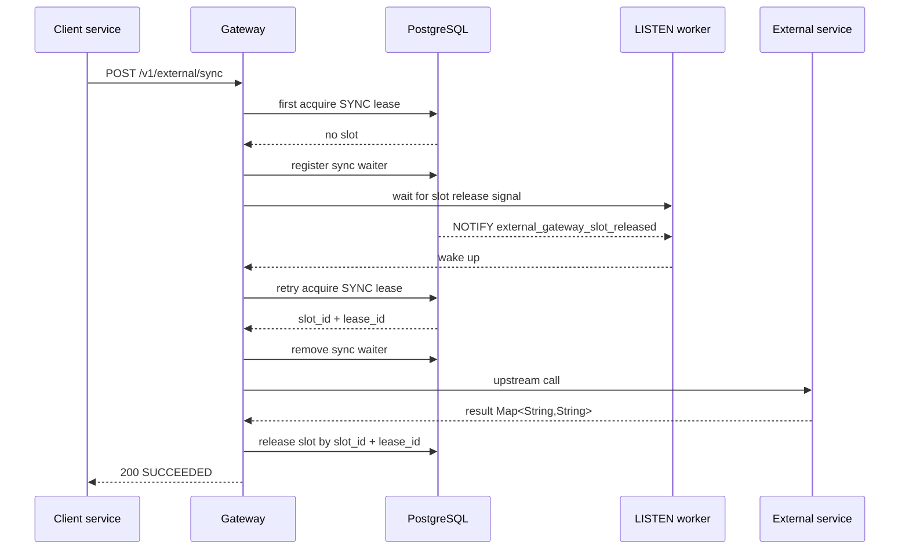

Негативный сценарий: слот не освободился до `sync.wait-timeout-ms`:

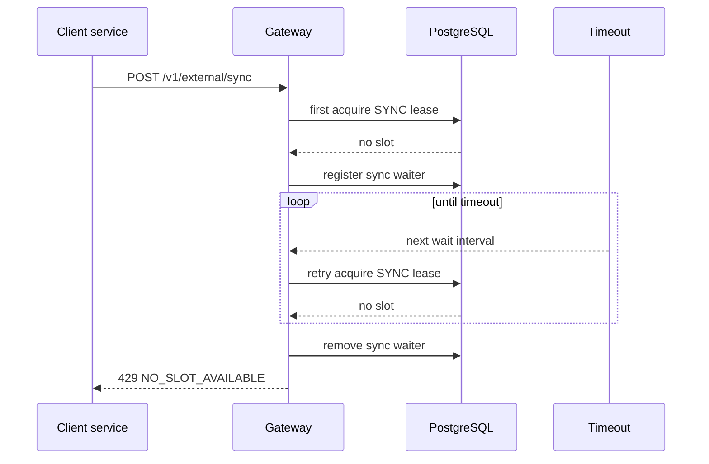

Альтернативный сценарий: PostgreSQL `NOTIFY` не разбудил ожидание, fallback polling сохранил корректность:

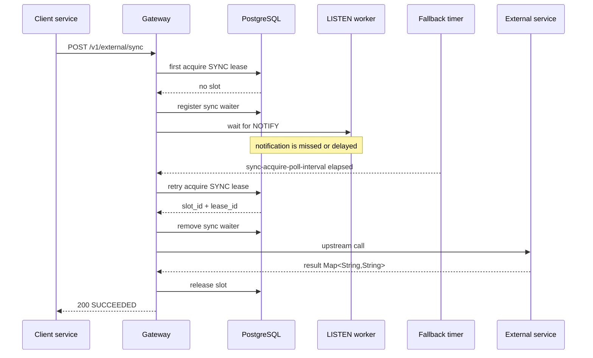

Негативный сценарий: upstream adapter завершился ошибкой, слот все равно освобождается:

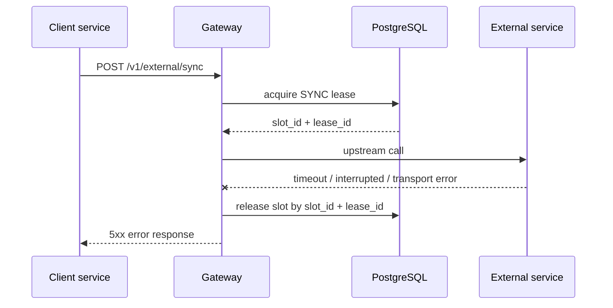

## Async Flow

Async-задача сохраняется в `ext_request_queue`. HTTP `POST /v1/external/async` только ставит задачу в очередь или возвращает уже существующую задачу по паре `clientService + externalId`. Обработка выполняется dispatcher'ом по расписанию, если `external-gateway.async.dispatcher-enabled=true`.

Позитивный сценарий с callback:

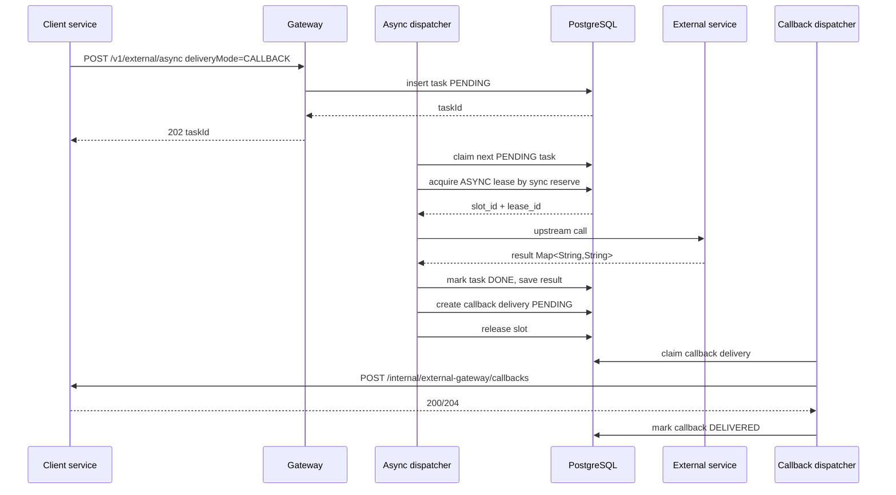

Негативный сценарий: async-слот недоступен из-за sync reserve или живого sync waiter:

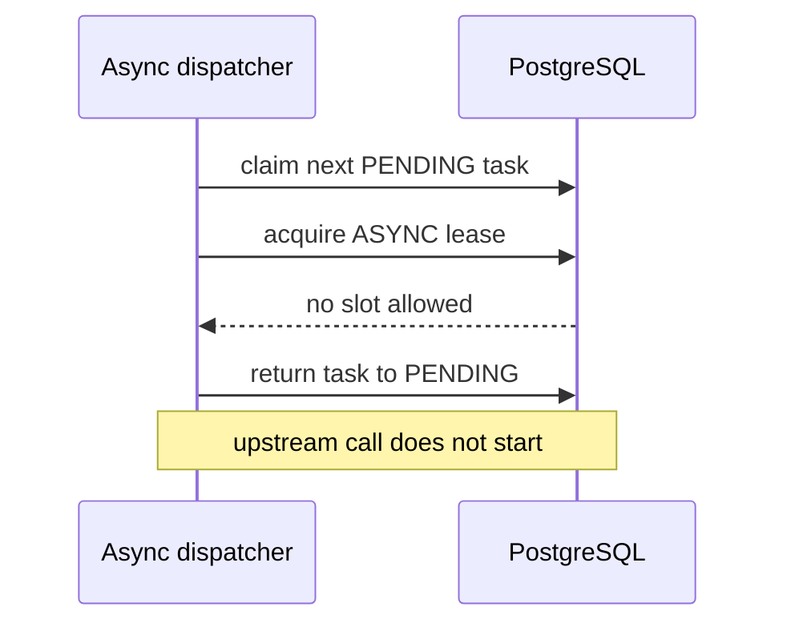

Негативный сценарий: внешний сервис не отвечает при обработке async-задачи:

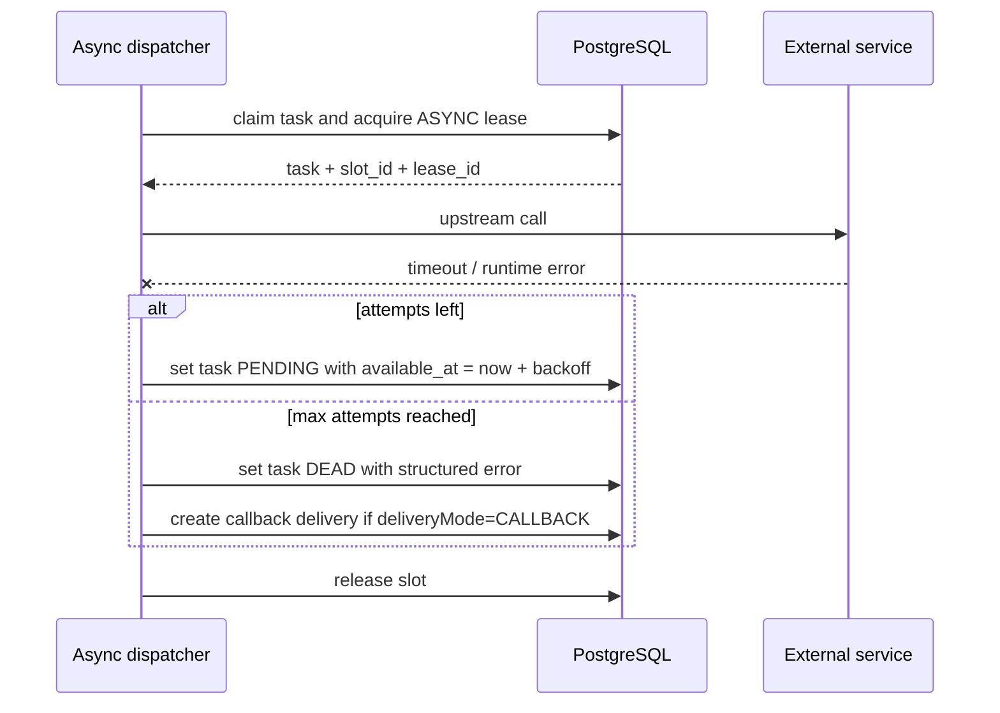

Негативный сценарий: callback endpoint временно недоступен:

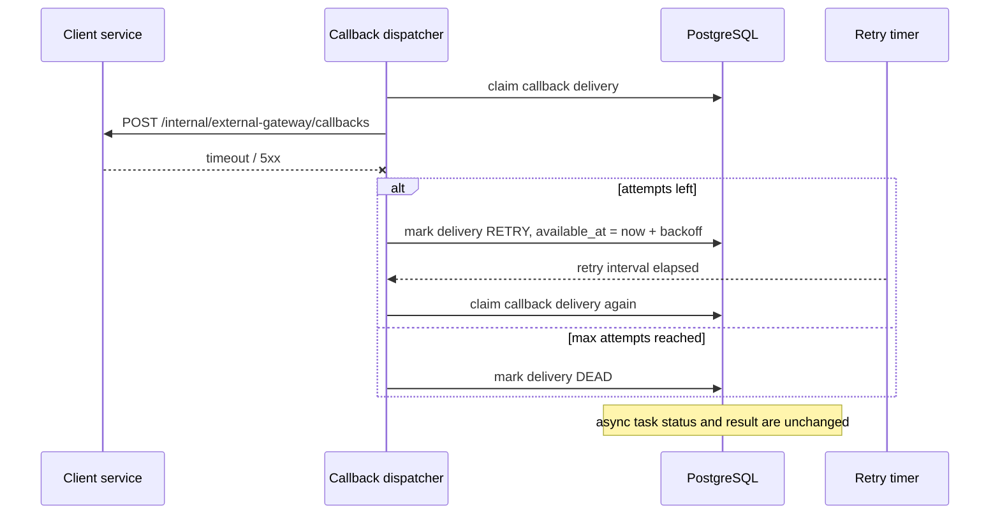

Fallback-чтение результата:

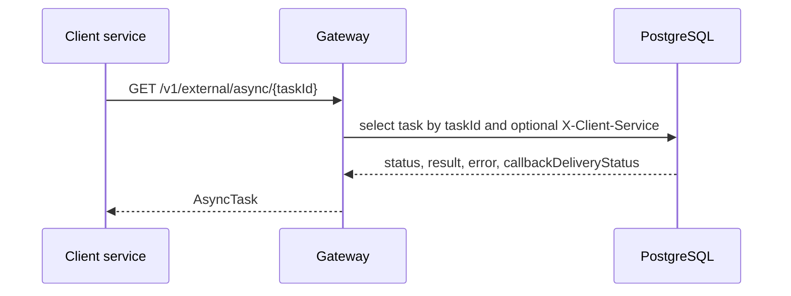

Если для задачи выбран `deliveryMode=POLLING`, callback-доставка не создается, а `callbackDeliveryStatus` равен `NOT_REQUIRED`.

## Callback Contract

Сервис-клиент, который выбирает `deliveryMode=CALLBACK`, должен реализовать endpoint:

```http
POST /internal/external-gateway/callbacks
```

Текущая реализация отправляет заголовки:

- `X-Callback-Attempt` - номер попытки доставки, начиная с `1`;
- `X-Request-Id` - correlation id доставки, равный `eventId` попытки.

Подпись callback пока не реализована. Callback URL не принимается из запроса: gateway берет его из allow-list `external-gateway.clients.<clientService>.callback-url`.

Пример callback:

```json
{
  "eventId": "9eab8bb2-b8e4-4c6e-a1d9-e0d4b7b0d77a",
  "taskId": 12345,
  "externalId": "4c48a4dc-3226-4e63-8597-4ee793fc3c3c",
  "clientService": "user-expertise",
  "status": "DONE",
  "result": {
    "decision": "APPROVED",
    "score": "82",
    "reasonCode": "OK"
  },
  "error": null,
  "finishedAt": "2026-05-21T20:30:00Z"
}
```

Для `DONE` поле `result` содержит `Map<String, String>`, а `error` равно `null`. Для `FAILED`, `DEAD` и `CANCELLED` поле `result` равно `null`, а причина передается в структурированном поле `error`. Callback endpoint должен быть идемпотентным: повторная доставка уже обработанного `taskId/status` должна возвращать `200` или `204`.

## PostgreSQL Как Координатор

Gateway владеет схемой PostgreSQL:

```text
external_gateway.ext_slots
external_gateway.ext_sync_waiters
external_gateway.ext_request_queue
external_gateway.ext_callback_delivery
```

Слот удерживается через lease-запись, а не через долгую транзакцию:

```text
slot_id
lease_id
owner
kind: SYNC | ASYNC
acquired_at
expires_at
task_id
```

Захват слота:

1. Короткая транзакция.
2. `SELECT ... FOR UPDATE SKIP LOCKED` или блокировка строк слотов для расчета async reserve.
3. Запись `lease_id`, `owner`, `kind`, `expires_at`.
4. Commit.
5. Upstream-вызов выполняется вне DB-транзакции.
6. Release выполняется отдельным update по `slot_id + lease_id`.

Release и heartbeat проверяют `lease_id`, чтобы старый поток не освободил или не продлил уже переиспользованный слот.

## LISTEN/NOTIFY

В режиме `external-gateway.slots.sync-acquire-wait-mode=listen_notify` gateway использует PostgreSQL канал:

```text
external_gateway_slot_released
```

После успешного release или cleanup истекших lease gateway отправляет `NOTIFY`. Уведомление является только сигналом пробуждения: после него sync-запрос снова проверяет `ext_slots`, и источником истины остается PostgreSQL. Если `NOTIFY` потерян или listener переподключается, ожидание продолжается через fallback `external-gateway.slots.sync-acquire-poll-interval`.

Async dispatcher не использует PostgreSQL notification-очередь. Он работает через scheduler polling и `FOR UPDATE SKIP LOCKED`.

## Текущие API-Ограничения

- `POST /v1/external/sync` и `POST /v1/external/async` берут `clientService` из тела запроса.
- `GET`, `DELETE` и `POST /v1/external/async/{taskId}/retry` используют необязательный заголовок `X-Client-Service` как временный scope доступа.
- Если `X-Client-Service` не передан, lookup не ограничивается сервисом-клиентом.
- Service-to-service authentication и сверка caller identity еще не реализованы.
- `Idempotency-Key` для sync принимается и передается upstream adapter'у, но gateway не хранит sync-результаты по этому ключу.
- Async идемпотентность реализована через уникальную пару `clientService + externalId`; заголовок `Idempotency-Key` для async не используется.

## Retry И Ошибки

Для async-задач:

- transient ошибка upstream переводит задачу обратно в `PENDING` с `available_at = now + retryBackoff`;
- после `maxAttempts` задача становится `DEAD` и получает структурированную ошибку;
- `CANCELLED` используется для задачи, отмененной до старта upstream-вызова;
- ручной retry разрешен для `FAILED` или `DEAD`, если `retryable=true`;
- callback-доставка имеет отдельные статусы `PENDING`, `DELIVERING`, `DELIVERED`, `RETRY`, `DEAD`.

Для sync-запросов:

- если слот не получен до `sync.wait-timeout-ms`, gateway возвращает `429 NO_SLOT_AVAILABLE` и `Retry-After: 1`;
- ошибка upstream adapter'а возвращается как error response, если adapter бросает gateway-исключение;
- слот освобождается в `finally` после успешного или ошибочного upstream-вызова.

## Конфигурация PostgreSQL

Минимальные свойства для PostgreSQL-варианта:

```properties
external-gateway.repository.type=postgres
external-gateway.postgres.jdbc-url=jdbc:postgresql://localhost:5432/external_gateway
external-gateway.postgres.username=external_gateway
external-gateway.postgres.password=change-me
external-gateway.postgres.schema=external_gateway
external-gateway.postgres.liquibase-enabled=true
external-gateway.slots.total=5
external-gateway.slots.target-free-sync-slots=1
external-gateway.slots.lease-ttl=30s
external-gateway.slots.sync-waiter-ttl=5s
external-gateway.slots.sync-acquire-poll-interval=10ms
external-gateway.slots.sync-acquire-wait-mode=listen_notify
external-gateway.async.dispatcher-enabled=true
external-gateway.callback.delivery-enabled=true
external-gateway.callback.delivery-timeout-ms=30s
external-gateway.callback.delivery-recovery-interval-ms=1000
```

Если `external-gateway.postgres.liquibase-enabled=false`, changelog `db/changelog/external-gateway/db.changelog-master.yaml` должен быть применен заранее.
Async-задача в PostgreSQL берется через `FOR UPDATE SKIP LOCKED`, а row-lock строки удерживается до финального обновления после upstream-вызова. Статус `IN_PROGRESS` при таком подходе является транзакционным состоянием обработки: при падении JVM транзакция откатывается, row-lock снимается, а задача остается `PENDING` и может быть взята снова. Async-слот при этом захватывается и освобождается отдельными короткими транзакциями, чтобы состояние слотов было видно дашборду во время долгого upstream-вызова. Если JVM падает после committed-захвата слота, но до release, lease слота будет очищен по `external-gateway.slots.lease-ttl`. Отдельный timeout-recovery для `IN_PROGRESS` не нужен; для внешнего upstream при этом важна идемпотентность по request id или `external_id`.
Callback-доставки, которые остались в `DELIVERING` дольше `external-gateway.callback.delivery-timeout-ms` после падения JVM или остановки процесса, на старте и далее с интервалом `external-gateway.callback.delivery-recovery-interval-ms` возвращаются в `RETRY` либо переводятся в `DEAD`, если попытки исчерпаны.

## OpenAPI

Контракты лежат отдельно:

- `../openapi/external-gateway-sync.yaml`
- `../openapi/external-gateway-async.yaml`
- `../openapi/external-gateway-callback.yaml`

Sync и async разделены, потому что у них разные SLA, жизненный цикл и модель результата. Callback вынесен в отдельный OpenAPI-файл, потому что этот endpoint реализуют сервисы-клиенты, а вызывает gateway.

## Оставшиеся Ограничения Реализации

- Реальный HTTP-клиент внешнего сервиса пока заменен симулированным adapter'ом.
- Service-to-service authentication, caller identity и подпись callback не внедрены.
- Автоматический reconcile `ext_request_queue.callback_delivery_status` с `ext_callback_delivery.status` пока не оформлен.
- Полный набор Micrometer metrics, dashboards и alerts не реализован.
- Интеграционный прогон PostgreSQL-варианта на живой БД или Testcontainers нужно выполнить отдельно.
