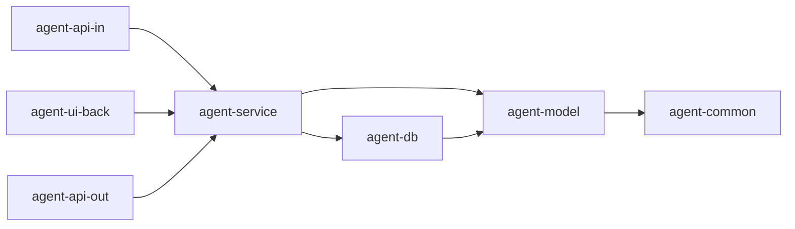
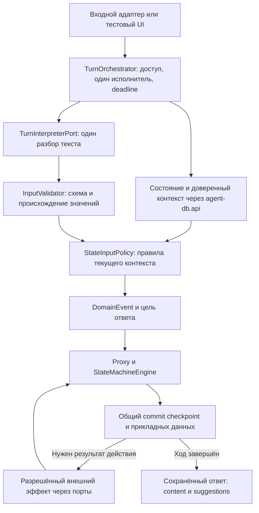

# invest-pro: архитектура MVP

MVP — агент для переписки по выбранному платежу. В одном чате пользователь может подготовить запрос статуса, отзыв или уточнение реквизитов, задать справочный вопрос и подтвердить отправку запроса. Приложение управляет сценарием, проверяет данные и передаёт подтверждённый запрос в Invest corr. Языковая модель разбирает текст пользователя. Сведения о платеже и исполнении заявок клиент получает через банковский контур по SMS с номера 900 на личный телефон.

**Дата среза:** 28.09.2026. **Версия документа:** 1.0. **Назначение:** самостоятельное архитектурное описание для команды, работающей в другом окружении. Документ определяет целевой MVP, принятые технические решения, контракты, инварианты и ограничения. Он не является отчётом о готовности существующего кода и не задаёт порядок разработки или агентский процесс. Несогласованные условия перечислены в разделе 17.

Основные термины: **ход** — обработка одного сообщения; **операция** — подготовка и передача одного запроса; **FSM** — машина состояний; **checkpoint** — сохранённая контрольная точка движка; **snapshot** — согласованное представление состояния и данных; **envelope** — полный конверт отправляемого запроса; **stub** — управляемая заглушка внешнего клиента. Слово **native** обозначает формат или механизм самой библиотеки.

## 1. Состав и границы MVP

| Возможность | Требуемое поведение |
|---|---|
| Статус, `status` | Подготовить запрос информации о выбранном платеже; получить отдельное согласие; передать запрос в corr. Специальная проверка полномочий для этой операции не выполняется |
| Отзыв, `recall` | Проверить полномочия; подготовить запрос отзыва; получить отдельное согласие; передать запрос в corr |
| Уточнение, `details` | Проверить полномочия; собрать изменения разрешённых реквизитов; выполнить локальную формально-логическую проверку (ФЛК); получить согласие на актуальную подготовку; передать запрос в corr |
| Справка | Ответить по утверждённой базе знаний; сохранить текущую операцию и ожидаемое действие пользователя |
| Отмена и смена | До отправки отменить подготовку и очистить её рабочие данные; при явно выбранном другом типе начать новую подготовку на том же исходном платеже |
| Восстановление | Загрузить состояние, рабочие данные и последний сохранённый ответ из БД без повторного исполнения внешних действий |
| Тестовый чат | Дать простой интерфейс к тем же прикладным сервисам, которые обслуживают ГигаАссистента |
| Автономный режим | Работать с настоящей persistence и управляемыми заглушками исходящих интеграций без банковских credentials |

Весь MVP включает все три операции. Наличие типа операции в DTO или заглушке само по себе не означает готовность пользовательского сценария.

Агент не исполняет платёж, не выполняет банковский отзыв своими силами, не меняет банковские реквизиты напрямую и не отправляет SMS. Он не получает телефон из чата, не отслеживает доставку SMS и не обещает её срок. `COMPLETED` означает подтверждённый приём запроса corr, а не исполнение банковской операции.

В MVP не входят фоновая сверка неизвестного результата, компенсации, автоматическая повторная отправка после завершения хода, напоминания или отмена по бездействию. Не требуются Kafka, Redis, векторная БД, отдельные микросервисы для каждого порта и второй рабочий движок состояний. Промышленное подключение каналов зависит от их внешних контрактов.

## 2. Принятые архитектурные решения и стек

Приложение представляет собой модульный монолит: восемь Maven-модулей, один процесс Spring Boot и один запускаемый JAR. Язык — Java 21 без preview-возможностей. Обработка одного сообщения синхронная: клиент получает полный ответ после завершения хода.

Версии ниже зафиксированы в исходном parent POM. Это воспроизводимая база проекта, а не утверждение об актуальности или сроке поддержки библиотек на дату запуска нового окружения.

| Область | Выбор |
|---|---|
| Сборка | Maven 3.9.x, parent/aggregator с `packaging=pom`, UTF-8 |
| Приложение | Spring Boot **3.5.15**, Spring MVC; линия Spring Framework 6.2 |
| Машина состояний | Spring Statemachine **4.0.2**: `spring-statemachine-core`, `spring-statemachine-data-jpa` |
| LLM framework | Spring AI BOM **1.1.2** |
| Интеграция GigaChat | `chat.giga:spring-ai-starter-model-gigachat:1.1.2` из `ai-forever/spring-ai-gigachat` |
| Модель | GigaChat **3 Ultra или 3.5 Ultra**; точный deployment/model ID задаётся для целевого контура |
| Исходящий HTTP | Spring Cloud OpenFeign; Spring Cloud BOM **2025.0.3**. Для corr — Feign с OkHttp transport |
| БД | H2 для обязательных DB-тестов и локального профиля `h2`; PostgreSQL сохраняется как поддерживаемый вариант |
| Persistence | Spring Data JPA, один `DataSource`, `EntityManagerFactory` и `JpaTransactionManager` для прикладных данных и checkpoint FSM |
| Миграции | Liquibase, только XML, единый master и общий каталог changeset |
| JSON и валидация | Jackson и Jakarta Validation; строгий входной контракт и отдельные предметные проверки |
| Генерация контрактов | OpenAPI 3.0.3, OpenAPI Generator Maven Plugin **7.25.0** |
| Преобразование DTO | MapStruct **1.6.3**, annotation processor, Spring component model |
| DTO | Простые Lombok-классы; enum остаются отдельными типами |
| Наблюдаемость | Actuator, Micrometer, OpenTelemetry и журнал переходов |
| Проверка поведения | JUnit, AssertJ, реальные H2/JPA/Liquibase, HTTP-стенд или WireMock |

Версии, управляемые BOM, отдельно произвольно не переопределяются. Virtual threads допустимы при подтверждённой пользе; они не заменяют ограничения ресурсов. Spring Statemachine выбран осознанно и изолирован вместе со своим хранением; переход на Boot 4, starter другой линии или другой движок является отдельным изменением архитектуры.

Ключевые решения:

- Приложение формирует события, определяет допустимость действий и составляет ответы. LLM возвращает только данные языкового разбора.
- На один допустимый текстовый ход приходится один вызов интерпретатора и не более одной генерации модели, включая кнопки, «Да» и «Нет».
- Машина состояний использует встроенный JPA persister SSM за собственным интерфейсом. Универсального собственного checkpoint перед движком нет.
- Прикладные данные и native checkpoint фиксируются одной локальной транзакцией. Удалённые вызовы выполняются вне неё.
- Все исходящие клиенты имеют stub и реальную реализацию. Выбор выполняется только конфигурацией. Реальный HTTP использует Feign; GigaChat — выбранную библиотеку.
- Только `agent-service` инициирует прикладную работу с `agent-db`. Обратной зависимости `agent-db → agent-service` нет.
- Банковская информация не попадает в ответы чата. Внутренняя сводка подтверждения остаётся в приложении.
- Входная идемпотентность делегирована внешней библиотеке. Идемпотентность команд FSM и отправок corr обеспечивается отдельно.

## 3. Модули, пакеты и зависимости

### 3.1. Состав приложения

Корневой Java package — `ru.sberbank.pprb.agent`.

| Модуль | Пакет относительно корня | Ответственность |
|---|---|---|
| `agent-common` | `common` | Общие технические утилиты, исключения, константы, `Deadline`, конфигурация MapStruct; без бизнес-правил |
| `agent-model` | `model` | Доменные DTO, enum, value objects, доменные сущности и отдельно изолированные JPA entity |
| `agent-db` | `db` | Публичный API БД, repositories, транзакции, mapping, миграции, SPI движка и весь SSM-адаптер с persister |
| `agent-service` | `service` | Входные и исходящие порты, use cases, оркестратор, политики, ФЛК, бизнес-переходы, proxy FSM, БЗ и шаблоны ответов |
| `agent-api-in` | `gigaassistant` | Входной контракт ГигаАссистента, controller, проверка JSON, mapping и адаптация доверенного контекста канала |
| `agent-api-out` | `investcorr`, `gigachat` | Внешние DTO, клиенты, заглушки, конфигурация и адаптеры исходящих интеграций |
| `agent-ui-back` | `chatui` | Backend тестового чата, его отдельный контракт и страница; вызов общих use cases |
| `agent-main` | `main` | `AgentApplication`, явное подключение конфигураций, профили, параметры и сборка запускаемого JAR |

Только `agent-main` использует Spring Boot repackage. Остальные модули — библиотеки одного приложения. Parent управляет версиями зависимостей, плагинов и процессоров.

### 3.2. Разрешённые зависимости

| Модуль | Прямые зависимости на модули проекта |
|---|---|
| `agent-common` | Нет |
| `agent-model` | `agent-common` |
| `agent-db` | `agent-model`, `agent-common` |
| `agent-service` | `agent-db`, `agent-model`, `agent-common` |
| `agent-api-in` | `agent-service`, `agent-model`, `agent-common` |
| `agent-api-out` | `agent-service`, `agent-model`, `agent-common` |
| `agent-ui-back` | `agent-service`, `agent-model`, `agent-common` |
| `agent-main` | Модули, необходимые для сборки приложения |



Стрелки обозначают compile-зависимости. Во время работы сервис вызывает исходящие порты, а их реализации приходят из `agent-api-out` через Spring wiring. Сам сервис не импортирует классы внешних адаптеров.

Входные, исходящие и UI-адаптеры не обращаются к `agent-db.api`, repositories, JPA entity, JDBC, `DataSource`, `EntityManager` или persister. Наличие БД в транзитивном classpath этого не разрешает. Пакет `service` внутри интеграции занимается адаптацией и не получает права сервисного модуля. `agent-main` подключает конфигурацию БД, но не работает с прикладными данными.

### 3.3. Структура пакетов и моделей

Для каждой интеграции используются `client`, `dto`, `exception`, `mapper`, `service`, `utils`, `config`; для входного HTTP добавляется `controller`. Generated API располагаются в `client.generated`, DTO — в `dto.generated`. Пакет принадлежит одному модулю. Пустые классы ради структуры не нужны.

В `agent-service` используются `port.in`, `port.out`, `usecase`, `domain`, `policy`, `validation`, `fsm`, `knowledge`, `config`. В `agent-db` публичная граница — `api`, весь SSM-код — `fsm.spring` с подпакетами.

| Тип данных | Размещение и граница |
|---|---|
| Внешние DTO | Только пакет соответствующей интеграции; не являются контрактом бизнес-сервиса |
| Доменные DTO | `model.dto`; используются портами и сервисами; не генерируются из внешней OpenAPI |
| Доменные сущности и значения | `model.entity.domain`, `model.value` |
| JPA entity приложения | `model.entity.persistence`; используются только `agent-db`, без передачи в HTTP, LLM или бизнес-сервисы |
| Native типы SSM | Только `db.fsm.spring`; не копируются в общий model |
| Spring AI/GigaChat | Только исходящая интеграция `gigachat` |

DTO используют суффиксы `InDTO` для входа, `OutDTO` для выхода, `DTO` для внутренних структур. Enum не имеют суффикса DTO. Простые DTO содержат Lombok getters/setters и no-args/all-args конструкторы, без проверок, защитного копирования и автоматически добавленных `equals/hashCode/toString`. Валидация выполняется на границах и в политиках. Ответственность за неизменность сохранённого envelope несёт сервис/хранилище, а не mutable DTO.

OpenAPI хранится в `src/main/openapi` своего модуля. API/DTO генерируются в `generate-sources` под `target`, до компиляции MapStruct. Для входа генерируются серверные интерфейсы Spring Boot 3; для corr — DTO и совместимый Feign API либо отдельно описанный Feign-интерфейс. Другой HTTP SDK не появляется как побочный результат генерации.

MapStruct использует `CommonMapperConfig`: Spring component model, constructor injection, `unmappedTargetPolicy=ERROR`. Игнорирование конкретного поля должно быть явным. Mapper переносит данные, не создаёт доверенную идентификацию, события или согласие. Документация OpenAPI, интерфейсов, методов и DTO/полей — краткая, на русском. Generated-документация берётся из OpenAPI стандартным генератором; собственные шаблоны Javadoc не нужны.

## 4. Доверенный контекст и входной контракт

### 4.1. Привязка сессии

До первого операционного сообщения на сервере существует сессия, связанная с каналом, пользователем, организацией и конкретным платежом. `epkId` обозначает **организацию** в едином профиле клиента; `digitalUserId` — **пользователя**. `paymentRef` — доверенная ссылка на исходный платёж.

Входной `sessionId` разрешается в пространстве аутентифицированного канала. Сервис сверяет владельца сессии, организацию и платёжную привязку. Поля JSON являются заявленными значениями и не доказывают доступ. Наименование организации получается через corr и проверяется по ожидаемой организационной привязке.

Неизвестная, чужая или непривязанная сессия не запускает операцию. Платёж нельзя выбрать по одному `epkId`, угадать по тексту или получить из кода кнопки. В автономном контуре доверенную привязку создаёт серверный fixture через use case; промышленный источник этой привязки ещё требует внешнего контракта.

### 4.2. Сообщение пользователя

Прототипный endpoint: `POST /api/v1/gigaassistant/turns`. Он фиксирует контракт проекта и не объявляется согласованным промышленным API ГигаАссистента.

```json
{
  "epkId": "epk-demo-org",
  "digitalUserId": "digital-demo-user",
  "requestId": "chat-request-001",
  "sessionId": "session-status-001",
  "content": "Статус",
  "action_code": "REQUEST_STATUS",
  "additionalInfo": [{"key": "paymentId", "value": "external-payment-42"}]
}
```

| Поле | Правило |
|---|---|
| `epkId` | Обязательная непробельная строка, 1–128 символов; ID организации |
| `digitalUserId` | Обязательная непробельная строка; ID пользователя; верхний лимит в принятом контракте не задан |
| `requestId` | Обязательная непробельная строка; ID входного запроса для внешней библиотеки идемпотентности; верхний лимит не задан |
| `sessionId` | Обязательная непробельная строка, 1–128 символов; внешний ID сессии |
| `content` | Обязательная непробельная строка, 1–4000 символов; при клике дословно равна `text` предложения |
| `action_code` | Код клика из закрытого каталога; при ручном вводе отсутствует; `null` и пустое значение запрещены |
| `additionalInfo` | Необязательный массив пар `key/value`; отсутствие преобразуется в `[]`, явный `null` запрещён |

Все ID — непрозрачные строки, UUID для них не требуется. Длины считаются в Unicode code points. Значения не обрезаются и не trim. JSON строгий: неизвестные поля, неизвестные enum, `null` обязательных значений и автоматическое приведение числа/boolean к строке запрещены.

У каждого элемента `additionalInfo` обязательны non-null строковые `key` и `value`, включая пустые строки. Ключи уникальны с учётом регистра; порядок сохраняется. Верхние лимиты длины этих строк и числа элементов не заданы. `paymentId` необязателен, передаётся дословно и **не преобразуется в доверенный `paymentRef`**. Его бизнес-обработка не определена. Другие ключи допускаются.

### 4.3. Ответ и предложения действий

```json
{
  "sessionId": "session-status-001",
  "content": "Направить информацию о статусе платежа в SMS с номера 900 на ваш личный телефон?",
  "suggestions": [
    {
      "guid": "b2a11010-9849-4daf-8a20-270fdc602001",
      "action_code": "CONFIRM_REQUEST",
      "text": "Да"
    },
    {
      "guid": "b2a11010-9849-4daf-8a20-270fdc602002",
      "action_code": "CANCEL_REQUEST",
      "text": "Нет"
    }
  ]
}
```

`sessionId`, `content`, `suggestions` обязательны. Массив может быть пустым, но не `null`. Для ответных `sessionId/content` действуют те же ограничения длины. Каждый саджест содержит UUID `guid`, известный `action_code` и непробельный `text` длиной 1–256 символов. GUID и коды не повторяются внутри ответа.

| Код | Текст каталога | Смысл |
|---|---|---|
| `REQUEST_STATUS` | Статус | Выбрать подготовку статуса |
| `REQUEST_RECALL` | Отзыв | Выбрать подготовку отзыва |
| `REQUEST_DETAILS` | Уточнение реквизитов | Выбрать подготовку уточнения |
| `CONFIRM_REQUEST` | Да | Согласиться с актуальным вопросом подтверждения |
| `CANCEL_REQUEST` | Нет | Отказаться от текущей подготовки |

Коды UI не являются событиями FSM. При клике клиент передаёт только код и `content=text`; GUID обратно не передаётся. Приложение сверяет код/текст с последним сохранённым ответом и текущим контекстом. До первого ответа разрешён стартовый каталог выбора операции в `CHOOSING_REQUEST_TYPE`.

Неизвестный код нарушает входной контракт. Неактуальный известный код, несовпадение текста или противоречие языковому разбору не разрешают отправку: приложение уточняет действие и возвращает актуальные предложения. Код не заменяет вызов LLM.

Текст, состав предложений и новые GUID определяет приложение. Полный ответ сохраняется до публикации. Повторное чтение возвращает прежние GUID. Ответы и query-представление не содержат реквизитов платежа, внутренних банковских идентификаторов, банковского статуса, результата исполнения заявки, состояния FSM и факта доставки SMS.

### 4.4. Транспортные ошибки

Формат ошибки — закрытый объект `{"code":"INVALID_REQUEST","message":"Некорректный запрос"}`. Он не содержит исходный ввод, stack trace и банковские данные.

| HTTP | Код | Условие |
|---|---|---|
| 400 | `INVALID_REQUEST` | Неверный JSON или контракт |
| 401 | `UNAUTHENTICATED` | Нет доверенной идентификации |
| 403 | `ACCESS_DENIED` | Нет доступа к сессии |
| 404 | `NOT_FOUND` | Неизвестная сессия или fixture |
| 409 | `SESSION_BUSY` | Другой ход этой сессии уже выполняется |
| 500 | `INTERNAL_ERROR` | Непредвиденная внутренняя ошибка |
| 503 | `SERVICE_UNAVAILABLE` | Обработка недоступна до принятия хода |

Контролируемый сбой LLM после принятия хода возвращает обычный технический ответ чата с `suggestions`. Ошибка БД не разрешает выдавать незакоммиченный бизнес-результат за успешный ответ.

## 5. Пользовательские сценарии и общие правила

### 5.1. Три операции

| Этап взаимодействия | `status` | `recall` | `details` |
|---|---|---|---|
| Выбор | Модель разбирает просьбу; Java проверяет намерение и контекст | То же | То же |
| Подготовка контекста | Проверенное название организации из corr, если ещё не сохранено | То же | То же |
| Полномочия | Специальный вызов отсутствует | Обязателен | Обязателен |
| Данные пользователя | Дополнительные реквизиты не запрашиваются | Дополнительные реквизиты не запрашиваются | Хотя бы одно допустимое изменение; локальная ФЛК |
| Подтверждение | Отдельный вопрос о направлении информации по SMS | Отдельный вопрос об отправке запроса отзыва и канале результата | Отдельный вопрос об отправке актуального запроса уточнения и канале результата |
| Передача | Только после однозначного согласия с текущей подготовкой | То же | То же, при актуальном успешном результате ФЛК |
| Успех | Corr подтвердил приём; информация поступит по SMS с 900 | Corr принял запрос, но это ещё не исполненный отзыв | Corr принял запрос, но это ещё не изменение в банковской системе |

Сводка — внутренний набор подтверждаемых данных: операция, исходный платёж, организация, изменения, политика уведомления и версии. В чат выводится понятное описание выбранного действия и канала результата, без банковской выписки и реквизитов из внутренней сводки.

### 5.2. Подтверждение

Отправка допустима только из `AWAITING_CONFIRM`. Последний фактически сохранённый ответ должен содержать вопрос подтверждения текущей сводки: `lastAssistantAct=CONFIRM_CURRENT_SUMMARY`. Совпадают `operationId`, версия и хеш сводки; для `details` совпадают версия черновика и версия успешной ФЛК. Проверки полномочий относятся к этой подготовке. Зарегистрированная отправка не создаётся повторно.

Прямое согласие должно быть однозначным: без вопроса, цитаты, отрицания, новых реквизитов или смены операции. Клик стартовой кнопки только выбирает операцию. «Да» после вопроса о значении поля не подтверждает отправку. «Да, но назначение замените…» в `details` меняет черновик, аннулирует согласие и требует новой ФЛК и нового подтверждения. В `status` такая реплика требует уточнить намерение и не изменяет платёж.

### 5.3. Полномочия и ограничение операций

Для `recall/details` результат `ALLOWED` привязан к текущим операции, типу, платежу и версии. Новая операция требует собственной проверки. `DENIED` завершает подготовку и устанавливает `statusOnly=true` для диалога по этому платежу. После этого доступны только `status` и справка. Смена операции, ручной ввод и старая кнопка не снимают запрет.

Технический сбой проверки не устанавливает `statusOnly`. Разрешены первая попытка и один технический повтор; после двух ошибок подготовка завершается с техническим сообщением. Бизнес-отказ повторять автоматически нельзя.

### 5.4. Четыре изменяемых реквизита и ФЛК

| Поле | Значение |
|---|---|
| `recipientInn` | ИНН получателя |
| `recipientAccount` | Счёт получателя |
| `recipientName` | Наименование получателя |
| `purpose` | Назначение платежа |

Разрешено любое непустое подмножество. Проверяются только переданные изменения; остальные поля не становятся обязательными без отдельного правила зависимости. Строковые значения сохраняют начальные нули. Отсутствие поля означает «не менять»; `null`, пустая строка и просьба очистить поле не получают автоматически семантику допустимого удаления.

При неоднозначном извлечении, нескольких несовместимых значениях или отсутствии нового значения приложение задаёт вопрос. Ошибки ФЛК перечисляются по соответствующим полям. Корректные изменения могут сохраняться в черновике той же операции во время исправления остальных. Новая версия проходит новую проверку.

`FLK_INVALID` — ошибки значений, без автоматического повтора. `FLK_ERROR` — технический сбой, допускающий один повтор той же версии. После второй технической ошибки подготовка завершается, её рабочие данные очищаются, исходный контекст сохраняется. Точные банковские форматы, длины, контрольные суммы, зависимости и тексты ошибок ещё не согласованы; пример длины ИНН не заменяет полной спецификации.

### 5.5. Отмена, смена, справка и отсутствие ответа

До отправки ясный отказ отменяет подготовку. «Нет, лучше статус» отменяет её и начинает разрешённый `status` в том же ходе. Если другой тип неясен, приложение предлагает выбор. Повтор текущего типа без просьбы начать заново сохраняет текущую подготовку.

Reset удаляет рабочие уточнения, результат ФЛК, сводку и согласие; новая операция получает новый ID и пустой черновик. Исходный платёж, идентификация, организация, проверенное название и `statusOnly` сохраняются. Ранее созданный envelope отправки и сведения о её исходе не удаляются. История чата не восстанавливает отменённые значения.

Вопрос по БЗ сохраняет состояние и черновик. После справки приложение напоминает ожидаемое действие. Если ответ снова содержит вопрос подтверждения, он связывается с актуальной сводкой; иначе следующее «Да» не считается отправкой по старому вопросу. Отсутствие статьи отличается от технической недоступности БЗ.

Сообщения одной сессии обрабатываются последовательно. Отмена не прерывает уже выполняющийся вызов. После `ACCEPTED` она не отменяет принятый запрос задним числом. Закрытие браузера и бездействие не подтверждают, не отменяют и не отправляют запрос; бизнес-таймеров нет.

## 6. Обработка одного сообщения и роль компонентов



`TurnOrchestrator` управляет ходом, временем и внешними действиями. Он проверяет доверенный контекст, получает право исполнения, читает согласованное состояние и при необходимости обогащает название организации. Ошибка входа, доступа, занятость или невозможность подготовить обязательный контекст могут завершить ход до LLM.

Для допущенного текста `TurnInterpreterPort` выполняет один разбор. `InputValidator` проверяет схему результата, размер, enum и соответствие извлечённых фрагментов исходному тексту. `StateInputPolicy` получает состояние, сохранённый контекст, исходное сообщение, проверенный код саджеста и данные разбора. Она возвращает `DomainEvent`, `ResponseDirective` и идентификатор применённого Java-правила `ruleId`.

`ResponseDirective` обозначает цель ответа: запросить данные, уточнить намерение, дать справку или сообщить исход. Поля `nextState` в решении языковой модели или входного адаптера нет. Следующее состояние определяет FSM с доменными guards. Валидация до перехода и guards используют общие политики.

FSM вычисляет переход, изменения данных и описание разрешённых действий `EffectSpec`. После успешного commit оркестратор синхронно выполняет полномочия, ФЛК или corr и подаёт внутреннее событие результата. Внутренние события не требуют нового вызова LLM. `AUTH_OK`, `FLK_OK`, `SUBMIT_SUCCESS` возникают только из доверенных обработчиков соответствующих действий.

`ResponsePolicy` выбирает смысл и предложения ответа по достигнутому состоянию. `ResponseComposer` составляет текст из шаблонов и утверждённых блоков БЗ. Сервис заранее выделяет GUID; чистые callbacks FSM не генерируют случайные значения. Ответ, `lastAssistantAct` и его связь со сводкой сохраняются согласованно, затем ответ публикуется клиенту.

Пример `status`: первый ход «Статус» обогащает контекст, создаёт подготовку и вопрос подтверждения; submit отсутствует. Второй ход «Да» отдельно разбирается моделью, проходит серверные условия согласия, фиксирует envelope, выполняет submit и сохраняет подтверждённый исход. На два нормальных хода приходится две генерации, по одной на каждый.

## 7. GigaChat и база знаний

### 7.1. Граница модели

Цепочка вызова: `TurnInterpreterPort → SpringAiGigaChatAdapter → GigaChatClient`. В автономном режиме выбран `StubGigaChatClient`; в реальном — `SpringAiGigaChatClient`, использующий `ChatModel` выбранного starter. Типы библиотеки не выходят за интеграцию `gigachat`.

Модели передаются исходный `content`, минимальный смысловой контекст текущей подготовки, последний вопрос агента, схема извлекаемых полей и полная БЗ. `action_code` проверяется отдельно и в prompt не передаётся. Полный snapshot БД, идентификаторы клиента/платежа, ключи отправки, OAuth и отменённые черновики в prompt не нужны.

Модель возвращает признаки речи, упоминания операций, предложенные значения полей, исходные фрагменты, признаки вопроса/цитирования/условности/неоднозначности и кандидаты разделов БЗ. Пример для «Да»:

```json
{
  "schemaVersion": 1,
  "speechActs": [
    {"kind": "AFFIRMATION", "usage": "DIRECT", "sourceText": "Да"}
  ],
  "operationMentions": [],
  "fieldMentions": [],
  "ambiguous": false,
  "knowledge": {"candidateSectionIds": []}
}
```

Пример для изменения: `fieldMentions` содержит поле из разрешённого каталога, `valueText`, `role=PROPOSED_VALUE`, `usage` и `sourceText`. Это кандидат изменения, а не готовый patch. Нормализация, применение к черновику и ФЛК принадлежат Java-коду.

Схема результата закрытая. В ней нет события FSM, следующего состояния, команды сервиса, готового ответа, саджестов, полномочий или признака приёма corr. Неизвестные свойства, включая `event`, `nextState`, `nextAction`, недопустимые enum, повреждённый/усечённый JSON и неподтверждённые извлечения отклоняются. Высокая уверенность модели не является разрешением на действие.

### 7.2. Структурированный результат и лимит генераций

Основной режим — принудительное предложение одной функции `interpret_turn` с аргументами по схеме разбора. Это способ получить структуру, а не доступ модели к банковским инструментам. Внутреннее исполнение tools отключено; приложение извлекает аргументы и не отправляет tool result обратно модели.

Для принятой версии starter проект опирается на `FunctionCallMode.CUSTOM_FUNCTION`, `functionCallParam`, `internalToolExecutionEnabled(false)`. Если целевой контур не поддерживает этот режим, конфигурация заранее выбирает `JSON_IN_TEXT` с локальной валидацией. Это альтернативный режим deployment, а не повторная генерация после ошибки. Поддержка native strict JSON Schema не считается установленной.

Порты полномочий, организации и отправки не регистрируются как `@Tool`/`@GigaTool`. Автоматические tool loops, ChatMemory advisor, JSON-repair retry и скрытые повторы генерации отключены. «Статус», «Да», «Нет» и клики не обходят интерпретатор через локальный словарь.

При недоступности модели или невалидном результате операция не отправляется, черновик сохраняется, возвращается уточнение либо технический ответ. Последний акт ответа отражает его реальное содержание и не считается новым вопросом согласия, если такого вопроса в нём нет. Автоматической замены Ultra другой моделью или fallback на stub нет.

Точный Ultra model ID, endpoint, credentials и capabilities подтверждаются в целевом окружении. Значение starter по умолчанию не должно незаметно выбирать другую модель. Бюджет одного вызова включает авторизацию, соединение, чтение полного ответа и разбор. Токен и соединения переиспользуются; TLS проверяется с доверенным truststore.

### 7.3. База знаний

БЗ небольшая, ориентировочно 2–3 страницы. Она хранится как версионированные Markdown/YAML-материалы и загружается в память. Один ход использует один snapshot БЗ; модель получает его целиком. Embeddings и сетевой поиск не нужны.

Модель предлагает `candidateSectionIds`. Приложение проверяет существование и уместность разделов, составляет справку из утверждённых блоков и добавляет актуальное напоминание о текущем действии. При неоднозначности уточняет вопрос. Отсутствие статьи не заменяется выдуманными банковскими условиями или статусом конкретного платежа. Окончательное содержание, владелец и порядок актуализации БЗ пока не определены.

## 8. Машина состояний

### 8.1. Состояния и переходы

Машина плоская, с одним регионом. Deferred events, автономные таймеры и скрытая очередь пользовательских сообщений отсутствуют.

| Состояние | Значение |
|---|---|
| `CHOOSING_REQUEST_TYPE` | Нет активной подготовки; доступны выбор операции и справка |
| `CHECKING_AUTH` | Синхронная проверка полномочий для `recall/details` |
| `AWAITING_DETAILS` | Ожидание изменений или исправлений реквизитов |
| `VALIDATING_DETAILS` | Локальная ФЛК текущей версии черновика |
| `AWAITING_CONFIRM` | Ожидание решения по текущей подготовке |
| `SUBMITTING` | Envelope сохранён; идёт синхронная отправка с допустимыми повторами |
| `COMPLETED` | Corr достоверно подтвердил приём |
| `FAILED` | Подготовка технически не выполнена либо corr достоверно отказал в приёме |
| `SUBMIT_UNKNOWN` | Ход завершён ошибкой, но приём corr не установлен |

`COMPLETED`, `FAILED`, `SUBMIT_UNKNOWN` не являются `.end(...)` SSM: после них доступна справка, после первых двух — новый выбор. Отмена записывается как исход `CANCELLED`, затем состояние возвращается в выбор. Состояний доставки SMS нет.

| Исходное состояние | Событие и условие | Результат |
|---|---|---|
| Выбор | `OPEN/SELECT(status)`, контекст корректен | Новая операция, `AWAITING_CONFIRM` |
| Выбор | `OPEN/SELECT(recall/details)`, контекст корректен, нет `statusOnly` | Новая операция, `CHECKING_AUTH` |
| Выбор | Контекст некорректен, тип неизвестен или запрещён | Без новой операции; ошибка или уточнение |
| `CHECKING_AUTH` | `AUTH_OK`, тип `recall` | `AWAITING_CONFIRM` |
| `CHECKING_AUTH` | `AUTH_OK`, тип `details` | `AWAITING_DETAILS` |
| `CHECKING_AUTH` | `AUTH_DENIED` | Завершить подготовку; `statusOnly=true`; возврат в выбор |
| `CHECKING_AUTH` | Первый `AUTH_ERROR` | Один повтор той же проверки |
| `CHECKING_AUTH` | Второй `AUTH_ERROR` | `FAILED`, очистка подготовки, технический ответ |
| `AWAITING_DETAILS` | `INPUT_DETAILS`, есть однозначные изменения | Новая версия черновика, `VALIDATING_DETAILS` |
| `AWAITING_DETAILS` | `UNCLEAR_INPUT` | Уточнение без сброса |
| `VALIDATING_DETAILS` | `FLK_OK` актуальной версии | Новая сводка, `AWAITING_CONFIRM` |
| `VALIDATING_DETAILS` | `FLK_INVALID` | Ошибки по полям, `AWAITING_DETAILS` |
| `VALIDATING_DETAILS` | Первый `FLK_ERROR` | Один повтор той же версии |
| `VALIDATING_DETAILS` | Второй `FLK_ERROR` | `FAILED`, очистка подготовки |
| `AWAITING_CONFIRM` | `CONFIRM` при всех условиях раздела 5.2 | Атомарно сохранить согласие/envelope; `SUBMITTING` |
| `AWAITING_CONFIRM` | `CHANGE_DETAILS`, тип `details` | Аннулировать согласие; новая версия, `VALIDATING_DETAILS` |
| `AWAITING_CONFIRM` | Неоднозначный ввод | Уточнение, состояние сохраняется |
| `SUBMITTING` | `SUBMIT_SUCCESS` | `COMPLETED` |
| `SUBMITTING` | Достоверный `SUBMIT_REJECTED` | `FAILED` |
| `SUBMITTING` | Неопределённость, ещё разрешён повтор | Тот же envelope и ключ, состояние сохраняется |
| `SUBMITTING` | Неопределённость после исчерпания политики | `SUBMIT_UNKNOWN`, ошибка без обещания SMS |

Дополнительные правила переходов:

| Ситуация | Поведение |
|---|---|
| Отказ в `AWAITING_DETAILS/AWAITING_CONFIRM` | Reset и выбор доступной операции |
| Ясный выбор другого типа до отправки | Reset и новая подготовка; при запрете или неверном контексте — только возврат в выбор |
| Повтор текущего типа без команды начать заново | Сохранить операцию; напомнить текущий шаг |
| Отказ без активной подготовки | Операция не создаётся |
| Вопрос в состоянии ожидания или после завершения | Справка, сохранение состояния и рабочих данных |
| Следующий HTTP-ход во время текущего | Контролируемый `SESSION_BUSY`; текущий вызов не прерывается |
| Новый ясный выбор после `COMPLETED/FAILED` | Новая подготовка на исходном контексте, собственное подтверждение |
| «Да», отказ или неясный ввод после `COMPLETED/FAILED` | Сообщить прежний исход, не создавать новую отправку |
| Новая операционная команда после `SUBMIT_UNKNOWN` | Не вводить новый бизнес-переход; дальнейший процесс отложен |
| Чужой, поздний или устаревший результат | Не применять к текущей операции |
| Закрытие окна или бездействие | Само по себе не создаёт перехода |

`OPEN/SELECT` создаются Java-политикой по проверенному входу и разбору, а не поступают из кнопки или модели. `CONTEXT_ENRICHED` — внутреннее обновление проверенного названия организации без смены пользовательского состояния. Каждое изменение бизнес-агрегата проходит общую версионность.

### 8.2. Интерфейс и граница заменяемости

| Элемент | Место и ответственность |
|---|---|
| `ConversationStateMachine` | Прикладной фасад в `agent-service.fsm` |
| `StateMachineProxy` | Тонкий выбор реализации по binding, делегирование, общая телеметрия |
| `StateMachineEngine` | SPI в `agent-db.api`: `initialize`, `load`, `apply` |
| `FlowDefinition` | Собственное описание переходов в `agent-model`, формируется сервисным слоем |
| `FlowPolicy` | Интерфейс чистых callbacks в `agent-db.api`; реализация доменных правил приходит из `agent-service` |
| `SpringStateMachineEngineAdapter` | SSM factory, обработка перехода, native restore/persist и сериализация в `agent-db.fsm.spring` |
| `TransitionCommitter` | Общая атомарная запись, публичный контракт в `agent-db.api` |
| `EngineCheckpointWrite` | Callback технической записи checkpoint внутри общей транзакции |

`initialize` идемпотентно создаёт данные сессии, binding и начальный checkpoint. `load` возвращает согласованный `ConversationSnapshot`: состояние из native persister плюс прикладные таблицы. `apply` принимает событие, факты, цель ответа, `commandId`, ожидаемую версию и токен исполнителя; успешный результат означает уже зафиксированный переход.

Через SPI не проходят `StateMachine`, `StateContext`, `ExtendedState`, Reactor `Mono`, JPA entity и исключения SSM. Proxy не сериализует checkpoint и не имеет собственной таблицы `machine_snapshot`. Он не является HTTP-прокси.

На одно локальное исполнение используется отдельная машина из factory. Restore не вызывает банковские действия. Guards/actions stateless: вычисляют изменения, описания эффектов и ответа без HTTP, SQL, LLM и фоновых задач. Reactive-обработка полностью завершается до commit; одного начального `ACCEPTED` или `subscribe()` без ожидания недостаточно. Неожиданный `DEFERRED` и ошибка завершают обработку без сохранения вычисленного перехода. После сбоя временная машина отбрасывается.

### 8.3. Native persistence и замена движка

Выбран явный встроенный persister:

```text
DefaultStateMachinePersister
  → JpaRepositoryStateMachinePersist
  → JpaStateMachineRepository
  → таблица state_machine в БД приложения
```

Одновременно подключать автоматический runtime persister не требуется. Сохраняется native `StateMachineContext`, а не живой объект с beans/потоками. Адаптер контролирует версию сериализации и регистрацию собственных state/event types в Kryo; произвольные классы не десериализуются.

В persisted `ExtendedState` находятся только технические ID и версии. Черновик, платёж, полномочия и подтверждение хранятся в прикладных таблицах. `machine_binding` закрепляет за сессией `engine_key`, `flow_definition_version` и `engine_storage_version`. Смена default влияет только на новые сессии. Отсутствующий checkpoint или несовместимая версия не создают новую пустую сессию.

Замена движка включает его persister, native таблицы, сериализацию и восстановление. Совместимость бинарных checkpoint разных движков не предполагается. Для существующих сессий требуется отдельная миграция либо поддержка прежней реализации до завершения сессий; завершение одной операции ещё не завершает сессию. `SUBMITTING/SUBMIT_UNKNOWN` автоматически не мигрируются. Движок с отдельной удалённой БД потребует нового протокола согласованности: текущая общая JPA-транзакция на него не распространяется.

## 9. Данные, транзакции и восстановление

### 9.1. Логическая модель хранения

| Таблица | Данные и ограничения |
|---|---|
| `state_machine` | Native checkpoint SSM; `machine_id`, состояние и сериализованный context. Единственный владелец текущего управляющего состояния |
| `agent_session` | Привязка канал/сессия/пользователь/организация/платёж, исходный контекст, название организации, `status_only`, активная операция, последний ответ, `aggregate_version`, версия схемы данных |
| `machine_binding` | Один binding на сессию; ID машины и версии движка/flow/storage; без второй копии текущего состояния |
| `agent_operation` | Тип, черновик, `draft_version`, `validated_draft_version`, разрешение с привязкой, сводка и версия, хеш подтверждаемого содержания, политика SMS, последний акт ответа, согласие и исход |
| `message_receipt` | Уникальность `(session_id, turn_id)`; хеш входа с кодом действия, фаза, deadline, полный ответ с GUID и версия результата |
| `session_execution` | Не более одного исполнителя сессии; `turn_id`, `execution_token`, `lease_until`, deadline |
| `transition_journal` | Уникальность `(session_id, command_id)`; хеш события, версии, состояния до/после, `rule_id` и результат команды |
| `submission` | Уникальные `(operation_id, summary_version)` и `idempotency_key`; неизменный envelope, хеш, версия retry-политики и исход |
| `submission_attempt` | Попытки существующего submission, время и подтверждённый/неопределённый результат |

Это логическая схема. Физические типы JSON/LOB должны соответствовать выбранной СУБД и Hibernate mapping; упоминание JSONB для PostgreSQL не означает отдельной упрощённой H2-схемы. Тип native `@Lob byte[]` SSM проверяется фактической persistence, а не угадывается как `bytea`.

`last_response_turn_id` указывает на завершённый receipt той же сессии и обновляется вместе с ним. До первого ответа он пуст; после появления указателя отсутствие receipt — ошибка целостности. Журнал переходов служит аудиту и внутренней дедупликации, не заменяет native persister. Binding связан с native таблицей логически, без обязательного FK доменной схемы на таблицу конкретного движка.

### 9.2. Общий commit

Локальное вычисление перехода выполняется вне SQL-транзакции. При фиксации `TransitionCommitter` в одной короткой JPA-транзакции повторно проверяет binding, `expectedVersion` и токен исполнения, выполняет compare-and-set версии и сохраняет прикладные изменения, native checkpoint и журнал. Для подтверждения сюда входит `submission`; для завершения хода — полный ответ, указатель на receipt и освобождение исполнения.

Встроенный `persister.persist` вызывается через `EngineCheckpointWrite` на потоке этой же транзакции. Callback не открывает `REQUIRES_NEW` или отдельное соединение. Один `DataSource`, один `EntityManagerFactory`, один `JpaTransactionManager` обслуживают все записи. Транзакция вокруг reactive `sendEvent` сама по себе этой гарантии не даёт.

Изменение агрегата увеличивает `aggregate_version`. CAS должен изменить ровно одну строку с ожидаемой версией; native update не должен затем затираться устаревшей managed entity. Ошибка сериализации, persist, flush или commit откатывает весь набор. Успех не публикуется до подтверждения commit.

Переход в `SUBMITTING` сохраняет подтверждение, точный envelope и ключ **до** сетевого submit. Только успешный commit разрешает внешний эффект. При потере ответа commit наличие записи устанавливается по уникальным ключам; новый ключ вслепую не создаётся. LLM, corr и ожидания не держат SQL-транзакцию или блокировку строки.

### 9.3. Один исполнитель и три разных вида идемпотентности

Право исполнения хранится в БД через `session_execution`. Токен не позволяет прежнему исполнителю коммитить после потери владения. Между независимыми сессиями параллельность разрешена. JVM singleton, sticky session и локальная блокировка не являются достаточной защитой нескольких реплик.

| Идентификатор | Назначение и предел гарантии |
|---|---|
| Входной `requestId` | Для существующей внешней библиотеки идемпотентности; её точный контракт подключения ещё не предоставлен |
| Внутренний `turnId` | Учёт одного принятого исполнения; не распознаёт повтор HTTP-доставки |
| Внутренний `commandId` | Дедупликация шага перехода; тот же ID и событие не увеличивают версию повторно, другой хеш с тем же ID отклоняется |
| `submissionId` и `idempotencyKey` | Одна подтверждённая отправка; все её попытки используют те же ключ и данные |
| `guid` саджеста | ID элемента ответа; обратно не передаётся и не связывает клик с версией вопроса |

Временная `@Idempotent` в исходном проекте — только маркер без AOP, cache и исполняемого поведения. Собственная альтернативная входная дедупликация не является принятым решением. Хеш текста и стабильный код действия не заменяют `requestId`.

Дубликат внутренней команды не разрешает повторно выполнять её эффект. Оркестратор сверяет фазу, право исполнения и deadline; для submit использует сохранённую запись и её retry-политику.

Канал обязан сохранять порядок: показать ответ перед следующей репликой и не повторять POST автоматически после неизвестного результата доставки. Без возвращаемого GUID/`replyTo` старое «Да», доставленное после нового вопроса, неотличимо от актуального. Даже подключение библиотеки по `requestId` само по себе не связывает клик с вопросом. Гарантию ровно одного приёма подтверждённого envelope нельзя расширять до произвольной переупорядоченной доставки.

### 9.4. Сбои и восстановление

| Момент сбоя | Требуемое поведение |
|---|---|
| До commit перехода | В БД остаются прежние checkpoint и данные; временная машина отбрасывается |
| Во время LLM/проверки | Просроченный результат не применяется к другой версии/операции или после потери токена |
| Сохранён `SUBMITTING`, но факт начала сети неизвестен | Envelope сохраняется; состояние отражает неопределённость, автоматического нового submit нет |
| Corr мог принять, результат не сохранён | Не считать это отказом; фиксировать `SUBMIT_UNKNOWN` при доступности БД |
| Доказано, что отправка не начиналась | Технический исход `NOT_SENT`, без заявления об отправке |
| Финальный commit выполнен, HTTP-ответ потерян | Последний ответ доступен через query с прежними GUID; повторное согласие после `COMPLETED` не создаёт новую отправку |
| Lease истёк | Проверить сохранённую фазу; истечение не разрешает немедленный повтор corr |

Fencing защищает локальные записи и не отменяет уже начатый удалённый запрос. Внешнюю защиту от повторного приёма даёт idempotency-контракт corr. Техническое восстановление записи исполнения не запускает банковскую сверку или отправку в фоне. Restore не вызывает LLM, corr и внешние entry effects.

## 10. Invest corr: порты и контракт прототипа

### 10.1. Три ответственности одного внешнего контура

| Порт в `agent-service.port.out` | Вход | Результат |
|---|---|---|
| `PermissionPort.check` | Доверенные пользователь, организация, платёж; `recall/details`, ID операции и ожидаемая версия | `ALLOWED`, `DENIED`, `TECHNICAL_ERROR` с привязкой к операции/версии |
| `OrganizationPort.resolveName` | `epkId`, `digitalUserId`, ожидаемая организация и доверенная идентификация | `FOUND`, `NOT_FOUND`, `AMBIGUOUS`, `BINDING_MISMATCH`, `TECHNICAL_ERROR`; при успехе организация, источник и время |
| `CorrespondencePort.submit` | Сохранённый envelope | `ACCEPTED`, `REJECTED`, `UNCERTAIN`, `NOT_SENT`; corr ID при подтверждённом приёме |

Порты реализует `InvestCorrAdapter`. Он преобразует доменные DTO в wire DTO и обратно, проверяет форму ответа, не меняет FSM и не пишет пользовательский текст. `CallContextDTO` несёт correlation ID, deadline и номер попытки от 1. Повторами управляет оркестратор.

Lookup организации выполняется перед новой подготовкой, если проверенного результата ещё нет. Единственный найденный ref должен совпадать с ожидаемым. При отсутствии результата, неоднозначности, неверной привязке или техническом сбое организация не угадывается, новая операция не начинается. Название сохраняется с источником/временем; вопросы, отмена и смена типа не запускают новый lookup. TTL названия не задан. Изменение данных сводки при возможном обновлении имени должно аннулировать старое согласие.

### 10.2. HTTP прототипа

Согласован внутренний контракт трёх POST. Это схема стенда проекта, а не утверждение о реальном API банка.

| Endpoint | Основные поля тела |
|---|---|
| `/api/v1/permissions/check` | `digitalUserId`, `organizationRef`, `paymentRef`, `operationType`, `operationId`, `expectedAggregateVersion` |
| `/api/v1/organizations/resolve` | `epkId`, `digitalUserId`, `expectedOrganizationRef`, `trustedIdentityRef` |
| `/api/v1/submissions` | Поля envelope из раздела 10.3 |

JSON UTF-8, имена camelCase, типы операций `status/recall/details`. Все запросы передают `X-Correlation-ID` и `X-Attempt`; submit также `Idempotency-Key`, равный ключу в теле. Deadline остаётся локальным ограничением. Ответ permissions содержит outcome и привязку к операции/версии; ответ организации — outcome и найденную организацию.

Успешный приём:

```json
{"outcome":"ACCEPTED","corrRequestId":"corr-demo-1"}
```

HTTP 200 признаётся успехом только при валидном соответствующем outcome и обязательных данных. `ACCEPTED` требует непустой corr ID. `REJECTED` требует достоверного бизнес-отказа. `UNCERTAIN/NOT_SENT` формирует локальный адаптер, а не доверяет произвольному полю удалённого ответа.

HTTP 409 с `{"code":"IDEMPOTENCY_CONFLICT"}` отклоняет изменённый payload при занятом ключе и не отменяет ранее принятый запрос. Прочие 4xx/5xx, redirect, обрыв, неизвестные поля/outcome, несовместимая комбинация данных и неверный JSON считаются технической ошибкой для чтений и неопределённостью для начатого submit. HTTP 500 не доказывает отказа в приёме, HTTP 200 сам по себе не доказывает приёма.

### 10.3. Неизменный envelope и canonical payload

| Поле | Назначение |
|---|---|
| `submissionId` | ID отправки приложения |
| `operationId` | ID подготовленной операции |
| `summaryVersion` | Целая версия подтверждённой сводки |
| `idempotencyKey` | Стабильный ключ всех попыток одной отправки |
| `type` | `status`, `recall`, `details` |
| `paymentRef`, `digitalUserId` | Доверенные платёж и пользователь |
| `organization` | Объект `ref`, `name` с проверенными данными |
| `changes` | Отсутствует для status/recall; для details — непустое подмножество четырёх непустых строк |
| `notificationPolicy` | `SMS_900_PERSONAL_PHONE_V1` |
| `payloadHash` | Хеш canonical payload по правилу ниже |

Принятый алгоритм `corr-payload-v1`: компактный JSON в UTF-8 без BOM; ключи объектов лексикографически сортируются на всех уровнях; optional-поля со значением null отсутствуют; `summaryVersion` сохраняется целым числом; строки не trim и не normalize. Хешируется **весь envelope, кроме самого `payloadHash`**, включая технические ID, ключ, версию и политику SMS. Формат хеша — `sha256:` и lowercase hex SHA-256. Correlation ID, номер попытки и deadline в envelope не входят и не хешируются.

Адаптер создаёт собственный снимок wire DTO/canonical bytes и проверяет заявленный хеш. Он не исправляет его молча и не генерирует новый ключ. Повтор использует прежние bytes и ключ; тот же ключ с другим payload — конфликт. Вызывающая сторона не меняет DTO конкурентно во время вызова.

`summaryPayloadHash` обозначает целостность подтверждаемого содержания, `payloadHash` — проверку envelope на границе corr. В исходном примере workflow использован более ранний хеш только бизнес-полей; он не соответствует принятому `corr-payload-v1`. Этот пример нельзя переносить как wire-хеш. Точная связь двух хешей и момент назначения технических ID относительно вопроса согласия пока не описаны единым согласованным контрактом; это отмечено в разделе 17.

### 10.4. Результаты и SMS

| Исход | Что можно утверждать |
|---|---|
| `ACCEPTED` | Corr подтвердил приём конкретного запроса; можно сообщить, что информация поступит по SMS с 900 |
| `REJECTED` | Достоверно отказано в приёме текущего запроса; обещания SMS нет |
| `UNCERTAIN` | Приём не установлен, но мог произойти; после разрешённых попыток — `SUBMIT_UNKNOWN` |
| `NOT_SENT` | Достоверно не начиналась передача; техническое сообщение без утверждения об отправке |

Получателя SMS определяет банковский контур по доверенной идентификации; телефон пользователь не вводит. `notificationPolicy` фиксирует семантику уведомления, но наличие одноимённого поля в настоящем API corr не предполагается. Шаблон успеха status: «Запрос принят. Информация о статусе платежа будет отправлена в SMS с номера 900 на ваш личный телефон». Для recall/details сообщение также говорит о приёме запроса и канале результата, а не об исполнении операции.

## 11. Заглушки и переключение интеграций

Каждый прикладной out-клиент имеет общий контракт и ровно одну активную реализацию: stub или реальную. Для corr это `InvestCorrClient`, для GigaChat — `GigaChatClient`. Stub проходит тот же адаптер, mapping и валидацию.

```yaml
integrations:
  invest-corr:
    stub: "enabled"
    url: "${INVEST_CORR_URL:}"
  gigachat:
    stub: "enabled"
    url: "${GIGACHAT_URL:}"
```

| Настройка | Правило |
|---|---|
| `stub: "enabled"` | Только stub; реальный клиент, transport, OAuth, соединения и его фоновые задачи не инициализируются |
| `stub: "disabled"` | Только реальный Feign-клиент либо библиотечный GigaChat |
| Режим отсутствует/неизвестен | Ошибка запуска; boolean вместо строки не принимается |
| URL при disabled | Обязательный абсолютный HTTP(S) URL; для corr — host без userinfo/fragment; TLS и авторизация настраиваются отдельно |
| URL при enabled | Может быть пустым, не используется; наличие адреса не разрешает сеть |
| Изменение режима | Применяется при перезапуске, не внутри активного хода |
| Сбой реального клиента | Типизированная ошибка, без fallback на stub |

Корень конфигурации — `integrations`, без альтернативных `agent.integrations.*.mode` или `agent.llm.mode`. Нельзя зарегистрировать оба клиента и только условно выбирать их при вызове: неактивная ветвь должна оставаться неинициализированной.

Fixtures задаются тестовой конфигурацией и доверенными ID. Текст пользователя не выбирает `ALLOWED`, `ACCEPTED`, тестовый сценарий или режим. GigaChat stub выдаёт только разбор/ошибку, не событие FSM. Corr stub исполняет одну попытку; повторы остаются в сервисе.

Обязательные сценарии corr: разрешение/отказ/технические сбои полномочий, корректная/отсутствующая/неоднозначная/чужая организация, приём/отказ/timeout каждой операции, принятие с потерянным ответом, одинаковый ключ с тем же или другим payload, конкурентные повторы. `ACCEPT_THEN_TIMEOUT` сначала сохраняет приём, затем скрывает ответ; повтор возвращает прежний corr ID. `ACCEPT_THEN_ALWAYS_TIMEOUT` сохраняет один приём, но не раскрывает результат ни на одной разрешённой попытке.

In-process stub может иметь атомарный реестр в памяти. Он не доказывает устойчивость после падения JVM. Для проверки окна «corr принял, агент упал» нужен независимый HTTP-стенд с собственным устойчивым реестром; его commit не объединяется с транзакцией агента. Проверяется число логических приёмов, а не только HTTP-вызовов. Приложение обращается к стенду через Feign и не получает доступ к его БД.

HTTP-контрактный режим использует `stub=disabled` и URL локального стенда/WireMock. Это проверка реального транспорта по прототипной спецификации, без заявления о совместимости с банком. Stub не отправляет настоящие SMS. Его результаты не доказывают качество или задержку настоящей Ultra.

## 12. Время ответа, повторы и нагрузка

Целевое требование — полный синхронный ответ на сообщение не более 10 секунд. Проектный deadline приложения — 9 секунд, ещё 1 секунда отведена каналу суммарно. Измеряется полный ответ, включая допуск к обработке, БД и сериализацию, а не время до первого токена. Ожидание следующей реплики пользователя и доставка SMS в этот интервал не входят.

**Принятое ограничение MVP:** hostname для corr разрешён, но синхронный DNS ограничивается timeout ОС и исключён из жёсткой временной гарантии клиента. Native call timeout и отмена не гарантируют своевременного возврата из DNS lookup. Поэтому 10 секунд остаются целевым требованием всего пути, а не доказанной безусловной гарантией текущего транспорта при задержке DNS. Собственный bounded resolver не включён в принятое решение.

| Действие | Бюджет/повторы |
|---|---|
| GigaChat generation | Одна попытка; до 5 секунд на всю цепочку вызова |
| Lookup организации | Одна попытка, ориентир до 0,8 секунды |
| Полномочия | Первая попытка и один технический повтор; пример 0,9 + 0,1 паузы + 0,9 секунды |
| Локальная ФЛК | Ориентир суммарно 0,15 секунды; один повтор только технического сбоя |
| Submit corr | Конечная конфигурируемая политика; ориентир до 2 секунд суммарно после разбора подтверждения и с учётом остатка хода |
| Локальные действия | Ориентир до 0,9 секунды суммарно на admission, FSM, БД, mapping и ответ |

Расчётные маршруты: первый status — 6,7 секунды; первый recall/details с повтором полномочий — 8,6; ввод реквизитов — 6,05; справка — 5,9; смена на recall/details с сохранённой организацией — 7,8; подтверждение с submit — 7,9. Это проектные бюджеты, не измеренный SLA. Реальные задержки, нагрузка, ошибки и доля превышений измеряются отдельно.

Число попыток corr не зашито как «ровно две». Все попытки ограничены настройкой и общим остатком; имеют один ключ и неизменный payload. До первой проверки полномочий резервируется время на обе разрешённые попытки. Бизнес-отказы и ошибки значений не повторяются автоматически.

`Deadline` передаётся всем адаптерам; остаток считается монотонными часами. Перед вызовом проверяется бюджет самого действия и обязательного финального commit. Если submit не начинался, истечение даёт `NOT_SENT`; если мог начаться — `UNCERTAIN`. Поздний результат не становится успешным только потому, что был получен после deadline.

У corr отключены самостоятельные повторы Feign (`Retryer.NEVER_RETRY`), повторы соединения и redirects транспорта. Один вызов клиента выполняет одну попытку. Native call timeout ограничивает полный HTTP-вызов и чтение тела с оговоркой о DNS; сумма connect/read timeout не является общим лимитом. Timeout `Future` сам по себе не доказывает остановку сети. Ни retry, ни банковский эффект не продолжаются фоном после возвращённой ошибки.

Для LLM нужен ограничитель одновременных вызовов без длинной очереди. При перегрузке возвращается быстрый технический отказ. Параллельность используется между диалогами; отдельные параллельные ветви внутри одного сообщения для MVP не нужны. Virtual threads не увеличивают квоты Ultra и размер пула БД.

## 13. БД, миграции и конфигурация запуска

### 13.1. H2 и PostgreSQL

Обязательные DB-тесты работают с H2 и настоящими DataSource, repositories, транзакциями и Liquibase. Коллекция в памяти или mock repository не заменяют persistence. Локальный профиль `h2` также включает настоящее хранение. PostgreSQL остаётся вариантом БД; автоматического fallback между СУБД нет.

Изолированные тесты могут использовать H2 in-memory. Для восстановления между Spring-контекстами тестовая БД должна сохраняться между этими контекстами. Для восстановления после перезапуска JVM используется H2 file. При ручном запуске выбор in-memory/file задаётся JDBC URL; H2-драйвер доступен в runtime. PostgreSQL-специфичные SQL, блокировки и LOB не считаются проверенными только по успеху H2.

Профиль `bootstrap` отключает persistence и проверяет только сборочную конфигурацию; он не является полноценным режимом MVP и не совмещается с `h2`.

### 13.2. Единый контур миграций

```text
agent-db/src/main/resources/db/changelog/
  db.changelog-master.xml
  changeset/
    0001_описание.xml
    0002_описание.xml
    ...
```

Все миграции, включая native SSM, лежат непосредственно в одном `changeset/`, используют общую последовательную нумерацию и явно подключаются из единственного master. Отдельных master или подкаталогов по подсистемам нет. Changeset имеют стабильные ID/author. Применённая история не редактируется и не удаляется; исправление оформляется новой миграцией.

Используется одна XML-цепочка для H2 и PostgreSQL. Различия типов/SQL задаются средствами Liquibase внутри этой цепочки. Основной формат — XML change types; обоснованный native SQL допускается внутри XML, не в отдельном SQL/YAML/JSON changelog. Flyway, `schema.sql` и Hibernate `create/update` не являются альтернативными путями изменения схемы.

```yaml
spring:
  liquibase:
    enabled: true
    change-log: classpath:db/changelog/db.changelog-master.xml
  jpa:
    hibernate:
      ddl-auto: validate
  sql:
    init:
      mode: never
```

Ошибка миграции останавливает запуск. Fixture-данные создаются сервисным use case или отдельной тестовой инициализацией вне production master. Схема, persistence и транзакционный manager принадлежат `agent-db`, параметры запуска — `agent-main`.

### 13.3. Параметры приложения

```yaml
agent:
  state-machine:
    default-engine: spring-statemachine
    flow-definition-version: payment-correspondence-v1
    spring:
      persistence: jpa-explicit
  llm:
    model-id: "${GIGACHAT_MODEL_ID:}"
    max-generations-per-turn: 1
  deadline:
    turn: 9s
  ui:
    enabled: false
```

Это собственные параметры приложения, не названия свойств стороннего starter. Они дополняются разделом `integrations`, JDBC-настройками и параметрами доступа выбранного окружения. При реальном GigaChat обязательны разрешённый Ultra ID, URL и авторизация. Пустые placeholders не являются готовой реальной конфигурацией.

`AgentApplication` явно подключает конфигурации модулей: default scan из пакета `.main` не покрывает соседние пакеты. Модули ограничивают свой component scan; `agent-db` задаёт entity/repository scan. В контексте присутствует ровно одна реализация каждого выбранного клиентского порта. Wiring не содержит бизнес-решений или чтения прикладных таблиц.

Автономный контур — один `agent-main`, профиль `h2`, две заглушки. Контур проверки модели — та же persistence и corr stub, но `gigachat.stub=disabled`. Проверка настоящей Ultra требует её доступов и не заменяется автономной демонстрацией. PostgreSQL и реальный банковский URL выбираются явной конфигурацией после согласования внешних условий.

## 14. Тестовый чат

Для MVP достаточно статической HTML/JS-страницы. Отдельный frontend framework не закреплён. UI использует те же `ConversationUseCase`, `ConversationQueryUseCase` и серверный use case подготовки fixture-сессии, что общий сервисный слой; бизнес-обходов нет.

| Endpoint | Контракт |
|---|---|
| `POST /test-ui/api/conversations` | Вход `{fixtureId}`; 201 с `{sessionId, epkId, digitalUserId}`; создаёт привязку и состояние выбора без активной операции |
| `POST /test-ui/api/messages` | Тот же вход и ответ, что у основного чата; 200 для принятого обработанного сообщения |
| `GET /test-ui/api/conversations/{id}` | 200 с `{sessionId, inFlight}` и optional `lastResponse`; до первого ответа поле отсутствует, при наличии содержит сохранённый ответ |

`fixtureId` — непробельная строка 1–128 символов. Query возвращает последнее сообщение, а не полную историю и не сведения о банковской заявке. `inFlight` означает выполняющийся пользовательский ход.

UI отображает `content`, создаёт кнопки из `suggestions`, использует GUID только как ID элемента. При клике отправляет код и текст; при ручном вводе кода нет. Старые кнопки неактивны; ввод блокируется до завершения хода. После потери ответа UI читает query, а не автоматически повторяет POST. Серверная защита от конкуренции сохраняется независимо от поведения страницы.

Fixtures разрешаются по ID через `agent-service`. UI не устанавливает полномочия, результат ФЛК, состояние FSM или исход corr. Режим заглушек обозначается на тестовом стенде и не переключается сообщением пользователя.

API и страница доступны только при профиле `local-ui` или `test-ui` вместе с `agent.ui.enabled=true`. По умолчанию выключены. Статические файлы находятся вне автоматически публикуемых каталогов и выдаются только включённым handler. Production-конфигурация не регистрирует тестовые endpoints, fixtures и страницу.

## 15. Безопасность, ошибки и наблюдаемость

Полномочия, пользователь, организация, платёж, версии и ключи отправки берутся из доверенного серверного контекста. Prompt и пользовательский JSON не могут менять их, включать интеграции или выбирать состояние. Mapping и схема проверяют форму данных; они не заменяют проверку доступа и бизнес-условий.

TLS реальных интеграций проверяется, credentials задаются окружением. В обычные логи не попадают OAuth, полный prompt, полные реквизиты и идентификаторы пользователя/организации. Сохранённые рабочие данные и аудит требуют заданной политики доступа и хранения; конкретные сроки ещё не утверждены.

Наблюдаемость включает время полного хода, LLM, corr, lookup, полномочий, SQL и переходов; число генераций и попыток; конфликты версий и исполнения; невалидный разбор; неопределённые отправки; причины завершения retry. Аудит содержит версии prompt, schema, БЗ, flow и модели, `ruleId`, correlation/turn/command ID и переходы без секретов.

Correlation ID используется в трассах, а не в высококардинальных labels метрик. Успешность и время ответа измеряются отдельно: быстрый технический отказ не считается успешной операцией. Для нагрузки фиксируются p95/p99, доля полезных ответов, ошибки и нарушения deadline; среднее время не заменяет предел 10 секунд.

Пользовательские сообщения различают отказ полномочий, неверные реквизиты, недоступность зависимости, достоверный отказ corr и неизвестный исход. Только подтверждённый `ACCEPTED` разрешает сообщение о приёме и будущем SMS. Неопределённость нельзя представлять как «точно не отправлено», «платёж отменён» или обещанную фоновую проверку.

## 16. Проверяемые свойства готового MVP

Это требования к результату, без предписания этапов разработки. Проверки должны быть минимально достаточными для реального поведения, контрактов и persistence. ArchUnit, автоматические тесты архитектурных графов и искусственные Good/Bad fixtures исключены; границы модулей проверяются при review.

| Область | Обязательное подтверждение |
|---|---|
| Сборка | Восемь модулей без циклов; один Boot JAR; чистая генерация OpenAPI и компиляция MapStruct на Java 21 |
| Контракт | Строгий JSON, Unicode-лимиты, optional/null, уникальность additionalInfo, корректный mapping всех ID; банковских данных в ответе нет |
| Доступ | Неизвестная/чужая/непривязанная сессия отклоняется; контексты параллельных пользователей не смешиваются |
| Status | Выбор и отдельное согласие; нет проверки полномочий и submit до согласия; одна логическая отправка |
| Recall | Проверка полномочий, отдельное согласие; приём не выдаётся за исполненный отзыв |
| Details | Любое непустое подмножество четырёх полей; неоднозначность и ошибки по полям; изменение после вопроса аннулирует старое согласие |
| Полномочия | Бизнес-отказ блокирует обе операции в текущем диалоге по платежу; смена операции не снимает запрет; технический сбой не устанавливает запрет; только один технический повтор |
| ФЛК | Реальные согласованные правила; ошибки значений без автоповтора, один повтор технического сбоя; результат относится к версии черновика |
| Согласие | «Да» без актуального вопроса, цитата, вопрос, «да, но…», старый/противоречивый код не вызывают ложный submit |
| Reset | Отмена/смена очищают рабочие данные; исходный платёж, идентификация, организация и statusOnly сохраняются; отменённые значения не возвращаются из истории |
| Справка | Сохраняет шаг; отсутствие статьи отличается от сбоя БЗ; следующий ответ оценивается по фактическому последнему вопросу |
| Последовательность | Занятая сессия не получает второго исполнителя; отмена не прерывает текущий вызов; браузер/бездействие не запускают действия |
| LLM | Каждый нормальный текстовый ход, включая кнопки, проходит один разбор; нет скрытых генераций, tools к банку и локального обхода |
| Защита разбора | Неизвестные управляющие поля и невалидный результат отклоняются; одинаковый разбор в разных состояниях даёт разные допустимые Java-решения |
| Режимы клиентов | Stub/real взаимоисключающие; stub не создаёт сеть/OAuth; неверная конфигурация останавливает старт; fallback отсутствует |
| HTTP corr | Реальный Feign против стенда: маршруты, заголовки, JSON, типизированные ошибки, timeout и отсутствие скрытых повторов |
| Отправки | Один ключ и payload на все попытки; same-key/different-payload отклоняется; поздний результат не применяется к чужой версии |
| Неизвестный исход | При потере ответа после приёма стенд хранит один запрос; после исчерпания retries — `SUBMIT_UNKNOWN`, без фоновой отправки |
| Миграции | Пустая БД, повторный старт, ограничения, mapping и upgrade при наличии предыдущей схемы проходят через общую Liquibase XML-цепочку |
| Persistence FSM | Native checkpoint и прикладные данные сохраняются и восстанавливаются на настоящей H2/JPA; перезапуск JVM проверяется с файловой БД |
| Атомарность | Сбой persist/сериализации/flush/commit откатывает checkpoint, черновик и submission; результат читается новым persistence context |
| Конкуренция | Два исполнителя одной версии не коммитят оба; проигравший не вызывает corr; потеря lease не разрешает новый submit |
| Ответ | Ответ, GUID, lastAssistantAct и версия согласованы; после потери HTTP-ответа query возвращает прежний receipt |
| Движок | initialize/load/apply устойчивы; restore без внешних эффектов; смена default не меняет старые bindings; несовместимость не обнуляет сессию |
| UI | Те же use cases, корректные клики/manual/query; production не публикует тестовые функции |
| Настоящая модель | Отдельный корпус для всех операций, вопросов, отказов, цитат и изменений; измеряются реальные генерации, задержки и ложные отправки |
| Нагрузка | Полный ответ измерен на заданной нагрузке и окружении; DNS-исключение и все превышения отражены явно |

Недоступная настоящая Ultra не заменяется успешным stub-тестом. Проверка по прототипному HTTP не доказывает промышленную совместимость corr. H2 не доказывает PostgreSQL-специфичные свойства. Успешные проверки отдельных компонентов не являются свидетельством готовности всего MVP.

## 17. Неуточнённые условия и ограничения передачи

Эти пункты не являются молчаливо принятыми решениями. Автономный контур использует явно обозначенные fixtures и прототипные контракты; окончательные предметные и внешние гарантии требуют соответствующих данных.

| Вопрос | Что пока не определено | Действующая граница |
|---|---|---|
| Неизвестный исход corr, Q-05 | Допустимость нового запроса/смены операции, текст дальнейших действий, сверка, компенсация и позднее уведомление | Сохранить факты и envelope, вернуть ошибку, допустить справку; новых операционных переходов и фоновых действий нет |
| ФЛК, Q-06 | Форматы четырёх полей, контрольные проверки, зависимости, коды/тексты ошибок | Общая семантика полей и версий определена; полная предметная валидность пока не может быть подтверждена |
| БЗ, Q-07 | Владелец, окончательные материалы, обновление и эталонные ответы | Версионированные утверждённые блоки; тестовую БЗ обозначать как тестовую |
| Канал, Q-08 | Аутентификация, передача управления, создание платёжной привязки, порядок/повторы доставки, повторное открытие чата, граница 10 секунд | Строгий прототипный JSON, доверенный fixture в тестах, последовательный канал без автоматических повторов |
| Контекст, Q-09 | Полная внешняя схема платежа/идентификации, источник начального контекста и привязка личного телефона | epkId — организация, digitalUserId — пользователь; paymentId из additionalInfo не создаёт доверенную привязку |
| Corr, Q-10 | Настоящая спецификация, авторизация, срок идемпотентности, окончательные payload/outcome и параметры retries | Прототипные три POST; SMS выполняет внешний контур; банковская совместимость не заявлена |
| Входная идемпотентность | Координаты и контракт существующей библиотеки, key scope, хранение результата, поведение повторов | requestId передаётся; временная @Idempotent поведения не имеет; собственный механизм не принят |
| Подтверждение и два хеша | Связь summaryPayloadHash и corr-payload-v1, момент назначения submissionId/idempotencyKey относительно вопроса | Отправка только по актуальной неизменённой сводке; corr проверяет полный envelope; старый бизнес-хеш не использовать как payloadHash |
| Ultra | Доступный deployment/model ID, capabilities функции/JSON, квоты и фактическая задержка | Только выбранная Ultra через starter; режим структурированного результата задаётся заранее |
| Окружение и хранение | Нагрузка, лимиты ресурсов, сроки хранения/очистки сессий и аудита, свежесть названия организации | Значения не выдумываются; очистка не восстанавливает отменённые данные и не запускает операции |
| DNS и общий deadline | Способ обеспечить безусловный полный предел при задержке DNS в целевой среде | Согласованный MVP допускает DNS с timeout ОС вне жёсткой гарантии corr-клиента |

Ограничение протокола согласия сохраняется отдельно: без возвращаемой ссылки на конкретный ответ запоздалый клик с теми же кодом и текстом неотличим от нового. Добавление `replyTo`, версии или иной связи не является частью принятого входного контракта.

## 18. Основания документа

Основной источник — комплект `docs/final`: `architecture.md`, `modules.md`, `state-machine.md`, `integrations.md`, `execution.md`, `workflow-status.md` и его индекс. Бизнес-матрицы M/D/S и критерии из `docs/old/final.md` перенесены по смыслу с актуальными уточнениями о входе, LLM и SMS.

Учтены принятые ADR-001 (stub/Feign/конфигурация), ADR-002 (Liquibase XML) и ADR-003 (настоящая H2 persistence для тестов и локального запуска), согласованные уточнения модели/контрактов P1.02 r8, corr P1.03 r2, действующие OpenAPI и закреплённые версии parent POM. Перечисленные источники объясняют происхождение решений; для чтения документа доступ к исходному репозиторию не требуется.

При сведении исключены устаревшие указания на обязательный PostgreSQL для DB-тестов, ArchUnit, records вместо принятых простых DTO, старые corr JSON-примеры и показ банковской сводки в чате. Принятые ограничения DNS и различие хешей отражены явно. Новые банковские форматы, внешние SLA, готовность интеграций и решения по Q-05 этим документом не утверждаются.
