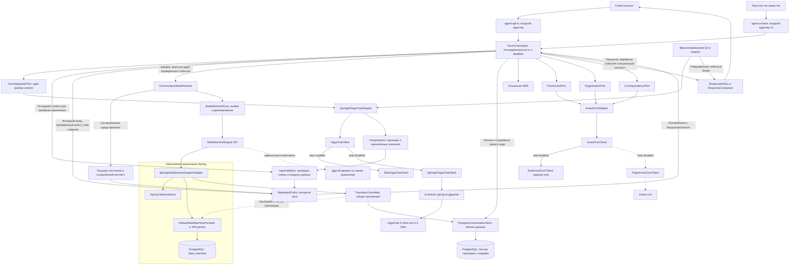

# Целевая архитектура

**Уточнение P1.02 r4 (28.09.2026):** epkId — организация в едином профиле клиента, digitalUserId — пользователь; requestId — обязательный ID входного запроса. additionalInfo необязателен (можно []), содержит уникальные строковые key/value; paymentId — необязательная произвольная строка, сейчас только передаётся без обработки/привязки. Идемпотентность входа принадлежит существующей внешней библиотеке @Idempotent; в P1.02 только временный маркер без поведения. Собственный механизм входной дедупликации не разрабатывается. Платёжный контекст описанных ниже будущих workflow уточняется в их design и не реализуется в P1.02. Документация OpenAPI, интерфейсов/методов и DTO/полей — краткая, на русском; generated использует стандартные описания из OpenAPI.

**Режим БД для MVP:** по [ADR-003](../adr/0003-h2-persistence-and-runtime.md) DB-тесты и локальный запуск с профилем h2 используют H2 с настоящей persistence. Упоминания PostgreSQL ниже описывают PostgreSQL-вариант; границы компонентов и транзакций сохраняются для H2.

Связанные документы: [состав комплекта](./README.md), [модули и пакеты](./modules.md), [машина состояний](./state-machine.md), [интеграции](./integrations.md), [исполнение и проверки](./execution.md).

## 1. Архитектурное решение

Агент — одно модульное Spring Boot-приложение. Оно принимает сообщение `{epkId, digitalUserId, requestId, sessionId, content}` с дополнительным `action_code` при нажатии саджеста, проверяет привязку пользователя к сессии, загружает состояние из PostgreSQL и один раз вызывает GigaChat для классификации и структурирования текста. Затем приложение формирует событие, применяет его через собственный интерфейс машины состояний и возвращает `{sessionId, content, suggestions}`. Ошибки входной проверки, доступа или занятая сессия отклоняются до LLM.

Саджест «Статус» передаёт `action_code="REQUEST_STATUS"`, `content="Статус"` и проходит общий разбор текста через LLM. «Да», «Нет» и другие короткие реплики тоже разбираются моделью. Код саджеста — отдельный проверяемый факт для `StateInputPolicy`, а не событие FSM; LLM его не генерирует. Массив `suggestions` содержит `guid`, `action_code`, `text` и определяется приложением по текущему состоянию. При отсутствии предложений возвращается `[]`. Контракт и ограничения описаны в [integrations.md](./integrations.md#0-входящий-контракт-чата).

Для текущего сценария сессия заранее связана на сервере с пользователем, организацией и конкретным платежом; локально эту привязку создаёт тестовый fixture через сервисный слой. Поля сообщения и код саджеста сами по себе не задают платёж и не доказывают идентификацию. Если доверенной привязки нет, обработка операции не начинается. Входной `sessionId` разрешается в пространстве аутентифицированного канала, digitalUserId сверяется с владельцем сессии, epkId — с организацией.

Первая реализация движка — **Spring Statemachine вместе с его встроенной JPA-персистентностью**. Приложение взаимодействует с ним через `ConversationStateMachine`, реализованный тонким `StateMachineProxy`. За `StateMachineEngine` SPI находится целая реализация: переходы, сохранение, восстановление и формат checkpoint. Proxy выбирает реализацию и делегирует вызов; собственной таблицы состояния FSM у него нет.

`SpringStateMachineEngineAdapter` содержит SSM и `DefaultStateMachinePersister`, работающий через `JpaRepositoryStateMachinePersist` с PostgreSQL. При смене движка заменяется весь этот комплект. Контекст платежа, черновик, подтверждение и реестр отправок хранятся отдельно как данные приложения. Их атомарное изменение вместе с checkpoint обеспечивается общей транзакцией, описанной в [state-machine.md](./state-machine.md).

**Следующий шаг определяет приложение.** LLM извлекает признаки реплики, упоминания операций, значения полей и кандидаты разделов БЗ. Она не возвращает событие FSM, следующее состояние, команду сервиса или готовую инструкцию пользователю о дальнейшем ходе.

**Сведения о платеже и результаты исполнения заявок доставляет банковский контур SMS с номера 900 на личный телефон клиента.** Агент получает подтверждение выбранного действия и сообщает о направлении информации по SMS после приёма запроса. Он не возвращает банковский статус в чат, не отправляет SMS самостоятельно и не ждёт их доставки. Данные платежа/организации остаются внутренним контекстом подготовки. Подтверждение описывает выбранное действие и канал ответа, а не показывает фактический банковский результат. Полный пример приведён в [workflow-status.md](./workflow-status.md).

### 1.1. Как из входных данных получается событие

```text
текущее состояние + сохранённый контекст этого состояния
    + исходный вход + проверенные данные разбора LLM
        → алгоритм StateInputPolicy
            → DomainEvent + ResponseDirective
                → таблица переходов FSM и guards
                    → новое либо прежнее состояние + обновлённый контекст
                        → ResponsePolicy / ResponseComposer → ответ пользователю
```

`StateInputPolicy` — детерминированный Java-код. Он учитывает тип активной операции, черновик и его версию, результат ФЛК, сводку, к которой относится запрос согласия, последний вопрос агента, полномочия и доверенные данные платежа. `ResponseDirective` обозначает цель ответа, например уточнение, справку или сообщение о приёме запроса; окончательный текст формируется приложением после обработки события и необходимых внутренних шагов. Код следующего состояния не поступает от LLM: его определяет конфигурация FSM с проверенными guards.

Одинаковые данные модели могут породить разные события в разных состояниях. Например, новое назначение платежа в `AWAITING_DETAILS` даёт `INPUT_DETAILS`, а в `AWAITING_CONFIRM` операции `details` — `CHANGE_DETAILS`. В операции `status` такое значение не изменяет платёж. Вопрос или невалидный ввод могут оставить состояние прежним. Алгоритм и примеры приведены в [описании обработки входа](./state-machine.md#11-формирование-события-приложением).

## 2. Компонентная диаграмма



Три доменных порта Invest corr не означают три микросервиса. Это три ответственности одного внешнего контура; у них могут отличаться результаты, ошибки и правила повторов. `InvestCorrAdapter` — единая точка преобразования внешних DTO в доменные типы.

На схеме показаны альтернативы исходящих клиентов, а не одновременно работающие ветви. По [ADR-001](../adr/0001-outbound-clients-and-stubs.md) у каждого out-клиента есть stub; `integrations.<integration>.stub` выбирает ровно одну реализацию. Реальная ветвь GigaChat проходит через `SpringAiGigaChatClient` и библиотеку, остальные HTTP-интеграции — через Feign. Включённый stub не запускает реальный клиент/OAuth; fallback на заглушку при ошибке реального вызова отсутствует.

На диаграмме показаны две группы таблиц **одной PostgreSQL**, использующие один `DataSource`, `EntityManagerFactory` и `JpaTransactionManager`. Это разделение владения данными, без распределённой транзакции. `TransitionCommitter` не знает формат checkpoint: адаптер передаёт ему действие сохранения своим persister. Бизнес-данные при этом изменяются через общий store.

На первом этапе реальных вызовов банковского контура нет: `InvestCorrClient` реализован заглушкой. Подключение настоящего corr меняет реализацию клиента и mapping контракта, сохраняя оркестратор, FSM и бизнес-тесты.

## 3. Технологический стек и совместимость

| Область | Целевой выбор |
|---|---|
| Язык и runtime | Java 21; обычные records/enums/sealed types без preview-функций |
| Приложение | Spring Boot **3.5.x**, Spring MVC, Spring Framework 6.2; virtual threads при подтверждённой пользе |
| FSM | `org.springframework.statemachine:spring-statemachine-core:4.0.2` и `spring-statemachine-data-jpa:4.0.2` внутри адаптера |
| LLM framework | Spring AI **1.1.x**, согласованный с выбранным patch GigaChat starter |
| GigaChat | `chat.giga:spring-ai-starter-model-gigachat` **1.1.x** из `ai-forever/spring-ai-gigachat` |
| Хранение | PostgreSQL, Spring Data JPA, `JpaTransactionManager`, Liquibase с XML changelog по ADR-002; встроенный JPA persister для FSM |
| JSON | Jackson из согласованного BOM; явные DTO и локальная проверка схемы |
| Внешние контракты | OpenAPI Generator Maven Plugin; генерация API/DTO внутри соответствующей интеграции |
| Исходящий HTTP | Spring Cloud OpenFeign; BOM совместимый с Boot 3.5.x фиксируется на P1.01. GigaChat — исключение по ADR-001 |
| Преобразование моделей | MapStruct; mapper принадлежит интеграции либо адаптеру БД |
| Наблюдаемость | Actuator, Micrometer, OpenTelemetry, журналы переходов |
| Проверки | JUnit, AssertJ, H2 с настоящей persistence по ADR-003, WireMock и необходимые проверки поведения MVP; без ArchUnit |

**Почему здесь Boot 3.5:** Spring Statemachine 4.0.2 опубликован с обновлением до Boot 3.5.15. Репозиторий GigaChat разделяет линейки: 1.1.x для Boot 3.4/3.5 и Spring AI 1.x; 2.x для Boot 4 и Spring AI 2.x. Поэтому объединять выбранный FSM с последним starter 2.x без отдельной проверки не следует. [Релизы Spring Statemachine](https://github.com/spring-attic/spring-statemachine/releases), [матрица GigaChat starter](https://github.com/ai-forever/spring-ai-gigachat#совместимость-версий-и-ветки).

Воспроизводимая **исходная комбинация для технического прототипа**: Java 21, Boot 3.5.15, Statemachine 4.0.2, GigaChat starter 1.1.2, Spring AI 1.1.2. У GigaChat 1.1.2 в POM указаны Boot 3.5.10 и AI 1.1.2; объединение с более новым Boot patch должно пройти smoke-тест и проверку дерева зависимостей. Это кандидат, подтверждённый документацией компонентов, а не уже собранная и проверенная конфигурация нашего проекта. Для промышленной сборки фиксируются проверенные patches соответствующих линеек. [POM GigaChat 1.1.2](https://github.com/ai-forever/spring-ai-gigachat/blob/v1.1.2/pom.xml).

Spring Statemachine архивирован; используем его по выбранному заказчиком решению. Архитектурная мера — изоляция движка вместе с его хранением, явный порядок миграции сессий и общие контрактные тесты движков. Ветка GigaChat 1.1.x находится в ограниченном сопровождении, что также учитывается при выборе patches. Переход на Boot 4 является отдельным техническим обновлением, а не автоматическим эффектом смены зависимости. [Статус FSM](https://github.com/spring-attic/spring-statemachine), [правила веток GigaChat](https://github.com/ai-forever/spring-ai-gigachat#совместимость-версий-и-ветки).

## 4. Ответственность компонентов

| Компонент | Отвечает за | Не передаётся модели |
|---|---|---|
| `AgentController` / входной mapper | Идентификация канала, проверка привязки к пользователю/платежу, DTO | Доверие к произвольным epkId/digitalUserId из тела запроса |
| `TurnOrchestrator` | Один ход, deadline, вызовы эффектов и интерпретации | Планирование банковского процесса |
| `InputValidator` / `StateInputPolicy` | Проверка входа и результатов разбора; формирование события по состоянию, контексту и правилам | Выбор события, следующего шага и права на отправку |
| `StateMachineProxy` | Выбор зарегистрированного движка для сессии, делегирование и общая телеметрия | Выбор итогового банковского состояния |
| `SpringStateMachineEngineAdapter` | Переходы, чистые guards/actions, встроенный persister, restore и техническая схема FSM | Прямые HTTP/SQL-вызовы из actions |
| `TransitionCommitter` | Версии и токен исполнения; общая транзакция для native checkpoint, доменных изменений и журнала | Решение о бизнес-переходе |
| `DomainPolicy` / `FlkValidator` | Подтверждение, сброс, ограничения доступа, проверки полей | Решение о полномочиях и корректности банковских данных |
| `PostgresConversationStore` | Контекст, черновик, receipts, журнал отправки; без сериализации FSM | История чата как источник подтверждения |
| `InvestCorrAdapter` | Полномочия, организация, три типа запросов; mapping результатов | Право модели вызвать эти сервисы как tools |
| `SpringAiGigaChatAdapter` | Один результат извлечения признаков/значений и кандидатов разделов БЗ | События FSM, next state, готовые команды и ответы о ходе процесса |
| `ResponsePolicy` / `ResponseComposer` | Цель ответа, текст и suggestions по достигнутому состоянию, контексту и результату; утверждённая справка | Выбор следующего вопроса, саджестов и обещание результата операции |

## 5. Модули приложения

Это **Maven multi-module проект** с одним запускаемым Spring Boot artifact `agent-main`. Корневой POM — parent/aggregator с `packaging=pom`. Имена модулей, пакеты, зависимости и примеры генерации определены в [modules.md](./modules.md).

| Модуль | Назначение |
|---|---|
| `agent-api-in` | Входящие интеграции; пакет каждой интеграции `ru.sberbank.pprb.agent.<integration>.*` |
| `agent-api-out` | Исходящие интеграции: Invest corr, GigaChat; отдельные пакеты с одинаковой внутренней структурой |
| `agent-common` | Общие технические константы, исключения, утилиты и настройки mapping |
| `agent-db` | Публичный API доступа к БД, конфигурация, repositories, транзакции, миграции, database mappers; SPI и персистентная реализация FSM |
| `agent-main` | Стартовый класс и главная конфигурация сервиса, сборка реализаций и профили |
| `agent-model` | Доменные enum, DTO, value objects и entity; JPA entity изолированы в отдельном пакете |
| `agent-service` | Вся доменная/прикладная логика, use cases, интеграционные порты, политики, оркестратор, proxy FSM и правила переходов; единственный прикладной вызывающий слой для БД |
| `agent-ui-back` | Backend простого тестового чата; отдельный входной адаптер к тем же use cases |

Для каждой входящей и исходящей интеграции предусмотрены `client`, `dto`, `exception`, `mapper`, `service`, `utils`, при необходимости `config` и `controller`. Внешние DTO генерируются из OpenAPI либо описываются вручную в `dto` этой интеграции. В `agent-service` поступают собственные доменные типы после MapStruct mapping и валидации; внешние DTO и JPA entity не являются контрактами бизнес-сервисов.

**`agent-service` зависит от `agent-db` и обращается к его публичному API. Только сервисный слой инициирует прикладную работу с БД.** `agent-db` зависит от `agent-model`/`agent-common` и не зависит от `agent-service`. Входящие, исходящие и UI-адаптеры используют контракты `agent-service`; прямой доступ к БД для них запрещён, даже если типы БД доступны транзитивно. `agent-main` подключает конфигурации и реализации, но не читает/изменяет прикладные данные. Владение пакетом закреплено за одним Maven-модулем.

`StateMachineProxy` находится в `agent-service`, а `StateMachineEngine` SPI — в `agent-db.api`. Весь Spring-специфичный комплект — `SpringStateMachineEngineAdapter`, factory, persister, serializer и native repositories — остаётся за этим SPI в `agent-db`, в пакете `ru.sberbank.pprb.agent.db.fsm.spring`. Движок и его хранение по-прежнему заменяются вместе. `ConversationStore`, `TransitionCommitter` и `EngineCheckpointWrite` также объявлены в `agent-db.api`, их реализации находятся в `agent-db`.

Бизнес-описание переходов и политики остаются в `agent-service`: сервис передаёт `FlowDefinition` из `agent-model` и реализацию чистого callback-контракта `FlowPolicy`, объявленного в `agent-db.api`. БД-модуль знает только этот интерфейс и доменные типы, без импорта сервисных классов. Так сохраняются правила в сервисах и отсутствие обратной compile-зависимости.

JPA entity приложения размещаются в `agent-model`, пакет `ru.sberbank.pprb.agent.model.entity.persistence`; работа с ними разрешена только адаптеру БД. Это осознанная изоляция на уровне пакетов внутри общего model-модуля. ArchUnit контролирует её, а также отсутствие Spring Statemachine вне `.db.fsm.spring..` и Spring AI/GigaChat вне исходящей интеграции `gigachat`.

Пример **наших** параметров конфигурации; это не свойства сторонних библиотек:

```yaml
agent:
  state-machine:
    default-engine: spring-statemachine
    flow-definition-version: payment-correspondence-v1
    spring:
      persistence: jpa-explicit
  persistence:
    mode: postgresql
  llm:
    model-id: "${GIGACHAT_MODEL_ID:}"
    max-generations-per-turn: 1
  deadline:
    turn: 9s
integrations:
  invest-corr:
    stub: "enabled"
    url: "${INVEST_CORR_URL:}"
  gigachat:
    stub: "enabled"
    url: "${GIGACHAT_URL:}"
```

Это автономный режим прототипа. При `integrations.gigachat.stub=disabled` обязательны разрешённый Ultra model ID, реальный URL и параметры доступа; пустые placeholders не считаются рабочей реальной конфигурацией. Выбор stub хранится только в корневом `integrations`, без второго флага `agent.llm.mode` или `agent.integrations.*.mode`.

Выбор движка для новых сессий делается конфигурацией приложения, не входным параметром пользователя. Для существующей сессии реализация закреплена в `machine_binding`. Неизвестная реализация или несовместимая версия checkpoint приводят к отказу старта/обработки, а не к созданию пустой сессии. Переключение default не мигрирует уже сохранённые машины.

Схема PostgreSQL создаётся и обновляется только Liquibase XML из `agent-db/src/main/resources/db/changelog`; `spring.liquibase.change-log` указывает на XML master, Hibernate проверяет mapping через `ddl-auto=validate`. Native схема SSM выделена в собственные XML changeset внутри того же контура миграций. [ADR-002](../adr/0002-liquibase-xml.md).

## 6. Общие правила

1. У сессии есть исходный платёж, пользовательский `digitalUserId` и организационный `epkId`, доверенная привязка к организации и результат обогащения её наименованием. Отмена/смена операции не удаляет эти сведения.
2. Пользовательский черновик, результат ФЛК и подтверждение принадлежат конкретной операции и версии; при сбросе очищаются.
3. `status` — создание через corr запроса на получение информации по SMS с номера 900. Статус платежа не возвращается в чат. Для этой операции не выполняется специальная проверка полномочий сценария; обогащение названия организации — отдельное чтение внутреннего контекста.
4. Для `recall` и `details` разрешение получается через `PermissionPort`, реализованный Invest corr. Бизнес-отказ блокирует обе операции в текущем диалоге по платежу; техническая ошибка не превращается в отказ в полномочиях.
5. Текст первоначального саджеста классифицирует LLM. После Java-проверок он запускает подготовку, но не является подтверждением отправки; согласие приходит отдельной репликой.
6. Вопрос по БЗ сохраняет шаг. Для разбора модель получает минимальный актуальный контекст и БЗ; отменённый черновик из полной ChatMemory не используется. Справку и напоминание текущего шага формирует приложение.
7. Одновременно обрабатывается одно сообщение сессии. Следующая отмена не прерывает текущий вызов.
8. База состояния реальная уже на первом этапе. Заглушки corr не заменяют persistence (H2 в тестах и локальном профиле по ADR-003) и не маскируют ошибки commit.
9. Реестр отправки фиксируется до обращения к corr. Повторы одной отправки используют прежний ключ и payload. Внутренний `turnId` и стабильный `action_code` не обеспечивают дедупликацию входной доставки; GUID саджеста в запросе не возвращается.
10. Неизвестный результат фиксируется как `SUBMIT_UNKNOWN`; поддержка Q-05 ограничивается сохранением фактов и возвратом ошибки.
11. После `ACCEPTED` ответ сообщает о будущем получении информации по SMS. Состояний ожидания/доставки SMS в FSM агента нет; `COMPLETED` не означает, что SMS уже отправлено или доставлено. Правило SMS относится также к результатам исполнения запросов `recall` и `details`.

## 7. Модель развёртывания

Первый автономный контур: `agent-main` с профилем `h2` и настоящей persistence по ADR-003 + включённые клиентские stub Invest corr и GigaChat. Для проверки модели переключается только `integrations.gigachat.stub=disabled`: тот же адаптер вызывает Ultra через выбранный starter. Пока нет интеграции с ГигаАссистентом, простой чат использует `agent-ui-back` и тот же `ConversationUseCase`, что будущий `agent-api-in`. Backend и страница тестового чата включаются в локальном/тестовом профиле. CI не требует credentials; успешные stub-тесты не заменяют оценку настоящей модели, выделенную в P1.13 и расширяемую на P2.04/P3.04.

Промышленный контур использует те же компоненты приложения и внешний corr через HTTP-клиент. При нескольких репликах право обработки и версии состояния контролируются PostgreSQL, а не sticky sessions или singleton-машиной в JVM. Kafka, Redis и векторная БД для текущего объёма не требуются.
