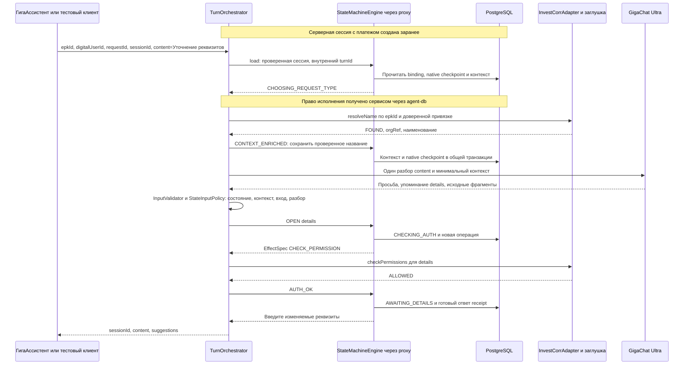
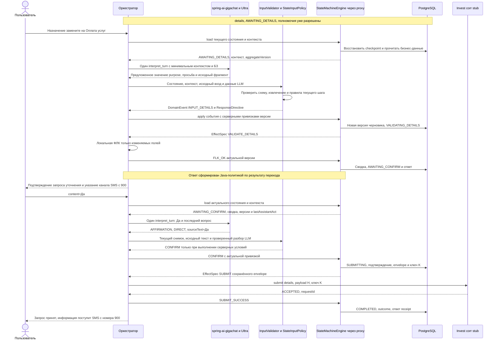

# Обработка сообщений, временной бюджет и этапы реализации

**Уточнение P1.02 r4 (28.09.2026):** epkId — организация в едином профиле клиента, digitalUserId — пользователь; requestId — обязательный ID входного запроса. additionalInfo необязателен (можно []), содержит уникальные строковые key/value; paymentId — необязательная произвольная строка, сейчас только передаётся без обработки/привязки. Идемпотентность входа принадлежит существующей внешней библиотеке @Idempotent; в P1.02 только временный маркер без поведения. Собственный механизм входной дедупликации не разрабатывается. Платёжный контекст описанных ниже будущих workflow уточняется в их design и не реализуется в P1.02. Документация OpenAPI, интерфейсов/методов и DTO/полей — краткая, на русском; generated использует стандартные описания из OpenAPI.

**Режим БД для MVP:** по [ADR-003](../adr/0003-h2-persistence-and-runtime.md) DB-тесты и локальный запуск с профилем h2 используют H2 с настоящей persistence. Упоминания PostgreSQL ниже описывают PostgreSQL-вариант; границы компонентов и транзакций сохраняются для H2.

Связанные документы: [архитектура](./architecture.md), [модули и тестовый UI](./modules.md), [FSM и хранение](./state-machine.md), [внешние контракты и заглушки](./integrations.md).

Сквозной пример `status` с JSON приведён в [workflow-status.md](./workflow-status.md). Банковская информация о платеже и исполнении заявок поступает клиенту SMS с номера 900 на личный телефон. В чат возвращаются подтверждение выбранного действия, сообщение о приёме запроса/канале ответа либо техническая ошибка; агент не показывает банковский статус и не отслеживает доставку SMS.

## 1. Вход в сценарий

Вход содержит `epkId`, `digitalUserId`, `requestId`, `sessionId`, `content` и `action_code` при нажатии саджеста. Саджест «Статус» передаёт `REQUEST_STATUS` и текст «Статус»; классификацию текста выполняет LLM, код отдельно проверяет приложение. «Отзыв» и «Уточнение реквизитов» обрабатываются тем же способом. До запуска новой операции проверяются сохранённый исходный платёж, `epkId`, идентификация и организационная привязка. Если результата lookup организации ещё нет, он получается через Invest corr и сохраняется в контексте. Отсутствие доверенной платёжной привязки не компенсируется данными LLM или кодом саджеста.

Входной адаптер ГигаАссистента находится в `agent-api-in`; до его подключения простой чат обращается к `agent-ui-back`. Оба вызывают один `ConversationUseCase` из `agent-service`. UI получает исходный контекст через серверные тестовые fixtures; бизнес-валидация, FSM, интеграции и deadline общие. UI не обращается к репозиториям и клиентам внешних сервисов напрямую.

На диаграммах вызов `StateMachineEngine` проходит через тонкий proxy. Сохранение выполняет адаптер движка: встроенный JPA persister пишет checkpoint, общий `TransitionCommitter` координирует его с бизнес-данными в одной транзакции PostgreSQL.

`CONTEXT_ENRICHED` — техническое внутреннее событие обновления фактов, без смены пользовательского шага. Оно проходит общую версионность, чтобы обновление контекста не обходило commit-протокол. Первоначальная загрузка названия не требует отдельного сообщения пользователя и не создаёт дополнительного LLM-вызова.

Для распознанного и проверенного `status` после обогащения формируется внутренняя сводка и вопрос согласия, минуя `CHECKING_AUTH`. Для `recall` вопрос согласия формируется после разрешения. Банковские сведения внутренней сводки в чат не выводятся. При отказе в полномочиях остаются статус и справка. При ошибке обогащения организация не угадывается, операция не запускается.

## 2. Ввод реквизитов и отправка

Любое текстовое подтверждение, включая «Да», требует одного LLM-вызова для разбора речи. `CONFIRM` формирует приложение после проверки состояния, контекста, версий и отсутствия сопутствующего изменения/вопроса. Итоговый текст строится Java-кодом. Название организации и платёжная привязка берутся из сохранённой внутренней сводки, не из LLM и не из нового lookup после подтверждения; банковские сведения и результаты исполнения в чат не выводятся.

## 3. Поведение на типовых репликах

| Вход | Действие | Сохраняемое состояние |
|---|---|---|
| «Какие поля можно уточнить?» при подтверждении | Модель выделяет вопрос и разделы БЗ; приложение создаёт `QUESTION`, формирует справку и напоминание | Та же операция, черновик и версия сводки |
| «Да, но назначение замените…» | Обработать изменение, ФЛК и новую сводку | Старое подтверждение недействительно |
| «Да» после вопроса о значении поля | Ответ на уточнение, а не согласие на отправку | Определяется `lastAssistantAct` |
| «А если я скажу нет?» | Вопрос | Не отменять по отдельному слову |
| «Нет, передумал» | Reset подготовки | Исходный платёж, epkId и организация сохраняются |
| «Нет, лучше статус» | Reset и новая операция status в том же ходе | Отменённые уточнения не переносятся |
| Повторное «Да» после `COMPLETED` | LLM разбирает согласие; Java возвращает сообщение о прежнем приёме | Нет новой операции/отправки |
| Тот же текст новым HTTP-запросом | Новый `turnId`, LLM и проверка текущего состояния; это может быть новая реплика | Повторы requestId относятся к внешней библиотеке; временный маркер не выполняет дедупликацию |
| «Отмена» после приёма corr | Сообщить текущий исход; не отменять принятый запрос задним числом | `COMPLETED` |
| Команда после неизвестного результата | Не создавать неподтверждённый переход из Q-05; справка доступна | `SUBMIT_UNKNOWN` |

Подтверждение передаётся свободным текстом либо кликом с `action_code=CONFIRM_REQUEST`, `content="Да"`. Оба пути проходят LLM, `InputValidator`, `StateInputPolicy` и guards FSM. При клике код, текст, актуальные предложения и разбор должны согласоваться. Ни код, ни признак согласия, ни высокая уверенность модели сами по себе не создают `CONFIRM`; неоднозначность исключает отправку. Первоначальное «Статус» подтверждением не является. GUID из ответа клиент не возвращает, поэтому актуальность согласия по-прежнему опирается на последовательность канала и последний вопрос.

## 4. Дедлайны и лимит 10 секунд

Измеряется полный ответ на **одно сообщение**, а не время до первого токена. Проектный предел агента — **9 секунд**, ещё 1 секунда резервируется суммарно для канала доставки. Граница отсчёта и транспортный резерв подтверждаются в Q-08. Очередь/admission входит в измерение.

Один LLM-вызов занимает ориентировочно 3–5 секунд. Два последовательных уже могут занять 10 секунд без БД и corr; поэтому `maxGenerationsPerTurn=1` проверяется фактическими вызовами. Каждый обычный ход, включая саджест и согласие, использует одну генерацию; на два пользовательских сообщения приходится две генерации с раздельными deadline. Внутренние события lookup/полномочий/ФЛК/corr новых вызовов LLM не создают. Запросы подтверждения, справка, ошибки и сообщения о приёме строятся приложением.

### 4.1. Бюджеты по маршрутам

Локальные действия включают admission, чтение/запись PostgreSQL, восстановление и переходы FSM, mapping и ответ. Для расчёта ниже им выделено суммарно до 0,9 с; ФЛК показана отдельно. Это проверяемые настройки прототипа, а не измерения.

| Маршрут | LLM, с | Внешние действия, с | Локальные действия, с | Расчётная сумма, с |
|---|---:|---:|---:|---:|
| Первоначальное «Статус» | 5,0 | Lookup организации 0,8 | 0,9 | 6,7 |
| Первоначальное «Отзыв» / «Уточнение реквизитов» | 5,0 | Организация 0,8 + полномочия с повтором 1,9 | 0,9 | 8,6 |
| Ввод/исправление реквизитов | 5,0 | 0 | 0,9 + ФЛК 0,15 | 6,05 |
| Справочный вопрос | 5,0 | 0 | 0,9 | 5,9 |
| Смена на recall/details свободным текстом | 5,0 | Полномочия 1,9 | 0,9 | 7,8 |
| Подтверждение «Да» или другой однозначной фразой | 5,0 | Отправка corr с допустимыми повторами до 2,0 | 0,9 | 7,9 |

Все маршруты оставляют резерв до внутреннего предела 9 с; у первоначального recall/details он всего 0,4 с, поэтому этот путь особенно важен для нагрузочной проверки. Начиная со второго хода организация уже сохранена; повторный lookup на каждый ход запрещён. Потеря обязательной организационной привязки — ошибка целостности контекста, а не повод добавить скрытый вызов в уже исчерпанный бюджет.

### 4.2. Политики повторов

| Действие | Политика |
|---|---|
| GigaChat generation | Одна попытка, общий timeout до 5 с; без смены модели и JSON-repair |
| Lookup организации | По умолчанию одна попытка до 0,8 с; новая проектная политика |
| Полномочия | Первая попытка + один технический повтор; пример 0,9 + 0,1 backoff + 0,9 с |
| Локальная ФЛК | Один повтор при техническом исключении; ошибки значений не повторяются автоматически |
| Submit corr | Конечная конфигурируемая политика, один ключ и payload; до 2 с суммарно после разбора подтверждения, с учётом остатка deadline |
| FSM/SQL conflict | Без слепого повторного исполнения эффекта; перечитать сохранённый результат команды и проверить владение |

Для corr число попыток не зашито как «ровно две»: например, в текстовом пути могут помещаться две по 0,85 с с паузой 0,1 с. Другие настройки допустимы, если их пределы вместе с финальным commit укладываются в deadline. До первой проверки полномочий резервируется время обеих разрешённых попыток.

`Deadline` передаётся всем адаптерам. Локальный остаток считается монотонными часами. Перед каждой попыткой проверяется время на сам вызов и обязательное завершение. Тайм-аут Future не доказывает прекращение HTTP: транспорт также ограничивается, а запоздалые результаты проверяют токен и версию. Повтор после уже возвращённой ошибки не переносится в фон.

Если запрос corr достоверно ещё не начинался, исчерпание времени даёт техническое «не отправлено». Если он мог начаться, исход может быть `UNCERTAIN`. Контролируемые ошибки при недоступной зависимости укладываются в срок при работоспособном канале, но не являются успешной банковской операцией. p95/p99 измеряются отдельно; требование «не более 10 секунд» не заменяется только средним временем.

## 5. Последовательность и конкуренция

Одна сессия имеет не более одного выполняющегося пользовательского сообщения. Каждый принятый HTTP-вход получает внутренний `turnId`; requestId передаётся для внешней библиотеки @Idempotent, а turnId не заменяет его. Внутренние события полномочий/ФЛК/corr относятся к тому же `turnId`, `executionToken` и deadline. Повтор внутренней команды и повтор отправки одной операции защищены собственными ключами. Параллельность применяется между независимыми диалогами.

ГигаАссистент должен получить и показать ответ до отправки следующего хода и не выполнять автоматический повтор после неизвестного исхода доставки. Вход в занятую сессию отклоняется; ожидание произвольной очереди не входит в обещаемый сценарий. Режим до подключения библиотеки и дальнейший контракт её использования проверяются при интеграции; см. [integrations.md](./integrations.md#03-порядок-и-повторы-сообщений). Отмена не получает право прервать текущий corr-вызов.

Virtual threads упрощают ожидание I/O, но не снимают ограничения квот Ultra и пула PostgreSQL. На LLM устанавливается ограниченный bulkhead без длинной очереди. Саджесты используют тот же ресурс генерации; при перегрузке возвращается быстрый технический ответ, а не локально распознанная команда. Параллельные ветви внутри одного сообщения на первом этапе не нужны.

## 6. Ошибки и наблюдаемость

| Событие | Сохраняемый факт и ответ |
|---|---|
| LLM недоступна/ответ невалиден | Подготовка сохраняется, уточнение или техническое сообщение |
| Организация не определена | Исходный доверенный контекст сохраняется, новая операция не запущена |
| Отказ полномочий | `statusOnly=true`, доступны статус и справка |
| Две технические ошибки полномочий/ФЛК | `FAILED`, пользовательские уточнения очищены, исходный контекст сохранён |
| Corr принял | `COMPLETED`, сообщение о приёме запроса, не об исполненном отзыве/изменении |
| Corr не вернул достоверный исход после retries | `SUBMIT_UNKNOWN`, ошибка без обещания сверки или новой отправки |
| DB не подтвердила commit перед отправкой | Corr не вызывается, пока не установлен факт сохранённого envelope |

Временные метрики: полный turn, LLM, lookup организации, полномочия, corr, SQL и переходы FSM. Дополнительно: число генераций на ход, попытки зависимостей, конфликты версии, дубликаты, неизвестные отправки, причина завершения retry, версия prompt/БЗ/flow/model и частота невалидного разбора.

В обычные логи не пишутся ключи авторизации, полный prompt, полные реквизиты и идентификаторы пользователя и организации. Correlation ID находится в трассе, но не в высококардинальных labels метрик. Раздельно измеряются время ответа и доля полезных/успешных исходов: быстрый технический отказ не улучшает показатель успешности.

## 7. Этапы реализации

Общий процесс и точка продолжения находятся в [docs/plan/plans.md](../plan/plans.md). WBS разделена на [phase1 — status и платформу](../plan/plan_phase1.md), [phase2 — recall](../plan/plan_phase2.md), [phase3 — details](../plan/plan_phase3.md): всего 22 шага. Статусы ведутся только в фазовых планах.

Каждый шаг сначала проходит design: архитектор создаёт папку `phaseN_stepNN`, подробный design.md и checkpoints task.md, записывает вопросы/варианты и останавливается. После ответов пользователя документы уточняются и снова предъявляются на согласование. Принятая ревизия и отдельная команда implement разрешают запуск разработчика. Он пишет тесты по AC до кода, фиксирует RED/GREEN, выполняет необходимые integration/e2e и регрессию. После обязательных тестов обновляет task и корневой history.md, выставляет `Implement на проверке` и останавливается. Только пользователь принимает шаг и отдельно запускает следующий.

Обязателен [ADR-001](../adr/0001-outbound-clients-and-stubs.md): любой out-клиент имеет stub, выбираемый `integrations.<integration>.stub=enabled/disabled`; адрес задаётся в `.url`. Реальный HTTP-транспорт — Feign, кроме GigaChat через выбранную библиотеку. В WBS отдельно проверяются автономный режим, HTTP-контракты и настоящая Ultra.

По [ADR-002](../adr/0002-liquibase-xml.md) все миграции — Liquibase XML; H2-тесты persistence по ADR-003 используют ту же цепочку changelog. Подмена миграций Hibernate-автогенерацией не считается проверкой схемы.

Одновременно реализовывать альтернативный движок не требуется. На первом этапе достаточно Spring Statemachine и тестовой реализации SPI для проверки изоляции.

## 8. Критерии готовности

- У каждого шага есть согласованная ревизия design/task и отдельное разрешение implement. В task сохранены AC → тесты, свидетельства RED/GREEN, обязательные unit/integration/e2e по применимости и регрессия. Не запущенный обязательный тест не считается успешным.
- Миграции выполнены Liquibase XML; пустая база, повторный запуск и upgrade с предыдущей принятой версии проверены на H2 с настоящей persistence по ADR-003. Изменения и решения сохранены в корневом history.md; готовность к проверке отделена от приёмки пользователем.

- M-01–M-19, D-01–D-10, S-01–S-10 из БТ проверены, кроме явно отложенных бизнес-переходов Q-05. Приёмка опирается на AC-01–AC-30.
- Структура и compile-зависимости соответствуют [modules.md](./modules.md). Бизнес-код использует доменные модели/порты; внешние DTO и JPA entity не попадают в его сигнатуры. Проверены OpenAPI generation и MapStruct mapping на чистой сборке.
- Для каждого out-клиента реализованы stub и реальная ветвь, а `integrations.<integration>.stub` выбирает ровно одну. В stub-режиме нет сети/OAuth; при отключении используется `.url`. Corr и следующие HTTP-интеграции вызываются через Feign, GigaChat — через библиотеку; автоматический fallback на stub отсутствует.
- `agent-service` зависит от `agent-db`, обратная зависимость отсутствует. Прямые прикладные вызовы API БД разрешены только сервисному слою; входящие/исходящие интеграции и UI не получают repositories, persister, DataSource или доступ к `.db.api` в обход сервисов.
- Тестовый UI вызывает те же use cases, передаёт `epkId`, `digitalUserId`, `requestId`, `sessionId`, `content` и `action_code` при клике; рендерит `suggestions` и соблюдает последовательность. Код саджеста не принимается за служебное событие FSM. Production-профиль не публикует тестовые endpoints и страницу.
- После рестарта встроенный persister восстанавливает native checkpoint из PostgreSQL; отдельно загружаются тот же черновик/сводка. Restore не вызывает LLM, corr или повторные внешние entry effects.
- В коде приложения за пределами адаптера отсутствуют зависимости от SSM, включая native persister, JPA entity и сериализатор. Контрактные тесты `StateMachineEngine` проверяют initialize/load/apply, сохранение и восстановление каждой реализации.
- Смена `default-engine` влияет только на новые сессии. Существующий binding направляет запрос старому движку; неизвестный binding/несовместимый checkpoint не создаёт пустое состояние.
- Отмена/смена сохраняет исходный платёж, `epkId`, организацию и запрет операций, очищая уточнения и согласие.
- Lookup организации проверяет неоднозначность, отсутствие и неверную привязку. Имя не подставляется моделью.
- Повтор подтверждения на другой реплике не создаёт второй ключ. При `ACCEPT_THEN_TIMEOUT` stub хранит один приём и возвращает прежний request ID при допустимом повторе.
- При `ACCEPT_THEN_ALWAYS_TIMEOUT` сохраняется один приём, агент возвращает ошибку и `SUBMIT_UNKNOWN`; фоновых повторов нет.
- Сбой native persist, сериализации либо commit между checkpoint, draft и submission откатывает все записи. Тест читает данные новым persistence context после rollback. Отдельно проверены потеря ответа commit и финальный commit перед потерей HTTP-ответа каналу.
- Native JPA persister и доменные repositories фактически участвуют в одной транзакции. Проверены два конкурирующих исполнителя с одинаковой версией, fencing и сбой после записи checkpoint до записи submission; проигравший не вызывает corr.
- Контрактный тест starter подтверждает одну фактическую генерацию, отключённые internal tools/retries и полный timeout, включая авторизацию/транспорт.
- Для «Статус», «Да» и «Нет» нет локального обхода LLM. При ошибке разбора отправка не выполняется. На двух нормальных ходах status выполняются ровно две генерации, по одной на ход; внутренние события модель не вызывают.
- Ответы всегда содержат `suggestions`, включая пустой массив. Каждый элемент имеет уникальный GUID, известный `action_code` и текст; чтение receipt сохраняет GUID. Код и текст клика проверяются вместе с актуальным контекстом; неизвестный код, несовпадение текста и противоречие с LLM не приводят к отправке.
- Схема LLM не содержит управляющих полей FSM или готового ответа. Добавленные моделью `event`, `nextState`, `nextAction` либо неизвестное свойство отклоняются; отправки и смены бизнес-состояния нет.
- Один и тот же fixture разбора запускается с разными состояниями/контекстами: новые реквизиты дают `INPUT_DETAILS` или `CHANGE_DETAILS`; согласие без актуальной сводки не даёт `CONFIRM`. Это unit-тесты Java-политики без GigaChat и SSM.
- Модельные утверждения о полномочиях, пройденной ФЛК или принятии corr не создают соответствующие внутренние события. Они формируются только из результатов доверенных обработчиков.
- Ответы каналу и UI не содержат банковский статус платежа, результат исполнения заявки или факт доставки SMS. После подтверждённого `ACCEPTED` используется шаблон получения информации по SMS с номера 900; при `UNCERTAIN` такого обещания нет. Локальная заглушка не отправляет настоящие SMS.
- Ответ, `suggestions` и `lastAssistantAct` соответствуют зафиксированному результату обработки. После отклонённого события или неудачного commit приложение не сообщает о выполненном переходе/приёме запроса.
- На негативном корпусе нет ложной отправки: вопрос с «да», цитата «нет», «да, но…» и изменения после сводки не обходят guards. Ограничение распознавания запоздавшего согласия без `replyTo` проверено и не выдаётся за решённую дедупликацию.
- На согласованной нагрузке проверен полный ответ до 10 с, включая очереди и записи БД. Отчёт отдельно показывает долю успешных ответов, ошибки, p95/p99 и нарушения deadline.

## 9. Что остаётся уточнить без смены архитектуры

Точный API Invest corr и wire-представление организационного epkId в lookup, дополнительные организационные идентификаторы, срок идемпотентности, тайм-ауты и параметры retries; окончательные ФЛК четырёх полей; утверждённая БЗ; источник предварительной привязки сессии к платежу и гарантии последовательной доставки сообщений с `action_code`; доступ и capabilities выбранной Ultra; фактическая нагрузка и retention данных.

До их получения разработка идёт на явно заданных внутренних контрактах и fixtures. Заглушка не объявляется подтверждением внешнего контракта, а успешные стендовые ответы не считаются уже доказанным промышленным SLA. Q-05 сохраняет свой отложенный статус.
