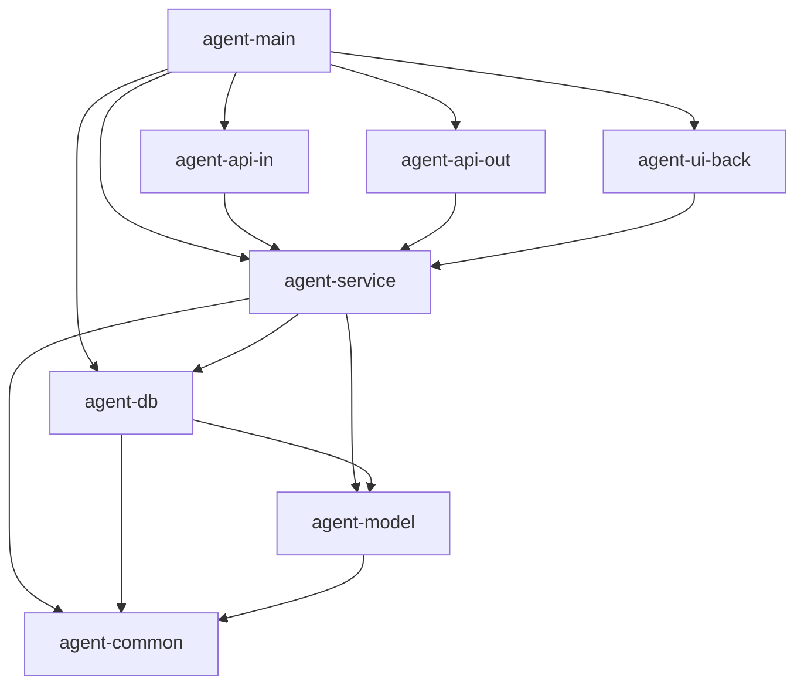
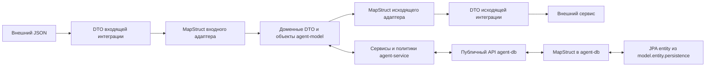
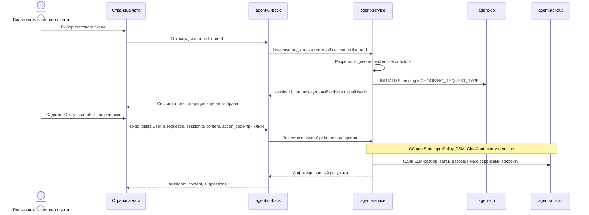

# Модули, пакеты и границы моделей

**Уточнение P1.02 r4 (28.09.2026):** epkId — организация в едином профиле клиента, digitalUserId — пользователь; requestId — обязательный ID входного запроса. additionalInfo необязателен (можно []), содержит уникальные строковые key/value; paymentId — необязательная произвольная строка, сейчас только передаётся без обработки/привязки. Идемпотентность входа принадлежит существующей внешней библиотеке @Idempotent; в P1.02 только временный маркер без поведения. Собственный механизм входной дедупликации не разрабатывается. Платёжный контекст описанных ниже будущих workflow уточняется в их design и не реализуется в P1.02. Документация OpenAPI, интерфейсов/методов и DTO/полей — краткая, на русском; generated использует стандартные описания из OpenAPI.

Связанные документы: [архитектура](./architecture.md), [FSM и хранение](./state-machine.md), [интеграции](./integrations.md), [сценарии и проверки](./execution.md).

Документ задаёт целевую структуру реализации. Каркас Maven reactor реализован в P1.01; примеры прикладных контрактов и Java ниже описывают целевую структуру последующих шагов. Каноническое имя модуля бизнес-логики — `agent-service`.

## 1. Состав Maven reactor

```text
invest-pro/                         parent/aggregator, packaging=pom
├── agent-common/                   jar
├── agent-model/                    jar
├── agent-db/                       jar
├── agent-service/                  jar
├── agent-api-in/                   jar
├── agent-api-out/                  jar
├── agent-ui-back/                  jar
└── agent-main/                     запускаемый Spring Boot jar
```

Parent фиксирует Java 21, BOM, версии плагинов и annotation processors, настройки компиляции и проверок. `spring-boot-maven-plugin:repackage` применяется только к `agent-main`. Остальные модули — обычные библиотеки одного сервиса. Порядок сборки задаётся Maven-зависимостями; порядок элементов в `<modules>` не исправляет цикл зависимостей.

Дополнительные модули пока не нужны. Прежние отдельные модули FSM, GigaChat, Invest corr и БЗ становятся пакетами в указанной структуре.

## 2. Ответственность и пакеты

| Модуль | Корневой пакет | Состав |
|---|---|---|
| `agent-common` | `ru.sberbank.pprb.agent.common` | `constant`, `exception`, `utils`, `mapper`: общие технические типы, утилиты и `CommonMapperConfig` |
| `agent-model` | `ru.sberbank.pprb.agent.model` | `enums`, `dto`, `value`, `entity.domain`, `entity.persistence` |
| `agent-service` | `ru.sberbank.pprb.agent.service` | `port.in`, `port.out`, `usecase`, `domain`, `policy`, `validation`, `fsm`, `knowledge`, `config` |
| `agent-db` | `ru.sberbank.pprb.agent.db` | `api`, `config`, `repository`, `service`, `mapper`, `exception`, `utils`, `fsm.spring`; Liquibase XML в resources |
| `agent-api-in` | `ru.sberbank.pprb.agent.<integration>` | Отдельный набор интеграционных пакетов на каждый входящий канал |
| `agent-api-out` | `ru.sberbank.pprb.agent.<integration>` | Отдельный набор интеграционных пакетов на каждый исходящий сервис |
| `agent-ui-back` | `ru.sberbank.pprb.agent.chatui` | Входной адаптер UI: контракт, controller, mapper, технический service и тестовые fixtures |
| `agent-main` | `ru.sberbank.pprb.agent.main` | `AgentApplication`, главная сборочная конфигурация в `config`, профили и параметры запуска |

`agent-common` не превращается в место хранения бизнес-правил или DTO конкретного провайдера. Коды состояний, операций и бизнес-исходов находятся в `agent-model.enums`, а правила их использования — в `agent-service`.

`agent-service.domain` содержит доменные сервисы, работающие с доменными объектами из `agent-model`. `usecase` координирует сценарий, deadline и внешние эффекты через порты. `StateInputPolicy`, `ResponsePolicy`, ФЛК, retry-политики и `TurnOrchestrator` также принадлежат этому модулю. БЗ и шаблоны ответов находятся в его `knowledge` и resources; бизнес-решения не переносятся в transport service интеграции.

## 3. Направление зависимостей

Стрелка ниже означает **Maven/compile-зависимость**, а не направление HTTP-вызова.

**`agent-service` зависит от `agent-db`. Только сервисы модуля `agent-service` инициируют прикладные обращения к БД через публичный API `agent-db`.** Сам `agent-db` содержит реализацию доступа и не зависит от `agent-service`.



API-адаптеры и UI также явно объявляют зависимости на `agent-model` и `agent-common`, когда импортируют их типы; эти дополнительные рёбра опущены на диаграмме для читаемости. `agent-common` не зависит от других модулей проекта. `agent-model` не зависит от сервисов, API или БД-адаптера.

| Модуль | Допустимые прямые зависимости на модули проекта |
|---|---|
| `agent-common` | Нет |
| `agent-model` | `agent-common` |
| `agent-service` | `agent-db`, `agent-model`, `agent-common` |
| `agent-api-in` | `agent-service`, `agent-model`, `agent-common` |
| `agent-api-out` | `agent-service`, `agent-model`, `agent-common` |
| `agent-db` | `agent-model`, `agent-common` |
| `agent-ui-back` | `agent-service`, `agent-model`, `agent-common` |
| `agent-main` | Все перечисленные модули, необходимые для сборки приложения |

Входной адаптер вызывает входной порт `agent-service.port.in`. Исходящие HTTP/LLM-адаптеры реализуют интерфейсы из `agent-service.port.out`: оркестратор вызывает `PermissionPort`, но не импортирует `InvestCorrAdapter` и не создаёт HTTP-клиент. Для БД направление другое: `agent-db.api` объявляет свой публичный контракт, а `agent-service` вызывает его. Реализации внедряет Spring при сборке приложения.

В `agent-service` допустима Spring-конфигурация его beans; HTTP, ORM, Spring AI и API Spring Statemachine в бизнес-код не входят. Чистые политики тестируются без Spring context. Между `agent-api-in`, `agent-api-out`, `agent-ui-back` и `agent-db` нет прямых compile-зависимостей.

Рабочая цепочка доступа: **входящий адаптер / UI → сервисный use case → `agent-db.api` → реализация БД и repositories → PostgreSQL**. Прямые вызовы `agent-db.api`, repositories, `EntityManager`, `DataSource`, JDBC или persister из входящих/исходящих интеграций и UI запрещены. Пакет с именем `service` внутри интеграции не даёт такого права: разрешение определяется принадлежностью к модулю `agent-service`.

Транзитивное присутствие `agent-db` в classpath интеграции через `agent-service` не разрешает импорт его классов. `agent-main` зависит от `agent-db` для подключения конфигурации, а не для чтения/изменения прикладных данных. Внутренние вызовы repositories, запуск ORM и миграций остаются обязанностью `agent-db`.

## 4. Единая структура интеграций

Для каждой интеграции применяется шаблон `ru.sberbank.pprb.agent.<integration>.*`:

```text
ru.sberbank.pprb.agent.<integration>
├── client/                         транспортный контракт и клиентские обёртки
│   └── generated/                  сгенерированные API и invoker-классы
├── dto/                            DTO конкретного внешнего контракта
│   └── generated/                  DTO из OpenAPI
├── exception/                      локальные ошибки интеграции и их перевод
├── mapper/                         MapStruct: внешний DTO ↔ доменная модель
├── service/                        адаптация вызова, без бизнес-решений
├── utils/                          утилиты только этой интеграции
├── config/                         конфигурация beans, URL, transport и timeout
└── controller/                     для входящих HTTP-адаптеров
```

Шаблон одинаковый для разных интеграций; пустые Java-классы ради заполнения всех папок не создаются. Входящий `client.generated` содержит сгенерированный API-интерфейс, который реализует controller. Это договорённость об имени пакета: наличие `client` не превращает входящий адаптер в HTTP-клиент. Исходящий `client` содержит настоящий клиент и его stub-реализацию.

| Модуль | Интеграция | Пакет | Пример технического service |
|---|---|---|---|
| `agent-api-in` | ГигаАссистент | `ru.sberbank.pprb.agent.gigaassistant` | `GigaAssistantInboundService`: контекст канала, mapping и вызов use case |
| `agent-api-out` | Invest corr | `ru.sberbank.pprb.agent.investcorr` | `InvestCorrAdapter`, реализующий три доменных порта |
| `agent-api-out` | GigaChat | `ru.sberbank.pprb.agent.gigachat` | `SpringAiGigaChatAdapter`, реализующий `TurnInterpreterPort` |
| `agent-ui-back` | Тестовый чат | `ru.sberbank.pprb.agent.chatui` | `ChatUiService`: mapping и обращение к тем же use cases |

Пакет каждой интеграции принадлежит одному модулю. Если появится одноимённая интеграция в обоих направлениях, используются разные ключи, например `investcorrin` и `investcorrout`. Одинаковый полностью квалифицированный класс или распределение одного пакета между JAR не допускаются.

`service` внутри интеграции решает только задачи адаптации: mapping, настройка вызова, классификация транспортной ошибки. Он не выбирает событие FSM, не подтверждает сводку и не принимает решение о повторной отправке. Общий бюджет и retry-политика принадлежат `agent-service`.

## 5. Какие модели пересекают границы



| Категория | Где находится | Где используется |
|---|---|---|
| Внешний request/response DTO | `<integration>.dto` / `.dto.generated` | Только соответствующая интеграция и её контрактные тесты |
| Доменный DTO, команда use case, результат | `agent-model`: `.model.dto` | Порты и бизнес-сервисы; адаптеры принимают/возвращают их на внутренней границе |
| Доменная entity / value object | `.model.entity.domain`, `.model.value` | Доменные сервисы, политики, правила инвариантов |
| JPA entity приложения | `.model.entity.persistence` | `agent-db`: repositories, database mappers и конфигурация ORM |
| Native context / entity SSM | Классы библиотеки, зависимость только в `agent-db` | Только `.db.fsm.spring..`; их не копируют в общий `agent-model` |

По принятому требованию JPA entity приложения находятся в `agent-model`, поэтому этот модуль содержит зависимость на Jakarta Persistence API. При этом его доменные DTO/entity не содержат ORM-аннотаций, lazy relations или Hibernate proxies. Разделение здесь **пакетное**, а не полная физическая независимость model-JAR от ORM; бизнес-сервисам и API запрещено импортировать `.model.entity.persistence..` (контроль при review). Объекты JPA не передаются в HTTP или LLM.

Доменные типы не генерируются из спецификации внешнего API. Даже если поля внешнего DTO сейчас совпали с доменными, это разные классы с разным жизненным циклом. Изменение OpenAPI не должно менять публичную сигнатуру доменного сервиса автоматически.

Mapping переносит данные, но не устанавливает доверие. Проверка пользователя/платежа, версий, допустимости действия и данных LLM остаётся в соответствующих проверках и `StateInputPolicy`. Поля полномочий, следующий шаг, событие, состояние и ключ отправки не копируются из внешнего JSON в защищённый контекст.

## 6. Где находятся FSM и persistence

| Элемент | Модуль / пакет |
|---|---|
| `ConversationStateMachine` — прикладной фасад | `agent-service`, `.service.fsm` |
| `StateMachineEngine` — SPI персистентного движка | `agent-db`, `.db.api`; не зависит от реализации SSM |
| `StateMachineProxy` | `agent-service`, `.service.fsm` |
| Описание бизнес-переходов, правила guards/actions | `agent-service`, `.service.fsm` и `.service.policy`; собственные типы проекта |
| `FlowDefinition` — DTO описания переходов | `agent-model`, `.model.dto.fsm`; формируется в `agent-service` |
| `FlowPolicy` — контракт чистых callbacks, нужных движку | `agent-db`, `.db.api`; реализация-мост к доменным политикам находится в `agent-service` |
| `SpringStateMachineEngineAdapter`, factory и Spring-конфигурация FSM | `agent-db`, `.db.fsm.spring` и его подпакеты |
| `DefaultStateMachinePersister`, JPA persist, serializer, native repository binding | Тот же `.db.fsm.spring..` внутри `agent-db` |
| `ConversationStore`, `TransitionCommitter`, `EngineCheckpointWrite` — интерфейсы | `agent-db`, `.db.api`; сигнатуры используют типы `agent-model` |
| `PostgresConversationStore`, реализация commit-протокола | `agent-db`, `.db.service` |
| `DataSource`, `EntityManagerFactory`, `JpaTransactionManager`, entity/repository scan | `agent-db`, `.db.config` |
| Liquibase XML | `agent-db/src/main/resources/db/changelog/db.changelog-master.xml`; все XML-миграции, включая SSM, в общем `changeset/` с последовательной нумерацией `0001_описание.xml` согласно ADR-002 |

Персистентный движок и его SPI находятся в `agent-db`; proxy в `agent-service` вызывает этот SPI. Контракты, необходимые БД-модулю, не остаются в `agent-service`, иначе зависимость замкнулась бы в цикл. `agent-db.api` возвращает доменные DTO и не раскрывает наружу JPA/SSM-типы или repositories.

Бизнес-матрица и алгоритмы остаются в `agent-service`. Сервисная конфигурация передаёт в движок `FlowDefinition` и реализацию `FlowPolicy`. Сам интерфейс callback объявлен в нижележащем `agent-db.api`; `agent-db` не импортирует классы сервисного модуля. Техническая конфигурация SSM строится по переданному описанию, а guards/actions и подготовка ответа вызывают чистые callbacks. Они не обращаются к БД, сети или use cases повторно; данные им передаёт движок. Такой runtime-вызов интерфейса не создаёт обратной Maven-зависимости.

При замене SSM меняются `.db.fsm.spring..`, его зависимость, сериализация и технические таблицы. Proxy/SPI и доменные правила остаются. В `agent-service` не появляется отдельное универсальное хранилище checkpoint. Общая транзакция native persist и бизнес-таблиц остаётся такой, как описано в [state-machine.md](./state-machine.md).

## 7. OpenAPI и Maven generation

Для входящих интеграций генерируются DTO и серверные интерфейсы. Для исходящих HTTP API — DTO и совместимый с Spring Cloud Feign интерфейс либо DTO с отдельно описанным Feign API; генерация другого HTTP-транспорта не допускается по [ADR-001](../adr/0001-outbound-clients-and-stubs.md). GigaChat использует выбранную библиотеку и собственный DTO разбора, без Feign. Спецификация находится в `src/main/openapi/<integration>.yaml` своего модуля; у каждой интеграции отдельный execution/output. При отсутствии согласованной спецификации DTO создаются вручную в её `dto`, без объявления временного контракта официальным API провайдера.

Пример execution для `agent-api-in`; `${openapi-generator.version}` фиксируется в parent. Фаза генерации — `generate-sources`, файлы попадают в `target`, сгенерированные исходники не редактируются вручную. [Maven plugin](https://openapi-generator.tech/docs/plugins/).

```xml
<plugin>
    <groupId>org.openapitools</groupId>
    <artifactId>openapi-generator-maven-plugin</artifactId>
    <version>${openapi-generator.version}</version>
    <executions>
        <execution>
            <id>gigaassistant-server</id>
            <phase>generate-sources</phase>
            <goals><goal>generate</goal></goals>
            <configuration>
                <inputSpec>${project.basedir}/src/main/openapi/gigaassistant.yaml</inputSpec>
                <generatorName>spring</generatorName>
                <apiPackage>ru.sberbank.pprb.agent.gigaassistant.client.generated</apiPackage>
                <modelPackage>ru.sberbank.pprb.agent.gigaassistant.dto.generated</modelPackage>
                <output>${project.build.directory}/generated-sources/openapi/gigaassistant</output>
                <configOptions>
                    <interfaceOnly>true</interfaceOnly>
                    <useSpringBoot3>true</useSpringBoot3>
                </configOptions>
            </configuration>
        </execution>
    </executions>
</plugin>
```

`interfaceOnly` ограничивает генерацию API-интерфейсами вместо реализации сервера; `useSpringBoot3` согласует Spring/Jakarta-ветку с выбранным Boot 3.5. Наш controller реализует интерфейс и передаёт управление входному порту. [Параметры Spring generator](https://openapi-generator.tech/docs/generators/spring/).

Для Invest corr после согласования спецификации выбирается Java client generator с подходящей Spring-библиотекой клиента; packages — `investcorr.client.generated`, `investcorr.dto.generated`, invoker — внутри `investcorr.client.generated`. Поддержка timeout, headers и idempotency проверяется контрактным тестом с выбранной версией генератора. До этого используются свои DTO и `StubInvestCorrClient` в тех же пакетных границах.

Для GigaChat сохраняется выбранный `ai-forever/spring-ai-gigachat`: второй HTTP SDK не генерируется. Собственные структуры `interpret_turn` находятся в `gigachat.dto`; типы Spring AI/GigaChat остаются внутри этой интеграции и преобразуются в доменную `Interpretation`.

## 8. MapStruct

Общие настройки — `agent-common`, пакет `.common.mapper`. MapStruct-реализации создаются annotation processor при компиляции; используется Spring component model и constructor injection. Незаполненное целевое поле — ошибка компиляции. [MapStruct reference](https://mapstruct.org/documentation/stable/reference/html/).

```java
@MapperConfig(
        componentModel = MappingConstants.ComponentModel.SPRING,
        injectionStrategy = InjectionStrategy.CONSTRUCTOR,
        unmappedTargetPolicy = ReportingPolicy.ERROR)
public interface CommonMapperConfig {}
```

Mapper размещается в интеграции, знающей обе стороны преобразования. Например, `.gigaassistant.mapper.GigaAssistantMessageMapper` преобразует request с `epkId`, `digitalUserId`, `requestId`, `sessionId`, `content` и необязательным `action_code` в доменный DTO. Это контракт текущего прототипа, а не утверждение о готовом API ГигаАссистента. В сгенерированном Java DTO wire-поле `action_code` представлено свойством `actionCode`:

```java
@Mapper(config = CommonMapperConfig.class)
public interface GigaAssistantMessageMapper {
    @Mapping(target = "claimedEpkId", source = "request.epkId")
    @Mapping(target = "claimedDigitalUserId", source = "request.digitalUserId")
    @Mapping(target = "requestId", source = "request.requestId")
    @Mapping(target = "additionalInfo", source = "request.additionalInfo")
    @Mapping(target = "externalSessionId", source = "request.sessionId")
    @Mapping(target = "text", source = "request.content")
    @Mapping(target = "actionCode", source = "request.actionCode")
    ru.sberbank.pprb.agent.model.dto.UserMessageInDTO toDomain(UserMessageInDTO request);
}
```

DTO `agent-model` — простые классы Lombok с getters/setters и конструкторами без проверок/защитного копирования; wire-ограничения проверяет входной адаптер. Суффиксы `InDTO`/`OutDTO` обозначают вход/выход приложения, внутренние типы используют `DTO`; enum — без DTO. Одноимённые доменные и wire-типы разделены пакетами.

`UserMessageInDTO` принадлежит `.gigaassistant.dto.generated`, `UserMessageInDTO` — `.model.dto`. В примере доменный payload содержит `claimedEpkId` (организация), `claimedDigitalUserId` (пользователь), `requestId`, `externalSessionId`, `text`, необязательный `actionCode` и список `additionalInfo`. Сервис сверяет идентификаторы с доверенным контекстом канала и серверной привязкой; mapper не создаёт доверенную идентификацию и не преобразует код саджеста в событие FSM. `turnId`, состояние и версии добавляет сервис. Исходящий mapper преобразует доменный ответ в `{sessionId, content, suggestions}` и каждый `SuggestionOutDTO` — в `{guid, action_code, text}`. `SuggestionOutDTO`/`SuggestionSpecDTO` и отдельный от FSM enum `SuggestionActionCode` принадлежат `agent-model`; внешний `SuggestionOutDTO` — входной интеграции либо UI. Мапперы JPA entity размещаются в `.db.mapper`.

В parent управляются одинаковые версии `org.mapstruct:mapstruct` и `org.mapstruct:mapstruct-processor`. В модулях с mapper-интерфейсами включается processor через `maven-compiler-plugin`, `release=21`:

```xml
<annotationProcessorPaths>
    <path>
        <groupId>org.mapstruct</groupId>
        <artifactId>mapstruct-processor</artifactId>
        <version>${mapstruct.version}</version>
    </path>
</annotationProcessorPaths>
```

Кандидаты для технической сборки: OpenAPI Generator `7.25.0` и MapStruct `1.6.3`, показанные в текущих официальных руководствах. Они фиксируются в parent после проверки генерации и компиляции с выбранным стеком; примеры в этом документе не заменяют такую проверку. [OpenAPI Maven](https://openapi-generator.tech/docs/plugins/), [установка MapStruct](https://mapstruct.org/documentation/installation/).

Неизвестные внешние enum, несовместимые значения, потеря точности и отсутствующие обязательные данные обрабатываются явно. `unmappedTargetPolicy=ERROR` не проверяет бизнес-смысл и не делает доверенными данные модели. Игнорирование поля оформляется точечно с причиной; общий `ReportingPolicy.IGNORE` для всех мапперов не используется. Для обновления черновика сохраняется различие «поле не передано» и «пользователь явно меняет/очищает поле»; mapper не задаёт это бизнес-правило.

## 9. Agent UI backend и тестовый чат

`agent-ui-back` — отдельно выделенный входной адаптер для человека. Остальные входящие интеграции размещаются в `agent-api-in`. Пока нет интеграции с ГигаАссистентом, UI вызывает те же `ConversationUseCase` и `ConversationQueryUseCase` из `agent-service.port.in`.



Предварительный UI-контракт:

| Endpoint | Назначение |
|---|---|
| `POST /test-ui/api/conversations` | Подготовить сессию по серверному `fixtureId`, без выбора операции; вернуть `sessionId`, организационный `epkId` и `digitalUserId` |
| `POST /test-ui/api/messages` | Передать `epkId`, `digitalUserId`, `requestId`, `sessionId`, `content`; при клике добавить `action_code` и скопировать `text` в `content` |
| `GET /test-ui/api/conversations/{id}` | Восстановить доступное пользователю представление диалога через query use case |

Спецификация UI находится в `agent-ui-back/src/main/openapi/chat-ui.yaml`; DTO и API генерируются в `.chatui.dto.generated` / `.chatui.client.generated`. Для первого экрана достаточно простой статической HTML/JS-страницы. UI отображает `content` и кнопки из `suggestions`, использует `guid` как идентификатор элемента. При клике отправляет `action_code` и `content=text`, GUID обратно не передаёт. При ручном вводе код отсутствует. Активными остаются только предложения актуального ответа; на время хода ввод и кнопки блокируются. Автоматический повтор POST после потери ответа не выполняется: query use case восстанавливает последний ответ с прежними GUID. Серверная сериализация обязательна; стабильный код не идентифицирует доставку или показанный вопрос. requestId передаётся для внешней библиотеки @Idempotent; её подключение и политика повторов оформляются отдельно.

Fixtures платежей/организаций разрешаются сервисным слоем по ID. Подготовка fixture — отдельная тестовая функция, не расширение сообщения чата. UI не устанавливает `AUTH_OK`, состояние FSM, результат ФЛК или итог corr. Сценарии ошибок задаются конфигурацией. В автономном запуске оба out-клиента работают со stub; `integrations.gigachat.stub=disabled` включает настоящую Ultra для отдельной оценки. Текущий режим явно обозначается на тестовом стенде; UI не переключает его пользовательским сообщением. «Статус» и «Да» проходят интерпретатор так же, как прочие реплики; лимит времени и правила подтверждения сохраняются.

UI показывает подтверждение запроса и сообщение о получении информации SMS с номера 900. Фактический статус платежа/исполнения заявки и доставка SMS не входят в UI DTO или query-представление. Локальная эмуляция не отправляет настоящие SMS; после подключения банковского контура этим занимается внешняя система.

UI API и страница включаются только профилем `local-ui`/`test-ui` вместе с `agent.ui.enabled=true`, по умолчанию выключены. Статические файлы размещаются вне автоматически публикуемых каталогов и выдаются только включённым UI handler. Промышленная конфигурация не регистрирует тестовые endpoints и fixtures. Это локальная эмуляция чата, а не объявление совместимости с ещё не согласованным API ГигаАссистента.

## 10. Конфигурация и проверки границ

`AgentApplication` находится в `.main`; главная конфигурация явно подключает конфигурации модулей. Нельзя рассчитывать, что default scan из `.main` обнаружит соседние пакеты. Каждый модуль ограничивает свой component scan; `agent-db.config` отвечает за entity/repository scan и единый transaction manager. Native SSM-конфигурация подключается из `.db.fsm.spring.config` без утечки библиотечных типов в main.

`agent-main` выбирает реализации портов по параметрам и профилям; ошибочная конфигурация с двумя активными реализациями одного порта не маскируется случайным порядком beans. Главная конфигурация содержит wiring, а не SQL, HTTP DTO или бизнес-решения.

Критерии архитектурной проверки:

- Maven reactor не содержит циклов; запускаемым является только `agent-main`.
- В POM есть `agent-service → agent-db`, обратная зависимость запрещена. Проверка учитывает не только прямые зависимости, но и импорт типов, доступных транзитивно.
- `agent-service` не импортирует внешние DTO, клиентов, database repositories, JPA entity, SSM или Spring AI.
- Сервисный слой вызывает БД только через `.db.api..`. Чистые доменные политики не выполняют I/O; repositories и ORM остаются внутренними деталями `agent-db`.
- Прикладные вызовы `.db..` извне `agent-db` разрешены только сервисам `agent-service`; в `agent-main` разрешено подключение конфигурации. Входящие/исходящие интеграции и UI не обращаются к БД напрямую, включая их собственные пакеты `service`.
- `agent-model` не импортирует типы интеграций/сервисов; ORM-аннотации ограничены `.model.entity.persistence..`.
- Пакеты integrations не пересекаются между модулями; DTO провайдера не используются другой интеграцией или как доменный контракт.
- SSM и его persistence доступны только `.db.fsm.spring..`; Spring AI/GigaChat — только `.gigachat..`.
- Чистая Maven-сборка генерирует OpenAPI-классы до компиляции MapStruct, проверяет mapping и не требует сохранённых generated-sources от предыдущего запуска.
- Контрактные тесты проверяют JSON и mapping, включая неизвестные enum и отсутствующие поля; это отдельная проверка от доменной валидации.
- UI и ГигаАссистент вызывают одни use cases. UI не зависит от `agent-db` или `agent-api-out`, а production-профиль не публикует тестовый интерфейс.

Для быстрого MVP структурные запреты контролируются при реализации и review; ArchUnit и аналогичные архитектурные тесты исключены по решению пользователя. Поведение проверяется существующими матрицами M/D/S и приёмкой из [execution.md](./execution.md); разнесение кода по JAR не меняет бизнес-правила.
