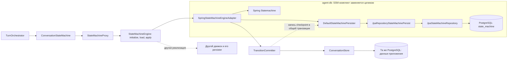
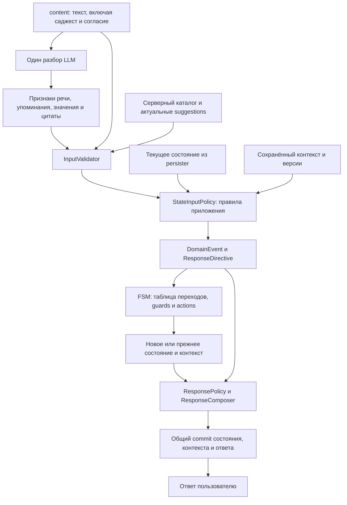
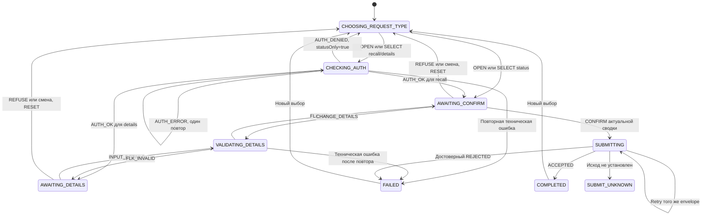
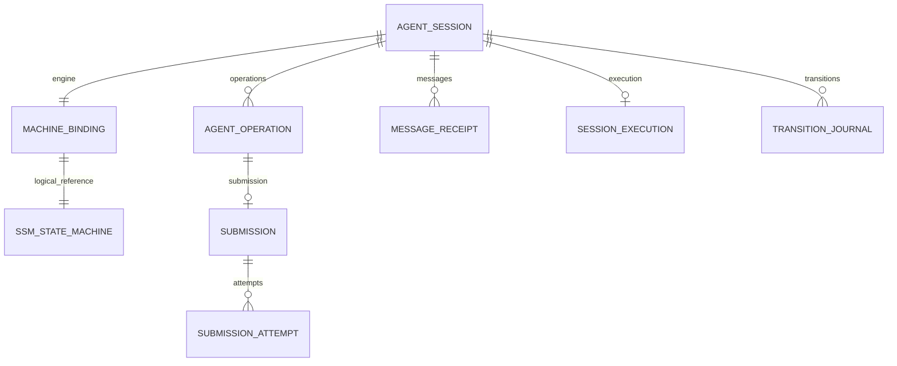

# Машина состояний, proxy и PostgreSQL

**Уточнение P1.02 r4 (28.09.2026):** epkId — организация в едином профиле клиента, digitalUserId — пользователь; requestId — обязательный ID входного запроса. additionalInfo необязателен (можно []), содержит уникальные строковые key/value; paymentId — необязательная произвольная строка, сейчас только передаётся без обработки/привязки. Идемпотентность входа принадлежит существующей внешней библиотеке @Idempotent; в P1.02 только временный маркер без поведения. Собственный механизм входной дедупликации не разрабатывается. Платёжный контекст описанных ниже будущих workflow уточняется в их design и не реализуется в P1.02. Документация OpenAPI, интерфейсов/методов и DTO/полей — краткая, на русском; generated использует стандартные описания из OpenAPI.

**Режим БД для MVP:** по [ADR-003](../adr/0003-h2-persistence-and-runtime.md) DB-тесты и локальный запуск с профилем h2 используют H2 с настоящей persistence. Упоминания PostgreSQL ниже описывают PostgreSQL-вариант; границы компонентов и транзакций сохраняются для H2.

Связанные документы: [общая архитектура](./architecture.md), [модули](./modules.md), [интеграции](./integrations.md), [сценарии и deadline](./execution.md).

## 1. Граница заменяемости

Выбран **Spring Statemachine со встроенной JPA-персистентностью в PostgreSQL**. Граница SPI охватывает движок вместе с его хранением. Прокси является тонким прикладным фасадом, а не HTTP-прокси и не самостоятельным владельцем состояния.

Физическое размещение: прикладной фасад, proxy и доменные правила — в `agent-service`; `StateMachineEngine` SPI — в `agent-db.api`; весь персистентный SSM-адаптер — в `agent-db`, пакет `ru.sberbank.pprb.agent.db.fsm.spring`. Native persister остаётся частью заменяемой реализации. Репозитории, транзакции и миграции также принадлежат `agent-db`. Направление compile-зависимости — **`agent-service → agent-db`**, без обратного ребра.

Только сервисы `agent-service` инициируют прикладные обращения к API БД, включая load/apply движка. Spring-адаптер получает `FlowDefinition` как DTO `agent-model` и чистую реализацию `FlowPolicy` от сервисного слоя. Интерфейс `FlowPolicy` объявлен в `agent-db.api`, поэтому для вызова доменных guards/actions/подготовки ответа адаптеру не требуется зависимость на классы `agent-service`. Callback не выполняет I/O и не входит повторно в use case.



`ConversationStateMachine` — API для приложения; `StateMachineEngine` — SPI устойчивой реализации. Успешный изменяющий вызов SPI означает зафиксированный переход. За SPI находятся создание машины, restore, исполнение, persister, сериализатор и технические миграции FSM. `StateMachineProxy` выбирает движок по привязке сессии, делегирует вызов и собирает общую телеметрию. Он не читает и не пишет native checkpoint.

Отдельный `PersistentStateMachineProxy`, собственный `machine_snapshot` и `NeutralContextMapper` **не нужны**. Независимым остаётся прикладной контракт, но формат сохранённой машины может быть специфичен для SSM. Встроенный persister скрыт внутри адаптера, поэтому новый движок может заменить его целиком.

Фрагменты ниже фиксируют форму контракта, а не являются готовыми исходниками:

```java
public interface ConversationStateMachine {
    TransitionResult initialize(InitializationCommand command);
    ConversationSnapshot load(SessionId sessionId);
    TransitionResult apply(TransitionCommand command);
}

public interface StateMachineEngine {
    TransitionResult initialize(InitializationCommand command);
    ConversationSnapshot load(SessionId sessionId);
    TransitionResult apply(TransitionCommand command);
}

public record TransitionCommand(
        SessionId sessionId,
        UUID commandId,
        long expectedVersion,
        UUID executionToken,
        DomainEvent event,
        TransitionFacts facts,
        ResponseDirective responseDirective) {}

public record TransitionResult(
        TransitionDisposition disposition,
        ConversationSnapshot committedView,
        List<EffectSpec> effects,
        ResponseSpec response) {}
```

Все типы здесь принадлежат проекту. Через границу не проходят `StateMachine`, `StateContext`, `ExtendedState`, `Message`, `Mono`, исключения Spring Statemachine или `Map<String,Object>` с экземплярами его классов. `DomainEvent` создаёт только код приложения по алгоритму `StateInputPolicy`: результат LLM не десериализуется в событие и не выбирает переход.

`initialize` идемпотентно создаёт начальный checkpoint и привязку реализации вместе с данными новой сессии. Отсутствие checkpoint у существующей сессии считается ошибкой целостности, а не поводом молча начать заново. `load` возвращает согласованное прикладное представление, собранное из native состояния и доменных таблиц; это не спецификация формата их хранения.

`TransitionDisposition` отличает применённый переход, недопустимое событие и дубликат команды. Внутри адаптера `EngineDecision` описывает результат конфигурации FSM и Java-правил: достигнутое состояние, `DomainPatch`, `EffectSpec`, `ResponseSpec` и `ruleId`. Этот тип не является результатом LLM. Через `apply` наружу возвращается уже зафиксированный результат. `EffectSpec` разрешает действие оркестратора после commit; эффект не исполняется из FSM. При отклонении команды возвращается текущее зафиксированное представление без нового эффекта.

`commandId` уникален для внутреннего шага сообщения. `(sessionId, commandId)` и хеш события хранятся в журнале: повтор того же шага не увеличивает версию снова; тот же ID с другим событием отклоняется. Серверный `turnId` идентифицирует одно принятое исполнение HTTP-запроса. Внешний контракт содержит `epkId`, `digitalUserId`, `requestId`, `sessionId`, `content` и `action_code` при клике. Стабильный код действия не идентифицирует доставку. Входной requestId предназначен для внешней библиотеки @Idempotent; её подключение отдельно от внутреннего журнала команд.

Дубликат команды сам по себе не разрешает ещё раз выполнить её эффект. Перед действием оркестратор проверяет сохранённую фазу, право исполнения и deadline; для отправки использует существующий `submissionId` и его retry-политику. После завершения пользовательского хода воспроизводится ответ, а не список команд к повторному исполнению.

### 1.1. Формирование события приложением

Под **контекстом состояния** понимаются сохранённые доменные данные сессии и активной операции, необходимые для алгоритма данного шага. Это не обязательно SSM `ExtendedState` и не текстовая память модели. Например, для `AWAITING_CONFIRM` нужны тип операции, проверенный черновик, версия/хеш внутренней сводки, к которой привязан вопрос согласия, последний акт ответа, полномочия и сведения о наличии отправки. Эти данные приложение восстанавливает из PostgreSQL.



Это локальный шаг обработки; при необходимости полномочий, ФЛК или corr оркестратор после commit исполняет эффект и подаёт следующее **внутреннее** событие. Пользователь получает итоговый ответ после завершения этой цепочки. Модель не запускает следующий шаг цепочки.

Форма чистого прикладного алгоритма:

```java
public interface StateInputPolicy {
    InputDecision decide(ConversationSnapshot current,
                         IncomingInput originalInput,
                         ValidatedInterpretation observations);
}

public record InputDecision(
        DomainEvent event,
        ResponseDirective responseDirective,
        String ruleId) {}
```

`ConversationSnapshot` содержит текущее состояние и доменный контекст. `ValidatedInterpretation` содержит проверенные признаки разбора, но не считается бизнес-разрешением. Каждое допустимое текстовое сообщение, включая саджест «Статус» и короткое «Да», разбирает LLM. Локальный словарь команд или кнопочный обход интерпретатора в выбранном режиме не используется. В `InputDecision` нет поля `nextState`: таблица переходов FSM остаётся единственным владельцем перехода.

Последовательность проверок:

1. Приложение проверяет обязательные поля, необязательный `action_code` и источник сообщения, сверяет digitalUserId с владельцем серверной сессии и epkId с организацией и доверенную привязку платежа. Создаёт внутренний `turnId`, получает право исполнения сессии, читает согласованное состояние, контекст и последние suggestions. Идентификаторы и версии не извлекаются из текста LLM.
2. Выполняет один вызов модели, в том числе для «Статус», «Да» и «Нет». В модель передаётся `content`, минимальный контекст для понимания речи и последний вопрос агента; она возвращает только данные разбора. При недоступности/невалидном результате нет перехода к локальному распознаванию согласия.
3. `InputValidator` проверяет схему, допустимые поля/типы, размер результата, наличие исходных фрагментов и их соответствие входному сообщению. При клике код должен соответствовать допустимому предложению, а `content` — его тексту; первоначальный выбор проверяется по стартовому каталогу. Противоречие `action_code` и результата LLM исключает действие по коду. Упоминание в цитате, вопросе или условном примере не превращается в утверждённое пользователем изменение. Проверка формата не доказывает верность смысла — противоречия приводят к уточнению.
4. `StateInputPolicy` применяет алгоритм текущего состояния к проверенным данным и сохранённому контексту. Например, согласие требует `AWAITING_CONFIRM`, вопроса подтверждения текущей сводки и подходящего `lastAssistantAct`; для `details` также проверяется версия ФЛК. Новые реквизиты вместе с «да» означают изменение, а не согласие отправить старую сводку. Неразрешённая неоднозначность исключает отправку.
5. Политика создаёт типизированный `DomainEvent` и цель ответа. Событие получает привязки к операции/версиям из серверного контекста. Для вопроса или неясного ввода формируются `QUESTION` / `UNCLEAR_INPUT`, сохраняющие шаг; смена состояния не является обязательным результатом каждого сообщения.
6. FSM проверяет guards и применяет событие. Валидация до FSM и её guards используют общие `DomainPolicy`, чтобы условия не расходились; guards повторно защищают инварианты от устаревшей версии или ошибочного вызывающего кода. Правила переходов не дублируются в prompt.
7. `ResponsePolicy` определяет текст и `SuggestionSpecDTO` по цели, результату перехода и актуальному контексту; `ResponseComposer` собирает ответ с `suggestions`. UUID для новых элементов заранее выделяет сервисный слой и передаёт как технические данные компоновки: чистые callbacks FSM не генерируют случайные значения. `lastAssistantAct`, версия сводки, к которой относится вопрос, и полный ответ с GUID согласованно сохраняются. Публикация выполняется только после commit; повторное чтение сохранённого ответа не меняет GUID.

Разбор связывается приложением с внутренним `turnId`, хешем исходного ввода и версией прочитанного контекста. Эти метаданные не заполняет модель. Хеш нужен для контроля целостности и аудита; одинаковый текст не означает дубликат. При потере права исполнения или изменении версии за время LLM-вызова ранее сформированное событие не применяется к новому состоянию. Повторная проверка версии в адаптере и commit остаётся обязательной; дополнительный вызов модели для такого случая не добавляется в текущий ход.

Согласие связывается с серверными `operationId`, `summaryVersion`, `summaryPayloadHash`, последним вопросом и предложенными действиями. Пользователь этих версий не передаёт. При клике «Да» возвращается `action_code=CONFIRM_REQUEST`, но GUID показанного саджеста во входе нет. Старый и новый клик с одинаковым кодом/текстом неразличимы. Последовательность диалога остаётся условием протокола; ни LLM, ни блокировка сессии не доказывают связь такого пакета с конкретным ответом. Подробности — в [контракте чата](./integrations.md#0-входящий-контракт-чата).

Термин «валидировать вход» включает два уровня. До события проверяются смысловая допустимость действия, форма и происхождение значений; предметная ФЛК реквизитов выполняется в `VALIDATING_DETAILS` по прежним правилам и создаёт `FLK_OK` / `FLK_INVALID` / `FLK_ERROR`. LLM не объявляет реквизиты прошедшими ФЛК.

`AUTH_OK`, `AUTH_DENIED`, результаты ФЛК и `SUBMIT_SUCCESS` создаются только обработчиками соответствующих сервисов. Фраза пользователя «полномочия есть» или такой же ответ модели не могут стать `AUTH_OK`. `StateMachineProxy` принимает уже сформированную команду и не занимается языковым разбором.

### 1.2. Примеры зависимости от состояния и контекста

| Данные разбора | Текущее состояние и сохранённый контекст | Решение Java-кода | Ответ / результат |
|---|---|---|---|
| Предлагается `purpose="Оплата услуг"` | `AWAITING_DETAILS`, операция `details` | `INPUT_DETAILS`, затем локальная ФЛК | При успехе новая сводка и `AWAITING_CONFIRM` |
| Те же данные | `AWAITING_CONFIRM`, операция `details` | `CHANGE_DETAILS`, старое подтверждение аннулируется | Проверка и новая сводка; corr не вызывается |
| Те же данные | `AWAITING_CONFIRM`, операция `status`, смена типа явно не запрошена | `UNCLEAR_INPUT`, не изменять данные платежа | Объяснить ограничение текущей подготовки и уточнить выбор |
| Признак согласия «да» | `AWAITING_CONFIRM`, `lastAssistantAct=CONFIRM_CURRENT_SUMMARY`, версии совпали | `CONFIRM` | `SUBMITTING`; после corr — ответ по достоверному исходу |
| Те же данные | `AWAITING_DETAILS`, `lastAssistantAct=ASK_DETAILS`, значения не переданы | `UNCLEAR_INPUT` | Запросить недостающие реквизиты, не отправлять |
| Согласие и явно предложенное новое назначение | `AWAITING_CONFIRM`, операция `details` | `CHANGE_DETAILS` | Запросить подтверждение новой сводки |
| Вопрос с цитатой «да» | Любое допустимое состояние ожидания | `QUESTION` | Справка и сохранение текущей подготовки |

Модель не знает `ruleId` и не выбирает его. Это идентификатор серверного правила для аудита и воспроизводимого теста. Предсказание модели с высокой уверенностью также не заменяет проверки состояния и контекста.

## 2. Исполнение Spring Statemachine

`SpringStateMachineEngineAdapter` владеет полным циклом одного перехода:

1. Получает из factory отдельный экземпляр машины для данного исполнения. Его `machineId`, ключ persist/restore и идентификатор в `machine_binding` совпадают. Конфигурация переходов общая, изменяемое состояние не разделяется между диалогами.
2. Восстанавливает native `StateMachineContext` через встроенный persister и читает данные операции. Чтение выполняется из согласованного короткого снимка БД; например, в read-only транзакции `REPEATABLE READ`. Restore не исполняет банковские действия. Версии checkpoint, привязки и бизнес-агрегата должны совпасть.
3. Передаёт одно событие с проверенными фактами. Guards проверяют состояние, операцию, версии и доменные предусловия. Actions только вычисляют `DomainPatch`, `EffectSpec` и `ResponseSpec`.
4. Дожидается завершения reactive-обработки, проверяет accepted/denied/deferred и ошибки завершения. Простого получения `ACCEPTED` недостаточно для подтверждения успешного перехода.
5. Проверяет вычисленный результат, затем через `TransitionCommitter` сохраняет native checkpoint встроенным persister и доменные изменения в общей транзакции. Только после commit возвращает `TransitionResult`.
6. Останавливает и освобождает экземпляр. При ошибке/timeout или неуспешном commit экземпляр отбрасывается. Его временное состояние не публикуется как результат.

SSM имеет reactive API; завершение обработки и ошибки доступны через результат события, включая `complete()`. Поэтому `subscribe()` без ожидания внутри синхронного API не используется. Guards/actions могут быть общими экземплярами Spring beans и должны быть stateless. [Документация SSM: reactive API и factories](https://docs.spring.io/spring-statemachine/docs/4.0.0/reference/).

На первом этапе — factory и экземпляр на локальное исполнение, без глобального кэша живых диалогов. Стоимость создания измеряется; если она значима, допускается ограниченный пул только с полным reset состояния, ошибок и контекста. Оптимизация не меняет источник истины PostgreSQL.

Нет HTTP, SQL, LLM, таймеров бездействия и fire-and-forget задач в actions/guards. В Spring Statemachine entry/exit exception не обязательно отменяет уже выполненный внутренний переход; адаптер поэтому сохраняет лишь полностью проверенный результат, а неподтверждённую машину уничтожает. [Обработка ошибок SSM](https://docs.spring.io/spring-statemachine/docs/4.0.0/reference/#sm-error-handling).

## 3. Модель состояний

Состояния и события соответствуют [матрицам БТ](../old/final.md). Наименование организации обогащает доверенный контекст до запуска новой подготовки; это техническая фаза обработки хода, а не дополнительный пользовательский шаг FSM.



Диаграмма укрупнена: при явной смене reset и запуск нового типа выполняются в одном пользовательском ходе. Вопросы, неясный ввод и повторы сообщений определяются матрицами БТ. Справка реализуется внутренним переходом без изменения состояния и рабочего черновика.

Машина плоская, с одним регионом, без deferred events и автономных таймеров. Неожиданное `DEFERRED` считается ошибкой адаптера и не коммитится. Новые пользовательские сообщения упорядочиваются на входе, а не скрытой внутренней очередью FSM.

**`COMPLETED`, `FAILED`, `SUBMIT_UNKNOWN` не объявляются `.end(...)` в Spring Statemachine.** Они завершают операцию, но диалог должен обрабатывать справочные вопросы; после первых двух также возможен новый выбор. `SUBMIT_UNKNOWN` допускает справку по S-07, а дальнейшие операционные переходы остаются Q-05. Завершение HTTP-хода не равно остановке бизнес-диалога.

`COMPLETED` фиксирует достоверный приём запроса corr. Информацию о платеже/исполнении заявки клиент получит SMS с номера 900 на личный телефон через банковский контур. Состояния `WAITING_SMS`, `SMS_SENT` или `SMS_DELIVERED` и события доставки SMS в агент не добавляются. После приёма запроса чат сообщает о канале получения информации, без банковского статуса и без утверждения об уже доставленном SMS.

Отмена — исход `CANCELLED` в истории операции и возврат в выбор, без постоянного состояния с сохранённым отменённым черновиком. Нераспознанное событие не является подтверждением. Запрет `statusOnly` проверяется для любого выбора операции, полученного из разбора текста, включая текст саджеста.

## 4. Встроенное хранение FSM и данные приложения

Spring Statemachine предоставляет `StateMachinePersister` для явного persist/restore и `StateMachineRuntimePersister` для сохранения во время перехода через interceptor. Стандартная JPA-реализация runtime-варианта — `JpaPersistingStateMachineInterceptor`. Оба механизма принадлежат инфраструктуре конкретного движка и должны оставаться за SPI. [SSM persistence](https://docs.spring.io/spring-statemachine/docs/4.0.0/reference/#sm-persist).

Для первого этапа выбран **явный встроенный persister**:

```text
DefaultStateMachinePersister
    → JpaRepositoryStateMachinePersist
        → JpaStateMachineRepository
            → PostgreSQL / state_machine
```

Это использование готового хранения SSM, без разработки своего формата snapshot. Явный вызов `persist` позволяет сохранить полностью обработанный локальный переход в той же прикладной транзакции, что и черновик/подтверждение/реестр отправок. Машина существует только на время исполнения и не используется после неудачного commit. [Контракт persist/restore](https://docs.spring.io/spring-statemachine/docs/4.0.0/reference/#sm-persist), [JPA persist SSM](https://github.com/spring-attic/spring-statemachine/blob/main/spring-statemachine-data/jpa/src/main/java/org/springframework/statemachine/data/jpa/JpaRepositoryStateMachinePersist.java).

`JpaPersistingStateMachineInterceptor` — допустимая внутренняя альтернатива. Для текущего варианта он не подключается одновременно с явным persister. Его автоматическое сохранение само по себе не гарантирует атомарность с бизнес-таблицами: callback reactive-машины может исполняться на другом потоке. Переход на runtime persister требует доказать общую транзакционную границу и rollback интеграционными тестами; SPI и proxy при этом не меняются.

Сохраняется `StateMachineContext`, а не живой объект машины с beans и потоками. Native сериализация и её версии остаются ответственностью SSM-адаптера в `agent-db`, пакет `.db.fsm.spring`. Для SSM 4.0.2 адаптер явно регистрирует собственные state/event types в Kryo; это поддержано конструктором JPA persist. Не разрешаем десериализацию произвольных классов. [Конструктор и настройка сериализации](https://github.com/spring-attic/spring-statemachine/blob/main/spring-statemachine-data/jpa/src/main/java/org/springframework/statemachine/data/jpa/JpaRepositoryStateMachinePersist.java).

В persisted `ExtendedState` допускаются только технические идентификаторы и версии, например `sessionId`, `aggregateVersion` и `flowDefinitionVersion`. Исходный платёж, полный черновик, полномочия, подтверждение, HTTP-клиенты и временные результаты actions туда не помещаются. Guards получают проверенные факты текущего вызова отдельно. Подготовленное состояние содержит следующую версию агрегата; при CAS-конфликте весь commit откатывается.

### 4.1. Владение таблицами

| Таблица | Содержание и ограничения |
|---|---|
| `state_machine` — владелец **SSM-адаптер** | Native JPA checkpoint: `machine_id`, `state`, сериализованный `state_machine_context`; заменяется вместе с SSM |
| `agent_session` — далее **данные приложения** | Привязка к каналу/диалогу/платежу, исходный контекст, пользовательский `digitalUserId` и организационный `epkId`, организация и её название, `status_only`, `active_operation_id`, `last_response_turn_id`, `aggregate_version`, `data_schema_version` |
| `machine_binding` | Один ряд на сессию: `machine_id`, `engine_key`, `flow_definition_version`, `engine_storage_version`; маршрутизация и совместимость, без собственного текущего состояния |
| `agent_operation` | Тип, черновик JSONB, `draft_version`, `validated_draft_version`, разрешение и его привязка, сводка, `summary_version`, `notification_policy`, хеш подтверждаемого payload, `last_assistant_act`, итог операции |
| `message_receipt` | Уникальность `(session_id, turn_id)`, хеш входа с учётом `action_code`, фаза обработки, deadline, полный ответ с `suggestions` и их GUID, версия результата; учёт исполнения, без обещания дедупликации входа |
| `session_execution` | Один исполнитель сессии: `turn_id`, `execution_token`, `lease_until`, deadline |
| `transition_journal` | Уникальность `(session_id, command_id)`, хеш события, состояния до/после, версии, `rule_id`, результат команды |
| `submission` | Уникальность `(operation_id, summary_version)` и `idempotency_key`; неизменный payload, его хеш, версия retry-политики, исход |
| `submission_attempt` | Попытки одного submission, время и подтверждённый либо неопределённый результат |

Текущее управляющее состояние принадлежит native checkpoint в `state_machine`; поле `state` и context обслуживает один persister. `agent_operation` не содержит вторую независимо изменяемую FSM. `transition_journal` хранит историю для аудита/дедупликации, но не восстанавливает машину вместо persister. Все изменения бизнес-агрегата увеличивают `agent_session.aggregate_version`; служебные lease/receipt не являются отдельными бизнес-переходами.

`last_response_turn_id` указывает на завершённый `message_receipt` той же сессии и обновляется в одной транзакции с сохранением нового ответа; публикация каналу выполняется после commit. Через него сервис загружает актуальные suggestions; отдельной изменяемой копии массива в checkpoint нет. До первого ответа указатель пуст, действует стартовый каталог. При наличии указателя отсутствие соответствующего receipt считается ошибкой целостности. GUID хранятся в ответе и не меняются при восстановлении или query-чтении.

Название `state_machine` и перечисленные поля соответствуют встроенной JPA entity. Для неё нет встроенной прикладной защиты по `aggregate_version`: сериализация сессии, CAS и fencing остаются обязанностью нашего commit-протокола. Liquibase XML-миграция по [ADR-002](../adr/0002-liquibase-xml.md) проверяется на H2 по ADR-003 с реальным Hibernate mapping; PostgreSQL-специфичные типы проверяются отдельно при необходимости, в том числе для `@Lob byte[]`; тип колонки нельзя выбирать как `bytea` без проверки фактической настройки LOB. Автогенерация/изменение production-схемы Hibernate не включается. [JPA entity SSM](https://github.com/spring-attic/spring-statemachine/blob/main/spring-statemachine-data/jpa/src/main/java/org/springframework/statemachine/data/jpa/JpaRepositoryStateMachine.java).



Связь `machine_binding → state_machine` логическая: общие доменные таблицы не имеют обязательного FK на таблицу конкретной технологии. Её целостность проверяет адаптер в общей транзакции. У другого движка может быть другая техническая схема при сохранении `machine_binding`.

### 4.2. Прикладное представление, собираемое чтением

```json
{
  "sessionId": "session-demo-1",
  "aggregateVersion": 12,
  "dataSchemaVersion": 1,
  "flowDefinitionVersion": "payment-correspondence-v1",
  "state": "AWAITING_CONFIRM",
  "trustedContext": {
    "paymentRef": "payment-demo-42",
    "digitalUserId": "digital-demo-user",
    "organizationRef": "org-demo-7",
    "organizationName": "ООО Пример",
    "organizationNameSource": "INVEST_CORR"
  },
  "statusOnly": false,
  "operation": {
    "id": "operation-demo-2",
    "type": "details",
    "draft": {"purpose": "Оплата по договору 42"},
    "draftVersion": 2,
    "validatedDraftVersion": 2,
    "summaryVersion": 2,
    "summaryPayloadHash": "sha256:demo-hash",
    "lastAssistantAct": "CONFIRM_CURRENT_SUMMARY",
    "confirmation": null
  }
}
```

Это `ConversationSnapshot` для приложения, а не формат native checkpoint и не дублирующий JSON-документ в БД. Интерпретатор получает только минимальную смысловую проекцию, без EPK, банковских идентификаторов и ключей отправки. Значения вымышлены. Поле `state` адаптер получает из восстановленной машины, остальные бизнес-данные — из своих таблиц приложения. Proxy и LLM не десериализуют SSM context.

## 5. Атомарное применение перехода

1. Оркестратор регистрирует `turnId` и получает право исполнения сессии в короткой транзакции. Предварительная серверная инициализация через `initialize` атомарно создаёт доверенный контекст, binding и начальный checkpoint; отсутствующая платёжная привязка не восстанавливается из полей сообщения или `action_code`. Повтор известной внутренней команды воспроизводится по журналу, а повтор входного requestId обрабатывает внешняя библиотека после подключения; совпадение content/кода не заменяет этот ID.
2. Proxy передаёт команду выбранной реализации. Адаптер читает согласованное состояние, проверяет `expectedVersion`, `executionToken`, версии flow/storage и журнал команды.
3. После окончания чтения движок вычисляет переход без открытой SQL-транзакции. Внешние результаты уже находятся в типизированном событии; LLM, corr и ФЛК выполняются оркестратором между переходами.
4. Адаптер проверяет результат. Для завершающего события через чистый callback `FlowPolicy` вызывается сервисный `ResponseComposer`, который формирует ответ из `ResponseSpec` до commit, без новой генерации. Адаптер зависит от интерфейса callback в `agent-db.api`, а не от класса компоновщика в `agent-service`.
5. Адаптер вызывает общий `TransitionCommitter`, передавая команду, `EngineDecision` и действие записи checkpoint. В одной короткой JPA-транзакции повторно проверяются binding, версия и токен; выполняется CAS, сохраняются изменения сессии/операции, native checkpoint, журнал перехода и при необходимости `submission`. Для завершённого хода в эту же транзакцию входят ответ `message_receipt` и освобождение исполнения.
6. `TransitionCommitter` выполняет переданное действие через встроенный `persister.persist(machine, machineId)` **на потоке этой транзакции**. Затем flush/commit завершают все записи. Ошибка сериализации, SQL, flush или commit означает отсутствие успешного результата и запрет внешнего эффекта.
7. После commit адаптер возвращает результат через proxy. Оркестратор исполняет разрешённые `EffectSpec` синхронно; затем применяет следующее внутреннее событие. EffectSpec не является фоновой очередью.

`TransitionCommitter` — общий механизм атомарности прикладного перехода, объявленный в `agent-db.api` и реализованный внутри `agent-db`. Его реализация знает доменные таблицы, но не `StateMachineContext`, SSM-репозиторий или формат bytes. Адаптер передаёт callback через `agent-db.api.EngineCheckpointWrite.persist()`. Этот технический callback записи реализуется внутри SSM-адаптера, вызывается один раз внутри транзакции и не имеет права открывать `REQUIRES_NEW` или отдельный connection. Он отличается от чистого `FlowPolicy`, реализованного сервисным слоем. Встроенная JPA persistence и доменные repositories используют один `EntityManagerFactory`, `DataSource` и `JpaTransactionManager`.

Проверка версии относится к бизнес-агрегату, а не к собственному snapshot FSM. Концептуальный CAS:

```sql
UPDATE agent_session
SET active_operation_id = :active_operation_id,
    aggregate_version = aggregate_version + 1
WHERE session_id = :session_id
  AND aggregate_version = :expected_version;
-- Должна измениться ровно одна строка.
-- Проверка session_execution, DomainPatch и native persist — в той же транзакции.
```

Событие перехода в `SUBMITTING` атомарно сохраняет подтверждение, сводку и immutable envelope до corr. При неудачном commit внешняя отправка не выполняется. Если ответ самого commit потерян, наличие записи устанавливается по уникальным ключам; повторный ключ не генерируется.

`TransactionTemplate` с `JpaTransactionManager` открывается после завершения reactive-вычисления. При CAS через native update реализация явно синхронизирует persistence context; устаревшая managed entity не должна затереть новую версию. Транзакция, открытая вокруг `sendEvent`, не считается автоматически распространённой на Reactor scheduler. Удалённые вызовы и ожидание LLM не держат row lock/SQL-транзакцию.

Это проектный commit-протокол поверх штатного persister, а не обещание автоматической атомарности от SSM. Он должен пройти интеграционные rollback-тесты. Переход на движок с отдельной удалённой БД потребует нового протокола согласованности: один SPI не превращает два независимых хранилища в одну транзакцию.

## 6. Сброс, дедупликация и восстановление

При отмене/смене удаляются рабочие уточнения, результат ФЛК, сводка и подтверждение. Исходный платёж, пользовательский `digitalUserId` и организационный `epkId`, идентификация, связанная организация, полученное название и `statusOnly` сохраняются. Новая операция получает новый ID и пустой черновик. Завершённый/неопределённый envelope отправки не удаляется сбросом подготовки.

Журнал переходов хранит метаданные, а не механизм автоматического восстановления отменённых значений. Полная история чата не подаётся модели как актуальное состояние. Срок хранения защищённого аудита задаётся отдельно.

Для нескольких реплик уникальная запись `session_execution` и fencing token защищают локальные записи. Истечение lease — повод проверить сохранённую фазу, а не разрешение немедленно начать новый corr-запрос. Следующий пользовательский ход не исполняется параллельно предыдущему.

| Точка сбоя | Правило восстановления |
|---|---|
| До commit перехода | PostgreSQL содержит прежний native checkpoint и бизнес-данные; временная машина отбрасывается |
| Во время проверки/интерпретации | Просроченный результат не применяется; данные актуальной подготовки не заменяются старым снимком |
| `SUBMITTING` сохранён, исход вызова не доказан | Сохранить envelope; при восстановлении отразить неопределённость, без автоматической новой отправки |
| Corr мог принять, запись результата не выполнена | `SUBMIT_UNKNOWN`; timeout/падение не доказывают отказ corr |
| Финальный commit выполнен, ответ каналу потерян | Receipt сохранён; тестовый query use case может восстановить ответ. Новая реплика проходит LLM и правила текущего состояния; повторное согласие при `COMPLETED` сообщает о прежнем приёме без новой отправки. Автоматическое распознавание HTTP-дубликата не гарантируется |

Техническая запись `SUBMITTING` после падения не доказывает, что байты были отправлены: остаётся консервативная неопределённость. Если достоверно установлено, что отправка даже не начиналась, фиксируется технический исход «не отправлено». Правила дальнейшего бизнес-поведения в неопределённости не придумываются вместо Q-05.

Fencing не отменяет уже начатый удалённый запрос. Внешнюю защиту от дублей обеспечивает idempotency-контракт corr, моделируемый заглушкой. После возвращённой ошибки watchdog может исправлять техническую запись исполнения, но не повторять отправку и не проводить банковскую сверку в фоне.

## 7. Как заменить Spring Statemachine

1. Реализовать весь `StateMachineEngine`: initialize, load, apply, восстановление, своё хранение и его миграции. Старый SSM persister новому движку не навязывается. Для локальной PostgreSQL-реализации можно повторно использовать общий `TransitionCommitter` и передавать собственную запись checkpoint.
2. Прогнать общий набор по M/D/S-матрицам, включая durability, версии, дедупликацию, rollback и отсутствие внешних эффектов при restore. Сравнить результаты движков на обезличенных сценариях без реальных банковских действий.
3. Для новых сессий переключить `default-engine`. Существующие привязки в `machine_binding` продолжают указывать на старую реализацию. В пределах одного хода движок не меняется.
4. Для существующих сессий выбрать сопровождение старой реализации до явного завершения сессий либо отдельную миграцию checkpoint. `COMPLETED` завершает операцию, но не обязательно всю сессию, поэтому одного ожидания таких состояний недостаточно.
5. При миграции остановить приём новых ходов мигрируемой сессии, дождаться отсутствия исполнителя, через старый адаптер экспортировать логическое состояние и через новый создать его checkpoint. Сверить бизнес-версии и данные, затем атомарно поменять binding. `SUBMITTING` и `SUBMIT_UNKNOWN` не мигрировать автоматически. Изменение flow требует явного преобразования, даже если движок остался прежним.
6. Удалять старые технические таблицы и библиотеку только после отсутствия старых bindings и окончания согласованного периода восстановления. Экспорт/import — отдельный административный контракт миграции, а не обязательная часть каждого пользовательского хода.

Контроллер, оркестратор, доменные таблицы, receipts, ключи идемпотентности и порты Invest corr сохраняются при эквивалентной замене. **Технические таблицы FSM, persister, сериализатор и процедура restore заменяются вместе с движком.** Независимая бизнес-модель уменьшает объём миграции, но не отменяет перенос native checkpoint активных сессий.
