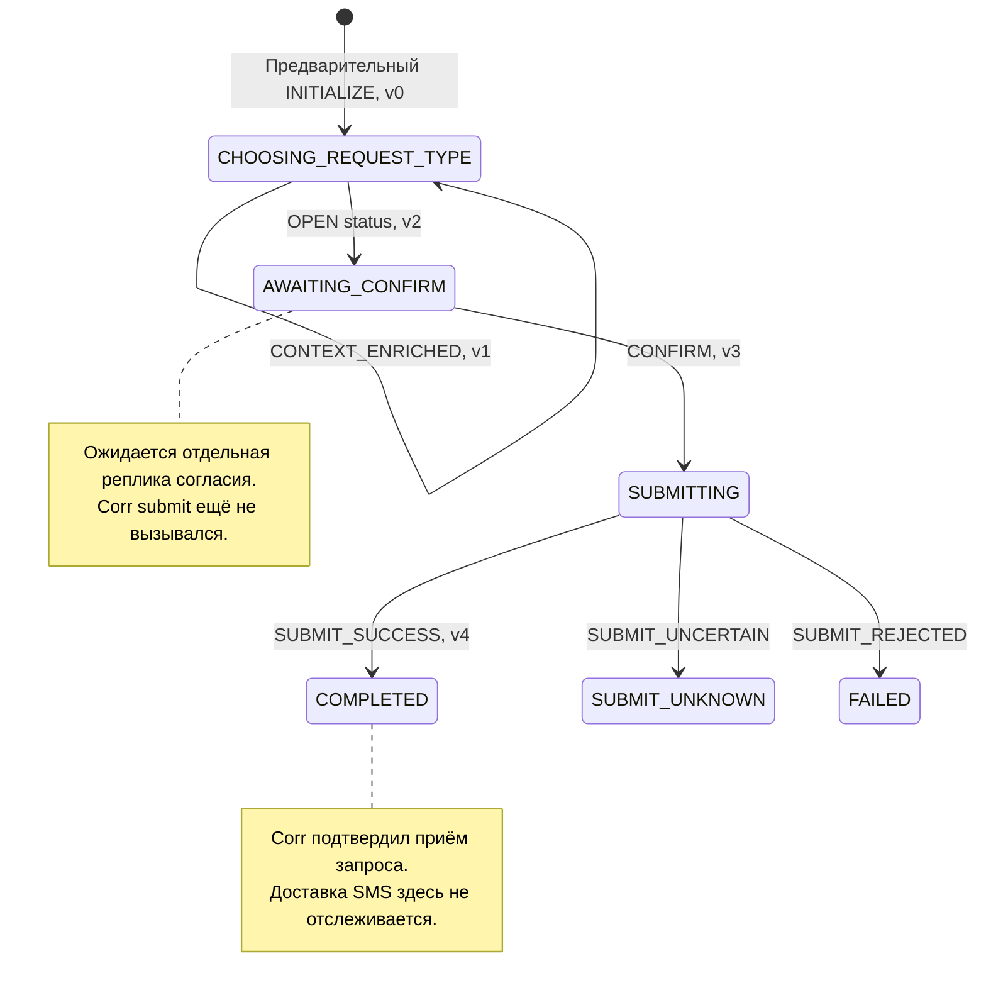

# Workflow «Статус»: простой чат, LLM-разбор и SMS с 900

**Уточнение P1.02 r4 (28.09.2026):** epkId — организация в едином профиле клиента, digitalUserId — пользователь; requestId — обязательный ID входного запроса. additionalInfo необязателен (можно []), содержит уникальные строковые key/value; paymentId — необязательная произвольная строка, сейчас только передаётся без обработки/привязки. Идемпотентность входа принадлежит существующей внешней библиотеке @Idempotent; в P1.02 только временный маркер без поведения. Собственный механизм входной дедупликации не разрабатывается. Платёжный контекст описанных ниже будущих workflow уточняется в их design и не реализуется в P1.02. Документация OpenAPI, интерфейсов/методов и DTO/полей — краткая, на русском; generated использует стандартные описания из OpenAPI.

Связанные документы: [архитектура](./architecture.md), [контракты](./integrations.md), [FSM и PostgreSQL](./state-machine.md), [модули](./modules.md), [временные бюджеты](./execution.md).

Это моделирование выбранной архитектуры, а не описание уже реализованного API. Идентификаторы вымышлены; JSON corr показывает контракт заглушки, который впоследствии маппируется на согласованный API Invest corr.

Пример разбора ниже описывает режим настоящей Ultra. По [ADR-001](../adr/0001-outbound-clients-and-stubs.md) автономный прототип может подставить `StubGigaChatClient` через `integrations.gigachat.stub=enabled`; тогда те же JSON выдаются фикстурой и фактических генераций нет. Для проверки LLM используется `disabled`. Invest corr также имеет stub и реальный Feign-клиент, выбираемые `integrations.invest-corr.stub`.

## 1. Условия примера

Чат присылает **`epkId`, `digitalUserId`, `requestId`, `sessionId`, `content`**, при нажатии саджеста добавляет **`action_code`**, а его `text` копирует в `content`. Ответ содержит **`sessionId`, `content`, `suggestions: [{guid, action_code, text}]`**. В этом примере клиент нажимает «Статус», затем «Да»; оба текста классифицирует и структурирует LLM. Приложение дополнительно проверяет коды саджестов. На каждый ход приходится один вызов GigaChat Ultra; весь диалог включает два вызова с отдельными лимитами времени.

**Платёж заранее привязан к сессии на сервере.** В примере `session-status-001` принадлежит пользователю `digital-demo-user` организации `epk-demo-org` и связана с `payment-demo-42` и `org-demo-7`. Для локального чата привязку создаёт тестовый fixture через `agent-service`. Источник контекста в реальном канале согласуется отдельно; полей входа, включая код саджеста, для выбора платежа недостаточно. При отсутствии привязки операция не запускается. Тело запроса не заменяет аутентификацию канала и проверку владельца сессии.

Клиент получает сведения о платеже и исполнении заявок **только SMS с номера 900 на личный телефон**. Агент получает согласие, передаёт запрос в corr и после подтверждённого приёма сообщает о канале получения информации. В чат не поступают банковский статус, реквизиты платежа или факт доставки SMS. Номер телефона не спрашивается: банковский контур определяет его по доверенной идентификации.

Для простого протокола предполагается последовательный диалог: клиент получает ответ до следующей реплики, канал не выполняет автоматическую повторную доставку после неизвестного исхода. Ограничения этой модели приведены в разделе 8.

## 2. Кто классифицирует, кто принимает решение

```text
content → GigaChat: признаки речи и извлечённые значения
        → InputValidator: проверенный разбор
        → StateInputPolicy(состояние, контекст, вход с action_code, разбор)
        → DomainEvent + ResponseDirective
        → StateMachineProxy → StateMachineEngine → Spring Statemachine
        → новый контекст, текст и suggestions из ResponseComposer
        → общий commit native checkpoint, доменных данных и ответа
        → ответ каналу
```

Модель не возвращает `OPEN`, `CONFIRM`, `SUBMIT_SUCCESS`, `nextState`, готовый ответ или `suggestions`. Упоминание `status` — результат классификации речи. Коды `REQUEST_STATUS`/`CONFIRM_REQUEST` относятся к UI-каталогу и не являются событиями FSM. Превращать проверенный вход в событие может только алгоритм приложения. Внешний эффект corr выполняется между переходами, после фиксации разрешившего его события.

| Этап | Источник | Состояние после commit | Версия агрегата |
|---|---|---|---:|
| Предварительный `INITIALIZE` | Серверная подготовка, до сообщений | `CHOOSING_REQUEST_TYPE` | 0 |
| `CONTEXT_ENRICHED` | Проверенный lookup организации | `CHOOSING_REQUEST_TYPE` | 1 |
| `OPEN(status)` | Java-политика по разбору «Статус» | `AWAITING_CONFIRM` | 2 |
| `CONFIRM` | Java-политика по разбору «Да» и актуальному вопросу | `SUBMITTING` | 3 |
| `SUBMIT_SUCCESS` | Обработчик `ACCEPTED` от corr | `COMPLETED` | 4 |

`INITIALIZE` — операция SPI создания сессии. `CONTEXT_ENRICHED` — внутреннее событие обогащения без нового пользовательского шага. LLM-разбор и валидация являются фазами исполнения хода, а не дополнительными состояниями FSM. `CHECKING_AUTH` и `VALIDATING_DETAILS` для status не требуются.



Версии приведены для случая, когда название организации ещё нужно обогатить. При уже сохранённом названии соответствующий переход пропускается; конкретное число версии не является бизнес-условием.

## 3. Первый ход: content = «Статус»

### 3.1. Вход и чтение контекста

Предлагаемый endpoint `agent-api-in`: `POST /api/v1/gigaassistant/turns`. Пакет интеграции — `ru.sberbank.pprb.agent.gigaassistant`.

```json
{
  "epkId": "epk-demo-org",
  "digitalUserId": "digital-demo-user",
  "requestId": "chat-request-001",
  "sessionId": "session-status-001",
  "action_code": "REQUEST_STATUS",
  "content": "Статус"
}
```

Тестовый `agent-ui-back` передаёт такой же body в `POST /test-ui/api/messages`. При ручном вводе «Статус» поле `action_code` отсутствует; LLM-разбор остаётся общим. Стартовый саджест канала проверяется по серверному каталогу (`REQUEST_STATUS`, «Статус») для начального `CHOOSING_REQUEST_TYPE`, поскольку предыдущего ответа агента ещё нет. Внешний DTO преобразуется MapStruct-маппером в доменный payload; mapper не присваивает ему доверенность.

`agent-service` проверяет доступ, создаёт внутренний `turn-status-001`, получает право исполнения сессии и через `agent-db` читает binding, native checkpoint и контекст. Входной адаптер напрямую к БД не обращается.

Если проверенное наименование организации ещё не сохранено, сервис вызывает `OrganizationPort` через исходящую интеграцию `investcorr`. По условиям fixture заглушка возвращает:

```json
{
  "result": "FOUND",
  "organizationRef": "org-demo-7",
  "name": "ООО Пример"
}
```

Приложение сверяет привязку и формирует `CONTEXT_ENRICHED`: состояние остаётся `CHOOSING_REQUEST_TYPE`, версия становится 1. Название используется во внутренней сводке/envelope и не выводится в чат. Это не проверка полномочий и не запрос статуса платежа. При ошибке подготовки контекста ход завершается техническим ответом без операции и submit; LLM в таком незавершённом маршруте может не вызываться.

### 3.2. Единственный LLM-разбор первого хода

Адаптер GigaChat получает `content="Статус"`, минимальный смысловой контекст (активной операции и предыдущего вопроса нет), схему результата, prompt и утверждённую БЗ на 2–3 страницы. `action_code` проверяется приложением отдельно и в prompt не передаётся. Полный `ConversationSnapshot`, EPK, идентификаторы платежа и ключи отправки модели также не нужны.

`SpringAiGigaChatAdapter` вызывает Ultra через `ai-forever/spring-ai-gigachat`. Аргументы фиксированной функции `interpret_turn` либо JSON-текст в заранее выбранном режиме дают такие данные:

```json
{
  "schemaVersion": 1,
  "speechActs": [
    {"kind": "REQUEST", "usage": "DIRECT", "sourceText": "Статус"}
  ],
  "operationMentions": [
    {"operationType": "status", "usage": "DIRECT", "sourceText": "Статус"}
  ],
  "fieldMentions": [],
  "ambiguous": false,
  "knowledge": {"candidateSectionIds": []}
}
```

`InputValidator` проверяет закрытую схему, enum, исходный фрагмент и отсутствие противоречий. Он не извлекает операцию повторно по локальному словарю. Сервер связывает результат с `turn-status-001` и прочитанной версией 1; эти метаданные модель не возвращает.

### 3.3. Java формирует событие и вопрос

Условия правила: `CHOOSING_REQUEST_TYPE`, доверенный контекст полон, код/текст соответствуют стартовому каталогу, модель выделила прямую просьбу о status без неоднозначности. `StateInputPolicy` создаёт **внутреннюю** команду, не полученную из чата или LLM:

```json
{
  "sessionId": "session-status-001",
  "commandId": "10000000-0000-4000-8000-000000000003",
  "expectedVersion": 1,
  "executionToken": "00000000-0000-4000-8000-000000000001",
  "event": {"type": "OPEN", "operationType": "status"},
  "facts": {
    "sourceTurnId": "turn-status-001",
    "sourceActionCode": "REQUEST_STATUS",
    "operationId": "operation-status-001",
    "notificationPolicy": "SMS_900_PERSONAL_PHONE_V1"
  },
  "responseDirective": "ASK_CONFIRMATION"
}
```

Proxy делегирует в `StateMachineEngine`; Spring-реализация проверяет guards и вычисляет переход. Общий commit сохраняет `AWAITING_CONFIRM`, внутреннюю сводку v1, её хеш, последний запрос согласия и полный ответ с `suggestions`. GUID назначает сервисный слой; он передаёт их компоновщику как технические данные, опущенные в примерах бизнес-команд. Отправки в corr ещё нет.

JSON ответа:

```json
{
  "sessionId": "session-status-001",
  "content": "Направить информацию о статусе платежа в SMS с номера 900 на ваш личный телефон?",
  "suggestions": [
    {
      "guid": "b2a11010-9849-4daf-8a20-270fdc602001",
      "action_code": "CONFIRM_REQUEST",
      "text": "Да"
    },
    {
      "guid": "b2a11010-9849-4daf-8a20-270fdc602002",
      "action_code": "CANCEL_REQUEST",
      "text": "Нет"
    }
  ]
}
```

## 4. Что сохранено между репликами

Пример `ConversationSnapshot`, собираемого из native checkpoint и доменных таблиц. Это внутреннее представление; оно не отправляется целиком ни в чат, ни в LLM.

```json
{
  "sessionId": "session-status-001",
  "aggregateVersion": 2,
  "lastResponseTurnId": "turn-status-001",
  "state": "AWAITING_CONFIRM",
  "trustedContext": {
    "digitalUserId": "digital-demo-user",
    "paymentRef": "payment-demo-42",
    "organizationRef": "org-demo-7",
    "organizationName": "ООО Пример",
    "organizationNameSource": "INVEST_CORR"
  },
  "statusOnly": false,
  "operation": {
    "id": "operation-status-001",
    "type": "status",
    "summaryVersion": 1,
    "notificationPolicy": "SMS_900_PERSONAL_PHONE_V1",
    "summaryPayloadHash": "sha256:5d94f903cd01dd51910c3380a8ce763b850f2cca1d13e3e97b70e54cbfdf410b",
    "lastAssistantAct": "CONFIRM_CURRENT_SUMMARY",
    "confirmationPrompt": {
      "sourceTurnId": "turn-status-001",
      "summaryVersion": 1
    },
    "confirmation": null,
    "submissionId": null
  }
}
```

Сводка — набор подтверждаемых внутренних данных, а не банковская выписка в чате. Сохранённый вопрос описывает действие и канал получения информации. `confirmationPrompt` связывает его с текущей версией сводки, но не доказывает доставку клиенту; последовательность получения/ответа обеспечивает канал.

Native состояние сохраняет встроенный JPA persister Spring Statemachine внутри `agent-db`. Proxy не хранит собственный snapshot. Доменные сведения находятся в `agent_session` и `agent_operation`, полный ответ с массивом и GUID — в `message_receipt`. `lastResponseTurnId` указывает на актуальный завершённый ответ, из которого сервис читает доступные предложения. Повторное чтение не генерирует GUID заново. После рестарта восстанавливаются эти данные; просить модель восстановить историю не нужно.

## 5. Второй ход: content = «Да»

### 5.1. Вход и LLM-разбор

Клиент нажал саджест «Да» из ответа выше. Он передаёт его `action_code` и `text`; GUID обратно не отправляет:

```json
{
  "epkId": "epk-demo-org",
  "digitalUserId": "digital-demo-user",
  "requestId": "chat-request-002",
  "sessionId": "session-status-001",
  "action_code": "CONFIRM_REQUEST",
  "content": "Да"
}
```

Если пользователь набрал «Да» вручную, запрос выглядит так:

```json
{
  "epkId": "epk-demo-org",
  "digitalUserId": "digital-demo-user",
  "requestId": "chat-request-003",
  "sessionId": "session-status-001",
  "content": "Да"
}
```

Это альтернативы одного второго хода, а не две последовательные отправки. Сервис создаёт `turn-status-002`, получает право исполнения и загружает `AWAITING_CONFIRM`, версию 2, текущую операцию, вопрос и suggestions первого хода. В LLM передаётся «Да», обсуждаемая операция `status` и точный последний вопрос о SMS. Второй lookup организации и проверка полномочий для status не выполняются.

Результат единственного вызова LLM этого хода:

```json
{
  "schemaVersion": 1,
  "speechActs": [
    {"kind": "AFFIRMATION", "usage": "DIRECT", "sourceText": "Да"}
  ],
  "operationMentions": [],
  "fieldMentions": [],
  "ambiguous": false,
  "knowledge": {"candidateSectionIds": []}
}
```

Отсутствие `operationMentions` допустимо: пользователь соглашается с вопросом, текущую операцию приложение знает из БД. Модель не дописывает её как упоминание, которого нет в тексте.

### 5.2. Проверки и CONFIRM

`InputValidator` проверяет разбор. `StateInputPolicy` вместе с guards проверяет:

1. `AWAITING_CONFIRM`, активную операцию `status` и право исполнения.
2. `lastAssistantAct=CONFIRM_CURRENT_SUMMARY`; вопрос относится к текущей сводке v1, данные и хеш не изменились.
3. Прямое однозначное согласие; нет вопроса, отрицания, цитаты, смены операции или новых реквизитов.
4. Для операции нет ранее зарегистрированной отправки; версии совпадают при commit.
5. При наличии `action_code` он равен `CONFIRM_REQUEST`, присутствует в актуальных suggestions, а `content` совпадает с его `text` и не противоречит LLM-разбору. При ручном вводе отсутствие кода допустимо и не отменяет остальные проверки.

После этого **Java-код**, а не LLM, создаёт команду:

```json
{
  "sessionId": "session-status-001",
  "commandId": "20000000-0000-4000-8000-000000000001",
  "expectedVersion": 2,
  "executionToken": "00000000-0000-4000-8000-000000000002",
  "event": {
    "type": "CONFIRM",
    "operationId": "operation-status-001",
    "summaryVersion": 1
  },
  "facts": {
    "sourceTurnId": "turn-status-002",
    "sourceActionCode": "CONFIRM_REQUEST",
    "confirmedPayloadHash": "sha256:5d94f903cd01dd51910c3380a8ce763b850f2cca1d13e3e97b70e54cbfdf410b"
  },
  "responseDirective": "REPORT_SUBMISSION_RESULT"
}
```

Транзакция сохраняет `SUBMITTING` и версию 3, подтверждение, неизменный envelope и стабильный ключ. Только после commit оркестратор получает `EffectSpec SUBMIT` и вызывает corr. FSM actions и persister HTTP-вызовов не выполняют.

### 5.3. Envelope и исходящий JSON corr

Сохранённый доменный envelope:

```json
{
  "submissionId": "submission-status-001",
  "operationId": "operation-status-001",
  "summaryVersion": 1,
  "idempotencyKey": "315ead18-198e-4c32-8ca5-5966735f224a",
  "type": "status",
  "paymentRef": "payment-demo-42",
  "digitalUserId": "digital-demo-user",
  "organization": {"ref": "org-demo-7", "name": "ООО Пример"},
  "notificationPolicy": "SMS_900_PERSONAL_PHONE_V1",
  "payloadHash": "sha256:5d94f903cd01dd51910c3380a8ce763b850f2cca1d13e3e97b70e54cbfdf410b"
}
```

Хеш примера — SHA-256 UTF-8 без BOM/перевода строки следующего канонического содержимого. Технические ID и ключ идемпотентности в бизнес-хеш не входят; правило canonical JSON едино при подготовке и отправке.

```json
{"digitalUserId":"digital-demo-user","notificationPolicy":"SMS_900_PERSONAL_PHONE_V1","organization":{"name":"ООО Пример","ref":"org-demo-7"},"paymentRef":"payment-demo-42","type":"status"}
```

MapStruct-маппер исходящей интеграции строит DTO заглушки:

```json
{
  "clientRequestId": "submission-status-001",
  "idempotencyKey": "315ead18-198e-4c32-8ca5-5966735f224a",
  "type": "status",
  "paymentRef": "payment-demo-42",
  "digitalUserId": "digital-demo-user",
  "organizationRef": "org-demo-7",
  "notificationPolicy": "SMS_900_PERSONAL_PHONE_V1"
}
```

`notificationPolicy` фиксирует канал ответа и входит в подтверждаемый payload. В реальном API corr отдельного поля может не быть: адаптер закрепит ту же семантику согласно внешнему контракту. Телефон не приходит из чата/LLM. Для retries используются тот же payload и ключ; новые ID операции или отправки не генерируются.

Ответ заглушки:

```json
{
  "result": "ACCEPTED",
  "requestId": "corr-status-001"
}
```

Это квитанция приёма запроса, а не банковский статус, исполнение заявки или подтверждение отправки SMS. Заглушка настоящие SMS не отправляет.

### 5.4. Завершение хода

Обработчик результата corr создаёт внутреннее событие без второго обращения к LLM:

```json
{
  "sessionId": "session-status-001",
  "commandId": "20000000-0000-4000-8000-000000000002",
  "expectedVersion": 3,
  "executionToken": "00000000-0000-4000-8000-000000000002",
  "event": {
    "type": "SUBMIT_SUCCESS",
    "submissionId": "submission-status-001",
    "corrRequestId": "corr-status-001"
  },
  "facts": {"acceptanceConfirmed": true},
  "responseDirective": "INFORM_SMS_INFORMATION_EXPECTED"
}
```

Commit сохраняет `COMPLETED`, версию 4, исход `ACCEPTED`, квитанцию corr, ответ второго хода и соответствующий `lastAssistantAct`. Ответ клиенту:

```json
{
  "sessionId": "session-status-001",
  "content": "Запрос принят. Информация о статусе платежа будет отправлена в SMS с номера 900 на ваш личный телефон.",
  "suggestions": []
}
```

`COMPLETED` завершает подготовку и передачу запроса. В FSM агента нет состояний ожидания SMS, событий доставки, отдельного SMS-клиента или фонового опроса статуса платежа.

## 6. Сквозная последовательность

```mermaid
sequenceDiagram
    actor C as Клиент чата
    participant IN as agent-api-in или agent-ui-back
    participant S as agent-service
    participant E as Proxy и StateMachineEngine в agent-db
    participant PG as PostgreSQL
    participant L as agent-api-out / GigaChat Ultra
    participant I as agent-api-out / Invest corr stub
    Note over S,PG: Сессия с платёжной привязкой уже создана, v0
    C->>IN: epkId, digitalUserId, requestId, sessionId, action_code=REQUEST_STATUS, content=Статус
    IN->>S: Доменный payload и доверенный контекст канала
    S->>E: load
    E->>PG: Native checkpoint и контекст
    Note over S,PG: Право исполнения получено через API agent-db
    S->>I: Lookup организации, если название отсутствует
    I-->>S: FOUND, проверенная организация
    S->>E: CONTEXT_ENRICHED
    E->>PG: Контекст и checkpoint, v1
    S->>L: Один interpret_turn для Статус
    L-->>S: REQUEST, упоминание status, цитата
    S->>S: InputValidator и StateInputPolicy
    S->>E: OPEN status
    E->>PG: AWAITING_CONFIRM, сводка, вопрос и suggestions с GUID, v2
    S-->>IN: Доменный ответ
    IN-->>C: Вопрос о SMS с 900, suggestions Да и Нет
    C->>IN: epkId, digitalUserId, requestId, sessionId, action_code=CONFIRM_REQUEST, content=Да
    IN->>S: Новая реплика
    S->>E: load актуального состояния и контекста
    E->>PG: AWAITING_CONFIRM и вопрос, v2
    S->>L: Один interpret_turn для Да и последний вопрос
    L-->>S: AFFIRMATION, DIRECT, цитата
    S->>S: Проверить код, текст, разбор согласия, сводку и версии
    S->>E: CONFIRM
    E->>PG: SUBMITTING, согласие, envelope и ключ, v3
    E-->>S: Commit успешен, EffectSpec SUBMIT
    S->>I: submit status, сохранённый ключ и payload
    I-->>S: ACCEPTED и requestId
    S->>E: SUBMIT_SUCCESS
    E->>PG: COMPLETED, исход и ответ, v4
    S-->>IN: Доменный ответ из шаблона
    IN-->>C: Информация будет отправлена SMS с 900, suggestions=[]
    Note over C,I: Банковский контур доставляет сведения отдельно; агент доставки не ждёт
```

Получение права исполнения, чтение и запись инициируют только сервисы через `agent-db.api`. Native checkpoint пишет встроенный SSM persister внутри адаптера; общий `TransitionCommitter` атомарно сохраняет его с доменными изменениями. Комплект движка и его persistence целиком заменяется за SPI.

## 7. Хранение и восстановление

| Данные | После «Статус» | После «Да» и ACCEPTED |
|---|---|---|
| `state_machine` | Native `AWAITING_CONFIRM`, версия 2 | Native `COMPLETED`, версия 4 |
| `machine_binding` | Сессия → Spring-реализация и версии flow/storage | Та же привязка |
| `agent_session` | Пользователь, платёж, организация, активная операция, lastResponseTurnId | Тот же исходный контекст, указатель на ответ второго хода |
| `agent_operation` | Status, сводка v1, канал SMS, хеш и актуальный вопрос | Дополнительно согласие из `turn-status-002`, исход приёма и новый акт ответа |
| `message_receipt` | `turn-status-001`, хеш входа, фаза, ответ с двумя suggestions и их GUID | Отдельный receipt `turn-status-002`, ответ с `suggestions: []` |
| `session_execution` | Во время хода — turnId и fencing token, затем освобождение | Аналогично; один исполнитель сессии |
| `transition_journal` | `CONTEXT_ENRICHED`, `OPEN` | Дополнительно `CONFIRM`, `SUBMIT_SUCCESS` |
| `submission` / `submission_attempt` | Отсутствуют | Один envelope/ключ, попытки и квитанция приёма |

Receipt нужен для восстановления известного исполнения, но внутренний `turnId` не идентифицирует повтор HTTP-доставки. Аудит разбора хранится только по принятой политике защиты/retention; полный prompt и реквизиты в обычные логи не попадают. Источник истины для нового хода — состояние и доменный контекст, а не свободная история LLM.

После рестарта restore не запускает внешние эффекты. Если сохранился `SUBMITTING`, но нет доказанного результата corr, сохраняется неопределённость согласно Q-05; новая отправка автоматически не производится. Если финальный commit выполнен, тестовый query use case может восстановить ответ; новое «Да» при `COMPLETED` не создаёт новый submission.

## 8. Другие входы и ограничения простого контракта

| Ситуация | LLM и решение приложения | Эффект |
|---|---|---|
| «Да» без актуального вопроса согласия | Модель: согласие; Java: `UNCLEAR_INPUT`, уточнить намерение | Отправки нет |
| «А если я скажу да?» | Вопрос/условное высказывание; `QUESTION` | Подготовка сохраняется |
| «Нет, передумал» | Отказ от текущей подготовки; `REFUSE` и reset | Исходный контекст остаётся, отправки нет |
| «Да, но измените назначение…» при status | Согласие и новые реквизиты; `UNCLEAR_INPUT`, уточнить выбор операции | Не отправлять старый запрос и не менять платёж |
| Повтор «Статус» при `AWAITING_CONFIRM` | Упоминание текущей операции; Java повторяет вопрос без новой подготовки | Сводка и operationId сохраняются |
| Повтор «Да» после `COMPLETED` | Согласие; Java сообщает о ранее принятом запросе | Нового submission/ключа нет |
| LLM недоступна, JSON неверен или добавлен `event` | Технический ответ, разбор не принимается | Нет локального обхода и отправки; подготовка сохраняется |
| Код согласия с `content="Нет"` или вопросом | Код/текст не совпадают с актуальным предложением либо противоречат LLM | Уточнение, отправки нет |
| Неизвестный или неактуальный `action_code` | Не принимать как команду FSM; при допустимом входе вернуть актуальные предложения | Отправки по коду нет |
| Нет платёжной привязки или неверный владелец | Отклонение до LLM | Операция не создаётся |
| Corr вернул достоверный отказ | `SUBMIT_REJECTED` от обработчика результата | `FAILED`, без обещания SMS |
| Corr мог принять, ответ потерян | Retries с тем же ключом в deadline; затем `SUBMIT_UNCERTAIN` | `SUBMIT_UNKNOWN`, ошибка, без обещания SMS и фоновой сверки |

Повтор текста не доказывает повтор доставки. «Статус» после завершённой операции может означать новый осознанный запрос: приложение подготовит новую операцию и опять запросит согласие. Это отличается от повторного подтверждения уже завершённой операции. Хеш текста не используется как универсальный idempotency key.

Устаревшее «Да», задержанное каналом и доставленное после нового вопроса, не содержит признака старой версии. При клике с прежними `CONFIRM_REQUEST`/«Да» ситуация та же: GUID показанного саджеста в запросе отсутствует, а код стабилен между ответами. Ни LLM, ни текущий `lastAssistantAct` не восстанавливают происхождение такого пакета. Протокол рассчитан на последовательную доставку без автоматических повторов. requestId уже присутствует во входе для внешней библиотеки идемпотентности; он не связывает согласие с ответом/версией. Политика повторов уточняется при подключении библиотеки, временный маркер не меняет исполняемое поведение.

После технического ответа `lastAssistantAct` отражает его фактическое содержание. Если приложение не повторило актуальный вопрос подтверждения, следующее «Да» приводит к уточнению, а не автоматически использует прежний вопрос.

## 9. Бюджет и проверки реализации

| Ход | LLM | Внешние вызовы | Локальная работа | Расчётный предел агента |
|---|---:|---:|---:|---:|
| «Статус» | 5,0 с | Lookup организации до 0,8 с | До 0,9 с | 6,7 с |
| «Да» | 5,0 с | Submit corr с retries суммарно до 2,0 с | До 0,9 с | 7,9 с |

Внутренний deadline — 9 с, ещё 1 с резервируется для канала. Это проектные бюджеты, которые предстоит измерить. Ожидание решения пользователя и последующая обработка/доставка SMS не входят в один синхронный вызов; срок доставки SMS здесь не обещается. Тайм-аут зависимости даёт контролируемый ответ в пределах времени, а не гарантию успешного получения банковской информации.

При реализации проверяются один вызов LLM на каждый нормальный ход, отсутствие обхода для саджеста/«Да», согласованность `action_code`/текста/контекста, отсутствие submit до валидного согласия, один логический приём corr, сохранение GUID при чтении receipt и отсутствие банковских сведений в ответах. `suggestions` всегда присутствует, в том числе пустым массивом. Серверная сериализация и идемпотентность corr не должны выдаваться за гарантию дедупликации входной доставки.
