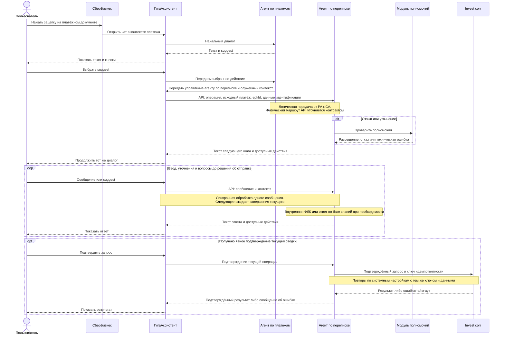
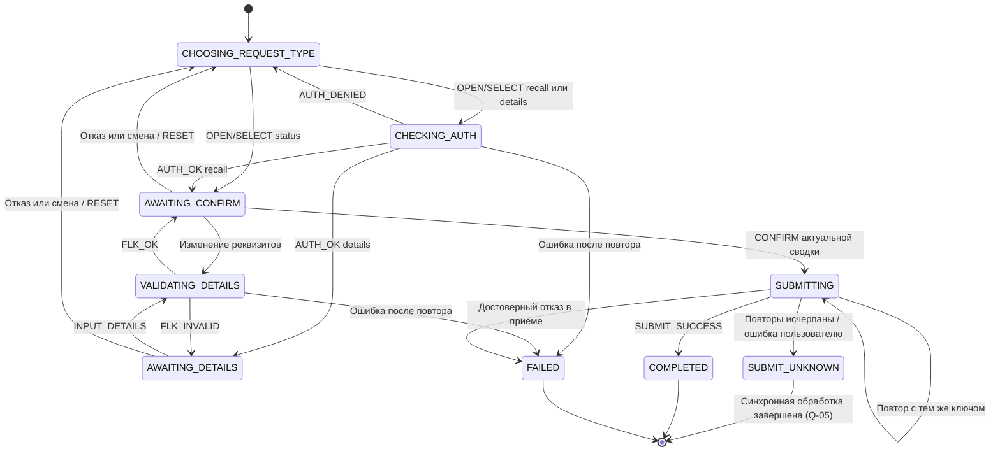

# Агент по переписке по платежам: единые бизнес-требования и матрица переходов

**Проект:** invest-pro. **Основание:** INVTEAM-8487. **Версия:** 1.1 от 27.09.2026.

**Статус:** требования консолидированы с учётом дополнительных решений заказчика. Вопросы о базе знаний, сбросе и последовательной обработке сообщений закрыты; повторы Invest corr определяются системными настройками приложения. Последствия неизвестного результата Invest corr отложены для обсуждения с бизнесом в Q-05 раздела 15.

## 1. Назначение и источники

Агент по переписке помогает пользователю СберБизнес сформировать и подтвердить запрос в банк по конкретному платёжному документу. Поддерживаются запрос статуса, запрос отзыва и запрос уточнения реквизитов. Агент также отвечает на вопросы пользователя на основании небольшой предметной базы знаний.

Результат операционного сценария — принятие подтверждённого запроса модулем Invest corr. Принятие запроса не означает, что банк уже отозвал платёж, изменил реквизиты или завершил рассмотрение.

Источники:

- [Исходное описание машины состояний](initial_doc.md).
- [Исходная диаграмма взаимодействий](plantuml.puml).
- [Нумерация первоначальных вопросов](kjh.txt).
- Ответы и описание взаимодействия систем, предоставленные заказчиком в переписке 27.09.2026.

При расхождении с исходными документами приоритет имеют последние ответы заказчика, отражённые здесь. Исходные документы остаются материалами предыдущей версии; для реализации используется настоящий документ с учётом статуса открытых вопросов. Отсутствующий `sequence-diagram-plantuml.md` не используется как источник.

## 2. Участники и границы ответственности

| Участник | Ответственность |
|---|---|
| Пользователь | Работает с платёжным документом, выбирает операцию, вводит реквизиты, подтверждает запрос, отказывается или задаёт вопросы. |
| СберБизнес | Предоставляет платёжный документ и зацепку — пиктограмму ГигаАссистента. |
| ГигаАссистент | Предоставляет окно чата, показывает сообщения и suggest-кнопки, доставляет сообщения, переключает активную сессию между агентами. |
| Агент по платежам | Агент соседнего подразделения. Ведёт начальный диалог и при выборе suggest передаёт управление и служебный контекст агенту по переписке. |
| Агент по переписке | Разрабатываемый модуль. Ведёт сценарий выбранной операции, проверяет полномочия через внешний модуль, извлекает и проверяет реквизиты, получает подтверждение, обращается в Invest corr и отвечает по базе знаний. |
| Модуль проверки полномочий | Возвращает доступность операции для переданного пользователя/клиента и платежа. Точная идентификация участников определяется интеграционным контрактом. |
| Invest corr | Принимает подтверждённый запрос; обеспечивает согласованную идемпотентность повторных вызовов. Дальнейшая банковская обработка находится за границей этого сценария. |
| База знаний | Содержит согласованные сведения, на основании которых агент по переписке отвечает на предметные вопросы. |

### 2.1. Что входит в объём разработки

- API агента по переписке для первоначального управляющего сообщения и последующих пользовательских сообщений.
- Обработка трёх типов запросов и явного подтверждения перед отправкой.
- Отмена подготовки запроса и переключение между операциями.
- Проверка полномочий, внутренняя ФЛК, обработка отказов и технических ошибок.
- Формирование текстовых ответов и описаний доступных действий для отображения в существующем чате.
- Поиск в базе знаний и ответы на вопросы.
- Защита от повторной отправки одного подтверждённого запроса.

### 2.2. Что находится за границами

- Разработка окна чата, управление браузером и интерфейсом платёжного документа.
- Реализация агента по платежам и платформенного механизма переключения агентов.
- Исполнение отзыва или изменения реквизитов непосредственно в банке.
- Получение и обработка окончательного ответа банка после принятия запроса Invest corr.
- Отправка СМС самим агентом по переписке.
- Напоминания и автоматическое завершение по пользовательскому бездействию: заказчик не требует этих действий.

## 3. Термины и жизненные циклы

| Термин | Определение |
|---|---|
| Зацепка | Пиктограмма ГигаАссистента на платёжном документе в СберБизнес. |
| Suggest | Кнопка с предлагаемым действием. Базовые действия: статус, отзыв, уточнение реквизитов. |
| Диалог ГигаАссистента | Внешний чат, визуально непрерывный при переключении агентов. Его жизненный цикл принадлежит ГигаАссистенту. |
| Сессия агента по переписке | Участок обработки диалога нашим агентом, начинающийся при передаче управления после выбора suggest. |
| Операция | Одна попытка подготовить и отправить запрос определённого типа по одному платежу. |
| Отмена операции | Отказ от ещё не отправленного запроса со сбросом подготовки и введённых уточнений. Исходный платёж, `epkId` пользователя и дополнительные данные идентификации сохраняются. Не является запросом отзыва банковского платежа. |
| Запрос отзыва | Операция `recall`, требующая проверки полномочий и подтверждения пользователя перед передачей в Invest corr. |
| Служебный контекст | Исходные данные платежа, `epkId` пользователя, полученные при идентификации дополнительные данные и сведения маршрутизации. Не очищается при отмене или смене операции. |
| Черновик | Введённые пользователем новые значения реквизитов до отправки запроса. |
| ФЛК | Форматно-логический контроль реквизитов, выполняемый внутри агента по переписке. |

Отмена операции, завершение операции и закрытие браузера — разные события. Ни отмена подготовки запроса, ни его принятие Invest corr сами по себе не закрывают внешнее окно чата.

## 4. Зафиксированные решения заказчика

Буквы ответов ниже относятся к первоначальному нумерованному списку, а не к порядку вариантов в последующей форме.

| № | Ответ | Принятое бизнес-правило |
|---|---|---|
| 1 | А | Сессия нашего агента начинается после первого выбора suggest; выбранная операция обрабатывается сразу. |
| 2 | Б | При отказе в полномочиях недоступны и отзыв, и уточнение; остаётся запрос статуса. |
| 3 | Б | Реквизиты вводятся сообщением в чате. Агент извлекает данные; при непонятном вводе просит уточнить, сохраняя текущий сценарий. |
| 4 | А | Допустимо уточнить одно или несколько полей; проверяются изменяемые поля. |
| 5 | Б | Нужна отдельная таблица проверок и сообщений ФЛК; конкретные правила подлежат согласованию. |
| 6 | А | ФЛК выполняется внутри агента по переписке. |
| 7 | Уточнён | Любой явно выраженный отказ от подтверждения отменяет текущую операцию: «нет», «отказ», «передумал», «давайте другую операцию». |
| 8 | Уточнён | Пользователь может закрыть браузер. Доставка серверу отдельного события закрытия не подтверждена. |
| 9 | Б с уточнением | При технической ошибке проверки полномочий или ФЛК выполняется один автоматический повтор. После неудачного повтора пользователь получает сообщение о невозможности выполнить операцию. |
| 10 | А | Повторная отправка в Invest corr использует тот же ключ идемпотентности и не создаёт дубликат запроса. |
| 11 | Уточнён | При отмене/смене забываются введённые уточнения и прежнее подтверждение. Исходный платёж, `epkId` пользователя и дополнительные данные идентификации никогда не очищаются событиями сброса операции. |
| 12 | Уточнён | Если пользователь не отвечает, агент ничего не предпринимает. |
| Дополнение 1 | База знаний | На вопрос агент отвечает по базе знаний и продолжает операцию с того же шага. |
| Дополнение 2 | Обработка сообщений | Сообщения одного диалога обрабатываются последовательно и синхронно. Следующее, в том числе отмена, обрабатывается только после завершения текущего запроса и передачи управления пользователю. |
| Дополнение 3 | Повторы Invest corr | Количество и параметры повторов определяются системными настройками ретраев приложения; фиксированного бизнес-лимита «один повтор» нет. |
| Дополнение 4 | Неизвестный результат Invest corr | Если после предусмотренных повторов результат не получен, пользователю возвращается ошибка. Запрос при этом фактически мог быть принят и запущен. Дальнейшее поведение отложено для обсуждения с бизнесом — Q-05. |

## 5. Вход в сценарий и взаимодействие систем

1. Пользователь открывает платёжный документ в СберБизнес и нажимает зацепку.
2. ГигаАссистент открывает окно чата. Начальный диалог ведёт агент по платежам.
3. В чате отображаются suggest-кнопки: «Запросить статус платежа», «Отозвать платёж», «Уточнить реквизиты».
4. Пользователь выбирает одну из кнопок.
5. Агент по платежам формирует управляющее сообщение для агента по переписке с выбранной операцией, служебными данными платежа, `epkId` пользователя и доступными данными идентификации.
6. ГигаАссистент переключает активную сессию на агента по переписке. Для пользователя остаётся тот же чат.
7. В API нашего агента поступает управляющее сообщение. Агент проверяет полноту и согласованность контекста, создаёт операцию и начинает выбранный сценарий.
8. Ответ API содержит текст для отображения в чате и, когда нужны кнопки, описание доступных действий. Формат кнопок определяется контрактом ГигаАссистента.
9. Следующие сообщения пользователя доставляются активному агенту по переписке. Каждое сообщение обрабатывается синхронно с учётом текущего состояния и возвращает текстовый результат. Следующее сообщение берётся в обработку только после завершения текущего обращения и возврата управления пользователю.

Первый выбор операции уже сделан до начала работы нашего агента. Повторно спрашивать тот же тип запроса при корректном первоначальном сообщении не требуется. Состояние выбора нужно после отмены, отказа в полномочиях или завершения предыдущей операции.

Диаграмма показывает границы участников и основной обмен. Все ветви ошибок, отмены и повторов определяются матрицами раздела 12.

## 6. Контекст и логический контракт API

Названия ниже описывают назначение данных; это не утверждённые JSON-поля, URL или схема конкретного API.

### 6.1. Первоначальное управляющее сообщение

| Данные | Требование |
|---|---|
| Тип операции | Одно значение: `status`, `recall`, `details`. Тип определяется служебным кодом действия, а не только текстом кнопки. |
| Данные платежа | Идентификатор и сведения, достаточные для однозначного определения платежа, формирования сводки, проверки полномочий и обращения в Invest corr. Точный состав необходимо согласовать. |
| Данные организации | Передаются в составе служебного контекста, если нужны для сводки и целевого запроса. |
| `epkId` пользователя | Передаётся агентом по платежам и сохраняется при отмене, смене и повторной подготовке операции. Формат поля определяется интеграционным контрактом. |
| Дополнительные данные идентификации | Полученные сведения о пользователе/клиенте, необходимые для идентификации и проверки полномочий. Сохраняются вместе с исходным платежом и `epkId`; их точный состав определяется контрактом. |
| Контекст диалога | Позволяет доставить ответ в тот же чат и связать последующие сообщения с правильной операцией. |
| Идентификатор сообщения/вызова | Позволяет отличить повторную доставку от нового пользовательского действия. Конкретный механизм определяется контрактом. |

При отсутствующем или противоречивом обязательном контексте операция не запускается. Агент возвращает контролируемую ошибку, не угадывает платёж или пользователя и не вызывает Invest corr.

### 6.2. Последующие сообщения и ответ

- Вход: текст пользователя или код suggest, идентификаторы диалога/сообщения и достаточный доверенный контекст для привязки к операции.
- Ответ: текст для отображения пользователю; при необходимости — доступные suggest и служебные данные маршрутизации.
- Платёж и идентичность пользователя не подменяются значениями, извлечёнными из произвольного сообщения. Ввод реквизитов описывает изменения получателя, а не выбор другого платёжного документа.
- После сброса подготовки нельзя восстанавливать отменённые уточнения или подтверждение из текста истории чата.
- Для следующей операции используются сохранённые исходный платёж, `epkId` и дополнительные данные идентификации. Повторно получать их только из-за отмены не требуется. Ограничение «только статус» не снимается сменой операции.
- В пределах одного диалога API обрабатывает сообщения последовательно и синхронно, включая вызовы зависимостей и предусмотренные повторы. Одновременно выполняющегося второго пользовательского сообщения в этой сессии нет.
- Ответ текущего вызова возвращает управление пользователю. Только после этого следующее сообщение оценивается по уже достигнутому состоянию; отмена не прерывает выполняющийся вызов.
- При исчерпании попыток без получения результата Invest corr текущий вызов завершается сообщением об ошибке. Фоновая сверка или доставка позднего ответа не считаются согласованной возможностью; вопрос отложен в Q-05.

### 6.3. Сохраняемый контекст и рабочие данные операции

Данные разделяются по правилам сброса, а не по обязательному способу физического хранения.

| Сохраняемый контекст | Поведение при отмене/смене операции |
|---|---|
| Исходный платёж | Сохраняется без подмены введёнными пользователем уточнениями. |
| `epkId` пользователя | Сохраняется. |
| Дополнительные данные идентификации | Сохраняются; отмена подготовки их не аннулирует. |
| Привязка к диалогу и ограничение «только статус» | Смена операции не разрывает привязку и не обходит полученное ограничение доступа. |

Перечисленные исходные данные никогда не очищаются бизнес-переходами отмены, смены, завершения или ошибки операции. Это требование не задаёт срок архивного хранения данных после завершения внешней сессии; технические сроки хранения определяются отдельно.

| Данные | Назначение |
|---|---|
| Идентификатор и версия операции | Привязка пользовательских событий и результатов обработки к конкретной попытке. |
| Текущий тип и состояние | Выбор допустимых переходов. |
| Ссылка на сохраняемый служебный контекст | Исходный платёж, `epkId`, данные идентификации и маршрутизации; не является удаляемым черновиком. |
| Результат проверки полномочий | Разрешение для текущей подготовки; при отказе действует бизнес-ограничение на обе операции. |
| Новые значения реквизитов | Только поля, которые пользователь хочет уточнить. |
| Сводка и её версия | Точные данные, подтверждение которых ожидается. |
| Число технических попыток | Контроль повторов конкретного действия; для Invest corr предел и параметры берутся из системных настроек ретраев. |
| Ключ идемпотентности и отправляемые данные | Защита одного подтверждённого запроса от дублирования в Invest corr. |

Это логическая модель, а не требование хранить всё в базе данных. Технология и сроки технического хранения определяются отдельно.

## 7. Бизнес-правила

### 7.1. Выбор операции и полномочия

**BR-01.** `status` означает создание запроса статуса через Invest corr. Это не обещание мгновенно получить текущий банковский статус из базы знаний.

**BR-02.** Для `status` специальная проверка полномочий в модуле из исходного сценария не выполняется. Это не отменяет идентификацию пользователя и проверку принадлежности служебного контекста на интеграционном входе.

**BR-03.** Перед подготовкой `recall` и `details` выполняется проверка полномочий.

**BR-04.** Бизнес-отказ модуля полномочий в любой из этих операций означает, что доступны только запрос статуса и информационные ответы. Обе кнопки `recall`/`details` исключаются из доступных действий. Ручной ввод или старая кнопка не обходят ограничение.

**BR-05.** Техническая ошибка проверки не является отказом в полномочиях. Она обрабатывается по правилам повторов; сообщение «Вам доступен только запрос на статус» в этом случае не используется.

### 7.2. Ввод, проверка и подтверждение

**BR-06.** Для `details` пользователь может передать любое непустое подмножество четырёх полей: ИНН получателя, счёт получателя, наименование получателя, назначение платежа.

**BR-07.** Агент извлекает поля из текста. Если нельзя однозначно определить поле или значение, он задаёт уточняющий вопрос. Непонятный ввод не отменяет операцию и не считается согласием.

**BR-08.** ФЛК проверяет только передаваемые изменения. Неизменяемые поля не запрашиваются как обязательные без отдельного согласованного правила зависимости.

**BR-09.** При ошибках ФЛК пользователь получает конкретные ошибки соответствующих полей и остаётся в сценарии ввода. Ошибка счёта не объясняется сообщением об ИНН.

**BR-10.** Перед любой отправкой агент показывает сводку: тип запроса, данные платежа, необходимые сведения об организации, а для уточнения — список полей и их новых значений.

**BR-11.** Отправка возможна только после однозначного положительного подтверждения последней показанной сводки текущей операции. Клик на первоначальный suggest не является таким подтверждением.

**BR-12.** Положительное слово внутри вопроса, цитаты или неоднозначного сообщения не считается подтверждением. Если пользователь одновременно соглашается и меняет данные, сначала уточняются/проверяются изменения и показывается новая сводка.

### 7.3. Отмена, смена операции и сброс

**BR-13.** Любой распознанный отказ от подтверждения отменяет подготовку текущего запроса: «нет», «отказ», «передумал», «не отправляйте», «давайте другую операцию». Отдельное слово-команда `CANCEL` пользователю не требуется.

**BR-14.** При выборе другой операции до отправки текущая отменяется. Если новый тип однозначно указан и разрешён, начинается новая подготовка; иначе агент предлагает выбрать доступное действие.

**BR-15.** При отмене/смене сбрасываются рабочий тип, введённые пользователем уточнения реквизитов, результат их ФЛК и старое подтверждение. Отменённые уточнения не переносятся в новую операцию. Исходные данные самого платежа, `epkId` пользователя и полученные дополнительные данные идентификации всегда сохраняются. Новый запрос использует этот исходный контекст, но требует собственной подготовки и подтверждения.

**BR-16.** Внешняя история чата принадлежит ГигаАссистенту. Требование сброса не означает удаления сообщений из интерфейса внешней системы. История не используется для автоматического восстановления отменённого черновика.

**BR-17.** Сообщение об отмене обрабатывается только когда управление возвращено пользователю и завершена обработка предыдущего сообщения. Синхронная проверка или отправка не прерывается последующим сообщением. После завершения предыдущего вызова отмена оценивается по текущему состоянию: до отправки отменяет подготовку, после принятия запроса не отменяет его задним числом. Отмена подготовки не заменяет самостоятельный банковский запрос отзыва. Случай неизвестного результата отправки вынесен в Q-05.

**BR-18.** Закрытие браузера не является гарантированным серверным событием. Оно само по себе не подтверждает запрос, не означает успешную отмену отправки и не запускает новую операцию.

**BR-19.** При бездействии пользовательский сценарий не меняется: агент не отправляет запрос, не напоминает и не отменяет его по собственному бизнес-таймеру. Тайм-ауты внешних вызовов остаются техническими событиями и подчиняются правилам ошибок.

### 7.4. Повторы и результаты

**BR-20.** При технической ошибке проверки полномочий или выполнения внутренней ФЛК разрешены первоначальная попытка и один автоматический повтор. После второй неудачи подготовка завершается с сообщением «Сейчас невозможно выполнить операцию. Попробуйте позже». Автоматического третьего вызова нет.

**BR-21.** Бизнес-отказ в полномочиях и ошибки пользовательских реквизитов не повторяются автоматически. Исправление реквизитов пользователем запускает новую проверку новой версии данных.

**BR-22.** Повтор отправки в Invest corr относится к тому же подтверждённому запросу: одинаковый ключ идемпотентности и одинаковые значимые данные. Повтор не создаёт новый банковский запрос. Количество повторов, интервалы и иные параметры политики берутся из системных настроек ретраев приложения; значение «один повтор» для Invest corr не фиксируется в бизнес-требованиях. Политика должна иметь конечное условие завершения, после которого синхронный вызов возвращает результат или ошибку. Правило BR-20 об одном повторе проверок полномочий/ФЛК остаётся отдельным.

**BR-23.** Только положительный ответ о принятии позволяет сообщить пользователю «Запрос принят в обработку». Тайм-аут сам по себе не доказывает ни принятие, ни отказ.

**BR-24.** Ошибочный, повторный или поздний результат не должен изменять другую операцию. Проверяются привязка к операции, её версия, тип действия и ожидаемое состояние. Для отправки используется также ключ идемпотентности.

**BR-25.** Повторная доставка подтверждения или сетевой повтор пользовательского сообщения не создаёт второй запрос. Для нового запроса требуются новая подготовка и новое подтверждение, а не просто новый ключ на повторном вызове.

**BR-26.** Если в рамках настроенной политики повторов не получена информация о результате выполнения запроса в Invest corr, пользователю возвращается сообщение об ошибке. Ошибка получения ответа не доказывает, что запрос не был принят или запущен. Исход неизвестен; дальнейшая сверка, повтор пользователем и возможная компенсация отложены для решения с бизнесом — Q-05. Текущая версия не обещает фоновую проверку результата и не предлагает безусловно отправить запрос заново.

## 8. Операционные сценарии

| Шаг | Запрос статуса | Запрос отзыва | Уточнение реквизитов |
|---|---|---|---|
| Вход | Получить `status` и служебный контекст. | Получить `recall` и служебный контекст. | Получить `details` и служебный контекст. |
| Полномочия | Специальная проверка не требуется. | Проверить через внешний модуль. | Проверить через внешний модуль. |
| Подготовка | Сформировать сводку. | При разрешении сформировать сводку. | При разрешении запросить новые реквизиты и выполнить внутреннюю ФЛК. |
| Подтверждение | Показать сводку запроса статуса. | Показать сводку запроса отзыва. | Показать платёж и полный список передаваемых изменений. |
| Положительное решение | Передать подтверждённый запрос в Invest corr. | Передать подтверждённый запрос в Invest corr. | Передать подтверждённые изменения в Invest corr. |
| Отказ/смена | Отменить подготовку, сохранить исходный платёж и данные идентификации. | То же. | Дополнительно удалить все введённые новые значения реквизитов. |
| Успешный приём | Сообщить о принятии запроса. | Сообщить о принятии запроса, не об исполненном отзыве. | Сообщить о принятии запроса, не о фактическом изменении реквизитов. |

После отказа в полномочиях показываются только запрос статуса и возможность задать вопрос. После технической ошибки показывается сообщение о невозможности выполнить операцию; автоматического предложения бесконечно повторять тот же неудачный шаг нет.

## 9. Реквизиты и ФЛК

### 9.1. Таблица требований к полям

Конкретные банковские форматы пока не утверждены. Таблица фиксирует необходимый объём согласования; неподтверждённые ограничения нельзя считать готовыми правилами реализации.

| Поле | Согласованное поведение | Требуется согласовать | Пример сообщения, подлежащий согласованию |
|---|---|---|---|
| ИНН получателя | Поле может быть единственным изменением; проверяется, если передано. | Допустимые значения, длина, набор символов, контрольные проверки, случаи отсутствия ИНН. В исходнике указаны 10 или 12 символов, но полной спецификации нет. | «Проверьте ИНН получателя: {конкретная причина}». |
| Счёт получателя | Поле может быть единственным изменением; значение не додумывается агентом. | Поддерживаемые виды счетов, формат, длина, допустимые символы и зависимые проверки. | «Проверьте счёт получателя: {конкретная причина}». |
| Наименование получателя | Передаётся новое значение, указанное пользователем. | Допустимая длина, символы, обработка пробелов и пустого значения. | «Проверьте наименование получателя: {конкретная причина}». |
| Назначение платежа | Передаётся новый текст назначения. | Длина, символы, обязательные элементы и ограничения целевой системы. | «Проверьте назначение платежа: {конкретная причина}». |

### 9.2. Общие правила

- Для запроса уточнения требуется минимум одно распознанное поле с новым значением.
- Отсутствующее поле означает «не изменять». Значение «очистить поле» не поддерживается автоматически до согласования такого действия.
- Если в сообщении несколько несовместимых значений одного поля, агент уточняет нужное значение.
- При нескольких ошибках ответ перечисляет ошибки по полям.
- При исправлении в рамках той же операции корректные значения могут оставаться в её текущем рабочем контексте; сброс обязателен при отмене/смене операции. Это не сохранение отменённого черновика.
- Изменение реквизитов после показа сводки аннулирует прежнее подтверждение, запускает ФЛК новой версии и требует новой сводки.
- Логическая ошибка входных данных возвращает `FLK_INVALID`. Исключение или иной технический сбой выполнения проверки возвращает `FLK_ERROR` и запускает единственный повтор.

## 10. Произвольные вопросы и база знаний

### 10.1. Обязательное поведение

- Агент различает операционное действие, ввод реквизитов, отказ, подтверждение и информационный вопрос.
- На предметные вопросы агент ищет ответ в согласованной базе знаний и формирует понятный ответ в том же чате.
- Если подходящих сведений нет, агент сообщает, что в базе знаний нет достаточной информации, и предлагает уточнить вопрос. Не следует придумывать банковские условия, сроки или состояние конкретного платежа.
- Ответ из базы знаний сам по себе не вызывает Invest corr, не заменяет проверку полномочий и не подтверждает операцию.
- Техническая недоступность базы знаний отличается от отсутствия статьи; пользователю сообщается о временной невозможности получить справочную информацию.
- Владелец базы знаний, её состав, правила обновления и источники правильных ответов определяются по Q-07.

### 10.2. Вопрос не отменяет подготовку

Агент отвечает на вопрос и сохраняет шаг незавершённой операции. После ответа он кратко напоминает, какое действие ожидается. Например, после вопроса «Что означает отзыв?» на шаге подтверждения он отвечает и снова предлагает подтвердить или отменить запрос.

Правило подтверждено заказчиком. Оно не распространяется на явный отказ или выбор другой операции: они сбрасывают подготовку по BR-13–BR-15 с сохранением исходного контекста. Вопрос, заданный без активной операции, не создаёт банковский запрос.

### 10.3. Разрешение неоднозначных сообщений

| Пример | Интерпретация и действие |
|---|---|
| «Нет, передумал» | Отказ от текущей подготовки; сброс. |
| «Нет, лучше запросить статус» | Отказ от текущей операции и начало новой `status` при наличии доверенного контекста. |
| «Давайте другую операцию» | Сброс и показ доступных действий; новый тип не угадывается. |
| «Какие реквизиты можно уточнить?» | Информационный вопрос; ответ по базе знаний. Текущая операция и шаг сохраняются. |
| «Да, но счёт должен быть другим…» | Не отправлять. Обработать изменение и заново запросить подтверждение. |
| «А если я скажу “нет”?» | Вопрос об отказе, а не команда отмены. |
| «Да» на шаге ввода реквизитов | Недостаточный ввод; запросить реквизиты. Не отправлять запрос. |
| «Да» в ответ на уточняющий вопрос агента | Ответ на этот вопрос; не считать подтверждением банковского запроса без явно актуальной сводки. |

При наличии ясного отказа он исключает отправку. Если сообщение содержит несовместимые намерения, агент уточняет действие и не отправляет запрос. Одни и те же слова распознаются с учётом контекста, а не по отдельному ключевому слову.

## 11. Модель состояний

Машина описывает работу агента по переписке. Внешняя сессия ГигаАссистента не является состоянием этой машины. `CHOOSING_REQUEST_TYPE` означает отсутствие активной подготовки; это не обязательный первый пользовательский экран.

| Состояние | Значение | Что ожидается |
|---|---|---|
| `CHOOSING_REQUEST_TYPE` | Активная операция отсутствует; можно выбрать доступную операцию или задать вопрос. | Действие пользователя или управляющее сообщение. |
| `CHECKING_AUTH` | Выполняется проверка полномочий на отзыв/уточнение. | Результат модуля, включая технический тайм-аут. |
| `AWAITING_DETAILS` | Ожидаются новые реквизиты или исправления. | Сообщение пользователя. |
| `VALIDATING_DETAILS` | Выполняется внутренняя ФЛК текущей версии реквизитов. | Результат проверки. |
| `AWAITING_CONFIRM` | Показана актуальная сводка; ожидается решение пользователя. | Подтверждение, отказ, изменение, вопрос. |
| `SUBMITTING` | Подтверждённый запрос отправляется в Invest corr; допустимы повторы того же запроса. | Достоверный результат приёма или исчерпание повторов. |
| `SUBMIT_UNKNOWN` | Синхронный вызов завершён сообщением об ошибке, но результат Invest corr неизвестен: запрос мог быть принят/запущен. | Это зафиксированный неопределённый исход, а не выполняющийся фоновый запрос. Дальнейшие бизнес-переходы отложены в Q-05. |
| `COMPLETED` | Invest corr подтвердил принятие запроса. | Текущая операция завершена. |
| `FAILED` | Подготовка технически не выполнена либо получен достоверный отказ в приёме запроса. | Текущая операция завершена с ошибкой. |

Отмена является бизнес-исходом `CANCELLED`, после которого подготовка и введённые уточнения очищаются, а агент переходит к `CHOOSING_REQUEST_TYPE` либо сразу начинает явно выбранную новую операцию. Исходный платёж и данные идентификации сохраняются. Отдельное устойчивое состояние с сохранённым отменённым черновиком не создаётся.

`COMPLETED` и `FAILED` завершают текущую операцию, но не закрывают внешний чат. Начало новой операции после этих исходов требует нового пользовательского выбора, доверенного контекста и собственного подтверждения.

`CHECKING_AUTH`, `VALIDATING_DETAILS` и `SUBMITTING` — внутренние состояния синхронной обработки одного сообщения. Во время их выполнения пользовательские сообщения не обрабатываются параллельно. Ответ пользователю возвращается по завершении текущей обработки, после чего разбирается следующее сообщение.

## 12. Матрицы переходов

### 12.1. Обозначения и общие условия

- `OPEN(type)` — первоначальное доверенное управляющее сообщение после suggest.
- `SELECT(type)` — последующий выбор доступного типа в чате, кнопкой или однозначным текстом.
- `REFUSE` — распознанный отказ от текущей подготовки.
- `QUESTION` — информационный вопрос; ответ сохраняет текущий шаг подготовки.
- `AUTH_DENIED` — бизнес-отказ; `AUTH_ERROR` — технический сбой/тайм-аут.
- `FLK_INVALID` — ошибки данных; `FLK_ERROR` — техническая ошибка выполнения проверки.
- `SUBMIT_REJECTED` — достоверный отказ Invest corr, при котором контракт однозначно гарантирует отсутствие принятого запроса. Не любой ответ об ошибке является таким отказом.
- `SUBMIT_UNCERTAIN` — тайм-аут или ошибка, при которой принятие запроса неизвестно.
- `RESET` — очистка подготовки и пользовательских уточнений по BR-15 с обязательным сохранением исходного платежа, `epkId` и дополнительных данных идентификации; не используется для потери сведений о запросе, который уже мог быть принят Invest corr.
- `START(type)` — переход по строкам M-01–M-03 с новой подготовкой и сохранённым исходным контекстом; это обозначение действия, а не дополнительное состояние.

Каждое событие применяется только к соответствующей операции и версии. Ограничение «только статус» проверяется при любом запуске, независимо от текста и видимости кнопок. Автоматический повтор проверки возможен только для той же версии входных данных. Неописанное или недопустимое событие не инициирует отправку.

### 12.2. Основной сценарий и проверки

| ID | Текущее состояние | Событие | Условие | Следующее состояние | Действия и ответ |
|---|---|---|---|---|---|
| M-01 | Нет операции / `CHOOSING_REQUEST_TYPE` | `OPEN(status)` / `SELECT(status)` | Доверенный контекст корректен. | `AWAITING_CONFIRM` | Создать операцию `status`, показать сводку и запросить подтверждение. |
| M-02 | Нет операции / `CHOOSING_REQUEST_TYPE` | `OPEN(recall)` / `SELECT(recall)` | Контекст корректен; ограничения «только статус» нет. | `CHECKING_AUTH` | Создать операцию `recall`, начать первую проверку полномочий. |
| M-03 | Нет операции / `CHOOSING_REQUEST_TYPE` | `OPEN(details)` / `SELECT(details)` | Контекст корректен; ограничения «только статус» нет. | `CHECKING_AUTH` | Создать операцию `details`, начать первую проверку полномочий. |
| M-04 | Нет операции / `CHOOSING_REQUEST_TYPE` | `OPEN` / `SELECT` | Контекст неполон, противоречив или тип неизвестен. | `CHOOSING_REQUEST_TYPE` | Не создавать операцию; вернуть контролируемое сообщение об ошибке входа. |
| M-05 | `CHOOSING_REQUEST_TYPE` | `OPEN(recall/details)` / `SELECT(recall/details)` | Действует ограничение «только статус». | `CHOOSING_REQUEST_TYPE` | Не запускать подготовку; сообщить, что доступен только статус. |
| M-06 | `CHECKING_AUTH` | `AUTH_OK` | Ответ относится к текущему `recall`. | `AWAITING_CONFIRM` | Показать сводку отзыва. |
| M-07 | `CHECKING_AUTH` | `AUTH_OK` | Ответ относится к текущему `details`. | `AWAITING_DETAILS` | Перечислить четыре доступных поля и попросить указать изменения. |
| M-08 | `CHECKING_AUTH` | `AUTH_DENIED` | Бизнес-отказ. | `CHOOSING_REQUEST_TYPE` | Завершить подготовку; сохранить исходный контекст; запретить отзыв и уточнение в текущем диалоге по данному платежу, показать только статус. Смена операции не снимает ограничение. |
| M-09 | `CHECKING_AUTH` | `AUTH_ERROR` | Ошибка первой попытки. | `CHECKING_AUTH` | Выполнить один автоматический повтор. |
| M-10 | `CHECKING_AUTH` | `AUTH_ERROR` | Ошибка повторной попытки. | `FAILED` | Сообщить о невозможности выполнить операцию; очистить подготовку, не вызывать Invest corr. |
| M-11 | `AWAITING_DETAILS` | `INPUT_DETAILS` | Распознано хотя бы одно поле; значения однозначны. | `VALIDATING_DETAILS` | Сформировать новую версию изменений; начать внутреннюю ФЛК. |
| M-12 | `AWAITING_DETAILS` | `UNCLEAR_INPUT` | Поля или значения неясны. | `AWAITING_DETAILS` | Задать уточняющий вопрос; не сбрасывать текущую операцию. |
| M-13 | `VALIDATING_DETAILS` | `FLK_OK` | Проверена актуальная версия всех передаваемых изменений. | `AWAITING_CONFIRM` | Показать новую сводку платежа и изменений. |
| M-14 | `VALIDATING_DETAILS` | `FLK_INVALID` | Ошибки пользовательских данных. | `AWAITING_DETAILS` | Показать ошибки соответствующих полей и запросить исправления. |
| M-15 | `VALIDATING_DETAILS` | `FLK_ERROR` | Ошибка первой попытки. | `VALIDATING_DETAILS` | Один раз повторить внутреннюю проверку той же версии данных. |
| M-16 | `VALIDATING_DETAILS` | `FLK_ERROR` | Ошибка повторной попытки. | `FAILED` | Сообщить о невозможности выполнить операцию; очистить подготовку. |
| M-17 | `AWAITING_CONFIRM` | `CONFIRM` | Явное согласие с актуальной сводкой; подготовка соответствующего типа завершена. | `SUBMITTING` | Зафиксировать данные запроса и ключ идемпотентности; выполнить отправку. |
| M-18 | `AWAITING_CONFIRM` | `CHANGE_DETAILS` | Тип `details`; пользователь изменяет реквизиты. | `VALIDATING_DETAILS` | Аннулировать прежнюю сводку/подтверждение; проверить новую версию данных. |
| M-19 | `AWAITING_CONFIRM` | `UNCLEAR_INPUT` | Нет однозначного решения или изменения. | `AWAITING_CONFIRM` | Уточнить намерение; при необходимости повторить сводку. |

### 12.3. Отмена, смена операции и вопросы

| ID | Текущее состояние | Событие | Условие | Следующее состояние | Действия и ответ |
|---|---|---|---|---|---|
| D-01 | `AWAITING_DETAILS` / `AWAITING_CONFIRM` | `REFUSE` | Новая операция не указана однозначно. | `CHOOSING_REQUEST_TYPE` | `RESET`; сообщить об отмене подготовки, предложить доступные действия. |
| D-02 | `AWAITING_DETAILS` / `AWAITING_CONFIRM` | `SELECT(other)` | Ясно выбран другой разрешённый тип; сохранённый исходный контекст корректен. | По `START(other)` | Отменить текущую подготовку, выполнить `RESET`, начать новую на исходном платеже без переноса уточнений и подтверждения. |
| D-03 | `AWAITING_DETAILS` / `AWAITING_CONFIRM` | `SELECT(other)` | Исходный контекст некорректен либо операция недоступна. | `CHOOSING_REQUEST_TYPE` | Отменить текущую подготовку и сбросить уточнения; исходные данные сохранить; новую операцию не запускать. Объяснить причину. |
| D-04 | `AWAITING_DETAILS` / `AWAITING_CONFIRM` | `SELECT(current)` | Нет явного отказа/команды начать заново; повторно выбран текущий тип. | То же состояние. | Не создавать дубликат; напомнить текущий шаг. |
| D-05 | `CHOOSING_REQUEST_TYPE` | `REFUSE` / `UNCLEAR_INPUT` | Активной подготовки нет. | `CHOOSING_REQUEST_TYPE` | При отказе не запускать операцию; при неясном запросе уточнить доступное действие. |
| D-06 | `CHOOSING_REQUEST_TYPE` / `AWAITING_DETAILS` / `AWAITING_CONFIRM` | `QUESTION` | Найден ответ в базе знаний. | То же состояние. | Ответить; при активной подготовке напомнить ожидаемый шаг. |
| D-07 | Те же состояния | `QUESTION` | Ответ не найден или база недоступна. | То же состояние. | Сообщить об отсутствии сведений или технической недоступности; не отправлять запрос. |
| D-08 | `CHECKING_AUTH` / `VALIDATING_DETAILS` / `SUBMITTING` | Доставка следующего сообщения, в том числе отмены | Обработка предыдущего сообщения ещё выполняется. | Переход по новому сообщению пока не выполняется. | Сначала завершить текущий синхронный вызов и вернуть управление пользователю. Затем обработать следующее сообщение по достигнутому состоянию; выполняющийся вызов не прерывать. |
| D-09 | Любое состояние | Закрытие браузера | Серверное событие не гарантировано. | Нет перехода только на основании закрытия. | Не делать вывод об отмене/подтверждении. Уже начатая обработка следует своим правилам. |
| D-10 | Любое состояние ожидания пользователя | Бездействие | Новых сообщений нет. | То же состояние. | Ничего не предпринимать. |

D-08 фиксирует последовательность обработки, а не отдельный бизнес-переход. Например, после успешной проверки полномочий агент показывает сводку и возвращает управление пользователю; следующее сообщение «отмена» обрабатывается уже в `AWAITING_CONFIRM`. После успешной отправки следующее сообщение не может отменить принятый запрос. Реализация последовательной доставки определяется API-контрактом; требование не предписывает отдельную систему очередей.

### 12.4. Отправка, завершение и защита от дублей

| ID | Текущее состояние | Событие | Условие | Следующее состояние | Действия и ответ |
|---|---|---|---|---|---|
| S-01 | `SUBMITTING` | `SUBMIT_SUCCESS` | Получено достоверное принятие текущего запроса. | `COMPLETED` | Сообщить о принятии в обработку. |
| S-02 | `SUBMITTING` | `SUBMIT_REJECTED` | Контракт гарантирует, что запрос не принят. | `FAILED` | Сообщить об отказе/невозможности приёма в понятной форме. Не сообщать об успехе. |
| S-03 | `SUBMITTING` | `SUBMIT_UNCERTAIN` | Системные настройки ретраев допускают ещё одну попытку. | `SUBMITTING` | Повторить тот же запрос с тем же ключом и неизменными данными в рамках текущего синхронного вызова. |
| S-04 | `SUBMITTING` | `SUBMIT_UNCERTAIN` | Настроенная политика повторов исчерпана; результат не получен. | `SUBMIT_UNKNOWN` | Завершить синхронную обработку, вернуть пользователю сообщение об ошибке и управление. Не утверждать, что запрос точно не принят/не запущен. |
| S-05 | `SUBMIT_UNKNOWN` | Новая команда отправки, отказ или выбор другой операции | Предыдущая обработка завершена ошибкой, фактический результат неизвестен. | Бизнес-переход отложен в Q-05. | Не считать сообщение об ошибке доказательством отмены или неисполнения. Не включать автоматическую новую отправку или компенсацию как согласованное поведение. Правила следующих операционных действий должен определить бизнес. |
| S-06 | `COMPLETED` / `FAILED` | `SELECT(type)` / новое `OPEN(type)` | Это новый выбор, а не повтор доставки; исходный контекст корректен. | По `START(type)` | Начать новую подготовку с сохранёнными исходным платежом и данными идентификации, без восстановления предыдущих уточнений. |
| S-07 | `COMPLETED` / `FAILED` / `SUBMIT_UNKNOWN` | `QUESTION` | Предыдущий синхронный вызов завершён; поступил информационный вопрос. | То же состояние. | Ответить по базе знаний или сообщить об отсутствии ответа; справочный ответ не меняет исход операции. |
| S-08 | Любое | Повторная доставка уже обработанного сообщения | Совпадает идентификатор сообщения/действия. | Без повторного бизнес-перехода. | При последовательной обработке вернуть согласованный результат, не повторять банковскую операцию как новую. |
| S-09 | Любое | Чужой/устаревший результат проверки | Не совпадает операция, версия, тип или ожидаемый вызов. | Без изменения. | Не применять результат к текущей подготовке. Механизм получения результата Invest corr после уже возвращённой ошибки не предполагается и относится к Q-05. |
| S-10 | `COMPLETED` / `FAILED` | Отказ, старое подтверждение или неясный ввод | Нет нового однозначного выбора. | То же состояние. | Напомнить исход и предложить доступное новое действие; ничего не отправлять. |

`SUBMIT_UNKNOWN` отличает ошибку получения результата от достоверного отказа Invest corr. Пользователь уже получил ошибку, синхронная обработка закончена; это не ожидание в фоне. Переходы сверки, обработки позднего результата и повторной пользовательской отправки в текущую согласованную матрицу не включены. Вопрос Q-05 припаркован для бизнеса, поэтому строка S-05 сознательно обозначает незавершённое бизнес-решение.

### 12.5. Упрощённая диаграмма состояний

Диаграмма отображает основные пути. Матрицы выше являются полным описанием правил; информационные вопросы, повторные доставки и часть повторов на диаграмме опущены.

Начальный переход в `CHOOSING_REQUEST_TYPE` логический: при первоначальном `OPEN` выбранная операция запускается в том же обращении, без дополнительного вопроса о типе. При смене типа сброс и запуск явно выбранной новой операции также выполняются в рамках обработки одного сообщения.

Выход из `SUBMIT_UNKNOWN` в конечную точку означает только завершение текущей синхронной обработки. Он не означает, что запрос в Invest corr отменён, не принят или фактически завершён; дальнейшие действия относятся к Q-05.

## 13. Тексты ответов

Это смысловые шаблоны. Окончательные формулировки и названия кнопок согласуются с владельцем канала; обязательны корректный смысл и отсутствие неподтверждённого сообщения об успехе.

| Ситуация | Текст/состав ответа |
|---|---|
| Запрос статуса | «Вы хотите отправить запрос статуса по платежу {данные платежа} от {организация}. Подтверждаете отправку?» |
| Запрос отзыва | «Вы хотите отправить запрос на отзыв платежа {данные платежа} от {организация}. Подтверждаете отправку?» |
| Ввод уточнений | «Укажите реквизиты, которые нужно уточнить: ИНН получателя, счёт получателя, наименование получателя или назначение платежа. Можно изменить одно или несколько полей». |
| Подтверждение уточнения | «Вы хотите отправить запрос на уточнение реквизитов по платежу {данные платежа}: {поля и новые значения}. Подтверждаете отправку?» |
| Неясные реквизиты | Уточняющий вопрос с указанием того, какие поле или значение не удалось определить. |
| Ошибка ФЛК | Перечень конкретных ошибок по полям и просьба исправить их. |
| Нет полномочий | «Вам доступен только запрос на статус» и соответствующий suggest. |
| Отмена до отправки | «Подготовка запроса отменена». Далее доступные действия либо начало явно выбранной новой операции. |
| Повторная техническая ошибка проверки | «Сейчас невозможно выполнить операцию. Попробуйте позже». Это сообщение относится к проверкам до отправки в Invest corr. |
| Запрос принят | «Ваш запрос принят в обработку. О результатах узнаете в СМС от номера 900». Формулировка сохранена из исходного бизнес-сценария; доставку обеспечивает внешний процесс. |
| Ошибка получения результата Invest corr | «Произошла ошибка при получении результата запроса». Пользователю возвращается ошибка без утверждения, что запрос не выполнен, и без обещания фоновой сверки. Окончательное пояснение возможного фактического запуска и дальнейшие действия согласуются с бизнесом в Q-05. |
| Нет ответа в базе знаний | «В базе знаний нет достаточной информации для ответа на этот вопрос. Уточните, пожалуйста, вопрос». |
| База знаний недоступна | «Сейчас не удалось получить справочную информацию. Попробуйте позже». |

## 14. Критерии приёмки

Критерии отражают подтверждённые решения. Для неизвестного результата Invest corr проверяется возврат ошибки; дальнейшие бизнес-действия остаются в Q-05 и не выдаются за согласованные критерии.

| ID | Проверяемый сценарий | Ожидаемый результат |
|---|---|---|
| AC-01 | Пользователь выбирает suggest у агента по платежам. | Управление и контекст передаются нашему агенту; продолжается тот же чат; повторный выбор типа не запрашивается. |
| AC-02 | Первоначальная операция `status`. | Проверка полномочий данного сценария не вызывается; показывается сводка; без подтверждения Invest corr не вызывается. |
| AC-03 | Первоначальная операция `recall`, полномочия разрешены. | После проверки показывается сводка; подтверждение отправляет один запрос отзыва. |
| AC-04 | Первоначальная операция `details`, полномочия разрешены. | Запрашиваются изменения; после успешной внутренней ФЛК показывается сводка с новыми значениями. |
| AC-05 | Отказ в полномочиях на отзыв либо уточнение. | Обе операции недоступны в текущем диалоге по данному платежу, в том числе через старую кнопку/текст; статус доступен. Смена операции не снимает ограничение. |
| AC-06 | Пользователь меняет только назначение платежа. | ИНН, счёт и наименование не требуются как обязательный ввод; проверяется переданное изменение. |
| AC-07 | Непонятное сообщение на вводе реквизитов. | Агент задаёт уточняющий вопрос и остаётся в сценарии. |
| AC-08 | Ошибка конкретного поля. | Сообщение относится к этому полю; бизнес-ошибка не запускает автоматический технический повтор. |
| AC-09 | «Нет», «отказ», «передумал» на подтверждении. | Отправки нет; подготовка отменена; введённые уточнения и подтверждение сброшены. Исходный платёж, `epkId` и дополнительные данные идентификации сохранены. |
| AC-10 | В середине уточнения пользователь выбирает отзыв. | Введённые уточнения удалены; исходные реквизиты сохранены; запускается новая проверка полномочий и подготовка отзыва. |
| AC-11 | После отмены пользователь снова выбирает уточнение. | Отменённые уточнения не подставляются, требуется новый ввод и подтверждение; исходный контекст повторно не запрашивается из-за самой отмены. |
| AC-12 | Пользователь задаёт предметный вопрос во время подтверждения. | Ответ формируется по базе знаний; отправки нет; сохраняется шаг и повторяется приглашение принять решение. |
| AC-13 | Ответа в базе знаний нет. | Агент сообщает об отсутствии достаточной информации и не придумывает ответ. |
| AC-14 | Первый технический сбой проверки, затем успех. | Ровно один автоматический повтор; сценарий продолжается по успешному результату. |
| AC-15 | Обе попытки проверки технически неудачны. | Третьей попытки нет; пользователь получает сообщение о невозможности выполнить операцию; отправки нет. |
| AC-16 | Invest corr принял запрос, но ответ потерян. | Повтор имеет тот же ключ и данные; второй банковский запрос не создаётся. |
| AC-17 | По настроенной политике повторов результат Invest corr не получен. | Синхронный вызов завершается сообщением об ошибке; фиксируется `SUBMIT_UNKNOWN`, так как запрос мог фактически быть принят/запущен. Фоновая сверка не обещается; дальнейшие действия отложены в Q-05. |
| AC-18 | Двойной клик по подтверждению или повторная доставка сообщения. | Одна логическая отправка; новый ключ для дубликата не создаётся. |
| AC-19 | Результат проверки относится к предыдущей версии/операции. | Он не меняет текущую подготовку. |
| AC-20 | Пользователь изменяет реквизиты после сводки. | Старое согласие не используется; новая версия проходит ФЛК и отдельное подтверждение. |
| AC-21 | Пользователь не отвечает. | Нет напоминания, автоматической отмены и отправки по бездействию. |
| AC-22 | Пользователь закрывает браузер до подтверждения. | Сам факт закрытия не отправляет запрос. Порядок повторного открытия определяется внешней системой и контрактом Q-08. |
| AC-23 | Пользователь закрывает браузер после начала отправки. | Агент не делает ложный вывод об отмене; результат определяется Invest corr и правилами идемпотентности. |
| AC-24 | В управляющем сообщении отсутствует обязательный контекст. | Запрос не запускается; возвращается контролируемая ошибка без угадывания платежа или пользователя. |
| AC-25 | Входные сообщения разных чатов/пользователей обрабатываются одновременно. | Контекст, реквизиты и результаты не смешиваются. |
| AC-26 | Пользователь спрашивает фактический статус платежа. | Агент не выдаёт общую статью за банковский статус; предлагает соответствующий операционный сценарий или уточняет намерение. |
| AC-27 | Следующее сообщение содержит отмену, а предыдущий вызов выполняет проверку. | Отмена не прерывает проверку. После завершения обработки и возврата управления следующее сообщение обрабатывается по достигнутому состоянию; при ожидании подтверждения подготовка отменяется. |
| AC-28 | После подтверждения отправка ещё выполняется, затем обрабатывается сообщение «отмена». | Сообщения обрабатываются последовательно. Если Invest corr подтвердил принятие, последующая отмена не меняет исход задним числом; при неизвестном результате действует открытый вопрос Q-05. |
| AC-29 | В системных настройках изменено число повторов Invest corr. | Число попыток соответствует действующей политике приложения; все повторы используют один ключ и неизменные данные. Бизнес-код не фиксирует для corr ровно один повтор. |
| AC-30 | Операция отменена, сменена, завершена либо закончилась ошибкой. | Исходный платёж, `epkId` и дополнительные данные идентификации не удаляются этими переходами; пользовательские уточнения не подменяют исходные данные платежа. |

## 15. Согласованные уточнения и вопросы, оставленные на доработку

### 15.1. Закрытые вопросы

Прежние рабочие допущения заменены решениями заказчика; повторного согласования перечисленных вопросов не требуется.

| ID | Статус | Итоговое решение |
|---|---|---|
| Q-01 | Закрыт | Вопрос по базе знаний не отменяет операцию. Агент отвечает и продолжает с того же шага. |
| Q-02 | Закрыт | При отмене удаляются введённые уточнения и подготовка запроса. Исходный платёж, `epkId` пользователя и дополнительные данные идентификации сохраняются всегда при операционных переходах. |
| Q-03 | Закрыт | Отмена обрабатывается, когда управление передано пользователю. Пока синхронно выполняется текущее обращение, следующее сообщение не обрабатывается; оно разбирается после завершения текущего по достигнутому состоянию. |
| Q-04 | Закрыт | Повторы отправки в Invest corr определяются системными настройками ретраев приложения. Фиксированного числа повторов в бизнес-требованиях нет. |

### 15.2. Q-05 — припарковано: ошибка пользователю при возможном выполнении запроса в Invest corr

**Статус:** отложено по решению заказчика для отдельного обсуждения с бизнесом. В текущей версии не требуется выбирать окончательный процесс разрешения этого случая.

**Сценарий:** запрос отправлен в Invest corr. В пределах настроенной политики повторов подтверждение результата не получено. Наш агент завершает синхронный вызов и возвращает пользователю сообщение об ошибке. При этом Invest corr мог фактически принять запрос, запустить или выполнить свою операцию. Речь о результате взаимодействия с Invest corr, а не об окончательном ответе банка, который остаётся вне объёма агента.

**Уже согласовано:**

- Пользователь получает ошибку; бесконечного ожидания в текущем вызове нет.
- Ошибка ответа не является доказательством отсутствия принятого/запущенного запроса.
- Повторы одного подтверждённого запроса используют тот же ключ идемпотентности и неизменные данные.
- Исходный платёж, `epkId` и данные идентификации из-за ошибки не удаляются.

**Нужно дорешать с бизнесом и владельцем Invest corr:**

1. Точный текст ошибки и объяснение пользователю того, что запрос мог быть выполнен.
2. Действия пользователя после ошибки: допустим ли повтор той же операции, выбор другой операции и в каких условиях.
3. Нужна ли последующая сверка, кто её выполняет и какой интерфейс Invest corr для этого предусмотрен.
4. Нужно ли сообщать пользователю позднее установленный результат и каким способом.
5. Как отличать повтор неизвестного запроса от нового намерения пользователя и какие гарантии идемпотентности действуют после завершения нашего вызова.
6. Требуется ли отдельный бизнес-процесс при расхождении между показанной ошибкой и фактическим результатом в corr.

Фоновая сверка, автоматическая компенсация, успешная отмена и автоматический запуск нового запроса не считаются утверждёнными решениями. До закрытия Q-05 соответствующие дальнейшие переходы остаются явно незавершённой частью бизнес-требований.

### 15.3. Данные от владельцев интеграций и предметной области

| ID | Что требуется получить | Для чего необходимо |
|---|---|---|
| Q-06 | Согласованные проверки четырёх реквизитов, зависимости полей, коды и тексты ошибок. | Завершение таблицы ФЛК; исходного примера длины ИНН недостаточно. |
| Q-07 | Владелец, набор материалов и границы тем базы знаний; правила актуализации и ожидаемые ответы на контрольные вопросы. | Проверка корректности информационных ответов. |
| Q-08 | Контракт ГигаАссистента: управляющие сообщения, маршрутизация, идентификаторы, порядок последовательной доставки, повторы доставки, suggest, сроки синхронного ответа API, закрытие и повторное открытие чата. | Однозначная работа в чужом окне чата и передача управления. Закрытие окна не добавляет бизнес-таймер бездействия. |
| Q-09 | Схемы исходного платежа, `epkId` пользователя, дополнительных данных идентификации и организации; контракт модуля полномочий. | Состав сохраняемого служебного контекста и реализация ограничения доступа. |
| Q-10 | Контракт Invest corr: payload по каждому типу, ключ и срок идемпотентности, ответы на повтор, признаки принятия/отказа, ошибки, технические тайм-ауты; параметры и значения системных настроек ретраев. | Гарантия отсутствия дублей и достоверное сообщение результата. Последующая обработка неизвестного результата относится к припаркованному Q-05. |

Открытые вопросы не меняют подтверждённые пользовательские сценарии, но соответствующие ветви нельзя считать полностью согласованными до получения ответов. Дополнительные числовые ограничения и внешние возможности в этом документе не выдумываются.
