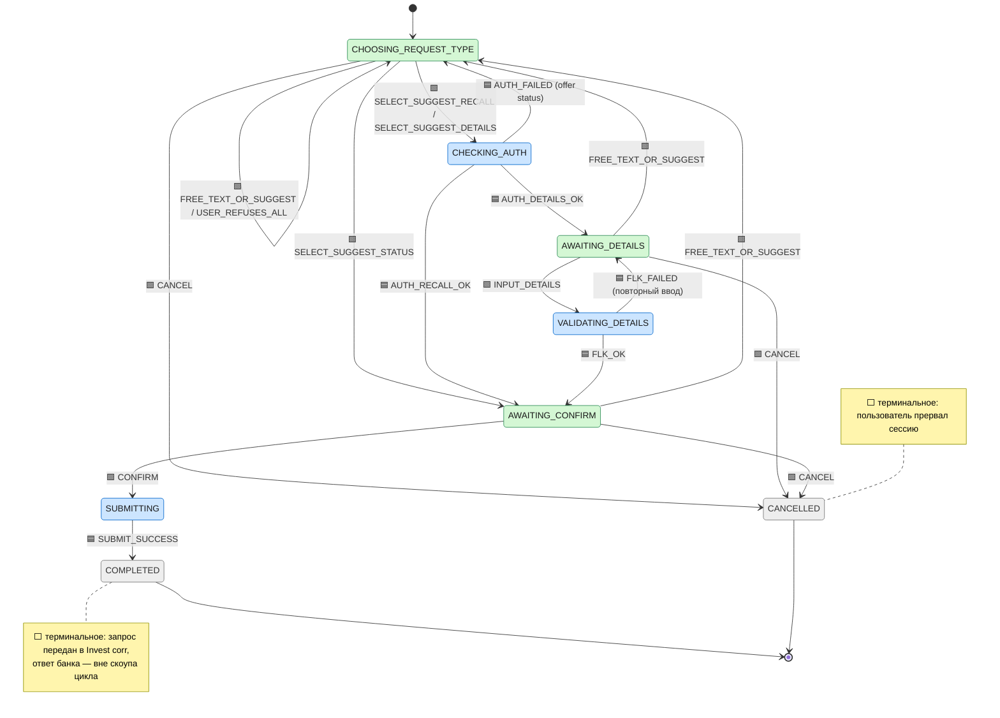
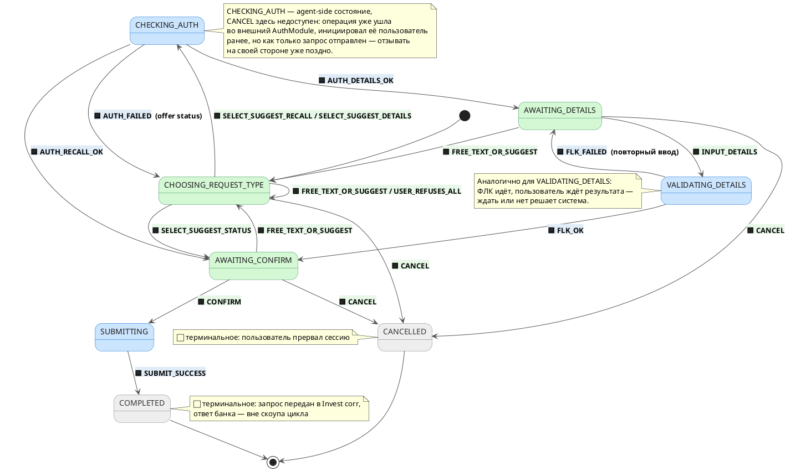

# Машина состояний — модуль invest-pro (сессия обработки платёжного запроса)

**Источник:** [sequence-diagram-plantuml.md](./sequence-diagram-plantuml.md) — INVTEAM-8487

> Скоуп моделируемой сущности: **сессия диалога пользователя с чат-агентом по переписке** по одному платежу —
> от получения текста и suggest по зацепке и до передачи подтверждённого запроса в модуль Invest corr
> («Запрос принят в обработку»). Обработка ответа банка и жизненный цикл самой заявки в банке — вне скоупа.

## Состояния машины

> Тип запроса (`status` / `recall` / `details`) хранится в контексте сессии как атрибут, а не как отдельное состояние — он лишь определяет, какую подготовку нужно пройти до `AWAITING_CONFIRM`.

**Раскраска состояний на диаграммах (по актору):**
- 🟢 **зелёный** — состояние «на стороне пользователя»: машина ждёт действия человека.
- 🔵 **синий** — состояние «на стороне агента/системы»: идёт внешний вызов (AuthModule / ФЛК / Invest corr).
- ⬜ **серый** — терминальное, никто не действует.

```java
public enum PaymentRequestSessionState {
    CHOOSING_REQUEST_TYPE, // 🟢 Старт сессии: агенту известны данные платежа, ждём выбора типа запроса (или отказа/свободного ввода)
    CHECKING_AUTH,          // 🔵 Идёт проверка полномочий пользователя на операцию «отзыв» / «уточнение реквизитов»
    AWAITING_DETAILS,       // 🟢 Ждём от пользователя ввод реквизитов для уточнения (ИНН, счёт, наименование, назначение)
    VALIDATING_DETAILS,     // 🔵 Выполняется проверка ФЛК введённых реквизитов
    AWAITING_CONFIRM,       // 🟢 Показана сводка запроса, ждём подтверждения пользователя (общее для всех типов)
    SUBMITTING,             // 🔵 Выполняется вызов модуля Invest corr с подтверждёнными данными
    COMPLETED,              // ⬜ Терминальное: запрос принят в обработку, ответ банка — вне скоупа цикла
    CANCELLED               // ⬜ Терминальное: пользователь явно прервал сессию до SUBMITTING/COMPLETED
}
```

## События машины

> `SELECT_SUGGEST_*` — одна пользовательская команда «выбрать suggest», но для удобства guard'ов и трассировки разнесена на три отдельных события по типу запроса.
>
> `AUTH_RECALL_OK` / `AUTH_DETAILS_OK` — результат проверки полномочий явно разнесён по типу операции, чтобы обработчик перехода знал, в какое состояние вести без обращения к guard'у; общий `AUTH_FAILED` остаётся один, т.к. поведение при отказе одинаковое для всех типов.
>
> `FREE_TEXT_OR_SUGGEST` — единое событие для свободного ввода и любого «постороннего» suggest из любой точки ожидания ввода: единый обработчик возвращает диалог в `CHOOSING_REQUEST_TYPE`.
>
> `CANCEL` — единственный способ явно закрыть сессию пользователем. Доступен **только пока операция ещё на стороне пользователя** (`CHOOSING_REQUEST_TYPE`, `AWAITING_DETAILS`, `AWAITING_CONFIRM`). Как только стартовал внешний вызов (`CHECKING_AUTH`, `VALIDATING_DETAILS`) или запрос ушёл в Invest corr (`SUBMITTING`), сессия делегирована системе и `CANCEL` уже не принимается.

**Раскраска событий на диаграммах (по инициатору):**
- светло‑зелёная заливка 🟩 — событие инициирует **пользователь**.
- светло‑синяя заливка 🟦 — событие инициирует **агент/внешняя система**.

```java
public enum PaymentRequestSessionEvent {
    // ── Инициированы пользователем ───────────────────────────────────────────
    SELECT_SUGGEST_STATUS,  // 🟩 Пользователь выбрал suggest «Запросить статус платежа»
    SELECT_SUGGEST_RECALL,  // 🟩 Пользователь выбрал suggest «Отозвать платеж»
    SELECT_SUGGEST_DETAILS, // 🟩 Пользователь выбрал suggest «Уточнить реквизиты»
    FREE_TEXT_OR_SUGGEST,   // 🟩 Свободный текст или иной suggest из любой точки ожидания — loop в CHOOSING_REQUEST_TYPE
    USER_REFUSES_ALL,       // 🟩 Отказ от всех предложенных вариантов
    INPUT_DETAILS,          // 🟩 Ввод реквизитов для уточнения
    CONFIRM,                // 🟩 Пользователь подтвердил запрос
    CANCEL,                 // 🟩 Пользователь отозвал операцию — допустим только пока она на его стороне (CHOOSING_REQUEST_TYPE / AWAITING_DETAILS / AWAITING_CONFIRM). Из agent-side состояний и SUBMITTING не принимается.

    // ── Инициированы агентом / внешней системой ──────────────────────────────
    AUTH_RECALL_OK,         // 🟦 Проверка полномочий пройдена для операции «отзыв» → AWAITING_CONFIRM
    AUTH_DETAILS_OK,        // 🟦 Проверка полномочий пройдена для операции «уточнение реквизитов» → AWAITING_DETAILS
    AUTH_FAILED,            // 🟦 Операция недоступна пользователю (любой тип) → остаётся доступным только запрос на статус
    FLK_OK,                 // 🟦 Проверка ФЛК реквизитов пройдена
    FLK_FAILED,             // 🟦 Проверка ФЛК реквизитов не пройдена — повторный ввод
    SUBMIT_SUCCESS          // 🟦 Модуль Invest corr принял запрос в обработку
}
```

## Таблица переходов

| Текущее состояние | Событие | Актор | Guard | Следующее | Действия |
|---|---|---|---|---|---|
| `CHOOSING_REQUEST_TYPE` | `SELECT_SUGGEST_STATUS` | 🟩 user | — | `AWAITING_CONFIRM` | context.type=status; показать сводку «статус» + данные платежа |
| `CHOOSING_REQUEST_TYPE` | `SELECT_SUGGEST_RECALL` | 🟩 user | — | `CHECKING_AUTH` | context.type=recall; проверить полномочия на операцию «отзыв» |
| `CHOOSING_REQUEST_TYPE` | `SELECT_SUGGEST_DETAILS` | 🟩 user | — | `CHECKING_AUTH` | context.type=details; проверить полномочия на операцию «уточнение реквизитов» |
| `CHOOSING_REQUEST_TYPE` | `FREE_TEXT_OR_SUGGEST` | 🟩 user | — | `CHOOSING_REQUEST_TYPE` *(loop)* | единый обработчик: показать доступные типы запроса |
| `CHOOSING_REQUEST_TYPE` | `USER_REFUSES_ALL` | 🟩 user | — | `CHOOSING_REQUEST_TYPE` *(loop)* | «Я могу помочь отправить запрос в банк по платежу …» + suggest → вернуться к выбору |
| `CHECKING_AUTH` | `AUTH_RECALL_OK` | 🟦 agent | — | `AWAITING_CONFIRM` | показать сводку «отзыв» + данные платежа |
| `CHECKING_AUTH` | `AUTH_DETAILS_OK` | 🟦 agent | — | `AWAITING_DETAILS` | «Введите реквизиты, которые необходимо уточнить…» (ИНН, счёт, наименование, назначение) |
| `CHECKING_AUTH` | `AUTH_FAILED` | 🟦 agent | — | `CHOOSING_REQUEST_TYPE` | показать «Вам доступен только запрос на статус» + suggest(status) → возврат к выбору |
| `AWAITING_DETAILS` | `INPUT_DETAILS` | 🟩 user | — | `VALIDATING_DETAILS` | получить реквизиты |
| `AWAITING_DETAILS` | `FREE_TEXT_OR_SUGGEST` | 🟩 user | — | `CHOOSING_REQUEST_TYPE` *(loop)* | единый обработчик |
| `VALIDATING_DETAILS` | `FLK_OK` | 🟦 agent | — | `AWAITING_CONFIRM` | показать сводку «на уточнение реквизитов» + данные платежа + список реквизитов |
| `VALIDATING_DETAILS` | `FLK_FAILED` | 🟦 agent | — | `AWAITING_DETAILS` | «ИНН должен быть 10 или 12 символов. Введите ваши данные ещё раз» → повторный ввод |
| `AWAITING_CONFIRM` | `CONFIRM` | 🟩 user | context.type ∈ {status, recall, details} | `SUBMITTING` | вызвать модуль Invest corr с данными по типу |
| `AWAITING_CONFIRM` | `FREE_TEXT_OR_SUGGEST` | 🟩 user | — | `CHOOSING_REQUEST_TYPE` *(loop)* | единый обработчик |
| `SUBMITTING` | `SUBMIT_SUCCESS` | 🟦 agent | — | `COMPLETED` *(final)* | «Ваш запрос принят в обработку, о результатах узнаете в СМС от номера 900» |
| `CHOOSING_REQUEST_TYPE` | `CANCEL` | 🟩 user | операция ещё на стороне пользователя | `CANCELLED` *(final)* | закрыть сессию, попрощаться |
| `AWAITING_DETAILS` | `CANCEL` | 🟩 user | операция ещё на стороне пользователя | `CANCELLED` *(final)* | закрыть сессию без сохранения черновика |
| `AWAITING_CONFIRM` | `CANCEL` | 🟩 user | операция ещё на стороне пользователя | `CANCELLED` *(final)* | закрыть сессию до отправки в Invest corr |

## Диаграмма (Mermaid stateDiagram)

Раскраска состояний через `classDef`, инициатор события показан эмодзи‑префиксом у метки перехода (`🟩` — пользователь, `🟦` — агент).



## Диаграмма (PlantUML state)

Полная раскраска: **цвет заливки состояния** = актор (зелёный — пользователь, синий — агент, серый — терминальное); **цвет фона метки на стрелке** = инициатор события (`<back:#e8f8e8>` — пользователь, `<back:#e0ecf7>` — агент).



## Ключевые решения модели

1. **Тип запроса вынесен в атрибут контекста**, а не в отдельные состояния — три сценария (статус/отзыв/уточнение) разделяются только на этапе подготовки до `AWAITING_CONFIRM`, дальше ветвление исчезает.
2. **`AWAITING_CONFIRM` / `SUBMITTING` / `COMPLETED` общие для всех типов** — исключают дублирование финального блока «подтверждение → Invest corr → принят в обработку».
3. **«Ввод текста или suggest» — единый loop-переход** из каждой точки ожидания ввода в `CHOOSING_REQUEST_TYPE`, а не отдельные переходы по сценариям.
4. **Отказ/свободный ввод — это не откат в прошлое состояние**, а переход в центральный loop выбора типа; история диалога сохраняется честно.
5. **Внешние вызовы (AuthModule, Invest corr) — это действия-эффекты перехода**, а не состояния машины. Состояния фиксируют только точки ожидания ввода/обработки диалога.
6. **`AUTH_*_OK` явно разнесён по типу операции** (`AUTH_RECALL_OK` → сводка отзыва, `AUTH_DETAILS_OK` → ввод реквизитов), чтобы обработчик перехода знал следующее состояние без обращения к guard'у по `context.type`. Общий `AUTH_FAILED` остаётся один: поведение при отказе одинаковое для всех типов.
7. **`CANCEL` — явное событие завершения сессии пользователем.** Доступно **только пока операция ещё на стороне пользователя** (user-side состояния: `CHOOSING_REQUEST_TYPE`, `AWAITING_DETAILS`, `AWAITING_CONFIRM`). Как только стартовал внешний вызов (`CHECKING_AUTH`, `VALIDATING_DETAILS`) или запрос ушёл в Invest corr (`SUBMITTING`), сессия делегирована системе и `CANCEL` уже не принимается — это право есть только пока человек сам контролирует следующий шаг. Ведёт в терминальное `CANCELLED` — второй легитимный финал диалога рядом с `COMPLETED`.
8. **Раскраска диаграмм по актору:** зелёным подсвечены состояния/события на стороне пользователя, синим — на стороне агента/внешней системы. Это не несёт логики, а ускоряет чтение: видно, где человек ждёт, а где система работает.