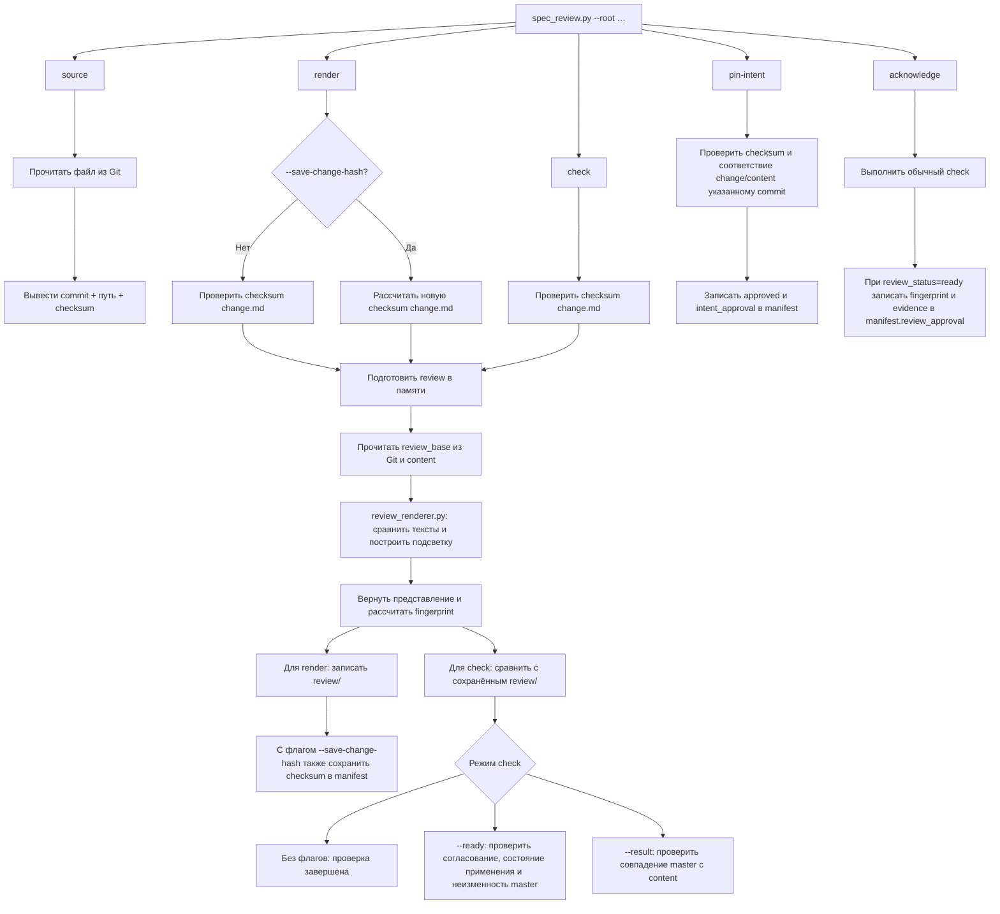
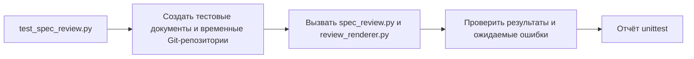

# Граф команд и скриптов

`spec_review.py` читает документы, выполняет проверки и записывает результат. `review_renderer.py` получает два текста и строит представление с подсветкой; самостоятельно файлы не читает и не записывает.

`render` и `check` используют один механизм построения представления. `render` сохраняет результат, а `check` сравнивает его с уже сохранённым файлом. Ветви «Для render» и «Для check» альтернативны и выбираются по вызванной команде.

Весь набор документов разбирается до начала записи. При `render --save-change-hash` после успешного построения всего набора сначала сохраняется manifest, затем файлы review; общей атомарной транзакции этих записей нет. Флаг используют после подготовки или актуализации content: он не проверяет смысловое соответствие текста требованиям.

Fingerprint рассчитывает `spec_review.py`. Он связывает требования, manifest без поля review_approval, исходные версии, content, представление и версию генератора. Метаданные возвращаются в консоль; отдельного файла для них нет.

`pin-intent` и `acknowledge` фиксируют уже полученное согласование; сами команды не принимают решение за аналитика.

## Тесты

`test_spec_review.py` запускается отдельно:

Запись в master и ведение `application-state.json` выполняет ИИ по скиллу — отдельной Python-команды `apply` нет.

Подробности: [протокол и команды](document-copies.md), [применение и восстановление](ai-apply.md).
