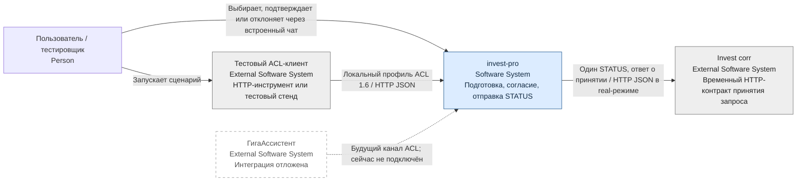

# C4 L1 — контекст системы

Текущий локальный POC готовит и передаёт запрос статуса. Банковский статус и последующий результат corr в агент не возвращаются. Настоящая поверхность GA пока не подключена.

В режиме stub сетевой corr заменяет внутрипроцессная заглушка. Проверка идентичности metadata не является банковской авторизацией. См. [границы требований](../requirements_current.md#1-назначение-и-границы).
