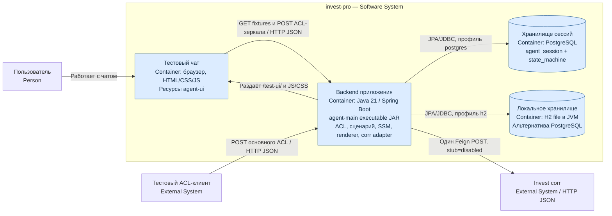

# C4 L2 — контейнеры

Контейнер C4 — единица выполнения или хранения, не Maven-модуль и не обязательно Docker-контейнер. Все backend-модули собраны в один исполняемый JAR.

Одновременно выбирается ровно одна БД. В `poc-local` по умолчанию активен StubInvestCorrClient внутри backend: отдельного stub-сервиса нет. Профиль bootstrap не поднимает web/БД и не демонстрирует этот сценарий. Настройки — [§8 спецификации](../technical_specification_current.md#8-конфигурация-и-запуск).
