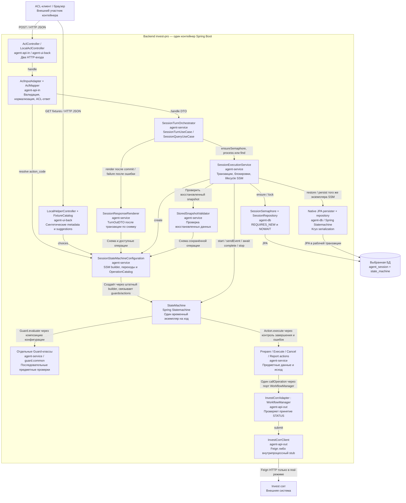

# C4 L3 — компоненты backend

Показаны компоненты одного Java-контейнера и их основные связи. Подписи Maven-модулей задают размещение кода, а не сетевые границы.

Исполнение напрямую использует API SSM; собственной абстракции движка и зависимости компиляции db → service нет. SessionExecutionContext передаёт данные одного события через message header и не сохраняется. В рамках одного хода один экземпляр FSM восстанавливается, обрабатывает событие, сохраняется и останавливается до commit. Внутренний find возвращает SessionSnapshotDTO без renderer. Тексты и HTTP-поля не входят в actions или native snapshot. Детали — [§3–7 спецификации](../technical_specification_current.md).
