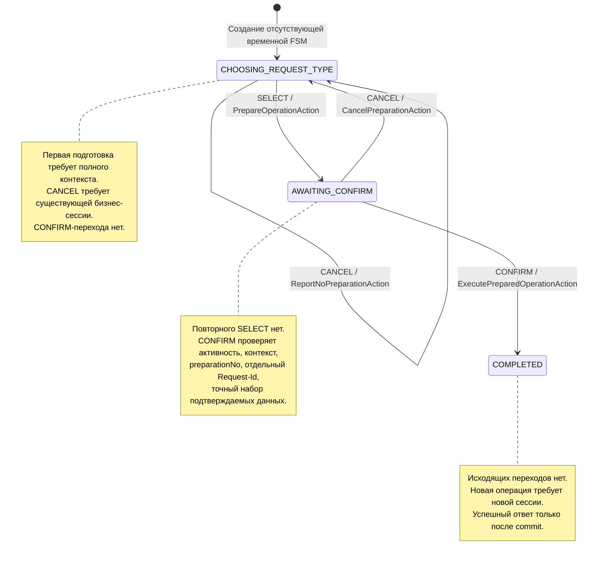

# Граф FSM текущего POC

COMPLETED — прикладное терминальное состояние; в builder оно включено в набор состояний, а не объявлено через SSM `.end()`. Начальное создание в памяти не означает сохранения бизнес-сессии. Ошибка guard/Action приводит к rollback, а не к отдельному состоянию ERROR.

Отсутствующий переход существующей FSM даёт INVALID_COMMAND или SESSION_COMPLETED, сохраняет новый lastResult/lastRequestId/projectionVersion, но не меняет подготовку или состояние. Guard denial не делает native save. Порядок guards каждого перехода приведён в [§3 спецификации](../technical_specification_current.md#3-программная-схема-операции-и-fsm).
