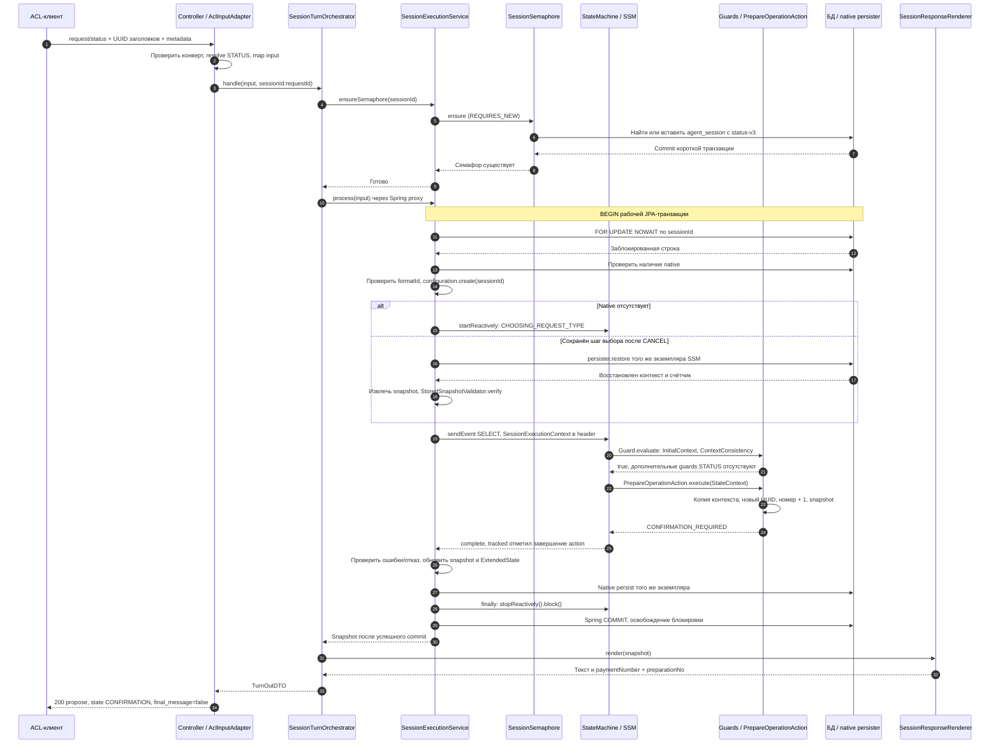

# Sequence — подготовка STATUS

Оба POST-входа используют эту последовательность. Показан допустимый SELECT; отказы вынесены в [диаграмму ошибок](08_sequence_failures.md).

WorkflowManager при подготовке не вызывается. Предложение строится из возвращённого снимка, без повторного чтения и без записи готового текста в FSM.
