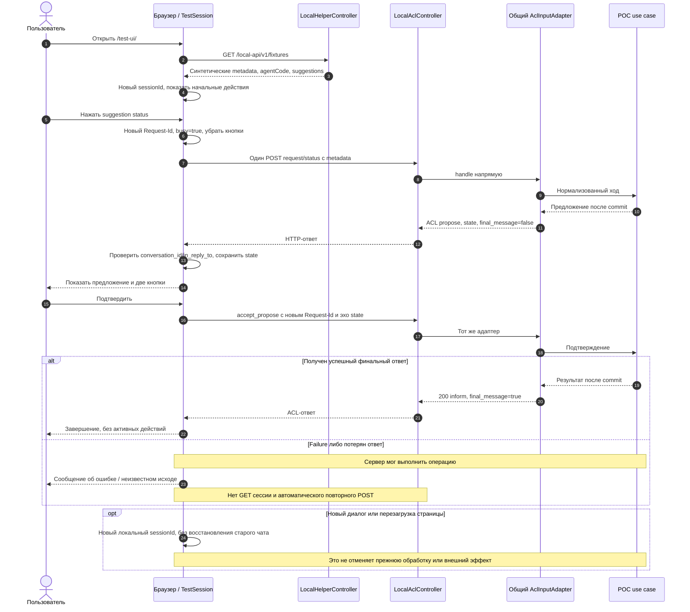

# Sequence — тестовый чат и локальное ACL-зеркало

UI уже присутствует в текущем дереве, хотя его требования ведутся в этапе 2. Бизнес-проверки остаются на сервере.

Клиент игнорирует поздний ответ, если уже начат другой локальный диалог. Только актуальные кнопки могут отправить POST; свободный текст не интерпретируется как команда. Реализация — [session.js](../../../agent-ui/src/main/resources/test-ui/session.js).
