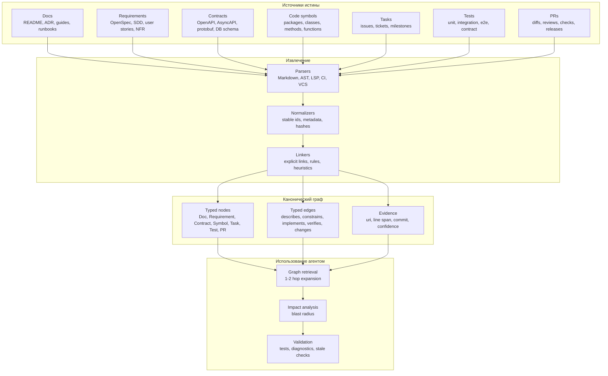
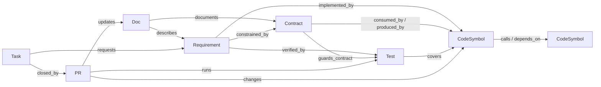
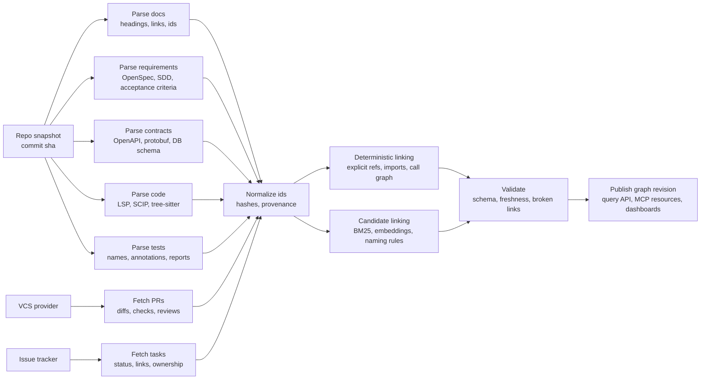
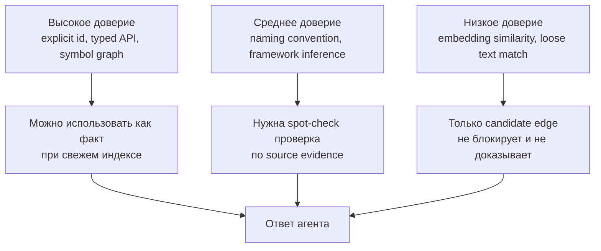
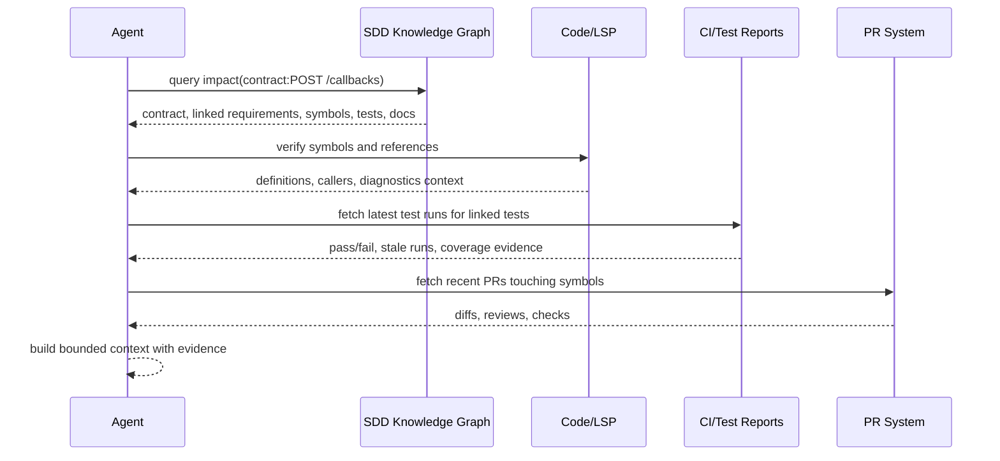
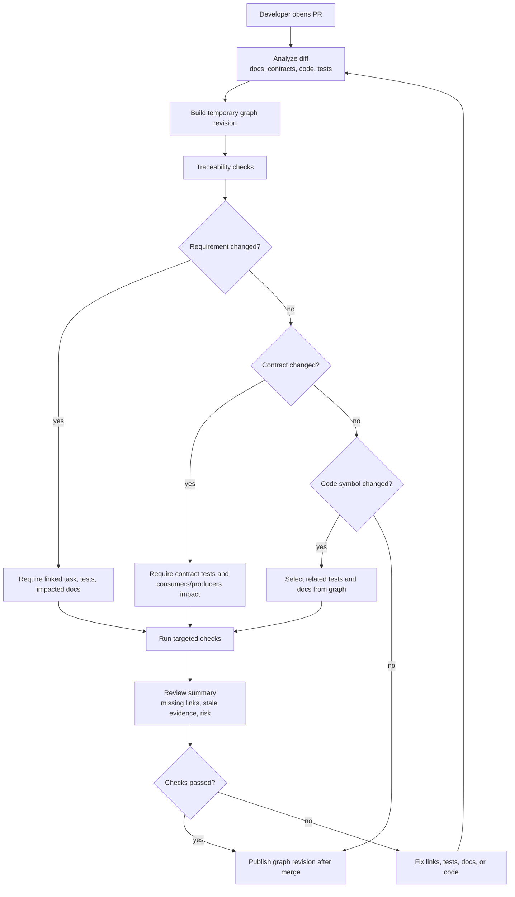

# Исследование инструментов работы агента с данными

Дата исследования: 2026-06-04.

Область исследования: общий инструментальный слой AI-агента для работы с кодом, документацией, структурированными данными, runtime-состоянием и внешними системами. Текущий каталог и файлы текущего проекта в исследовании не анализировались; упоминание доступных инструментов относится только к возможностям сессии, а не к содержимому репозитория.

## 1. Краткий вывод

Для эффективной работы агента с данными недостаточно одного `grep`, чтения файлов и генерации патчей. Практически полезная связка строится из нескольких классов инструментов:

| Слой | Что дает агенту | Лучшие задачи | Главный риск |
| --- | --- | --- | --- |
| Текстовый поиск и файловые операции | Быстрое чтение, точечные патчи, простая навигация | Малые изменения, известные файлы, конфигурация | Хрупкость на больших кодовых базах и при символных связях |
| LSP / языковые серверы | Символы, определения, ссылки, диагностика, rename, code actions | Поиск определений и ссылок, безопасные рефакторинги, диагностика | Зависимость от корректной настройки workspace и качества конкретного language server |
| Serena MCP | Агентно-ориентированная оболочка над LSP или JetBrains IDE | Символьная навигация, символное редактирование, cross-file refactoring, memory | Не заменяет raw file/shell tools; требует установки, индексации/инициализации проекта и доверенной конфигурации |
| Code index / embeddings | Семантический и гибридный поиск по большой кодовой базе | Поиск "где реализован бизнес-сценарий", незнакомая монорепа | Stale index, ложные семантические совпадения, приватность embeddings |
| Code intelligence / graph | Граф зависимостей, вызовов, ownership, cross-repo intelligence | Impact analysis, архитектурная навигация, миграции | Высокая стоимость построения и сопровождения индекса |
| SDD knowledge graph | Трассируемость docs, requirements, contracts, code symbols, tasks, tests и PRs | Evidence-backed retrieval, review checklist, impact analysis, test selection | Деградация без стабильных ids, provenance, quality gates и владельца данных |
| Runtime/browser/db/observability MCP | Проверка поведения в исполняемой системе | UI, API, БД, логи, метрики, трассировки | Секреты, destructive actions, prompt/tool injection |
| Documentation/RAG MCP | Актуальная документация, SDK-примеры, спецификации | Внешние API, библиотеки, фреймворки | Устаревшие или нерелевантные источники, доверие к third-party docs |

Практический оптимум для coding-агента:

1. Оставить базовые инструменты: filesystem, shell, `rg`, patch, test runner.
2. Добавить LSP-слой или Serena для символной навигации и рефакторингов.
3. Добавить локальный или корпоративный code index для semantic/hybrid retrieval.
4. Добавить документационный MCP для внешних библиотек и API.
5. Добавить runtime-инструменты: browser automation, database MCP, observability MCP.
6. Добавить SDD knowledge graph для связи требований, контрактов, символов кода, тестов, задач и PR.
7. Ввести политику безопасности: roots, least privilege, allowlist, подтверждения destructive calls, аудит, pinning версий MCP-серверов.

## 2. Базовая модель: какие данные нужны агенту

Агент работает не "с кодом вообще", а с несколькими типами данных:

| Тип данных | Примеры | Инструменты |
| --- | --- | --- |
| Текстовые артефакты | исходники, Markdown, YAML, SQL, свойства | `rg`, read file, patch, formatter |
| Символьная структура | классы, функции, методы, типы, imports, references | LSP, Serena, IDE backend, SCIP |
| Семантические фрагменты | "код, отвечающий за retry", "валидация webhook" | embeddings, BM25, hybrid search, reranking |
| Граф связей | call graph, dependency graph, ownership, module graph | code graph MCP, Sourcegraph, static analyzers |
| Runtime-состояние | DOM, сеть, консоль браузера, процессы, контейнеры | Playwright/browser MCP, shell, Docker MCP |
| База данных | schema, rows, query plans, migrations | Postgres/SQLite/BigQuery MCP, SQL tools |
| Внешняя документация | SDK docs, API specs, changelogs | Context7, docs MCP, web search |
| История и процесс | git blame, PR, issues, CI, tickets | GitHub/GitLab/Jira MCP, Paperclip-like systems |
| Долгая память | решения, соглашения, карты проекта | memory MCP, файловая память, knowledge graph |

Ключевая инженерная идея: инструмент должен возвращать не "побольше текста", а минимальный проверяемый контекст нужного типа. Для агента ценнее `definition -> references -> diagnostics -> tests`, чем чтение случайных 20 файлов.

## 3. MCP как транспорт инструментов

Model Context Protocol задает стандартный способ подключения внешних источников данных и действий к LLM-приложению. На уровне сервера MCP есть несколько важных сущностей:

| Сущность MCP | Назначение для агента | Пример |
| --- | --- | --- |
| `tools` | Модель может вызвать действие с JSON-schema входом | `search_code`, `index_codebase`, `query_database` |
| `resources` | Сервер отдает контекстные данные по URI | файл, schema, endpoint description |
| `prompts` | Сервер публикует шаблоны задач или workflows | "review this API", "generate migration" |
| `roots` | Клиент сообщает серверу границы файловой системы | один repo, несколько repo, workspace |
| client features | Клиентские возможности вроде roots, sampling, elicitation | UI-подтверждение, выбор workspace |

Для инструментов работы с данными особенно важны `tools`, `resources` и `roots`.

По спецификации MCP, tools предназначены для вызова внешних систем, вычислений, API и БД; tools имеют имя, описание, input schema и могут иметь output schema. Resources предназначены для контекста: файлов, схем БД, application-specific information. Roots задают файловые границы, в которых сервер должен работать. Это критично для безопасности и для качества поиска.

Практические требования к MCP-инструменту для агента:

1. Структурированный вход и выход.
2. Явное указание scope: repo, root, branch, language, include/exclude.
3. Устойчивость к большим кодовым базам: pagination, background indexing, status.
4. Идемпотентность для read-only tools.
5. Отдельные права для destructive actions.
6. Ясные ошибки: "index stale", "workspace not ready", "language server failed".
7. Минимизация токенов: snippets, symbol bodies, summaries, paths, line spans.
8. Проверяемость: ссылки на файл/символ, score, reason, index revision.

## 4. Serena MCP

Serena - MCP toolkit для coding-агентов, который предоставляет IDE-подобные операции через MCP. Главная ценность Serena не в том, что она "умеет читать файлы", а в том, что она поднимает уровень операций с текстового на символьный.

### 4.1. Архитектура

Serena подключается к MCP-клиенту как сервер. Внутри она может использовать два backend-подхода:

| Backend | Суть | Сильные стороны | Ограничения |
| --- | --- | --- | --- |
| Language Server Protocol | Serena абстрагирует LSP-серверы разных языков | Open-source, широкая языковая поддержка, определения/ссылки/rename | Качество зависит от language server; не все языки дают implementation/type hierarchy одинаково |
| JetBrains Plugin | Serena использует анализ IDE JetBrains | Более мощные refactorings, type hierarchy, move, debug, inspections | Платный плагин, зависит от JetBrains IDE, не все IDE поддержаны одинаково |

Serena позиционируется как agent-first слой: инструменты работают с символами, name paths, symbol bodies и relationships, а не с line-number-only редактированием.

### 4.2. Ключевые группы инструментов Serena

| Группа | Примеры инструментов | Задачи |
| --- | --- | --- |
| Symbol tools | `find_symbol`, `find_declaration`, `find_referencing_symbols`, `find_implementations`, `get_symbols_overview` | Навигация по структуре и зависимостям |
| Symbolic editing | `replace_symbol_body`, `insert_before_symbol`, `insert_after_symbol`, `safe_delete_symbol` | Точные изменения вокруг символа |
| Refactoring | `rename_symbol`, JetBrains `move`, `inline`, `safe_delete` | Cross-file refactoring без ручного search/replace |
| Diagnostics | diagnostics for file/symbol, inspections | Проверка ошибок и предупреждений |
| Basic tools | file search, pattern search, read file, shell | Покрытие базовых сценариев, если клиент их не дает |
| Memory tools | read/write/list/edit memory | Долгоживущий контекст проекта |
| Workflow/config | activate project, onboarding, current config | Подготовка workspace и контроль доступных tools |
| JetBrains debug | breakpoints, stepping, inspect/evaluate | Runtime debugging через IDE backend |

### 4.3. Где Serena особенно полезна

Serena полезна, когда задача завязана на identity символов:

- найти все места, где реально используется метод, а не просто совпадает строка;
- переименовать метод/класс/поле с учетом ссылок;
- заменить тело функции, не ошибившись с диапазоном;
- вставить код до/после класса или метода;
- найти implementation интерфейса;
- проверить diagnostics для измененного символа;
- выполнить safe delete с проверкой usage;
- в JetBrains backend - move refactoring с обновлением imports.

### 4.4. Где Serena не лучший выбор

Serena не должна заменять все инструменты:

- для простого изменения известной строки быстрее patch;
- для конфигурационных файлов без языковой семантики лучше обычное чтение и patch;
- для поиска "по смыслу" в незнакомой монорепе Serena не заменяет embeddings index;
- для runtime-проверки нужны test runner, browser, DB, logs;
- для больших generated/vendor деревьев лучше исключения и индексы.

### 4.5. Рекомендованная роль Serena в agent stack

Оптимальная роль Serena - "semantic editor and navigator":

1. Найти релевантные символы через semantic search или `rg`.
2. Подтвердить структуру через Serena `get_symbols_overview` / `find_symbol`.
3. Использовать `find_referencing_symbols` перед изменениями.
4. Менять код через `replace_symbol_body`, `insert_*`, `rename_symbol` или JetBrains refactor.
5. Сразу проверять diagnostics и tests.

## 5. LSP-инструменты

Language Server Protocol - базовый стандарт, через который редакторы получают language intelligence. Для агента LSP важен потому, что дает точные операции с языковой моделью программы.

### 5.1. Основные LSP-операции для агента

| Операция | Метод LSP | Что дает агенту |
| --- | --- | --- |
| Go to definition | `textDocument/definition` | Переход от usage к определению |
| Find references | `textDocument/references` | Список usage с учетом символа |
| Workspace symbols | `workspace/symbol` | Поиск символов по workspace |
| Document symbols | `textDocument/documentSymbol` | Outline текущего файла |
| Hover | `textDocument/hover` | Типы, docstring, краткая информация |
| Completion | `textDocument/completion` | Контекстные варианты кода |
| Diagnostics | `textDocument/publishDiagnostics` | Ошибки компиляции/типизации/анализа |
| Code actions | `textDocument/codeAction` | Quick fixes, imports, refactorings |
| Rename | `textDocument/rename` | Безопасное переименование символа |
| Implementation | `textDocument/implementation` | Переход к реализациям |
| Type hierarchy | `textDocument/typeHierarchy/*` | Супертипы/подтипы |
| Call hierarchy | `textDocument/callHierarchy/*` | Входящие и исходящие вызовы |
| Semantic tokens | `textDocument/semanticTokens/*` | Классификация токенов по семантике |

### 5.2. Примеры языковых серверов

| Язык/экосистема | Сервер | Особенности |
| --- | --- | --- |
| Go | `gopls` | Официальный language server Go; navigation, diagnostics, completion, rename, call/type hierarchy, refactorings |
| Python | Pyright | Быстрый type checker и language server; definitions, references, rename, symbols, call hierarchy, type stubs |
| Java | Eclipse JDT LS | Java LSP на базе Eclipse JDT; Maven/Gradle, diagnostics, code actions, code navigation, hierarchy |
| Rust | rust-analyzer | Официально де-факто основной Rust LSP; go-to-definition, references, refactorings, diagnostics через rustc/clippy |
| TypeScript/JavaScript | TypeScript language service / tsserver wrappers | Сильная поддержка типов, imports, rename, references, project references |
| C/C++ | clangd | compile_commands.json, cross-reference, diagnostics, code completion, include fixes |

### 5.3. Почему raw LSP неудобен агенту напрямую

LSP проектировался для интерактивного редактора, а не для автономного агента. Поэтому агенту нужен adapter layer:

- агент часто не имеет "cursor position", ему нужен поиск символа по имени и контексту;
- LSP-ответы могут быть слишком низкоуровневыми: ranges, locations, edits;
- workspace initialization может быть дорогой и асинхронной;
- diagnostics приходят push-событиями, а агенту нужен pull-like результат "готово/не готово";
- разные language servers отличаются по capability matrix;
- часть возможностей требует открытых документов или корректного project root;
- для generated code, vendored deps и multi-root repo нужны специальные настройки.

Serena как раз ценна тем, что превращает raw LSP в более удобные для агента операции.

### 5.4. Лучшие практики LSP для агента

1. Всегда явно определять workspace root.
2. Проверять server capabilities после initialize.
3. Делать warm-up: открыть ключевые документы, дождаться indexing/diagnostics.
4. Перед rename/refactor получать preview или workspace edit.
5. После изменений повторять diagnostics.
6. Логировать language server stderr/stdout отдельно.
7. Хранить mapping: file path -> symbols -> last known ranges.
8. Не полагаться только на LSP для динамических языков: дополнять tests и runtime checks.

## 6. Code index / embeddings

Semantic code search решает другую задачу, чем LSP. LSP отвечает на вопрос "что связано с этим символом?". Embeddings отвечают на вопрос "где в коде может быть реализована такая идея?".

### 6.1. Типовая архитектура code index

1. Сканирование файлов.
2. Фильтрация: `.gitignore`, generated/vendor/build outputs, binary files.
3. Разбиение на chunks:
   - по AST: функции, методы, классы, modules;
   - по Markdown/конфигурации: headings, sections;
   - fallback по строкам/символам.
4. Извлечение metadata:
   - path, language, symbol name, start/end lines;
   - imports/exports;
   - hash содержимого;
   - git commit/index revision.
5. Embedding chunks.
6. Индексация:
   - vector DB: Milvus, Qdrant, SQLite/vector extension, Turbopuffer, local ANN;
   - lexical index: BM25/FTS;
   - symbol index: identifiers, definitions, references.
7. Query:
   - natural-language query или code query;
   - hybrid retrieval: vector + BM25 + filters;
   - reranking;
   - output: top-k snippets with file/line/score/reason.
8. Incremental reindex:
   - file hashes, mtime, Merkle trees, file watcher.

### 6.2. Сильные стороны

- Находит смысловые совпадения без точных ключевых слов.
- Хорош для незнакомых больших репозиториев.
- Уменьшает токены: возвращает фрагменты вместо чтения целых файлов.
- Работает по документации, конфигам, тестам и исходникам одновременно.
- Позволяет multi-repo поиск.

### 6.3. Ограничения

- Semantic search не доказывает связь. Он предлагает кандидатов.
- Embeddings могут пропустить редкие идентификаторы, если не дополнены BM25.
- Индекс может устареть после изменений.
- Чанкинг по токенам может разрезать важную семантическую единицу.
- Облачные embeddings и vector DB могут быть неприемлемы для приватного кода.
- Результаты с score без объяснения трудно доверять.

### 6.4. Примеры MCP/платформ индексирования

| Инструмент | Подход | Сильные стороны | Ограничения/заметки |
| --- | --- | --- | --- |
| Claude Context / Zilliz | MCP + hybrid BM25/dense vector + Milvus/Zilliz | `index_codebase`, `search_code`, incremental indexing, AST chunking, несколько embedding providers | Требует vector DB и embedding provider; приватность зависит от выбранной конфигурации |
| DeepContext | MCP + symbol-aware semantic search + AST + hybrid search/rerank | Поддержка Codex/Claude Code, background indexing, Tree-sitter, BM25 + vector + reranker | На момент исследования заявлена поддержка TypeScript/Python; self-hosting требует интеграции storage/providers |
| Semble | CLI/MCP локальный code search, cached indexes | Автоинвалидация при изменениях, локальные/remote repo, docs/config/all modes, token savings accounting | Качество зависит от модели/чанкинга; нужно проверить language coverage под конкретный стек |
| Code-Index-MCP | Local indexing, symbol/text search, optional semantic search | Локальная модель, `search_code`, `symbol_lookup`, secondary REST diagnostics | Реальные performance зависят от repo и профиля индекса |
| Sourcegraph | Code Search + Code Intelligence + Cody/Amp context | Enterprise-scale search, code navigation, references, ownership/history, cross-repo | Это платформа, а не просто MCP; требует развертывания и настройки permissions |
| Graph/code intelligence MCP | AST/call/dependency graph | Impact analysis, callers/callees, module graph | Сложно поддерживать свежесть и language parity |

### 6.5. Hybrid retrieval как стандарт

Для кода лучше использовать не "чистые embeddings", а hybrid retrieval:

- BM25/FTS нужен для точных имен: `PaymentRetryPolicy`, `X-Request-Id`, `@Transactional`.
- Vector search нужен для смысловых формулировок: "где восстанавливают доставку после ошибки".
- Symbol index нужен для точного перехода к definition/references.
- Reranker нужен для отсечения совпадений "вроде похоже, но не то".
- LSP нужен после retrieval, чтобы подтвердить реальные символные связи.

Идеальный запрос агента:

1. Semantic/hybrid search находит 10 кандидатов.
2. Agent читает 2-4 лучших snippets.
3. LSP/Serena подтверждает definitions/references.
4. Patch/refactor выполняется точечно.
5. Tests/diagnostics подтверждают результат.

## 7. Code intelligence, SCIP и платформы уровня Sourcegraph

Отдельный класс инструментов - не просто поиск, а code intelligence database.

Такие системы строят устойчивую модель:

- definitions;
- references;
- implementations;
- call hierarchy;
- type hierarchy;
- repo graph;
- package dependencies;
- ownership;
- history/blame;
- search index;
- иногда embeddings/RAG.

Sourcegraph использует code search и code intelligence как основу для AI-context retrieval. Precise code navigation в Sourcegraph опирается на SCIP - language-agnostic protocol для индексирования source code. Это важная архитектурная идея: LSP хорош в интерактивном workspace, а SCIP/index хорош для precomputed cross-repo intelligence.

Когда выбирать code intelligence platform:

- десятки или сотни репозиториев;
- polyglot monorepo;
- нужен cross-repo impact analysis;
- есть требования permissions и audit;
- нужна интеграция с code owners, history, batch changes;
- агент должен отвечать на архитектурные вопросы, а не только редактировать один файл.

Когда достаточно локального MCP index:

- один репозиторий;
- небольшая команда;
- важна приватность и простота;
- хватает `search_code`, `symbol_lookup`, `index_status`.

## 8. Другие специализированные MCP-серверы и инструменты

### 8.1. Доступные в текущей сессии

В этой сессии как вызываемые MCP/инструментальные возможности доступны:

| Инструмент | Назначение | Роль в работе с данными |
| --- | --- | --- |
| Context7 MCP | Поиск актуальной документации и code examples по библиотекам | Внешний docs context; полезен для API/framework вопросов |
| Playwright MCP | Browser automation, snapshot, click/type, network, console, screenshot | Runtime/UI verification, анализ DOM/сетевых запросов |
| node_repl MCP | Долгоживущий Node.js REPL | Быстрые JS-вычисления, прототипирование, обработка данных, browser automation через JS при наличии пакетов |
| Browser plugin | In-app browser для локальных и web targets | Инспекция UI и локальных приложений |
| Shell/filesystem tools | Команды, тесты, поиск, patch | Базовый слой работы с файлами и исполняемой средой |

Не доступны как вызываемые инструменты в этой сессии:

- Serena MCP;
- raw LSP tools вроде `go_to_definition`, `find_references`, `workspace_symbols`;
- отдельный code index / embeddings MCP по текущему workspace;
- database MCP общего назначения, кроме явно предоставленных команд/контекста.

Это не оценка полезности этих инструментов, а только факт доступности в данной сессии.

### 8.2. Классы MCP-серверов, которые полезны агенту

| Класс MCP | Примеры задач | Что должен уметь хороший сервер |
| --- | --- | --- |
| Database MCP | schema, query, explain, migrations | read-only mode, transaction guards, sampling rows, EXPLAIN, masking secrets |
| GitHub/GitLab MCP | PR, issues, branches, comments, checks | permissions, branch scoping, dry-run for writes |
| Documentation MCP | official docs, SDK examples | source ranking, version pinning, citations |
| Browser/UI MCP | visual checks, DOM, network | screenshots, accessibility tree, console, deterministic waits |
| Observability MCP | logs, traces, metrics, errors | time windows, service filters, PII masking |
| Cloud/container MCP | deployments, pods, images, env | read-only default, namespace restrictions |
| Security scanner MCP | secrets, SAST, dependency vulns | clear severity, evidence, fix guidance |
| Memory MCP | persistent facts, project map, decisions | provenance, decay, edit/delete, conflict handling |
| Code graph MCP | call graph, dependency graph, symbols | incremental indexing, language matrix, stable IDs |
| Vector DB MCP | semantic search across docs/code/data | tenancy, embedding privacy, hybrid filters |

## 9. Матрица выбора инструмента по задаче

| Задача агента | Первый инструмент | Второй инструмент | Проверка |
| --- | --- | --- | --- |
| Изменить известный маленький фрагмент | read/patch | `rg` | tests/formatter |
| Найти определение символа | LSP/Serena definition | `rg` fallback | read symbol body |
| Найти все usages | LSP/Serena references | lexical search for suspicious misses | tests/diagnostics |
| Переименовать символ | LSP/Serena rename | IDE refactor for complex cases | diagnostics + tests |
| Найти "где реализован сценарий" | semantic/hybrid code search | LSP/Serena on found symbols | targeted reads |
| Понять архитектурный dependency impact | code graph/Sourcegraph | LSP call/type hierarchy | test selection |
| Исправить UI bug | browser/Playwright | source search by component route | screenshot + e2e |
| Исправить SQL/data issue | DB MCP/schema query | code search for query usage | migration/test |
| Использовать новую библиотеку/API | docs MCP/Context7 | official docs/web | unit/integration test |
| Найти flaky runtime problem | observability MCP | code/log correlation | reproduction |
| Работа с legacy monorepo | code index + Sourcegraph | Serena/LSP | staged tests |

## 10. Рекомендуемая стратегия retrieval для агента

Для больших задач агенту стоит использовать каскад, а не один инструмент.

### 10.1. Каскад навигации

1. Если файл и место известны: читать минимальный диапазон.
2. Если известно имя символа: LSP/Serena `find_symbol` или `workspace/symbol`.
3. Если известна строка/API/error: `rg` / BM25.
4. Если известна только бизнес-идея: semantic/hybrid search.
5. Если нужно понять связи: references/call hierarchy/type hierarchy/code graph.
6. Если нужно менять символно: Serena/IDE refactor.
7. Если нужно проверить поведение: tests/browser/db/logs.

### 10.2. Контекстная экономия

Правило: сначала получить структуру, потом тело.

Плохой паттерн:

- читать весь файл;
- читать соседние файлы;
- искать по строкам;
- вручную угадывать диапазон patch.

Хороший паттерн:

- `get_symbols_overview`;
- `find_symbol`;
- read only symbol body;
- `find_referencing_symbols`;
- patch/refactor;
- diagnostics/tests.

### 10.3. Проверка достоверности retrieval

Результаты поиска нужно разделять по уровню доверия:

| Результат | Уровень доверия | Как проверять |
| --- | --- | --- |
| LSP definition | Высокий, если workspace корректен | открыть body, проверить diagnostics |
| LSP references | Высокий для статически типизированных языков | дополнить lexical search для публичных API/строк |
| Semantic search | Средний | подтвердить symbol/read/test |
| `rg` exact match | Высокий для строк, низкий для символной identity | LSP references/definition |
| Code graph | Высокий при свежем индексе | index revision + spot checks |
| Documentation MCP | Средний/высокий для official docs | version match |

## 11. Риски и безопасность

Инструментальный агент получает доступ к данным и действиям, поэтому MCP и другие инструменты должны рассматриваться как security boundary.

### 11.1. Основные риски

| Риск | Пример | Митигация |
| --- | --- | --- |
| Excessive scope | MCP server видит весь диск | roots, allowlist, sandbox |
| Prompt/tool injection | malicious docs/tool output склоняет модель вызвать опасный tool | считать tool output untrusted, human confirmation, policy layer |
| Data exfiltration | tool отправляет private code в cloud embeddings | local embeddings или approved provider, masking, audit |
| Destructive actions | DB write, file delete, deploy | read-only default, explicit approval, dry-run |
| Stale index | агент правит по старым chunks | file hash/revision, reindex on write |
| Confused deputy | один tool получает секрет и другой tool отправляет наружу | tool isolation, no secret echo, outbound allowlist |
| Credential misuse | MCP server принимает чужой token passthrough | tokens issued for server, audience validation |
| Dependency supply chain | установка случайного MCP server из registry | pin versions, review source, signed packages where possible |
| Over-trusting annotations | tool self-describes as safe | trust only trusted servers and client policy |

### 11.2. Минимальная политика безопасности

1. Read-only по умолчанию для новых MCP-серверов.
2. Явные roots, без доступа к home directory целиком.
3. Раздельные profiles: docs/search, code edit, DB read, DB write, deploy.
4. Approval prompts для:
   - shell;
   - network;
   - DB writes;
   - file deletes/moves;
   - deploy;
   - credential access.
5. Логи tool calls: имя tool, args hash, user task, timestamp, result size.
6. Pin versions MCP-серверов.
7. Local-first indexing для приватного кода, если нет корпоративного договора с provider.
8. Output validation: schema, size limits, path validation.
9. Timeouts и cancellation для indexing и long-running tools.
10. Отдельная проверка generated patches через tests/diagnostics.

## 12. Рекомендуемая архитектура toolchain

### 12.1. Минимальный набор

Для одиночного разработчика или небольшого проекта:

- filesystem read/write + patch;
- shell с controlled approvals;
- `rg`;
- test runner;
- docs MCP;
- browser automation для frontend;
- один LSP server на основной язык.

### 12.2. Усиленный набор для coding agent

Для регулярной работы с кодом:

- все из минимального набора;
- Serena MCP или собственный LSP adapter;
- local semantic code index;
- SDD knowledge graph для traceability между docs, requirements, contracts, code, tests и PR;
- git/PR MCP;
- memory layer;
- formatter/linter/test tools;
- policy for destructive tools.

### 12.3. Enterprise-набор

Для большой организации:

- centralized code intelligence platform;
- cross-repo search and ownership;
- SDD knowledge graph with traceability dashboards;
- corporate docs/RAG;
- issue tracker MCP;
- CI/CD MCP read-only + gated write;
- observability MCP;
- DB MCP with read-only replicas;
- secrets scanning and DLP;
- audit logs and access control;
- approved MCP registry.

## 13. SDD knowledge graph: как построить качественный граф знаний

SDD knowledge graph - это не просто "индекс документации" и не замена code search. Это проверяемый слой трассируемости между намерением, контрактом, реализацией и доказательствами поставки. Практическая ценность графа появляется, когда агент может за несколько hops ответить на вопросы:

- какое требование описывает этот кодовый символ;
- какие контракты ограничивают изменение;
- какие тесты доказывают корректность;
- какие задачи и PR объясняют происхождение решения;
- какая документация устареет при изменении;
- какой blast radius у изменения до начала редактирования.

### 13.1. Базовая слоистая архитектура

Главный принцип: граф должен хранить не пересказ артефактов, а адресуемые факты с provenance. Любой узел и любая важная связь должны вести к источнику: файл, строка, commit, PR, ticket, CI run или schema artifact.

### 13.2. Минимальная онтология

| Тип узла | Что хранить | Стабильный идентификатор | Минимальные связи |
| --- | --- | --- | --- |
| `Doc` | Markdown/AsciiDoc/Confluence-раздел, ADR, runbook | `doc:<path>#<heading-slug>` | `describes`, `supersedes`, `mentions` |
| `Requirement` | функциональное требование, NFR, invariant, acceptance criteria | `req:<domain>.<capability>.<slug>` | `implemented_by`, `verified_by`, `constrained_by` |
| `Contract` | endpoint, event, schema, DB table, protobuf message | `contract:<kind>:<name>:<operation-or-version>` | `constrains`, `consumed_by`, `produced_by`, `verified_by` |
| `CodeSymbol` | module, class, function, method, field, route handler | `symbol:<language>:<scip-or-qualified-name>` | `implements`, `calls`, `depends_on`, `covered_by` |
| `Task` | issue, ticket, change request, bug, epic | `task:<tracker>:<key>` | `requests`, `blocks`, `closed_by` |
| `Test` | test suite, test case, fixture, contract test | `test:<framework>:<qualified-name>` | `verifies`, `covers`, `guards_contract` |
| `PR` | pull request, merge request, review, checks | `pr:<vcs>:<org>/<repo>#<number>` | `changes`, `closes`, `updates`, `runs` |

Для первого релиза графа достаточно этих семи типов. Новые типы вроде `Decision`, `Owner`, `Service`, `Deployment`, `RuntimeMetric` стоит добавлять только после появления реальных запросов, которые нельзя выразить существующей схемой.

### 13.3. Пошаговая методика построения

1. Сформулировать целевые вопросы.
   Начинать нужно не с выбора graph database, а со списка запросов. Например: "какие тесты должны упасть при изменении endpoint?", "какие PR меняли реализацию требования?", "какие требования не покрыты тестами?", "какие документы надо обновить при изменении класса?". Для каждого вопроса зафиксировать ожидаемый ответ: набор узлов, связи, evidence и freshness.

2. Зафиксировать словарь типов и связей.
   Создать короткую ontology spec: типы узлов, обязательные поля, допустимые edge types, направление связи, cardinality, confidence. Важно не плодить синонимы: `verifies`, `covers`, `guards_contract` должны означать разные вещи. Если команда не может объяснить разницу, связь лучше не добавлять.

3. Ввести стабильные идентификаторы.
   ID должен переживать перенос файла, форматирование и переименование заголовка там, где это возможно. Для requirements лучше использовать явно назначенные ids в тексте. Для code symbols - LSP/SCIP id или qualified name с language/package namespace. Для тестов - qualified test name, а не номер строки. Для PR/tasks - внешний id из системы-источника.

4. Собрать источники и правила доверия.
   Источники отличаются надежностью. Явная ссылка в OpenSpec или Markdown надежнее эвристики по похожему названию. PR body надежнее комментария в review thread. Coverage report полезен, но не доказывает requirement coverage без связи test -> requirement. Для каждого source adapter надо указать trust level и правила конфликтов.

5. Извлечь канонические узлы.
   Парсеры должны возвращать маленькие typed records: `id`, `type`, `title`, `source_uri`, `line_span`, `content_hash`, `commit_sha`, `updated_at`, `parser_version`. Текстовые embeddings можно строить рядом, но канонический узел не должен зависеть от vector score.

6. Извлечь детерминированные связи.
   В первую очередь брать связи из явных маркеров: `Refs: REQ-123`, `Fixes #456`, `@Requirement("...")`, OpenAPI operationId, package imports, call graph, test annotations, CI check ids. Эти связи должны иметь `confidence=1.0` или близко к этому и воспроизводиться при повторной индексации.

7. Добавить кандидатные связи.
   Семантический поиск, BM25, совпадения терминов, похожие имена тестов и PR descriptions полезны для предложения связей, но не должны автоматически становиться фактами высокого доверия. Хранить их как `candidate_*` edges с confidence, reason и evidence snippet. Агент может использовать их как подсказки, но обязан подтверждать источником.

8. Построить инкрементальный pipeline.
   Индексация должна работать от snapshot commit и уметь обновлять только изменившиеся файлы, tests, PRs и contracts. Любой опубликованный graph revision должен быть воспроизводимым: один commit + одна версия парсеров + один набор внешних snapshots дают один и тот же граф.

9. Ввести quality gates.
   Перед публикацией revision проверять orphan rate, broken links, stale hashes, неизвестные requirement ids, отсутствующие tests для critical requirements, PR без связанной задачи, contract без contract tests, code symbols без владельца или package context. Ошибки high severity должны блокировать публикацию или помечать graph revision как degraded.

10. Подключить graph retrieval к агенту.
   Tool для агента должен возвращать не весь граф, а компактный подграф: anchor nodes, 1-2 hop expansion, evidence, freshness, confidence и next queries. Хороший ответ выглядит как "Requirement -> Contract -> Symbol -> Tests -> PRs", а не как список 200 похожих chunks.

11. Закрыть цикл через PR и CI.
   Каждый PR должен обновлять граф или хотя бы запускать проверку traceability. Если меняется contract, CI проверяет наличие contract tests и связанных docs. Если меняется requirement, CI проверяет links на tasks/tests/code. Если меняется code symbol, граф помогает выбрать tests и docs для проверки.

12. Регулярно чистить и пересматривать модель.
   Раз в спринт смотреть топ orphan nodes, низкокачественные candidate edges, дубли требований, устаревшие docs и конфликтующие связи. Knowledge graph быстро деградирует, если у него нет владельца, dashboard и понятного процесса исправления данных.

### 13.4. Pipeline индексации

Рекомендуемый порядок реализации: сначала docs + requirements + contracts, затем code symbols и tests, затем tasks и PRs. Такой порядок быстрее дает полезную трассируемость "что должно быть сделано -> где это реализовано -> чем проверяется", а process history подключается после стабилизации базовых ids.

### 13.5. Правила качества связей

| Класс связи | Пример | Как строить | Требование к evidence |
| --- | --- | --- | --- |
| Явная | `REQ-123` указан в тесте или PR | parser/regex по строгому формату | source URI + line span |
| Структурная | route handler реализует OpenAPI operationId | contract parser + framework route analysis | contract path + symbol location |
| Символьная | method вызывает repository method | LSP/SCIP/call graph | symbol ids + index revision |
| Процессная | PR closes task | VCS/tracker API | external URL + timestamp |
| Проверочная | test verifies requirement | annotation, naming convention, test metadata | test id + requirement id + run result |
| Кандидатная | похожий PR description и requirement title | hybrid retrieval/reranker | score + reason + snippet |

Качественный граф не обязан знать все. Он обязан явно различать verified facts и candidate hints. Это особенно важно для агентных workflow, где ложная связь может привести к неверному impact analysis или выбору неправильных тестов.

### 13.6. Retrieval-паттерны для SDD

1. От требования к реализации:
   `Requirement -> implemented_by CodeSymbol -> covered_by Test -> changed_by PR`.

2. От контракта к blast radius:
   `Contract -> consumed_by/produced_by CodeSymbol -> calls/depends_on neighbors -> verified_by contract tests -> docs`.

3. От задачи к полноте поставки:
   `Task -> requests Requirement -> closed_by PR -> changes CodeSymbol -> runs Test -> updates Doc`.

4. От failing test к требованиям:
   `Test -> verifies Requirement -> constrained_by Contract -> implemented_by CodeSymbol -> recent PRs`.

5. От PR к review checklist:
   `PR diff -> changed symbols -> related requirements/contracts/tests/docs -> missing links`.

### 13.7. CI и PR workflow

Такой workflow делает граф частью delivery process, а не отдельной базой знаний, которая устаревает сразу после создания. Самый полезный режим - temporary graph revision на PR: агент видит будущую картину мира и может показать, какие связи появятся, исчезнут или станут stale после merge.

### 13.8. Метрики зрелости

| Метрика | Зачем нужна | Хороший ориентир |
| --- | --- | --- |
| Requirement coverage by tests | Видно, какие требования реально проверяются | Для critical requirements близко к 100% |
| Requirement coverage by code | Видно, где требование реализовано | Нет critical requirements без code links |
| Contract test coverage | Защита API/event/schema изменений | Каждый public contract имеет tests |
| PR trace completeness | PR объясняет, зачем и что изменено | PR связан с task/requirement и checks |
| Orphan node rate | Мусор и неполные данные | Снижается со временем |
| Stale edge rate | Связи указывают на старые hashes/lines | Блокирующий сигнал для agent retrieval |
| Candidate precision | Качество эвристик и embeddings | Проверяется ручной выборкой |
| Query latency | Пригодность для интерактивного агента | P95 укладывается в workflow агента |

### 13.9. Минимальный план внедрения на 4 недели

1. Неделя 1: ontology и явные ids.
   Описать типы узлов и связей, добавить requirement ids в SDD/OpenSpec, договориться о форматах ссылок в docs, tasks и PR descriptions. Поднять простую проверку broken references.

2. Неделя 2: docs, requirements, contracts.
   Реализовать парсинг Markdown/OpenSpec/OpenAPI/DB migrations, создать первый graph revision, добавить queries "requirement -> docs/contracts" и "contract -> docs/requirements".

3. Неделя 3: code symbols и tests.
   Подключить LSP/SCIP/tree-sitter extraction, test discovery и test reports. Добавить связи `implemented_by`, `covered_by`, `verifies`, `guards_contract`. Начать targeted test selection для измененных symbols/contracts.

4. Неделя 4: tasks, PRs и CI gates.
   Подключить GitHub/GitLab/Jira или локальные equivalents, добавить PR summary по графу, quality gates для stale/broken links и dashboard по coverage/orphans. После этого переводить часть candidate edges в verified через review.

Минимальный полезный результат после первого месяца: агент может открыть задачу или PR, получить compact subgraph с requirements, contracts, symbols, tests и docs, проверить свежесть evidence и предложить bounded implementation/review plan.

## 14. Как внедрять по шагам

### Шаг 1. Базовая инструментальная гигиена

- Проверить, что агент всегда использует быстрый поиск (`rg` или аналог).
- Ввести единый патч-инструмент вместо ad hoc rewrite.
- Настроить test/formatter/linter commands.
- Зафиксировать запреты на destructive actions без подтверждения.

### Шаг 2. LSP

- Подключить language server по основному языку.
- Проверить `definition`, `references`, `workspace/symbol`, `diagnostics`, `rename`.
- Настроить workspace root и excludes.
- Добавить health/status endpoint.

### Шаг 3. Serena

- Подключить Serena MCP.
- Настроить project workflow.
- Оставить включенными только нужные tools.
- Проверить реальные сценарии:
  - find symbol;
  - find references;
  - replace symbol body;
  - rename;
  - diagnostics.

### Шаг 4. Semantic/hybrid index

- Выбрать local или cloud provider.
- Определить include/exclude.
- Включить AST chunking, BM25 и embeddings.
- Добавить incremental reindex.
- Возвращать snippets, not whole files.

### Шаг 5. Runtime/data tools

- Browser automation для UI.
- DB MCP в read-only mode.
- Logs/traces MCP с time window и masking.
- GitHub/GitLab/Jira MCP для process context.

### Шаг 6. Governance

- Версионировать список MCP-серверов.
- Audit tool calls.
- Review permissions.
- Регулярно обновлять и тестировать MCP-серверы.
- Документировать fallback, если LSP/index недоступны.

## 15. Оценочная шкала инструментов

Перед подключением инструмента стоит оценить его по 10 критериям.

| Критерий | Вопрос |
| --- | --- |
| Scope control | Можно ли ограничить roots и permissions? |
| Determinism | Возвращает ли tool воспроизводимые результаты? |
| Freshness | Как tool понимает, что данные устарели? |
| Precision | Есть ли file/line/symbol/score/evidence? |
| Token efficiency | Возвращает ли snippets вместо больших файлов? |
| Safety | Есть ли read-only mode, dry-run, confirmations? |
| Observability | Есть ли status, logs, metrics, errors? |
| Language coverage | Поддерживает ли нужные языки и frameworks? |
| Privacy | Уходят ли code/data во внешние API? |
| Maintenance | Активен ли проект, понятны ли версии и зависимости? |

## 16. Итоговая рекомендация

Наиболее зрелая архитектура для агента выглядит как композиция, а не как выбор одного "лучшего" инструмента:

1. `rg`/filesystem/shell - быстрый низкоуровневый baseline.
2. LSP - точная языковая семантика.
3. Serena - удобный agent-first слой поверх LSP/IDE для символного редактирования и рефакторингов.
4. Hybrid code index - смысловой поиск и навигация по большим кодовым базам.
5. Code graph/platform - enterprise-scale impact analysis.
6. SDD knowledge graph - трассируемость docs, requirements, contracts, code symbols, tasks, tests и PRs.
7. Runtime/data MCP - проверка реального поведения.
8. Docs MCP - актуальный внешний контекст.
9. Security/governance - обязательный слой, а не дополнение.

Если выбирать только один дополнительный инструмент поверх базовых файловых операций, для coding-агента с частыми изменениями кода наиболее практична Serena или другой LSP-backed semantic editor. Если главная боль - поиск в большой незнакомой кодовой базе, первым стоит добавить hybrid code index. В идеале нужны оба: индекс находит вероятный контекст, LSP/Serena подтверждает символные связи и выполняет точные изменения.

## 17. Использованные источники

- Model Context Protocol, Specification 2025-06-18: https://modelcontextprotocol.io/specification/2025-06-18
- MCP Tools specification: https://modelcontextprotocol.io/specification/2025-06-18/server/tools
- MCP Resources specification: https://modelcontextprotocol.io/specification/2025-06-18/server/resources
- MCP Roots specification: https://modelcontextprotocol.io/specification/2025-06-18/client/roots
- MCP Security Best Practices: https://modelcontextprotocol.io/docs/tutorials/security/security_best_practices
- Serena GitHub README: https://github.com/oraios/serena
- Serena Documentation, About: https://oraios.github.io/serena/01-about/000_intro.html
- Serena Documentation, Features: https://oraios.github.io/serena/01-about/025_features.html
- Serena Documentation, Tools: https://oraios.github.io/serena/01-about/035_tools.html
- Language Server Protocol 3.17 specification: https://microsoft.github.io/language-server-protocol/specifications/lsp/3.17/specification/
- gopls documentation: https://go.dev/gopls and https://go.dev/gopls/features/
- Pyright documentation: https://microsoft.github.io/pyright/ and https://github.com/microsoft/pyright/blob/main/docs/features.md
- Eclipse JDT LS GitHub README: https://github.com/eclipse-jdtls/eclipse.jdt.ls
- rust-analyzer manual/features: https://rust-analyzer.github.io/manual.html and https://rust-analyzer.github.io/book/features.html
- Sourcegraph documentation: https://sourcegraph.com/docs
- Sourcegraph precise code intelligence: https://sourcegraph.com/docs/code_intelligence/explanations/precise_code_intelligence
- Claude Context / Zilliz GitHub README: https://github.com/zilliztech/claude-context
- DeepContext MCP GitHub README: https://github.com/Wildcard-Official/deepcontext-mcp
- Semble GitHub README: https://github.com/MinishLab/semble
- Code-Index-MCP overview: https://mcpservers.org/servers/ViperJuice/Code-Index-MCP
