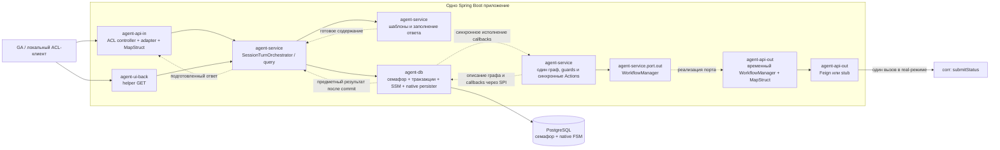
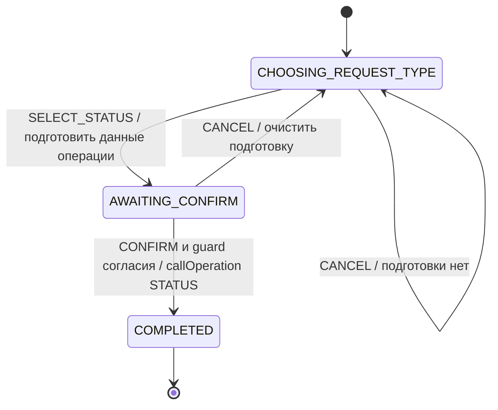
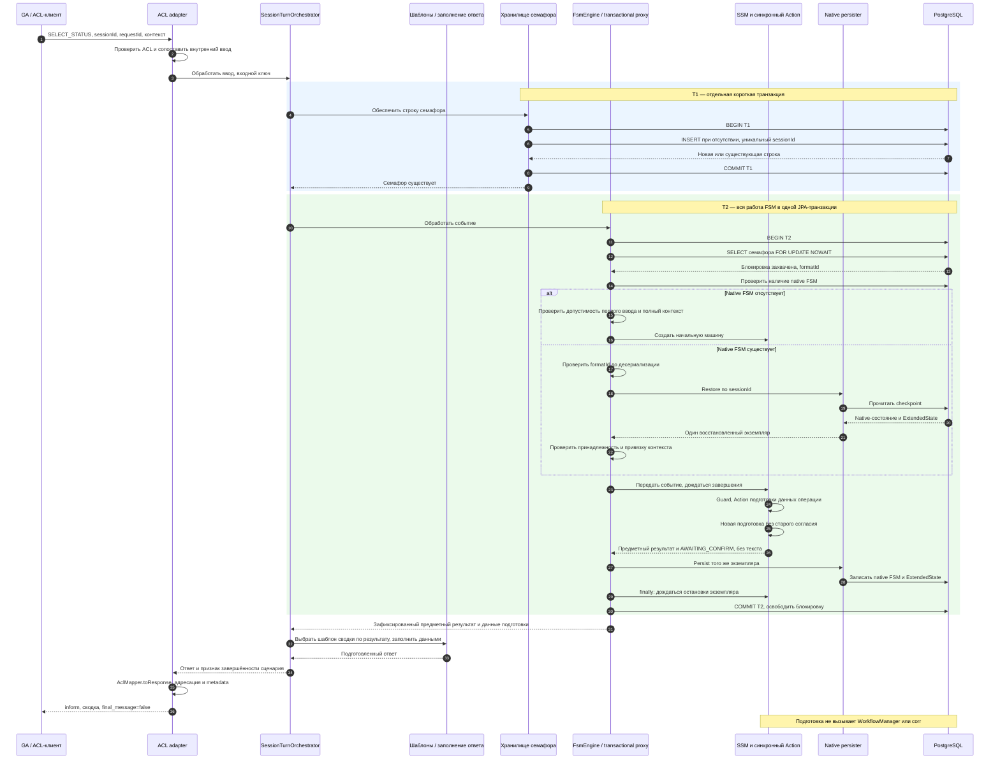
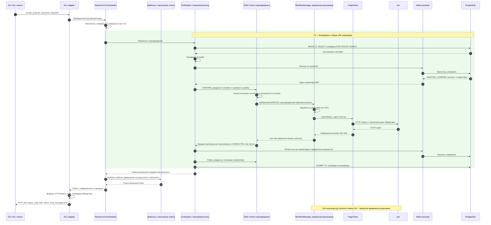
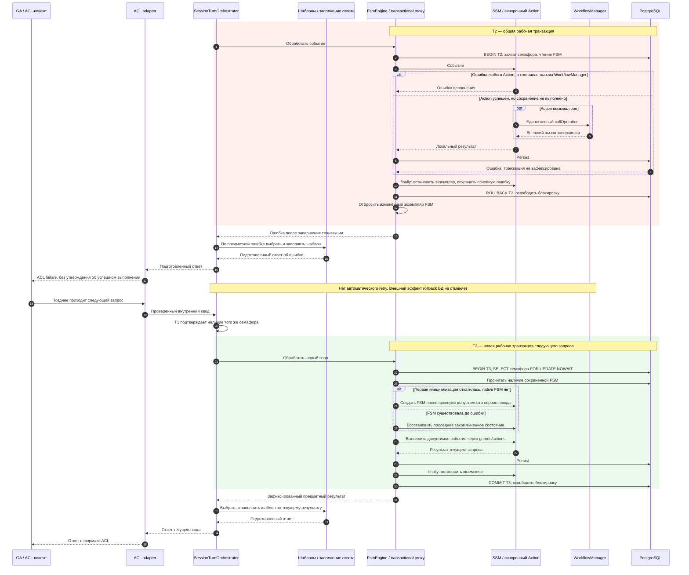
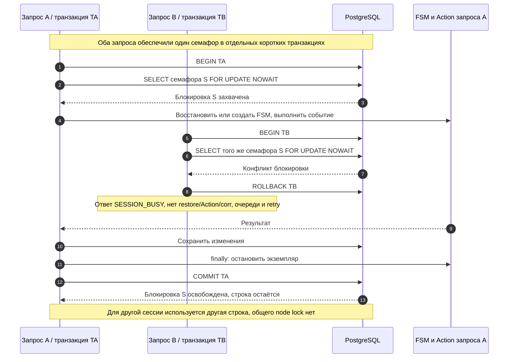
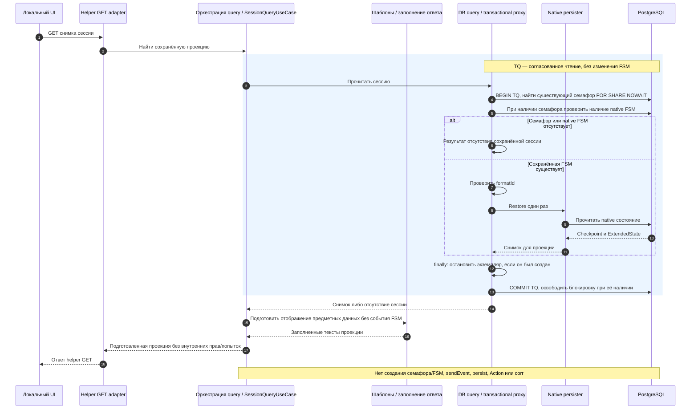

# План рефакторинга POC по согласованной архитектуре

**Последующее решение 05.10.2026:** [task02](../../../tasks/task02/arch_design.md) снимает заменяемую абстракцию FSM по [ADR-021](../../../adr/0021-direct-spring-statemachine.md). Этот план сохраняет историю выполненного рефакторинга; новое распределение модулей и сокращение моделей согласованы в task02. Поведение и транзакционные гарантии сохраняются.

**Редакция:** 05.10.2026. **Статус:** план выполненного рефакторинга с последующими согласованными уточнениями. Код и схема БД переработаны, старый runtime удалён. Фактические результаты приёмки и её границы приведены в [истории](history.md) и [заключении](architecture_review.md); наличие выполненного плана не означает проверки реальных банковских интеграций.

## 1. Основания и границы

Источники: [критическое review](architecture_simplicity_review.md) — обнаруженные проблемы; [принятые решения](architecture_simplification_decisions.md), прежде всего §12–20, — выбранный способ их устранения. Поздние ответы пользователя заменяют ранние предложения review и предварительные списки сохранения полей/тестов в §6–9 решений. В частности, SSM сохраняется, журналы corr и межтранзакционное владение удаляются, а подготовкой ответа занимается общий оркестратор вне FSM/Actions. Старый порядок исправлений из review не является планом этой работы.

Цель: один выбор перехода в SSM, один экземпляр машины на рабочую транзакцию, один синхронный вызов WorkflowManager из Action и одна точка блокировки на сессию. Новый POC поддерживает только STATUS, сохраняет подготовку и отдельное подтверждение, после успешной операции завершает сессию.

Не входят: RECALL/DETAILS как работающие операции, LLM/RAG, полное подключение поверхности GA, полноценный Outbox/УСС, автоматические повторы, история действий, собственная входная дедупликация, перенос старых данных. OperationContext сохраняет утверждённое расширение `changes`; это не повод реализовывать будущие сценарии.

## 2. Целевая архитектура TO BE

Ниже — архитектура реализованного нового POC после рефакторинга. Временный WorkflowManager выполняет прямой вызов corr; будущий Outbox/УСС не входит в схемы ниже. Все бизнес-actions синхронные, транспорт corr сохраняет свои таймауты.

### 2.1. Путь обработки и границы модулей

```text
ACL controller → ACL adapter → SessionTurnOrchestrator
  → обеспечить семафор sessionId отдельным commit
  → BEGIN рабочей транзакции
      → SELECT семафора FOR UPDATE NOWAIT
      → восстановить FSM или создать её при отсутствии native-записи
      → SSM: guard → синхронный transition Action
          → при подтверждении: WorkflowManager.callOperation(STATUS, context)
              → MapStruct → выбранный Feign/stub-клиент → один submitStatus
      → получить предметный результат: код исхода, данные, состояние
      → сохранить native FSM и прикладные изменения
      → finally: дождаться остановки временного экземпляра FSM
    COMMIT / при ошибке ROLLBACK
  → оркестратор: выбрать шаблон по результату, заполнить, подготовить ответ
  → ACL adapter / MapStruct: собрать внешний ACL-ответ
  → controller / Spring: вернуть HTTP и JSON
```

Семафор остаётся после commit/rollback. Его существование не означает существования FSM или занятости. Ошибка чтения сохранённой FSM не означает её отсутствия. GET снимка не создаёт FSM, не подаёт событие и не вызывает WorkflowManager.

| Участок | Ответственность после рефакторинга |
|---|---|
| `agent-model` | Нужные DTO/entities/enums; предметный результат исполнения и подготовленный ответ имеют разную семантику; OperationContext и типизированные changes; без generated/SSM-типов |
| `agent-service` | SessionTurnOrchestrator связывает входные API с инфраструктурой исполнения, получает предметный результат, выбирает и заполняет шаблон. Граф/guards/Actions выполняют только бизнес-операции, вызывая порт WorkflowManager; без Feign/HTTP и предварительного вычисления target |
| `agent-db` | Семафор, транзакции, сборка SSM, native persister, один formatId и хранение; без зависимости на `agent-service` |
| `agent-api-out` | Временная реализация WorkflowManager, mapping на corr DTO, выбор существующего Feign/stub-клиента; без собственного исполнения по таймеру |
| `agent-api-in`, `agent-ui-back` | Преобразование входа и подготовленного оркестратором ответа в wire-контракт канала; без дублирования сценария и выбора бизнес-содержания ответа |
| `agent-main` | Wiring и конфигурация; без регистрации поколения исполнителя |

Прикладные callbacks передаются DB-адаптеру через минимальный существующий SPI/описание графа на типах проекта; только DB-адаптер связывает их с SSM `.guard(...)`/`.action(...)`. Не вводить обратную зависимость модулей, реестр плагинов или универсальный язык процессов. Action может содержать бизнес-логику непосредственно; отдельный сервис нужен только при самостоятельной ответственности.



Стрелки показывают runtime-вызовы и wiring, а не разрешение новых Maven-зависимостей. `agent-db` не импортирует `agent-service`; callbacks объявляются на доступной DB-адаптеру границе. `agent-service` не импортирует Feign или реализацию WorkflowManager. Блок шаблонов — локальная ответственность оркестрации, не отдельный микросервис и не обязательная цепочка дополнительных интерфейсов. Actions не обращаются к нему и не знают о GA, шаблонах, текстах и внешнем формате ответа. В stub-режиме внешнего вызова corr нет. `agent-main` собирает эти компоненты.

### 2.2. Хранение и граф состояний

| Данные | Где хранятся | Правило |
|---|---|---|
| sessionId и formatId | Техническая строка SessionEntity — семафор | Уникальный sessionId, отдельный commit создания; строка не удаляется после хода |
| Шаг, контекст платежа, предметная подготовка, согласие, последний предметный результат | Native FSM и её ExtendedState | Сохраняются в рабочей транзакции; здесь нет выбранного шаблона, подготовленного текста или ACL-ответа |
| Подготовленный ответ: заполненный текст/представление | Общий оркестратор после исполнения | Строится из возвращённого снимка данных; не записывается обратно в FSM дополнительным переходом/транзакцией |
| OperationContext | Снимок подтверждённых данных для Action/WorkflowManager | STATUS; operationId, epkId, digitalUserId, paymentId; changes отсутствует; отдельный журнал операций агента не создаётся |
| Входная идемпотентность | Будущая библиотека на входной границе | Сейчас только маркер @Idempotent и ключ; самописного replay нет |

Наличие семафора без native FSM допустимо. Native ID выводится из sessionId. FormatId проверяется до десериализации существующего checkpoint. После restore проверяются идентичность сессии и необходимые данные. Отсутствие checkpoint и повреждение существующего checkpoint — разные ситуации.



Обозначение конечного состояния не удаляет сохранённую FSM. При ошибке Action переход не фиксируется: вся рабочая транзакция откатывается. Успешный вызов временного менеджера завершает агентский сценарий; отдельного события corr-результата, SUBMITTING, SUBMIT_UNKNOWN или AWAITING_RETRY_CONFIRM в целевом пути нет. Подготовка содержит данные операции и её идентичность, не отображаемую строку. Оркестратор строит сводку из именно этих данных; согласие относится к подготовке, а новая подготовка требует нового подтверждения. Restore/GET не исполняет Actions этого графа.

### 2.3. S1 — подготовка: создание либо восстановление FSM

T1 — короткая транзакция обеспечения семафора; T2 — рабочая транзакция. Все запросы одной сессии используют один ключ. Повторное обеспечение существующего семафора не изменяет его formatId и не означает захват блокировки. Схема подготовки применима к первому выбору и выбору после отказа. В AWAITING_CONFIRM повторный SELECT_STATUS отклоняется без изменения подготовки; команды RESTART нет.



S1 показывает допустимый ввод. Недопустимое первое подтверждение не создаёт подготовку автоматически. Отказ guard не вызывает Action операции; обычный отказ допустимости и исключение Action не смешиваются. Ошибка любой стадии T2 обрабатывается по S3, занятый семафор — по S4.

Во всех схемах остановка — очистка временного Java-экземпляра, а не событие CANCEL или переход в COMPLETED. Обработка события завершается через complete до persist; finally со stop выполняется до выхода из транзакционного метода. Экземпляр после обработки не используется повторно. Ошибка очистки не маскирует основную ошибку; если основной ошибки нет, она вызывает rollback.

### 2.4. S2 — подтверждение, один вызов corr и завершение



Возврат void означает отсутствие бизнес-результата для FSM, а не сокрытие ошибки вызова. При ошибке вместо нормального возврата действует S3. В stub-режиме выбранный клиент завершает вызов локально; реального HTTP нет. Последующий запрос завершённой сессии не повторяет Action/corr и не открывает её заново.

### 2.5. S3 — ошибка, rollback и следующий запрос после сбоя

Правило действует для любого Action и ошибки сохранения; наличие corr не является условием rollback. T1 уже завершена, семафор сохраняется независимо от результата рабочей транзакции. При ошибке commit экземпляр уже остановлен в finally; Spring передаёт ошибку оркестратору вместо результата. Ниже показан известный rollback, а не неопределённый исход при потере соединения.



S3 иллюстрирует известный rollback и успешный следующий ход. После гибели процесса следующий запрос может захватить строку, когда БД завершит прежнюю транзакцию и освободит блокировку; мгновенное обнаружение разрыва не обещается. При потере соединения во время commit его исход может быть неизвестен: не объявлять rollback достоверным, следующий вход читает фактически сохранённое состояние. Повреждённый checkpoint не пересоздаётся. Временный путь не гарантирует отсутствие повторного внешнего эффекта после нового входа; новый журнал или retry для закрытия этого риска не добавляется.

### 2.6. S4 — конкурентные запросы одной сессии



Уникальность исключает две строки семафора при первом входе. Конкурентный INSERT может кратко ожидать разрешения конфликта уникального индекса; NOWAIT в S4 относится к захвату строки, не ко всем SQL-операциям. Создатель строки не получает отдельного приоритета выполнения.

### 2.7. S5 — чтение проекции без исполнения операции



Для семафора, занятого рабочей транзакцией на изменение, GET возвращает busy и не читает несогласованный набор данных. Shared-блокировка чтения позволяет нескольким GET читать одну сессию; она не создаёт отдельного протокола владельца. Ошибка чтения не превращается в отсутствие сессии. Отдельный кеш или собственный механизм версий для этого чтения не вводится. Проекция строится из сохранённых предметных данных с тем же заполнением шаблонов вне FSM; архив replay по Request-Id не создаётся.

### 2.8. Предметный результат → оркестратор и шаблоны → внешний ответ

**Прямое уточнение пользователя:** Action готовит только результат своей работы; он не знает про ГигаАссистента, шаблоны, отображение и то, что отвечать пользователю. Общий SessionTurnOrchestrator связывает входные API с внутренней инфраструктурой выполнения, получает результат и организует подготовку ответа внешней системе. Это заменяет прежнее ошибочное размещение текстов в Action.

| Этап | Ответственность | Место в потоке |
|---|---|---|
| FSM / Action | Выполнить бизнес-операцию, изменить предметное состояние, вернуть код исхода и типизированные предметные данные. Нет текста ответа, templateId, performative, status_code или знания о канале. | В рабочей транзакции, с общим persist/rollback |
| SessionTurnOrchestrator | Получить результат инфраструктуры, определить нужное представление, найти шаблон, заполнить его данными результата, собрать подготовленный ответ. Шаблоны и форматирование могут быть обычной локальной реализацией, вызываемой оркестратором. | После возврата транзакционного вызова, вне FSM/Actions |
| Адаптер входного API | Преобразовать подготовленный ответ в свой wire-контракт. Для GA — AclInputAdapter/AclMapper, транспортные коды, result/reason, адресация, корреляция, final_message. | После подготовки ответа оркестратором |
| Controller / Spring | Вернуть ResponseEntity и сериализовать JSON. | После адаптера |

Для ошибки Action транзакция сначала откатывается; оркестратор получает предметную ошибку и выбирает соответствующий шаблон, затем адаптер формирует failure. Ошибки транспортной формы до запуска сценария остаются на границе API; они не направляются в Action для изготовления текста.

Разделить семантику текущих FsmApplyOutDTO/ResultDTO/TurnOutDTO: результат исполнения — данные о выполнении; подготовленный ответ — результат работы оркестратора с шаблоном. Не передавать готовый ACL или строку для пользователя из Action. Конкретные имена типов не требуют отдельного слоя интерфейсов. В ExtendedState остаётся последний предметный результат, а не подготовленный текст. Подготовка содержит идентичность и снимок данных операции; сводка строится оркестратором по этому снимку, без повторного чтения изменившейся сессии.

**Текущий код:** `StatusSummaryService.summary()` и строки SessionTransitionPolicy — источники переносимого форматирования. В новой реализации их выбор/подстановка относятся к оркестрации и локальным шаблонам. В Actions переносится только бизнес-логика прежней policy. Не добавлять каталог шаблонов в БД, сетевой сервис или универсальный framework без требования; не вводить LLM для операционных ответов.

**Этап GA:** выбор нужного представления/шаблона и подготовка параметров также организуются вне FSM. Адаптер только выражает подготовленный ответ через согласованный контракт платформенных шаблонов GA. Точное поле кода и реальные примеры обмена ещё требуют внешнего контракта по [§10 требований GA](../../04_ga/requirements.md); пример T-C01 не является зарегистрированным кодом. Это не переносит знание GA в Actions и не требует реализовать полную GA-интеграцию сейчас.

В показанном TO BE подготовка ответа выполняется после commit. Сбой поиска/заполнения шаблона или сериализации не откатывает уже завершённую транзакцию и не запускает Action повторно; обрабатывается как ошибка подготовки/доставки ответа. Принятое временное ограничение о возможном corr без доставленного ответа сохраняется. Отдельную транзакцию для сохранения отформатированного текста обратно в FSM не вводить.

## 3. Порядок выполнения

Шаги 2–6 образуют одно связанное изменение runtime. Отдельные компоненты проверяются по мере готовности, но новый путь не считается готовым и не выпускается до переключения всех потребителей и удаления старого. Не создавать совместимые заглушки старых методов, feature flags или второй работающий путь ради промежуточного состояния сборки.

### Шаг 1. Привести нормативные документы к одному целевому решению

**Выполнен 04.10.2026:** 18 ADR и индекс переписаны; POC и применимость требований этапов 2–4 согласованы с принятыми решениями. Исторические схемы и исходные AC отделены от действующей приёмки.

**Изменить:** все ADR и [их индекс](../../../adr/README.md), затронутые требования/архитектуру/спецификацию POC и требования этапов 2–4. Использовать данный план как последовательность работ, а не как дополнительный набор гарантий.

- Заменить накопленные противоречивые уточнения единым действующим текстом каждого ADR. Историю решений оставить в истории и документе обсуждения.
- Разделить текущий POC, ограничения временного менеджера и будущую реализацию WorkflowManager. Не возвращать журнал команд, callbacks результатов, retry или owner-протокол через требования следующих этапов.
- Сохранить полезные ограничения: Spring Data, generated API/MapStruct, модули, штатный persister, PostgreSQL, явный stub/real, русская документация, TDD и минимальная приёмка.

**Готово, когда:** документы не требуют одновременно нового и старого пути; каждая защита имеет текущий инвариант и одну ответственную границу. Код ещё не изменён. Основание: D1–D4, решения §10–20.

### Шаг 2. Ввести контракт WorkflowManager и временный адаптер STATUS

**Участки:** `agent-service/.../port/out/SubmitStatusPort.java`, `agent-model/.../dto/corr`, `agent-api-out/.../investcorr/{service,mapper,client,config}`, существующий `invest-corr-prototype.yaml`.

- Ввести порт `void WorkflowManager.callOperation(Operation operation, OperationContext context)` в `agent-service.port.out` вместо старого выходного порта отправки с результатом.
- Создать OperationContext: `UUID operationId`, `String epkId`, `String digitalUserId`, `String paymentId`, необязательный `PaymentDetailsChangesDTO changes`. У changes — `recipientInn`, `recipientAccount`, `recipientName`, `paymentPurpose`; для STATUS changes отсутствует. Не добавлять owner, commandId, attempts, callback или результат.
- Переделать существующий `InvestCorrAdapter` в реализацию этого порта: mapping утверждённого контекста в generated DTO и один вызов выбранного клиента. OperationId использовать как идентичность внешней операции в предусмотренных текущим контрактом полях/ключе; не создавать второй независимый идентификатор той же операции.
- Сохранить Feign/stub и транспортные connect/read timeout, отключённый retry транспорта. Удалить преобразование исключений в UNCERTAIN и возврат CorrSubmitOutDTO в FSM. Ошибка вызова/контракта не должна превращаться в нормальное завершение void; результат внешней операции не становится отдельным событием агента.
- Уточнение от 05.10.2026: API/DTO генерируются стандартным OpenAPI Generator без собственных Mustache-шаблонов. InvestCorrHttpApi наследует generated-интерфейс и задаёт обычную @FeignClient-привязку. Основные настройки приложения и corr перенесены в application.yaml и профильные YAML; описание параметров — в README проекта.
- Не создавать endpoints/исполняемые ветви отмены и уточнения. Не добавлять слой gateway поверх менеджера или новый общий обработчик повторов.

**Проверка TDD:** mapping STATUS, один физический запрос, ошибка/таймаут выходит из менеджера без повторного запроса. Адаптировать `FeignInvestCorrClientTest`/`StubInvestCorrClientTest`, сохранив проверку реального HTTP-контракта и переключения режима. Основание: R4/R5/R7, K04, решения §13–16/19.

### Шаг 3. Подготовить семафор и единственный формат хранения

**Участки:** `SessionEntity`, `SessionRepository`, `JpaSessionStore`, `SessionAccess`, `NativePersistenceConfiguration`, XML в `agent-db/src/main/resources/db/changelog`.

- Переиспользовать техническую строку `SessionEntity` как постоянный семафор с уникальным sessionId; не создавать рядом вторую строку с тем же назначением. Она должна существовать независимо от native FSM и содержать один formatId, доступный до десериализации.
- Обеспечивать строку отдельной короткой транзакцией через Spring transactional proxy, завершённой до рабочей транзакции. Конкурентная вставка не должна давать две строки или помечать рабочую транзакцию rollback-only. Существующая строка не переинициализируется.
- Добавить захват `FOR UPDATE NOWAIT` в рабочей транзакции. При конфликте — SESSION_BUSY; без очереди, повторного входа по таймеру и флага occupied.
- Native ID выводить из sessionId. Убрать отдельный binding и независимые версии движка/связи/сериализации/графа/контекста. Несовместимый formatId отвергать до binary restore; после restore проверять принадлежность checkpoint сессии и необходимую форму данных.
- Подготовить целевую Liquibase-схему с одним master XML. Удаление таблиц старого протокола согласовать по порядку со шагом 6. Не вводить конвертеры старых данных; не переписывать молча уже применённые changeset и не очищать рабочую БД для запуска тестов.

**Проверка TDD:** конкурентное создание даёт один семафор; откат рабочей транзакции не удаляет его; несовместимый формат не десериализуется. SQL-блокировки проверять на PostgreSQL, не выводить их гарантии только из H2. Основание: A1, R6, U01/U02, решения §18–19.

### Шаг 4. Собрать единый транзакционный путь исполнения SSM

**Участки:** `FsmEngine`, `SsmFsmEngine`, `NativeMachineStore`, `FlowDefinition`/`FlowTransitionDTO`, `SessionFsmFacade`, `SessionTurnOrchestrator`.

- Заменить последовательность внешних load → initialize/apply → повторный restore единым входом обработки: захват семафора → проверка native-записи → создание/restore → событие → persist в одной рабочей JPA-транзакции.
- Для новой FSM сначала проверить допустимость первого действия и полноту контекста; отсутствие FSM после сбоя не разрешает подтвердить несуществующую подготовку. Для существующей FSM проверять неизменную привязку контекста под тем же семафором.
- Восстанавливать одну машину и сохранять тот же экземпляр; хранить текущий контекст, предметную подготовку, согласие и последний предметный результат в ExtendedState. Выбранные шаблоны, готовые тексты и ACL туда не записывать. Не создавать параллельное SQL-хранилище этих же данных или общий cache экземпляров SSM.
- Связать callbacks с синхронными transition actions. Не применять state doAction, параллельные регионы или переключение scheduler для бизнес-операций. Дождаться завершения события и Actions до persist.
- Обеспечить доведение любой ошибки Action до транзакционной границы и rollback независимо от типа исключения, включая ошибку, которую SSM мог сохранить у себя. Не считать одного ACCEPTED достаточным доказательством успешного Action. После rollback экземпляр машины отбрасывается; cleanup не маскирует первичную ошибку.
- Ответ об ошибке формировать вне откатившейся транзакции. Успешный ответ выходит только после commit. GET восстанавливает сохранённое состояние без события и внешнего эффекта.

**Проверка TDD:** реальный Action пишет прикладные данные и меняет FSM; ошибка откатывает обе записи, успех сохраняет обе. Проверить общий JPA-ресурс Action/persister, повторный вход после сбоя создания и восстановление без эффекта. Использовать существующие DB-тесты, без постоянного диагностического framework. Основание: R1/R2, U09, решения §12/16/18.

### Шаг 5. Перенести бизнес-переходы в SSM и подключить WorkflowManager

**Участки:** `SessionFlowDefinition`, `SessionTransitionPolicy`, `StatusSummaryService`, `SessionTurnOrchestrator`, `TransitionPolicy`, `TransitionDecisionDTO`, `SessionState`/`SessionEvent`/`TurnCommand`.

- Сохранить один граф POC: выбор статуса → подготовка данных операции → отдельное подтверждение → синхронный Action → COMPLETED. Сводку после подготовки строит оркестратор. В AWAITING_CONFIRM допустимы только CONFIRM и CANCEL; после отказа новый выбор создаёт новую подготовку. По уточнению пользователя чат один, следующее сообщение доступно только после ответа агента. Отдельного идентификатора подтверждаемого ответа во входе нет; дополнительный протокол защиты от произвольной доставки старого согласия в этот объём не входит.
- Guards решают допустимость перехода, Actions выполняют изменения/вычисления. Удалить внешний вычислитель target, готовый TransitionDecisionDTO и guard сравнения с заранее выбранным target.
- Action подтверждения собирает снимок подтверждённых данных и один раз вызывает WorkflowManager. Он не возвращает FSM в SUBMITTING для отдельного исполнителя. После успеха переход завершается; исключение вызывает правило шага 4.
- Удалить ветви ожидания corr-результата, технического retry и сопоставления event/outcome. Каждое пользовательское намерение переводится в событие один раз; допускаемый переход выбирает только SSM.
- Разделить бизнес-подготовку и форматирование, сейчас смешанные в `StatusSummaryService`/policy: проверки и данные относятся к исполнению, summary/тексты — к оркестрации шага 7. Не вводить обязательный Action → Service для каждого действия. Оркестратор больше не вызывает corr после завершения FSM.
- Action возвращает предметный исход и данные по §2.8; не выбирает шаблон и не формирует строку ответа. В PreparationDTO заменить зависимость от summary-текста снимком предметных данных и идентичностью подготовки; согласие по-прежнему относится к конкретной подготовке. Окончательный состав DTO определить по реальным потребителям, без универсального Map.

**Проверка TDD:** перенести нужные сценарии `SessionTransitionPolicyTest` на реальную SSM: выбор/подтверждение, отказ, новая подготовка, недопустимое событие, завершённая сессия. Вызов менеджера есть только на допустимом подтверждении и ровно один; проверки этого поведения объединять с шагом 4, не дублировать наборами. Основание: A2 (с выбранным сохранением SSM), R2/R3, U07/U08, K05, решения §12/19.

### Шаг 6. Удалить заменённый протокол и переключить wiring

**Участки:** `agent-service/.../{corr,execution}`, `agent-db/.../{session,repository,api}`, `agent-model/.../{dto,entity,enums}`, `PocConfiguration`, Maven/config и Liquibase.

**Обязательное требование: устаревший код физически удалить из исходников и сборки в рамках этого рефакторинга.** Отключение bean, отсутствие вызовов, аннотация Deprecated, перенос в legacy-пакет, закомментированный код или переключатель старого пути не считаются выполнением. Не откладывать удаление на отдельный будущий этап. История прежнего решения остаётся в Git и явно исторических документах.

Удалять вместе с потребителями и тестами исключительно удалённой гарантии:

| Группа | Что убрать |
|---|---|
| Старый corr-путь | CorrSubmissionService, SubmitStatusPort, beginAttempt/применение результата, submission/attempt entities и repositories, результатные DTO/enums, corr-журналы и соответствующие XML-объекты |
| FSM-журнал | FsmCommandEntity/Id/Repository, duplicate/replay/hash-conflict, max(resultRevision), DUPLICATE, сериализацию команды ради журнала |
| Binding | FsmBindingEntity/Repository, таблицу и wiring, дублирующие metadata/версии |
| Владение | ExecutionEntity/ExecutorNodeEntity и repositories, ExecutorRegistrationService, bootGeneration/executionToken/node lock, startup-регистрацию из PocConfiguration и обработку старого fencing |
| Внутренние ключи | @Idempotent initialize/apply, их String-аргументы, commandId/resultCommandId и проверки без потребителей |
| Лишнее исполнение | Локальный retry corr, ручной afterPropertiesSet, конфигурацию/зависимости без других текущих потребителей, широкие catch с успешным продолжением |
| Смешение исполнения и ответа | Сборку пользовательских текстов, выбор шаблона и поля внешнего протокола внутри FSM/Actions; старые текстовые поля из native-контекста после переноса потребителей на предметные данные |

- Удалить `TransitionJournal` и `SnapshotCodec`, если после переноса оставшегося сохранения они больше не нужны. Не оставлять пустой класс и не создавать ему замену только ради старого имени.
- Из snapshot/view и mapper убрать submission/execution, ненужные технические версии и expectedRevision раздельного load/apply. Версию отображения или идентичность подготовки сохранять только при существующем потребителе/бизнес-инварианте; проверки согласия не удалять как «ещё одну revision».
- Входные @Idempotent и отдельный ключ sessionId:requestId оставить. Не добавлять AOP, Request-Id-журнал или другой самописный replay; runtime-идемпотентность всё ещё отложена до библиотеки.
- Проверить POM, imports, Spring beans, managed-types, сериализацию и XML: старый путь не должен оставаться доступным из оркестратора, GET или startup. Смешанные тесты сохранить и адаптировать.

**Готово, когда:** приложение собирается на новом пути; удалены сами устаревшие реализации и их production-потребители, wiring, ненужные DTO/entities/repositories, настройки и зависимости. Старые таблицы отсутствуют в целевой схеме; уже применённая история Liquibase не переписывается ради отсутствия старых имён в файлах. Тесты отменённых механизмов удалены, смешанные тесты адаптированы. Обычный `rg` и review достаточны, ArchUnit не добавляется. Основание: A3, R4/R5/R6/R7, U03–U06/U10/U11, K01–K04, решения §15–18.

### Шаг 7. Подготовить ответ в оркестраторе и преобразовать его в API канала

**Участки:** `SessionTurnOrchestrator`, форматирование из `StatusSummaryService`/policy, локальные шаблоны, `AclInputAdapter`, `AclMapper`, `acl-poc.yaml`, `FsmApplyOutDTO`/`ResultDTO`/`TurnOutDTO`/`SessionViewOutDTO`, helper GET и потребители тестового UI.

- После результата транзакционного исполнения оркестратор выбирает и применяет локальный шаблон по предметному исходу, подставляет типизированные данные возвращённого снимка и собирает подготовленный ответ. Этот код не вызывается из Action. Организовать только нужные POC шаблоны; отдельная БД, сеть или универсальный framework шаблонов не нужны.
- Успешный STATUS после commit: HTTP 200, `message.content.status_code="200"`, `message.performative="inform"`, `metadata.final_message=true`, текст в content.result. Источники: [коды](../../../api/error_codes.md), [ACL 1.6](../../../api/api_contract_details_1.6.md). Не использовать performative proxy для завершения.
- Для подготовки final_message=false; после ошибки Action не возвращать успешный результат или выдуманное завершение. При неизвестном внешнем исходе не утверждать, что corr ничего не выполнил. Ошибки кодировать по действующему профилю/реестру.
- Явно сохранить границу §2.8: AclInputAdapter/AclMapper формируют ACL из уже подготовленного оркестратором ответа; не выбирают бизнес-переход или шаблон сводки. Для helper GET переиспользовать подготовку представления вне FSM, не подавать событие ради форматирования.
- В COMPLETED не предлагать новые действия той же сессии. Удалить UI-ожидание callback, состояние физической попытки и управляющие элементы старого retry-протокола.
- Сохранить проверки ACL 1.6, адресата, Request-Id/reply_with и доверенной привязки. Выполнять каждую на своей границе один раз; generated DTO остаются в адаптерах. Не объединять этот рефакторинг с полным внедрением GA или UI-редизайном.

**Проверка TDD:** адаптировать SessionTurnOrchestratorTest: предметный результат даёт нужный шаблон и значения именно возвращённого снимка; ошибка подготовки ответа не вызывает FSM/WorkflowManager повторно. Обновить существующие ACL/HTTP/helper-тесты: выбор → сводка → подтверждение → финальный ответ; ошибка Action → rollback и failure; новый вход в COMPLETED не вызывает менеджер. Это не проверка отложенного replay Request-Id. Основание: R2, решения §16/17/19/20.

### Шаг 8. Выполнить минимальную приёмку нового пути

Приёмка реализована в `SessionPersistenceTest`, `PostgresSessionPersistenceIT`, HTTP-тестах, `PocEndToEndIT`, `PocCorrTimeoutIT` и `PocJarSmokeIT`. Проверки native-состояния включены в persistence-набор; старые owner/attempt/replay и crash-протоколы удалены вместе с отменённым кодом.

| Проверка | Что она доказывает |
|---|---|
| Rollback Action и persist | Native FSM и прикладные изменения коммитятся/откатываются вместе; ошибка не поглощается |
| Отказ commit PostgreSQL | После успешного persist отложенное ограничение отклоняет commit; HTTP возвращает failure, снимок и прикладная тестовая запись откатываются, corr не повторяется. Потеря соединения с неизвестным исходом не моделируется |
| Семафор и сбой первой обработки | Запись семафора остаётся; следующий запрос создаёт отсутствующую FSM и обрабатывает допустимое действие |
| Конкуренция на PostgreSQL | Одна сессия — один Action, конкурент получает busy; разные сессии не сериализованы node lock; рабочая блокировка снимается при завершении транзакции |
| Restore/LOB/formatId | Состояние читается штатным persister, несовместимый формат не десериализуется, restore не вызывает Action/corr |
| Feign/stub и HTTP-сценарий | Один submitStatus, transport timeout без retry, корректный mapping и финальный ответ GA |
| Оркестрация ответа | По предметному результату выбран и заполнен правильный шаблон; форматирование не меняет FSM и не вызывает повтор операции |
| JAR и профили | Приложение запускается с новой схемой и wiring, без регистрации исполнителя и ненужных beans |

Для изменений поведения применять RED → минимальная реализация → GREEN в шагах 2–7. Удаление кода/тестов отменённого функционала не требует искусственного RED. По завершении выполнить `mvn verify -Pintegration-tests` с доступной PostgreSQL/Docker-инфраструктурой; уточнить фактический запуск необходимых IT по Maven-результатам, а не только exit code. Форматирование и обязательные проверки reactor не пропускать. Не запускать повторно успешные проверки без изменения/причины; отчёты оставлять в target.

Временный прямой менеджер **не обеспечивает exactly-once внешнего эффекта** при успешном corr и последующем rollback/сбое ответа. Принятый риск не маскировать старым crash-тестом, новым журналом или скрытым retry. Тестировать восстановление локального состояния; не обещать отмену уже выполненного corr. Основание: решения §15–18, ADR-017 и правила минимальных тестов AGENTS.md.

### Шаг 9. Обновить фактическую архитектуру и проверить отсутствие новой избыточности

- После реализации обновить [C4](c4_architecture.md), актуальные sequence, архитектуру/спецификацию POC и историю. Показать отдельно короткую транзакцию создания семафора, рабочую транзакцию, внешний эффект до commit и ответ после commit.
- Реестр entities/DTO/валидаций должен описывать оставшийся код и причину каждой защиты. Разделить предметный результат Actions, подготовленный оркестратором ответ и wire DTO канала. Старую Outbox/УСС-схему пометить исторической/отложенной; не выдавать её за реализованный путь.
- Сверить новый код с матрицей ниже: один граф, один restore, один владелец проверки, один вызов менеджера; нет классов только для передачи вызова без отдельной ответственности.
- Подтверждать готовность поведением и результатами проверок, а не количеством тестов или наличием документа. Будущие этапы добавляют операции/каналы в существующие границы по фактическим контрактам; механизм исполнения не строится заранее.

**Готово, когда:** документация описывает проверенный новый POC; список выполненного и отложенного совпадает с кодом. Основание: D1–D4, U12, все решения §12–20.

## 4. Покрытие замечаний и критерий завершения

| Основание | Шаги плана |
|---|---|
| R1 — повторные restore | 4, 8 |
| R2 — дубли проверок | 4–7, 9 |
| R3 — два описания события/исхода | 5–6 |
| R4 — неиспользуемый payloadHash | 2, 6 |
| R5 — поглощение ошибок | 2, 4, 6–8 |
| R6 — node lock | 3, 6, 8 |
| R7 — повтор lifecycle | 6 |
| A1 — binding/версии | 3–4, 6 |
| A2 — два механизма перехода | 4–5; SSM сохраняется, прежний вариант критика не применяется |
| A3 — журнал/replay/max | 6 |
| K01–K05 | 2, 5–6 |
| Решение §20 — Actions без ответов, шаблоны в оркестрации | 4–7, 9 |
| D1–D4 и U01–U12 | 1–9; новая история/outbox не реализуются |

Работа завершена, когда все шаги выполнены и нужные проверки прошли. **Обязательный критерий приёмки — физическое удаление устаревшего кода по шагу 6. Работающий новый путь при сохранённых старых реализациях не считается завершённым рефакторингом.** В итоговом review проверить отсутствие старых runtime-ветвей, а не только отсутствие вызовов; для каждого оставленного спорного типа указать его текущего потребителя и назначение. Исторические документы и применённые Liquibase changeset не являются оставленным runtime-кодом.

Новый путь и миграция реализованы, старые runtime-классы и их тесты удалены. Дополнительные замечания к качеству кода и решения приведены в [ревью](code_smells_review.md). Фактический результат полной приёмки фиксируется в [заключении](architecture_review.md).
