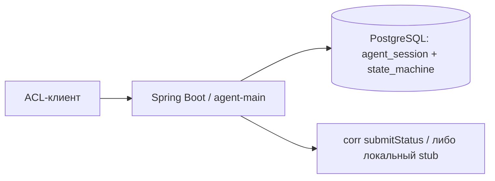
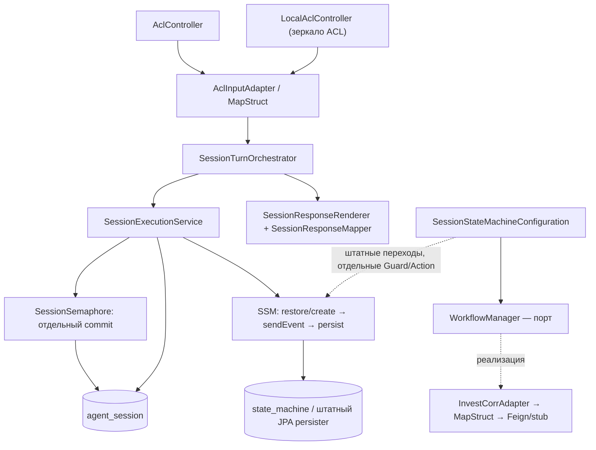

# Архитектура реализации POC после упрощения

**Редакция:** 04.10.2026. Описывает новый runtime STATUS. Прежние схемы owner/fencing, журналов и corr-result доступны в истории Git. Приёмка фиксируется в [истории этапа](history.md).

## Контекст и контейнеры

Локальный ACL-клиент вызывает одно Spring Boot приложение. Оно хранит сессии в PostgreSQL; файловая H2 служит локальному запуску. В real-режиме приложение обращается к corr через временный HTTP-контракт. Настоящая поверхность GA, LLM и Outbox/УСС пока не подключены.



## Компоненты и границы



DB не импортирует service. Исполнение и штатная конфигурация SSM находятся в service.fsm; native persister и сериализация — в agent-db. Собственных FlowDefinition и DTO переходов нет. API использует нормализованные данные без SSM-типов.

## Один пользовательский ход

```mermaid
sequenceDiagram
    participant A as ACL adapter
    participant O as SessionTurnOrchestrator
    participant S as SessionSemaphore
    participant E as SessionExecutionService
    participant M as SSM / Action
    participant W as WorkflowManager
    participant D as PostgreSQL
    A->>O: нормализованный вход
    O->>S: ensure(sessionId)
    S->>D: короткая транзакция регистрации семафора
    D-->>S: COMMIT
    O->>E: process(input)
    E->>D: BEGIN; семафор FOR UPDATE NOWAIT
    E->>M: создать или восстановить одну FSM
    E->>M: событие; guard и синхронный Action
    opt отдельное подтверждение
        M->>W: callOperation(STATUS, OperationContext)
        W-->>M: void либо исключение
    end
    M-->>E: предметные данные
    E->>D: native persist
    E->>M: finally: stopReactively().block()
    E->>D: COMMIT
    E-->>O: сохранённый снимок
    O->>O: выбрать и заполнить текст по снимку
    O-->>A: подготовленный ответ
    A-->>A: MapStruct → ACL
```

После завершения события и native save временный экземпляр останавливается в finally; затем Spring завершает рабочую транзакцию. При ошибке Action/save остановка также выполняется до выхода к транзакционной границе. Ошибка самой остановки вызывает rollback либо добавляется к основной ошибке. При отказе commit успешный ответ не формируется; результат commit при потере соединения может оставаться неизвестным. Экземпляр не переиспользуется, семафор остаётся. Уже выполненный corr не откатывается; сбой ответа после commit также не запускает Action повторно.

При первом ходе допустим только SELECT с operation=STATUS с полным контекстом. Наличие семафора без native FSM допустимо после сбоя. Существующая повреждённая или несовместимая FSM не пересоздаётся.

Внутреннее чтение сессии берёт FOR SHARE NOWAIT, восстанавливает один checkpoint и отдаёт снимок оркестратору. Он не создаёт семафор, не подаёт событие и не вызывает менеджер. PostgreSQL требует обычную транзакцию для FOR SHARE: флаг readOnly у JDBC не используется. Несколько читателей совместимы; конфликт с писателем возвращает SESSION_BUSY.

## Граф

| Состояние | Событие | Результат |
|---|---|---|
| CHOOSING_REQUEST_TYPE | SELECT | Новая подготовка → AWAITING_CONFIRM |
| CHOOSING_REQUEST_TYPE | CANCEL | Подготовки нет, состояние сохраняется |
| AWAITING_CONFIRM | CANCEL | Удаление подготовки → CHOOSING_REQUEST_TYPE |
| AWAITING_CONFIRM | CONFIRM | Guard отдельного согласия → один менеджер → COMPLETED |
| COMPLETED | Любой вход | Предметный отказ, без новой операции |

Кнопки чата отображают suggestions и запрос согласия propose по ADR-020. Окончательное решение принимает SSM, внешнего вычислителя target нет.

## Реестр данных

| Тип | Потребитель и назначение |
|---|---|
| SessionEntity | agent_session: постоянный ключ блокировки sessionId и formatId до десериализации |
| JpaRepositoryStateMachine | Единственный native checkpoint, ID равен sessionId.toString() |
| SessionTurnInDTO / PaymentContextInDTO | Нормализованное намерение и явно переданные реквизиты |
| TrustedPaymentContextDTO | Исходная принадлежность организации, пользователя и платежа |
| PreparationDTO | Снимок платежа, preparationId, номер подготовки и отдельное согласие; текста нет |
| SessionSnapshotDTO / TurnOutcome | Предметный результат после транзакции; последний исход сохраняется в ExtendedState |
| PreparationViewDTO / SessionViewOutDTO / ResultDTO / TurnOutDTO | Заполненные оркестратором представления и тексты, не сохраняемые в FSM |
| OperationContext | Подтверждённая операция; operationId равен preparationId и уходит в два поля corr одного значения |
| PaymentDetailsChangesDTO | Утверждённая модель будущих уточнений; для STATUS отсутствует |
| FlowTransitionDTO | Описание дуги с guard/Action; callbacks не сериализуются |

ProjectionVersion остаётся внутренним счётчиком сохранённого снимка; GET сессии удалён по ADR-020. PreparationNo нужен отображению последовательных подготовок; счётчики не являются expectedRevision команды или правом исполнителя. LastRequestId связывает последний исход с входом, не создаёт архив ответов. Типизированные changes оставлены по явному ADR-006; работающих RECALL/DETAILS нет.

Таблицы прежних binding, команд, владельцев и corr удаляет миграция 0003. Применённые changeset 0001/0002 сохранены. Старым строкам назначается legacy-v1, новые используют status-v2; автоматической конвертации checkpoint нет.

## Владелец каждой проверки

| Проверка | Место и причина |
|---|---|
| UUID, ACL 1.6, адресаты, reply_with, формат metadata | AclInputAdapter проверяет конверт; AclMapper возвращает целый новый вход с преобразованными реквизитами или ошибкой |
| Полнота первого платежа, подмена переданных реквизитов | ContextBinding под семафором: неизменная принадлежность сессии |
| Допустимость события и отдельное согласие | Граф SSM и его guard: операция только после подготовки |
| formatId, sessionId и форма сохранённых данных | NativeMachineStore: повреждение не становится новой сессией |
| Одновременный ход / согласованное чтение | SessionRepository: NOWAIT на общей строке, без owner-протокола |
| Ответ внешнего контракта | InvestCorrAdapter: ошибка не становится успешным void |
| HTTP/ACL-поля | Входной адаптер: внешний протокол не проникает в Action |
| Схема аргументов и наличие локальных текстов | SessionResponseRenderer при старте: ошибка каталога выявляется до внешнего эффекта |
| Типизированные причины и финальность отказа | ResultCode и TurnOutDTO.terminal: известная завершённость не зависит от наличия полной проекции |

`SessionResponseRenderer` готовит тексты для ACL POST и внутреннего чтения из `session-responses.properties`; `SessionResponseMapper` собирает представления по именам полей. `PreparationMapper` и `PaymentContextMapper` создают независимые снимки реквизитов. Имена ExtendedState принадлежат NativeMachineStore; общий ACL-профиль и его ключи принадлежат транспортному `AclProfile` в agent-common.

[Требования](requirements.md), [спецификация](technical_specification.md), [план рефакторинга](architecture_refactoring_plan.md), [действующие ADR](../../../adr/README.md). Прежнее ревью и схемы Outbox/УСС сохранены в [архиве](README.md).
