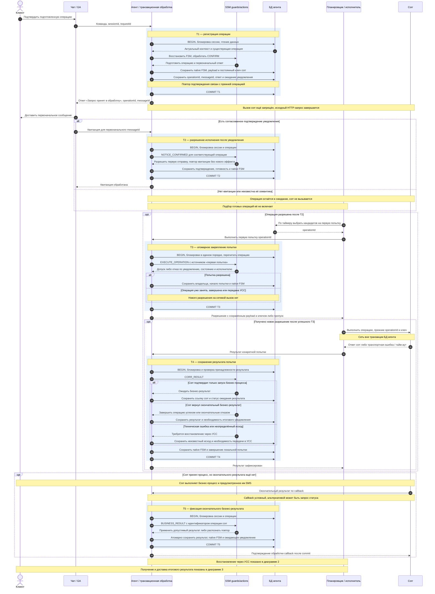
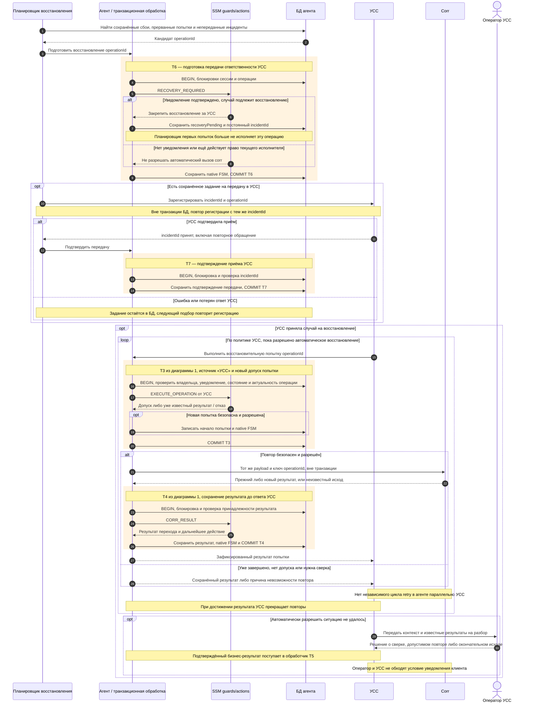
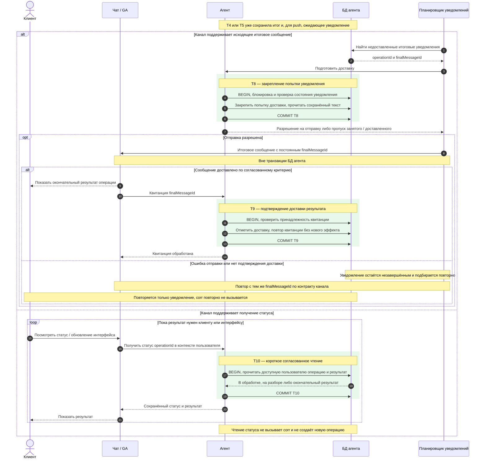

# Предлагаемый протокол: FSM, операция в БД, corr, УСС и ответ в чат

**Граница ответственности уточнена:** агент делает один `void WorkflowManager.callOperation(...)` в Action, без собственных повторов, таймеров внешнего исполнения и интеграции УСС. Все такие операции инкапсулированы в будущем менеджере, реализация которого отложена. Показанные далее планировщики и recovery относятся к предыдущему обсуждению, а не к задачам агента. [§14 решений](architecture_simplification_decisions.md#14-единственный-вызов-менеджера-и-полная-передача-ему-исполнения).

**Важно: последующие решения изменили этот вариант.** Пользователь принял успешную отдачу ответа ГигаАссистенту за доставку клиенту, без отдельной квитанции. Операции `void WorkflowManager.callOperation(...)` не требуют возврата бизнес-результата в агент. Поэтому показанные ниже квитанции первоначальной доставки, обратные результаты в FSM и доставка итогового ответа описывают **предыдущий вариант обсуждения**, а не текущие требования. Они не входят в согласованный контракт WorkflowManager. Актуальные ответы и минимальный контекст — [§13 решений](architecture_simplification_decisions.md#13-контракт-без-результата-и-предложение-минимального-operationcontext). Механизм разрешения отправки после успешной отдачи ответа GA ещё предстоит определить; сам afterCommit этого не гарантирует.

**Последующее решение:** согласованы синхронные transition actions и вызов `WorkflowManager.callOperation(Operation operation, OperationContext context)`; его outbox/УСС-реализация отложена. Следующие схемы показывают обсуждаемый будущий протокол за этой границей, а не объём немедленной реализации и не утверждение всех внешних контрактов. См. [§12 решений](architecture_simplification_decisions.md#12-синхронные-transition-actions-и-граница-workflowmanager).

Статус: **схема для обсуждения, реализация не начата**. Документ развивает [зафиксированные решения, §11](architecture_simplification_decisions.md#11-приоритет-уведомления-клиента-и-восстановление-через-усс). Он описывает целевой сценарий отмены/изменения платежа; текущий POC реализует запрос статуса и ещё не поддерживает показанные квитанции чата, планировщик операций и интеграцию УСС. Действующие ADR автоматически не заменяются этим документом.

Приоритет пользователя: положительный ответ в чате без выполненной операции предпочтительнее необратимого исполнения corr без уведомления клиента. Пропущенное исполнение восстанавливает УСС, при необходимости с участием оператора. На схемах начальный ответ сформулирован как «Запрос принят в обработку»; окончательное сообщение об исполнении формируется по подтверждённому бизнес-результату. Иная положительная формулировка первого ответа не меняет технического статуса операции.

## Условия чтения схем

- Прямоугольник `Tn` — одна локальная JPA-транзакция **БД агента**. После `COMMIT` блокировки строк освобождены. Ожидание чата, corr и УСС выполняется вне неё. Внутренние транзакции внешних систем здесь не определяются.
- `Агент`, `SSM` и `Планировщик` — ответственности внутри приложения, а не предложение трёх новых микросервисов. Планировщик выбирает работу; допустимость переходов и бизнес-действия определяют guards/actions SSM.
- Внутри Tn исходный JPA-поток блокирует данные, восстанавливает машину, ждёт завершения события SSM и сохраняет её штатным persister. Обычный transition `.action(...)` в проверенной плоской конфигурации SSM 4.0.2 выполняется на том же потоке: SQL и регистрацию transaction synchronization можно выполнять непосредственно в таком Action. State doAction выполняется отдельно и JPA-транзакцию не наследует. Reactive API сам по себе не означает переключение потока; гарантию нужно пересматривать при добавлении параллельных регионов, асинхронных actions/guards или других переключений исполнения.
- `operationId` — постоянный идентификатор одного подтверждённого намерения и основа ключа corr. `messageId` — идентификатор конкретного сообщения клиенту. Повторная доставка команды, квитанции или результата не создаёт новую логическую операцию. Готовность входной библиотеки идемпотентности ещё требуется проверить: текущая аннотация сама этого не обеспечивает.
- Квитанция первоначального ответа — **условие схемы, контракт GA пока не подтверждён**. Нужно согласовать, означает ли она доставку, отображение или гарантированную доступность сообщения в истории. Это технический сигнал, а не дополнительное согласие пользователя и не доказательство прочтения человеком.
- Ключ corr должен исключать повторный запуск всей операции, включая SMS, на протяжении окна восстановления УСС. При неизвестном исходе и отсутствии такой гарантии автоматический повтор заменяется сверкой или разбором оператором.
- В показанном варианте агент выполняет первую попытку. УСС управляет последующими попытками через единый исполнитель агента. Это предлагаемый способ интеграции; фактический интерфейс УСС ещё надо согласовать.

## 1. Полный основной путь: регистрация, уведомление, первая попытка, результат

Если результат получают запросом статуса, сетевое чтение corr выполняется перед T5 без транзакции БД агента, затем полученный результат проходит тот же обработчик. Ответ «corr принял процесс» сам по себе не переводит отмену платежа в состояние «выполнено». При окончательном бизнес-отказе автоматическое повторение не подразумевается: допустимость повторов должна быть определена контрактом.

## 2. УСС: падение процесса, надёжная передача инцидента и повторы

Передача в УСС также пересекает границу БД и сети. Поэтому необходимость передачи сохраняется, а сама регистрация инцидента повторяется с постоянным идентификатором. Подбор включает сохранённые технические ошибки и прерванные попытки. Отсутствие результата или истечение времени не доказывает, что corr ничего не выполнил.

Если агент упал после успешного corr, но до T4, в БД останется незавершённая попытка. УСС восстанавливает её только по контракту безопасного повтора/сверки. Даже если подтверждение T7 потеряно, повтор регистрации одного incidentId не должен создавать второго независимого исполнителя. Завершение случая в УСС должно надёжно отражаться в состоянии агента; повтор его сообщения допустим, изменение операции назад из окончательного состояния — нет.

Определение прерванного исполнителя и разрешение новой попытки требуют согласованного протокола владения. Существующий механизм смены поколения запуска можно переиспользовать; автоматический takeover живого, но медленного исполнителя по одному таймеру в этой схеме не разрешён. Если срок идемпотентности corr истёк или поздняя отмена платежа уже недопустима, требуется сверка/оператор, а не новый ключ для прежнего намерения.

## 3. Возврат результата пользователю: исходящее сообщение или получение статуса

После T4/T5 итог сохранён независимо от HTTP-запроса, который инициировал операцию. Для исходящих сообщений необходимость доставки и идентификатор сообщения записываются **в той же транзакции**, что и итог. Последующая ошибка чата не отменяет бизнес-результат и не разрешает повтор corr.

Push и получение статуса — варианты доставки, а не требование реализовать оба сразу. При поддержке обоих они читают один сохранённый результат. Если канал не предоставляет ни исходящее сообщение, ни получение статуса, результат в чат после завершения исходного HTTP-запроса вернуть нельзя без изменения контракта.

Сбой или потеря квитанции итогового сообщения не считается новым бизнес-сбоем corr. Дедупликация сообщений по finalMessageId зависит от канала: без неё повторная доставка может показать дубль. Восстановление зависшей попытки уведомления должно быть предусмотрено, иначе одного поиска записей, ещё не помеченных отправленными, недостаточно.

## Границы транзакций

| Транзакция | Что фиксируется вместе | Что выполняется после commit |
|---|---|---|
| T1 | Native FSM, подтверждённая операция, payload/ключ, первоначальный ответ и ожидание уведомления | Возврат ответа в чат |
| T2 | Подтверждение уведомления, разрешение первой попытки и FSM | Операция становится доступна таймеру |
| T3 | Допуск и владелец попытки, её начало и FSM | Ровно одна разрешённая физическая попытка corr |
| T4 | Результат попытки, FSM, ожидание бизнес-результата / итоговое уведомление / необходимость УСС | Ожидание callback, доставка итога или передача УСС |
| T5 | Окончательный бизнес-результат, FSM и необходимость итогового уведомления | Подтверждение callback и доставка результата |
| T6 | Передача ответственности на восстановление, постоянный incidentId и FSM | Регистрация в УСС |
| T7 | Подтверждение регистрации инцидента в УСС | Удаление необходимости повторять регистрацию |
| T8 | Закрепление попытки доставки итогового сообщения | Вызов API чата |
| T9 | Подтверждение доставки конкретного итогового сообщения | Подтверждение квитанции |
| T10 | Согласованное чтение сохранённого статуса, без изменения операции | Ответ на запрос статуса |

Это виды транзакций, а не обязательные десять транзакций на каждую операцию. T5 нужна только при отложенном бизнес-результате; T6/T7 — при восстановлении; T8/T9 — при push. T3/T4 повторяются под управлением УСС. Технический polling кандидатов не удерживает блокировки на время сетевых вызовов; окончательное решение о допуске принимается под блокировкой в T3.

## Аварийные точки

| Сбой | Что остаётся и как продолжаем |
|---|---|
| Ошибка до commit T1 | Операция не зарегистрирована, corr не вызывается, положительный ответ не возвращается |
| T1 успешна, первоначальный ответ потерян | Ожидание уведомления; восстановление доставки/повтор входа использует прежнюю операцию, corr запрещён |
| Клиент уведомлён, квитанция потеряна или T2 откатилась | Допуск corr ещё не сохранён; повторяется квитанция/сверка доставки, операция не исполняется автоматически |
| T3 откатилась | Разрешения попытки нет, сеть не вызывается |
| Commit T3 прошёл, процесс упал до или во время corr | Попытка незавершена, неизвестно, был ли внешний эффект; восстановление через УСС по прежнему ключу при подтверждённой безопасности |
| Corr сработал, T4 откатилась | Внешний эффект не откатывается; сохранённая операция восстанавливается через УСС, новый operationId не создаётся |
| Callback бизнес-результата или T5 потеряны | Повтор callback либо запрос статуса по контракту corr; отсутствие callback не запускает повтор самой бизнес-операции |
| УСС приняла инцидент, T7 откатилась | Повтор регистрации того же incidentId; УСС должна распознать дубль |
| Итог сохранён, отправка в чат/T9 не завершена | Восстановление только доставки итогового сообщения |
| Недоступен автоматический повтор или исчерпаны возможности УСС | Разбор оператором с сохранением реального, в том числе неизвестного, состояния операции |

## Минимальная модель и открытые контракты

Основой может быть существующая `corr_submission`: постоянные operationId/payload/ключ, состояние исполнения, текущая попытка/владелец, подтверждение первоначального уведомления, результат, сведения о передаче в УСС и доставке итога. Это перечень необходимых фактов, а не утверждённый набор новых колонок. История физических попыток уже существует; собственный журнал FSM-команд и общий audit не возвращаются. Отдельная универсальная outbox-таблица, брокер, движок саг или сервис для каждого Action этой схемой не требуются.

До реализации нужно согласовать:

1. Критерий и механизм подтверждения первоначального уведомления в GA; без него строгий порядок «уведомление → corr» не гарантируется. Обычный HTTP flush его не заменяет.
2. Исходящее итоговое сообщение или получение статуса; формат квитанций и дедупликация сообщений.
3. Контракт corr: принятие процесса и окончательный результат, callback/запрос статуса, ключ и срок идемпотентности всей операции.
4. Контракт УСС: гарантированный подбор/приём инцидента, дедупликация регистрации, запуск повторов, возврат результата и операторский разбор. Показанный вызов исполнителя агента — предложение, а не известный API УСС.
5. Владение попыткой при нескольких репликах и падении процесса; актуальность поздней отмены/изменения платежа; восстановление доставки сообщений. Само истечение времени не разрешает небезопасный повтор.
6. Согласованная замена прежней политики локальных retry и блокировки хода из ADR-010/013. Предложенный таймер асинхронных операций меняет текущий протокол, а не просто добавляется к нему.

`afterCommit` может ускорить обработку уже разрешённой операции, но не заменяет сохранённое задание и таймер восстановления. Callback первой транзакции не доказывает доставку первоначального ответа: он может выполниться до отправки HTTP-ответа. В варианте с таймером afterCommit не обязателен.

Проверка от 04.10.2026: отдельный эксперимент на установленной SSM 4.0.2, H2, JpaTransactionManager и штатном persister подтвердил общий JPA-контекст transition Action и вызывающего кода. При commit сохранились SQL-запись Action и native-состояние; при принудительном rollback обе записи отсутствовали. Зарегистрированный из Action afterCommit выполнился только при commit. State doAction в обоих случаях выполнялся на parallel-потоке без транзакции. Это проверка механизма на плоской машине, а не реализация нового бизнес-сценария.

Основание подхода: [Transactional Outbox](https://microservices.io/patterns/data/transactional-outbox.html), [Spring TransactionSynchronization.afterCommit](https://docs.spring.io/spring-framework/docs/6.2.x/javadoc-api/org/springframework/transaction/support/TransactionSynchronization.html#afterCommit()).
