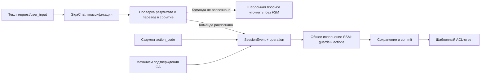

# Task04. Текстовое сообщение → GigaChat → существующее событие FSM

**Дата:** 05.10.2026. **Статус:** Валидация. Пользователь выбрал вариант A и явно согласовал [дизайн реализации](impl_design.md) и [задачи](tasks.md) сообщением «согасовано».

## Проблема и принятые границы

Клиент должен иметь возможность текстом выбрать то же действие, которое сейчас выполняется через управляющий вход ACL. Модель классифицирует сообщение; приложение проверяет результат и формирует существующее событие. Переход, проверки и действия остаются в SSM.

Пользователь определил:

- Только существующие действия; новые операции RECALL/DETAILS не добавляются. Первый текстовый сценарий — разные формулировки запроса статуса платежа.
- Платёж уже выбран в ГигаАссистенте; текст определяет действие, реквизиты из него не извлекаются.
- Подтверждение операции — только через специальный механизм ГигаАссистента. Текст не создаёт CONFIRM, даже если содержит «да», «подтверждаю» или «отправляй».
- Дополнительное уточнение: подтверждение не предполагает свободного ввода. Предлагаемый объём текстового распознавания ограничен выбором STATUS; подтверждение и отказ используют существующие accept_propose/reject_propose.
- При неоднозначности в будущем будет отдельный вызов LLM с RAG-материалами в промпте. Сейчас этот путь не реализуется.
- Все системные и пользовательские промпты хранятся как шаблоны в отдельном конфигурационном YAML, а не строками Java-кода.
- Ответ LLM — JSON, соответствующий разработанной прикладной модели. Требуется простое расширение на следующие команды, в частности уточнение реквизитов; их исполнение сейчас не добавляется.

Дополнения при выборе A: если команда не распознана, агент непосредственно отвечает в GA вежливой просьбой уточнить действие, без вызова FSM; ответ хранится в настроечном файле шаблонов. Нужен механизм прогона размеченных наборов сообщений с подсчётом TP/TN/FP/FN; начальный датасет — не более 10 сообщений.

## Фактическая реализация

- [AclMapper](../../../agent-api-in/src/main/java/ru/sberbank/pprb/agent/gigaassistant/mapper/AclMapper.java) переводит `request/action_code=status` в `SELECT + STATUS`, `accept_propose` в `CONFIRM`, `reject_propose` в `CANCEL`. Текст сейчас не поддерживается; [локальная OpenAPI-схема](../../../agent-api-in/src/main/resources/openapi/acl-poc.yaml) содержит только `action_code` во входном content. Исходный [ACL GA](../../api/rest_api_acl_gigaasistant.02.013.02.yml) уже содержит `content.user_input`.
- [SessionTurnOrchestrator](../../../agent-service/src/main/java/ru/sberbank/pprb/agent/service/turn/SessionTurnOrchestrator.java) вызывает единый [SessionExecutionService](../../../agent-service/src/main/java/ru/sberbank/pprb/agent/service/fsm/SessionExecutionService.java). Исполнитель восстанавливает FSM под семафором, выполняет событие и сохраняет результат в одной транзакции; renderer формирует ответ после commit.
- [SessionStateMachineConfiguration](../../../agent-service/src/main/java/ru/sberbank/pprb/agent/service/fsm/SessionStateMachineConfiguration.java) регистрирует STATUS и предоставляет OperationCatalog для саджестов. Состояния: CHOOSING_REQUEST_TYPE, AWAITING_CONFIRM, COMPLETED. SELECT разрешён только на выборе; CANCEL отменяет подготовку; CONFIRM выполняет операцию после guards. На шаге подтверждения повторный SELECT отклоняется.
- CANCEL сейчас приходит из отказа от предложения, а не из саджеста операции; это отмена подготовки, а не банковский отзыв платежа. В предлагаемом объёме этот путь сохраняется без текстового распознавания отказа.
- Подтверждение возвращает `paymentNumber + preparationNo` через `state[type=CONFIRMATION]`; проверяются состав, значения, актуальность и отдельный Request-Id. Проверки и вызов WorkflowManager сохраняются.
- [Клиент task03](../../../agent-api-out/src/main/java/ru/sberbank/pprb/agent/gigachat/config/GigaChatConfiguration.java) уже предоставляет синхронный Spring AI ChatClient. Память, tools и связь с обработкой сообщений отсутствуют. Тестовый UI пока показывает локальное пояснение вместо отправки текста.

## Варианты

| Вариант | Устройство | Компромисс |
|---|---|---|
| A. Классификация самостоятельной команды перед транзакцией | Текущий текст и каталог поддерживаемых операций → один структурированный разбор → проверенный SessionEvent → существующее исполнение. Модель не читает состояние сессии. | Минимум изменений, ожидание GigaChat не удерживает блокировку БД. Допустимость события на фактическом шаге проверяет FSM. |
| B. Классификация после восстановления FSM под семафором | Проверить шаг, при необходимости вызвать классификатор, затем в той же транзакции выполнить проверенное событие. Вызов не размещается в guard/action. | Можно отклонить текст на неподходящем шаге до LLM. Блокировка и соединение БД удерживаются во время LLM и её технических попыток. Для самостоятельного запроса статуса контекст модели не нужен. |
| C. Контекстный разбор вне транзакции с проверкой снимка | Прочитать состояние короткой транзакцией, вызвать модель без блокировки, при исполнении проверить, что использованный контекст ещё актуален. | Не держит соединение во время LLM, но добавляет повторное чтение, проверку актуальности и отдельный исход при изменении сессии. Для выбранного объёма избыточен. |

**Выбран A:** соответствует уточнённому сценарию и сохраняет транзакционный путь исполнения. Компромисс: прямой текстовый HTTP-запрос на шаге подтверждения может вызвать классификацию до отказа FSM; штатный UI свободный ввод на этом шаге не предлагает. Предварительное чтение сессии ради исключения такого вызова сейчас не добавляется. Варианты не вводят вторую машину состояний, новый DSL или автоматическое исполнение инструментов моделью.

## Принятый вариант A



1. Входной адаптер выбирает один источник: управляющий performative → явный action_code → непустой user_input. Выбранная явная команда не вызывает LLM. Неизвестный action_code отклоняется, а не заменяется попыткой угадать команду из сопровождающего текста. История и подписи кнопок не становятся запасным источником.
2. Оркестратор обращается к одному прикладному порту классификации в agent-service; реализация в agent-api-out использует имеющийся ChatClient и возвращает MessageAnalysisDTO из agent-model. Новые модули, общие цепочки обработчиков и собственный HTTP-клиент не нужны.
3. Пример структурированного ответа модели: `{"actionCode":"status"}` либо `{"actionCode":null}`. Список операций берётся из существующего каталога, без второй регистрации операций в промпте. Модель не возвращает целевое состояние, исполняемый код, подтверждаемые значения или произвольный SessionEvent.
4. Приложение строго проверяет форму ответа и разрешённые значения. Выбор зарегистрированного `status` становится `SELECT + STATUS`, аналогично саджесту. `CONFIRM` и `CANCEL` отсутствуют в результате классификатора; они поступают только из соответствующих управляющих сообщений GA. Одно сообщение создаёт максимум одно событие.
5. Полученное событие проходит те же guards/actions, что и явный ACL-вход. Каталог задаёт поддерживаемые операции, а SSM определяет допустимость на фактическом шаге. Предварительного чтения состояния и обещания «действие сейчас доступно» у варианта A нет; конкурентные события сериализуются существующим семафором при исполнении.
6. Валидный `actionCode: null` немедленно возвращает HTTP 200 / ACL inform с вежливой просьбой уточнить действие. Оркестратор не вызывает ни ensureSemaphore, ни process/find: нет чтения/создания FSM, блокировки или записи сессии. Ответ берётся из существующего файла session-responses.properties; без второго вызова LLM, события «непонятно» или сохранения ожидания уточнения. Справка, неоднозначность и самостоятельное текстовое согласие относятся к этому исходу. Будущий RAG расширит эту ветвь отдельно.
7. Явное указание другого платежа или просьба изменить реквизиты не должны незаметно применяться к выбранному платежу. В минимальном варианте предлагается уточнение при указании реквизитов в тексте; извлечение значений и смена привязки не добавляются.
8. Техническая ошибка/исчерпание попыток и корректный ответ «непонятно» различаются. Первая даёт технический отказ без исполнения события; второе — обычное уточнение без повтора LLM. Ошибка GigaChat не маскируется под ошибку хранения.
9. По действующему ADR-007: один логический промпт разбора; максимум исходная попытка и два технических повтора с теми же данными и параметрами, включая невалидный структурированный ответ. Общий ChatClient task03 остаётся без автоматических повторов; повторы разбора не распространяются на FSM/corr. Изменение этой политики требует отдельного решения.
10. Предлагается включить отправку user_input в существующий тестовый UI на шаге выбора. На полученное propose UI показывает механизм подтверждения/отказа без свободного ввода. После отказа текстовый выбор снова доступен. Реальное подключение поверхности GA остаётся отдельной интеграцией; нового локального endpoint для текста нет. При выключенном GigaChat текст сообщает о недоступности, существующие кнопки продолжают работать.

## JSON-модель и расширение на следующие команды

Предлагается **MessageAnalysisDTO**, прикладной результат разбора, а не wire-модель ответа GigaChat и не исполняемая команда FSM. На текущем объёме у него одно обязательное JSON-поле `actionCode`: строка с кодом зарегистрированной операции либо явный null, если однозначного совпадения нет.

```json
{"actionCode":"status"}
```

```json
{"actionCode":null}
```

JSON Schema формируется из модели и подставляется в YAML-шаблон промпта; вручную поддерживать вторую схему в Java/YAML не нужно. Код действия дополнительно проверяется по OperationCatalog. Парсер принимает ровно JSON-объект ожидаемой формы: отсутствие обязательного поля, неверные типы, посторонние/дублирующиеся поля, Markdown-обёртка и неизвестный код не считаются успешным разбором. Указание схемы в промпте само по себе не гарантирует корректный ответ модели, поэтому проверка обязательна до формирования события. Не нужны оценка confidence, рассуждения модели и сгенерированный текст ответа клиенту.

Для будущего уточнения реквизитов эта же модель расширяется типизированным `changes: PaymentDetailsChangesDTO`: этот DTO уже существует в agent-model и описан ADR-006. Новые значения ИНН, счёта, наименования получателя и назначения не требуют второго аналогичного типа. Пример будущей формы:

```json
{"actionCode":"details","changes":{"paymentPurpose":"Оплата по договору Б"}}
```

Это пример расширения, **не допустимый ответ текущей версии**. Сейчас не создаются пустые DTO изменений и обработчики DETAILS. Когда команда появится, добавятся её регистрация, нужные поля модели и YAML-примеры; транспортный путь и порт разбора сохранятся. Ввод действий и данных будет разбираться одним запросом LLM. Общий нетипизированный Map параметров и отдельный классификатор для каждой команды не нужны.

Отсутствующее поле changes означает «не передано изменение»; удаление реквизита не подразумевается. Новые реквизиты относятся к подготовке, не заменяют доверенный исходный платёж и не являются согласием. Их допустимость проверяется приложением и соответствующими guards. События, переходы и действия DETAILS всё равно потребуют реализации бизнес-сценария; одна правка промпта не включает банковскую операцию.

## Шаблоны промптов

Предлагаемое размещение — `agent-api-out/src/main/resources/config/gigachat-prompts.yaml`, подключаемый штатной конфигурацией приложения. В нём хранятся полные шаблоны `classification.system` и `classification.user`: инструкция, формат ответа, ограничения и примеры. В Java остаются загрузка, подстановка переменных и проверка результата; скрытых добавочных инструкций/примеров в коде нет.

Системный шаблон получает список операций из каталога и JSON Schema модели через явные переменные. Пользовательский шаблон получает текущее сообщение как данные; оно не подставляется в системные инструкции и не интерпретируется как вложенный шаблон. Банковские реквизиты и история не нужны для текущего разбора. Обязательные шаблоны и переменные проверяются при включении классификатора. Все технические повторы используют уже сформированные, неизменные сообщения. Шаблоны будущего RAG будут добавлены в YAML в соответствующей доработке.

## Критерии приёмки

1. Самостоятельная просьба запросить статус выбранного платежа создаёт такую же подготовку и ACL propose, как саджест status; до штатного подтверждения нет вызова WorkflowManager.
2. Подтверждение и отказ работают через accept_propose/reject_propose. Текст «отмени платёж» не превращается в отмену подготовки или банковский отзыв.
3. Любое текстовое согласие, включая «запроси статус и сразу подтверждаю», не создаёт CONFIRM. Выбор можно подготовить только при однозначном намерении; отправка всё равно требует штатного подтверждения.
4. Ответ соответствует MessageAnalysisDTO. Некорректный JSON, неизвестная операция, запрещённое значение и инструкции модели обойти подтверждение не вызывают неподдерживаемое событие или внешний эффект.
5. Вход с явным действием/подтверждением не вызывает LLM; сохраняются guards согласия, поведение повторного SELECT, блокировки, rollback и ответ после commit.
6. Уточнение из настроечного файла приходит в GA как обычный ответ с сохранением корреляции. На этой ветви нет никаких вызовов исполнителя FSM, включая обеспечение семафора и чтение, и дополнительной генерации LLM.
7. Минимальные проверки охватывают общий ACL и его зеркало, эквивалентность с саджестом, сохранение штатной отмены, запрет текстового подтверждения, сбои/лимиты LLM, загрузку YAML-промптов и доставку текста тестовым UI. Качество модели оценивается отдельно на небольшом согласованном корпусе реальных фраз; stub подтверждает только протокол.
8. Отдельно запускаемый прогон агента читает размеченный датасет до 10 сообщений и выдаёт TP/TN/FP/FN, ошибки обработки и результат каждого примера. Положительный класс сейчас — STATUS; корректное отсутствие команды — отрицательный. Техническая ошибка не считается TN или FN. Прогон использует реальный GigaChat, синтетические платежи и отдельную сессию на пример; подтверждение операций не отправляется.

## Выбор и согласование документов

Вариант A выбран пользователем 05.10.2026 вместе с прямым шаблонным уточнением без FSM и требованием оценки классификации. Модель расширяется существующим DTO изменений при добавлении DETAILS.

Пользователь явно согласовал [impl_design.md](impl_design.md) и локальный [tasks.md](tasks.md) сообщением «согасовано» до изменения кода/тестов, согласно [AGENTS.md](../../../AGENTS.md).

ADR-007/020 и документы этапов уточняются по принятому решению; это не утверждение о готовности кода. Прежнее текстовое согласие в MVP заменяется специальным подтверждением GA. RAG, извлечение реквизитов, смена операции и память уточнений остаются будущими доработками. Гарантии ADR-009/010 для распознанного события сохраняются.
