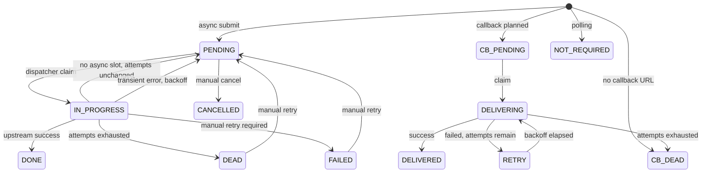

# Спецификация на test-qwen-cli-app

Версия спецификации - 1.0

* [1. Общие сведения](#1-общие-сведения)
  * [1.1. Назначение и контекст](#11-назначение-и-контекст)
  * [1.2. Глоссарий доменных терминов](#12-глоссарий-доменных-терминов)
  * [1.3. Бизнес-инварианты](#13-бизнес-инварианты)
* [2. Функциональные требования](#2-функциональные-требования)
  * [2.1. Сценарии использования и обработчики](#21-сценарии-использования-и-обработчики)
  * [2.2. Альтернативные и ошибочные сценарии](#22-альтернативные-и-ошибочные-сценарии)
  * [2.3. Бизнес-правила и логика обработки](#23-бизнес-правила-и-логика-обработки)
  * [2.4. Состояния и переходы FSM](#24-состояния-и-переходы-fsm)
  * [2.5. API](#25-api)
  * [2.6. Интеграции](#26-интеграции)
  * [2.7. Модели данных](#27-модели-данных)
  * [2.8. Требования к конфигурационному файлу](#28-требования-к-конфигурационному-файлу)
  * [2.9. Логирование](#29-логирование)
  * [2.10. Валидация входящих значений](#210-валидация-входящих-значений)
  * [2.11. Обработка ошибок](#211-обработка-ошибок)
  * [2.12. Хедеры и метаданные](#212-хедеры-и-метаданные)
* [3. Рекомендации к критериям приёмки](#3-рекомендации-к-критериям-приёмки)
* [4. Нефункциональные требования](#4-нефункциональные-требования)
  * [4.1. Безопасность](#41-безопасность)
  * [4.2. Производительность](#42-производительность)
  * [4.3. Надежность](#43-надежность)
  * [4.4. Мониторинг](#44-мониторинг)
  * [4.5. Аудит](#45-аудит)

---

## 1. Общие сведения

### 1.1. Назначение и контекст

**test-qwen-cli-app** - backend proxy/gateway для доступа к лимитированному внешнему ресурсу. Сервис принимает запросы от dashboard и внутренних сервисов-клиентов, ограничивает параллелизм обращений к внешнему ресурсу, поддерживает синхронный сценарий с ограниченным ожиданием свободного слота и асинхронный сценарий с persistent queue, повторными попытками и доставкой callback.

Сервис должен решать две основные задачи:

1. Защитить внешний ресурс от превышения допустимого числа одновременных обращений.
2. Дать потребителям управляемые режимы работы: быстрый sync-вызов при наличии слота и async-вызов с сохранением состояния, retry, polling и callback delivery.

Ключевые потребители:

| Потребитель | Назначение использования |
|-------------|--------------------------|
| Dashboard | Отображение состояния gateway: пул слотов, очередь async-задач, backlog callback delivery, флаги dispatcher-ов |
| Внутренние сервисы-клиенты | Sync- и async-обращения к внешнему ресурсу через единый gateway |
| Callback endpoint сервиса-клиента | Приём финального результата async-задачи в режиме `CALLBACK` |

OpenAPI-контракты сервиса находятся в:

- `docs/openapi/external-gateway-sync.yaml`
- `docs/openapi/external-gateway-async.yaml`
- `docs/openapi/external-gateway-callback.yaml`

### 1.2. Глоссарий доменных терминов

| Термин | Синонимы | Определение |
|--------|----------|-------------|
| Внешний ресурс | Upstream, external resource | Лимитированная внешняя система, к которой gateway выполняет обращения от имени сервисов-клиентов |
| Сервис-клиент | Consumer, client service | Внутренний сервис, который вызывает gateway для доступа к внешнему ресурсу |
| Dashboard | Панель мониторинга | Потребитель состояния gateway, отображающий технические и бизнес-показатели очередей, слотов и доставок |
| Слот | Slot | Единица разрешённого параллельного обращения к внешнему ресурсу |
| Lease слота | Slot lease | Временное владение слотом конкретным обработчиком sync- или async-вызова |
| Sync-запрос | Synchronous request | Запрос `POST /v1/external/sync`, при котором клиент ждёт результата обращения к внешнему ресурсу в рамках HTTP-ответа |
| Sync trace | След sync-запроса | Запись результата или ошибки sync-запроса в persistent storage для диагностики и dashboard |
| Async-задача | Async task | Persistent-запись обращения к внешнему ресурсу, обрабатываемая dispatcher-ом вне HTTP-запроса клиента |
| External ID | externalId | Идентификатор операции на стороне сервиса-клиента; вместе с `clientService` образует ключ идемпотентности async-submit |
| Client service | clientService | Строковый идентификатор сервиса-клиента |
| Priority | HIGH, LOW | Приоритет async-задачи, влияющий на порядок выбора задач dispatcher-ом |
| Delivery mode | CALLBACK, POLLING, SYNC | Режим получения результата. `CALLBACK` - доставка на URL клиента, `POLLING` - чтение статуса клиентом, `SYNC` - внутренний режим trace-записей sync-вызовов |
| Callback delivery | Callback-доставка | Отдельная persistent-задача доставки финального результата async-задачи на callback URL клиента |
| Callback-статус | callbackDeliveryStatus | Состояние доставки результата async-задачи; хранится в async-задаче и синхронизируется с записью callback delivery, если такая запись требуется |
| Callback URL allow-list | Allow-list URL | Конфигурационный список разрешённых callback URL по `clientService` |
| Retry | Повторная попытка | Повтор обработки async-задачи или callback delivery после временной ошибки |
| Backoff | Задержка повтора | Интервал до следующей попытки обработки после временной ошибки |
| Dead state | DEAD | Финальный статус задачи или доставки после исчерпания попыток или невозможности доставки |
| Waiter | Sync waiter | Запись ожидания sync-запросом свободного слота |
| Gateway | External gateway | Сервис-посредник, принимающий запросы клиентов и выполняющий контролируемые обращения к внешнему ресурсу |
| Dispatcher | Планировщик обработки | Фоновый обработчик, который выбирает доступные задачи из persistent queue и выполняет следующий шаг сценария |
| Claim | Захват задачи | Атомарное закрепление доступной задачи за одним dispatcher-ом для исключения параллельной обработки одной записи |
| Persistent queue | Постоянная очередь | Очередь задач, состояние которой сохраняется в PostgreSQL и переживает перезапуск сервиса |
| Persistent storage | Постоянное хранилище | PostgreSQL-хранилище состояния слотов, ожиданий, задач и callback-доставок |
| Transient-ошибка | Временная ошибка | Ошибка, после которой допустим повтор с backoff без ручного вмешательства |
| Event ID | eventId | Уникальный идентификатор callback-события, используемый сервисом-клиентом для дедупликации доставки |
| Correlation ID | X-Request-Id | Идентификатор трассировки запроса или callback-доставки |
| Status URL | statusUrl | URL, по которому клиент может прочитать состояние async-задачи |
| Scope | Client scope | Ограничение операции конкретным `clientService` |
| Upstream adapter | Адаптер внешнего ресурса | Компонент интеграции, выполняющий сетевой вызов внешнего ресурса по контракту 2.6 |

### 1.3. Бизнес-инварианты

1. **ВСЕГДА** число одновременно занятых слотов не превышает `external-gateway.slots.total`.
2. **ВСЕГДА** lease слота освобождается после завершения обращения к внешнему ресурсу либо автоматически истекает по TTL.
3. **НИКОГДА** async-submit с тем же `clientService` и `externalId`, но несовместимым payload или параметрами, не создаёт вторую задачу; сервис возвращает конфликт идемпотентности.
4. **ВСЕГДА** повторный async-submit с тем же `clientService`, `externalId` и теми же параметрами возвращает исходную задачу.
5. **НИКОГДА** задача в финальном статусе `DONE`, `DEAD` или `CANCELLED` не обрабатывается async dispatcher-ом как новая без явного разрешённого перехода FSM.
6. **ВСЕГДА** callback delivery создаётся не более одного раза для одной async-задачи.
7. **ВСЕГДА** async-задача в режиме `POLLING` не требует callback delivery и получает callback-статус `NOT_REQUIRED`.
8. **ВСЕГДА** callback delivery после неуспешной попытки переходит либо в `RETRY`, либо в `DEAD` в зависимости от числа попыток.
9. **НИКОГДА** callback отправляется на URL, не заданный в allow-list для `clientService`.
10. **ВСЕГДА** transient-ошибка async-обработки сохраняется в состоянии задачи и учитывается при расчёте следующей попытки.
11. **ВСЕГДА** sync-запрос при недоступности слота до истечения wait timeout возвращает клиенту retryable-ошибку и не выполняет обращение к внешнему ресурсу.
12. **НИКОГДА** значение `deliveryMode=SYNC` не принимается от внешнего async API; оно используется только для внутренних trace-записей sync-вызовов.
13. **ВСЕГДА** в production секреты PostgreSQL, callback-креды и иные чувствительные значения должны задаваться через внешнюю защищённую конфигурацию, а не через файлы в репозитории.

---

## 2. Функциональные требования

### 2.1. Сценарии использования и обработчики

#### 2.1.1. Типовой флоу клиента

##### Сценарий: sync-вызов внешнего ресурса

| # | Шаг клиента | Endpoint / команда | Зачем | Что клиент получил |
|---|-------------|--------------------|-------|--------------------|
| 1 | Сформировать `externalId`, `clientService`, `payload`, `X-Request-Id` и при необходимости `Idempotency-Key` | - | Подготовить трассируемый и повторяемый запрос | Готовый HTTP-запрос |
| 2 | Отправить sync-запрос | `POST /v1/external/sync` | Получить результат внешнего ресурса в рамках HTTP-вызова | `200` с результатом либо ошибка `429/502/503/504` |
| 3 | При `429 NO_SLOT_AVAILABLE` подождать `Retry-After` и повторить с тем же `Idempotency-Key` | `POST /v1/external/sync` | Не перегружать gateway при занятых слотах | Новый результат или повторная retryable-ошибка |
| 4 | При `502/503/504` перейти на async-сценарий, если бизнес-операция допускает отложенную обработку | `POST /v1/external/async` | Сохранить обращение в persistent queue | `202`, `taskId`, `statusUrl` |

##### Сценарий: async с callback

| # | Шаг клиента | Endpoint / команда | Зачем | Что клиент получил |
|---|-------------|--------------------|-------|--------------------|
| 1 | Создать async-задачу с `deliveryMode=CALLBACK` или без `deliveryMode`, если используется default | `POST /v1/external/async` | Поставить обращение к внешнему ресурсу в очередь, см. переход 2.4.1 | `202`, `taskId`, `statusUrl`, `alreadyExisted` |
| 2 | Принять callback от gateway | `POST /internal/external-gateway/callbacks` на стороне сервиса-клиента | Получить финальный результат задачи, см. переходы 2.4.3 и 2.4.11 | `200` или `204`; при ошибке gateway выполнит retry |

##### Сценарий: async cancel/retry

| # | Шаг клиента | Endpoint / команда | Зачем | Что клиент получил |
|---|-------------|--------------------|-------|--------------------|
| 1 | Создать async-задачу | `POST /v1/external/async` | Поставить обращение в очередь | `202`, `taskId`, `statusUrl` |
| 2 | Отменить задачу, если она ещё не обрабатывается | `DELETE /v1/external/async/{taskId}` | Остановить ненужное обращение | `200 AsyncTask` со статусом `CANCELLED` или `409` |
| 3 | Прочитать состояние задачи | `GET /v1/external/async/{taskId}` | Убедиться в текущем статусе | `200 AsyncTask` |
| 4 | Вернуть ошибочную задачу в очередь вручную | `POST /v1/external/async/{taskId}/retry` | Повторить задачу после `FAILED` или `DEAD` | `202 AsyncTask` со статусом `PENDING` |

##### Сценарий: async с polling

| # | Шаг клиента | Endpoint / команда | Зачем | Что клиент получил |
|---|-------------|--------------------|-------|--------------------|
| 1 | Создать async-задачу с `deliveryMode=POLLING` | `POST /v1/external/async` | Поставить задачу в очередь без callback, см. правило 2.3.8 | `202`, `taskId`, `statusUrl` |
| 2 | Читать состояние задачи | `GET /v1/external/async/{taskId}` или `GET /v1/external/async/by-external-id/{externalId}` | Получить статус, результат или ошибку | `200` с моделью `AsyncTask` либо `404` |

#### 2.1.2. Обработчики по триггерам

##### 2.1.2.1. Обработчик: GET /

- **Триггер**: HTTP `GET /`
- **Инициатор**: dashboard, оператор или health-check потребитель
- **Вход**: нет
- **Предусловия (guard)**: нет

**Шаги обработки:**

1. Сформировать строковый ответ о том, что приложение запущено.
2. Вернуть `200 OK`.

- **Side-effects**: отсутствуют
- **Выход / ответ**: plain text `TestQwenCli is running`
- **Ошибочные ветки**: при техническом сбое процесса возвращается стандартная серверная ошибка `500 INTERNAL_ERROR` по 2.11
- **Идемпотентность**: да, read-only

##### 2.1.2.2. Обработчик: POST /v1/external/sync

- **Триггер**: HTTP `POST /v1/external/sync`
- **Инициатор**: сервис-клиент
- **Вход**: `ExternalSyncRequest` из тела запроса, необязательные заголовки `X-Request-Id` и `Idempotency-Key`
- **Предусловия (guard)**: тело запроса валидно по 2.10; число занятых слотов не нарушает инвариант 1.3.1

**Шаги обработки:**

1. Валидировать `externalId`, `clientService` и `payload` по 2.10. При ошибке выполнить сценарий 2.2.2.
2. Попытаться получить sync-слот до истечения `external-gateway.sync.wait-timeout-ms`, см. правило 2.3.1 и переход 2.4.29.
3. Если слот не получен, вернуть `429 NO_SLOT_AVAILABLE`, см. сценарий 2.2.1 и инвариант 1.3.11.
4. Если слот получен, вызвать внешний ресурс и передать `X-Request-Id` и `Idempotency-Key`, см. правило 2.3.2.
5. При успешном ответе внешнего ресурса сохранить sync trace со статусом `DONE`, см. правило 2.3.3 и переход 2.4.27.
6. При ошибке внешнего ресурса сохранить sync trace со статусом `FAILED`, см. правило 2.3.3 и переход 2.4.28.
7. Освободить lease слота независимо от результата обращения, см. правило 2.3.1 и переход 2.4.30.
8. Вернуть клиенту результат или ошибку.

- **Side-effects**: запись sync trace в PostgreSQL; изменение lease слота; вызов внешнего ресурса
- **Выход / ответ**: `200 ExternalSyncResponse` или ошибка по 2.11
- **Ошибочные ветки**: 2.2.1, 2.2.2, 2.2.3
- **Идемпотентность**: gateway передаёт `Idempotency-Key` во внешний ресурс, но локально не дедуплицирует sync-результат; локальный trace пишется отдельно

##### 2.1.2.3. Обработчик: POST /v1/external/async

- **Триггер**: HTTP `POST /v1/external/async`
- **Инициатор**: сервис-клиент
- **Вход**: `ExternalAsyncRequest` из тела запроса, необязательный `X-Request-Id`
- **Предусловия (guard)**: тело запроса валидно по 2.10; `deliveryMode` не равен `SYNC`, см. инвариант 1.3.12

**Шаги обработки:**

1. Валидировать `externalId`, `clientService`, `priority`, `deliveryMode` и `payload`, см. 2.10.
2. Проверить идемпотентность по `clientService + externalId`, см. правило 2.3.4.
3. Если идентичная задача уже существует, вернуть существующий `taskId` с признаком `alreadyExisted=true`, см. инвариант 1.3.4.
4. Если задача с тем же ключом существует, но параметры отличаются, вернуть `409 IDEMPOTENCY_CONFLICT`, см. сценарий 2.2.4.
5. Если задачи нет, создать async-задачу в статусе `PENDING`, см. переход 2.4.1.
6. Вернуть `202 Accepted` с `taskId` и `statusUrl`.

- **Side-effects**: INSERT или reuse записи `ext_request_queue`
- **Выход / ответ**: `202 AsyncSubmitResponse`
- **Ошибочные ветки**: 2.2.2, 2.2.4
- **Идемпотентность**: да, ключ `clientService + externalId`

##### 2.1.2.4. Обработчик: GET /v1/external/async/{taskId}

- **Триггер**: HTTP `GET /v1/external/async/{taskId}`
- **Инициатор**: сервис-клиент или dashboard
- **Вход**: path-параметр `taskId`, необязательный заголовок `X-Client-Service`
- **Предусловия (guard)**: если `X-Client-Service` задан, задача должна принадлежать этому `clientService`, см. правило 2.3.5

**Шаги обработки:**

1. Нормализовать необязательный scope `X-Client-Service`, см. правило 2.3.5.
2. Найти задачу по `taskId` и scope.
3. Если задача найдена, вернуть её текущее состояние.
4. Если задача не найдена, вернуть `404 TASK_NOT_FOUND`, см. сценарий 2.2.5.

- **Side-effects**: отсутствуют
- **Выход / ответ**: `200 AsyncTask`
- **Ошибочные ветки**: 2.2.5
- **Идемпотентность**: да, read-only

##### 2.1.2.5. Обработчик: GET /v1/external/async/by-external-id/{externalId}

- **Триггер**: HTTP `GET /v1/external/async/by-external-id/{externalId}`
- **Инициатор**: сервис-клиент или dashboard
- **Вход**: path-параметр `externalId`, необязательный заголовок `X-Client-Service`
- **Предусловия (guard)**: если `X-Client-Service` задан, задача должна принадлежать этому `clientService`, см. правило 2.3.5

**Шаги обработки:**

1. Нормализовать необязательный scope `X-Client-Service`, см. правило 2.3.5.
2. Найти задачу по `externalId` и scope.
3. Если задача найдена, вернуть её текущее состояние.
4. Если задача не найдена, вернуть `404 TASK_NOT_FOUND`, см. сценарий 2.2.5.

- **Side-effects**: отсутствуют
- **Выход / ответ**: `200 AsyncTask`
- **Ошибочные ветки**: 2.2.5
- **Идемпотентность**: да, read-only

##### 2.1.2.6. Обработчик: DELETE /v1/external/async/{taskId}

- **Триггер**: HTTP `DELETE /v1/external/async/{taskId}`
- **Инициатор**: сервис-клиент
- **Вход**: path-параметр `taskId`, необязательный заголовок `X-Client-Service`
- **Предусловия (guard)**: задача существует в допустимом scope и находится в статусе, разрешающем отмену, см. правило 2.3.6 и переход 2.4.7

**Шаги обработки:**

1. Нормализовать `X-Client-Service`, см. правило 2.3.5.
2. Найти задачу и проверить возможность отмены, см. правило 2.3.6.
3. Если отмена разрешена, перевести задачу в `CANCELLED`, см. переход 2.4.7.
4. Если задача уже `CANCELLED`, вернуть текущий статус без повторного side-effect.
5. Если задача не найдена или переход запрещён, вернуть ошибку по 2.2.5 или 2.2.6.

- **Side-effects**: UPDATE async-задачи в PostgreSQL
- **Выход / ответ**: `200 AsyncTask`
- **Ошибочные ветки**: 2.2.5, 2.2.6
- **Идемпотентность**: повторная отмена `CANCELLED`-задачи безопасна и возвращает `CANCELLED`

##### 2.1.2.7. Обработчик: POST /v1/external/async/{taskId}/retry

- **Триггер**: HTTP `POST /v1/external/async/{taskId}/retry`
- **Инициатор**: сервис-клиент или операторский процесс
- **Вход**: path-параметр `taskId`, необязательный заголовок `X-Client-Service`
- **Предусловия (guard)**: задача существует в допустимом scope и находится в статусе, разрешающем ручной retry, см. правило 2.3.6

**Шаги обработки:**

1. Нормализовать `X-Client-Service`, см. правило 2.3.5.
2. Найти задачу и проверить возможность retry.
3. Если retry разрешён, перевести задачу из `FAILED` или `DEAD` в `PENDING`, см. переходы 2.4.8 и 2.4.9. При этом `attempts` сбрасывается в `0`, `availableAt` устанавливается в текущее время, `retryable=true`, `error` очищается, `maxAttempts` остаётся прежним.
4. Если задача не найдена или переход запрещён, вернуть ошибку по 2.2.5 или 2.2.6.

- **Side-effects**: UPDATE async-задачи в PostgreSQL
- **Выход / ответ**: `202 AsyncTask`
- **Ошибочные ветки**: 2.2.5, 2.2.6
- **Идемпотентность**: нет; повторный retry зависит от текущего статуса задачи

##### 2.1.2.8. Обработчик: async dispatcher

- **Триггер**: fixed delay `external-gateway.async.dispatch-interval-ms`
- **Инициатор**: сам сервис
- **Вход**: доступные задачи `PENDING` из persistent queue
- **Предусловия (guard)**: `external-gateway.async.dispatcher-enabled=true`

**Шаги обработки:**

1. Выбрать доступную `PENDING`-задачу с учётом приоритета и времени доступности, см. правило 2.3.7.
2. Перевести задачу в `IN_PROGRESS`, см. переход 2.4.2.
3. Получить async-слот, см. правило 2.3.1.
4. Если слот недоступен, вернуть задачу в `PENDING` без вызова внешнего ресурса, см. сценарий 2.2.8.
5. Если слот получен, вызвать внешний ресурс с ключом идемпотентности `clientService:externalId`, см. правило 2.3.7.
6. При успехе сохранить результат и перевести задачу в `DONE`, см. переход 2.4.3.
7. При transient-ошибке применить retry/backoff или перевести задачу в `DEAD`, см. правило 2.3.7 и переходы 2.4.4.1, 2.4.5.
8. Для финальной задачи запланировать callback delivery, см. правило 2.3.8.
9. Освободить lease слота.

- **Side-effects**: UPDATE `ext_request_queue`; INSERT/UPDATE `ext_callback_delivery`; изменение lease слота; вызов внешнего ресурса
- **Выход / ответ**: нет HTTP-ответа; обновлённое состояние задачи
- **Ошибочные ветки**: 2.2.7, 2.2.8
- **Идемпотентность**: обращение к внешнему ресурсу выполняется с ключом `clientService:externalId`; повтор обработки одной задачи ограничивается FSM и claim-механизмом

##### 2.1.2.9. Обработчик: callback planning

- **Триггер**: завершение async-задачи в финальном статусе
- **Инициатор**: сам сервис
- **Вход**: финальная async-задача
- **Предусловия (guard)**: задача находится в финальном статусе `DONE`, `DEAD` или `CANCELLED`

**Шаги обработки:**

1. Если задача не финальная, не планировать callback, см. правило 2.3.8.
2. Если `deliveryMode=POLLING`, установить callback-статус `NOT_REQUIRED`, см. переход 2.4.10.
3. Если `deliveryMode=CALLBACK`, найти allow-listed callback URL по `clientService`.
4. Если URL не найден или не разрешён allow-list, зафиксировать callback-статус `DEAD`, см. переход 2.4.12 и сценарий 2.2.10.
5. Если URL найден и разрешён, создать callback delivery в статусе `PENDING`, см. переходы 2.4.11 и 2.4.19.

- **Side-effects**: UPDATE callback-статуса async-задачи; INSERT callback delivery
- **Выход / ответ**: нет HTTP-ответа
- **Ошибочные ветки**: 2.2.10
- **Идемпотентность**: одна callback delivery на одну async-задачу, см. инвариант 1.3.6

##### 2.1.2.10. Обработчик: callback delivery dispatcher

- **Триггер**: fixed delay `external-gateway.callback.delivery-interval-ms`
- **Инициатор**: сам сервис
- **Вход**: доступные доставки `PENDING` или `RETRY`
- **Предусловия (guard)**: `external-gateway.callback.delivery-enabled=true`

**Шаги обработки:**

1. Выбрать доступную callback delivery, см. правило 2.3.9.
2. Перевести доставку в `DELIVERING`, см. переходы 2.4.13, 2.4.14, 2.4.21 и 2.4.22.
3. Отправить HTTP callback на allow-listed URL клиента с payload результата.
4. При успешном ответе клиента перевести доставку в `DELIVERED`, см. переходы 2.4.15 и 2.4.23.
5. При ошибке клиента или сетевой ошибке перевести доставку в `RETRY` либо `DEAD`, см. переходы 2.4.16, 2.4.17, 2.4.24 и 2.4.25.
6. Обновить callback-статус async-задачи.

- **Side-effects**: HTTP callback; UPDATE `ext_callback_delivery`; UPDATE `ext_request_queue.callback_delivery_status`
- **Выход / ответ**: нет HTTP-ответа; обновлённое состояние доставки
- **Ошибочные ветки**: 2.2.9
- **Идемпотентность**: callback eventId используется как ключ идемпотентности доставки на стороне клиента

##### 2.1.2.11. Обработчик: callback delivery recovery

- **Триггер**: fixed delay `external-gateway.callback.delivery-recovery-interval-ms`
- **Инициатор**: сам сервис
- **Вход**: доставки в статусе `DELIVERING`, находящиеся в этом статусе дольше `external-gateway.callback.delivery-timeout-ms`
- **Предусловия (guard)**: `external-gateway.callback.delivery-enabled=true`

**Шаги обработки:**

1. Найти зависшие `DELIVERING`-доставки.
2. Для каждой доставки применить правило retry/deadline, см. правило 2.3.9.
3. Перевести доставку в `RETRY` или `DEAD`, см. переходы 2.4.18 и 2.4.26.

- **Side-effects**: UPDATE `ext_callback_delivery`; UPDATE callback-статуса async-задачи
- **Выход / ответ**: нет HTTP-ответа
- **Ошибочные ветки**: при ошибке recovery текущая итерация логирует сбой, не меняет статус доставки без успешного атомарного update и повторяет обработку на следующем запуске scheduler-а
- **Идемпотентность**: повторный recovery безопасен, потому что обрабатывает только доставки, всё ещё находящиеся в `DELIVERING`

##### 2.1.2.12. Обработчик: slot lease reaper

- **Триггер**: fixed delay `external-gateway.slots.lease-reap-interval-ms`
- **Инициатор**: сам сервис
- **Вход**: истёкшие lease слотов
- **Предусловия (guard)**: нет

**Шаги обработки:**

1. Найти lease слотов, чей TTL истёк.
2. Освободить такие lease, см. правило 2.3.1 и переход 2.4.31.
3. При освобождении слота уведомить ожидающие sync-запросы, если включён режим ожидания через notification.

- **Side-effects**: освобождение слотов; notification ожидающим sync-запросам
- **Выход / ответ**: нет HTTP-ответа
- **Ошибочные ветки**: при ошибке очистки lease текущая итерация логирует сбой; истёкшие lease остаются кандидатами для следующего запуска reaper-а
- **Идемпотентность**: повторная очистка истёкших lease безопасна

### 2.2. Альтернативные и ошибочные сценарии

| ID | Сценарий | Условие | Поведение | Связанные разделы |
|----|----------|---------|-----------|-------------------|
| 2.2.1 | Нет sync-слота | Все слоты заняты до истечения `external-gateway.sync.wait-timeout-ms` | Вернуть `429 NO_SLOT_AVAILABLE`, `Retry-After=1`, `retryable=true`; внешний ресурс не вызывается | правило 2.3.1, инвариант 1.3.11 |
| 2.2.2 | Ошибка валидации | Тело запроса отсутствует, не читается или нарушает правила 2.10 | Вернуть `400 VALIDATION_ERROR` или `400 INVALID_REQUEST` | 2.10, 2.11 |
| 2.2.3 | Ошибка внешнего ресурса в sync | Внешний ресурс возвращает ошибку или превышает timeout | Сохранить `FAILED` trace; вернуть `502/503/504` в зависимости от типа сбоя | правило 2.3.3, переход 2.4.28 |
| 2.2.4 | Конфликт идемпотентности async-submit | Уже есть задача с тем же `clientService + externalId`, но параметры отличаются | Вернуть `409 IDEMPOTENCY_CONFLICT`; новую задачу не создавать | правило 2.3.4, инвариант 1.3.3 |
| 2.2.5 | Async-задача не найдена | `taskId` или `externalId` не существует либо не доступен в scope `X-Client-Service` | Вернуть `404 TASK_NOT_FOUND` | правило 2.3.5 |
| 2.2.6 | Запрещённый переход async-задачи | Отмена или retry невозможны из текущего статуса | Вернуть `409 TASK_STATE_CONFLICT`; статус не менять | правило 2.3.6, 2.4 |
| 2.2.7 | Transient-ошибка async-upstream | Внешний ресурс не обработал async-задачу временно | Если попытки остались, вернуть задачу в `PENDING` с backoff; иначе перевести в `DEAD` | правило 2.3.7, переходы 2.4.4.1, 2.4.5 |
| 2.2.8 | Нет async-слота после claim | Dispatcher забрал задачу, но слот не получил | Вернуть задачу в `PENDING` без вызова внешнего ресурса | правило 2.3.1, переход 2.4.4 |
| 2.2.9 | Ошибка callback endpoint | Callback endpoint клиента вернул неуспешный ответ или недоступен | Перевести доставку в `RETRY` или `DEAD` | правило 2.3.9, переходы 2.4.16, 2.4.17, 2.4.24, 2.4.25 |
| 2.2.10 | Нет allow-listed callback URL | Финальная `CALLBACK`-задача не имеет URL в конфигурации клиента | Создать или зафиксировать callback-статус `DEAD`; callback не отправлять | правило 2.3.8, инвариант 1.3.9 |
| 2.2.11 | Зависшая callback delivery | Доставка находится в `DELIVERING` дольше configured timeout | Recovery переводит доставку в `RETRY` или `DEAD` | правило 2.3.9, переходы 2.4.18, 2.4.26 |

### 2.3. Бизнес-правила и логика обработки

#### 2.3.1. Лимит параллельных обращений через слоты

**Формулировка:** ЕСЛИ есть свободный слот, ТО gateway выдаёт lease до `external-gateway.slots.lease-ttl`. Sync-запрос может занять любой свободный слот. Async dispatcher может занять слот только если после выдачи lease останется не меньше `external-gateway.slots.target-free-sync-slots` свободных слотов для sync-трафика. ИНАЧЕ sync-запрос ждёт до `external-gateway.sync.wait-timeout-ms`, а async dispatcher возвращает задачу в `PENDING` без обращения к внешнему ресурсу.

**Пошаговый бизнес-псевдокод:**

1. Определить владельца обращения и тип обращения: `SYNC` или `ASYNC`.
2. Проверить наличие свободного слота.
3. Если обращение sync и свободный слот есть, выдать lease с уникальным lease ID и временем истечения.
4. Если обращение async, вычислить число свободных слотов после потенциальной выдачи lease.
5. Если async-выдача нарушит резерв `target-free-sync-slots`, считать слот недоступным для async.
6. Если слот недоступен для sync-запроса, зарегистрировать ожидание и повторять попытку до deadline.
7. Если deadline истёк, завершить sync-сценарий ошибкой `NO_SLOT_AVAILABLE`.
8. Если слот недоступен для async dispatcher-а, вернуть задачу в очередь без увеличения числа попыток upstream.
9. После завершения обращения освободить lease только при совпадении slot ID и lease ID.
10. Если lease не освобождён явно, reaper освобождает его после TTL.

Краевые случаи: пустой owner недопустим; округление не применяется; конкурентное освобождение защищается lease ID.

#### 2.3.2. Sync idempotency forwarding

**Формулировка:** ЕСЛИ клиент передал `Idempotency-Key`, ТО gateway передаёт его внешнему ресурсу. ИНАЧЕ gateway выполняет sync-вызов без upstream-ключа идемпотентности. Gateway локально не хранит sync-результат для дедупликации повторного HTTP-вызова.

**Пошаговый бизнес-псевдокод:**

1. Прочитать необязательный `Idempotency-Key`.
2. Если значение пустое или отсутствует, считать ключ неопределённым.
3. Сформировать запрос к внешнему ресурсу с `externalId`, `clientService`, `payload` и ключом, если он задан.
4. Вернуть результат текущего обращения.

Краевые случаи: отсутствующий ключ не является ошибкой; повтор sync-запроса может повторно обратиться к внешнему ресурсу.

#### 2.3.3. Sync trace

**Формулировка:** ЕСЛИ sync-вызов внешнего ресурса успешен, ТО gateway сохраняет trace со статусом `DONE`. ИНАЧЕ gateway сохраняет trace со статусом `FAILED` и описанием ошибки.

**Пошаговый бизнес-псевдокод:**

1. Зафиксировать начало sync-обращения.
2. После завершения вычислить длительность в миллисекундах.
3. При успехе сформировать trace с `status=DONE`, результатом и длительностью.
4. При ошибке сформировать trace с `status=FAILED`, errorCode, сообщением и длительностью.
5. Попытаться сохранить trace.
6. Если запись trace не удалась, залогировать предупреждение и не менять исходный ответ клиенту.

Краевые случаи: payload должен быть задан; длительность не может быть отрицательной.

#### 2.3.4. Async submit idempotency

**Формулировка:** ЕСЛИ async-задача с тем же `clientService + externalId` уже существует и идемпотентно значимые параметры совпадают, ТО gateway возвращает существующую задачу. ЕСЛИ хотя бы один идемпотентно значимый параметр отличается, ТО gateway возвращает `IDEMPOTENCY_CONFLICT`. ИНАЧЕ создаётся новая задача `PENDING`.

Идемпотентно значимые параметры: `priority`, нормализованный `deliveryMode` с default `CALLBACK`, canonical JSON-представление `payload`. Callback URL не входит в сравнение, потому что задаётся конфигурацией allow-list по `clientService`.

**Пошаговый бизнес-псевдокод:**

1. Проверить обязательные поля запроса.
2. Построить ключ идемпотентности `clientService + externalId`.
3. Найти существующую async-задачу с таким ключом.
4. Если задача не найдена, создать новую запись со статусом `PENDING`.
5. Если задача найдена, нормализовать входящий `deliveryMode`: отсутствующее значение считать `CALLBACK`.
6. Построить canonical JSON для `payload`: стабильный порядок ключей, без незначимых пробелов, с сохранением типов значений.
7. Сравнить `priority`, нормализованный `deliveryMode` и canonical `payload` с сохранёнными значениями.
8. Если все значения совпадают, вернуть существующую задачу с признаком `alreadyExisted=true`.
9. Если хотя бы одно значение отличается, вернуть конфликт без изменения существующей записи.

Краевые случаи: null в ключевых полях недопустим; конкурентные submit-запросы должны атомарно приводить к одной задаче.

#### 2.3.5. Temporary client scope

**Формулировка:** ЕСЛИ `X-Client-Service` передан в read/cancel/retry async API, ТО операции выполняются только в рамках этого `clientService`. ИНАЧЕ операция выполняется без client scope.

**Пошаговый бизнес-псевдокод:**

1. Прочитать заголовок `X-Client-Service`.
2. Если заголовок отсутствует или пустой после trim, считать scope неопределённым.
3. Если scope задан, искать или менять только задачи этого `clientService`.
4. Если задача не найдена в scope, вернуть `TASK_NOT_FOUND`.

Краевые случаи: текущий scope-фильтр не является аутентификацией; для production требуется service-to-service identity, см. 4.1.

#### 2.3.6. Manual cancel and retry

**Формулировка:** ЕСЛИ requested-переход разрешён FSM, ТО gateway обновляет статус задачи и возвращает обновлённую задачу. ИНАЧЕ gateway возвращает `TASK_STATE_CONFLICT`.

**Пошаговый бизнес-псевдокод:**

1. Найти задачу с учётом client scope.
2. Если задача не найдена, вернуть `TASK_NOT_FOUND`.
3. Определить requested-переход: отмена или retry.
4. Проверить переход по таблице 2.4.
5. Если переход отмены разрешён, атомарно обновить статус задачи на `CANCELLED`.
6. Если переход ручного retry разрешён, атомарно обновить статус задачи на `PENDING`, сбросить `attempts` в `0`, установить `availableAt=now`, установить `retryable=true`, очистить `error`, сохранить прежнее значение `maxAttempts`.
7. Если переход запрещён, вернуть `TASK_STATE_CONFLICT`.

Краевые случаи: повторная отмена уже `CANCELLED`-задачи считается безопасной; retry не является идемпотентной операцией.

#### 2.3.7. Async dispatch retry

**Формулировка:** ЕСЛИ внешний ресурс успешно обработал async-задачу, ТО задача переходит в `DONE`. ЕСЛИ произошла transient-ошибка и попытки остались, ТО задача возвращается в `PENDING` с backoff. ЕСЛИ transient-попытки исчерпаны, ТО задача переходит в `DEAD`. ЕСЛИ ошибка классифицирована как ручная или бизнес-ошибка, которую можно повторить только операторским действием, ТО задача переходит в `FAILED`.

Выбор задач: `HIGH` имеет `priority_weight=0`, `LOW` имеет `priority_weight=100`. Dispatcher выбирает задачи с `status=PENDING` и `availableAt <= now` в порядке `priority_weight ASC`, `availableAt ASC`, `taskId ASC`. При непрерывном потоке `HIGH` задач starvation `LOW` задач допускается как следствие строгого приоритета.

Счётчик попыток: `attempts` начинается с `0`; перед каждым upstream-вызовом увеличивается на `1`. После ошибки условие исчерпания попыток: `attempts >= maxAttempts`. Если `attempts < maxAttempts`, следующая доступность равна `now + external-gateway.async.retry-backoff-ms`.

**Пошаговый бизнес-псевдокод:**

1. Выбрать доступную `PENDING`-задачу по приоритету и времени доступности.
2. Перевести её в `IN_PROGRESS`.
3. Получить async-слот.
4. Если слот не получен, вернуть задачу в `PENDING`.
5. Увеличить `attempts` на `1`.
6. Вызвать внешний ресурс с ключом идемпотентности `clientService:externalId`.
7. При успехе сохранить результат и статус `DONE`.
8. При transient-ошибке проверить `attempts < maxAttempts`.
9. Если попытки остались, рассчитать `availableAt = now + retryBackoff` и вернуть задачу в `PENDING`.
10. Если попытки исчерпаны, сохранить ошибку и перевести задачу в `DEAD`.
11. При ручной или бизнес-ошибке, не требующей автоматического retry, сохранить ошибку и перевести задачу в `FAILED`.
12. Для финального состояния запустить callback planning.

Краевые случаи: длительность не может быть отрицательной; конкурентные dispatcher-ы не должны обрабатывать одну задачу одновременно.

#### 2.3.8. Callback planning

**Формулировка:** ЕСЛИ async-задача финальная и `deliveryMode=CALLBACK`, ТО gateway планирует callback delivery на allow-listed URL. ЕСЛИ `deliveryMode=POLLING`, ТО callback не требуется. ЕСЛИ callback URL отсутствует, ТО callback-статус становится `DEAD`.

**Пошаговый бизнес-псевдокод:**

1. Проверить, что задача находится в финальном статусе.
2. Если задача не финальная, не менять callback-статус.
3. Если `deliveryMode=POLLING`, установить `NOT_REQUIRED`.
4. Если `deliveryMode=CALLBACK`, найти callback URL по `clientService`.
5. Если URL не найден, установить `DEAD` и не выполнять HTTP-вызов.
6. Если URL найден, создать callback delivery в `PENDING`.

Краевые случаи: одна задача не должна иметь больше одной callback delivery; URL вне allow-list запрещён.

#### 2.3.9. Callback delivery retry

**Формулировка:** ЕСЛИ callback endpoint вернул успешный ответ, ТО доставка переходит в `DELIVERED`. ИНАЧЕ доставка переходит в `RETRY` с backoff либо в `DEAD` после исчерпания попыток.

Счётчик попыток доставки: `attempts` начинается с `0`; перед каждой HTTP-отправкой callback увеличивается на `1`. После ошибки условие исчерпания попыток: `attempts >= maxAttempts`. Если `attempts < maxAttempts`, следующая доступность равна `now + external-gateway.callback.retry-backoff-ms`.

**Пошаговый бизнес-псевдокод:**

1. Выбрать доступную доставку `PENDING` или `RETRY`.
2. Перевести её в `DELIVERING`.
3. Увеличить `attempts` на `1`.
4. Отправить HTTP callback с payload, eventId, номером попытки и correlation ID.
5. Если ответ успешен, перевести доставку в `DELIVERED`.
6. Если ответ неуспешен или вызов сорвался, проверить `attempts < maxAttempts`.
7. Если попытки остались, установить `RETRY` и следующий `availableAt`.
8. Если попытки исчерпаны, установить `DEAD`.
9. Для зависших `DELIVERING` старше timeout применить те же правила retry/dead.

Краевые случаи: пустое сообщение ошибки нормализуется; eventId должен позволять клиенту дедуплицировать callback.

### 2.4. Состояния и переходы FSM

#### AsyncTask

| # | From | To | Trigger | Guard | Side-effect |
|---|------|----|---------|-------|-------------|
| 2.4.1 | - | `PENDING` | `POST /v1/external/async` | Уникальный или совместимый idempotency key, см. правило 2.3.4 | Задача поставлена в очередь |
| 2.4.2 | `PENDING` | `IN_PROGRESS` | async dispatcher claim | Задача доступна к обработке, см. правило 2.3.7 | Задача закреплена за обработчиком |
| 2.4.3 | `IN_PROGRESS` | `DONE` | Успех внешнего ресурса | Получен успешный результат, см. правило 2.3.7 | Результат сохранён |
| 2.4.4 | `IN_PROGRESS` | `PENDING` | Нет async-слота после claim | Слот не получен до upstream-вызова, см. правило 2.3.1 | `attempts` не меняется, `availableAt=now`, backoff не применяется |
| 2.4.4.1 | `IN_PROGRESS` | `PENDING` | Transient-ошибка upstream | `attempts < maxAttempts`, см. правило 2.3.7 | `availableAt` сдвинут на backoff |
| 2.4.5 | `IN_PROGRESS` | `DEAD` | Исчерпаны попытки | Попыток не осталось, см. правило 2.3.7 | Ошибка сохранена, возможен callback |
| 2.4.6 | `IN_PROGRESS` | `FAILED` | Ручная или бизнес-ошибка без автоматического retry | Ошибка классифицирована как требующая ручного решения, см. правило 2.3.7 | Ошибка сохранена, возможен ручной retry |
| 2.4.7 | `PENDING` | `CANCELLED` | `DELETE /v1/external/async/{taskId}` | Отмена разрешена, см. правило 2.3.6 | Ошибка отмены сохранена |
| 2.4.8 | `FAILED` | `PENDING` | Ручной retry | Retry разрешён, см. правило 2.3.6 | `attempts=0`, `availableAt=now`, `retryable=true`, `error=null`, `maxAttempts` сохранён |
| 2.4.9 | `DEAD` | `PENDING` | Ручной retry | Retry разрешён, см. правило 2.3.6 | `attempts=0`, `availableAt=now`, `retryable=true`, `error=null`, `maxAttempts` сохранён |

Запрещённые переходы:

- `DONE -> PENDING`, `DONE -> IN_PROGRESS`, `DONE -> CANCELLED`
- `CANCELLED -> PENDING`, `CANCELLED -> IN_PROGRESS`, `CANCELLED -> DONE`
- `PENDING -> DONE` без `IN_PROGRESS`
- `DEAD -> DONE` без ручного retry и повторной обработки

#### AsyncTask.callbackDeliveryStatus

`callbackDeliveryStatus` хранится в async-задаче. Для `POLLING` и внутреннего `SYNC` запись в `ext_callback_delivery` не создаётся, но статус задачи становится `NOT_REQUIRED`. Для `CALLBACK` создаётся запись callback delivery, а поле `callbackDeliveryStatus` отражает её текущее состояние.

| # | From | To | Trigger | Guard | Side-effect |
|---|------|----|---------|-------|-------------|
| 2.4.10 | - | `NOT_REQUIRED` | Финальная задача с `POLLING` или `SYNC` | Callback не нужен, см. правило 2.3.8 | Delivery row не создаётся |
| 2.4.11 | - | `PENDING` | Финальная `CALLBACK`-задача | URL есть в allow-list, см. правило 2.3.8 | Delivery row создана |
| 2.4.12 | - | `DEAD` | Финальная `CALLBACK`-задача | URL отсутствует или не разрешён allow-list, см. правило 2.3.8 | Delivery row создаётся со статусом `DEAD` без HTTP-вызова |
| 2.4.13 | `PENDING` | `DELIVERING` | callback dispatcher claim | Доставка доступна, см. правило 2.3.9 | Начата отправка callback |
| 2.4.14 | `RETRY` | `DELIVERING` | Истёк backoff | Доставка доступна, см. правило 2.3.9 | Повторная отправка callback |
| 2.4.15 | `DELIVERING` | `DELIVERED` | Успешный callback response | Ответ клиента успешен, см. правило 2.3.9 | Статус задачи обновлён |
| 2.4.16 | `DELIVERING` | `RETRY` | Ошибка callback | Попытки остались, см. правило 2.3.9 | `availableAt` сдвинут на backoff |
| 2.4.17 | `DELIVERING` | `DEAD` | Ошибка callback | Попытки исчерпаны, см. правило 2.3.9 | Доставка закрыта |
| 2.4.18 | `DELIVERING` | `RETRY` или `DEAD` | Recovery зависшей доставки | `DELIVERING` дольше timeout, см. правило 2.3.9 | Доставка восстановлена |

#### CallbackDelivery

Строка callback delivery создаётся только для `deliveryMode=CALLBACK`. Её статус должен совпадать с `AsyncTask.callbackDeliveryStatus`, кроме случая `NOT_REQUIRED`, когда строки доставки нет.

| # | From | To | Trigger | Guard | Side-effect |
|---|------|----|---------|-------|-------------|
| 2.4.19 | - | `PENDING` | Callback planned | URL есть в allow-list, см. правило 2.3.8 | Delivery row создана |
| 2.4.20 | - | `DEAD` | Callback planned | URL отсутствует или не разрешён allow-list, см. правило 2.3.8 | Delivery row создана без HTTP-вызова |
| 2.4.21 | `PENDING` | `DELIVERING` | callback dispatcher claim | Доставка доступна, см. правило 2.3.9 | Начата отправка callback |
| 2.4.22 | `RETRY` | `DELIVERING` | Истёк backoff | Доставка доступна, см. правило 2.3.9 | Повторная отправка callback |
| 2.4.23 | `DELIVERING` | `DELIVERED` | Успешный callback response | Ответ клиента успешен, см. правило 2.3.9 | Delivery закрыта успехом |
| 2.4.24 | `DELIVERING` | `RETRY` | Ошибка callback | Попытки остались, см. правило 2.3.9 | `availableAt` сдвинут на backoff |
| 2.4.25 | `DELIVERING` | `DEAD` | Ошибка callback | Попытки исчерпаны, см. правило 2.3.9 | Delivery закрыта ошибкой |
| 2.4.26 | `DELIVERING` | `RETRY` или `DEAD` | Recovery зависшей доставки | `DELIVERING` дольше timeout, см. правило 2.3.9 | Delivery восстановлена |

Запрещённые переходы:

- `DELIVERED -> RETRY`, `DELIVERED -> DELIVERING`, `DELIVERED -> DEAD`
- `DEAD -> DELIVERING` без создания новой доставки
- `NOT_REQUIRED -> PENDING`

#### SyncRequestTrace

| # | From | To | Trigger | Guard | Side-effect |
|---|------|----|---------|-------|-------------|
| 2.4.27 | - | `DONE` | Sync upstream success | Внешний ресурс успешно ответил, см. правило 2.3.3 | Результат сохранён |
| 2.4.28 | - | `FAILED` | Sync upstream error или timeout | Sync-сценарий завершился ошибкой, см. правило 2.3.3 | Ошибка сохранена |

#### SlotLease

| # | From | To | Trigger | Guard | Side-effect |
|---|------|----|---------|-------|-------------|
| 2.4.29 | `FREE` | `LEASED` | Sync или async обработчик получил слот | Есть свободный слот, см. правило 2.3.1 | Lease создан |
| 2.4.30 | `LEASED` | `FREE` | Обработчик завершил обращение | Совпадает lease ID, см. правило 2.3.1 | Lease освобождён |
| 2.4.31 | `LEASED` | `FREE` | Lease TTL истёк | Истёк `external-gateway.slots.lease-ttl`, см. правило 2.3.1 | Lease очищен reaper-ом |

### 2.5. API

#### 2.5.1. Сводка endpoints

| Метод | Путь | Назначение | Успешный ответ | Контракт |
|-------|------|------------|----------------|----------|
| GET | `/` | Проверка запуска приложения | `200 text/plain` | Внутренний служебный endpoint |
| POST | `/v1/external/sync` | Sync-вызов внешнего ресурса | `200 ExternalSyncResponse` | `docs/openapi/external-gateway-sync.yaml` |
| POST | `/v1/external/async` | Создание async-задачи | `202 AsyncSubmitResponse` | `docs/openapi/external-gateway-async.yaml` |
| GET | `/v1/external/async/{taskId}` | Чтение задачи по `taskId` | `200 AsyncTask` | `docs/openapi/external-gateway-async.yaml` |
| GET | `/v1/external/async/by-external-id/{externalId}` | Чтение задачи по `externalId` | `200 AsyncTask` | `docs/openapi/external-gateway-async.yaml` |
| DELETE | `/v1/external/async/{taskId}` | Отмена задачи | `200 AsyncTask` | `docs/openapi/external-gateway-async.yaml` |
| POST | `/v1/external/async/{taskId}/retry` | Ручной retry задачи | `202 AsyncTask` | `docs/openapi/external-gateway-async.yaml` |
| POST | `/internal/external-gateway/callbacks` | Callback endpoint сервиса-клиента, вызывается gateway наружу | `200` или `204` на стороне клиента | `docs/openapi/external-gateway-callback.yaml` |

#### 2.5.2. JSON-схемы API

##### ExternalSyncRequest

| Поле | Тип | Обязательность | Описание |
|------|-----|----------------|----------|
| `externalId` | UUID | да | Идентификатор операции сервиса-клиента |
| `clientService` | string | да | Идентификатор сервиса-клиента |
| `payload` | object | да | Данные для внешнего ресурса |

##### ExternalSyncResponse

| Поле | Тип | Обязательность | Описание |
|------|-----|----------------|----------|
| `externalId` | UUID | да | Идентификатор операции |
| `clientService` | string | да | Сервис-клиент |
| `status` | string | да | `SUCCEEDED` или ошибка бизнес-уровня |
| `result` | object | условно | Результат внешнего ресурса |
| `error` | object | условно | Ошибка внешнего ресурса или gateway |
| `durationMs` | integer | да | Длительность обработки |

##### ExternalAsyncRequest

| Поле | Тип | Обязательность | Описание |
|------|-----|----------------|----------|
| `externalId` | UUID | да | Идентификатор операции сервиса-клиента |
| `clientService` | string | да | Идентификатор сервиса-клиента |
| `priority` | enum | да | `HIGH` или `LOW` |
| `deliveryMode` | enum | нет | `CALLBACK` или `POLLING`; если поле отсутствует, используется `CALLBACK`; `SYNC` запрещён для внешнего async API |
| `payload` | object | да | Данные для внешнего ресурса |

##### AsyncSubmitResponse

| Поле | Тип | Обязательность | Описание |
|------|-----|----------------|----------|
| `taskId` | int64 | да | Идентификатор async-задачи |
| `externalId` | UUID | да | Идентификатор операции сервиса-клиента |
| `status` | enum | да | Текущий статус задачи |
| `statusUrl` | string | да | URL для polling |
| `alreadyExisted` | boolean | да | Признак возврата существующей задачи по идемпотентности |

##### AsyncTask

| Поле | Тип | Обязательность | Описание |
|------|-----|----------------|----------|
| `taskId` | int64 | да | Идентификатор задачи |
| `externalId` | UUID | да | Идентификатор операции сервиса-клиента |
| `clientService` | string | да | Сервис-клиент |
| `priority` | enum | да | `HIGH` или `LOW` |
| `deliveryMode` | enum | да | `CALLBACK`, `POLLING` или внутренний `SYNC` |
| `status` | enum | да | Статус FSM `AsyncTask`, см. 2.4 |
| `callbackDeliveryStatus` | enum | да | Статус callback delivery, см. 2.4 |
| `payload` | object | да | Исходный payload |
| `result` | object | условно | Результат обработки |
| `error` | object | условно | Ошибка обработки |
| `attempts` | integer | да | Число попыток обработки |
| `maxAttempts` | integer | да | Максимальное число попыток |
| `retryable` | boolean | да | Возможен ли повтор |
| `availableAt` | datetime | да | Когда задача доступна для обработки |
| `createdAt` | datetime | да | Когда задача создана |
| `updatedAt` | datetime | да | Когда задача обновлена |

##### CallbackPayload

| Поле | Тип | Обязательность | Описание |
|------|-----|----------------|----------|
| `eventId` | UUID | да | Ключ идемпотентности callback-события |
| `taskId` | int64 | да | Идентификатор async-задачи |
| `externalId` | UUID | да | Идентификатор операции сервиса-клиента |
| `clientService` | string | да | Сервис-клиент |
| `status` | enum | да | Финальный статус задачи |
| `result` | object | условно | Результат задачи |
| `error` | object | условно | Ошибка задачи |
| `finishedAt` | datetime | да | Время завершения задачи |

##### ErrorResponse

| Поле | Тип | Обязательность | Описание |
|------|-----|----------------|----------|
| `errorCode` | string | да | Машиночитаемый код ошибки |
| `message` | string | да | Человекочитаемое описание |
| `retryable` | boolean | да | Можно ли повторить запрос |
| `details` | object | нет | Дополнительные сведения, например conflicting fields |

### 2.6. Интеграции

| Интеграция | Направление | Протокол | Назначение | Таймаут / retry |
|------------|-------------|----------|------------|-----------------|
| Внешний ресурс | outbound | HTTP POST `application/json` | Выполнение sync- и async-обращений клиентов через `external-gateway.upstream.base-url` и `external-gateway.upstream.request-path` | Timeout `external-gateway.upstream.timeout-ms`; async retry по `external-gateway.async.max-attempts` и `external-gateway.async.retry-backoff-ms` |
| PostgreSQL `external_gateway` | read/write | PostgreSQL | Persistent storage слотов, waiters, async queue, callback delivery | Connection pool по 4.2 |
| PostgreSQL LISTEN/NOTIFY | internal | PostgreSQL notification | Ускорение пробуждения sync waiters при освобождении слота | Включается режимом `external-gateway.slots.sync-acquire-wait-mode=listen_notify` |
| Callback endpoint сервиса-клиента | outbound | HTTP POST | Доставка финального результата async-задачи | Retry по `external-gateway.callback.max-attempts`, backoff `external-gateway.callback.retry-backoff-ms` |
| Dashboard health provider | internal read | In-process snapshot / HTTP dashboard API | Отдача dashboard состояния слотов, очередей и dispatcher-ов | Dashboard API должен возвращать snapshot по модели 4.4 |

Kafka, gRPC, SOAP, SSE и WebSocket не входят в контракт `test-qwen-cli-app` версии 1.0.

#### 2.6.1. Контракт outbound-вызова внешнего ресурса

Gateway вызывает внешний ресурс HTTP-запросом:

| Атрибут | Значение |
|---------|----------|
| Метод | `POST` |
| URL | `{external-gateway.upstream.base-url}{external-gateway.upstream.request-path}` |
| Content-Type | `application/json` |
| Timeout | `external-gateway.upstream.timeout-ms` |

Обязательные outbound headers:

| Header | Обязательность | Источник | Назначение |
|--------|----------------|----------|------------|
| `X-Request-Id` | да | Входящий `X-Request-Id` или сгенерированный UUID | Correlation ID |
| `X-Gateway-Mode` | да | `SYNC` или `ASYNC` | Режим обращения |
| `Idempotency-Key` | условно | Sync: входящий header; Async: `clientService:externalId` | Дедупликация на стороне внешнего ресурса |
| `X-Client-Service` | да | `clientService` из запроса | Идентификация клиента для внешнего ресурса |

Outbound request body:

| Поле | Тип | Обязательность | Описание |
|------|-----|----------------|----------|
| `externalId` | UUID | да | Идентификатор операции сервиса-клиента |
| `clientService` | string | да | Сервис-клиент |
| `payload` | object | да | Данные для внешнего ресурса |

Outbound response body:

| Поле | Тип | Обязательность | Описание |
|------|-----|----------------|----------|
| `status` | enum | да | `SUCCEEDED` или `FAILED` |
| `result` | object | условно | Результат при `status=SUCCEEDED` |
| `errorCode` | string | условно | Код ошибки при `status=FAILED` |
| `errorMessage` | string | условно | Описание ошибки при `status=FAILED` |

Классификация ответов внешнего ресурса:

| Событие upstream | Sync-результат | Async-результат |
|------------------|----------------|-----------------|
| HTTP 2xx и `status=SUCCEEDED` | Вернуть `200`, sync trace `DONE`, см. переход 2.4.27 | Задача `DONE`, см. переход 2.4.3 |
| HTTP 2xx и `status=FAILED` | Вернуть `502 UPSTREAM_ERROR`, sync trace `FAILED`, см. переход 2.4.28 | Задача `FAILED`, см. переход 2.4.6 |
| HTTP 4xx | Вернуть `502 UPSTREAM_ERROR`, sync trace `FAILED` | Задача `FAILED`, ручной retry допустим |
| HTTP 5xx | Вернуть `503 SERVICE_UNAVAILABLE`, sync trace `FAILED` | Transient-ошибка; retry/backoff по 2.3.7 |
| Timeout | Вернуть `504 UPSTREAM_TIMEOUT`, sync trace `FAILED` | Transient-ошибка; retry/backoff по 2.3.7 |
| Circuit breaker открыт | Вернуть `503 SERVICE_UNAVAILABLE`, внешний ресурс не вызывается | Задача возвращается в `PENDING` с `availableAt=now + retryBackoff`, `attempts` не увеличивается |

Circuit breaker:

| Состояние | Условие входа | Поведение | Условие выхода |
|-----------|---------------|-----------|----------------|
| `CLOSED` | Начальное состояние | Все вызовы внешнего ресурса разрешены | Если в окне `window-size=100` доля отказов достигла `failure-threshold=50%`, перейти в `OPEN` |
| `OPEN` | Превышен порог отказов | Sync получает `503`; async не вызывает внешний ресурс и переносит задачу на backoff без увеличения `attempts` | После `open-state-ms=30000` перейти в `HALF_OPEN` |
| `HALF_OPEN` | Истёк open-state timeout | Разрешить 1 пробный вызов | Успех переводит в `CLOSED`; отказ переводит в `OPEN` |

Отказом для circuit breaker считаются HTTP 5xx, timeout и сетевые ошибки. HTTP 4xx и `status=FAILED` считаются бизнес-ошибками и не открывают circuit breaker.

### 2.7. Модели данных

#### 2.7.1. Таблица ext_slots

| Поле | Тип | Обязательность | Описание |
|------|-----|----------------|----------|
| `slot_id` | int | да | Идентификатор слота, PK |
| `lease_id` | UUID | нет | Идентификатор активного lease |
| `owner` | string | нет | Владелец lease |
| `kind` | string | нет | Тип lease: `SYNC` или `ASYNC` |
| `acquired_at` | timestamp | нет | Время получения lease |
| `expires_at` | timestamp | нет | Время истечения lease |
| `task_id` | string | нет | Correlation reference lease; для async-задач содержит текстовое представление `taskId`, но не является контрактным типом API |

#### 2.7.2. Таблица ext_sync_waiters

| Поле | Тип | Обязательность | Описание |
|------|-----|----------------|----------|
| `waiter_id` | UUID | да | Идентификатор ожидания, PK |
| `owner` | string | да | Владелец ожидания |
| `registered_at` | timestamp | да | Время регистрации ожидания |
| `expires_at` | timestamp | да | Время истечения ожидания |

#### 2.7.3. Таблица ext_request_queue

| Поле | Тип | Обязательность | Описание |
|------|-----|----------------|----------|
| `id` | int64 (SQL bigint) | да | Идентификатор задачи, PK; соответствует `taskId` во внешнем API |
| `external_id` | UUID | да | Идентификатор операции клиента |
| `client_service` | string | да | Сервис-клиент |
| `priority` | string | да | `HIGH` или `LOW` |
| `priority_weight` | int | да | Вес приоритета для выбора задач |
| `delivery_mode` | string | да | `CALLBACK`, `POLLING` или внутренний `SYNC` |
| `status` | string | да | Статус FSM `AsyncTask`, см. 2.4 |
| `callback_delivery_status` | string | да | Статус callback delivery |
| `payload` | json | да | Исходные данные для внешнего ресурса |
| `result` | json | нет | Результат внешнего ресурса |
| `error` | json | нет | Ошибка обработки |
| `attempts` | int | да | Количество попыток |
| `max_attempts` | int | да | Максимальное число попыток |
| `retryable` | boolean | да | Возможность retry |
| `available_at` | timestamp | да | Время следующей доступности |
| `created_at` | timestamp | да | Время создания |
| `updated_at` | timestamp | да | Время обновления |

Ограничение идемпотентности async-задач: уникальность `client_service + external_id` для внешних async-режимов `CALLBACK` и `POLLING`.

Sync trace хранится в этой же таблице как строка с `delivery_mode=SYNC`. Для sync trace обязательны:

| Поле | Значение для sync trace |
|------|-------------------------|
| `external_id` | `externalId` исходного sync-запроса |
| `client_service` | `clientService` исходного sync-запроса |
| `priority` | `HIGH` |
| `priority_weight` | `0` |
| `delivery_mode` | `SYNC` |
| `status` | `DONE` или `FAILED`, см. FSM `SyncRequestTrace` |
| `callback_delivery_status` | `NOT_REQUIRED` |
| `payload` | Исходный payload sync-запроса |
| `result` | Результат внешнего ресурса при `DONE` |
| `error` | Ошибка gateway или внешнего ресурса при `FAILED` |
| `attempts` | `1` |
| `max_attempts` | `1` |
| `retryable` | `false` для успешного trace; для `NO_SLOT_AVAILABLE` и timeout отражает retryable-флаг ошибки |
| `available_at` | Время завершения sync-сценария |

#### 2.7.4. Таблица ext_callback_delivery

| Поле | Тип | Обязательность | Описание |
|------|-----|----------------|----------|
| `delivery_id` | UUID | да | Идентификатор доставки и eventId callback |
| `task_id` | int64 (SQL bigint) | да | Ссылка на async-задачу; соответствует `AsyncTask.taskId` |
| `callback_url` | string | условно | URL доставки из allow-list |
| `status` | string | да | Статус FSM `CallbackDelivery`, см. 2.4 |
| `payload` | json | да | Тело callback |
| `attempts` | int | да | Количество попыток доставки |
| `max_attempts` | int | да | Максимальное число попыток |
| `available_at` | timestamp | да | Время следующей доступности |
| `created_at` | timestamp | да | Время создания |
| `updated_at` | timestamp | да | Время обновления |

Ограничение: одна callback delivery на один `task_id`.

#### 2.7.5. DDL-ограничения и правила конкурентного доступа

| Объект | Требование |
|--------|------------|
| `ext_slots.slot_id` | Primary key; начальный набор слотов должен соответствовать `external-gateway.slots.total` |
| `ext_slots.kind` | Допустимые значения: `SYNC`, `ASYNC`; пустое значение допустимо только для свободного слота |
| `ext_slots.lease_id` | Уникальный идентификатор активного lease; release допускается только при совпадении `slot_id + lease_id` |
| `ext_sync_waiters.waiter_id` | Primary key; записи с истёкшим `expires_at` должны очищаться |
| `ext_request_queue.id` | Primary key типа int64; используется как `taskId` во внешнем API |
| `ext_request_queue.client_service + external_id` | Unique для `CALLBACK` и `POLLING`; обеспечивает инварианты 1.3.3 и 1.3.4 |
| `ext_request_queue.priority` | Допустимые значения: `HIGH`, `LOW` |
| `ext_request_queue.priority_weight` | `HIGH=0`, `LOW=100`; используется для сортировки claim, см. правило 2.3.7 |
| `ext_request_queue.delivery_mode` | Допустимые значения: `CALLBACK`, `POLLING`, `SYNC`; `SYNC` только для внутренних sync trace |
| `ext_request_queue.status` | Допустимые значения FSM `AsyncTask`, см. 2.4 |
| `ext_request_queue.callback_delivery_status` | Допустимые значения FSM `AsyncTask.callbackDeliveryStatus`, см. 2.4 |
| `ext_request_queue.attempts` | Неотрицательное число; `attempts <= max_attempts` |
| `ext_request_queue.available_at` | Timestamp with timezone; claim допускается только при `available_at <= now` |
| `ext_callback_delivery.delivery_id` | Primary key UUID; используется как `eventId` callback |
| `ext_callback_delivery.task_id` | Foreign key на `ext_request_queue.id`; unique для гарантии одной delivery на задачу |
| `ext_callback_delivery.status` | Допустимые значения FSM `CallbackDelivery`, см. 2.4 |
| `ext_callback_delivery.callback_url` | Обязателен для доставок `PENDING`, `DELIVERING`, `RETRY`, `DELIVERED`; может быть пустым только для `DEAD` из-за отсутствия allow-list URL |
| Конкурентный claim | Одну задачу или delivery может захватить только один dispatcher; конкурентные claim-операции должны атомарно пропускать уже захваченные записи |
| Временные поля | Все timestamps хранятся с timezone и сравниваются с единым временем сервиса |

#### 2.7.6. Таблица ext_audit_log

| Поле | Тип | Обязательность | Описание |
|------|-----|----------------|----------|
| `audit_id` | UUID | да | Идентификатор audit-события, PK |
| `event_type` | string | да | Тип события из 4.5 |
| `client_service` | string | условно | Сервис-клиент, если применимо |
| `external_id` | UUID | условно | Идентификатор операции клиента, если применимо |
| `task_id` | int64 | условно | Async task ID, если применимо |
| `delivery_id` | UUID | условно | Callback delivery ID, если применимо |
| `old_status` | string | нет | Предыдущий статус сущности |
| `new_status` | string | нет | Новый статус сущности |
| `result` | string | да | `SUCCESS` или `ERROR` |
| `reason` | string | нет | Код причины без payload/result/error detail |
| `created_at` | timestamp with timezone | да | Время записи audit-события |

Ограничения `ext_audit_log`: primary key `audit_id`; index по `created_at`; index по `client_service, external_id`; audit-запись выполняется в той же бизнес-транзакции, что и изменение состояния, если событие связано с записью PostgreSQL. Если audit-запись не может быть сохранена, операция состояния не должна считаться успешно завершённой для ручных операций cancel/retry и async-submit.

### 2.8. Требования к конфигурационному файлу

| Параметр | Обязательный | Тип | Default | Описание |
|----------|--------------|-----|---------|----------|
| `external-gateway.repository.type` | нет | string | `memory`; postgres profile: `postgres` | Тип storage: in-memory или PostgreSQL |
| `external-gateway.postgres.jdbc-url` | да для postgres | string | profile default для localhost | JDBC URL PostgreSQL |
| `external-gateway.postgres.username` | да для postgres | string | profile default | Пользователь PostgreSQL |
| `external-gateway.postgres.password` | да для postgres | string | profile default | Пароль PostgreSQL; в production должен приходить из защищённой конфигурации |
| `external-gateway.postgres.schema` | нет | string | `external_gateway` | PostgreSQL schema |
| `external-gateway.postgres.liquibase-enabled` | нет | bool | `true` | Включает миграции |
| `external-gateway.slots.total` | да | int | `5` | Общий лимит одновременных upstream-вызовов, см. инвариант 1.3.1 |
| `external-gateway.slots.target-free-sync-slots` | да | int | `1` | Резерв свободных слотов для sync-сценариев |
| `external-gateway.slots.lease-ttl` | да | duration | `30s` | TTL lease слота, см. правило 2.3.1 |
| `external-gateway.slots.sync-waiter-ttl` | да | duration | `5s` | TTL записи sync waiter |
| `external-gateway.slots.sync-acquire-poll-interval` | нет | duration | `10ms` | Polling-интервал ожидания sync-слота |
| `external-gateway.slots.sync-acquire-wait-mode` | нет | enum | `polling`; postgres profile: `listen_notify` | Режим ожидания sync-слота |
| `external-gateway.slots.lease-reap-interval-ms` | нет | duration | `1000ms` | Интервал slot lease reaper |
| `external-gateway.sync.wait-timeout-ms` | нет | duration | `1500ms` | Максимальное ожидание sync-слота, см. 2.2.1 |
| `external-gateway.async.dispatcher-enabled` | нет | bool | `true` | Включает async dispatcher |
| `external-gateway.async.dispatch-interval-ms` | нет | duration | `100ms`; postgres profile: `10ms` | Интервал async dispatcher |
| `external-gateway.async.dispatch-batch-size` | нет | int | `32`; postgres profile: `4` | Размер batch async dispatcher |
| `external-gateway.async.max-attempts` | нет | int | `3` | Попытки async-upstream до `DEAD`, см. правило 2.3.7 |
| `external-gateway.async.retry-backoff-ms` | нет | duration | `1000ms` | Backoff async retry |
| `external-gateway.callback.delivery-enabled` | нет | bool | `true` | Включает callback dispatcher |
| `external-gateway.callback.delivery-interval-ms` | нет | duration | `100ms` | Интервал callback dispatcher |
| `external-gateway.callback.delivery-batch-size` | нет | int | `10` | Размер batch callback delivery |
| `external-gateway.callback.delivery-timeout-ms` | нет | duration | `30s` | Timeout зависшей доставки `DELIVERING` |
| `external-gateway.callback.delivery-recovery-interval-ms` | нет | duration | `1000ms` | Интервал recovery зависших доставок |
| `external-gateway.callback.max-attempts` | нет | int | `3` | Попытки callback до `DEAD` |
| `external-gateway.callback.retry-backoff-ms` | нет | duration | `1000ms` | Backoff callback retry |
| `external-gateway.clients.<clientService>.callback-url` | условно | string | зависит от клиента | Allow-listed callback URL |
| `external-gateway.upstream.base-url` | да | string | - | Base URL внешнего ресурса |
| `external-gateway.upstream.request-path` | нет | string | `/requests` | Путь HTTP POST внешнего ресурса |
| `external-gateway.upstream.timeout-ms` | нет | duration | `1500ms` | Timeout одного вызова внешнего ресурса |
| `external-gateway.upstream.circuit-breaker.failure-threshold` | нет | int | `50` | Процент ошибок для открытия circuit breaker |
| `external-gateway.upstream.circuit-breaker.window-size` | нет | int | `100` | Размер окна оценки ошибок |
| `external-gateway.upstream.circuit-breaker.open-state-ms` | нет | duration | `30000ms` | Длительность открытого состояния circuit breaker |
| `server.max-request-size` | нет | data size | `1MB` | Максимальный размер HTTP request body |
| `server.thread-pool.max` | нет | int | `200` | Максимум потоков обработки HTTP-запросов |
| `external-gateway.postgres.pool.max-size` | нет | int | `20` | Максимум соединений PostgreSQL pool |
| `external-gateway.postgres.pool.connection-timeout-ms` | нет | duration | `30000ms` | Timeout получения соединения |

### 2.9. Логирование

| Уровень | Событие | Формат сообщения |
|---------|---------|------------------|
| WARN | Sync-запрос отклонён из-за отсутствия слота | `Sync-запрос отклонен: externalId={}, clientService={}, code={}` |
| WARN | Sync-запрос завершился ошибкой | `Sync-запрос завершился ошибкой: externalId={}, clientService={}, error={}` |
| INFO | Sync-запрос успешно завершён | `Sync-запрос завершен: externalId={}, clientService={}, durationMs={}, upstreamStatus={}` |
| WARN | Не удалось сохранить sync trace | `Не удалось сохранить trace sync-запроса: externalId={}, clientService={}, error={}` |
| INFO | Async-задача принята | `Async-задача принята: taskId={}, clientService={}, externalId={}, alreadyExisted={}` |
| INFO | Async-задача успешно завершена | `Async-задача завершена: taskId={}, clientService={}, durationMs={}` |
| WARN | Async-задача завершилась transient-ошибкой | `Async-задача завершилась transient-ошибкой: taskId={}, clientService={}, durationMs={}, error={}` |
| WARN | Worker async dispatcher завершился с ошибкой | `Async-dispatch worker завершился с ошибкой` |
| INFO | Callback-доставка запланирована | `Callback-доставка запланирована: taskId={}, clientService={}, status={}` |
| WARN | Callback-доставка переведена в `DEAD` из-за отсутствия URL | `Callback-доставка переведена в DEAD из-за отсутствия allow-list URL: taskId={}, clientService={}` |
| INFO | Callback-доставка выполнена | `Callback-доставка выполнена: taskId={}, clientService={}, attempt={}, durationMs={}` |
| WARN | Callback-доставка завершилась ошибкой | `Callback-доставка завершилась ошибкой: taskId={}, clientService={}, status={}, durationMs={}, error={}` |
| WARN | Callback-доставка восстановлена после зависания | `Callback-доставка восстановлена после зависания: taskId={}, clientService={}, status={}, attempt={}, startedAt={}` |
| DEBUG | Истекло ожидание sync-слота | `Истекло ожидание sync-слота: owner={}` |
| INFO | PostgreSQL LISTEN активирован | `PostgreSQL LISTEN активирован для канала {}` |

Логи не должны содержать payload, result, error detail или секреты без маскирования, если эти поля могут содержать конфиденциальные данные K1/K2, см. инвариант 1.3.13 и 4.1.

### 2.10. Валидация входящих значений

| Поле | Тип валидации | Правило | Сообщение об ошибке | Код ошибки |
|------|---------------|---------|---------------------|------------|
| `$.externalId` | required/format | Обязательный UUID | `externalId обязателен` | `VALIDATION_ERROR` |
| `$.clientService` | required/length | Не пустой, длина 2..80 | `clientService должен содержать от 2 до 80 символов` | `VALIDATION_ERROR` |
| `$.payload` | required/type | Обязательный JSON object | `payload обязателен` | `VALIDATION_ERROR` |
| `$.priority` | required/enum | `HIGH` или `LOW` | `priority обязателен` | `VALIDATION_ERROR` |
| `$.deliveryMode` | enum | Для внешнего async API допустимы `CALLBACK` и `POLLING`; `SYNC` запрещён | `deliveryMode=SYNC используется только для внутренних trace-записей` | `INVALID_REQUEST` |
| `{taskId}` | format/range | Положительный int64 | `taskId not found` при отсутствии | `TASK_NOT_FOUND` |
| `{externalId}` | format | UUID | `task not found` при отсутствии | `TASK_NOT_FOUND` |

Максимальный размер входящего JSON request body - `1MB`; при превышении gateway возвращает `413 Payload Too Large`, см. 4.2.

### 2.11. Обработка ошибок

Формат ответа об ошибке должен быть совместим с текущим `ErrorResponse` и при переходе к production рекомендуется привести его к `application/problem+json` по RFC 9457.

| Endpoint | HTTP-код | errorCode | Ситуация | Действие клиента |
|----------|----------|-----------|----------|------------------|
| `POST /v1/external/sync` | 400 | `VALIDATION_ERROR` | Ошибка валидации | Исправить тело запроса |
| `POST /v1/external/sync` | 400 | `INVALID_REQUEST` | Нечитаемый JSON или недопустимое значение | Исправить запрос |
| `POST /v1/external/sync` | 429 | `NO_SLOT_AVAILABLE` | Sync-слот недоступен до timeout | Повторить позже с учётом `Retry-After` |
| `POST /v1/external/sync` | 502 | `UPSTREAM_ERROR` | Внешний ресурс вернул некорректный или неуспешный ответ | Повторить по политике клиента |
| `POST /v1/external/sync` | 503 | `SERVICE_UNAVAILABLE` | Внешний ресурс или gateway недоступны | Повторить позже |
| `POST /v1/external/sync` | 504 | `UPSTREAM_TIMEOUT` | Внешний ресурс не ответил в срок | Повторить позже или перейти на async |
| `POST /v1/external/async` | 400 | `VALIDATION_ERROR` | Ошибка валидации | Исправить тело запроса |
| `POST /v1/external/async` | 409 | `IDEMPOTENCY_CONFLICT` | Повтор с тем же ключом, но другими параметрами | Использовать исходные параметры или новый `externalId` |
| `GET /v1/external/async/{taskId}` | 404 | `TASK_NOT_FOUND` | Задача не найдена | Проверить `taskId` и `X-Client-Service` |
| `GET /v1/external/async/by-external-id/{externalId}` | 404 | `TASK_NOT_FOUND` | Задача не найдена | Проверить `externalId` и `X-Client-Service` |
| `DELETE /v1/external/async/{taskId}` | 404 | `TASK_NOT_FOUND` | Задача не найдена | Проверить `taskId` |
| `DELETE /v1/external/async/{taskId}` | 409 | `TASK_STATE_CONFLICT` | Отмена запрещена текущим статусом | Прочитать состояние задачи |
| `POST /v1/external/async/{taskId}/retry` | 404 | `TASK_NOT_FOUND` | Задача не найдена | Проверить `taskId` |
| `POST /v1/external/async/{taskId}/retry` | 409 | `TASK_STATE_CONFLICT` | Retry запрещён текущим статусом | Прочитать состояние задачи |

### 2.12. Хедеры и метаданные

| Транспорт | Имя | Направление | Обязательность | Формат | Описание |
|-----------|-----|-------------|----------------|--------|----------|
| HTTP | `X-Request-Id` | request | optional | string/UUID | Correlation ID входящего запроса; также используется при callback delivery |
| HTTP | `Idempotency-Key` | request | optional | string | Ключ идемпотентности sync-вызова для передачи внешнему ресурсу |
| HTTP | `Retry-After` | response | optional | seconds | Рекомендованная задержка повтора при `429 NO_SLOT_AVAILABLE` |
| HTTP | `X-Client-Service` | request | optional | string | Временный scope-фильтр для async read/cancel/retry; не является аутентификацией |
| HTTP callback | `X-Request-Id` | outbound request | optional | string/UUID | Correlation ID доставки callback |
| HTTP callback | `X-Callback-Attempt` | outbound request | required | integer | Номер попытки callback delivery |

---

## 3. Рекомендации к критериям приёмки

| # | КОГДА | ТОГДА |
|---|-------|-------|
| 1 | Клиент отправляет валидный `POST /v1/external/sync`, и слот доступен | Gateway вызывает внешний ресурс, возвращает `200`, сохраняет `DONE` trace и освобождает slot lease, см. инварианты 1.3.1, 1.3.2 и переходы 2.4.27, 2.4.30 |
| 2 | Все sync-слоты заняты до истечения wait timeout | Gateway возвращает `429 NO_SLOT_AVAILABLE`, не вызывает внешний ресурс и не нарушает лимит слотов, см. инварианты 1.3.1, 1.3.11 |
| 3 | В sync-запросе отсутствует обязательное поле | Gateway возвращает `400 VALIDATION_ERROR`, см. 2.10 |
| 4 | Клиент впервые отправляет валидный `POST /v1/external/async` | Gateway создаёт задачу `PENDING`, возвращает `202`, `taskId`, `statusUrl`, `alreadyExisted=false`, см. переход 2.4.1 |
| 5 | Клиент повторяет async-submit с тем же `clientService + externalId` и теми же параметрами | Gateway возвращает тот же `taskId`, `alreadyExisted=true`, новая задача не создаётся, см. инвариант 1.3.4 |
| 6 | Клиент повторяет async-submit с тем же ключом, но другим payload | Gateway возвращает `409 IDEMPOTENCY_CONFLICT`, см. инвариант 1.3.3 |
| 7 | Dispatcher обрабатывает `PENDING`-задачу, внешний ресурс успешен | Задача проходит `PENDING -> IN_PROGRESS -> DONE`, результат сохранён, см. переходы 2.4.2, 2.4.3 |
| 8 | Dispatcher получает transient-ошибку, и попытки остались | Задача возвращается в `PENDING`, `availableAt` сдвинут на backoff, см. переход 2.4.4.1 |
| 9 | Dispatcher получает transient-ошибку на последней попытке | Задача переходит в `DEAD`, ошибка сохранена, см. переход 2.4.5 |
| 10 | Клиент отменяет `PENDING`-задачу | Задача переходит в `CANCELLED`, повторная отмена возвращает `CANCELLED`, см. переход 2.4.7 |
| 11 | Клиент вызывает retry для `PENDING`-задачи | Gateway возвращает `409 TASK_STATE_CONFLICT`, см. правило 2.3.6 |
| 12 | Клиент вызывает retry для `DEAD`-задачи | Задача переходит в `PENDING`, см. переход 2.4.9 |
| 13 | Async-задача завершилась в режиме `POLLING` | Callback delivery не создаётся, callback-статус `NOT_REQUIRED`, см. инвариант 1.3.7 и переход 2.4.10 |
| 14 | Async-задача завершилась в режиме `CALLBACK`, и URL есть в allow-list | Создаётся одна delivery в `PENDING`, см. инварианты 1.3.6, 1.3.9 и переходы 2.4.11, 2.4.19 |
| 15 | Async-задача завершилась в режиме `CALLBACK`, но URL отсутствует | Callback-статус становится `DEAD`, HTTP callback не отправляется, см. переходы 2.4.12, 2.4.20 |
| 16 | Callback endpoint клиента возвращает 2xx | Delivery переходит в `DELIVERED`, callback-статус задачи обновляется, см. переходы 2.4.15, 2.4.23 |
| 17 | Callback endpoint клиента возвращает ошибку, попытки остались | Delivery переходит в `RETRY` с backoff, см. переходы 2.4.16, 2.4.24 |
| 18 | Callback endpoint клиента возвращает ошибку на последней попытке | Delivery переходит в `DEAD`, см. переходы 2.4.17, 2.4.25 |
| 19 | Delivery зависла в `DELIVERING` дольше configured timeout | Recovery переводит delivery в `RETRY` или `DEAD`, см. переходы 2.4.18, 2.4.26 |
| 20 | Lease слота не освобождён до TTL | Reaper освобождает lease, и число занятых слотов становится корректным, см. инвариант 1.3.2 и переход 2.4.31 |
| 21 | В production-конфигурации обнаружен пароль PostgreSQL в файле репозитория | Конфигурация не принимается к production, секрет должен быть вынесен во внешнее защищённое хранилище, см. инвариант 1.3.13 |
| 22 | Dispatcher видит задачу в финальном статусе `DONE`, `DEAD` или `CANCELLED` без ручного retry | Задача не захватывается и не вызывается внешний ресурс, см. инвариант 1.3.5 |
| 23 | Клиент отправляет `POST /v1/external/async` с `deliveryMode=SYNC` | Gateway возвращает `400 INVALID_REQUEST`, задача не создаётся, см. инвариант 1.3.12 |
| 24 | `CALLBACK`-задача завершена, но callback URL отсутствует или не разрешён allow-list | Gateway не выполняет HTTP callback, callback-статус становится `DEAD`, см. инвариант 1.3.9 и переходы 2.4.12, 2.4.20 |
| 25 | Dispatcher захватил `PENDING`-задачу, но async-слот недоступен из-за резерва sync-слотов | Задача возвращается в `PENDING`, `attempts` не меняется, `availableAt=now`, внешний ресурс не вызывается, см. переход 2.4.4 |
| 26 | Клиент выполняет manual retry для `FAILED` или `DEAD` задачи | Задача переходит в `PENDING`, `attempts=0`, `availableAt=now`, `retryable=true`, `error=null`, `maxAttempts` сохранён, см. переходы 2.4.8 и 2.4.9 |
| 27 | Sync-запрос завершился успешно или ошибкой | В `ext_request_queue` создан sync trace с `delivery_mode=SYNC` и обязательными полями из 2.7.3, см. переходы 2.4.27 и 2.4.28 |
| 28 | Ручная операция cancel/retry или async-submit меняет состояние | В `ext_audit_log` создаётся запись соответствующего `event_type`, см. 2.7.6 и 4.5 |

---

## 4. Нефункциональные требования

### 4.1. Безопасность

1. В production inbound API gateway ДОЛЖНО быть защищено service-to-service authentication; текущий `X-Client-Service` является только временным scope-фильтром и не должен считаться аутентификацией.
2. Для межсервисного взаимодействия СЛЕДУЕТ использовать TLS 1.2+; для production-рельсов ДОЛЖЕН быть определён режим mTLS или иной утверждённый механизм доверия.
3. Callback delivery ДОЛЖНА отправляться только на URL из allow-list `external-gateway.clients.<clientService>.callback-url`, см. инвариант 1.3.9.
4. Callback endpoint клиента ДОЛЖЕН дедуплицировать события по `eventId`.
5. Payload, result, error detail, callback URL, PostgreSQL credentials и иные чувствительные поля НЕ ДОЛЖНЫ попадать в логи в открытом виде.
6. Секреты PostgreSQL и callback-аутентификации НЕ ДОЛЖНЫ храниться в application properties для production, см. инвариант 1.3.13.
7. Входная аутентификация ДОЛЖНА подтверждать реальный `clientService`; заголовок `X-Client-Service` может использоваться только как дополнительный scope после аутентификации.

### 4.2. Производительность

| Параметр | Значение | Описание |
|----------|----------|----------|
| `external-gateway.slots.total` | `5` по умолчанию | Общий лимит параллельных обращений к внешнему ресурсу |
| `external-gateway.slots.target-free-sync-slots` | `1` по умолчанию | Резерв свободных слотов для sync-вызовов |
| `external-gateway.sync.wait-timeout-ms` | `1500ms` по умолчанию | Максимальное ожидание sync-слота |
| `external-gateway.async.dispatch-batch-size` | `32`; postgres profile `4` | Максимальное число worker-задач async dispatcher-а за цикл |
| `external-gateway.callback.delivery-batch-size` | `10` | Максимальное число worker-задач callback dispatcher-а за цикл |
| `external-gateway.slots.lease-ttl` | `30s` | Максимальная длительность lease слота |
| `external-gateway.callback.delivery-timeout-ms` | `30s` | Timeout зависшей callback-доставки |
| HTTP request size limit | `1MB` | Максимальный размер входящего JSON payload; превышение возвращает `413 Payload Too Large` |
| Web server thread pool | max `200` | Верхний предел параллельной обработки входящих HTTP-запросов |
| PostgreSQL pool size / timeout | max `20`, connection timeout `30000ms` | Предел соединений persistent storage |

### 4.3. Надежность

1. Сервис ДОЛЖЕН сохранять async queue и callback delivery в PostgreSQL при production-режиме.
2. Async queue ДОЛЖНА поддерживать retry с backoff и перевод в `DEAD` после исчерпания попыток.
3. Callback delivery ДОЛЖНА поддерживать retry с backoff, recovery зависших доставок и перевод в `DEAD` после исчерпания попыток.
4. Слот, занятый обработчиком, ДОЛЖЕН освобождаться явно после обработки или автоматически после TTL.
5. Dispatcher-ы ДОЛЖНЫ завершаться через graceful shutdown без принятия новых worker-задач.
6. Сервис ДОЛЖЕН предоставлять readiness endpoint `/actuator/health/readiness`, проверяющий доступность PostgreSQL, наличие хотя бы одного слота в конфигурации и активность dispatcher-ов.
7. Сервис ДОЛЖЕН предоставлять liveness endpoint `/actuator/health/liveness`, подтверждающий работоспособность процесса.
8. Upstream-вызов ДОЛЖЕН быть защищён circuit breaker: окно 100 запросов, порог ошибок 50%, open state 30 секунд.
9. Минимальное production-развёртывание: 2 pod, rolling update с `maxUnavailable=1`, graceful shutdown не меньше `external-gateway.slots.lease-ttl`.

### 4.4. Мониторинг

#### 4.4.1. Стандартные метрики

Сервис ДОЛЖЕН публиковать стандартные метрики и health endpoints:

- `http_server_requests_seconds` - длительность HTTP-запросов
- `external_gateway_slots_busy` - число занятых слотов
- `external_gateway_async_queue_depth` - размер async-очереди
- `external_gateway_callback_backlog` - число callback-доставок в `PENDING` и `RETRY`
- `external_gateway_async_dead_total` - число задач, ушедших в `DEAD`
- `external_gateway_callback_dead_total` - число доставок, ушедших в `DEAD`
- `external_gateway_sync_no_slot_total` - число sync-отказов по отсутствию слота

Dashboard snapshot должен отображать как минимум: состояние slot pool, async queue, callback delivery и флаги dispatcher-ов.

#### 4.4.2. Кастомные бизнес-метрики

##### external_gateway_requests_total

- **Тип**: Counter
- **Описание**: Количество запросов gateway по режимам и результатам.

| Тег | Обязательность | Описание | Пример значения |
|-----|----------------|----------|-----------------|
| `mode` | Обязательно | `sync` или `async` | `sync` |
| `clientService` | Обязательно | Сервис-клиент | `invest-pay` |
| `status` | Обязательно | Бизнес-статус результата | `DONE` |

##### external_gateway_callback_delivery_total

- **Тип**: Counter
- **Описание**: Количество попыток callback delivery.

| Тег | Обязательность | Описание | Пример значения |
|-----|----------------|----------|-----------------|
| `clientService` | Обязательно | Сервис-клиент | `user-expertise` |
| `result` | Обязательно | `delivered`, `retry`, `dead` | `retry` |

#### 4.4.3. Вычисляемые метрики

| Категория | Метрика | Описание | Формула |
|-----------|---------|----------|---------|
| Утилизация | `external_gateway_slot_utilization` | Доля занятых слотов | `busy_slots / external_gateway.slots.total` |
| Надёжность | `external_gateway_callback_success_rate` | Доля успешных callback-доставок | `delivered / all_callback_attempts` |
| SLA sync | `external_gateway_sync_no_slot_rate` | Доля sync-отказов по отсутствию слотов | `no_slot / all_sync_requests` |

### 4.5. Аудит

Аудит ДОЛЖЕН сохраняться в таблицу `ext_audit_log`, описанную в 2.7.6. Минимальный набор событий:

| event_type | Когда пишется | Обязательные поля |
|------------|---------------|-------------------|
| `ASYNC_SUBMITTED` | Создана новая async-задача | `client_service`, `external_id`, `task_id`, `new_status=PENDING`, `result=SUCCESS` |
| `ASYNC_IDEMPOTENT_REUSED` | Async-submit вернул существующую задачу | `client_service`, `external_id`, `task_id`, `new_status=<current>`, `result=SUCCESS` |
| `ASYNC_IDEMPOTENCY_CONFLICT` | Async-submit получил конфликт параметров | `client_service`, `external_id`, `result=ERROR`, `reason=IDEMPOTENCY_CONFLICT` |
| `ASYNC_CANCELLED` | Ручная отмена задачи успешна | `client_service`, `task_id`, `old_status`, `new_status=CANCELLED`, `result=SUCCESS` |
| `ASYNC_RETRIED` | Ручной retry задачи успешен | `client_service`, `task_id`, `old_status`, `new_status=PENDING`, `result=SUCCESS` |
| `CALLBACK_DEAD` | Callback delivery перешла в `DEAD` | `client_service`, `task_id`, `delivery_id`, `new_status=DEAD`, `reason` |
| `SYNC_NO_SLOT` | Sync-запрос завершился `NO_SLOT_AVAILABLE` | `client_service`, `external_id`, `result=ERROR`, `reason=NO_SLOT_AVAILABLE` |

Аудит не должен содержать payload, result, error detail или секреты в открытом виде.
