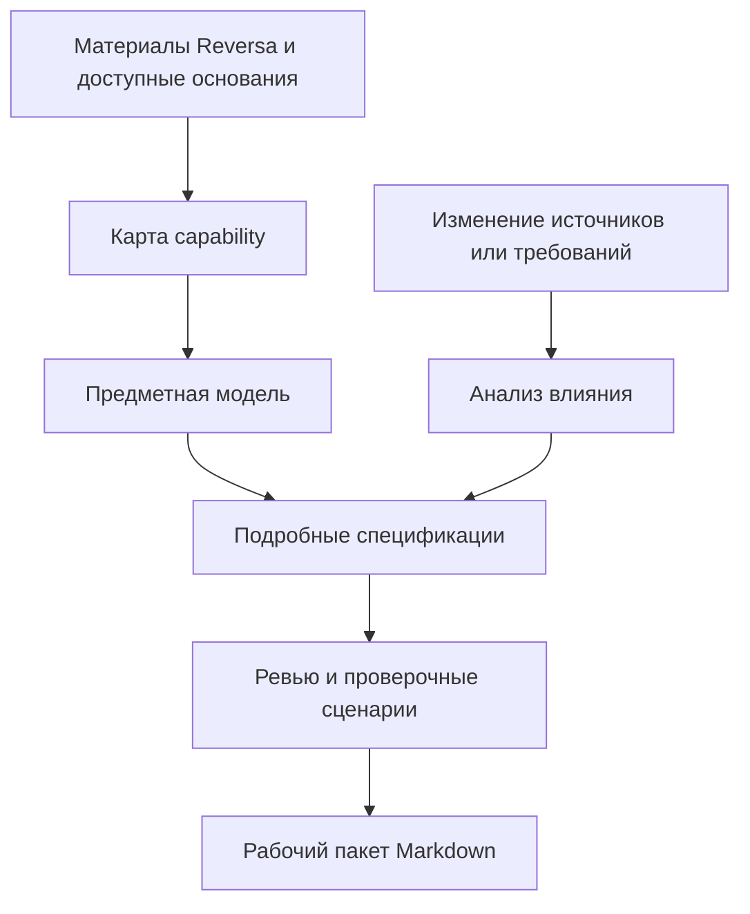

# Reversa Analysis Skills · системная аналитика на русском

Версия 0.1.0. Самостоятельный набор из **7 навыков и 22 шаблонов**, который преобразует материалы Reversa в рабочую системную аналитику: Markdown, Mermaid, таблицы, навигация и связи требований с проверками.

Основной результат — спецификация предметного поведения. Читатель видит capability, данные, алгоритмы, справочники, процессы и состояния; технические основания находятся в отдельном приложении. Набор не является штатной частью Reversa и не изменяет его навыки.

## Начать работу

1. Распакуйте набор и откройте терминал в его корне.
2. Установите навыки в выбранный проект по [инструкции](docs/installation.md).
3. Передайте агенту цель, путь к проекту/материалам Reversa и желаемую область. Готовые запросы — в [сценариях использования](docs/workflows.md).
4. Начните с `reversa-analysis`; для точечной задачи используйте специализированный навык.

```text
node bin/install.mjs --project "../my-project" --agent all
node bin/install.mjs --project "../my-project" --agent all --apply
```

Первый запуск показывает изменения, второй устанавливает. Можно выбрать только `codex`, `claude` или `qwen`. Установщик копирует файлы локально; загрузок из сети и изменений общих инструкций агента нет. Для обновления неизменённых файлов предыдущей установки добавьте `--update`; конфликтующие ручные правки сохраняются.

## Навыки

| Навык | Ответственность | Основной результат |
|---|---|---|
| [reversa-analysis](skills/reversa-analysis/SKILL.md) | Полный цикл и выбор следующего этапа | Связанный пакет в заданной области |
| [reversa-analysis-map](skills/reversa-analysis-map/SKILL.md) | Границы и capability | Карта возможностей и область анализа |
| [reversa-analysis-domain](skills/reversa-analysis-domain/SKILL.md) | Предметная модель | Понятия, логические данные, справочники |
| [reversa-analysis-spec](skills/reversa-analysis-spec/SKILL.md) | Подробная спецификация | FR, правила, алгоритмы, workflow, состояния, доступ, AC |
| [reversa-analysis-review](skills/reversa-analysis-review/SKILL.md) | Смысл и качество | Замечания и фактические результаты проверки |
| [reversa-analysis-sync](skills/reversa-analysis-sync/SKILL.md) | Актуализация | Точечное изменение с сохранением решений и ID |
| [reversa-analysis-docs](skills/reversa-analysis-docs/SKILL.md) | Читательское представление | Markdown, Mermaid, оглавления и ссылки |



Этапы можно выполнять одним агентом последовательно. Набор не требует API подагентов, конкретной модели, MCP, браузера или SDK провайдера. Нужные файлы читаются по мере задачи. Node.js 18.20+ нужен для локальных помощников; сами инструкции и шаблоны доступны как Markdown.

## Что входит в поставку

- Общий стандарт предметного языка, неизвестностей, согласований и разделения AS-IS / TO-BE.
- [22 содержательных шаблона](skills/reversa-analysis/references/template-index.md), включая модель, алгоритм, процесс, требования, приёмку и проект изменения.
- [Контракт реестров](skills/reversa-analysis/references/package-contract.md) и четыре JSON Schema.
- [Команды](skills/reversa-analysis/references/commands.md) `inspect`, `init`, `nav`, `validate`, `impact`.
- Установщик для трёх каталогов агентов с предварительной проверкой конфликтов.
- [Учебный пример библиотеки](examples/library-lending/README.md): 14 связанных документов, пять Mermaid-схем и машиночитаемая трассируемость. Все данные вымышлены.
- Автоматические проверки помощников и [отчёт о границах проверенной совместимости](docs/validation.md).

## Совместимость

Общее ядро использует `SKILL.md` с полями `name` и `description`. Подключение различается по средам: Codex — `.agents/skills`, Claude Code — `.claude/skills`, Qwen Code — `.qwen/skills`. Все семь каталогов переносятся вместе, поскольку специализированные навыки ссылаются на общее ядро. [Подробности и официальные источники](docs/compatibility.md).

Для другого агента дайте ему прочитать основной SKILL.md и обеспечьте доступ ко всему дереву ресурсов. GPT, Qwen и Claude как названия моделей сами по себе не задают способ загрузки файлов: это ответственность агентской среды. Полноценные прогоны во всех названных средах ещё не выполнены; выполненные проверки перечислены в отчёте.

## Проверить поставку

```text
node scripts/check-suite.mjs
node --test tests/toolkit.test.mjs
node bin/analysis.mjs validate --package examples/library-lending
```

Установка npm-зависимостей не требуется. Успех валидатора означает прохождение структурных проверок. Генерацию текста, предметную корректность, рендер Mermaid и тесты исследуемого приложения нужно проверять отдельно. Инициализатор создаёт честный черновик, а не извлекает знания самостоятельно.

## Навигация по руководству

[Установка](docs/installation.md) · [Совместимость](docs/compatibility.md) · [Примеры запросов](docs/workflows.md) · [Проверки](docs/validation.md) · [Стандарт](skills/reversa-analysis/references/standard.md) · [Учебный пакет](examples/library-lending/README.md)
