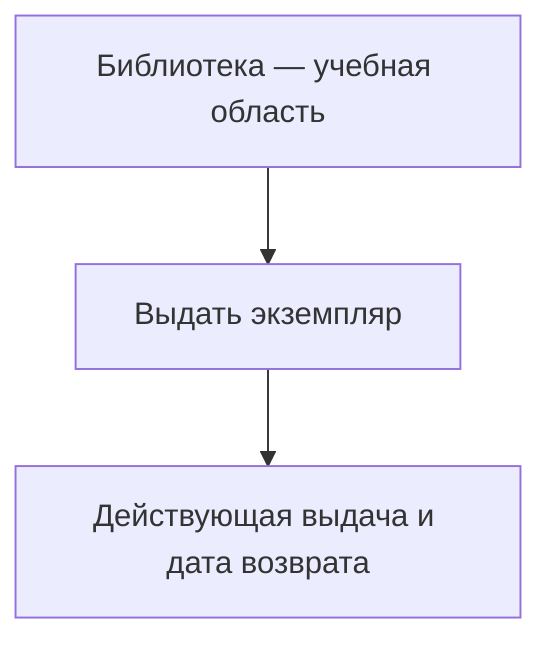

# Библиотека — выдача экземпляра

<!-- rsa:nav:start -->
[Содержание](README.md)

**На этой странице**

- [Назначение](#rsa-назначение)
- [Область описания](#rsa-область-описания)
- [Навигация](#rsa-навигация)
<!-- rsa:nav:end -->

> PAGE-001 · Учебная спецификация TO-BE · Вымышленная предметная область · Черновик

## Назначение

Показать применение набора в другой предметной области. Это учебная спецификация по [вымышленной политике](sources/policy.md); программа и реальные данные не исследовались.

## Область описания

Одна capability: выдача одного экземпляра. Описаны данные, ограничения, расчёт срока, основной поток, состояния и проверки. Возврат и штрафы вне области. Открытые вопросы не выданы за согласованные требования.

## Навигация

Начните с [паспорта](capability.md), затем [требования](requirements.md) → [трассируемость](traceability.md) → [приёмка](acceptance.md). Доказательства — в [приложении](evidence.md).

<!-- rsa:children:start -->
**Документы раздела**

- [PAGE-002 · Границы учебного примера](scope.md)
- [CAP-001 · Выдать экземпляр читателю](capability.md)
  - [ENT-002 · Логические данные выдачи](data.md)
  - [RULE-001 · Правила выдачи](rules.md)
  - [ALG-001 · Определить дату возврата](algorithm.md)
  - [WF-001 · Процесс выдачи](workflow.md)
  - [PAGE-003 · Состояния экземпляра](states.md)
  - [REQ-001 · Функциональные требования](requirements.md)
  - [REQ-002 · Проверочные сценарии](acceptance.md)
  - [PAGE-006 · Матрица трассируемости](traceability.md)
- [ENT-001 · Предметные понятия](domain.md)
- [PAGE-004 · Открытые вопросы](questions.md)
- [PAGE-005 · Доказательства](evidence.md)

[К содержанию](README.md)
<!-- rsa:children:end -->
