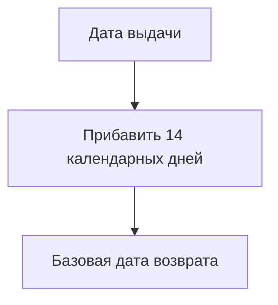

# Определить дату возврата

<!-- rsa:nav:start -->
[Содержание](README.md) · [Библиотека — выдача экземпляра](README.md) → [Выдать экземпляр читателю](capability.md)

**На этой странице**

- [Назначение](#rsa-назначение)
- [Входы и предусловия](#rsa-входы-и-предусловия)
- [Правила и шаги](#rsa-правила-и-шаги)
- [Результаты и исключения](#rsa-результаты-и-исключения)
- [Примеры](#rsa-примеры)
<!-- rsa:nav:end -->

> ALG-001 · Учебная спецификация TO-BE · Вымышленная предметная область · Черновик

## Назначение

Вычислить базовую дату возврата.

## Входы и предусловия

Допустимая дата выдачи; условия выдачи соблюдены.

## Правила и шаги

Прибавить 14 календарных дней к дате выдачи. Время суток и округление не применяются. Политика переноса срока при нерабочем дне неизвестна; базовый расчёт её не моделирует.

## Результаты и исключения

Результат — календарная дата. Для нерабочего дня нужен ответ Q-001 до утверждения полного целевого поведения.

## Примеры

| Выдача | Расчёт | Возврат |
|---|---|---|
| 2026-08-01 | +14 дней | 2026-08-15 |
| 2026-08-25 | +14 дней | 2026-09-08 |

<!-- rsa:children:start -->
[К содержанию](README.md)
<!-- rsa:children:end -->
