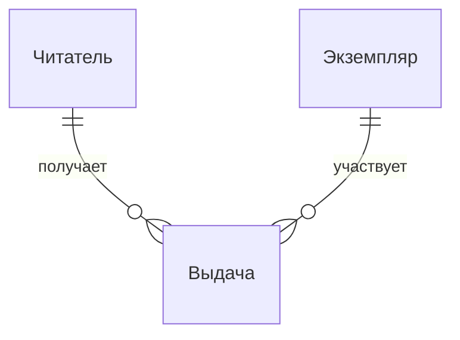

# Предметные понятия

<!-- rsa:nav:start -->
[Содержание](README.md) · [Библиотека — выдача экземпляра](README.md)

**На этой странице**

- [Назначение](#rsa-назначение)
- [Сущности и атрибуты](#rsa-сущности-и-атрибуты)
- [Связи и инварианты](#rsa-связи-и-инварианты)
- [Неизвестные условия](#rsa-неизвестные-условия)
<!-- rsa:nav:end -->

> ENT-001 · Учебная спецификация TO-BE · Вымышленная предметная область · Черновик

## Назначение

Определить читателя, экземпляр и выдачу.

## Сущности и атрибуты

| Понятие | Определение |
|---|---|
| Читатель | Участник, которому передают экземпляр; действующий либо заблокированный |
| Экземпляр | Одна физическая копия книги |
| Выдача | Связь передачи конкретного экземпляра конкретному читателю с датами |

## Связи и инварианты

Каждая выдача относится к одному читателю и одному экземпляру. Экземпляр может иметь историю выдач, но не более одной действующей; у читателя не более трёх действующих. Схема показывает историю, ограничения действующих записей заданы текстом.

## Неизвестные условия

Возврат и прекращение выдачи вне области; из схемы не следует наличие физической таблицы или обязательного хранения истории.

<!-- rsa:children:start -->
[К содержанию](README.md)
<!-- rsa:children:end -->
