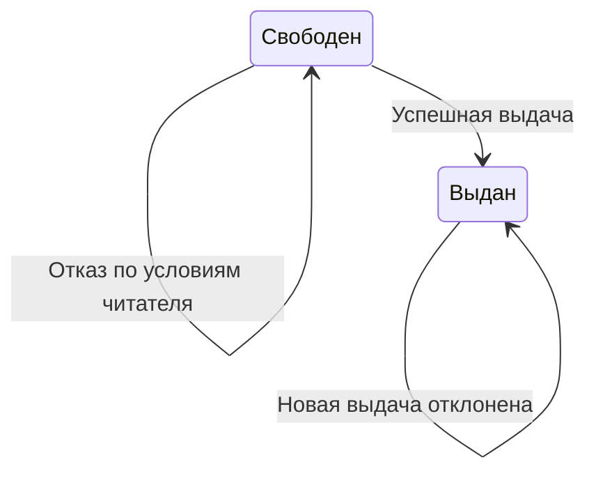

# Состояния экземпляра

<!-- rsa:nav:start -->
[Содержание](README.md) · [Библиотека — выдача экземпляра](README.md) → [Выдать экземпляр читателю](capability.md)

**На этой странице**

- [Назначение](#rsa-назначение)
- [Состояния](#rsa-состояния)
- [Переходы](#rsa-переходы)
- [Ограничения](#rsa-ограничения)
<!-- rsa:nav:end -->

> PAGE-003 · Учебная спецификация TO-BE · Вымышленная предметная область · Черновик

## Назначение

Показать изменение доступности только при выдаче.

## Состояния

Свободен — нет действующей выдачи. Выдан — действует выдача экземпляра.

## Переходы

## Ограничения

Обратный переход выполняется процессом возврата, который не описан в примере. Не добавляем его условия предположением.

<!-- rsa:children:start -->
[К содержанию](README.md)
<!-- rsa:children:end -->
