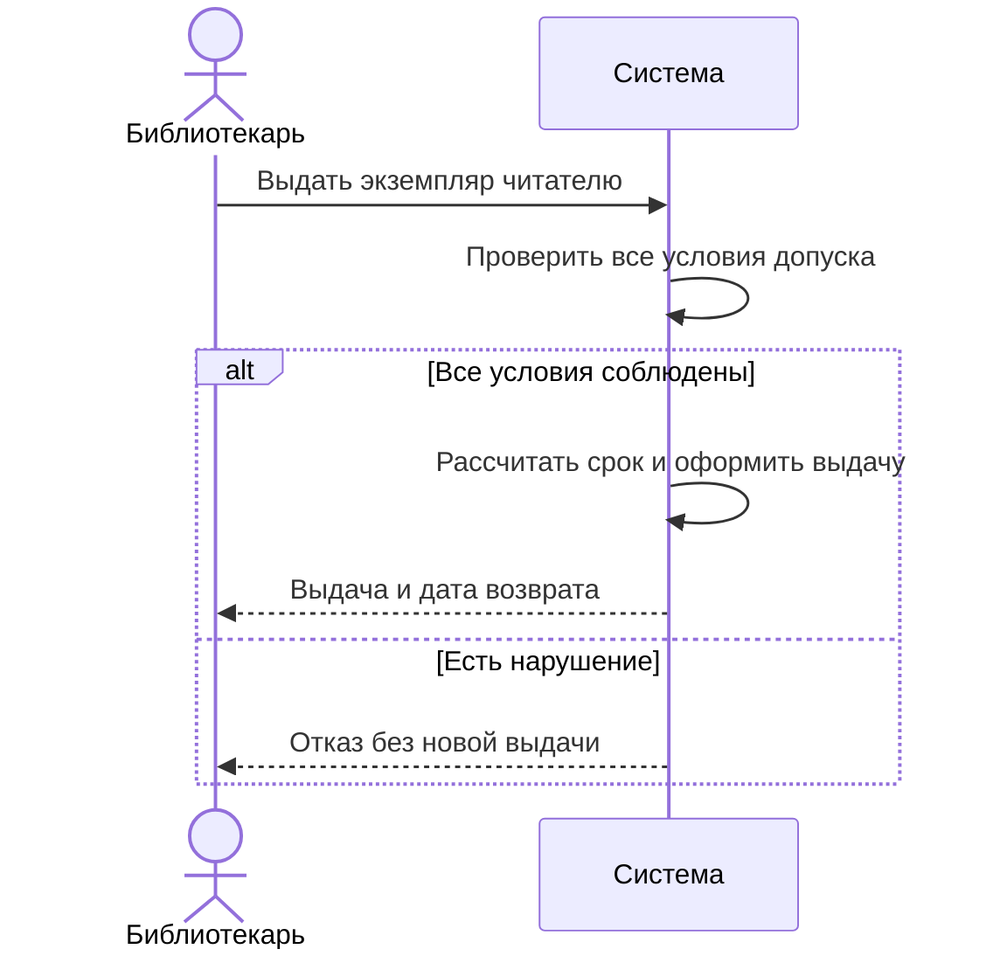

# Процесс выдачи

<!-- rsa:nav:start -->
[Содержание](README.md) · [Библиотека — выдача экземпляра](README.md) → [Выдать экземпляр читателю](capability.md)

**На этой странице**

- [Назначение](#rsa-назначение)
- [Участники и запуск](#rsa-участники-и-запуск)
- [Основной поток](#rsa-основной-поток)
- [Альтернативные исходы](#rsa-альтернативные-исходы)
- [Постусловия](#rsa-постусловия)
<!-- rsa:nav:end -->

> WF-001 · Учебная спецификация TO-BE · Вымышленная предметная область · Черновик

## Назначение

Описать наблюдаемое взаимодействие библиотекаря с системой.

## Участники и запуск

Библиотекарь выбирает читателя, экземпляр и дату. Данные проверки доступны.

## Основной поток

Проверить три условия допуска как совокупность. При соблюдении условий рассчитать дату возврата, создать выдачу и пометить экземпляр выданным.

## Альтернативные исходы

Заблокированный читатель, превышенный лимит или занятый экземпляр приводят к отказу. При нескольких причинах порядок сообщения не определён (Q-002). Сетевые повторы и конкурентность не специфицированы.

## Постусловия

Успех: одна новая действующая выдача, экземпляр выдан. Отказ: новая выдача отсутствует, состояние экземпляра прежнее.

<!-- rsa:children:start -->
[К содержанию](README.md)
<!-- rsa:children:end -->
