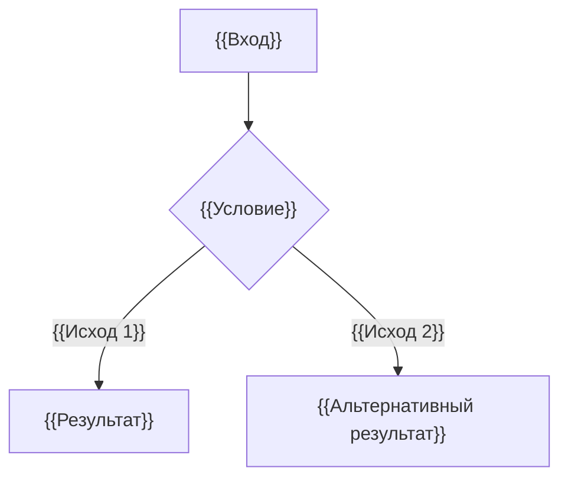

# {{Название — Алгоритм}}

> {{ALG-ID}} · {{AS-IS / требование / предложение}} · {{Статус и версия}}

## Назначение

{{Предметный результат расчёта.}}

## Входы и предусловия

| Вход | Смысл / единица | Допустимое значение | Отсутствие / ошибка |
|---|---|---|---|
| {{Вход}} | {{Смысл}} | {{Диапазон}} | {{Исход}} |

## Правила и шаги

1. {{Начальные условия.}}
2. {{Порядок, формулы и ветвления.}}
3. {{Округление, время, завершение.}}

## Результаты и исключения

{{Выход, единицы, границы, пустые данные, неоднозначность и неизвестные условия.}}

## Примеры

| Дано | Шаги расчёта | Результат | Основание / статус проверки |
|---|---|---|---|
| {{Входные значения}} | {{Вычисление}} | {{Точное значение}} | {{Как проверено}} |
