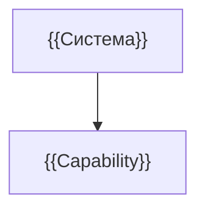

# {{Название — Карта возможностей}}

> {{PAGE-ID}} · {{AS-IS / требование / предложение}} · {{Статус и версия}}

## Назначение

{{Назначение системы и принцип разделения возможностей.}}

## Область описания

| ID | Capability / результат | Участники | Вход → выход | Зависимости | Глубина |
|---|---|---|---|---|---|
| {{CAP-ID}} | {{Результат}} | {{Участник}} | {{Вход → выход}} | {{Связи}} | {{Статус}} |

## Навигация

{{Ссылки на реальные паспорта, без пустых страниц.}}
