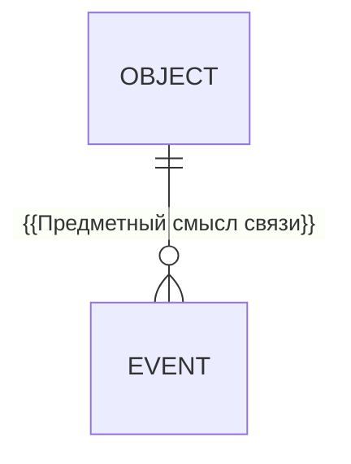

# {{Название — Предметная модель}}

> {{ENT-ID}} · {{AS-IS / требование / предложение}} · {{Статус и версия}}

## Назначение

{{Область модели и её границы.}}

## Сущности и атрибуты

| Понятие | Определение | Идентичность | Основные свойства |
|---|---|---|---|
| {{Понятие}} | {{Смысл}} | {{Что отличает объект}} | {{Логические свойства}} |

## Связи и инварианты

| Связь | Кратность | Обязательность / инвариант |
|---|---|---|
| {{Сущности}} | {{Кратность}} | {{Условие}} |

{{Заменить учебные ID/кратность на подтверждённые предметные связи.}}

## Неизвестные условия

{{Вопросы и влияние либо подтверждённое отсутствие пробелов в выбранной области.}}
