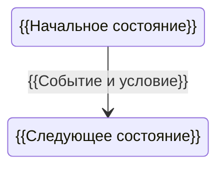

# {{Название — Состояния}}

> {{PAGE-ID}} · {{AS-IS / требование / предложение}} · {{Статус и версия}}

## Назначение

{{Жизненный цикл какого объекта описан.}}

## Состояния

| Состояние | Предметное определение | Разрешённые операции |
|---|---|---|
| {{Код}} | {{Смысл}} | {{Действия}} |

## Переходы

| Из | Событие и условие | В | Эффект / отказ |
|---|---|---|---|
| {{Состояние}} | {{Условие}} | {{Состояние}} | {{Эффект}} |

## Ограничения

{{Недопустимые переходы, порядок и конкуренция, если применимо.}}
