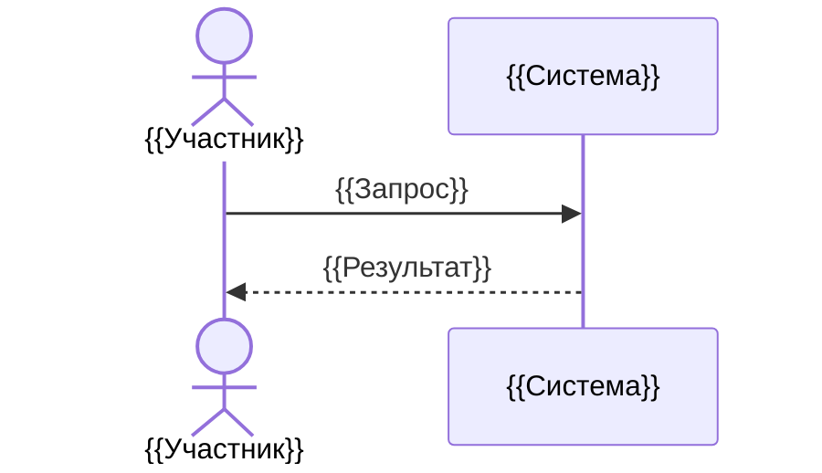

# {{Название — Рабочий процесс}}

> {{WF-ID}} · {{AS-IS / требование / предложение}} · {{Статус и версия}}

## Назначение

{{Результат процесса и граница системы.}}

## Участники и запуск

{{Предметные участники, событие запуска, предусловия.}}

## Основной поток

| Шаг | Участник | Действие / информация | Результат |
|---|---|---|---|
| {{N}} | {{Кто}} | {{Что делает}} | {{Наблюдаемый исход}} |

## Альтернативные исходы

| Условие | Действие | Состояние после | Повтор / отмена |
|---|---|---|---|
| {{Условие}} | {{Действие}} | {{Состояние}} | {{Гарантия}} |

## Постусловия

{{Что обязательно верно после успеха и каждого значимого отказа.}}
